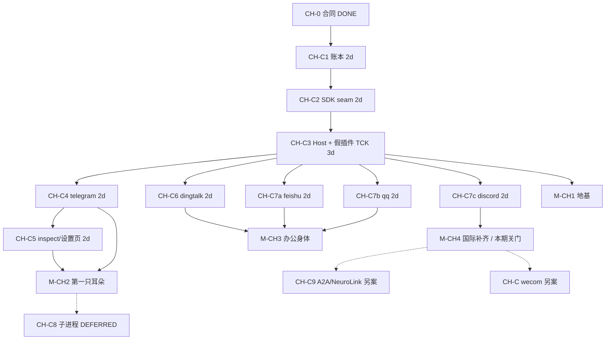
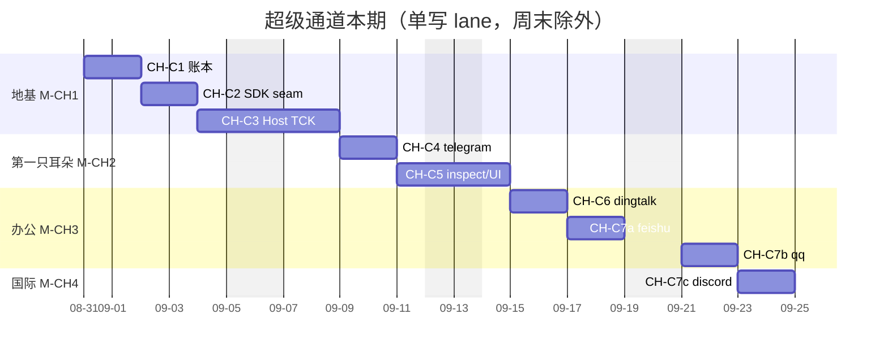

# AGENT-VIVY V0 — Project TODO Board

> Status: living board. V0–Studio tracks are **closed**; remaining work is §0.1.
> Archive of closed tracks: `docs/logs/2026-08-25-todo-board-archive/`.
> Milestones map to PRD §11 (M0–M4). Acceptance anchors cite PRD FR/AS/D ids.
> Architecture reference: `IMPLEMENTATION-PLAN.md`.
> Updated: 2026-09-07
> Development environment: `docs/architecture/VIVY-STUDIO.md`. Studio is the first-party daily IDE; other authorized tools work directly in this repository with their own capabilities.

---

## 0. Start posture (read first)

Per `GO-NOGO-PREFLIGHT.md` §8(b), V0 starts with the soft requirements below
accepted as **RISK ACCEPTED** with monitors, rather than closed first:

| Item | Posture | Monitor |
|---|---|---|
| SR-1 ADR baseline missing (D-035) | CLOSED | `docs/AGENT-VIVY-ARCHITECTURE-V0.md` authored 2026-08-08 |
| SR-2 Eino §6 claims unverified (D-034) | CLOSED | Verified by task **A1** — see `eino-capability-verify.md` (2026-08-07) |
| P0-3 PRD v0.5 final confirmation | RISK ACCEPTED | User sign-off tracked here; treat v0.5 as final until told otherwise |
| P0-4 SR acceptance posture | RESOLVED | This table is the acceptance record |

Gate rule: **A1 must pass before any C6 approval/interrupt work.** If A1 shows
Eino interrupt/resume cannot meet the Vivy Run state machine, C6 switches to
the outer-loop fallback (RK-3 stop-loss) and this board is re-planned.

> **GATE CLEARED (2026-08-07):** A1 verdict is **GO** — checkpoint-bridge
> approach verified against online Eino v0.9.13 (`docs/eino-capability-verify.md`,
> commit `fe81075`). C6 may proceed once its remaining predecessors (B4, C3)
> land; no outer-loop fallback needed.

## 0.1 Open remaining (2026-08-25)

Everything in §1–§8, §9.1–§9.9, §11–§13, and HITL-01..07 P0 is **done**.
Do not pick work from those tables. Closed-track filing:
`docs/logs/2026-08-25-todo-board-archive/summary.md`.

| ID | Item | Status | Notes |
|---|---|---|---|
| PROJ-INSTR-SCAN | 启动目录自动扫描 AGENTS.md 与项目 SKILL | DONE 2026-09-06 | Eino 只负责注入（agentsmd / skill middleware），不扫描 cwd。内核发现层 walk-up 到 git root 收集 AGENTS.md，并 overlay `.agents/skills` / `.vivy/skills`（只读）。`vivy.exe` / `vivy-code` / `vivy tui` / `vivy run` 同路径。不打开 web 的 host `@file`。Filing: `docs/logs/2026-09-06-project-instruction-scan/`。 |
| EINO-BOUNDARY-AUDIT | 复核 Vivy 自研与 Eino/EinoExt 原生能力的边界 | OPEN — 5.1/5.2/5.5/5.6 DONE 2026-09-06 | §5.1：`MCPBackend` 使用 Eino MCP `GetTools` 做官方 tools/schema 转换，以 mcp-go v1.0.0 typed Streamable HTTP 保留 resources/prompts/lifecycle；Vivy 的 mcp_list_tools/mcp_call、PrepareMCPCall、isError、untrusted/bounds 与 settings/app lifecycle 不变。§5.2：动态 active 工具接入 pinned Eino v0.9.13 官方 middleware，固定核心、allowlist、Skill mount、Policy/HITL/审计与二次检查继续由 Vivy 拥有，旧搜索/可见面及 Registry 兼容壳已清理。§5.5：保留 `observingChatModel`，因为 Eino `OnEndWithStreamOutput` 是 sibling Copy，不能提供 Begin 标记、有界背压、persist fail-closed、tool barrier。§5.6：去掉 Command/HTTP/MCP/SequentialThinking/WebFetch/Download 的误导性 `Eino` 前缀。Eino 当前未覆盖 MCP resources/prompts/lifecycle；stdio/OAuth/continuous listening 未做。Sequential Thinking 与 plantask 兼容面仍 OPEN，track 不关闭。记录：`docs/research/eino-boundary-audit-2026-09-05.md`、`docs/logs/2026-09-06-eino-native-mcp/`、`docs/logs/2026-09-06-eino-toolsearch/`、`docs/logs/2026-09-06-eino-boundary-stream-observer-naming/`。 |
| TUI-STREAM-P0 | 修复 provider→Journal→RPC→TUI 的真实流式背压与文本保真 | DONE 2026-09-04 | runtime mapper 逐 chunk 立即持久化/发布，不再 EOF 后突发；durable `run/event` 使用 context-aware bounded backpressure，不再因 64 帧队列满而静默断订阅；超大 delta 拆分不截字；shared renderer 使用安全 ANSI 清洗与 grapheme/cell word-wrap，中文、emoji、既有空白均不被重建。见 `docs/logs/2026-09-04-vivy-code-live-stream-backpressure/`。 |
| TUI-STREAM-N1 | 收敛 plain REPL 与 fullscreen TUI 的 durable stream 语义 | DONE 2026-09-04 | plain REPL 已携 shared cursor、run/subscription epoch、seq gap 检测、Journal replay、跨 run/旧订阅过滤、`run/stream_error` 恢复及终态清理；通知入口不阻塞，满载转 durable replay；连续恢复失败会取消当前 run 并归还提示符。见 `docs/logs/2026-09-04-vivy-code-stream-driver-lifecycle/`。 |
| TUI-STREAM-N2 | TUI 重订阅资源与 inbox 内存上界 | DONE 2026-09-04 | built-in/packed fullscreen 保存真实 `subscription_id`，换订阅、Close、会话切换均清理并带 epoch fence；收件箱同时按条目与 UTF-8 字节设界，溢出清空不完整后缀并以 durable replay 恢复，UI 每 tick 有界消费。见 `docs/logs/2026-09-04-vivy-code-stream-driver-lifecycle/`。 |
| TUI-STREAM-N3 | 补齐 `model.completed` 的非流式最终文本投影 | DONE 2026-09-04 | shared notice 为 completion 建立独立显式字段，fullscreen 把 `content` 作为该模型轮权威全文（含空值），plain REPL 对正常 delta 前缀只补尾、不重复；`model.request`、reasoning、tool、gate、done 均封闭旧轮。mapper 同时修复“assistant 文本与 tool call 同帧”未清 pending 导致下一轮串文。内置/packed wire 测试覆盖 completed-only 与同名 tool call。见 `docs/logs/2026-09-04-vivy-code-completed-tool-identity/`。 |
| TUI-STREAM-N4 | 收敛 `model.completed.content` 与单事件 payload 上界的契约冲突 | DONE 2026-09-05 | 新事件使用 v2：完整正文无损拆为 bounded `model.delta`，唯一 `model.completed` 仅提交 SHA-256 与 UTF-8 byte length；旧 v1 Journal 的权威 `content` 永久兼容。内置/packed TUI、headless、trajectory 与 MessageStore projector 按显式版本消费，未知版本响亮失败。见 `docs/logs/2026-09-05-durable-assistant-projection/`。 |
| TUI-STREAM-N5 | durable stream 防御性契约收紧 | OPEN | 2026-09-04 lifecycle 末轮审计的非阻塞 P3：shared Decode 可进一步要求非空 `subscription_id`/`run_id`；generic `run/subscribe` 在 `after_seq >= terminal_seq` 的空 replay 情形仍等待 peer Close；公开 `Inbox.Take()` 会隐藏 replay flag；REPL `streamLost` 可增加 run epoch 并最终迁入 shared Inbox/Projection；`Live.Close` 对完全未交付的 subscribe response 仍以外层 peer Close 为最终所有权边界。当前生产服务端均发送 ID、两套 Live 不会在终态后重订阅，故不阻塞 N1/N2 交付。相关路径 `sdk/tui/stream`、`internal/rpc/control.go`、`internal/tui/repl.go`。 |
| TUI-STREAM-N6 | tool-call 前导 assistant 文本进入 durable Message 历史 | DONE 2026-09-05 | Journal replay projector 在 `tool.requested` 边界落前导 assistant 行，并投影 call/result/final assistant；确定性 ID、严格冲突检查、旧随机行认领使重放幂等。边界事件发布前投影，下一轮上下文与 `session/messages` 读取前均可从 Journal 修复崩溃窗口。见 `docs/logs/2026-09-05-durable-assistant-projection/`。 |
| TUI-PROJECTION-ORDER | MessageStore 显式保存 Journal source seq 作为跨时钟稳定顺序 | OPEN | 2026-09-04 durable projector 已用事件时间与含 seq 的确定性 ID 保存同毫秒内顺序；最终审查指出若系统时钟在同一 run 中回退，现有 `ORDER BY created_at,id` 仍可能偏离 Journal seq。后续需为派生消息增加 source run/seq/order 列或独立 projection mapping，并完成 SQLite/Postgres migration 与 fork/rewind 兼容测试。当前 mapper 单进程事件时间通常单调，此项不阻断 N4/N6 数据完整性闭环。 |
| UI-STREAM-N1 | 浏览器聊天补齐 completed-only 最终文本投影 | OPEN | 2026-09-04 TUI 完成语义复审顺带确认浏览器 `ui/src/lib/store.ts` 的实时与 replay 投影仍只累计 `model.delta`，不消费 `model.completed.content`；纯非流式/特殊 adapter 可能在网页端看不到答案。该项不属于本轮 VIVY CODE TUI 写 lane，后续须与 TUI 一致建立轮次 fence，并避免 delta+completed 重复。 |
| TUI-TOOL-N1 | TUI tool 卡片按 `tool_call_id` 配对而非工具名 | DONE 2026-09-04 | `tool_call_id` 已贯通 shared notice、gate、surface card 与历史映射；非空 ID 严格精确配对，旧 Journal 的空 ID 才保留工具名兼容回退。内置/packed wire 测试以两个同名并发调用验证只结算目标卡片。见 `docs/logs/2026-09-04-vivy-code-completed-tool-identity/`。 |
| TUI-TOOL-DIFF-ENVELOPE | `tool.finished` 的真实 untrusted-output 信封内结构化 diff 提取 | DONE 2026-09-05 | `DisplayToolResult` 仅剥离 runtime 的精确固定 untrusted 信封后再按 typed mutation JSON 解码；任意其他文本不猜测。mapper 同时按完整编码 payload 预算裁减 multimodal Parts，省略时写明确标记。见 `docs/logs/2026-09-05-vivy-code-split-diff/`。 |
| TFLAKE-CRON-AT-DISABLE | `TestCronAtJobDisablesAfterRun` 在 full-suite 负载下 5s 超时 | DONE 2026-09-05 | 根因是测试将 one-shot 仅设在启动后 80ms；并行负载下 recovery 会按产品契约把它判为已错过并禁用，根本没有 run 可等待。两个 at 接线 fixture 改为 500ms 启动裕量、15s 有界 settle；目标测试 `-count=10` 通过。 |
| TFLAKE-CRON-RECOVERY | `TestCronRecoveryPastDueRecurringJobFiresOnceOnWakeAndSkipsStorm` 满载 5s 窗口偶发错过断言态 | OPEN | 2026-09-04 stream-driver lane 首次 `just ci` 中，任务已成功执行且 `LastStatus=ok`，但 200ms recurring schedule 在断言窗口继续推进 `NextRunAtMs`，测试未命中其短暂 wanted state；属于真实时钟/轮询接线金丝雀的不稳定窗口，与本轮 TUI 代码无关。隔离复跑结果记录在本轮 verification；后续改为确定性 recovery/skip-storm 契约或稳定最终谓词。相关路径 `internal/runtime/cron_scheduler_test.go:370`。 |
| TFLAKE-CRON-DELETE-RECURRENCE | `TestCronAtJobDeletesAfterSuccessfulRun` 的 30s 接线金丝雀再次偶发超时 | OPEN | 2026-09-04 stream-driver lane 第二次 `just ci` 与三项 cron 组合重复跑均观察到：job 已禁用但 run/settle 尚未推进到删除；同一当前树单独 `-count=1` 1.142s 通过。原 `TFLAKE-CRON` 的确定性 settle 契约仍绿，但接线金丝雀在满载下并未真正稳定；需改为确定性调度触发或拆分 fire/run/settle 的可观测等待。相关路径 `internal/runtime/cron_scheduler_test.go:190`。 |
| TFLAKE-CRON-MANUAL-SETTLE | `TestCronTriggerManualConflictAndDisabledJob` 满载时未在 2.5s 内观察到 active run 清理 | OPEN | 2026-09-05 dynamic-command lane 首次 `just ci` 唯一失败；隔离 `-count=10` 20.771s 全绿，确认不是动态命令改动导致。与其他 cron 金丝雀相同，后续应把真实时钟 settle 断言改为确定性终态/稳定等待，而非继续放大短轮询窗口。相关路径 `internal/runtime/cron_scheduler_test.go:144`。 |
| TUI-PARITY-2 | VIVY CODE 次级 Crush 呈现控制：split diff 切换、图片附件入口、模型档位与 token/cost 状态展示 | DONE 2026-09-05 | 思考档位、图片附件、全局模型选择与审批 diff 已闭环；token/cost 右栏现显示 Crush 式上下文占比与高压警示，并补齐 session input/output/reasoning/cached/request/参考成本。估算 token 显式 `~`，未知模型窗口不暴露 128k 内部回退值，未知/部分价格不伪装 `$0`；built-in/packed 共用 projection/view。见 `docs/logs/2026-09-05-vivy-code-token-cost/`。 |
| TUI-USAGE-ACCOUNTING | 补齐 provider 调用的 route/source 归因与统一 cost-known 契约 | OPEN | 2026-09-05 已完成 main/child/summary 的 provider/model/source 归因、child cached token、summary override/failover 路由、SQLite/Postgres 确定性投影与 CN-26，并将 sidebar/global stats 统一为 all-priced；cached 有值但缺专用参考价时 fail-closed，unknown 金额清零。`stats/tokens.scope=chat_runs` 与 UI/TUI 明示自动标题、手动 session compaction 不在统计范围。剩余：若产品要求全 provider 账单，需为这两类 run 外辅助调用新增 session-scoped usage recorder；provider catalog 具备已核验缓存价后再填 `CachedInputPerMTokens`，不得猜价。见 `docs/logs/2026-09-05-vivy-code-usage-accounting/`。 |
| TUI-MODEL-QUEUE-AFFINITY | 跨客户端本地排队 turn 的模型归属语义 | OPEN | 2026-09-05 模型选择审计确认：每个 fullscreen 客户端会在自身存在 queue 时拒绝换模，服务端会在 active/suspended/child run 时拒绝，但另一个客户端无法观察本地尚未提交到服务端的 queue。当前明确语义为 queued turn 在真正 `turn/start` 时采用当时的全局 active route；若产品要“入队时锁定模型”，需扩展 typed turn contract 携 provider/model/base-url identity 或引入服务端队列，不得仅在 UI 猜测。相关路径 `internal/tui/live.go`、`faces/tui/live.go`、`internal/rpc/control.go`。 |
| TUI-ATTACH-HARDEN | 附件路径解析补齐 Windows ADS、敏感路径 denylist 与读取后 identity 复核 | DONE 2026-09-04 | `internal/rpc/attachments.go` 现拒绝所有冒号/ADS 路径，复用 project-context 敏感路径策略，使用 `os.Root.Lstat` 逐组件拒绝 symlink/junction（不解析外部 UNC target），并在打开前、读取期间、读取后比较 rooted file identity、size/mtime；替换、逃逸或变更均 fail closed 且错误不泄露路径。见 `docs/logs/2026-09-04-tui-attachment-hardening/`。 |
| STORAGE-ATTACH-PG-TEST | 补齐 Postgres 附件/FileContext 持久化对等测试 | OPEN | 2026-09-04 附件安全复审确认 SQLite/Postgres schema 与事务实现对等，但现有 Postgres 测试未像 SQLite/控制面一样覆盖附件与 FileContext 的 round-trip、空 body、fork/delete。该项是存储测试债，不影响本轮纯 resolver 加固；应在具备 Postgres 测试服务的存储 conformance 波次补齐。 |
| TUI-SIDEBAR-N1 | Crush 右栏当前会话/工作区真值闭环 | DONE 2026-09-05 | `session/sidebar` 以持久 `updated_at`、ControlDeps.ProjectRoot、runtime 当前 model/provider/reasoning、session usage/cost（未知价格显式区分）及有界 `file_versions` 聚合为唯一快照；SQLite/Postgres、conformance、built-in/packed live、shared view 与独立键盘滚动均对齐。见 `docs/logs/2026-09-05-vivy-code-sidebar-truth/`。 |
| TUI-SIDEBAR-N1-OPEN | 右栏后续真值扩展 | OPEN | 2026-09-05 已交付安全子集：MCP 右栏来自 live backend，严格区分 effective `configured` 与完成握手的 `initialized`，`/mcp` 后即时刷新；Skills 只显示 runtime middleware 同源的 enabled catalog，不冒充 mounted；built-in/packed fullscreen 均启用 Crush 式点击聚焦、滚轮滚动及固定 Logo；packed LSP 插件通过 SDK 可选 status owner 只投影该 session 最新 primary run 的已存在 workspace 中 `starting`/`initialized` 进程，不启动、不探测、不跨 workspace，退出态由 5s TTL 移除，见 `docs/logs/2026-09-05-vivy-code-lsp-sidebar/`。仍缺 MCP error/auth/count/event 状态、skill→session mount provenance，以及 LSP bounded failure/exited history 与 workspace diagnostics aggregates；主聊天 viewport/鼠标滚动见 `docs/logs/2026-09-05-vivy-code-chat-viewport/`。 |
| TUI-VIEWPORT-N1-OPEN | 主聊天 viewport 的稳定锚点与超长历史缓存 | OPEN | 2026-09-05 已交付行级真实 viewport、follow/pause、PgUp/PgDn/Home/End、Crush 式 pointer-region 滚轮路由、overlay 隔离、会话切换复位及 ANSI/grapheme/窄窗口安全；右栏现在无需先点击，悬停滚轮即滚动右栏，同时不窃取键盘焦点，见 `docs/logs/2026-09-05-vivy-code-pointer-wheel/`。后续非阻塞优化：当前 paused offset 是渲染行号而非 message/segment anchor，若旧位置上方内容继续增长会产生相对位移；每次 clamp/help/render 仍重复渲染整段历史；active session 被删除后 ID 会先切换、历史稍后加载的既有异步边界需建立显式 loading epoch。相关路径 `sdk/tui/view`、`internal/tui/live.go`、`faces/tui/live.go`。 |
| TUI-CMD-N1 | 暴露高级 TUI 命令 `/compact`、`/fork`、`/rewind`、`/todos`、`/stats`、`/skills`、`/mcp` | DONE 2026-09-04 | 共享 fullscreen/REPL 命令面已接真实 RPC，并扩展 `/files`、`/tools`；参数校验、变更确认、重复调用屏障与变更后会话收敛已落地。统计明确为聚合值，skills/MCP 明确为 catalog/configured/probe，压缩无需执行时明确 `skipped`。见 `docs/logs/2026-09-04-vivy-code-advanced-commands/`。 |
| TUI-CMD-PALETTE | fullscreen 可过滤命令面板 | DONE 2026-09-04 | shared `sdk/tui/view` 以 `DefaultRegistry().Specs()` 为唯一真值；裸 `/`/Ctrl+P 打开，name/alias/usage/description 模糊过滤，键盘循环导航、选择回填 canonical command 后复用原 parser/validator/confirm/dispatch，`//` literal 与 gate/session/result 优先级保持。built-in/packed wrapper 同覆盖。见 `docs/logs/2026-09-04-vivy-code-command-palette/`。 |
| TUI-CMD-N3 | 动态 user-invocable skills 与 MCP prompts 进入命令面板 | DONE 2026-09-05 | `commands/list`/`commands/expand` typed contract 聚合 enabled+user-invocable skills 与 MCP `prompts/list/get`；fullscreen/REPL、built-in/packed 共用动态 slash 目录、真实 usage、每次开面板刷新及 request/session/id fence。静态冲突、陈旧技能/prompt、非法参数、非文本 MCP content 与未可信显示文本均 fail closed。见 `docs/logs/2026-09-05-vivy-code-dynamic-commands/`。 |
| TUI-CMD-N4 | 动态命令异步状态后续收口 | OPEN | 2026-09-05 末轮只读审查发现但按本轮“四个 P1 后冻结范围”决策延后：晚到 boot 结果可覆盖更新后的动态目录；展开成功后若 `Driver.Send` 因 load transition 拒绝，原 slash draft 未恢复；pending expansion 尚未锁住编辑与次级 surface。后续须以统一 catalog/expansion epoch 修复并覆盖 boot-vs-refresh、send-nil、pending 编辑/overlay 测试。相关路径 `internal/tui/live.go`、`faces/tui/live.go`、`sdk/tui/view/model.go`。 |
| TUI-CMD-N5 | 动态命令 P2 parity 与资源清理 | OPEN | 2026-09-05 审查 P2 统一收账：plain REPL 目录仅启动加载，缺少运行中 skill/MCP 变更刷新；fullscreen refresh 成功未清理旧 `lastErr`；Esc 仅废弃 UI request、未取消最长 15s 的后台 expansion RPC；session mismatch 与重开 palette 的 overlay 优先级需钉死；REPL list/expand、真实 mixed MCP server、capability 缺失及刷新恢复测试仍可扩充；若要求严格 Crush skill prompt 形状，还需评估 escaped `<loaded_skill>` 信封，而非当前等价纯文本指令。按用户指令不在本轮实现。相关路径 `internal/tui/repl.go`、`internal/tui/live.go`、`faces/tui/live.go`、`sdk/tui/view`、`internal/runtime/mcp_backend.go`、`internal/rpc/control.go`。 |
| TUI-MCP-RESOURCES | 为 `/mcp` 提供真实 MCP resources/list 与 resources/read 的只读查看面 | DONE 2026-09-04 | shared command/view、内置与 packed TUI、legacy REPL 均路由 `settings/mcp/resources` 与 `settings/mcp/read`；backend 支持 JSON/SSE、响应/内容上界与 `untrusted` 标记。资源只经控制面返回，不挂载、不写 tenant data、不自动送模型。见 `docs/logs/2026-09-04-vivy-code-mcp-resources/`。 |
| TUI-CMD-N2 | 为 `!` shell 与 `@` workspace reference 提供受治理的本地命令协议 | DONE 2026-09-04 | `@file` 已完成安全解析、durable FileContext 与三套 TUI 链路（`docs/logs/2026-09-04-vivy-code-shell-file/`）。`!` 已完成 server-owned `shell/start` 与 model-free `RunShell`：严格两字段 RPC/capability、ValidateArgs/Safety、policy/hooks/classifier、durable approval/restart/cancel/expire/单终态、sanitized Journal/message history、bounded redacted output、foreground-only timeout（不收养后台 job），并硬拒 network/后台/host path/父级穿越/危险重定向；TUI 无本地 exec 或模型 fallback。见 `docs/logs/2026-09-04-vivy-code-governed-shell/`。 |
| TUI-FILE-COMPLETE | fullscreen `@文件` 项目补全面板 | DONE 2026-09-04 | shared view 以 120ms debounce 调用 `project-context/list query`，服务端先过滤再施加 200 项上限；请求号、query、active session 三重 fence 丢弃旧响应，候选只含安全 metadata，列表阶段仅 8 KiB 文本探测且有 4,000 项访问预算。Enter/Tab 回填 parser-safe 引用，含 Unicode 空白、引号、Windows 分隔符的路径可往返；built-in/packed 共用视图并各自通过真实 RPC seam。见 `docs/logs/2026-09-04-vivy-code-file-completion/`。 |
| TUI-WORKSPACE-OWNERSHIP | `/files` 的 run workspace RPC 补 run/session ownership 校验 | OPEN | 2026-09-04 `@文件` 安全审计发现独立既有面：`workspace/list/read` 当前可对格式正确但未知的 run id 调用 `WorkspaceFiles.Ensure`，控制面未先证明该 run 属于当前 session/client，且未知 id 可能创建目录。该接口不参与本轮 project-context 补全，后续应在 Ensure 前查 run/session ownership、未知 run fail closed，并补控制字符与 symlink/race 覆盖。相关路径 `internal/rpc/control.go`、`internal/runtime/workspace_files.go`。 |
| VC-0A | VIVY CODE 进程形态修订：第一方独立 `vivy-code.exe`，共享 Vivy 配置但每实例隔离 Journal/会话/运行记录，可与多个 TUI、网页版并发 | DONE 2026-09-04 | 用户新决策明确覆盖 VC-0/D1 的“非独立二进制、共享 Journal”旧结论；仍复用同一 kernel/app/runtime/provider/tool/FaceHost，不形成第二套内核，不带 channel，不修改 Studio。实现与验收见 `docs/logs/2026-09-04-vivy-code-independent-binary/` |
| VC-0A-N1 | VIVY CODE 私有实例目录的保留、清理与命名恢复策略 | OPEN | 当前每次启动创建唯一 `code-instances/<instance>/`，避免共享会话与租约冲突并保留本次运行证据，但长期会累积；待明确产品是否需要自动过期清理或显式恢复某个私有实例。不得退回多个进程共享 Journal。 |
| PLG-1 | 插件扩展面收窄拍板：seam 四值闭集 + grants 八词闭集 + 单一 `Plugin` 接口（仅 Tools）使 Vivy 插件能力远窄于 DSH Cordis（~55 ctx 服务 key + 类型化事件）；`SeamProvider` 有名无实（内核零消费者）；方向已定为 **port 开放端口标准**（core port 目录 + `x/<author>/<port>` 扩展端口 broker + 事件面 + Env 能力映射，编译期 pack/generation 不变）；候选 = ① `provider/llm` 端口落地 ② `hook/pre-tool` 瀑布端口（复用 `ToolHookChain`）③ `ui/slot` 声明式 UI 端口（用户已定：未来插件要含 UI）——均不动编译期装载范式 | OPEN | 2026-09-02 调研 `docs/research/plugin-model-dsh-vs-vivy-research-2026-09-02.md`（port 标准 + P0-P3 分期）与 `docs/research/plugin-ui-dsh-implementation-research-2026-09-02.md`（DSH 插件 UI 机制：浏览器侧插件宿主 + 声明即认领槽位树 + 懒 CJS bundle 管道；Vivy 建议声明式 UI 端口先行、JS 半身 `ui/canvas` 后置）；运行时装载/模型自写插件/插件进 Journal=有意差距不追（NG-11） |
| WEB-1 | CRUSH 对齐余项:`agentic_fetch`(AI 子代理抓取)与 `sourcegraph` | DONE 2026-09-02 | 不做闭账（wont-do 裁决）：研究文档已判 VC-4 可选（`docs/research/crush-parity-code-agent-research-2026-08-31.md` §5），2026-09-02 拍板不实施——agentic_fetch 与 sourcegraph 归档，不再挂板；web 抓取能力已由既有 web_fetch/download 覆盖 |
| WEB-2 | `EinoFilesystemBackend.WriteFile` 的 sandbox 校验先于 `MkdirAll`:受限模式下写全新嵌套目录会误拒 | DONE 2026-09-01 | Found 2026-08-31 (web-fetch lane):`ValidatePathWithMode` 的 `EvalSymlinks` 需要父目录真实存在,workspace-write 模式下 `write_file` 到不存在的新嵌套目录报 "resolve parent symlinks";danger 模式短路所以测试没暴露。download.go 已按「resolve→MkdirAll→Validate」顺序自修(`internal/runtime/download.go`),WriteFile 同款顺序留待修复。已修（校验移至 MkdirAll 后 atomicWrite 前，resolve() 逐组件 Lstat 先行钳制+拒 symlink；回归用例 workspace-write 嵌套新建成功 + read-only 仍拒，见 §10 与 `docs/logs/2026-09-01-web2-writefile-sandbox-order/`） |
| SBX-DEADCOND | `isDangerousCommand`（`internal/runtime/sandbox_manager.go`）的递归强删条件永假 | DONE 2026-09-01 | Found 2026-08-31 (VC-1a lane):`(arg == "-rf" \|\| arg == "/f" \|\| ...) && (arg == "/" \|\| arg == "*" \|\| arg == ".")` 要求同一个 arg 同时充当 flag 与路径,条件永不成立——`rm -rf /` 检测形同虚设。bash 工具的 deny 表(`internal/tools/bashclass.go`)已在 bash 路径覆盖系统根递归强删,但该函数仍是 execute/commandline 路径的独立防线;修法 = 分两趟收集 flags 与目标路径后交叉判断,补 `rm -rf /` 命中的测试。已修（分两趟 + `isRootLikeDeleteTarget`，23 危险/11 放行测试钉死，见 §10 与 `docs/logs/2026-09-01-sbx-deadcond/`） |
| VC-0 | VIVY-CODE track 决策与骨架：拍板产品形态 = vivy.exe 内 "code" face（复用同一 runtime/Journal/审批/技能，非独立二进制，不带 channel）；入口 = FACE-0 的 face 装配，UI Masks 从徽章升级为真实 run 模式（工具面 + prompt 注入随 face 切换）；能力三层归属 = 主线内核 / code face / 插件 | DONE | 2026-08-31 crush 对标研究建议开轨（`docs/research/crush-parity-code-agent-research-2026-08-31.md` §5）：VC-1→VC-2 是"能不能干编码活"门槛，VC-3 是"干得好不好"分水岭。轨道约束：Crush 为 FSL-1.1-MIT，源码可参考学习但代码不得拷入（2 年后才转 MIT），所有"移植"=行为/协议对齐，须写进每个 VC 任务验收。既有 TODO 归并为本路线组成部分：FACE-0 / FACE-TUI-1 / SBX-OS / SBX-GLOB / HITL-P1-* / CMP-1..3（TEST-1 已 DONE；FACE-TUI-2 已 DONE，审批 diff 高亮余项归 VC-1）。决策点：bash 工具与治理哲学边界（研究 §6 风险 1）。2026-08-31 用户拍板（详见研究 §8.6）：① 能力分层——基础工具面（bash/job/grep/glob/multiedit 等）属主线内核，同步主线，非 code face 专属；code 特有能力（LSP）主线可选 → 插件化。② 人格模型——不做 Crush 式 coordinator/命名 agent；vivy = 单主人格 supervisor（同 diva），可戴面具、面具不影响内核；子代理 = 可戴面具、无内核、上下文干净。③ 决策清单 D1..D11 全拍板（研究 §8.7）：D1/D2/D3/D4 按研究执行——FACE-0 采纳（该行转 DONE）、bash 分级、LSP = vivy-sdk 独立 module 插件；code face 不带 channel（channel 仍是主线/web 能力）；headless 跟随 FACE-0；回退调研立项 RB-1。④ 过程硬约束（2026-08-31 用户令）：VC 全部实现一律在 `feat/<slug>` 分支的独立 `git worktree` 内进行，不直接写 main（AGENTS.md parallel-worktree-isolation）；涉及共享文件的并行修改另建工作树，统一从该分支合并回 main。⑤ 范围口径（2026-08-31 用户令）：**功能面对齐 Crush，Crush 没有的功能不擅自添加**；eino/上游超出 Crush 面的能力只做内部实现件或明确不暴露（处置表见 `docs/research/eino-reuse-inventory-2026-08-31.md` §3）。⑥ 不自研清单（同文档）：工具注册面/AGENTS.md 注入/multimodal 读走 eino 原生，POSIX shell（mvdan.cc/sh）/unified diff（go-udiff）/glob（doublestar）/LSP（powernap）/MCP（eino-ext/tool/mcp）/Anthropic（eino-ext/claude）引上游库，VC-1..3 工作量随之下修。2026-09-02 收口：D1..D11 全落地，FACE-0 与 VC-1/VC-2/VC-3 各片交付并随 feat/vc1a-bash-tool 合并落岸 main（3c25562），行转 DONE |
| VC-1 | 工具面对齐（主线内核能力，同步主线所有 face 共用；同时是最小可用编码 agent 的基础）：`bash` 工具（嵌入式 POSIX shell，评估 mvdan.cc/sh/v3，Windows 无 WSL 可用；只读白名单→auto_approve、其余→ask、sudo 与 curl 接 shell 等危险组合阻断表→deny 入策略引擎）+ 后台 job（`job_output`/`job_kill`，超时自动转后台）+ `grep`/`glob` 工具（rg 优先纯 Go 回退，gitignore 感知——D7 拍板用 .gitignore，不引入 .vivyignore）+ `multiedit` + `patch` 空白容错回退 + stale-read 防护（filetracker，与文件版本 history 合并为一次存储设计）+ 上下文文件注入（只读 AGENTS.md → run preamble——D6 拍板；`vivy init` 生成 AGENTS.md）+ UI diff 渲染（D10 拍板：对齐 Crush 呈现行为 unified/split 双模式 + 增删统计，FSL 下实现自写；MessageBubble/Review Center，顺带关闭 FACE-TUI-2 审批 diff 高亮余项）+ 消息排队与两段式取消（UI 交互安全网）+ 图片附件链路（粘贴/上传进消息链路，按模型元数据门控 + tool result 携图 provider workaround） | DONE | 研究 §5 VC-1 + §8.4 增补。code face 系统 prompt 以 Crush coder 模板规则集为蓝本（绝不擅自 commit、`file:line` 引用、LSP 优先编辑——零代码量行为对齐）。验收：离线 mock provider e2e 走通「读码→grep→multiedit→bash 跑测试→看 diff」。2026-08-31 拍板：本行能力属主线内核，同步主线（研究 §8.6），不做 code face 专属；D3 照研究执行、D6/D7/D10 见 §8.7。RB-1 结论挂靠 + 2026-09-01 拍板（MVP 先对齐 Crush，见回退研究 §6.1）：编辑前存档 version chain（记录侧）与 filetracker 合并一次存储设计（新 `file_versions` 表，见回退研究 §5.4），随 VC-3 尾款落地；单文件恢复 RPC 随恢复侧暂缓（RB-L2-DEFER）。eino v0.9.13 原生对位（回退研究 §7.3）：`middlewares/filesystem` 原生注册 ls/read_file/write_file/edit_file/glob/grep/execute 七工具（Backend 已对齐，接 middleware 注册层可少写一层定义）；`Shell`/`RunInBackendGround` 后台标志位原生有、job 管理工具无；`middlewares/agentsmd` = D6 免费直通（瞬态注入天然避开压缩）。2026-08-31 进展：VC-1g-1 消息排队 + 两段式取消已落地（`docs/logs/2026-08-31-vc1g1-queue-cancel/`，纯 UI/store 零后端改动）；VC-1g-2 图片附件链路已落地（`docs/logs/2026-08-31-vc1g2-image-attachments/`：UI 选图/贴图 + turn/start attachments 校验 + message_attachments 表双端迁移 + eino UserInputMultiContent 多模态投影 + compaction 纯文本占位；SupportsImages 模型门控随 VC-2 模型元数据落地，浏览器人工 smoke 因需真实 provider key 留待下轮，例外已记录）。**收口余项**：轨道级验收「读码→grep→multiedit→bash 跑测试→看 diff」一次性走查未单独成证（各片各有片内测试与 e2e 回归）；且原验收写死的"离线 mock provider e2e"与 TEST-1（移除 mock provider）冲突，收口路径（scriptedmodel 脚本回放或真实 key）待拍板。2026-09-02 收口（拍板：回放）：`internal/runtime/vc1_walkthrough_test.go` ScriptedModel 回放 write_file→read_file→grep→multiedit→bash(验证) 全链，session 钉 `ApprovalPolicyAuto` + `EngineConfig.AutoApproveTools` 放行效果面（照 bash e2e 钉法零审批打断），journal 断言 5 步 `tool.finished` 零错误、multiedit 携 `diff`、bash 输出含修复标记、恰一次 `run.completed`、`file_versions` 链 空→FIAL→PASS；顺带修复 ① multiedit spec `edits` 缺 `Type:"array"`（引擎路径数组被遗留 string 契约判死，agent 无法调用 multiedit）② file_versions 建档空基线 NULL 插入失败致 write_file 版本记录整事务回滚（sqlite/postgres `insertFileVersion` 同修） |
| VC-2 | 回路与 agent 化：`agent` 子代理工具（模型可见，映射既有 child run RPC；子代理 = 可戴面具、无内核、上下文干净，非 Crush 式 coordinator/命名 agent；工具面收窄为只读子集 + 无 MCP；子会话成本汇总回父 run；审批并入父会话、面具权限参考 diva 可编辑——D5）+ 死循环检测（最近 N 步"调用+结果"签名去重，10 步窗口 >5 次）+ 成本核算（模型元数据：context window/输入输出价格/reasoning → token 统计货币化，元数据逻辑与 web 端 provider/model 管理同步、不另起数据源——D9；UI token 面板加成本与 cache 命中列；VC-1g-2 顺延的 SupportsImages 门控同此落）+ headless 面 `vivy run "prompt"`（stdin 管道/`--continue`/退出码语义，落 FACE-0——已采纳，D11）+ hooks 用户可配置（`runtime.hooks.pre_tool_use[]`，协议对齐 Claude Code：stdin JSON + exit 2 阻断 + stdout 信封 + `updated_input` 浅合并；跑既有 `ToolHookChain`，决策入 Journal；hook 配置变更亦入 Journal、脚本首次登记需 ask——D8）+ Anthropic 接线改用 eino-ext/claude 组件（§8.5 拍板，落地清单 6 项：claudeRef/schema 枚举/过时记录修正/D-010 防护/MaxTokens/供应链审计）+ 会话自动标题（small→large 回退链） | DONE 2026-09-02 | 依赖 VC-1。人格模型按 VC-0/研究 §8.6：无 coordinator，主人格 supervisor + 面具；D5/D8/D9 拍板见 §8.7。session 机器接口补 cost/skills/消息 parts 的 `--json` 等价字段（对齐 crush stats 字段集）。2026-09-01 进展：死循环检测已落地（`docs/logs/2026-09-01-vc2-loop-guard/`：10 步窗口 >5 次同签名判停，`loop_detected` cause 类别入 wire schema，UI 零改动）；headless 面 `vivy run` 已落地（`docs/logs/2026-09-01-vc2-headless-run/`：FACE-0 装配复用 gateway 组合 `app.New` 轻缝 `WithoutEars`/`WithEventSink`，stdout 仅助手文本、工具/审批/失败通知走 stderr，退出码 0 完成 / 1 失败 / 2 取消（信号或审批·提问阻断），无 TTY 审批必须响亮失败不许默默放行（FACE-PACK §5），domain face 枚举加 `headless` + run.started wire schema 同步，UI 零改动；真跑冒烟因需 provider key 以空 home provider 失败路径替代并记录）；hooks 用户可配置已落地（`docs/logs/2026-09-01-vc2-hooks-d8/`：`runtime.hooks.pre_tool_use[]`（matcher/command/timeout_ms/approved），协议对齐 Claude Code——stdin JSON + exit 2 阻断 + stdout 信封 + `updated_input` 浅合并，跑既有 `ToolHookChain`、决策经 governance 事件入 Journal；D8 首次登记 ask = `approved:false` 注册但不执行 + 启动响亮警告，改 `approved:true` 为显式人工批准；无 run 的配置变更审计走结构化日志（Journal 为 run-scoped，该解读已记录）；配置 YAML 面，settings 覆盖与 UI 面板留待后续）；成本核算 + 模型元数据 (D9) 已落地（`docs/logs/2026-09-01-vc2-cost-d9/`：模型参考元数据表入 `internal/provider`（openai 已知模型 context window/参考价/图像支持），经 `Catalog.ResolveModelInfo` 解析、不另起数据源；`model.usage` payload v1 增 `cached_tokens`（eino `PromptTokenDetails.CachedTokens`）；`stats/tokens` 增 `total_cached`/`total_cost_usd`/`cost_known` 与模型/会话级 `cost_usd`/`cost_known`——未定价模型费用不计入合计（cost_known=false，绝不读作 $0）；VC-1g-2 顺延的 SupportsImages 门控随此落地（元数据已知且不支持图像才拒，未知自定义网关模型保持放行）；UI token 面板加费用卡片/模型·会话费用列/缓存命中指标（i18n en+zh）；全链 WS 真传输 smoke `TestTokenStatsRPCSmoke`）；`agent` 子代理工具 (D5) 已落地（`docs/logs/2026-09-01-vc2-agent-tool-d5/`：tools 层 `agent` 工具（task+mask，Readonly，task 64KiB/mask 2KiB 上界）经 `BuiltinWithAgent` 注册、config 默认启用；app 层 `agentToolRef` 延迟绑定 workerManager，`StartAgentTask` 映射既有 child run 机器（StartChild→WaitChild 同步等待，父 ctx 死亡即 CancelChild 不留悬挂 worker）；子代理工具面 = spec.Readonly 只读子集 − `mcp_` 前缀 − agent 自身（不可嵌套）；mask = 人格提示经新增 System seam 贯穿 ChildRequest→driveChild→worker.Spec→RunRequest→turnLoop 系统消息（model broker 本就映射 system 角色）；子会话成本聚合 = legacyModelBroker 按 `model.usage` 记账、session 级统计自动纳入（D9 既有链路）；审批沿用 ApprovalKindChild 并入父会话；测试覆盖工具单测/只读面过滤/系统消息贯穿与超界拒绝/StartAgentTask 守卫路径）；会话自动标题 (small→large chain) 已落地（`docs/logs/2026-09-01-vc2-session-title/`：空标题 = 无标题标记（零 schema 迁移），`session/create` 不再默认 "New session"，UI 以既有 `errors.newSessionDefault` 键占位显示并弱化样式；run.completed 终态后 Service `maybeAutoTitle` 协程（挂 `s.wg`，WaitIdle/停机 drain）生成重命名——非空标题（用户改名/Channel host/headless 显式名/cron 名）一律跳过，生成失败仅记结构化日志、标题保持为空（best-effort），重命名前重查标题防 rename 竞态；标题链 `provider.ChainTitler` = 可选 `runtime.small_model`（同活跃 provider：`modelOverrideSource` 仅钉 model id、复用 base URL/key，D9 单数据源）→ 主模型 → 首条用户消息截断兜底（60 rune）——链路永不失败；单次调用 20s 超时、40 token 上限、80 rune 标题清洗（剥引号/换行折叠）；eino import 层界（D-007）使 titler 落 `internal/provider`，`importlint` 守卫在 `just ci` 拦下过越层草稿后归位；config 新字段 `runtime.small_model`（TrimSpace + 禁换行/NUL 校验）+ `config.example.yaml` 注释示例；UI 改 store/SessionDrawer，demo 模式保持自带默认标签；TUI 无标题会话显示不在本片范围）；Anthropic 后端接线改用 eino-ext/claude 组件已落地（`docs/logs/2026-09-01-vc2-claude-backend/`，研究 §8.5 落地清单 6 项全闭环：① 新 `claudeRef`（照 openai.go 模板）+ `BackendEinoClaude="eino-ext/claude"` 接入 catalog 与 bundle 校验；自研 `vivy/anthropic` 未接线后端整体移除（无生产 bundle 依赖它）；② 过时记录修正——bundle.go 注释/fixture provenance/catalog/doc.go 中 "no official Eino Anthropic component exists" 全部改为组件现况；③ D-010 防护——空 key 在 SDK 构造前抛 `KeyMissingError`，组件的 ANTHROPIC_API_KEY/ANTHROPIC_MODEL 环境回退路径不可达：出站协议测试（httptest Anthropic 形 server）以投毒环境变量断言 x-api-key 与 outbound model 恒取 spec 值（outbound model 字段断言合规）；④ MaxTokens——Anthropic 协议必填，ref 级默认 8192（`claudeDefaultMaxTokens`），出站断言 max_tokens 落线；⑤ 供应链审计——anthropic-sdk-go v1.56.0 (MIT)、aws-sdk-go-v2+smithy-go (Apache-2.0)、cloud.google.com/go/auth (Apache-2.0)、google.golang.org/api (BSD-3)、otel/logr (Apache-2.0)、httpsnoop/sjson/invopop jsonschema/standard-webhooks (MIT)、pb33f ordered-map (MIT/Apache 双许可)——bedrock/vertex 分支依赖无条件进 go.sum，与研究预判一致，逐模块 LICENSE 实核记录于 verification.md；⑥ 缓存策略——bundle `supports_prompt_caching` 首个消费方 = 组件 `AutoCacheControl`（断点 = system+tools+最后一条消息，SDK 默认 5m TTL；与 Crush system+最后 2 条的已知差异按 §8.5 记录接受），出站测试断言 ephemeral 断点实际落线；另 `knownAnthropicModels` 参考元数据（D9：context window/参考价/图像支持，未知 id 零值保守，claude-opus-4-6 等未核实 id 不计价）；just ci 全绿）。2026-09-02 收口：子切片全部交付在案，随 VC-1 走查一并转 DONE |
| VC-3 | LSP 编码智能（D4 拍板：vivy-sdk 独立 module 插件、tool_world seam；主线可选、默认 EXE 无 LSP）：LSP manager（懒启动 + 按文件类型/root marker 匹配 + 自动发现 gopls/typescript-language-server/pyright + 不可用缓存）+ 编辑后诊断回填（write/patch/multiedit 结果附加 LSP 诊断，模型直接看到 lint/type 错误——Crush 编码质量的关键机制）+ `lsp_*` 工具族分批落地（diagnostics → definition/references/symbols → rename/replace_symbol 走 write 审批）+ 文件版本 history（编辑前存档，可查看/恢复）+ UI 文件预览 + 语法高亮 + `read_file` 支持图片 | DONE 2026-09-01 | 依赖 VC-2；约 3-4 周。2026-08-31 拍板 D4（研究 §8.7）：vivy-sdk 独立 module 插件（tool_world seam）；插件诊断与内核 write/patch 结果的回填衔接为实现设计点。license 干净前提下评估 `charmbracelet/x/powernap`（MIT），fallback 自写最小 jsonrpc2 客户端（约 1-2k 行）。RB-1 结论挂靠：本行"文件版本 history"承载 L2（会话级批量回退 + 恢复 RPC/UI），L1 存档本体随 VC-1 落表；参照 Crush 版本链无恢复消费方（仅展示），2026-09-01 切片1 交付（kernel proc.spawn 能力 + plugins/lsp 独立 module + lsp_diagnostics；自写最小 jsonrpc 客户端，powernap 评估作废、供应链零新增；五步 pack gen_253ebf6fe9217736；docs/logs/2026-09-01-vc3-lsp-plugin/）。2026-09-01 切片2 交付（lsp_definition/lsp_references/lsp_symbols，全 read 效果，gen_4bb127429f3049aa；docs/logs/2026-09-01-vc3-lsp-tools/）。2026-09-01 切片3 交付（lsp_rename，Effect write 走内核既有 write 审批路径；utf16Offset/applyEdits 含代理对与钳位，目标文件全部读入内存后按 rel 排序回写、越界 URI 拒绝整个 rename；replace_symbol 明确不做——内核 multiedit/patch 已覆盖符号级替换且 Crush 无此 LSP 操作；gen_d6ddddc35f77e05f；docs/logs/2026-09-01-vc3-lsp-rename/）。2026-09-01 切片4 交付（编辑后诊断回填，D4 遗留的观察者契约设计点就此落定：sdk/plugin 增可选 DiagnosticObserver（仅 tool_world）、内核契约 tools.WriteDiagnosticsSource + FileMutationResult.diagnostics 字段（omitempty，默认 EXE 结果不变）、EinoFilesystemBackend 转发、app 装配 pluginhost.DiagnosticBridge 扇出到已注册观察者；plugins/lsp ObserveWrite 每文件 2s 等待/30 行上界、静默=无报告；bash 写文件不回填、eino 原生中间件写路径无结果通道故不回填，均记录于日志边界；gen_c569df92d8fbfc1f；docs/logs/2026-09-01-vc3-diagnostics-backfill/）。2026-09-01 切片5 交付（read_file 图片：FileReadResult 增 ImageMIME/ImageData（json:"-"），read 工具渲染 {"parts":[]} 信封（text+image base64）经增强适配器进 eino ToolResult.Parts 直达 vision 模型；信封结果免字节压缩、32KB 预算改按 text part 逐个生效、媒体件由读上限（默认 1MB）源头封顶，超限图片响亮报错不截断；eino 原生中间件读路径仍无 parts 通道，指回 read_file 工具；内核切片无插件变更，pack 不适用；docs/logs/2026-09-01-vc3-read-image/）。2026-09-01 切片6 交付（plugins/lsp positionEncoding 协商：initialize 提议 utf-16/utf-8/utf-32、回读 capabilities.positionEncoding（缺省 utf-16），offsetAt 按协商单位换算，lsp_rename applyEdits 不再假定 utf-16——utf-8 服务器下 emoji 不再被切坏；顺手修复诊断等待竞态（基线代数改在同步请求前快照，TestDiagnosticsToolEndToEnd 偶发 wait_ms tombstone 消除，-race -count=5 绿）；五步 pack gen_a4da2b582b6d8df2；docs/logs/2026-09-01-vc3-position-encoding/）。2026-09-01 切片7 交付（UI 文件预览 + 语法高亮：内核只读 WorkspaceFiles 服务——List 2000 项封顶截断标记、符号链接跳过，Read 双重路径遏制（workspaceRelPath 清洗拒绝绝对/盘符/反斜杠/.. 逃逸 + ValidatePath 复核）、Lstat 拒符号链接、二进制只回 flag 不回内容、文本按文件系统工具同款字节上限截断；经 control RPC workspace/list、workspace/read 暴露，依赖未装配 → MethodNotFound（MCPCatalog 先例）；UI Files 侧板（Review Center 同款 Sheet）+ highlight.js 预览（唯一新增 UI 依赖，未知扩展回退转义纯文本；hljs 输出本身 HTML 转义故 dangerouslySetInnerHTML 安全）、二进制/截断/空态 en/zh 文案；无 provider 机器浏览器壳态 e2e（files-panel.spec.ts 1 passed）+ 真实服务器 WebSocket RPC 冒烟全链路（list/read 内容逐字节一致/转义拒绝/缺参 -32602/二进制 flag，种子即建即验即删）；冒烟发现 e2e config 缺 runtime.workspace_root 会落默认用户根 ~/.vivy，已在 global-setup 显式钉住并复验；内核切片 just ci 绿；docs/logs/2026-09-01-vc3-files-panel/）。余：文件版本 history 按 2026-09-01 拍板收缩为 Crush parity 记录侧（RB-1 裁决）——file_versions 落表（sqlite+pg，(session_id,path,version) 唯一；单版 1MB、每对保 20 版）+ write/patch/multiedit/lsp_rename 编辑前挂链（best-effort）+ filetracker stale-read（read-before-edit 拒绝）；恢复 RPC/会话级回退 UI 移出 MVP → RB-L2-DEFER。2026-09-01 记录侧切片1 交付（存储层 file_versions/file_reads 双后端 + storage.FileVersionStore 契约 + CN-18 + runtime FileVersionRecorder seam 装配 + WriteFile/ReadFile 挂链 + stale-read 守卫（未 tracked 路径 fail-open）+ patch/multiedit/eino 原生写经 WriteFile 全覆盖；顺带修复 DeleteSession 级联清单漏 session_compactions 的 postgres FK 隐性 bug；just ci 绿；docs/logs/2026-09-01-vc3-file-versions/）。2026-09-01 记录侧切片2 交付（lsp_rename/插件写挂链收口：pluginhost.Adapt 增 FileVersionRecorder 参数，hostedEnv.OpenWrite 换内核侧捕获包装器——打开不截断、旧内容快照且 Close 前保留在盘、写缓冲 1MB 上限、Close 为破坏性时刻并记录/刷新标记；超限或不可快照跳过链记录不记截断快照、Close 幂等、无 session/nil recorder 直通；sdk/plugin 面与插件源码零改动；just ci 绿；docs/logs/2026-09-01-vc3-file-versions/）。记录侧至此全覆盖（内核写面 + 插件写面；bash/download 带外变更按 O6 已知边界不入链），恢复侧挂 RB-L2-DEFER |
| VC-4 | 生态与产品化（按需）：MCP stdio 传输 + OAuth 2.1 + resources（`list_mcp_resources`/`read_mcp_resource`）+ prompts（映射进 Vivy 命令/技能体系）+ `mcp_{server}_{tool}` 直通工具（沿用审批标注）+ 沙箱升级并轨（SBX-OS/SBX-GLOB + bash deny glob 可编辑 auto_approve）+ builtin 编码 skills（git 工作流/vivy-code 用法/just-ci）+ 本地模型发现（ollama 等 enricher，只填零值字段）+ 401 重认证重试 + 自诊断工具（crush_info 式）+ VCR 式 LLM 录制回放测试基建评估（与 scriptedmodel mock 对齐）+ `agentic_fetch`/`sourcegraph`（=WEB-1） | OPEN | 部分项可与 VC-1..2 并行。主动差异化（Crush 没有的卖点）：cron、policy hard-deny、手动 CompactSession、server 鉴权与远程多端（潜在）。明确不做：crushrc DSL、Catwalk 远端目录、PostHog 遥测、TUI 主题系统照搬 |
| RB-1 | 回退调研：回退怎么做、到底支不支持代码回退 | DONE | 调研完成 2026-08-31（`docs/research/rollback-capability-research-2026-08-31.md`）：Vivy 现状不支持任何代码回退且当前形态下正确（文件工具只写 scratch、checkpoint 纯运行态）；承诺口径 = 文件级 version chain，**不做 git 语义回退**；Crush 参照 = 版本链有记录、全库无 restore/undo 消费方（仅 TUI 展示）。2026-09-01 拍板：**MVP 先对齐 Crush，附加功能暂缓**——记录侧 parity 进实现（file_versions 落表 + 写工具挂链 + filetracker stale-read，VC-3 尾款承载）；恢复侧（restore RPC + 会话级回退 UI = L2）移出 MVP，另立 RB-L2-DEFER 暂缓行。O1=记录侧 only；O2=N=20/单版1MB（随记录侧生效）；O3=新表 A；O4/O5 随恢复侧挂起；O6=bash 不捕捉（已知边界）。eino v0.9.13 核查不变：恢复件原生均无，须自建，seam = 已实现的 `filesystem.Backend` |
| RB-L2-DEFER | 回退恢复侧：files/restore RPC + 会话级一键回退 UI（Crush 式"本会话改了哪些文件"展示面板可选附赠） | OPEN | 2026-09-01 拍板暂缓：原型 MVP 未出，先对齐 Crush（记录侧随 VC-3 尾款）；恢复侧是超出 Crush 的差异化，MVP 验证后再议。设计已备好：回退研究 §5.2/5.3/5.4，O4（存档范围）/O5（恢复治理）两项裁决随启动再拍 |
| LOG-1 | `vivy worker` 子命令的文件日志 | DONE | 2026-09-02 单写者方案落地：`logging.SetupWorker` 建 `<dir>/vivy.log.worker-<pid>`（无 rotation/清扫/stdout），supervisor 经 `VIVY_WORKER_LOG_*` 环境下发父进程生效级别/格式（`logging.ResolveEffective` 与 `Setup` 共用解析），app 组装层接线；worker 文件共享 `vivy.log` 前缀故父进程启动清扫自动回收。LOGGING.md §1/§2/§3 收编、§7 移除。Filing: `docs/logs/2026-09-02-log1-worker-file-logging/` |
| LOG-2 | 网关 HTTP 访问日志中间件 | DONE | 2026-09-01 `internal/rpc.AccessLogMiddleware` 包住 gateway mux，slog 记 method/path/status/duration_ms（info 常规、5xx→warn、/healthz→debug 防健康检查噪音）；wrapper 实现 Hijack/Flush 透传，gorilla 无 WriteHeader 劫持记 101。app.go 接线 + 4 单测 + LOGGING.md §5/§6 收编、§7 移除。Filing: `docs/logs/2026-09-01-access-log/` |
| LOG-3 | 日志 handler 级脱敏（纵深防御） | DONE | 2026-09-02：`internal/logging/redact.go` 落地 `logging.Redact` 单一词表（secretPattern/emailPattern 与边界 `RedactSensitive` 同形同标记）+ `redactingHandler` 包装器接进 `Setup` 与 `SetupWorker` 两个 sink（恒开、无配置开关）；message 与 string attrs 模式脱敏，key 含 token/secret/password/apikey/api_key/authorization/credential（大小写不敏感、含 group 前缀）整值塌缩 `[REDACTED]`，group 递归，`WithAttrs` 同守；非 string 类型值不动（结构化 payload 归边界管）。`tools.RedactSensitive` 改为委托 `logging.Redact`（tools→logging 无环，logging 保持叶子）。LOGGING.md §5 增纵深防御规则、§7 延后清单清空。Filing: `docs/logs/2026-09-02-log3-handler-redaction/`. |
| CMP-1 | Context compaction：reduction Clear 转存 Backend / offload（文件级恢复） | DONE | 2026-09-01 `EngineConfig.OffloadBackend`（`*EinoFilesystemBackend`，app 复用 run workspace 后端，typed-nil 结构性排除）接入 `buildCompactionHandlers` → eino reduction `Backend`+`ReadFileToolName: tools.ReadFileName`（占位文案点名 read_file）；`GenClearOffloadPath` 工作区相对正斜杠路径 `compaction/clear/<call-id>`（跨平台占位可被 read_file 直开；provider call id 白名单化 [a-zA-Z0-9_-]≤128，越界/空回退 uuid，防逃逸）。启动/重载两条装配路径同接。契约测试：引擎级 run 断言占位含 `compaction/clear/` + offload 文件落 run workspace 且内容保全原工具输出；`safeOffloadCallID` 表驱动 9 例。新测试 `-race -count=4` 绿；全套 `-race` 3 跑 2 过（首跑 1 例失败未捕获测试名，非新用例，复跑全绿，属既有 flake 面）+ `just ci` 绿。Filing: `docs/logs/2026-09-01-cmp1-clear-offload/` |
| CMP-2 | Context compaction：独立摘要模型 `summary_model` | DONE | 2026-09-01 `runtime.compaction.summary_model`（同活跃 provider 的更便宜模型 id，TrimSpace/禁换行 NUL 校验，空=主模型）。provider 导出 `NewOverrideModel`（D9 钉 id，TitleCandidates 复用）；runtime `EngineConfig.SummaryModel`（`runtime.SummaryModel` 不透明 seam 守 D-007）+ Eino summarization 原生 Failover：覆盖失败→主模型恰 1 次 fallback（重建默认输入形状，不复制 system）；未配置时行为与旧版逐字节一致。启动/重载两条装配路径同接。契约测试：健康路径摘要模型 1 调用+主模型仅主循环；failover 路径无重复 system、feed 不丢、run 完成。`-race` 绿 + `just ci` 绿 + `just ui-e2e` 10 passed/1 skipped。设置覆盖层/UI 面板另开切片。Filing: `docs/logs/2026-09-01-compaction-summary-model/` |
| CMP-3 | Context compaction：会话级摘要检索入口 | DONE | 2026-09-02 存储层 `CompactionStore.ListSessionCompactions`（newest-first：created_at DESC + run_id DESC 决胜负，limit<=0 零行；sqlite/postgres 同型）+ 一致性套件 CN-20（守卫 19→20：排序/字段/limit 截断/跨 session 隔离/未知 session 空）。RPC `session/compactions`（session_id 必填 InvalidParams、未知 session CodeNotFound、limit 默认 50 钳 200、nil store MethodNotFound；`ControlDeps.Compactions` + app 组装接线；summary 按不可信生成内容透传展示）+ control_test 全断言（空 `[]`/新到旧/limit=1/NotFound/InvalidParams/未接线 MethodNotFound）。UI：api.ts 登记 RPC_METHODS + `SessionCompactionRecord` + `listSessionCompactions`；CompactionSettingsCard 用量面板下新增「压缩历史」块（无会话引导/空态/条目=run+时间+折叠数+摘要 line-clamp-3，React 文本节点渲染；立即压缩成功后自动刷新历史，刷新按钮同刷），i18n en/zh 六键；e2e 增「压缩历史面板」规格（zh/en 双语 + 空态或引导 + 原始键回归线）。Filing: `docs/logs/2026-09-02-cmp3-compaction-history/` |
| UI-COMPOSER | 聊天框剩余伪操作按钮接后端：附件 / AutoDream / "＋更多" / 思考模式 / 询问模式 | DONE 2026-09-04 | 2026-09-02 思考模式 D9 门控与附件已接通。2026-09-04 伪操作清理闭环：彻底移除常驻 AutoDream 图标（无权威后端能力位的控件依架构正本隐藏不作假）；模式下拉菜单彻底移除无内核语义的"询问模式"（仅保留端到端接通的 agent 智能体模式与 plan 计划模式）；思考模式与执行模式遵从逐回合选择（Crush 语义，无需会话级持久化）；清理 dead i18n 键并同步 e2e 回归规格（`thinking-gate.spec.ts`）。Filing: `docs/logs/2026-09-04-chat-toolbar-cleanup/` |
| E2E-STALE | main 既有 e2e 失败：`ui/e2e/runtime.spec.ts` 设置-模型断言（密钥只由运行环境管理）与 `welcome-wizard.spec.ts` 配置模型步骤 | DONE | 2026-08-30 chatbox-buttons lane 发现：干净 HEAD 上同样失败（runtime 卡设置-模型断言、wizard 卡"配置模型"），疑似相对 model-list-sync 过期；与聊天框改动无关。2026-09-01 与 UI-E2E-STALE 同根同修（4 规格断言同步 + 3 真缺陷），见 `docs/logs/2026-09-01-ui-e2e-stale/` |
| TFLAKE-CRON | `TestCronAtJobDeletesAfterSuccessfulRun`（internal/runtime）偶发超时 | DONE | 2026-08-31 full-channel-body lane 观察：`-count=1` 全量跑 6.15s 失败一次，隔离重跑两次即绿；`time.Sleep`/真实时钟等待对机器负载敏感，候选修法为 fake clock 或轮询 channel 代替固定等待。2026-08-31 缓解（VC-1b lane 两次全量 ci 均被其击落）：判定为负载下 fire→run→settle 管线变慢超出固定 5s 预算（每 backend 单连接排除锁竞争），测试预算提至 30s 并在失败时 dump settled 行。2026-09-01 根治：delete-after-run 契约本体是 `settleCronRun` 同步分支，新增确定性单测（ok→删除 + failed→保留禁用失败孪生）零墙钟零等待；端到端测试降级为接线金丝雀（30s 预算不动），偶发超时不再掩盖真实回归。Filing: `docs/logs/2026-09-01-tflake-cron-settle/` |
| TEST-1 | Mock-provider execute/commandline scenario for offline e2e | DONE | 2026-08-31 runtime mock provider and mock reply path removed; deterministic test doubles remain outside the provider catalog, and model-dependent browser scenarios use a real-provider gate |
| CH-0 | Adopt `VIVY-CHANNEL-PACK.md` (C0 contract) | DONE | 2026-08-30 超级通道合同已采纳。演进树 `docs/architecture/VIVY-CHANNEL-EVOLUTION.md`。PLAN 包 `docs/plans/channel-epic/`。日历 §0.2 |
| FACE-0 | Adopt `VIVY-FACE-PACK.md` (F0 contract) | DONE | 2026-08-31 用户拍板采纳（VC 决策 D2，研究 §8.7）：`face: web \| tui \| headless` 一等装配 + 用户 `seam: face`；安卓是下游产品用内核。VC-0 据此装配 code face |
| FACE-TUI-1 | Packed `faces/tui` organ (F3) | DONE | 2026-08-29 探路客户端 `vivy tui`（`internal/tui`）已能连驻留网关对话/审批；不是配方器官；默认双击仍是 web。2026-09-02 **F1 交付**（`docs/logs/2026-09-02-face-tui-1-f1/`）：`WithoutGateway()` 组合 + `App.DialControl` 进程内 JSON-RPC（net.Pipe，零协议改动），app 级测试钉死"无 embed 跑完对话+审批"与"无 UI 审批挂起 → run/cancel 持久取消"。**§14 四问已拍板**（2026-09-02，全取推荐值；`docs/logs/2026-09-02-face-pack-14-rulings/`）。2026-09-02 **F2 交付**（`docs/logs/2026-09-02-face-tui-1-f2/`）：SDK seam-face 契约（`SeamFace` + tty/argv/rpc.client grants + `face.go` Face/FaceEnv/FaceOptions/FaceResult）+ verify 按 seam 分派（face 信封 kind/listen、`hasNewFace` 构造器）+ 内核 `RunFace`（gateway-less 组合 + faceEnv 适配器）+ `internal/generated/face` 默认 nil 注册器 + **出厂 `faces/headless` 器官**（独立 module，只说控制面 JSON-RPC，语义对照内核 headless 循环含 §14④ 审批/提问 → 响亮 cancel）+ pack `--face`（overlay face 注册器 + Artifact/recipe.face 入账 + -modfile 复用）；cmd/vivy run 按注册器分支，committed body 行为零变化；真实 EXE 冒烟（temp 目录，`headless:` 前缀分支证明 + run.failed 全流）。2026-09-03 **F3 交付，轨道闭账**（`docs/logs/2026-09-03-face-tui-1-f3/`）：出厂 `faces/tui` 交互式薄 TUI 器官（独立 module `example.com/vivy/faces/tui`，bubbletea/lipgloss 不进 gateway 世代必经 import）——surface/view 全屏外壳（会话列表/聊天投影/审批·提问 overlay）+ events 事件解释 + Live 驱动（boot/流式/应答/取消/会话切换 + `InitialPrompt`/`ContinueNewest` 首轮语义，applyBoot 锁外 Send 修自死锁）+ `client` FaceEnv→Call/OnNotify 适配器（turn/start 带 `face:"tui"`）+ face.go（TTY fail-loud、退出时悬 run cancel+轮询 run/get 到终态）；11 用例 plain+`-race` 绿；pack `--face tui`=`gen_d6fccc14e3958687`（recipe.face=tui）；真实 EXE 非 TTY 冒烟 `tui:` 前缀 fail-loud + EXIT:1；`just ci` 第一轮 CI-EXIT:0。成功标准（终端带审批一轮 + 同一 Journal 网页世代可回放）交互路径留人类验收。 |
| FACE-TUI-2 | Crush-style fullscreen TUI on real Client | DONE | 2026-08-29 `vivy tui --live` 接入驻留网关，见 `docs/logs/2026-08-29-tui-live-client/`；2026-09-04 已交付 `/` 命令条；2026-09-05 已交付真滚动 viewport。2026-09-05 TUI 总体瘦身后，内置、本地 VIVY CODE 与 packed face 统一复用 `sdk/tui`，离线 demo 与 plain REPL 入口退役。剩余审批 diff 的 split 呈现归 `TUI-PARITY-2`。 |
| CH-A | ChannelHost + telegram + dingtalk（粗粒度） | SUPERSEDED | 2026-08-30 拆成 CH-C1..C6，见 §0.2。勿再按本行领取 |
| CH-B | feishu / qq / discord（粗粒度） | SUPERSEDED | 2026-08-30 拆成 CH-C7a/b/c，见 §0.2。勿再按本行领取 |
| CH-C1 | 账本：`channel.inbound` + Message 出处 | DONE | 2026-08-30 Message 增 Source/Channel/ChatID/ChannelMessageID（空 Source=ui）+ `EventChannelInbound` + `channel.inbound` schema；sqlite migration016；postgres 升版 15 含 v14 原地升级；conformance CN-17。无适配器、无 Host。Filing: `docs/logs/2026-08-30-channel-c1/` |
| CH-C2 | SDK `seam: channel` + 空注册表 + 信封配置 | DONE | 2026-08-30 `SeamChannel` + 5 Grant + `Channel`/`ChannelEnv` + 类型化信封 + 9 预留能力槽（`sdk/plugin/channel.go`）；verify 按 seam 分流 + `net.Listen` AST 封禁 + 3 拒绝夹具 + fake-channel；pack 双 overlay 支持独立 go.mod 插件（真实树零写入）；`Adapt` 跳过 channel；config `channels:` 信封（settings opaque）。`zz_register.go` 仍 nil。Filing: `docs/logs/2026-08-30-channel-c2/` |
| CH-C3 | ChannelHost + 假插件 TCK | DONE | 2026-08-30 `internal/channelhost`（零 eino/runtime import）：StartAll/StopAll fail-closed、确定性会话映射 `sess_ch_<hash>`、dispatch 入账→Provenance Run→终态 Send；TCK 8 项；`RunOptions.Provenance`（nil=ui）；能力接口 v1 方法集 + Discover；app 装配 + 未知名启动失败。`channel.inbound` 以 `chanin_*` 伪 run 作用域入账（结案 CH-C1-N1）。Filing: `docs/logs/2026-08-30-channel-c3/` |
| CH-C4 | `plugins/telegram` 私聊文本 | DONE | 2026-08-30 独立 go.mod 真包（telego v1.10 long-poll，私聊纯文本 in/out，无 webhook/群/媒体）；`ChannelEnv.Settings()` ABI 新增（settings 传插件，内核仍零协议类型）；Secret 钉死信封 token_env；pack 改 `-modfile` 合并独立模块 require+go.sum 闭包（真实 go.mod/go.sum 字节不变，候选 EXE 链接 telego）。默认 EXE 无 telego。Filing: `docs/logs/2026-08-30-channel-c4/` |
| CH-C5 | inspect + 设置页接后端 | DONE | 2026-08-30 领取 UI-CHANNELS-BE：`channel/inspect\|get\|update` RPC；settings overlay 增 channels（指针字段、保留 config opaque settings、幽灵名不挡启动）；UI 列表=compiled-in 全集、空态「这一代没有耳朵」、email/neuro-link 移除、allow_from 文案 fail-closed（zh/en）、token 只显 env 名；localStorage 退役。浏览器真实路径冒烟（3015：默认空态 + pack telegram 候选全链）通过。Filing: `docs/logs/2026-08-30-channel-c5/` |
| CH-C6 | `plugins/dingtalk` Stream 单聊文本 | DONE | 2026-08-30 独立 module（dingtalk-stream-sdk-go v0.9.1，gorilla 保持 indirect）；插件侧 3s 重拨监督 + 迟到回调栅 + sessionWebhook 插件侧内存（错误链脱敏）；`hostEnv.Secret` 扩展接受 settings 顶层 `*_env` 声明（client_id/client_secret 双密钥）；真实 SDK 回环测试（手写 RFC6455 网关，stdlib）；CH-C2-N1 四夹具清账。真钉钉冒烟未做（无凭据）。Filing: `docs/logs/2026-08-30-channel-c6/` |
| CH-C7a | `plugins/feishu` 单聊文本 WS | DONE | 2026-08-30 独立 module（oapi-sdk-go/v3 **v3.11.0**——旧版 v3.9.4 WS Start 永不返回+pingLoop 泄漏，偏离经源码核实）；p2p 纯文本 in/out；supervised 重拨（单用 client）+ 迟到事件围栏；`*_env` 双密钥 + `encrypt_key` 插件 settings（Host 不解码）+ `is_lark` 域开关；386 硬失败已验证。真飞书冒烟未做（无凭据）。Filing: `docs/logs/2026-08-30-channel-c7a/` |
| CH-C7b | `plugins/qq` 官方 Bot 文本 | DONE | 2026-08-30 独立 module（botgo v0.2.1 = picoclaw pin）；自驱 `websocket.ClientImpl`（ChanManager/token 自启协程皆有缺陷，源码核实）+ Gateway resume；仅 C2C 文本（群事件 botgo 解不出 group_openid，源码核实 out-of-scope）；去重栅栏（官方重投同 msg_id）；被动回复 v2 API + 首连 report 栅栏 + 静默 logger（D-010）。真 QQ 冒烟未做（无凭据）。Filing: `docs/logs/2026-08-30-channel-c7b/` |
| CH-C7c | `plugins/discord` 文本（无 voice） | DONE | 2026-08-30 本期关门切片。独立 module（discordgo v0.29 **上游**，非 picoclaw fork）；DM/文本频道纯文本；session 接口隔离 + supervised 重拨（reconnect 无视 Close 源码核实）+ ear/api 分离（REST 回复不依赖耳朵在线）；**pion 全前缀封禁入 verify**（全 seam）+ 夹具；LogLevel 显式钉死。真 Discord 冒烟未做（无凭据+Intent 前置）。Filing: `docs/logs/2026-08-30-channel-c7c/` |
| CH-C8 | 同二进制 `vivy channel --name` 子进程 | DEFERRED | 备忘 Plan: `docs/plans/channel-epic/CH-C8.md`。不是开工令 |
| CH-C9 | A2A / NeuroLink 能力提案 | DEFERRED | 备忘 Plan: `docs/plans/channel-epic/CH-C9.md`。不是开工令 |
| CH-C | wecom after a non-TTY bind surface | OPEN | QR bind 是挡板；不进 2026-08-30 本批、不进 §0.2 本期日历 |
| CH-C1-N1 | `channel.inbound` 信封张力：RunEvent envelope 必填 `run_id`，而入账发生在 run 存在前 | RESOLVED | 2026-08-30 CH-C3 结案：每条入站消息以独立伪 run 作用域 `chanin_<hex>` 入账（journal 零改动、D-008 不受影响、合同零改动），payload `run_id` 按可选省略。保留策略见 CH-C3-N1。Filing: `docs/logs/2026-08-30-channel-c3/summary.md` |
| CH-C1-N2 | 合同 §12 Journal 草图与 CH-C1 §4 payload 定形不一致 | OPEN | Found 2026-08-30 (CH-C1)：合同写 `{channel, peer, message_id, content_digest, bytes}`，PLAN 定形 `{channel, chat_id, sender, message_id, session_id, run_id?}`（无 digest/bytes）。已按 PLAN 实现；请架构师确认是否回写合同 §12。审查结论（2026-08-30 Review L1）：审查建议回写合同 §12（采用已实现的 identifiers-only payload），待架构师拍板 |
| CH-C1-N3 | Message 出处未上 RPC/UI：`messageResult` 只投影 ID/RunID/Role/Content/CreatedAt | DONE | 2026-09-01 `messageResult.Provenance *messageProvenanceResult`（`provenance,omitempty`）+ `messageProvenance()` 按域规则投影：`EffectiveSource()=="channel"` 出 `{source,channel,chat_id,channel_message_id}`，ui 轮（含空 Source 历史行）字段整体省略——与域层「nil Provenance/空 Source 读作 ui」一致；`session/get`+`session/messages` 两投影点同接。UI：`Message.provenance?` 类型 + MessageBubble channel 用户消息气泡上方 `<channel> · <chat_id>` 10px muted 标记（纯数据文本零 i18n 键），ui 轮零视觉变化。RPC 契约测试（两 RPC × 双形状）+ `just ci` + `just ui-e2e`（10/1 skip）绿。徽章真浏览器验证需真实 channel 轮，见 acceptance 人工步骤。Filing: `docs/logs/2026-09-01-ch-c1-n3-provenance-rpc-ui/` |
| CH-C1-N4 | `Source` 无词表校验：`EffectiveSource` 透传任意非空值 | OPEN | Found 2026-08-30 (CH-C1)：与「无类型词表」决定一致；CH-C2 SDK seam 落地时随合同定 `ui\|channel` 词表与校验 |
| CH-C1-N5 | postgres v14→15 升级测试与 pg 侧 CN-17 未在真实 Postgres 执行 | OPEN | Found 2026-08-30 (CH-C1)：本机无 Docker/5432，`VIVY_POSTGRES_TEST_DSN` 门控用例仅验证编译/vet/干净 SKIP；下一次有 Postgres 的环境跑一轮 |
| CH-C2-N1 | verify 四个分支缺夹具：非 channel seam 领 channel 族 grant / channel 重复 grant / transport=webhook / 负 max_message_runes | RESOLVED | 2026-08-30 CH-C6 清账：`bad-channel-transport` / `bad-channel-dup-grant` / `bad-tool-channel-grant` / `bad-channel-runes` 四夹具 + verify_test 断言各对应规则。Filing: `docs/logs/2026-08-30-channel-c6/summary.md` |
| CH-C2-N2 | §8 槽位收尾：`InboundMessage`/`OutboundMessage` 的 run_id/task_id（Host 写入） | RESOLVED-DEFERRED | 2026-08-30 (CH-C3)：Delete/Reaction/HealthChecker/ListenHandler 接口已补（v1 方法集）；run_id/task_id 槽有意缓建（伪 run 设计下无消费者），SDK 注释改为 deferral 表述。C4/C8 真实需要时再加，不改已有名字 |
| CH-C3-N1 | 出站投递耐久性 + `chanin_*` 保留 + Send/Stop 竞态 | OPEN | Found 2026-08-30 (CH-C3)：终态投递为内存跟踪（进程在 run.completed 与 Send 之间退出丢回复）；`chanin_*` 事件无 GC；StopAll 不等在途 Send。2026-08-30 (CH-C4)：适配器侧竞态面已收口（telegram 插件 `bot/cancel/done` Start 后不可变 + Stop 后 Send 不 panic 测试）；Host 侧持久化出站队列 / `chanin_*` 保留策略仍开，归后继 Host 切片 |
| CH-C3-N2 | `Secret(envKey)` 未钉死到信封 `token_env` 名单；EnsureSession 建会话竞态重读路径无并发测试 | RESOLVED | 2026-08-30 (CH-C4) 结案：`hostEnv.Secret` 钉死该通道信封声明的 `token_env`（空声明全拒、异名全拒、值不进错误），测试覆盖；settings 经新增 `ChannelEnv.Settings()` 传给插件（ABI 唯一新增）。EnsureSession 并发派发测试移 CH-C4-N2 跟踪。Filing: `docs/logs/2026-08-30-channel-c4/summary.md` |
| CH-C4-N1 | 出站 `max_message_runes` 无人执行：清单声明 4096，Host/插件都不切分 | DONE | 2026-09-01 执行点拍板 = Host 通用切分（row 两选项取 Host 侧：一份实现服务全部适配器）。sdk/plugin 新可选能力 `RunesLimiter`（type-assert 模式同既有可选能力）；Host 派发时解析 limit 存 outboundTarget，deliverCompleted 顺序分片发送（中途失败记已交付数再停，部分交付优于整体丢失）；`splitRunes` 窗口内优先换行断点、否则硬断，分片重组恒等原文。telegram 实现 `MaxMessageRunes()=4096`（注释钉 vivy-plugin.json 同步）。rune≈平台字符数的 UTF-16 偏差与 manifest↔方法漂移记为接受/后续硬化。9 例 splitRunes 表 + 端到端分片 e2e，`-race -count=3` + telegram module + `just ci` 绿。Filing: `docs/logs/2026-09-01-ch-c4-n1-runes-limit/` |
| CH-C4-N2 | `EnsureSession` 并发派发竞态重读路径无并发测试 | DONE | 2026-09-01 两测试闭账（零生产改动）：`TestEnsureSessionConcurrentSameChat`（32 goroutine 同 chat 屏障并发直打 read→create→re-read，同 id、零错误、恰好 1 行会话）+ `TestConcurrentInboundSameChatDispatch`（8 并发 PublishInbound 全管线：8 run 全落确定性会话、8 journal commit、8 用户消息、1 会话行）。`-race -count=5` 绿 + `just ci` 绿。Filing: `docs/logs/2026-09-01-ch-c4-n2-ensure-session-race/` |
| CH-C5-N1 | 旧 `vivy.ui.channels` localStorage 键不清理不迁移（忽略优于错迁密钥） | DONE | 2026-09-01 只删不迁闭账：`refreshChannels()` 顺带 `removeItem('vivy.ui.channels')`（幂等廉价，不做 once-per-load 标志——标志还会让测试顺序依赖）；旧前端副本可能含 token 残迹，删除即隐私清扫，无迁移无写回（测试断言 `setItem` 零调用）。无 window/存储禁用静默跳过。12/12 store 测试 + `just ci` 绿。Filing: `docs/logs/2026-09-01-ch-c5-n1-legacy-key-sweep/` |
| CH-C5-N2 | `pendingRestart` 探不到纯 allow_from 编辑（allow_from 不在 inspect 面）；inspect 失败时空态可能误读 | DONE | 2026-09-01 双面闭账：inspect 面补 `AllowFrom` 摘要（ChannelStatus 进程真值 = 启动生效 envelope；ID 非密钥，channel/get 早已在传，D-010 不破），wire `allow_from` 恒数组（nil→`[]` 归一）；UI `channelPendingRestart` 逐项比对 allow_from（顺序敏感，纯编辑/仅重排都判 pending，重启后自清）。错误态：inspect 失败主区渲染独立错误面板（图标+原始错误+刷新按钮），不再落入"这一代没有耳朵"空态误导；侧栏仅在 `statuses.length > 0` 时渲染。en/zh `channels.inspectError`。附：同会话修掉 accesslog websocket 测试的既有 DATA RACE（普通 buffer 跨 goroutine 读，-race 门禁被它挡住，独立提交 9c86023）。`-race` + 12 store 测试 + `just ci` 绿。Filing: `docs/logs/2026-09-01-ch-c5-n2-allowfrom-inspect/` |
| CH-C6-N1 | 死耳静默重拨：凭据吊销/网关不可达时 3s 监督器静默重试（SDK 默认 logger 不输出，ChannelEnv 无日志面） | DONE | 2026-09-01 可选日志面闭账：sdk/plugin 新增 `ChannelLogger`（`Logger() *slog.Logger`，可选 face 保持 ABI 增量——无 face 的 env 保持原静默，wire 协议暂不加日志通道）；hostEnv 返回预挂 `channel=<name>` 的 Host logger。dingtalk：监督循环逐次 warn 失败重拨（failures 计数）+ 重连 info；`streamRedialDelay` const→var 供测试缩时（qq 模式）。qq：四阶段（session/dial gateway/authenticate/handshake）warn + 重连 info + **cannot-identify 终局 give-up 补上 error 行**（此前完全无声，"started but deaf" 不可见）。日志只含网关错误与计数（D-010）。5 新测试含 face 可选性 + give-up 行；`-race -count=3` + 6 module + `just ci` 绿。Filing: `docs/logs/2026-09-01-ch-c6-n1-redial-visibility/` |
| CH-C6-N2 | settings `*_env` 声明名无 env-name 模式强校验（字符串即声明，嵌套/非串忽略） | DONE | 2026-09-01 单一模式源闭账：`config.envKeyPattern`（`^[A-Z][A-Z0-9_]*$`，config 字段 parse 时已在用）导出为 `config.ValidEnvKey`，hostEnv settings `*_env` walk 共用——畸形声明名（连字符/小写/任意串）声明不了任何 secret，`Secret()` resolve 期 fail-closed（即使同名变量实际存在也拒）。start 期 `auditSettingsEnvNames` 对每个畸形声明 Warn 一条（channel/settings_key/declared_name 三字段，只有名字无值，D-010 不破）。settings 保持 opaque（CH-C4 契约不变，不整通道拒启）。测试：畸形名变量实际 set 下拒 + 有效兄弟仍可解析；StartAll 恰 1 条警告。`-race` + `just ci` 绿。Filing: `docs/logs/2026-09-01-ch-c6-n2-env-name-validation/` |
| CH-C6-N3 | dingtalk 网络级静默断线后耳朵失聪（SDK Start 在 conn 存活时立即返回，仅优雅断连帧触发重拨） | OPEN | 2026-09-01 SDK v0.9.1 源码核实（client.go）：SDK 自带 ws ping/pong keepalive（keepAliveIdle 120s，pong 超时 5s），读侧死亡确实会被 SDK 内部探测到——但 AutoReconnect=false 时 processLoop 退出的 defer 只做 recover，**既不 Close 也不清 cli.conn**（读错误/ping 写失败/pong 超时三条退出路同），于是 Start() 永远 no-op、耳朵永久失聪且外部不可回收；证据只走 SDK 全局 logger（有 `SetLogger` 可拦截）。适配器侧真 staleness 检测不可行：server ping 数据帧被 SDK 内部 system handler 吞掉，chatbot 回调时间戳在闲聊期会假阳。三条出路待拍板：(a) 上游 1 行补丁（processLoop defer 清 conn → 我们的 supervise tick 自动重拨生效，最优）；(b) plugins/dingtalk 内置薄客户端替换 StreamClient（协议小：endpoint+ticket+ws+loop，全归我们管）；(c) 零依赖 hack：SetLogger 拦截 fatal 行 → Close() → 下个 tick 重拨（对 SDK 字符串脆弱）。涉及消息丢失/上游关系，不擅自动码 |
| CH-C7a-N1 | feishu `supervise` 首连与 Stop 重叠时三条早退路径不保证送达 `firstErr`（Start 可能滞留至调用方 ctx 结束） | DONE | 2026-09-01 照抄 qq 模式闭账：`report` 恰一次闭包（sent 标志，所有退出路径都过一遍，后继尝试为 no-op）+ `stopOutcome`（优先 `ctx.Err()`，stopped-latch 窗口回退 "channel stopped while connecting"）。三条静默路径（循环顶 shouldContinue、READY 等待 ctx.Done、READY 后 shouldContinue）全部改走 report；成功路径 `firstErr <- nil` 也收编进 report（交付契约单点化）。`TestStopDuringFirstConnectReturns`（qq 同名模板）：`mutedReadyWS` 掐掉 onReady 让首连卡 READY 等待，Stop 落进等待期，Start 必须 2s 内带错返回——旧代码此测试超时。Host 调用序不可达的"潜伏风险"解除。`-race -count=3` + feishu 全 module + `just ci` 绿。Filing: `docs/logs/2026-09-01-ch-c7a-n1-feishu-firsterr/` |
| TEST-2 | `internal/runtime TestServiceApprovalApproveFlow` 满负载下出现过一次 flake（隔离/整包/全量 ci 复跑均绿） | DONE | Found 2026-08-30 (CH-C7b 落地时)：runtime 自 C3 零改动，疑似时序敏感（审批过期窗口？）。2026-09-02 定性收口：`go test -run TestServiceApprovalApproveFlow -count=50 ./internal/runtime` 50/50 全绿（46.7s，REPRO-EXIT:0），未复现——唯一证据仍是 2026-08-30 那次满负载单发，无稳定复现路径则无从修复；保留观察，若再次触发直接带 `-race -count=N` 复跑抓现场。计划按「修复或定性」以定性收账。2026-09-02 R2 期间捕获同类第二例：`TestServiceGrepToolEndToEnd` 满负载下单发失败（隔离 `-count=5` 与整包复跑均绿，grep 路径零改动），同一时序敏感类，并入本行观察 |
| CH-C7c-N1 | `just ci` 不覆盖 `plugins/*`（fmt-check glob 只扫 cmd/internal/sdk/ui；`go test ./...` 不过独立 module 边界） | DONE | 2026-09-01 新 `plugin-ci` 配方：发现 `plugins/*/go.mod` 独立 module 逐个 vet+test（gofmt 归 fmt-check，glob 扩到 plugins 使 main-module hello-fs 也入 gofmt 门禁；默认不编译产物），接线进 `ci`。首跑即实证捕获 plugins/qq go.mod 漂移（4293223 web_fetch 抬升主 module 依赖图后未 tidy，replace 图间接版本 oauth2/gjson/pretty 需跟随、vet 拒构建）→ `go mod tidy` 修复。6 module 全绿 + `just ci` 绿。见 `docs/logs/2026-09-01-plugin-ci/` |
| CH-R-1 | §8「错误分类（rate-limit/temporary）」槽位无 SDK 落点且此前未登记 | OPEN | Review L1：合同 §8 可例行有 HealthChecker 但无错误分类词表；待 C8+ 或错误处理提案 |
| CH-R-4 | verify 无「必须实现 Channel」类型检查（AST 不可达） | OPEN | Review L4：启动期 partitionChannels 兜底（非 Channel=启动失败）；SDK 侧类型检查不可行，留作备忘 |
| CH-R-5 | generation.json 未按 seam 分类列出（name/version/seam/grants/transport/tree_hash） | DONE | 2026-09-02：Artifact 增 `plugins[]`（name/version/seam/grants/transport/source_ref/tree_hash，per-plugin 平铺 + seam 字段）；tree_hash 为插件源树确定性 sha256（WalkDir 排序 + 路径/长度前缀 + 内容）；channel 条目带 transport 且无 tools（既有字段不动）；测试覆盖 fake-channel（channel+poll+grants 精确）、hello-fs（tool-world 无 transport）、telegram+discord 双条目、hashPluginTree 确定性/敏感性。Filing: `docs/logs/2026-09-02-chr5-generation-seam/`. |
| ACP-1 | ACP / remote control **implementation** | WONT-DO | 2026-08-31 用户拍板：ACP 不做（研究 §8.7） |
| HITL-P1-1 | Specialized proposal editing | OPEN | Intentionally out of 2026-08-12 P0 |
| HITL-P1-2 | Scoped remember / allow policies | OPEN | |
| HITL-P1-3 | Structured MCP elicitation | OPEN | |
| HITL-P1-4 | Reviewer assignment | OPEN | |
| HITL-P1-5 | Review history / search | OPEN | |
| HITL-P1-6 | External notifications | OPEN | |
| HITL-P1-7 | Generic edit + bulk approval | DEFERRED | Explicitly not P0 |
| MEM-1 | Memory / BML / Laputa / AutoDream / Evolution / RAG | DEFERRED | Direction non-goal until a capability proposal |
| P2-1 | Full Diva capability inventory (Keep/Adapt/Defer/Drop) | DONE 2026-09-02 | 2026-09-02 全量清单交付：68 行、10 域（会话/provider/工具/沙箱/通道/记忆/技能文件/GUI/CLI），Keep 29（已交付 28 + 待提案 1：消息编辑/回退/分叉）· Adapt 15 · Defer 18 · Drop 6；逐行附 agent-diva 证据路径 + Vivy 现状对照；`AGENT-VIVY-ASSEMBLY-OPTIONS.md` §5 的 V0 占位由其取代；再入规则重申（tag≠实施授权）。Filing: `docs/research/diva-capability-inventory.md` |
| P2-3 | QwenPaw filesystem-journal probe | DEFERRED | Out of V0; SR-4 已裁定（2026-09-02）：QwenPaw 保持外部获取，探针立项时按 `qwenpaw-vendor-ruling.md` 重验 |
| SR-4 | QwenPaw vendor vs external | DONE 2026-09-02 | 2026-09-02 裁定：**保持外部（external-by-URL），不 vendor**——无已核验使用场景（P2-3 DEFERRED）、Apache-2.0 随时可取、避免第二个"索引声称在/磁盘没有"的陈旧事实源；§3.17 核验结论已保全，重验优于信旧拷贝；推翻条件=fsjournal 探针立项或能力提案明确需要实现级参考。Filing: `docs/research/qwenpaw-vendor-ruling.md`（RI-OQ-5 一并 RESOLVED） |
| P2-4 | Long-term 板块 map for V3 | DEFERRED | |
| P3-1 | claude-code upstream LICENSE | DONE 2026-09-02 | 上游 `anthropics/claude-code` LICENSE.md 全文核验：**专有**（"© Anthropic PBC. All rights reserved. Use is subject to Anthropic's Commercial Terms of Service."；GitHub 检测 license=None）。禁止任何源码/资产复用，Defer 立场从"缺席推断"升级为"上游明文"；本地副本已清理。Filing: `docs/research/license-review-2026-09-02.md` §1 |
| P3-2 | Human review of `rig` LICENSE | DONE 2026-09-02 | 上游 `0xPlaygrounds/rig` LICENSE 全文核验：**标准 MIT**（2026-08-06 把标准 MIT 版权行误读为自定义许可，疑云解除）。Vivy intent 维持 Drop（Rust，Eino 已覆盖同缝）；未来 SystemV 探针时 rig 为许可安全候选。本地副本已清理。Filing: `docs/research/license-review-2026-09-02.md` §2 |
| UI-TREE | Child-run tree visualization | DEFERRED | Harness GOAL-4/5 API exists; no tree UI |
| UI-TOKEN | 中控台 Token 统计接真实用量账本 | DONE | 2026-08-29 `stats/tokens` RPC + `TokenUsageStore` 聚合 Journal `model.usage` 事件；面板改用真实数据，移除 DemoBanner。见 `docs/logs/2026-08-29-dashboard-token-stats-live/` |
| SBX-OS | OS 级进程沙箱（bwrap / Seatbelt / Windows ACL） | DEFERRED | EINO 当前只做工作区路径 + 命令白名单 + HTTP 策略，不是 DSH 进程沙箱 |
| SBX-GLOB | 沙箱 deny glob / 可编辑 auto_approve_tools | DEFERRED | 设置页只暴露预设与网络策略；超时仍在通用设置 |
| SBX-LIVE | 进行中的 run 热切权限预设 | DEFERRED | 当前回合钉死会话策略，下一 `turn/start` 才生效 |
| UI-MCP | MCP 面板接真实后端管理 | DONE | 2026-08-30 `settings/mcp*` RPC + settings.yaml overlay + `MCPBackend.ReplaceServers`；`/mcp` 去掉 DemoBanner/`vivy.demo.mcp`。见 `docs/logs/2026-08-30-mcp-live/` |
| UI-CRON | CRON 面板接真实调度后端 | DONE | 2026-08-30 `cron/list|create|update|delete|trigger|stop` RPC + SQLite `migration016`/Postgres `schemaV15` + `internal/runtime` armed-timer 调度器（diva 语义：at/every/cron、错过不补跑、单任务单运行、at 停用/删除）；触发在任务专属会话跑 agent turn，终态回写 + 5s 轮询 + 跳转会话；`/cron-tasks` 去 DemoBanner/`vivy.demo.cron-jobs`。见 `docs/logs/2026-08-30-cron-closed-loop/` |
| UI-CRON-P2 | cron 外发通道/补跑/at 表单入口 | DONE 2026-09-04 | 2026-08-30 cron 闭环后留白：`payload.deliver/channel/to` 仅存储不生效（Vivy 无外发通道，等 CH-0）；错过的调度不补跑（catch-up）；cron 运行沿用会话默认审批策略，无独立治理面。2026-09-02 「at 表单入口」子项闭账。2026-09-04 「外发通道与补跑定性」全闭环：① 外发通道接线：`ChannelHost.Deliver` 落地（字符分片/运行状态检查/错误保护），`runtime.ChannelDeliverer` 隔离检疫解耦，`settleCronRun` 终态异步推送到指定通道（成功推送助理总结，失败推送异常），控制面 `buildCronJob` 校验 deliver 参数；② 补跑定性：`recoverCron` 保持已逾期周期任务并在唤醒时恰好执行一次，随后跳入未来周期跳过风暴（fire once on wake, skip storms），确定性单测覆盖；③ UI 表单：动态加载 `channel/inspect` 已编译通道下拉框，支持外发开关、目标输入、必填校验与详情展示，离线 Playwright e2e 规格全绿。Filing: `docs/logs/2026-09-04-uicronp2-channel-delivery-catchup/` |
| UI-TITLE | `ui/index.html` 标题仍是旧演示名 | DONE 2026-09-02 | 2026-09-02 拍板定名 VIVY：`ui/index.html` 静态 `<title>` 改 `VIVY`，i18n `app.documentTitle`（en/zh）由 `Vivy` 统一为 `VIVY`（`__root.tsx` 加载后动态覆盖 document.title，与静态值同步）；加载闪屏 wordmark 本就是 VIVY；`ui/e2e/app-title.spec.ts` 常驻回归（真实 3015 断言 tab 标题）。见 `docs/logs/2026-09-02-ui-title-vivy/` |
| UI-EVO | 进化页接真实 Evolution/AutoDream 后端 | OPEN | 2026-08-25 页面已按 agent-diva 结构落地为 `vivy.demo.*` 演示数据页（`/evolution`，三 Tab 治理闭环 + 跨页跳转，见 `docs/logs/2026-08-25-evolution-page/`）；内核 AutoDream/Evolution 能力本身见 MEM-1（DEFERRED），有能力提案后需把 `demo-api.ts` 换成 `api.ts` 真实 RPC 并登记方法 |
| UI-CHAT-ACT | 消息编辑 / 回退 / 分叉启用 + 截断式重新生成 | DONE 2026-09-02 | 2026-08-26 功能栏已移植（复制启用 + 重新生成=重发上一条用户输入开新回合，见 `docs/logs/2026-08-26-chat-message-actions/`）。2026-09-02 设计片交付（`docs/architecture/JOURNAL-REWIND-AND-FORK.md`）+ R1 内核交付（`session/rewind` + 标记表，见 §10）。2026-09-02 **R2 交付闭账**：`session/fork` RPC（有效视图截点解析，复制 `effective[:cutoffIdx+1]` 换新 msg_ id，父子双侧 fork 锚标记 + `session.forked` 审计事件）+ UI 编辑/回退/分叉全接线（编辑=rewind+全新 turn/start，回退/分叉 AlertDialog 确认，en/zh 文案，气泡 `data-message-id` 锚，分叉后跳转新会话）；离线 e2e 回放（无 provider banner 流 + in-page WebSocket RPC 直驱）三轮抓出并修复三个内核折叠设计缺陷：① 尾锚语义——截断隐藏闭区间 `[cutoff, tail]`，rewind 后追加的回合保持可见（编辑流的重试本身不可被折叠）；② fork/rewind 截点须在**有效视图**解析（已折叠行拒收 ErrInvalidCutoff，fork 不复活已折叠历史，remaining_count 视图相对）；③ **并集折叠**——latest-wins 单标记选择会被后续 rewind 复活更早弃区，视图=全部 rewind/edit 标记并集的补（`ListViewTruncations` + `ApplySessionTruncations` bool-mask，CN-21 扩组 + `TestSuccessiveRewindsAccumulate` 钉死）。Filing: `docs/logs/2026-09-02-chat-act-r2/`. |
| UI-INIT-RACE | initialize() 窗口内点「新建会话」被尾部自动选中覆盖（发送静默吞掉） | DONE 2026-09-04 | 2026-09-02 R2 e2e 回放发现的产品纸伤。2026-09-04 彻底闭环：① 尊重实时意图：`initialize()` 异步返回后，检查当前 store 内是否已有用户在等待期显式创建/选中的会话（`currentActive = get().activeSessionId`），已有且合法则坚决不回写覆盖，杜绝二次重选；② 合并会话列表：去重合并用户在 initialize 等待期内创建/修改的会话与服务器拉取的快照，保留刚建项，若已有会话不再冗余创建空会话；③ 丢弃保护告警：`startRun` / `editSession` 中若发生会话不匹配不再静默 return，而是记录 `runError` 并抛出 `Error(t('errors.sessionMismatch'))`，`ChatInput` 捕获后完整保留输入草稿与附件，页面呈现 `RecoverableError` 错误告警；④ 针对性单测 + `just ci` + `just ui-e2e` 全绿。Filing: `docs/logs/2026-09-04-ui-init-race/` |
| UI-CHAT-TOOLBAR | 聊天框上方功能栏后端接线 + 状态持久化 | DONE 2026-09-04 | 权限三段已接 `session/set_permission`；附件已接 VC-1g-2 链路；执行模式与思考模式已接线（遵从 Crush 语义逐回合选择，不做会话级持久化）；常驻 AutoDream 图标彻底移除；未接通的询问模式已从下拉菜单移除。功能栏无假控件、无死控件，全项闭环。Filing: `docs/logs/2026-09-04-chat-toolbar-cleanup/` |
| UI-AUDIT-CHAT-MODE | Chat Plan 模式未传入 `preflight/run` / `turn/start` | DONE | 2026-08-31 审查结论已被 VC-0c supersede（UI Masks 升级为真实 run 模式）。2026-09-01 复核全链已接线：`ChatInput.send` 映射 execMode→`RunMode`（plan→plan，agent/ask→normal）并随排队入队；`ChatView.submit`→`preflight(sid, text, mode)` 与 `startRun`；`store.startRun`→`api.startTurn(mode)`；后端 `turn/start`/`preflight/run` params 均带 `mode`（`domain.RunMode`，含 `ErrInvalidRunMode` 校验）。无需再改 |
| UI-AUDIT-SKILLS-LIVE | Skills list/detail 未接已有 `skills/list` / `skills/get` | DONE | 2026-08-31 审查确认仍使用 `vivy.demo.*` localStorage DTO；后端已有只读技能目录。2026-09-01 复核推翻前提：页面组件 `SkillsView.tsx` 早已全量接真实 RPC（`skills/list`、`skills/get`、`skills/set-enabled` hash CAS+409 重读目录、`skills/revisions/list`、marketplace 由 capabilities 门控），路由 `/_layout/skills` 直渲染该组件、不经任何 hook；错误/空/警告态齐全。真实残留仅 `hooks/useSkills.ts`：零引用死 hook，仍指向 `vivy.demo.skills` localStorage——已删除。demo-api 技能函数仍被 Evolution 页（UI-EVO 行）使用，不在本行范围。无需再改 |
| UI-AUDIT-DASHBOARD-LIVE | Dashboard 概览使用固定演示状态 | DONE | 2026-08-31 审查确认 `12/2/1` 等数字来自 `getDemoDashboard`；应使用 session/background/review RPC，活动项无现有端点则删除。2026-09-01 完成：Overview 三格改真实 RPC——`session/list`、`background/list`（非终结态 `completed/failed/cancelled` 之外的运行数）、`review/list`（`status: pending` 后端过滤，含 approval+question）；近期活动卡整卡删除（无端点，编造数据）；删 `getDemoDashboard`/`DEFAULT_DASHBOARD`/`DemoDashboardSnapshot`/`vivy.demo.dashboard` 及活动项 i18n（en/zh）；组件正名 `components/dashboard/DashboardView.tsx`（路由同步）。Token Tab 本就真实（`stats/tokens`）未动。发现 Trajectory Tab 仍纯演示——另立 UI-TRAJECTORY-DEMO |
| UI-TRAJECTORY-DEMO | Dashboard 轨迹 Tab 仍为纯演示数据 | DONE | 2026-09-01 Dashboard 概览接真实 RPC 时确认：`TrajectoryPanel` 自述"纯演示数据，无后端"（`components/trajectory/trajectory-demo-data.ts`，复刻 DeepSeek Harness TrajectoryView 布局）。真实化需内核提供结构化轨迹查询源（`run/log` 有事件流，但演示面板的时间轴/账本/回合折叠形态需要回合级结构）——先提内核能力提案，再换 `api.ts` 真实 RPC。2026-09-02 完成：面板接 `trajectory/session` 真实 RPC（会话选择器默认首会话 + 刷新，骨架/空态/错误条，交互不变）；展示层类型抽至 `trajectory-types.ts`，wire→camelCase 映射在 `trajectory-session.ts`；`trajectory-demo-data.ts` 降级为 utils 测试夹具；i18n en/zh 同步 |
| UI-AUDIT-LIFECYCLE-HOME | 日常 Vivy 暴露物种侧 Lifecycle 写入口 | DONE 2026-09-02 | 2026-08-31 审查确认 `/lifecycle` 与 Settings 卡可 create/eval/promote；架构正本要求 Studio 才是权威，物种只读 inspect（NG-23/NG-28、VIVY-STUDIO.md §258）。2026-09-02 完成：LifecycleView 重写只读——删创建/拒绝/启动评测/记录评测/提升全部写表单与按钮，保留 Species inspect 卡与 Generations/Evals/Promotions 只读列表；新增权威说明行 lifecycle.readonlyNote（en/zh）并改只读措辞 subtitle；删除仅服务表单的 30 个 lifecycle i18n 键；api/store 写动作按 §258 "保留代码" 冻结保留。 |
| UI-AUDIT-REVIEW-INSPECTOR | Run Inspector 缺少 Review inline/tab | DONE 2026-09-02 | 2026-08-31 审查确认 Review Center 有队列但 inspector 只有 run/background/children；与 HITL-04 及 `hitl-review-center.md` inline renderer 约束不符。2026-09-02 完成：详情渲染抽为共享 `ReviewCard`（`components/approvals/ReviewCard.tsx`，审批 dl + prompt/差异预览/风险/脱敏参数 + pending 内联决策），ApprovalsView 与 RunInspector 复用同一卡；RunInspector 增第 4 个「审批 {{count}}」tab，按当前 run_id 过滤、切 tab 刷新、动作走 respondReview（与队列同一 reviewBusyIds 忙碌锁）。内联决策真实路径需 provider 触发审批，e2e 覆盖入口 + 空态（provider 无关）。 |
| UI-AUDIT-RUN-DETAIL | Run event payload 仅放 HTML title，缺少可读详情 | DONE | 2026-08-31 审查确认后端 `RunLogEvent` 有结构化 payload，但 UI 未提供键盘可达的事件详情。2026-09-01 完成：RunInspector 事件行改为可展开按钮（`openSeq` + `aria-expanded`，键盘可达），payload 以 `JSON.stringify(payload ?? null, null, 2)` 打印进限高 pre（max-h-48 滚动）；移除仅悬停可见的 HTML title。零新增 i18n 键（纯结构化数据）。 |
| UI-AUDIT-REVIEW-FIELDS | Review 详情遗漏 expiry/stale/actor/precondition/terminal reason | DONE | 2026-08-31 审查确认 API/后端 DTO 已有字段，ApprovalsView 未呈现。2026-09-01 完成：详情 `<dl>` 在 trust 后按存在性补 actor、created/expires/decided 时间（dateTimeLocale 感知）、precondition_hash（code + break-all）、stale_reason、decision_reason、error（标红）；en/zh approvals 增 8 键。列表侧保持可扫读不加字段。 |
| UI-AUDIT-COMPACTION-BUSY | 立即压缩未预判 active/background run | DONE | 2026-08-31 审查确认按钮可在后端 `ErrCompactionBusy` 条件下点击并收到 409。2026-09-01 完成：卡片订阅 store 运行真相——`runActive(currentRun)`（挂接会话在途 turn，订阅实时更新）+ `backgroundRuns.some(runActive)`（后台注册表非终结态）任一命中即禁用「立即压缩」并显示 amber `settings.compaction.busyHint`（en/zh）；「刷新占用」联动 `loadBackgroundRuns()` 复核；`store.runActive` 导出复用。后端 busy 为引擎全局（compaction_service s.active/s.pending），409 保留为竞态/跨端盲区兜底 |
| UI-AUDIT-REVIEW-BUSY-SCOPE | 单条 Review 响应锁住整个队列 | DONE | 2026-08-31 审查确认 `reviewBusyId` 非空时所有行/刷新/动作禁用。2026-09-01 完成：store 改 `reviewBusyIds: string[]`（respondReview 按 id 单飞，不同 id 可并发）；ApprovalsView 行级 `busyIds.includes(review.id)`、详情动作按 `selectedBusy`、刷新仅按 phase 门控；_layout Review sheet 关闭守卫改 `length > 0`（语义不变）。 |
| UI-AUDIT-REVIEW-NAV | `/approvals` 完整路由没有主导航入口 | DONE 2026-09-01 | 2026-08-31 审查确认只能从聊天 shield 打开 sheet；跨 session Review Center 的 full main-area surface 不够可发现。已修（ConversationSidebar NAV_ITEMS 增 `/approvals` ShieldCheck 项 + nav.approvals en/zh 键；新增 provider 无关 e2e approvals-nav.spec.ts 钉死主导航直达与移动断点可达；`just ui-e2e` + `just ci` 绿，见 §10 与 `docs/logs/2026-09-01-ui-audit-review-nav/`） |
| UI-MODEL-KEY-SCOPE | 同运行束下不同网关（base_url）无法各自独立密钥 | DONE | 2026-08-30 `ModelResolver` + `ModelSpec`：openai Ref 按次接收 APIKey/BaseURL，不再 `os.Getenv(bundle.EnvKey)`；注册表 `ActiveKey(bundle, base_url)` 成为产品路径。见 `docs/logs/2026-08-30-compile-model-resolver/` |
| UI-SKILL | 技能页接真实后端 + 技能市场（skills.sh） | DONE | 2026-08-30 `/skills` 去掉 DemoBanner/`vivy.demo.skills`，改走 `skills/list`/`skills/get`/`skills/set-enabled`/`skills/revisions/list`；新增 `skills/marketplace/search|featured|install`（skills.sh 适配 + 内置 featured 快照 + `runtime.skills_marketplace_url`）；frontmatter `enabled` 启停（CAS）。见 `docs/logs/2026-08-30-skill-marketplace/` |
| SKILL-MKT-1 | 市场技能的更新/升级路径 | DONE | 2026-09-02 版本比对与原地升级落地：安装写来源清单 `.vivy-skill.json`（marketplace_id/snapshot_hash/installed_at/upgraded_at，加载器不可见）；`skills/marketplace/install` 增 `mode`（create 默认不变 / upgrade 原地升级，需清单且来源一致否则 409），返回增 `outcome`（created/upgraded/up_to_date——hosted 集合字节级一致不写盘）；升级镜像快照 hosted 集合（覆盖+删除陈旧 hosted 文件，根散件保留），全量快照校验先于落盘、内存备份回滚、写入全走 atomicWrite；新 RPC `skills/marketplace/check`（not_installed/unmanaged/up_to_date/upgrade_available）；UI 已安装行改「检查更新」→「升级」/「已是最新」徽标/手置提示。Filing: `docs/logs/2026-09-02-skillmkt1-upgrade/` |
| SKILL-MKT-2 | DIVA `always` 常驻注入未移植 | DONE | 2026-09-02 内核能力提案+实现落地：SKILL.md frontmatter 新增 `always: true`（enabled 前提下）技能正文注入每次模型调用——自研 `adk.ChatModelAgentMiddleware`（agentsmd 姿态：首个真实 user 前插入、extra key 幂等、瞬态不落 journal、压缩无需豁免），预算按 DIVA 语义 4k/条（超限整条跳过不截断）+ 2k/总量（slug 序填充）；引擎接缝 `AlwaysSkillsSource`，无该能力的 Backend 零注入（负例有测）。见 `docs/logs/2026-09-02-skillmkt2-always/` |
| UI-E2E-STALE | `just ui-e2e` 既有规格断言过期（后扩大为 4 规格 + 2 产品缺陷） | DONE | 2026-09-01 4 条过期断言按现 UI/文案同步（附件 `[aria-label]`、向导现文案、语言分区 role=group 收窄、顶栏模型 span 改 role+exact）；顺带修 3 个真缺陷：① 内核 `settings.Save` 固定 tmp + 无锁并发损坏文档（独立提交，见 `docs/logs/2026-09-01-settings-save-race/`）；② UI `confirmAddModel` 双写并发竞争同一 settings 文档（注册表写入先 await 再应用）；③ 向导 `welcome.provider/providerPlaceholder` 缺键渲染 raw key + 5 个死键清理 + 文案改为「API Key 由运行环境注入，向导不收集」。`just ui-e2e` 9 passed / 1 skipped 全绿；`just ci` 绿。见 `docs/logs/2026-09-01-ui-e2e-stale/`；settings 跨 handler 读改写语义另开新行 |
| SET-RMW | settings 跨 handler 的 Load→modify→Save 仍是 last-writer-wins | DONE | 2026-09-01 新增 `settings.Update(path, fn)`：一次 `fileMu` 持有内完成 load→fn→validate→write；fn 错误原样穿透，候选文档校验失败包 `*ValidationError`（`IsValidationError` 分类）。internal/rpc 全部 8 处读改写 handler 迁移 `updateSettingsOrError`（域错误经 `settingsFnError`/errors.As 回传）；`refreshProviderModels` 改两段式（快照解析 + 上游网络拉取不持锁，Update 内按 id 重解析、catalog 克隆场景兼按 (bundle,base_url) 匹配防并发双克隆）；并发 8 写者×各 upsert 独条目回归测试 `-race` 8/8 全存。副作用：写路径文档 I/O 失败由一律 InvalidParams 改映射 internal error。Filing: `docs/logs/2026-09-01-settings-update-rmw/` |
| UI-TRAJ | 中控台轨迹面板接真实运行轨迹 | DONE | 2026-08-25 轨迹面板（`ui/src/components/trajectory/`）为纯演示静态数据（复刻 DSH `ui-trajectory` 设计：工具栏/三泳道时间轴/账本/详情），未接后端；接真实轨迹需内核提供会话日志/回放事件 RPC（当前 Journal 事件流在 Go 侧，UI 无轨迹类端点），见 `docs/logs/2026-08-25-trajectory-panel/`。2026-09-02 完成：内核 `trajectory/session` RPC（`Service.SessionTrajectory` 把 run_events+messages 投影为 turn 级结构：一 run 一回合、模型调用为 Step、usage/重试/工具行/压缩行/失败行，8 KiB 文本界，limit 默认 20 上限 50；载荷仅哈希+字节长度守 D-010）；RPC 测试 + 三个投影测试（手工两 run/limit 钳制/Echo 真实 run）绿。Filing: `docs/logs/2026-09-02-traj-session-rpc/` |
| UI-CI-BOOTSTRAP | 全新 checkout 直接 `just ci` 在 `go vet ./...` 失败 | DONE | 修复 = 菜单序（板上选项 b）：`ci` 重排为 `fmt-check ui-ci vet test headless-compile plugin-ci`，Vite 构建先于一切 Go 编译步骤创建 `ui/dist`（fmt-check 只扫文件不编译，保持第一位）。选项 a（入库 `ui/dist/.keep`）否决：`vite.config.ts` `emptyOutDir: true` 每次构建都会删掉它，永久 `D` 噪音。`.gitignore` 里谎称 `.keep` 已入库的注释改为如实描述。判别：修复前空 worktree `just vet` 复现 `pattern all:dist: no matching files found`；修复后同 worktree 全套 `just ci` 绿（pnpm install/typecheck/test/build → vet → 全部 Go 测试 → headless → plugin-ci）。直接 `just vet`/`just test` 于全新树仍需先构建（文档门槛是 `just ci`）。Filing: `docs/logs/2026-09-02-ui-ci-bootstrap/`. |
| ST-SUB-1 | 合并 `feat/vivy-studio-submodule` 进主线 | OPEN | 2026-08-29 Studio 壳已独立仓 + submodule（见 `docs/logs/2026-08-29-vivy-studio-submodule/`）。分支待人工审阅后 merge/push；根树其他 lane 勿直接叠 |
| ST-SUB-2 | vivy-source 插件安装改出 submodule 工作树 | OPEN | 现仍写入 `studio/<slug>/`（弄脏 `vivy-studio` WT）。可选迁到 `data/studio-home/source-plugins/` 并改 hub + launch 合并逻辑 |
| ST-SUB-3 | 社区插件再拆嵌套 submodule（可选） | DEFERRED | 初版整树在 `vivy-studio`；体积/更新策略稳定后再拆 |
| UI-E2E-DRAW | `runtime.spec.ts` 仍断言聊天「画图」按钮 | DONE | 2026-08-30 MCP e2e 顺带跑该规格：`getByRole('button', { name: '画图' })` 已不存在于 `ChatInput`。2026-09-01 复查：该断言已在 UI-E2E-STALE 收口批次中随规格同步移除/改写，`just ui-e2e` 全绿，无遗留 |
| UI-NETWORK-HTTP | `http_request`（网页抓取）尚无独立 UI 配置面 | DONE | 2026-09-02 http 白名单/超时进设置文档 + RPC 段 + 设置卡：config `runtime.http_timeout_seconds`（默认 10，runtime 钳制 1–120）+ settings.yaml `http` 覆盖层（指针语义区分未设/设空，显式空列表=拒绝全部）+ `settings/get\|update` http 段（有效值+config 回退+overlay_set）+ `EinoHTTPBackend.SetConfig` 实时生效缝隙（启动与 OnSettingsChanged 双路 `applyLiveHTTPSettings`）+ `NetworkToolsCard` http_request 工具面区块（白名单文本域/超时输入/覆盖徽标，超时>120 禁存）。启停沿用 tools_enabled。Filing: docs/logs/2026-09-02-uinetwork-http/ |
| UI-PROV-REGISTRY | 注册表 localStorage 存量数据无迁移路径 | OPEN | 2026-08-28 provider 写逻辑改为后端注册表后，旧 `vivy.ui.customProviders` localStorage 条目不再被读取（见 `docs/logs/2026-08-28-provider-direct-write/`）。本地用户需在设置页重新登记；如需自动迁移需 UI 一次性读旧 key 并逐条 `upsertProvider`（含是否回填 apiKey 的产品决策） |
| UI-CHANNELS-BE | 通道配置为纯前端形态，后端通道读写与就绪报告未接入 | DONE | CH-C5 已领取并交付，见 docs/logs/2026-08-30-channel-c5/ |
| UI-TODO-MUTATE | 待办清单只读，人不能在 UI 里增删改 | OPEN | 2026-08-29 聊天区已接真实 `session/todos`（见 `docs/logs/2026-08-29-chat-plan-todo-display/`）；变更只来自 `task_*` 工具。人闸编辑会变成伪操作，需明确产品决策后再做 |
| UI-GOAL | 无 DSH 式 goal 内核 / GoalBar 动词 | OPEN | 进度条用当前 `in_progress` 的 `active_form`/`subject` 当概览，不是独立 goal 对象。移植 `create_goal` 需内核提案 |
| TT-1 | SKILL 工具挂载的会话级 pin | DONE 2026-09-02 | 2026-08-31 两层工具（`docs/logs/2026-08-31-two-tier-tools/`）把挂载作用域定为单次 run：`skill_view` 挂载的工具 run 结束即收回，下一 run 需重新查看。2026-09-02 重启恢复半边已闭（TT-1a）：中断 run 的挂载改由 journal `tool.mounted` 事件回放恢复（`recoveredMounts`），run 自身跨重启不再丢挂载。跨 run 会话级 pin 2026-09-02 落地（老表拍板，零新表）：`RunStore.ListRunsBySession`（既有 runs 表，sqlite/postgres/一致性 CN-19 三处）+ `Service.sessionMounts` 在 drive 装配点回放同 session 既往 run 的 `tool.mounted` 事件按创建序累积成 seed（当前 run 跳过；resume 路径不动，TT-2 快照优先）；best-effort 语义——列举/回放失败降级为更少挂载 + warn，绝不 fail run；挂载准入闸门与审批路径零改动，pin 只恢复"可调用性"治理照常。回归 `TestServiceSessionPinRestoresSkillMountedTools`（run1 skill_view 挂 echo_info → 完成 → 同 session run2 直调成功且 run2 无 skill_view 调用）+ `TestServiceSessionPinDoesNotLeakAcrossSessions`（跨 session 未挂载调用被准入闸门拒绝，run failed 判停）；判别性已验证（摘除 seeding 后 run2 无法完成）。`-race` 全包两连绿（顺带把 VC-1 走查测试的等待截止从共享 5s 改为本测 60s——race 下 bash 逐步 spawn 真进程超共享截止）。见 `docs/logs/2026-09-02-tt1-session-pin/` |
| TT-2 | 中断 run 的 resume 不恢复挂载集 | DONE 2026-09-02 | `resumeRun` 现在从 `pendingRun.mounted` 取回挂起时捕获的 `MountedTools` 并重新绑定到 resume ctx（审批与提问两条路都覆盖）；restart 恢复场景挂载本就只存内存，回退为空注册表，恢复段内 `skill_view` 仍可再挂载（`docs/logs/2026-09-02-tt2-resume-mounts/`）。挂载历史审计已由 TT-3 `tool.mounted` 补齐；跨重启恢复已由 TT-1a（journal 回放）闭账，见 `docs/logs/2026-09-02-tt1a-restart-mounts/` |
| TT-3 | `model.request.selected_tools` 不含 run 内挂载增量 | DONE 2026-09-02 | 新 journal 事件 `tool.mounted`（payload `{tool_name, tools}`，只记本次调用新增的挂载增量）：tool adapter 在调用前后对 `MountedTools` 注册表做差分，经 governance sink 入账（含事件预算）；通用设计，不绑定 skill_view。schema v1 `schemas/events/payloads/tool.mounted.json` + run-event 枚举行。UI 事件流通用渲染已覆盖。见 `docs/logs/2026-09-02-tt3-mount-journal-event/` |
| TT-4 | 512 事件预算对正常工具 run 过紧 | DONE | 2026-08-31 关闭：`reserveMappedBudget` 豁免流式 chunk 事件（`model.delta`/`model.reasoning_delta`）计费，失控防护由 model_calls/tool_calls 预算承担；同日删除宿主 `config.yaml` 遗留的 2 工具 `tools.enabled` 覆盖。见 `docs/logs/2026-08-31-run-events-budget/` |
| UI-I18N-COMPACTION | 通用页压缩卡片显示原始 i18n key | DONE | 2026-09-01 根因 = 键位错配非键缺失：`compaction` 块挂在 `diva` 段（无任何 `diva.compaction` 引用的死块），组件读 `settings.compaction.*` 全部 miss。块移入 `settings` 段（zh/en 对等）+ 新增 11 键消化卡内全部硬编码中文（zh 文案逐字不变）；新增 `compaction-setting.spec.ts` 双语言回归规格。`just ui-e2e` 10 passed / 1 skipped；`just ci` 绿。见 `docs/logs/2026-09-01-compaction-i18n/` |
| UI-DIVA-PREVIEW-I18N | `DivaSettingsPreview` 预览区整体硬编码中文 + 设置页「通用」tab 触发器硬编码 | DONE | 2026-09-01 `DivaSettingsPreview` 整组件 `useTranslation()`（通用段 + 自进化段，动作名动态键 `divaPreview.actions.<id>`）；同文件同类欠账 `SettingsView.tsx` 一并消化：删除 `DIVA_TAB_LABELS`、全部 tab 触发器/执行超时卡/应用信息/工具/生命周期/RunInspector/只读与错误提示改 `t()`，优先复用既有键，新增 `settings.executeTimeout*`+`saveGeneral` 与顶层 `divaPreview` 段（zh/en 对等，zh 逐字不变）；`tabs.network` 值「网络」→「网络工具」对齐可见文案与 e2e 断言。`just ci` 绿（195 vitest 含 i18n 对等）+ `just ui-e2e` 10 passed/1 skipped（cron-tasks 预存）。见 `docs/logs/2026-09-01-diva-preview-i18n/` |
| TUI-DETAIL-F8 | 按消息级 token/cost 展示（提案 F8）：需 surface 协议新增字段 | OPEN | 2026-09-07 TUI 细节打磨提案明确排除（纯显示细节分支不加协议/RPC）。做的话需 `surface.Meta` 或消息 payload 增 per-message usage 投影，且不得违反 surface"不推断服务端真值"注释。相关路径 `sdk/tui/surface/surface.go`、`sdk/tui/live/`。见 `docs/plans/2026-09-06-tui-detail-polish.md` §5 |
| TUI-DETAIL-CHROME-DUP | compact 模式 chrome 右段与 compact 头部的 title/host 信息重复 | OPEN | 2026-09-07 批次 B（F12 chrome 右段 queued/host/标题）按规格实现后，窄屏（compact）头部本已有 title·host，chrome 右段再次显示，窄屏信息重复。属外观取舍：可按宽度条件在 compact 模式省略 chrome 句段的 title/host 候选。相关路径 `sdk/tui/view/render.go`（`chromeMeta`/`renderCompact`）。见 `docs/logs/2026-09-07-tui-detail-polish/` |
Weixin iLink, OneBot (external NapCat), Discord voice, and public webhooks
are **not** on this board; they need their own capability proposal.

## 0.2 Channel program — 排期、分解、活动图（2026-08-30 拍板）

权威依赖仍是 `VIVY-CHANNEL-PACK.md` §20。演进树：`docs/architecture/VIVY-CHANNEL-EVOLUTION.md`。
切片 PLAN（子 AGENT 按十节领取）：`docs/plans/channel-epic/`，索引见 §0.2.8。
Filing: `docs/logs/2026-08-30-channel-program-plan/`、`docs/logs/2026-08-30-channel-epic-plans/`。

假设（不满足则重排，不暗改合同）：

- **一条写 lane。** 根树同时只允许一个实现车道；要并行必须 `git worktree`（`AGENTS.md` parallel-worktree-isolation）。
- 工期是 **1 名交付人的工作日**，不含真实 Bot 账号等待。
- 默认 `vivy.exe` / `just ci` **始终不链** telego / discordgo / lark / 钉钉 / botgo。点名 pack 才进候选身体。
- 每个通道插件 **一次 pack 评测**。禁止一个 PR 链进五个 SDK。
- 开工日按 **2026-08-31（周一）**。周末不算。

### 0.2.1 里程碑

| 里程碑 | 内容 | 计划完成 | 含 20% 缓冲 | 退出 |
|---|---|---|---|---|
| M-CH0 | 合同 + Eino A2A 澄清 | 2026-08-30 | — | **DONE**（CH-0） |
| M-CH1 地基 | CH-C1 + C2 + C3 | 2026-09-08 | 2026-09-10 | Host TCK 绿；默认 EXE 仍无耳朵 |
| M-CH2 第一只耳朵 | CH-C4 + C5 | 2026-09-14 | 2026-09-16 | 候选身体 telegram 私聊文本；设置页只列 compiled-in；3015 实走 |
| M-CH3 办公身体 | CH-C6 + C7a + C7b | 2026-09-22 | 2026-09-25 | 配方可点 dingtalk+feishu+qq；各一次 pack |
| M-CH4 国际补齐 | CH-C7c | 2026-09-24 | **2026-09-30 本期关门** | discord 文本、无 voice |
| M-CH5 后切 | CH-C8 / C9 / CH-C | 不排期 | — | 另案提案 |

本期关门 = M-CH4。C8 子进程、C9 A2A/NeuroLink、企业微信 **不进这扇门**。

### 0.2.2 WBS（领取这张表，不要领已 SUPERSEDED 的 CH-A/B）

| ID | 切片 | 人日 | 依赖 | 并行？ | 成功 |
|---|---|---|---|---|---|
| CH-0 | 合同 | — | — | — | DONE |
| CH-C1 | 账本 `channel.inbound` + Message 出处 + sqlite/pg 迁移 + conformance | 2 | CH-0 | 否（关键路径） | DONE 2026-08-30（`just ci` 绿；无适配器。Filing: `docs/logs/2026-08-30-channel-c1/`） |
| CH-C2 | `SeamChannel`、grants、`ChannelEnv`、verify 禁 Listen/禁 tools、pack overlay 独立 module | 2 | CH-C1 | 否 | DONE 2026-08-30（verify/pack/Adapt/config 全绿。Filing: `docs/logs/2026-08-30-channel-c2/`） |
| CH-C3 | ChannelHost + 假 channel 插件 TCK | 3 | CH-C2 | 否 | DONE 2026-08-30（TCK 8 项绿；fail-closed；无真实协议。Filing: `docs/logs/2026-08-30-channel-c3/`） |
| CH-C4 | `plugins/telegram` 私聊文本 long-poll | 2 | CH-C3 | 与 C6/C7 可分 worktree | DONE 2026-08-30（pack 候选链接 telego；默认 EXE 无 telego。Filing: `docs/logs/2026-08-30-channel-c4/`） |
| CH-C5 | inspect RPC + 设置页接后端（= UI-CHANNELS-BE） | 2 | CH-C4 | 单 lane 接在 C4 后（要有真实 compiled-in 名） | DONE 2026-08-30（3015 真实路径冒烟过；只开关身体里的名字。Filing: `docs/logs/2026-08-30-channel-c5/`） |
| CH-C6 | `plugins/dingtalk` Stream | 2 | CH-C3 | 可与 C4 并行（第二 worktree） | DONE 2026-08-30（候选回环全链；默认 EXE 无钉钉 SDK。Filing: `docs/logs/2026-08-30-channel-c6/`） |
| CH-C7a | `plugins/feishu` WS | 2 | CH-C3 | 建议 C4 先合 | DONE 2026-08-30（候选回环全链；386 硬失败；默认无 lark。Filing: `docs/logs/2026-08-30-channel-c7a/`） |
| CH-C7b | `plugins/qq` 官方 Bot | 2 | CH-C3 | 同 C7a | DONE 2026-08-30（C2C 文本候选回环；非个人号声明；默认无 botgo。Filing: `docs/logs/2026-08-30-channel-c7b/`） |
| CH-C7c | `plugins/discord` 文本 | 2 | CH-C3 | 同 C7a | DONE 2026-08-30（**本期关门 M-CH4**：候选无 pion；封禁入 verify。Filing: `docs/logs/2026-08-30-channel-c7c/`） |
| CH-C8 | `vivy channel --name` | — | M-CH2 之后 | — | DEFERRED |
| CH-C9 | A2A / NeuroLink 提案 | — | 独立提案 | — | DEFERRED |
| CH-C | wecom | — | 非 TTY 绑定面 | — | 不进本期 |

合计本期：2+2+3+2+2+2+2+2+2 = **19 人日**（约 4 个工作周）。缓冲后关门 **2026-09-30**。

### 0.2.3 关键路径

单 lane（承诺日历）：

```text
CH-0 → C1 → C2 → C3 → C4 → C5 → C6 → C7a → C7b → C7c
         2d   2d   3d   2d   2d   2d    2d    2d    2d
地基 M-CH1 = C1+C2+C3 = 7d → 2026-09-08
第一只耳朵 M-CH2 = +C4+C5 = 11d → 2026-09-14
```

压缩杠杆只有两处：C3 之后用 **第二条 worktree** 把 C4∥C6 重叠（省 2d）；C7 三个包分树（最多把 6d 压成 2d，但 Host/pack 配方仍要串行合入）。**禁止在脏根树上叠第二个实现。**

### 0.2.4 活动图（依赖）



C3 是扇出点。C4 是 ABI 样板：第二条 lane 可以立刻写 dingtalk，第三条不要在 C4 合入前开第三个 SDK。

### 0.2.5 甘特（单 lane 承诺）



双 lane 加速（C3 之后）：C4∥C6，C5 仍接 C4；C7 三个包最多再开一棵树。日历最多提前到 **2026-09-18** 左右关门，前提是第二棵 worktree 真有人写。

### 0.2.6 明确不做（本期）

- C8 崩溃域子进程、C9 A2A/NeuroLink 实现、CH-C 企业微信
- 公网 webhook、Discord voice、QQ 个人号、OneBot、email、媒体/群/流式占位
- 把五个 SDK 写进默认 `go.mod`；`RegisterServerHandlers(adk.Agent)` 当 A2A 网关
- 用 channel 替代 Face；channel 用户当 HITL 审批人

### 0.2.7 下一刀

**本期（C1–C7c）已全部 DONE（2026-08-30，M-CH4 关门）。** 分支链：`feat/channel-c1`→`c2`→…→`c6`；C7a 的 commit 12a2a70 当时直接落在 `feat/channel-c6` 线上（未单独切 `feat/channel-c7a` 分支），随后 `feat/channel-c7b`、`feat/channel-c7c` 依次切出。log 见 `docs/logs/2026-08-30-channel-c*/`。

无排期内的下一刀。阶段 H 均为备忘、不是开工令：

- **CH-C8**（同二进制 `vivy channel --name` 子进程）：技术上无前置缺口，但按合同与日历属后切；开工需用户点名。
- **CH-C9**（A2A / NeuroLink）：合同 §21 要求**独立能力提案 + 绑定/鉴权面**，「无提案则本切片不开」——提案本身是产品决策素材，采纳是合同级决定。
- 顺手项（非通道 EPIC）：§0.1 CH-C7c-N1（plugin-ci 配方）、TEST-2（runtime flake）、CH-C1-N5（真实 Postgres 跑一轮）。

### 0.2.8 PLAN 索引（子 AGENT 领取面）

站立命令：`docs/plans/channel-epic/00-standing-orders.md`
演进树：`docs/architecture/VIVY-CHANNEL-EVOLUTION.md`
目录：`docs/plans/channel-epic/README.md`

| ID | Plan | 架构阶段 |
|---|---|---|
| CH-C1 | `docs/plans/channel-epic/CH-C1.md` | A 遗传物质 |
| CH-C2 | `docs/plans/channel-epic/CH-C2.md` | B 物种窗口 |
| CH-C3 | `docs/plans/channel-epic/CH-C3.md` | C 世界入口 |
| CH-C4 | `docs/plans/channel-epic/CH-C4.md` | D ABI 样板 |
| CH-C5 | `docs/plans/channel-epic/CH-C5.md` | E 可见性 |
| CH-C6 | `docs/plans/channel-epic/CH-C6.md` | F 国内 |
| CH-C7a | `docs/plans/channel-epic/CH-C7a.md` | F 国内 |
| CH-C7b | `docs/plans/channel-epic/CH-C7b.md` | F 国内 |
| CH-C7c | `docs/plans/channel-epic/CH-C7c.md` | G 国际 / 本期关门 |
| CH-C8 | `docs/plans/channel-epic/CH-C8.md` | H 后切备忘 |
| CH-C9 | `docs/plans/channel-epic/CH-C9.md` | H 后切备忘 |

## 1. Milestone map (archived — V0 closed 2026-08-07)

| Milestone | PRD §11 | Tasks | Exit criteria |
|---|---|---|---|
| M0 Spike | M0 | A1, B0, B1, C1, C3 (spike), C4 (spike) | Eino stream + tool wrap cleanly; one HTTP endpoint streams |
| M1 Vertical slice | M1 | A2, A3, B2, B3, B4, B5, C2, C5, D1, D3(min) | AS-1 + AS-8 (mock path) pass |
| M2 Tools & approval | M2 | C6, D2, D3(approval UI) | AS-3, AS-4 pass |
| M3 Recovery & cancel | M3 | E1, E2, E3 | AS-5, AS-6, AS-9 pass |
| M4 Polish & smoke | M4 | D4, E4, real-provider smoke | All AS-1..AS-9 pass on real provider — **DONE 2026-08-07** |

## 2. Lane A — Documents & contracts (archived)

| ID | Task | Depends | Closes / Anchor |
|---|---|---|---|
| A1 | Author `eino-capability-verify.md`: verify against online Eino v0.9.13 that (a) `CheckPointStore{Get,Set}` exists, (b) default payload serializer, (c) interrupt/resume at Runner level with a public hook for Vivy journal commit | B1 | D-034, SR-2; gates C6 |
| A2 | Provider bundle spec + two YAML bundles (`openai.yaml`, `anthropic.yaml`) with `provenance` field, D-024 field list | B1 | P1-2, OQ-8, D-018/D-022..D-025 |
| A3 | Vivy-owned JSON Schema for the ten `RunEvent` types; single contract for Eino-side and UI-side streams | B3 | P1-3, FR-5 |

## 3. Lane B — Foundation (archived)

| ID | Task | Depends | Closes / Anchor |
|---|---|---|---|
| B0 | Persist `GOPROXY=https://goproxy.cn,direct`; pre-warm module cache | — | SR-7, P1-1 (DONE at init) |
| B1 | `go mod init agent-vivy` + online deps (eino v0.9.13, eino-ext openai v0.1.13, modernc.org/sqlite v1.56.0); build passes | B0 | DONE at init; D-006 |
| B2 | `internal/config` load/validate + `internal/app` composition + `cmd/vivy` health endpoint + graceful shutdown | B1 | FR-10, NFR bounded shutdown |
| B3 | `internal/domain` nine contract types + Run state machine + event vocabulary | B1 | FR-4, FR-5, D-007 |
| B4 | `internal/storage` four contracts + SQLite backend + versioned migrations | B3 | D-026..D-027, FR-8 |
| B5 | Backend conformance suite (≥16 cases, D-032); red at M0, green by M2/M3 | B4 | D-032, RK-7 |

## 4. Lane C — Runtime (the Eino door) (archived)

| ID | Task | Depends | Closes / Anchor |
|---|---|---|---|
| C1 | Mock provider (deterministic, reproducible runs) behind `domain.ChatModel` | B3 | FR-3, NFR deterministic mode |
| C2 | `ProviderRef` boundary + openai bundle wiring via eino-ext openai component; enforce non-`provider` packages can't import provider-specific code | A2, B3 | P1-4, FR-3, D-007 |
| C3 | Wire `ChatModelAgent` + `adk.NewRunner` behind `internal/runtime` | B1, C1 | M0 spike, FR-4 |
| C4 | Map Eino `AgentEvent` → `domain.RunEvent`, persist to Journal before fan-out | A3, B3, C3 | FR-5, D-007 |
| C5 | Read-only auto-execute tool (`tool.started`/`tool.finished` without approval) | B3 | FR-6, AS-2 |
| C6 | Effectful approval-gated tool via interrupt/resume + two-layer checkpoint bridge | **A1**, B4, C3 | D-028..D-030, FR-6, AS-3/AS-4 |

## 5. Lane D — API & UI (archived)

| ID | Task | Depends | Closes / Anchor |
|---|---|---|---|
| D1 | HTTP command/query endpoints + SSE `after_seq` replay-then-live stream | B2, B4, C4 | FR-1, FR-5, AS-7 |
| D2 | Approval endpoints with server-side enforcement (binding + expiration) | C6, D1 | FR-7, D-009, RK-6 |
| D3 | Vite UI shell: sessions, streaming chat, approval prompt, run-detail/event-log, error display, refresh-safe | D1 | FR-9, D-013, AS-7 |
| D4 | Playwright smoke against the real Go process; add Eino/`agent-diva` import-lint gate to CI | D3 | FR-9, D-007, RK-1, RK-5 |

## 6. Lane E — Correctness (archived)

| ID | Task | Depends | Closes / Anchor |
|---|---|---|---|
| E1 | Cancellation → exactly one `run.cancelled` terminal event (mid-stream, mid-tool, pre-start) | C4 | D-008, AS-5 |
| E2 | Restart recovery: enumerate non-terminal runs, resume or fail definitively, no duplicate terminal | B4, B5, C3 | FR-8, AS-6, RK-7 |
| E3 | Secret-redaction audit: no secret in SQLite, event payloads, or UI storage | B4, C2 | D-010, AS-9 |
| E4 | Windows bounded graceful shutdown (SIGINT/SIGTERM/console close), flush events, close SQLite | B2, D1 | NFR bounded shutdown, AS gate |

## 7. Dependency graph (tight predecessors)

```text
B0 -> B1
B1 -> {A1, A2, B2, B3, C3}          # fan-out after module init
B3 -> {A3, C1, C5}
A3 -> C4
B3 -> B4 -> B5
A2 -> C2
B3 -> C2
C1 -> C3 -> C4 -> D1
B4 -> D1
B2 -> D1
A1 -+
B4 -+-> C6 -> D2
C3 -+
D1 -> D3 -> D4
C4 -> E1
B4,B5,C3 -> E2
B4,C2 -> E3
B2,D1 -> E4
```

### 7.1 Critical path

```text
B0 -> B1 -> B3 -> C1 -> C3 -> C4 -> D1 -> D3 -> E2 -> M4 acceptance
```

This is the longest dependency chain; compressing it compresses V0. `B3`
(domain types) and `C1` (mock provider) are the highest-leverage early tasks.

### 7.2 Parallel lanes (independent once their predecessor set is met)

- After `B1`: `{A1, A2, B2}` run concurrently — none block each other.
- After `B3`: `{A3, C1, C5, B4}` fan out together.
- `B4/B5` (storage) run fully in parallel with Lane C (runtime).
- `C2` and `C5` run in parallel once their deps are met.
- `D3` UI skeleton can start against the `schemas/` contract as soon as `A3`
  lands, even before `D1` is complete (contract-first), then integrate.

### 7.3 Single points of serialization

- `B3` (domain types): everything downstream speaks domain; do it early, keep
  it stable.
- `A1` (Eino verification): hard gate for `C6`; schedule in the first batch.
- `B5` (conformance suite): must turn green before `E2` is trusted.

## 8. Definition of done per milestone

- **M0:** spike proves Eino stream + tool call wrap cleanly; `eino-capability-verify.md`
  written; GO/NO-GO on the checkpoint-bridge approach.
- **M1:** AS-1 + AS-8 pass on the mock path; vertical slice (session → message →
  stream → persisted run → visible events) real end to end.
- **M2:** AS-3, AS-4 pass; approval server-side enforced; conformance suite green
  for approval cases.
- **M3:** AS-5, AS-6, AS-9 pass; exactly-one-terminal invariant holds under kill.
- **M4:** AS-1..AS-9 all pass against the real provider on Windows; UI smoke
  green; structured errors visible.

## 9. Risk-accepted backlog (not in the critical path)

Living remainder is §0.1. Closed rows from this table:

| Ref | Item | Outcome |
|---|---|---|
| SR-1 / D-035 | Author `AGENT-VIVY-ARCHITECTURE-V0.md` | CLOSED 2026-08-08 |
| P1-6 | 16-case conformance harness | CLOSED as B5 2026-08-07 |
| RI-OQ-4 | `.workspace/` versioning | CLOSED 2026-08-25 — `/.workspace/` is gitignored |

Still open (copied into §0.1): SR-4 QwenPaw vendor; P3-1/P3-2 licenses; P2-1 inventory.

## 9.8 ADR-017 — vivy-sdk split (done 2026-08-15)

Recorded. `vivy-sdk` is a separate binary under repo-root `sdk/`.
`cmd/vivy` no longer dispatches `sdk`. The packer may later embed
sources or a toolchain and must not ride in the daily install.

## 9.9 Vivy Studio + development venue (2026-08-15)

Canonical: `docs/architecture/VIVY-STUDIO.md`. ADR-018.

Studio is an independent app and the first-party daily development IDE.
Species-side S7 card product meaning is void (NG-28). **Other authorized
developer tools may work directly in this repository with their own native
capabilities; no Studio handoff is required (NG-26).**

| ID | Status | Note |
|---|---|---|
| ST-0 | done (docs) | This correction |
| ST-1 | done (2026-08-16) | Independent `vivy-studio` profile + Fluorite identity UI |
| ST-2 | done (2026-08-16) | Workspace pinned to `agent-vivy`; production Journal forbidden |
| ST-3 | done (2026-08-16) | Launch PATH has Go / just / `vivy-sdk` |
| ST-4 | done (2026-08-16) | Skills `vivy-plugin-five` + `vivy-kernel-ci` |
| ST-6 | done (2026-08-16) | In-Studio `internal/buildinfo` comment + `just ci` green. Venue switch. |
| ST-5 | done (2026-08-16) | `cmd/vivy-studio` + `internal/studiocore`: Studio execs `vivy-sdk pack`, spawns candidate EXE itself, ledger `data/studio-home/studio.db`; zero live-species participation |
| ST-7 | done (2026-08-16) | Human-gated `release --actor human --yes`; `install` writes daily location, no hot-swap |
| ST-8 | done (2026-08-16) | `rollback` restores previous release from Studio snapshot; tenant Journal untouched |

## 9.7 S7 — studio card (superseded 2026-08-15)

Claimed 2026-08-15, then voided the same day. ADR-016 remains as
history; ADR-018 / NG-28 freeze the species-side card. Do not extend.

## 9.6 S6 — sdk pack (done 2026-08-15)

Done. ADR-015. `vivy-sdk pack` links named plugins into a new EXE via
overlay and writes generation.json. No UI, no fitness suite.

## 9.5 S5 — sdk verify (done 2026-08-15)

Done. ADR-014. `vivy-sdk verify` plus `plugins/hello-fs`. No pack,
no generated register, no live plugin load.

## 9.4 S4 — air-gapped eval (done 2026-08-15)

Done. ADR-013. `evals/start` launches a same-EXE candidate with an
isolated data dir and records `EvalRun`. No pack, no fitness suite, no UI.

## 9.3 S3 — species inspect (done 2026-08-15)

Done. ADR-012. `species/inspect` reports builtin-or-promoted generation,
policy hash, and tool names. No eval process, pack, or UI.

## 9.2 S2 — studio object plane (done 2026-08-14)

Done. ADR-011. Generation / EvalRun / Promotion stores, studio events,
JSON-RPC list/get/create/record/promote. No inspect, pack, eval process, or UI.

## 9.1 S1 — model-visible ≡ logged (done 2026-08-14)

Done. ADR-010. Tool turns project onto the message log, enter the next-run
feed, and each invocation records `model.request` digests. No Studio, no
SDK pack, no DSH.

## 10. Completion log

| Date | Item | Note |
|---|---|---|
| 2026-09-07 | Lane C 聊天体 F5/F9/F13 | 共享 view（`sdk/tui/view`）三项呈现升级：F5 工具卡 `ctrl+o` 会话内展开（默认 8 行截断保持，标记改为 `… N more lines · ctrl+o expand`，`tui.debug` 语义不变）；F9 reasoning `ctrl+r` 折叠为单行摘要（mdCache 增加 collapsed 维度防旧渲染）；F13 空会话 hero（wordmark、寻找真心之旅、CWD、键位提示）。gate 存在时两键不响应；快捷键面板补两行。built-in/packed/live 三路径共用。Filing: `docs/logs/2026-09-07-tui-chat-body-polish/`. |
| 2026-09-06 | EINO-BOUNDARY-AUDIT §5.1/§5.5/§5.6 | Eino MCP `GetTools` 接管 tools/schema，mcp-go typed client 保留 resources/prompts/lifecycle 与 Vivy 的 `isError` 语义；保留 ChatModel stream observer（Eino callbacks 是 sibling Copy，不能满足 Begin 标记、有界背压、persist fail-closed、tool barrier）；`MCPBackend` 等六项去掉误导性 `Eino` 前缀。父项仍 OPEN（tool_search、Sequential Thinking、plantask）。Filing: `docs/logs/2026-09-06-eino-native-mcp/`、`docs/logs/2026-09-06-eino-boundary-stream-observer-naming/`. |
| 2026-09-06 | 启动目录 AGENTS.md / SKILL 自动扫描 | Eino 原生注入保留；Vivy 增加 cwd/git-root 发现适配器。sandbox 世界也能注入宿主 AGENTS.md 且不挂载 host 为文件工具世界。项目技能只读 overlay，catalog 标 origin。Filing: `docs/logs/2026-09-06-project-instruction-scan/`. |
| 2026-09-06 | TUI-MODE-CHROME Shift+Tab 模式与彩色 chrome | 智能/计划/只读循环走既有 RunMode+permission；thinking 映射为 (high)/(auto)；上下文百分比着色；默认 TrueColor。Filing: `docs/logs/2026-09-06-tui-mode-chrome/`. |
| 2026-09-05 | TUI-INPUT-CHROME 输入框下对称 chrome | 空输入 `shift+h` 打开帮助（原命令/模式面板）；去掉底栏 `TUI`/`live`；网关进右栏；permission/model/provider 在输入框下左侧，快捷键在右侧。Filing: `docs/logs/2026-09-05-tui-input-chrome/`. |
| 2026-09-05 | TUI-CMD-N3 动态 skills / MCP prompt 命令 | user-invocable skill frontmatter 与 MCP prompts 进入 typed 动态命令目录；服务端展开前重新校验，MCP 参数按 `NAME=value` 校验；fullscreen 每次开面板刷新，REPL 启动加载；built-in/packed 同步支持 usage、异步 fence 和失败草稿恢复。Filing: `docs/logs/2026-09-05-vivy-code-dynamic-commands/`. |
| 2026-09-04 | TUI-FILE-COMPLETE fullscreen `@文件` 补全 | 服务端 query-first metadata catalog、8 KiB 探测/访问预算与安全路径过滤；共享 popup debounce、stale/session fence、键盘导航和 quoted path round-trip；built-in/packed RPC parity。Filing: `docs/logs/2026-09-04-vivy-code-file-completion/`. |
| 2026-09-04 | TUI-STREAM-N3 / TUI-TOOL-N1 完成语义与工具身份 | `model.completed.content` 成为模型轮权威全文，completed-only、去重、空完成、跨轮 fence 均闭环；mapper 在 tool call 前冲刷同帧 assistant 文本并清 pending；tool card/gate/history 全链保留 `tool_call_id`，同名并发调用精确结算。Filing: `docs/logs/2026-09-04-vivy-code-completed-tool-identity/`. |
| 2026-09-05 | TUI-STREAM-N4 / N6 durable assistant projection | `model.delta` 成为 v2 正文真相，`model.completed` 只提交 hash/byte length；Journal replay 幂等修复 MessageStore，保留工具前导 assistant 文本及 v1 兼容，内置/packed TUI、headless、trajectory 全链升级。Filing: `docs/logs/2026-09-05-durable-assistant-projection/`. |
| 2026-09-04 | TUI-STREAM-N1/N2 durable stream driver 生命周期收口 | 内置 fullscreen、packed fullscreen 与 plain REPL 统一 durable cursor/gap replay/stream_error 语义；订阅 ID、epoch、旧流过滤、会话切换和 Close 清理闭环；shared inbox 按条目+UTF-8 字节双界并按 tick 有界排空，溢出以 Journal replay 恢复。Filing: `docs/logs/2026-09-04-vivy-code-stream-driver-lifecycle/`. |
| 2026-09-04 | UI-COMPOSER / UI-CHAT-TOOLBAR 伪操作清理与闭环 | 聊天输入框 ChatInput.tsx 功能栏伪操作清理与闭环：彻底移除常驻的 AutoDream 图标（依架构正本"无权威能力位的控件继续隐藏，不得以 demo 假控件替代"原则，等未来 MEM-1 记忆系统落地再以能力开关呈现）；执行模式下拉菜单中隐藏点不通的"询问模式"（仅保留真实支持的智能体模式与计划模式）；状态持久化遵从 Crush 语义（思考与执行模式为逐回合选择，不做会话级持久化）；移除 dead i18n 键（zh/en 同步）；e2e 规格（`thinking-gate.spec.ts`）钉死 AutoDream 隐藏与下拉选项收敛；`internal/codeface/launch_test.go` 补齐路径 `EvalSymlinks` 消除短路径比较误报。全套 `just ci` 绿 + `ui-e2e` 绿。Filing: `docs/logs/2026-09-04-chat-toolbar-cleanup/`. |
| 2026-09-04 | VIVY CODE 思考档位 | shared TUI 新增 `/thinking [auto\|on\|off]` 与 Ctrl+T，只有 `session/context.thinking_supported` 为真时显示快捷入口；内置、packed face、REPL 均把选择传入 `turn/start.thinking`，排队消息快照档位，切换到不支持会话或 REPL 能力漂移时降级 auto。Filing: `docs/logs/2026-09-04-vivy-code-thinking-mode/`. |
| 2026-09-02 | FACE-TUI-1 F2：seam-face 契约 + 内核 RunFace + 出厂 faces/headless 器官 + pack `--face` | SDK：`SeamFace` + face 族 grants（tty/argv/rpc.client）+ `sdk/plugin/face.go`（Face/FaceEnv/FaceOptions/FaceResult/FaceConstructor——器官是控制面客户端，永远不是模型工具）；verify 按 seam 分派：face 信封（kind ∈ web\|tui\|headless、listen 必须 false、零 tools、grants 限 face 族）+ `hasNewFace` 构造器规则（`func New(plugin.FaceOptions) plugin.Face`）。内核：`RunFace`（gateway-less 组合 + DialControl net.Pipe + faceEnv 适配器，器官只见 FaceEnv）+ `internal/generated/face` 默认 nil 注册器（committed body `vivy run` 行为零变化）+ `domain.AssemblyRecipe.Face`。出厂 `faces/headless` 器官（独立 module `example.com/vivy/faces/headless`，零第三方依赖；只说控制面 JSON-RPC：initialize→会话解析/--continue→turn/start→run/subscribe 回放→事件渲染；§14④ 审批/提问 → 响亮通知 + run/cancel durable 终点）。pack `--face`：至多一个（§14③ 一代一张嘴）、resolveFaceDir、build-time overlay face 注册器、Artifact.face + recipe.face 入账、standalone module 走既有 -modfile 合并（live go.mod/go.sum 零写入）。cmd/vivy run 按注册器分支（退出码映射两路径一致）。测试：faces/headless `-race` 7 用例（fake FaceEnv 依真实控制面语义：run/cancel 后回推 run.cancelled）；app 级 TestRunFaceWithoutOrganFails + TestRunFaceServesGatewaylessControlPlane（stub 器官打真实控制面）；sdk/internal 全绿。冒烟（%TEMP% 隔离）：packed EXE `--continue` 空日志 → `headless:` 前缀（分支证明）+ run.failed 全流 → exit 1。`just ci` CI-EXIT:0（fmt-check/plugin-ci 扩展到 faces/）。Filing: `docs/logs/2026-09-02-face-tui-1-f2/`. |
| 2026-09-03 | FACE-TUI-1 F3：出厂 `faces/tui` 交互式 TUI 器官（轨道闭账） | 独立 module `example.com/vivy/faces/tui`（§14①：TUI deps 永不进 gateway 必经 import，committed body 注册器仍 nil）——`surface/`+`view/` 外壳（逐字拷贝+依赖本地化：demo→noDriver 兜底、domain 常量本地化）、events 解释器（wire 词汇本地常量）、Live 驱动（boot/流式/审批·提问 overlay/取消/会话切换 + InitialPrompt/ContinueNewest 首轮语义，applyBoot 锁外 Send 修复自死锁）、`client`（FaceEnv 适配器，turn/start 带 `face:"tui"`）、face.go（stdout 非 TTY fail-loud；退出时悬 run → run/cancel + run/get 轮询到终态）。11 用例 plain+`-race` 绿；verify→pack `--face tui`=gen_d6fccc14e3958687（recipe.face=tui，grants tty/argv/rpc.client）；真实 EXE 非 TTY 冒烟 `tui:` 前缀响亮失败 EXIT:1（拨号前拒绝）；`just ci` CI-EXIT:0（plugin-ci 覆盖 faces 两 module 根）。VIVY-FACE-PACK F0–F5 轨道至此出厂两脸（headless/tui），F3 成功标准交互路径留人类验收（acceptance.md）。Filing: `docs/logs/2026-09-03-face-tui-1-f3/`. |
| 2026-09-02 | FACE-PACK §14 四问拍板（F2/F3 前置解除） | 用户终审全取推荐值：① faces/ **独立 go.mod**（网关世代编译期不见 TUI deps）② 默认物种身体**永远 face: web**（coding 世代是另一配方）③ 网页与 TUI **第一刀不同居**（一代一张嘴，同居后切且需先钉死审批 first-writer-wins）④ headless 遇审批**失败退出**（不挂起等、不 yolo；run 级持久挂起+可取消由 F1 测试钉死）。`VIVY-FACE-PACK.md` §14 原位改写为已拍板记录 + FACE-TUI-1 行注更新。docs-only。Filing: `docs/logs/2026-09-02-face-pack-14-rulings/`. |
| 2026-09-02 | FACE-TUI-1 F1：无网页控制面（gateway-less composition） | `WithoutGateway()` AppOption：origin policy / `/rpc` mux / embed UI / `http.Server` 仅默认组合构建，`App.Run`/shutdown 对 `httpServer == nil` 空安全，`vivy_headless`（`RunHeadless`）随之零监听（对齐 VIVY-FACE-PACK §7——HTTP 监听是 faces/web 的效果而非内核义务）；`App.DialControl(ctx, notifications)` 用 `net.Pipe`+既有 JSONLTransport/Peer 拉起进程内 JSON-RPC 对（宿主侧=同一 `controlHandler`，零协议层改动）；app 级测试两枚（脚本化 Anthropic SSE 服务器 + frozen ENV 会话）：`TestLoopbackControlCompletesApprovedConversation`（无 embed/无 listener 走完 initialize→session/create→turn/start→approval/list→approval/respond→completed，journal tool.finished 零错误+终文落库）与 `TestGatewaylessRunWithoutFaceCancelsDurably`（审批挂起无 face 应答不自愈、run/cancel 经进程内控制面收到 cancelled、`App.Run` 干净返回）；钉子：只读工具审批闸恒自动放行（`runtime/policy.go`）→ 审批轮次选 write_note，手工 config 绕过默认值需显式 WorkspaceRoot/审批过期；顺手修真实回归隐患（`appOptions.gateway` 零值必须显式 true，既有 route 测试当场抓住）。`just ci` CI-EXIT:0（headless-compile 含）。Filing: `docs/logs/2026-09-02-face-tui-1-f1/`. |
| 2026-09-02 | UI-CHAT-ACT R2：session/fork + 编辑/回退/分叉接线（轨道闭账） | `session/fork` RPC（`Service.ForkSession`：截点在有效视图解析，复制 `effective[:cutoffIdx+1]` 换新 msg_ id，父侧 fork 锚 + 子侧 forked-from 锚标记，`session.forked` 审计事件走 tr_ 合成 run）+ UI 全接线（编辑=rewind+全新 turn/start、回退/分叉 AlertDialog 确认、气泡 `data-message-id` 消息锚、en/zh 文案、分叉后跳转新会话、运行中动作隐藏）；离线 e2e 回放三轮抓出三个内核折叠设计缺陷并逐一修复+回归钉死：尾锚闭区间 `[cutoff, tail]`（rewind 后追加回合可见，migration020 未发布原位改）、fork/rewind 截点在有效视图解析（已折叠行 ErrInvalidCutoff，fork 不复活弃史，`sessionViewCutoff` 单点）、并集折叠（latest-wins 会被后续 rewind 复活更早弃区 → `ListViewTruncations`+`ApplySessionTruncations` bool-mask，弃区累加；CN-21 扩组：fork 锚不遮蔽视图标记、非连续并集、cutoff==tail；`TestSuccessiveRewindsAccumulate`、`TestRewindAndForkRespectEffectiveView`）；规格侧两修：e2e settle wait（initialize 自动选中竞态，纸伤另立 UI-INIT-RACE 行）+ 气泡 `data-message-id` 等 `msg_` 前缀（乐观 local-<runId> id 快速点击必 ErrInvalidCutoff）；files-panel e2e 共库自隔离（新建会话先行）。`just ci` CI-EXIT:0 + `just ui-e2e` 20 passed/1 skipped（chat-act 3.9s 绿）。Filing: `docs/logs/2026-09-02-chat-act-r2/`. |
| 2026-09-02 | UI-CHAT-ACT R1：内核 session/rewind（逻辑截断标记） | `session_truncations` 标记表（sqlite migration020 + postgres schema，会话级联清除）+ `storage.TruncationStore` 契约 + `ApplySessionTruncation`（截点互斥：保留截点之前，fork 标记不过滤，失效截点 fail-open）+ CN-21 一致性用例（guard 20→21）；运行时 `Service.RewindSession`（非终结 run 的 busy 闸 `ErrSessionBusy`、截点须在原始列表 `ErrInvalidCutoff`、`session.truncated` 审计事件走 `tr_` 前缀合成 run）+ 单一过滤点 `effectiveSessionMessages` 接入 runMessages/trajectory/listMessages 三视图（run/log 回放刻意不过滤=审计轴）；RPC `session/rewind`（InvalidParams/MethodNotFound/NotFound/Conflict 映射照 compactContext 惯例）+ `session.rewind` capability。测试：runtime 4 用例（-race 绿）、CN-21 双后端、RPC 路由正反例。UI 接线与 fork 在 R2。Filing: `docs/logs/2026-09-02-chat-act-r1/`. |
| 2026-09-02 | P2-1 Diva 全量能力清单 | `morediva/agent-diva` 现场盘点（README/AGENTS-ARCH/crates/GUI 命令 grep）：68 行 10 域，Keep 29（28 已交付 + 1 待提案：UI-CHAT-ACT 截断/分叉）· Adapt 15 · Defer 18 · Drop 6；逐行证据路径 + Vivy 现状对照；取代 ASSEMBLY-OPTIONS §5 的 V0 占位；再入规则重申（tag≠实施授权）。docs-only，`just ci` 绿。Filing: `docs/research/diva-capability-inventory.md`. |
| 2026-09-02 | SR-4 QwenPaw vendor 裁定：保持外部 | 不 vendor 进 `.workspace/`：无已核验场景（P2-3 DEFERRED）、Apache-2.0 随时可取、磁盘卫生；RI-OQ-5 RESOLVED；P2-3 行补注，状态不变。docs-only，`just ci` 绿。Filing: `docs/research/qwenpaw-vendor-ruling.md`. |
| 2026-09-02 | P3-1/P3-2 参考项目许可审查 | claude-code 上游=**专有**（Anthropic PBC all-rights-reserved + Commercial ToS；GitHub license=None）——禁止源码/资产复用，Defer 立场升级为明文证实；rig 上游=**标准 MIT**（此前把版权行误读为自定义许可，疑云解除；intent 维持 Drop，SystemV 时为许可安全候选）。两棵本地副本均已清理，REFERENCE-INDEX §3.3/§3.15 同步改写 + RI-OQ-1/2/5 关闭。docs-only，`just ci` 绿。Filing: `docs/research/license-review-2026-09-02.md`. |
| 2026-09-02 | UI-COMPOSER / UI-CHAT-TOOLBAR 可行部分：思考模式 D9 门控端到端 | domain `ThinkingMode`（auto/on/off）run 级 context 携带 + `ModelInfo.SupportsThinking`（Anthropic 目录 3.7+/4+ 代际标注）；`resolvingChatModel` 每调用读 runCtx，on+支持时注入 `einoclaude.WithThinking`（预算 4096 < max_tokens 8192），未知/非 Anthropic 一律不发（与 SupportsImages 门同构）；`turn/start` 新增 `thinking`（无效值持久化前 InvalidParams）、`session/context` 新增 `thinking_supported`；UI 选择器 D9 门控可见（无死控件），偏好随直发与排队链贯通 ChatInput→ChatView→store→api。测试：provider 本地 Anthropic 服务器断言 outbound thinking 键（4 用例）、runtime 归一化+ctx 贯通+无效拒绝、RPC 路由、store 队列贯通；e2e `thinking-gate.spec.ts`（无 provider 环境选择器隐藏、附件仍在）。OpenAI reasoning_effort 与强制 off 未接（见 summary）；AutoDream/询问模式维持 stub。Filing: `docs/logs/2026-09-02-thinking-mode-d9/`. |
| 2026-09-02 | FACE-TUI-1 前置复核 + F0 paperwork 补档 | `VIVY-FACE-PACK.md` 状态提案→方向采纳（D2 已拍板、paperwork 漏执行）：ASSEMBLY 头注、SELF-EVOLVING-GATEWAY 内核名单加 FaceHost、PLUGIN-SPEC `seam: face` 正式分流声明；FACE-TUI-1 行注更正（F1 无网页控制面 + FaceHost/SDK Face 契约 + faces/tui 器官 + pack `face:` 键 = 2–3 片，非单切片）。docs-only，`just ci` 绿。Filing: `docs/logs/2026-09-02-face-pack-f0-paperwork/`. |
| 2026-09-02 | UI-TRAJ / UI-TRAJECTORY-DEMO 轨迹面板接真实数据 | 内核 `trajectory/session` RPC：`Service.SessionTrajectory` 把会话最近 N 个 run 的 run_events+messages 投影为 turn 级轨迹（一 run 一回合、模型调用为 Step；usage/重试/工具行/压缩行/失败行；文本 8 KiB 界、limit 默认 20 上限 50；载荷仅哈希+字节长度守 D-010）；RPC handler + 单测、三个投影测试（手工两 run/limit 钳制/Echo 真实 run）。UI：api.ts wire 类型 + `fetchSessionTrajectory`；展示层类型抽 `trajectory-types.ts`，wire→camelCase 映射 `trajectory-session.ts`；`TrajectoryPanel` 会话选择器（默认首会话）+刷新 + 骨架/空态/错误条，折叠/搜索/选区/详情交互全部作用于真实数据；`trajectory-demo-data.ts` 降级 utils 测试夹具；i18n en/zh 同步。`just ci` CI-EXIT:0 + 3015 冒烟。Filing: `docs/logs/2026-09-02-traj-session-rpc/`. |
| 2026-09-02 | SKILL-MKT-1 市场技能版本比对与原地升级 | 安装写来源清单 `.vivy-skill.json`（加载器不可见）；install 增 `mode`（create/upgrade）与 `outcome`（created/upgraded/up_to_date，字节级一致不写盘）；升级镜像快照 hosted 集合（内存备份回滚、atomicWrite、根散件保留）；新 RPC `skills/marketplace/check`（四状态）；UI「检查更新」→「升级」/「已是最新」。Filing: `docs/logs/2026-09-02-skillmkt1-upgrade/`. |
| 2026-09-02 | SKILL-MKT-2 frontmatter `always` 常驻注入 | 内核能力提案+实现：SKILL.md 新增 `always: true`（enabled 前提）技能正文注入每次模型调用——自研 BeforeModelRewriteState 中间件（agentsmd 姿态：瞬态 user 消息、extra key 幂等、不落 journal、压缩零豁免），预算 DIVA 语义 4k/条（超限整条跳过）+ 2k/总量（slug 序）；接缝 `AlwaysSkillsSource`（无能力 Backend 零注入负例有测）。Filing: `docs/logs/2026-09-02-skillmkt2-always/`. |
| 2026-09-02 | TEST-2 审批流 flake 定性收口 | `go test -run TestServiceApprovalApproveFlow -count=50 ./internal/runtime` 50/50 全绿（46.7s），未复现 2026-08-30 满负载单发 flake——按计划「修复或定性」以定性收账，行翻 DONE；保留观察，再触发即带 `-race -count=N` 抓现场。docs-only。 |
| 2026-09-02 | UI-NETWORK-HTTP http_request 设置面 | 白名单/超时三层落地（config 默认 → settings.yaml `http` 覆盖 → RPC/设置卡）：config `http_timeout_seconds`（默认 10，钳制 1–120）、settings 覆盖层（指针语义，空列表=拒绝全部）、`settings/get\|update` http 段、`EinoHTTPBackend.SetConfig` 实时生效（启动+变更双路 applyLiveHTTPSettings）、`NetworkToolsCard` 工具面区块（真实路径 e2e 覆盖保存/回显/边界禁存/恢复默认）。启停沿用 tools_enabled。 |
| 2026-09-02 | CMP-3 会话压缩摘要检索入口 | `CompactionStore.ListSessionCompactions`（sqlite/postgres newest-first + limit 语义）+ 一致性 CN-20（守卫 19→20）；RPC `session/compactions`（InvalidParams/CodeNotFound/limit 钳 200/nil store MethodNotFound，`ControlDeps.Compactions` 组装接线）+ RPC 单测全断言；UI api.ts `listSessionCompactions` + CompactionSettingsCard「压缩历史」块（引导/空态/条目渲染，压缩成功与刷新按钮联动）+ i18n en/zh + e2e 面板规格。`just ci` CI-EXIT:0 + `just ui-e2e` 绿。Filing: `docs/logs/2026-09-02-cmp3-compaction-history/`. |
| 2026-09-02 | UI-TITLE 浏览器标题定名 VIVY | `ui/index.html` 静态 `<title>Agent Diva 前端演示</title>` → `VIVY`；i18n `app.documentTitle` en/zh `Vivy` → `VIVY` 统一（`__root.tsx` 挂载后动态覆盖 document.title，两处同值；加载闪屏 wordmark 本就是 VIVY）。新增 `ui/e2e/app-title.spec.ts` 真实 3015 断言 tab 标题为 VIVY（常驻回归）。纯 UI 元数据变更，无路由/组件逻辑改动。`just ci` CI-EXIT:0 + `just ui-e2e` 14 passed/1 skipped（app-title ✓）。Filing: `docs/logs/2026-09-02-ui-title-vivy/`. |
| 2026-09-02 | WEB-1 wont-do 闭账 | 拍板不实施（agentic_fetch 与 sourcegraph 归档）：研究判 VC-4 可选（crush 对标研究 §5），web 抓取能力由既有 web_fetch/download 覆盖；行翻 DONE（wont-do），板上 §0.1 不再挂起。docs-only。 |
| 2026-09-02 | TT-1 会话级 pin（老表，零新表） | 跨 run 的挂载恢复闭账，TT 轨道（TT-1/1a/2/3/4）全 DONE：`RunStore.ListRunsBySession`（查既有 runs 表，`ORDER BY created_at, id`；sqlite/postgres `listRunsWhere` 共用谓词助手 + 一致性套件 CN-19 守卫 18→19）；`Service.sessionMounts` 在 drive 装配点按创建序回放同 session 既往 run journal 的 `tool.mounted` 事件（复用 TT-1a `recoveredMounts` 解析模式）累积成 seed 注入新 run 的 `MountedTools`（当前 run 跳过、resume 路径零改动）；best-effort：列举/回放失败 warn + 更少挂载，不 fail run；准入闸门/审批零改动。回归：同 session run2 直调挂载工具成功（无 skill_view 再看）；跨 session 负例 run failed 判停；判别性验证（摘除 seed → run2 无法完成）；`-race` 全包两连绿。顺带修复 VC-1 走查测试 race 下超时（共享 5s 等待 → 本测 60s）。Filing: `docs/logs/2026-09-02-tt1-session-pin/`. |
| 2026-09-02 | VC-0/VC-1/VC-2 VIVY-CODE 轨道收口转 DONE | VC lane（feat/vc1a-bash-tool，71 提交）合并落岸 main（3c25562，冲突面 15 文件按"main 删除意图优先 + lane 功能新增保留 + TODO/i18n 并集"解净；feat/rb1-rollback-research 因被 vc0 完全包含验证 Already up to date，`main..` 双空）。收口走查按拍板走脚本回放：`TestVC1Walkthrough`（scriptedmodel 回放）一次跑通「write/read/grep → multiedit 修复 → bash 验证 → 终文」全链，断言零审批中断、5 个 `tool.finished` 全零错误、multiedit payload 含 `diff`、`file_versions` 版本链（baseline 空 + 终态 PASS）、run 单点 completed。走查连带揪出并修复两个真实缺陷：① multiedit `edits` 参数缺 `Type: "array"`，引擎路径按 legacy string 契约拒绝数组（internal/tools/multiedit.go）；② file_versions 对新建文件 nil 前置内容落 NULL 触发 NOT NULL 回滚整笔版本记录（sqlite/postgres insertFileVersion 均补 nil→[]byte{}）。VC-0（D1..D11 全落 + FACE-0）、VC-1（工具面全项 + 收口走查）、VC-2（循环守卫/headless/hooks/成本 D9/agent 子代理 D5/自动标题/claude 后端）三行同日翻 DONE。`just ci` CI-EXIT:0 + `just ui-e2e` 13 passed。Filing: `docs/logs/2026-09-02-vc-closure/`. |
| 2026-09-02 | UI-CI-BOOTSTRAP 全新 checkout `just ci` 自举失败 | `ci` 菜单序重排（板上选项 b）闭账：`fmt-check ui-ci vet test headless-compile plugin-ci`——Vite 构建（创建 `ui/dist`）先于一切 Go 编译步骤，`ui/embed.go` 的 `go:embed all:dist` 在全新 checkout 即可解析；fmt-check 只扫文件不编译保持首位。选项 a（入库 `.keep`）否决：`emptyOutDir: true` 每次构建都删它，永久 `D` 噪音；`.gitignore` 失实注释同步纠正。判别：空 worktree（5b2e4ba 原样）`just vet` 复现 `pattern all:dist: no matching files found` → 拷入修复后同一 worktree 全套 `just ci` 绿（ui-ci install/typecheck/test/build → vet → 全部 Go 包测试 → headless → plugin-ci）。遗留边界：全新树直接 `just vet`/`just test` 仍需先构建（文档门槛是 `just ci`）。Filing: `docs/logs/2026-09-02-ui-ci-bootstrap/`. |
| 2026-09-02 | TT-1a 重启恢复回放 skill 挂载 | TT-2 收尾遗留（跨重启恢复挂载）闭账：`Service.recoveredMounts` 回放 run journal 的 `tool.mounted` 事件（TT-3 既有持久层，无需新存储），按序累积重建挂载注册表——挂载在 run 内只增不减，回放即精确复现挂起时刻集合；`rebuildPending`/`rebuildPendingQuestion` 两处 pendingRun 装配点同接，`resumeRun` 复用 TT-2 重绑路径零改动。损坏 payload 降级为 warn + 空挂载（恢复不失败）；未挂载 run 保持 nil（与旧形状一致）。回归测试 `TestServiceRecoverRestoresSkillMountedTools`：skill_view 挂载 echo_info → ask_user 挂起 → 重启（新 engine 仍声明 echo_info 为 hidden，仅挂载可放行）→ Recover → 答复 → run 完成 + echo_info 成功执行；判别性已验证（摘除挂载恢复后 run 无法完成）。全程 `go test ./internal/runtime/` 68s 绿。TT-1 余下 = 跨 run 会话级 pin（存储/审计口径待拍板）。Filing: `docs/logs/2026-09-02-tt1a-restart-mounts/`. |
| 2026-09-02 | LOG-3 日志 handler 级脱敏（纵深防御） | LOGGING.md §7 最后一条延后项闭账：`internal/logging/redact.go` 新增 `logging.Redact` 单一词表（secretPattern/emailPattern 与既有边界 `RedactSensitive` 同形同标记）+ `redactingHandler` slog.Handler 包装器接入 `Setup` 与 `SetupWorker` 两个 sink（恒开、无配置开关——纵深防御不可关）；record message 与 string attrs 模式脱敏，attr key 含 token/secret/password/passwd/api_key/apikey/authorization/credential（大小写不敏感子串，group 前缀/命名惯例都命中）整值塌缩 `[REDACTED]`，group 递归、`WithAttrs` 预格式化同守；非 string 类型值不动（结构化 payload 归工具边界管，handler 不重渲染类型值）。`tools.RedactSensitive` 改为委托 `logging.Redact`（tools→logging 无环，logging 保持叶子包，词表单一来源不再双写漂移）。测试：`TestRedactVocabulary`（含 `task-…` 无 \b 边界近失例）、`TestRedactingHandlerMessageAndAttrs`（message/api_key/WithAttrs password/group bot_token/未动字段全查）、`TestRedactingHandlerAuthorizationKeyCaseInsensitive`、`TestSetupSinkRedacts`（真 Setup init path 落文件断言标记）、tools 既有脱敏测试委托后原样通过。LOGGING.md §5 增纵深防御规则、§7 清空。`go build/vet/test` 绿 + `just ci` 绿。Filing: `docs/logs/2026-09-02-log3-handler-redaction/`. |
| 2026-09-02 | CH-R-5 generation.json 按 seam 分类列出插件 | `Artifact` 增 `plugins[]`（name/version/seam/grants/transport/source_ref/tree_hash，per-plugin 平铺 + seam 字段满足合同 §10「按 seam 分类列出」，telegram 打印成 channel 不是 tool）；`tree_hash` 为插件源树确定性 sha256（`hashPluginTree`：WalkDir 只取 regular files 排序、slash 相对路径 + 长度前缀 + 内容）；channel 条目带 transport（现批次恒 poll），`recipe`/`tools` 旧字段不动、`InspectArtifact` 校验不放宽（Studio 账本自写 generation.json 依旧可读）。测试：`assertPluginEntry` 精确断言 fake-channel（channel+poll+grants 逐项）与 hello-fs（tool-world 无 transport）、TestPackTwoStandaloneModules 双条目保序、`TestHashPluginTree` 确定性/单字节敏感/嵌套；`gofmt`（首跑捕获结构体对齐）+ `go build/vet` + pack 真构建 27.8s 绿 + `just ci` 绿。Filing: `docs/logs/2026-09-02-chr5-generation-seam/`. |
| 2026-09-02 | LOG-1 `vivy worker` 子进程文件日志 | 单写者方案闭账 LOGGING.md §7 留白：`logging.SetupWorker` 为每个 worker 子进程建 append-only `<dir>/vivy.log.worker-<pid>`（无 rotation/清扫、绝不写 stdout——JSONL 协议独占它；dir env 未设则 sink-free 行为不变）；supervisor `Authority.Log`（`WorkerLog`）经 `VIVY_WORKER_LOG_*` 环境下发父进程**生效**级别/格式（新 `logging.ResolveEffective` 与 `Setup` 共用 `resolveLevel`/`resolveFormat` 单一优先级实现，env 覆盖不丢）；app 组装层解析并注入 `newWorkerManager`，每子 Authority 同接。worker 文件共享 `vivy.log` 前缀故父进程启动 retention 清扫自动回收死亡 worker 文件。worker 生命周期行落 main.go（server_test.go 进程内 4× 调 Run，worker 包不加 slog）。LOGGING.md §1 两类进程各自唯一 init path、§2 `VIVY_WORKER_LOG_*` 标注 supervisor 内部信封非运维覆盖、§3 目的地条目、§7 移除该延后项。测试：`TestResolveEffective`（含负例须先于 env 覆盖的顺序教训）、`TestSetupWorkerDisabledWithoutDir/FileSink/StrictAndFallback`、`TestWorkerLogEnv`；真跑冒烟 = 真 vivy.exe `worker` 子命令带/不带 env 各一趟（建文件两行 JSON 生命周期 / 零文件 exit 0）。`go test` logging+worker+app 绿 + `just ci` 绿。Filing: `docs/logs/2026-09-02-log1-worker-file-logging/`. |
| 2026-09-02 | TT-2 中断 run 的 resume 恢复技能挂载集 | `pendingRun` 增 `mounted` 字段，审批/提问两个挂起处理器捕获 ctx 中的 `MountedTools`；`resumeRun` 增参并在 resume ctx 重新绑定（nil 时回退空注册表，restart 恢复段内 `skill_view` 仍可再挂载）。回归测试 `TestServiceResumeRestoresSkillMountedTools`：skill_view 挂载隐藏 `echo_info` → ask_user 挂起 → 答复 resume → journal 断言 echo_info 在 user.question_answered 之后成功执行；判别性已验证（禁用重绑后 run 无法完成）。跨重启恢复仍需 TT-1。Filing: `docs/logs/2026-09-02-tt2-resume-mounts/`. |
| 2026-09-02 | TT-3 挂载审计 journal 事件 `tool.mounted` | 新 domain 事件 `tool.mounted`（payload `{tool_name, tools}`，tools 只含本次调用新增的挂载名）：tool adapter 在 `a.run` 调用前后对 `MountedTools` 差分，成功才经 governance sink 入账（事件预算计费）；通用设计不绑定 skill_view。`payloadToolMounted` 按 A3 对齐 schema v1 `schemas/events/payloads/tool.mounted.json`，`run-event.schema.json` 枚举增行。回归测试断言 skill_view → 恰好一条 `tool.mounted` `tools=[echo_info]`；UI 事件流通用渲染无需改动。Filing: `docs/logs/2026-09-02-tt3-mount-journal-event/`. |
| 2026-09-02 | UI-AUDIT-LIFECYCLE-HOME 物种生命周期页只读化 | LifecycleView 删除 create/reject/startEval/record/promote 全部写表单与按钮，保留 Species inspect 卡与三个只读列表；头部加权威说明行 lifecycle.readonlyNote（en/zh：换代权威在 Vivy Studio），subtitle 改只读措辞；删仅服务表单的 30 个 lifecycle i18n 键；api/store 写动作按 VIVY-STUDIO.md §258 "保留代码直到 Studio 账本可替换它们" 冻结保留。Filing: `docs/logs/2026-09-02-ui-audit-lifecycle-home/`. |
| 2026-09-02 | UI-AUDIT-REVIEW-INSPECTOR Run Inspector Review tab（共享 ReviewCard） | 详情渲染抽为共享 `components/approvals/ReviewCard.tsx`（审计 dl + prompt/差异预览/风险/脱敏参数 + pending 内联决策），ApprovalsView 与 RunInspector 复用同一卡，满足 `hitl-review-center.md` "same renderReviewCard renderer" 约束；RunInspector Tabs 改受控并增「审批 {{count}}」tab，按当前 run_id 过滤、切 tab `loadReviews()` 刷新、动作走 respondReview（同一 reviewBusyIds 忙碌锁）；en/zh 增 runInspector.review/noReviews；新增 provider 无关 e2e run-inspector-review.spec.ts（入口 + 空态）。内联决策真实路径需 provider，记为 not done。Filing: `docs/logs/2026-09-02-ui-audit-review-inspector/`. |
| 2026-09-01 | UI-AUDIT-REVIEW-NAV /approvals 主导航入口 | ConversationSidebar NAV_ITEMS 增 ShieldCheck「审批中心」项（Dashboard 与 Cron 之间）+ nav.approvals en/zh；新增 provider 无关 e2e approvals-nav.spec.ts（主导航点击 → /approvals 标题断言 + 390px 抽屉可达 + 无 demo localStorage）。Filing: `docs/logs/2026-09-01-ui-audit-review-nav/`. |
| 2026-09-01 | VC-3 file_versions 记录侧（含插件写挂链）→ VC-3 转 DONE | 存储 file_versions/file_reads 双后端（20 版/对、1MB/版、无 FK 显式级联）+ FileVersionStore 契约 + CN-18 + runtime FileVersionRecorder seam + WriteFile/ReadFile 挂链 + stale-read 守卫（fail-open）+ pluginhost OpenWrite 捕获包装器（打开不截断、Close 才破坏性记录，超限跳过链）覆盖 lsp_rename；顺带修 DeleteSession 漏 session_compactions 的 postgres FK bug；恢复侧挂 RB-L2-DEFER。Filing: `docs/logs/2026-09-01-vc3-file-versions/`. |
| 2026-09-01 | UI-AUDIT-REVIEW-BUSY-SCOPE Review 忙碌锁按 item 粒度 | store `reviewBusyId(string)` → `reviewBusyIds(string[])`，respondReview 按 id 单飞、不同 id 可并发；ApprovalsView 行级禁用 + 详情动作按 selected id + 刷新仅按 phase；Review sheet 关闭守卫改 length>0（响应在途不可关，语义保持）。Filing: `docs/logs/2026-09-01-ui-audit-review-busy-scope/`. |
| 2026-09-01 | UI-AUDIT-REVIEW-FIELDS 审批详情补齐审计字段 | ApprovalsView 详情 dl 在 trust 后按存在性补 actor、created/expires/decided 时间（dateTimeLocale）、precondition_hash（code+break-all）、stale_reason、decision_reason、error（标红）；en/zh approvals 增 8 键（trust 锚点后）。过期/失效/拒绝理由从此可审计。`just ci` + `just ui-e2e` 绿。Filing: `docs/logs/2026-09-01-ui-audit-review-fields/`. |
| 2026-09-01 | UI-AUDIT-RUN-DETAIL 运行事件 payload 可展开详情 | RunInspector 事件行改为键盘可达的展开按钮（aria-expanded），payload pretty-print 进限高 pre，移除仅悬停可见的 HTML title；展开状态独立逐行（openSeq），零新增 i18n 键。`just ci` + `just ui-e2e` 绿。Filing: `docs/logs/2026-09-01-ui-audit-run-detail/`. |
| 2026-09-01 | UI-AUDIT-COMPACTION-BUSY 立即压缩忙碌预判 | 卡片订阅 `currentRun`+`backgroundRuns`（`runActive` 导出复用），任一非终结态运行禁用「立即压缩」并提示（busyHint en/zh）；「刷新占用」联动 `loadBackgroundRuns()`。后端 busy 引擎全局（s.active/s.pending），409 兜底竞态/跨端前台盲区。`just ci` + `just ui-e2e` 绿。Filing: `docs/logs/2026-09-01-ui-audit-compaction-busy/`. |
| 2026-09-01 | UI-AUDIT-DASHBOARD-LIVE Dashboard 概览接真实 RPC，删演示快照 | Overview 三格改 `session/list` + `background/list`（非终结态计数）+ `review/list`(pending)；近期活动卡整卡删除（无端点）；删 `getDemoDashboard`/`DEFAULT_DASHBOARD`/`DemoDashboardSnapshot`/`vivy.demo.dashboard` 与活动 i18n；组件正名 `DashboardView`（`components/dashboard/`）。轨迹 Tab 演示面另立 UI-TRAJECTORY-DEMO。`just ci` + `just ui-e2e`（10 passed/1 skipped，真实控制面）绿。Filing: `docs/logs/2026-09-01-ui-audit-dashboard-live/`. |
| 2026-09-01 | UI-AUDIT-SKILLS-LIVE 复核：/skills 页已全量接真实 RPC，删除死 hook useSkills | 复核推翻行前提：`SkillsView` 直接调 `api.listSkills` / `getSkill` / `setSkillEnabled`（hash CAS，409 重读目录）/ `listSkillRevisions`，marketplace 由 capabilities 门控，错误/空/警告态齐全。唯一 demo 残留是零引用死 hook `hooks/useSkills.ts`（指向 `vivy.demo.skills`）——删除；demo-api 技能函数仍归 UI-EVO（Evolution 页）使用，保留。`just ci` 绿。Filing: `docs/logs/2026-09-01-ui-audit-skills-live/`. |
| 2026-09-01 | CH-C7a-N1 feishu 首连 Stop 竞态送达 firstErr | 照抄 qq 恰一次 `report` 闭包 + `stopOutcome`：三条静默早退（循环顶/READY 等待 ctx.Done/READY 后 shouldContinue）全改走 report，成功路径也收编单点化；Stop 落在首连 READY 等待期时 Start 现在 2s 内带错返回（旧代码永久滞留）。`TestStopDuringFirstConnectReturns`（mutedReadyWS 掐 onReady）钉住回归。`-race -count=3` + feishu 全 module + `just ci` 绿。Filing: `docs/logs/2026-09-01-ch-c7a-n1-feishu-firsterr/`. |
| 2026-09-01 | CH-C5-N1 遗留 vivy.ui.channels localStorage 键只删不迁清扫 | `refreshChannels()` 顺带 `removeItem`（幂等，无 once 标志——标志会让测试顺序依赖）；旧副本可能含 token 残迹，删除即隐私清扫；测试断言键消失且 `setItem` 零调用；无 window/存储禁用静默跳过。12/12 + `just ci` 绿。Filing: `docs/logs/2026-09-01-ch-c5-n1-legacy-key-sweep/`. |
| 2026-09-01 | CH-C5-N2 allow_from 进 inspect 面 + inspect 错误/空态区分 | `ChannelStatus` 补 `AllowFrom` 摘要（启动生效 envelope 进程真值；ID 非密钥 D-010），wire `allow_from` 恒数组（nil→`[]`）；UI `channelPendingRestart` 逐项比对——纯 allow_from 编辑（含仅重排）现在亮"待重启"徽标，重启后自清。inspect 失败主区渲染独立错误面板（AlertTriangle+原始错误+刷新），不再误读为"这一代没有耳朵"空态；en/zh `channels.inspectError`。同会话修 accesslog websocket 测试既有 DATA RACE（挡 -race 门禁，独立提交 9c86023）。`-race` + 12 store 测试 + `just ci` 绿。Filing: `docs/logs/2026-09-01-ch-c5-n2-allowfrom-inspect/`. |
| 2026-09-01 | CH-C6-N1 监督重拨可见性（ChannelEnv 日志面） | sdk/plugin 新可选 face `ChannelLogger`（ABI 增量，无 face 静默如旧，wire 不加日志通道）；hostEnv 返回预挂 `channel=<name>` 的 Host logger。dingtalk 监督循环逐次 warn 失败重拨 + 重连 info（`streamRedialDelay` const→var 供测试缩时）；qq 四阶段 warn + 重连 info + cannot-identify 终局 give-up 补上 error 行（此前完全无声的 "started but deaf"）。5 新测试（含 face 可选性、give-up 行、logBuffer 防测试内并发 buffer race）。`-race -count=3` + plugin-ci 6 module + `just ci` 绿。Filing: `docs/logs/2026-09-01-ch-c6-n1-redial-visibility/`. |
| 2026-09-01 | CH-C6-N2 settings `*_env` 声明名模式校验 | 单一 env-name 模式源：`config.envKeyPattern`（`^[A-Z][A-Z0-9_]*$`）导出 `config.ValidEnvKey`，config parse 期校验与 hostEnv settings walk 共用（零漂移）。settings 顶层字符串 `*_env` 声明名不合规 = 声明不了 secret：`Secret()` resolve 期 fail-closed（测试把畸形名变量真实 set 进环境，拒收可观察、值不进错误），start 期 `auditSettingsEnvNames` 逐条 Warn（channel/settings_key/declared_name，D-010 只记名不记值），有效兄弟声明不受影响，settings opaque 契约不变。`-race` + `just ci` 绿。Filing: `docs/logs/2026-09-01-ch-c6-n2-env-name-validation/`. |
| 2026-09-01 | CH-C1-N3 消息出处上 RPC/UI | `messageResult.Provenance *messageProvenanceResult`（omitempty）+ `messageProvenance()` 按域规则投影：channel 轮出 `{source,channel,chat_id,channel_message_id}`，ui 轮（含空 Source 历史行/进程内追加）字段整体省略（域层 nil Provenance/空 Source 读作 ui）；`session/get`+`session/messages` 两投影点同接。UI：`MessageProvenance` 类型 + MessageBubble channel 用户消息出处标记 `<channel> · <chat_id>`（纯数据文本，零 i18n 键），ui 轮零视觉变化。RPC 契约测试两 RPC × 双形状 + `just ci` + `just ui-e2e`（10/1 skip）绿。词表校验（N4）与合同回写（N2）仍开。Filing: `docs/logs/2026-09-01-ch-c1-n3-provenance-rpc-ui/`. |
| 2026-09-01 | CMP-1 压缩 Clear 转存 Backend（文件级恢复） | reduction clear-only 补上转存半边：`EngineConfig.OffloadBackend`（`*EinoFilesystemBackend`，app 直接复用 run workspace 后端，与 AgentsMDBackend 同源；typed-nil 结构性排除防 eino 误判 offload 模式）接入 `buildCompactionHandlers` → eino reduction `Backend` + `ReadFileToolName: tools.ReadFileName`；自定义 `GenClearOffloadPath` 给出工作区相对正斜杠路径 `compaction/clear/<call-id>`（跨平台占位文本可被 read_file 直开；provider call id 白名单 [a-zA-Z0-9_-]≤128，越界/空回退 uuid——eino 默认把 call id 直接拼进路径，provider 恶意 id 可逃逸工作区，此处白名单化 fail-closed）。启动/重载两条装配路径同接。契约测试：引擎级 scripted run 断言占位含 `compaction/clear/` + offload 文件真实落 run workspace 且内容保全原工具输出（`-race -count=4` 绿）；`safeOffloadCallID` 表驱动 9 例。全套 `-race` 3 跑 2 过：首跑 1 例失败未捕获测试名（新用例隔离重跑 4 次全绿），复跑全绿——既有 flake 面，TEST-2 已跟踪。`just ci` 绿。Filing: `docs/logs/2026-09-01-cmp1-clear-offload/`. |
| 2026-09-01 | CH-C4-N1 出站 max_message_runes 执行 | 执行点拍板 Host 通用切分：sdk/plugin 新可选能力 `RunesLimiter`（type-assert，同既有可选能力模式）→ Host 派发时解析 limit 入 outboundTarget → deliverCompleted 顺序分片发送（中途失败 warn 已交付数后停）；`splitRunes` 窗口内末换行优先、硬断兜底、零空片、重组恒等。telegram `MaxMessageRunes()=4096`（对齐 vivy-plugin.json）。fake 保持无能力契约，测试用本地 `runesLimited` 包装。UTF-16 语义偏差与 manifest↔方法漂移已记录（verify 期交叉核验留作硬化）。`-race -count=3` + telegram module + `just ci` 绿。Filing: `docs/logs/2026-09-01-ch-c4-n1-runes-limit/`. |
| 2026-09-01 | CH-C4-N2 EnsureSession 并发派发竞态测试 | 纯测试切片（零生产改动）闭账：屏障并发 32 goroutine 同 chat 直打 EnsureSession read→create→re-read（同确定性 id、零错误、恰好 1 行会话）+ 8 并发 PublishInbound 全管线端到端（8 run 同会话带出处、run id 去重、8 journal commit、8 用户消息、1 会话行）。sqlite `SetMaxOpenConns(1)`（D-027）串行化语句故无锁竞争 flake；唯一插入败者的 re-read 路径由窗口竞争真实触发。`-race -count=5` 绿 + `just ci` 绿。Filing: `docs/logs/2026-09-01-ch-c4-n2-ensure-session-race/`. |
| 2026-09-01 | LOG-2 网关 HTTP 访问日志中间件 | `internal/rpc/accesslog.go` 新 `AccessLogMiddleware` 包 gateway mux（app.go `http.Server.Handler` 接线）：每请求一行 slog `method`/`path`/`status`/`duration_ms`；级别=info 常规、`>=500`→warn、`/healthz`→debug（容器健康检查噪音不进 info 流）；不记任何请求/响应载荷（D-010）。response-writer wrapper 透传 `http.Hijacker`+`http.Flusher`——gorilla `Upgrade` 劫持不写 WriteHeader，hijacked→101 记升级状态。LOGGING.md §5 增 `method`/`path` 键、§6 收编访问行族、§7 移除该延后项。4 单测（201/500/healthz/WS 101）；WS 用例首版裸 `http.Get` 等死连接挂 130s，改 `Client{Timeout:2s}` 后全组 2.3s。`just ci` + `just ui-e2e`（runtime.spec 真连 WS 过中间件）绿。Filing: `docs/logs/2026-09-01-access-log/`. |
| 2026-09-01 | CMP-2 压缩摘要独立模型 `summary_model` | `runtime.compaction.summary_model`（同 provider 便宜模型，空=主模型）+ provider `NewOverrideModel`（D9 单数据源，TitleCandidates 复用）+ runtime `SummaryModel` 不透明 seam（D-007：app 不 import eino）+ Eino summarization 原生 Failover（覆盖失败→主模型恰 1 次、无退避、重建默认输入不复制 system；未配置=旧行为零变化）。启动与 settings-save 重载同接。契约测试 2 例（健康/failover）+ config parse/validate 4 断言；`-race` + `just ci` + `just ui-e2e`（10/1 skip）全绿。设置覆盖层/UI 未含（另开切片）。Filing: `docs/logs/2026-09-01-compaction-summary-model/`. |
| 2026-09-01 | CH-C7c-N1 plugin-ci：just ci 覆盖 plugins/* 独立 module | justfile 新 `plugin-ci` 配方（发现 `plugins/*/go.mod` 逐 module vet+test，默认不编译产物）接线进 `ci`；fmt-check glob 扩到 plugins（main-module hello-fs 入 gofmt 门禁）。首跑即捕获 plugins/qq go.mod 漂移（4293223 web_fetch 抬升主 module 依赖图后未 tidy，replace 图间接版本需跟随，vet 拒构建）→ `go mod tidy` 修复无代码改动。6 module（dingtalk/discord/feishu/lsp/qq/telegram）全绿 + `just ci` 绿。Filing: `docs/logs/2026-09-01-plugin-ci/`. |
| 2026-09-01 | UI-DIVA-PREVIEW-I18N DivaSettingsPreview + SettingsView 全面接入 i18n | `DivaSettingsPreview` 整组件 `useTranslation()`：GeneralPreview（预览通知/聊天显示/缓存与运行状态/关于 Vivy/压缩毕业迁移说明）与 SelfEvolutionPreview（频率选项/确认策略 toast/五个动作行，动态键 `divaPreview.actions.<id>` + 插值 `confirmUpdated`）全走 `t()`；`diva-preview-data.ts` 动作只留 id（文案入 i18n）。同文件同类欠账 `SettingsView.tsx` 一并消化：删 `DIVA_TAB_LABELS`，全部 tab 触发器/执行超时卡/应用信息/工具/生命周期/RunInspector/只读与错误提示/保存按钮改 `t()`，优先复用既有键，新增 `settings.executeTimeout*`+`saveGeneral` 与顶层 `divaPreview` 段（约 50 键 + 嵌套 actions，zh/en 对等，zh 逐字不变零中文回归）；`tabs.network`「网络」→「网络工具」对齐可见文案。`just ci` 绿（tsc + 195 vitest 含 i18n 对等门禁 + build）+ `just ui-e2e` 10 passed/1 skipped（cron-tasks 预存 skip 需真实 provider，network-tools/language-setting 等文本敏感规格全绿）。Filing: `docs/logs/2026-09-01-diva-preview-i18n/`. |
| 2026-09-01 | TFLAKE-CRON cron delete-after-run 契约确定性测试 | `TestCronAtJobDeletesAfterSuccessfulRun` 满载偶发超时（异步 fire→run→settle 管线墙钟预算问题，2026-08-31 已缓解 30s+dump）。根治改为契约层：`settleCronRun` 的 AT+DeleteAfterRun 分支新增同步单测——`TestCronSettleDeletesSuccessfulAtJob`（ok→删除 + active 清理）与失败孪生 `TestCronSettleKeepsFailedAtJobDisabled`（failed 不得删除，保留禁用 + last_status=error）。零生产代码改动；端到端测试保留为接线金丝雀（30s 预算不动）。`go test ./internal/runtime -race -run TestCron` 绿 + `just ci` 绿。Filing: `docs/logs/2026-09-01-tflake-cron-settle/`. |
| 2026-09-01 | SET-RMW `settings.Update` 原子读改写（last-writer-wins 收口） | `internal/app/settings` 抽出无锁 load/write 内部实现，新增 `Update(path, fn)`（fileMu 单次持有 load→fn→validate→write）+ `ValidationError`/`IsValidationError`；`internal/rpc` 全部 8 处 Load→modify→Save handler 迁移 `updateSettingsOrError`（域错误 `settingsFnError` 回传、校验失败→InvalidParams、文档 I/O→internal），`refreshProviderModels` 两段式不再持锁过网络、Update 内重解析防并发双克隆。并发回归：8 goroutine 各 upsert 独一 provider 条目，Update 后 8/8 全存（Load/Save 同调度丢条目）；`-race` 绿 + `just ci` 绿 + `just ui-e2e` 10 passed/1 skipped（cron-tasks 预存）。Filing: `docs/logs/2026-09-01-settings-update-rmw/`. |
| 2026-09-01 | UI-I18N-COMPACTION 通用页压缩卡 raw i18n 键修复 | 根因 = `compaction` 键块挂在 `diva` 段而组件读 `settings.compaction.*`（死块 + 键位错配）。块移入 `settings` 段（zh/en 对等）+ 新增 11 键消化卡内硬编码中文（zh 逐字不变）+ `CompactionSettingsCard` 10 处改 `t()` + 新增 `compaction-setting.spec.ts` 双语言回归规格。`just ui-e2e` 10 passed/1 skipped；`just ci` 绿。预览区硬编码欠账另开 UI-DIVA-PREVIEW-I18N。Filing: `docs/logs/2026-09-01-compaction-i18n/`. |
| 2026-09-01 | UI-E2E-STALE e2e 规格过期断言同步 + 顺带修 3 个真缺陷 | 4 规格（runtime/welcome-wizard/language-setting/model-refresh）过期断言按现 UI 收窄定位器；内核 `settings.Save` 固定 tmp + 无锁并发损坏文档改 `os.CreateTemp` + `fileMu`（独立提交）；UI `confirmAddModel` 注册表写与应用改串行 await；向导补 `welcome.provider/providerPlaceholder` 缺键、删 5 死键、文案改「API Key 由运行环境注入」；model-refresh 加真实 UI 路径恢复步骤消除跨 spec 污染。`just ui-e2e` 9 passed/1 skipped；`just ci` 绿。Filing: `docs/logs/2026-09-01-ui-e2e-stale/`。 |
| 2026-09-01 | SET-FILERACE 修复 `settings.Save` 并发写损坏文档（Windows rename access denied） | `internal/app/settings` 原固定 `path+".tmp"` 临时文件 + 无同步：并发 Save 交错写共享 tmp 可发布损坏文档；Windows 上 rename 覆盖被并发读句柄打开的文件报 Access is denied → 下次 Load 失败 → RPC internal error（detail 有意丢弃）。修法 = 包级 `fileMu` 串行化 Load 读窗口与 Save 写+rename 窗口 + `os.CreateTemp` 每次独占 tmp + 失败路径清理。新并发测试（8 写者×25 轮）含 `-race -count=3` 绿；`just ci` 绿；`just ui-e2e` model-refresh 不再 internal error。跨 handler 读改写 last-writer-wins 另开 §0.1 SET-RMW。Filing: `docs/logs/2026-09-01-settings-save-race/`. |
| 2026-09-01 | WEB-2 修复 `EinoFilesystemBackend.WriteFile` sandbox 校验先于 `MkdirAll` 的受限模式误拒 | `ValidatePathWithMode` 的 `EvalSymlinks` 需父目录真实存在,workspace-write 下写全新嵌套目录报 "resolve parent symlinks"（danger 短路故测试从未暴露）。修法 = download.go 同款顺序「resolve→MkdirAll→Validate」:校验移至 MkdirAll 后、atomicWrite 前;resolve() 逐组件 Lstat 先行钳制 workspace 并拒 symlink 组件,建目录无法借道逃逸;同内容 no-op 写早退不过校验（零变更非安全属性）。回归用例 workspace-write 嵌套新建成功 + read-only 仍拒（ErrSandboxDenied）;runtime+tools 全包 `-race` 绿 + `just ci` 绿。Filing: `docs/logs/2026-09-01-web2-writefile-sandbox-order/`. |
| 2026-09-01 | SBX-DEADCOND 修复 `isDangerousCommand` 递归强删死条件 | `internal/runtime/sandbox_manager.go` 原 `(arg == "-rf" || ...) && (arg == "/" || ...)` 要求同一 argv 条目兼作 flag 与目标、条件永假，danger-full-access 模式下 `rm -rf /` 检测形同虚设。修法 = 分两趟收集（rm 短旗标簇/`--recursive` 与根状目标交叉，`--no-preserve-root` 直接拦；del/rd/rmdir `/s` 同理）+ 新增 `isRootLikeDeleteTarget`（fs 根/根通配/`.`/`..`/`~`/盘符根，剥引号+反斜杠归一；具体子目录与工作区目标放行）。23 危险组合全拒（逐条经 `ConfineCommandWithMode(danger)` 断言）、11 正常组合全放行；`-race` 全包绿 + `just ci` 绿。Filing: `docs/logs/2026-09-01-sbx-deadcond/`. |
| 2026-08-31 | Remove runtime mock provider and normalize provider failures | Deleted the production mock provider/config overlay and removed the Mock entry from the model settings catalog. Resolver now uses saved real-provider settings or returns `ErrModelNotConfigured`; provider failures emit `无法连接！请检查供应商配置！`. Deterministic test doubles live under `internal/testsupport`; model-dependent browser checks require a real provider. Filing: `docs/logs/2026-08-31-remove-runtime-mock/`. |
| 2026-08-30 | CH-C7c `plugins/discord` 文本（无 voice）——本期关门 | 独立 module（discordgo v0.29 上游，非 picoclaw fork）；DM/文本频道纯文本；session 接口隔离 + supervised 重拨（reconnect() 无视 Close、Open 同步到 READY，源码核实）+ 合成 DISCONNECT `sync.OnceFunc` 死亡信号 + ear/api 分离（专用 REST 会话回复不依赖耳朵在线）；**pion 全前缀封禁进 verify（全 seam）**+ `bad-pion-import` 夹具；LogLevel 显式钉死（LogDebug 会打含 token 的 Identify 包）；无去重栅栏（网关不重投，源码核实）。pack 候选 0 pion。`just ci` 绿。Filing: `docs/logs/2026-08-30-channel-c7c/`. |
| 2026-08-30 | CH-C7b `plugins/qq` 官方 Bot 文本 | 独立 module（botgo v0.2.1）；自驱 `websocket.ClientImpl` supervised resume（ChanManager 无限自重连/token 自启协程 11 败 panic，皆源码核实弃用）；仅 C2C 文本（群 out-of-scope：dto 解不出 group_openid）；msg_id 去重栅栏（TTL/容量窗）；被动回复 v2 API（真实 botgo 客户端回环断言）+ 首连 report 栅栏（Stop 期间 Start 有界返回）；静默 logger（D-010，有断言）。`just ci` 绿（首跑撞见一次 runtime 审批流 flake，复跑绿，登记 TEST-2）。Filing: `docs/logs/2026-08-30-channel-c7b/`. |
| 2026-08-30 | CH-C7a `plugins/feishu` 单聊文本 WS | 独立 module（oapi-sdk-go/v3 v3.11.0——v3.9.4 WS Start `select{}` 永不返回 + pingLoop 泄漏，偏离经源码核实并记录）；p2p 纯文本 in/out（bot 自环防护、open_id 优先兜底序）；supervised 重拨（每次新 client，首连 fail-closed）+ 迟到事件围栏；`*_env` 双密钥 + `encrypt_key` 插件 settings + `is_lark`；Send 走 im.v1.messages（chat_id/text）。386 硬失败验证；真 SDK WS 回环测试 + `-race`。`just ci` 绿。Filing: `docs/logs/2026-08-30-channel-c7a/`. |
| 2026-08-30 | CH-C6 `plugins/dingtalk` Stream 单聊文本 | 独立 module（dingtalk-stream-sdk-go v0.9.1）；Stream 重拨监督（SDK 自动重连关闭，插件侧 3s ctx 感知）+ 迟到回调栅栏；单聊纯文本分类（含 bot 自环防护，优于 picoclaw 对照）；sessionWebhook 插件侧内存 + 错误链脱敏（含 NewRequest 解析路径，D-010）；`hostEnv.Secret` 扩展 settings 顶层 `*_env` 声明（双密钥）；4 个 verify 夹具清账 CH-C2-N1；手写 RFC6455 网关跑真 SDK 回环测试，`-race` 干净。`just ci` 绿。Filing: `docs/logs/2026-08-30-channel-c6/`. |
| 2026-08-30 | CH-C5 inspect + 设置页接后端（UI-CHANNELS-BE） | `channel/inspect\|get\|update` RPC（未编译名拒绝、`*` 双闸、密钥零回流）；settings overlay 增 `channels`（指针字段区分未设置/设空，合并保留 config opaque settings，幽灵名 Warn 丢弃不挡启动；耳朵重启生效）；Host `Inspect()` 全集+能力+注释（`TokenEnvSet` 只报 bool）；UI 列表=compiled-in、空态「这一代没有耳朵」、email/neuro-link 移除、allow_from fail-closed 文案（zh/en）、token 只显 env 名、pendingRestart 徽章、localStorage 退役。`just ci` 绿（UI 21 文件/172 测试）+ 3015 浏览器真实路径冒烟（默认空态 + pack telegram 候选全链 + 窄视口）。Filing: `docs/logs/2026-08-30-channel-c5/`. |
| 2026-08-30 | CH-C4 `plugins/telegram` 私聊文本（ABI 样板） | 独立 go.mod 真包（telego v1.10 long-poll，仅私聊纯文本；bot echo 防环；`GetMe` 显式鉴权）；`ChannelEnv.Settings()` ABI 唯一新增（opaque settings 以 JSON 传插件，内核仍零协议类型）；`hostEnv.Secret` 钉死信封 `token_env`（结案 CH-C3-N2）；pack 升级 `-modfile` 合并独立模块 require/go.sum 闭包（真实 go.mod/go.sum/zz_register 字节不变，候选 EXE 链接 telego）。物种 `go list` 零 telego；默认 `just ci` 不编译 telegram。真 Bot 手工冒烟未做（无凭据，不挡 ci）。Filing: `docs/logs/2026-08-30-channel-c4/`. |
| 2026-08-30 | CH-C3 ChannelHost + 假插件 TCK | `internal/channelhost`（零 eino/runtime import）：`StartAll`/`StopAll` fail-closed（空 allow_from 拒 Start）、确定性会话映射 `sess_ch_<sha256>`、dispatch = allow_from 精确匹配 → `channel.inbound` 入账（`chanin_*` 伪 run 作用域，结案 CH-C1-N1）→ `RunOptions.Provenance`（nil=ui，C1 语义不变）→ 终态投递 `Send`（completed 取最后 assistant 行；脱离 runtime goroutine）。能力接口 v1 方法集 + `Discover`；app `partitionChannels` 未知名启动失败；Host 挂 `RunHook` 结构化兼容。TCK 8 项 + `just ci` 绿。Filing: `docs/logs/2026-08-30-channel-c3/`. |
| 2026-08-30 | CH-C2 SDK `seam: channel` + 空注册表 + 信封配置 | `sdk/plugin/channel.go`：`SeamChannel`、5 个 channel/secret Grant、`Channel`/`ChannelEnv` 接口、类型化 `InboundMessage`/`OutboundMessage`/`Part`、9 个保留能力槽。verify 按 seam 分流（channel 禁 tools/grants 本批限 poll+secret.read/必须 transport poll）+ `net.Listen` AST 封禁 + `bad-channel-{tools,listen,grant}` 夹具。pack 双 overlay 支持自带 go.mod 插件（fake-channel 端到端真实构建，live go.mod 与 zz_register 字节不变）。`pluginhost.Adapt` 跳过 channel。config `channels:` 信封（enabled/allow_from/token_env/settings opaque）。`just ci` 绿。Filing: `docs/logs/2026-08-30-channel-c2/`. |
| 2026-08-30 | CH-C1 账本：`channel.inbound` + Message 出处 | `domain.Message` 增 Source/Channel/ChatID/ChannelMessageID（空 Source=ui，`EffectiveSource`）；`EventChannelInbound` 入词表（35→36）+ `channel.inbound.json` schema + run-event 枚举；sqlite `migration016`（4×ALTER DEFAULT ''）；postgres 升版 15 并支持 v14 原地升级（`schemaV15Upgrade`）+ 升级测试；conformance CN-17 出处往返（16→17）；UI 路径用户行显式 `Source:"ui"`。无适配器、无 Host、无 sdk/plugin 变化。`just ci` 绿。Filing: `docs/logs/2026-08-30-channel-c1/`. |
| 2026-08-30 | PLAN 补 picoclaw 对照备注 | 正式做五个通道时以 picoclaw 为最完整 Go 样本，只读改写、禁止 import。Filing: `docs/logs/2026-08-30-channel-plans-picoclaw-note/`. |
| 2026-08-30 | 超级通道 EPIC PLAN 包 | 演进树 `VIVY-CHANNEL-EVOLUTION.md`；子 AGENT 十节 PLAN `docs/plans/channel-epic/CH-C1..C9.md`；TODO §0.2.8 索引。无运行时代码。Filing: `docs/logs/2026-08-30-channel-epic-plans/`. |
| 2026-08-30 | 超级通道节目排期 | `docs/TODO.md` §0.2：CH-A/B 拆成 CH-C1..C7c；单 lane 19 人日；M-CH4 计划 2026-09-24 / 缓冲关门 2026-09-30。下一刀 CH-C1。Filing: `docs/logs/2026-08-30-channel-program-plan/`. |
| 2026-08-30 | CH-0 超级通道合同采纳 | `VIVY-CHANNEL-PACK.md` 从出厂 `channels/` 提案改为已采纳的超级通道合同：Host 在内核；本批五个适配器全部 `plugins/` + `seam: channel`；信封/能力矩阵为 A2A、NeuroLink 预留；不新开 `RegisterChannels()`。无运行时代码。Filing: `docs/logs/2026-08-30-channel-super-contract/`. |
| 2026-08-30 | CH-0 补 clar：Eino 原生 A2A | 合同 §15.1：偷 `eino-ext/a2a` 的 models/transport，禁止 `RegisterServerHandlers(adk.Agent)` 当网关；循环仍是 `Service.Run`。本批五个插件不 import Eino。Filing: `docs/logs/2026-08-30-channel-a2a-eino-native/`. |
| 2026-08-30 | UI-PROV-RPC 供应商目录接真实后端（模型在线刷新） | 设置→模型 模型列表新增「刷新」：`GET {base_url}/models`（`internal/provider/discover.go`，15s 超时、Bearer 密钥、去重）+ `settings/providers/refresh` RPC（按 id 或按 bundle+base_url；目录厂商无注册表行时克隆为自定义条目持久化；并集保留手动新增；api_key 永不清除/不回传）+ UI 刷新按钮与同步计数反馈。仅 OpenAI 兼容端点；Anthropic 原生端点不显示按钮并拒绝刷新。Filing: `docs/logs/2026-08-30-model-list-sync/`. 目录静态快照 `provider-catalog.ts` 仍为展示层，未退化为运行时目录（范围外）。 |
| 2026-08-30 | 离线启动：把 runtime.mock 接回 ModelResolver / Catalog | 历史记录：当时用于离线启动；已由 2026-08-31 的运行时 mock 移除交付 supersede。原始记录见 `docs/logs/2026-08-30-dev-mock-start/`. |
| 2026-08-30 | 编译修复：补回 ModelResolver / ResolvingChatModel / SQLite organism lease | 主线 `app.go` 已接线但实现未合入，`go build ./...` 失败。补回停放实现；`Ref.Model` 改为 `ModelSpec`。Filing: `docs/logs/2026-08-30-compile-model-resolver/`. |
| 2026-08-30 | UI-MCP MCP 面板接真实后端 | `/mcp` 从 `vivy.demo.mcp` 改为 `settings/mcp*` RPC；settings.yaml overlay 覆盖 `runtime.mcp_servers`；`MCPBackend.ReplaceServers` 热替换 + SSE JSON-RPC 解析。stdio 本迭代不做。Filing: `docs/logs/2026-08-30-mcp-live/`. |
| 2026-08-30 | UI-CRON CRON 面板接真实调度后端 | `/cron-tasks` 从 `vivy.demo.cron-jobs` 改为 `cron/*` RPC + `internal/runtime` armed-timer 调度器（纯 Go cron 解析器 + time/tzdata；每任务专属会话，终态回写，跳转会话）。`runtime.cron.enabled` 开关，Postgres 对等 `schemaV15`。Filing: `docs/logs/2026-08-30-cron-closed-loop/`. |
| 2026-08-27 | UI-SET-I18N 设置页 i18n 接线 | 设置→语言 从迁移预览升级为真实分区：挂载既有 `<LanguagePicker />`（点击即 `setLocale` 全局切换界面语言并持久化 `localStorage['vivy.language']`），删除 `DivaSettingsPreview` 的假 `LanguagePreview` 与 `language` 分支，`SettingsTab` 纳入 `'language'` 支持深链。`just ci` 全绿；新增 `ui/e2e/language-setting.spec.ts` 真实路径通过。Filing: `docs/logs/2026-08-27-settings-language/`. |
| 2026-08-26 | Tool polish（小件打磨 D） | read_file 内容带 1-based 行号（patch 锚点）；echo_info 移出默认启用（注册表保留）；network_search 描述/config.example 写清 env key 与无 key 降级；新增 `tools.network_search.provider` + settings.yaml + `settings/get|update` 可用性名录 + 设置→工具真实「网络搜索」卡（3015 实走）。分支 `feat/tool-polish`（与根树 list_dir lane 并行，worktree 隔离）。Filing: `docs/logs/2026-08-26-tool-polish/`. |
| 2026-08-26 | PROC-COMMIT | 根树三个已完成交付按主题拆分入库为独立提交：evolution 页 `a857976` / welcome wizard `9a11370` / chat message actions `1a3f0c7`，各自携带 `docs/logs/` 与 §0.1 登记（UI-EVO、UI-CHAT-ACT）；共享文件（`i18n/zh.ts`、`i18n/en.ts`、`runtime.spec.ts`、`TODO.md`）按主题 hunk 分块 stage，无混合提交。拆分前对整树复跑 `just ci` 全绿。Filing: `docs/logs/2026-08-26-proc-commit/`. |
| 2026-08-25 | 移除恋粉（love）主题 | 用户反馈不好看，整主题删除（注册表/CSS 令牌块/反闪烁脚本/测试）；残留 `vivy.theme=love` 存储值白名单回落默认。皮肤功能现为 4 套。`just ci` 绿 + 3015 实走。Filing: `docs/logs/2026-08-25-remove-love-theme/`. |
| 2026-08-25 | UI 皮肤（主题）功能 | 5 套主题（default/love/pink/dark/miku，后三套移植 Agent-Diva）统一为 shadcn 语义 Token 的 `[data-theme]` 块；设置→通用新增真实 ThemePicker，`vivy.theme` localStorage 持久化 + index.html 反闪烁引导；删除迁移预览假主题卡。`just ci` 绿 + 3015 实走。Filing: `docs/logs/2026-08-25-vivy-ui-themes/`.（love 后续移除，见上一行） |
| 2026-08-25 | Board archive | Closed V0/MA/ET/HITL-P0/H0–H10/S1–S6/ST-0..ST-8/SR-1/P1-6/RI-OQ-4. Remaining work listed in §0.1. Filing: `docs/logs/2026-08-25-todo-board-archive/`. Channel pack is a written proposal only (`VIVY-CHANNEL-PACK.md`); C0 not adopted. |
| 2026-08-16 | ST-5/ST-7/ST-8 | Studio lifecycle: `cmd/vivy-studio` + `internal/studiocore` (ledger `data/studio-home/studio.db`). Studio execs `vivy-sdk pack`, spawns candidate EXE itself, human-gated release, install to daily location, rollback from Studio snapshot. `just ci` green; `data/vivy.db` untouched. Skill `vivy-studio-lifecycle`. |
| 2026-08-16 | ST-6 | Venue switch. Studio authored `internal/buildinfo` identity comment; `just ci` green; `data/vivy.db` untouched. justfile `fmt-check` quote fix required for the recipe to run on Windows. |
| 2026-08-16 | ST-2..ST-4 | Workspace pin + air-gap AGENTS.md; launch toolchain; prefab skills. |
| 2026-08-16 | ST-1 | Independent `dsh --profile vivy-studio` + Fluorite identity UI (title, wordmark, slogan, welcome). Token checklist 89/89. Browser walk on :3090. |
| 2026-08-07 | B0, B1 (partial) | Repo initialized: `git init`, `go mod init agent-vivy`, GOPROXY persisted, online deps resolved, skeleton builds (`go build ./...` + `go vet ./...` clean) |
| 2026-08-07 | A1 | M0 Eino capability spike (`spike/einoverify`, all 4 scenarios pass) + `docs/eino-capability-verify.md`: `CheckPointStore{Get,Set}` injection, gob payload pass-through, interrupt → `ResumeWithParams`, cancel — all VERIFIED; checkpoint-bridge GO/NO-GO = **GO**. Closes D-034/SR-2, clears the C6 gate. Commit `fe81075` |
| 2026-08-07 | A2 | `schemas/providers.bundle.schema.json` + `fixtures/provider/{openai,anthropic}.yaml` (re-derived, provenance-tagged, no secrets) + `schemas/README.md`. Closes P1-2/OQ-8/D-018..D-025. Commit `d8351bd` |
| 2026-08-07 | B2 | `internal/config` strict YAML load/validate with secret-boundary enforcement (env_key only, unknown fields rejected) + `internal/app` composition root (bounded graceful shutdown, storage/runtime/httpapi mount points reserved) + `cmd/vivy` config fallback + health endpoint; unit tests + live smoke pass. Closes FR-10 config side. Commit `b4888f5` |
| 2026-08-07 | B3 | `internal/domain`: ID/entity types, six-state run machine with transition validation (terminal states locked, D-008 pillar), ten-type event vocabulary with terminal→status mapping, Vivy-owned `ChatModel`/`Stream` interfaces; zero external imports (D-007), full transition-matrix tests. Commit `fc8ec88` |
| 2026-08-07 | C1 | `internal/provider` deterministic mock implementing `domain.ChatModel`: pure-function reply, fixed-size deltas, no clock/randomness; byte-identical double-run test proves reproducibility (FR-3). Commit `36252b8` |
| 2026-08-07 | A3 | `schemas/events/run-event.schema.json` envelope (type enum locked to the ten B3 types) + `schemas/events/payloads/*.json` for all ten events (structured cause categories, approval binding/expiry fields); single Eino-side + UI-side contract (FR-5). Commit `8aa9579` |
| 2026-08-07 | C5 | `internal/tools`: Vivy-owned Tool contract + registry (unknown name = startup error, consumes `tools.enabled`) + read-only auto-execute `echo_info` with structured `*ArgError` validation; Eino wrapping deferred to C3/C6. Commit `26202c2` |
| 2026-08-07 | B4 | `internal/storage`: four contracts (Journal/SnapshotStore/BlobStore/LeaseStore) + SQLite backend on modernc.org/sqlite (pure Go): versioned migration 001, monotonic seq + exactly-one-terminal guard in Append (D-008), generation-based blob writes with atomic pointer flip (D-030), optimistic-concurrency snapshots, TTL leases; tests cover all guards. Conformance suite (D-032) stays with B5. Commit `0e4f50b` |
| 2026-08-07 | C3 | `internal/runtime`: Eino gate wired — `domain.ChatModel` → `model.ToolCallingChatModel` bridge (`schema.Pipe` pump), Vivy `tools.Tool` → `InvokableTool` adapter, `Engine` composition root over `adk.NewChatModelAgent` + `adk.NewRunner` (streaming on, checkpoint store deferred to C6); real Runner iteration tests with mock provider close the M0 spike. Commit `1ac793f` |
| 2026-08-07 | C4 | `internal/runtime`: AgentEvent → domain.RunEvent mapper (run.started/tool.requested synthesized by Vivy per A1, deltas clamped to `max_event_payload_bytes`) + payload structs aligned field-by-field with A3 schemas + `Service.Run` persist-before-fanout with journal-assigned seq, exactly one terminal (terminal persisted on a detached context so user cancellation cannot strand a run), channel closes after terminal; happy/cancel/fail paths + replay parity tested against SQLite. Commit `24d4f61` |
| 2026-08-07 | C2 | `internal/provider`: ProviderRef boundary (`Ref{Name, Model}`), bundle YAML load with strict decode + schema validation (patterns, backend enum, provenance completeness), openai Ref over `eino-ext/components/model/openai` reading the key from `env_key` at Model() time (D-010, structured `KeyMissingError`), `Catalog.For` with anthropic explicitly unwired and mock reachable via the Ref seam; offline construction + fixture tests. Commit `3512e0e` |
| 2026-08-07 | D1 | M1 vertical slice over HTTP + SSE: `SessionStore`/`MessageStore`/`RunStore` contracts + SQLite CRUD with transactional cascade delete and `ErrNotFound` (`d0a88a5`); `events.Bus` (terminal closes subscriptions, slow subscribers dropped to journal re-sync) + `ServeSSE` replay-then-live with `after_seq` dedupe and 15s heartbeat (`912b642`); runtime refit (`EventSink` seam, runs detached from the request context per AS-7, `Cancel`/`CancelAll`, assistant message mirrored after `model.completed`), Go 1.22 `/api/*` endpoints with the `{"error":{"code","message"}}` envelope (FR-11), cancel endpoint, app composition root wiring storage → bundles → engine → bus → httpapi with reverse-order shutdown (`46f5492`). Full-flow, reconnect, cancel and error-shape integration tests on mock provider; race-clean. Closes FR-1/FR-5, AS-7 |
| 2026-08-07 | C6 + D2 | Approval vertical slice end to end: two-layer checkpoint bridge (`VersionedCheckpointStore` envelope with engine-version + checksum fail-closed over generation blobs, `EinoCheckpointAdapter` implementing `adk.CheckPointStore`/`CheckPointDeleter`, `Engine.Resume`, runs anchored with `ckpt-<runID>`; `4923937`); effectful-tool gate (migration 002 `approvals.resume_target`, `ApprovalStore` with first-writer-wins `DecideApproval`, `write_note` builtin, tool adapter interrupting non-readonly tools and honoring resume decisions, mapper extracting interrupt details into a single `tool.approval_required` commit per D-029, service suspend/decide/resume/cancel orchestration with an exported scripted-model fixture; `50fac32`); D2 endpoints (`GET /api/approvals` pending listing, `POST /api/approvals/{id}/decision` with 404/409 server-side enforcement per D-009 and 202 resume acceptance, app wiring of the checkpoint bridge + approval deps; `60113ee`). Full-link integration tests over scripted model: approve → `run.completed`, deny path, duplicate/expired/unknown decision guards, cancelled pending runs; race-clean. Closes FR-6/FR-7, D-009, AS-3/AS-4, D-028..D-030; restart recovery of pending approvals stays with E2 |
| 2026-08-07 | D3 | Browser UI shell on Vite + native TypeScript (zero runtime deps): API client over the FR-11 error envelope, SSE subscription with `after_seq` reconnect cursor, session list (create/rename/delete/switch), streaming chat with optimistic bubble and server-mirrored reload, approval dialog (SSE-driven plus 5s poll fallback, 404/409 stale-dialog handling), run status + cancel, event-log panel rebuilt via `after_seq=0` replay (D-017), refresh-safe state rebuilt entirely from the API (`cf2b98e`, `64b46ce`); `go:embed all:dist` single-binary serving with SPA fallback, `.keep` placeholder so Go builds without a UI build, 503 "UI not built" guard, outer mux `/api/` + `/healthz` (stage `d3-ui`) + `/` (`335807f`); walkthrough fix publishing terminal events to the sink so live SSE streams re-sync from the journal and reach the close (`3beba21`). Full gate green (`-race -count=1`), browser walkthrough on mock provider passed (streaming, terminal status, refresh recovery, session CRUD, zero console errors); the approval dialog path stays covered by scripted-model integration tests since the mock provider never calls tools. Closes FR-9, D-013, AS-7, M2 approval UI; Playwright smoke + import-lint CI gate stay with D4 |
| 2026-08-07 | E2 | Restart recovery (FR-8, AS-6, RK-7): `Service.Recover` runs in `app.New` before the server listens and settles every non-terminal run — a run suspended on a still-valid approval with a readable versioned checkpoint rebuilds its in-memory pending state (mapper reseeded with the interrupted tool call, tool name recovered from the journal's `tool.approval_required` payload) so the ordinary decision path resumes it; every other run (no pending approval, expired approval, unreadable checkpoint) closes with a definitive `run.failed` carrying the restart-recovery wording, idempotent through the journal's exactly-one-terminal guard (D-008). Wired in app with startup abort on listing failure; `/healthz` stage now `e2-recovery`. Recovery tests over the scripted model: crash-simulated restart resumes a suspended run to `run.completed` after approve, expired approval and orphan active runs fail definitively, double recovery stays at exactly one terminal, live-state recovery appends nothing. Full gate green (`-race -count=1`); hard-kill/restart walkthrough kept sessions and messages intact. Commit `78a6cc3`. Closes FR-8, AS-6, RK-7; critical path now ends at M4 acceptance |
| 2026-08-07 | E1 | Cancellation semantics formalized across lifecycle phases (AS-5): mid-tool (blocking readonly tool witness), pre-start (cancel right after `Run` returns), and eight-way concurrent cancel idempotency tests, plus a journal-freeze assertion on the mid-stream path. Formalization surfaced a real gap — a journal append racing the cancel was misclassified as `run.failed` — fixed by routing `persistAndPublish` append failures through the classified terminal (cancel ⇒ `run.cancelled`). Commit `a0da02a`. Closes AS-5 |
| 2026-08-07 | E3 | Secret-redaction audit (AS-9, D-010) across three domains with regression guards: `docs/secret-redaction-audit.md` records the boundary and evidence; a canary test proves environment keys never reach the SQLite file or event payloads; source-level tests pin credential reads to `internal/provider` and ban hardcoded key literals in production code; UI storage confirmed empty (zero `localStorage/sessionStorage/indexedDB` references). Commit `9fa4d15`. Closes AS-9; M3 (AS-5/AS-6/AS-9) complete |
| 2026-08-07 | M4 real smoke | Real-provider smoke against an OpenAI-compatible gateway (`docs/real-provider-smoke.md`): `VIVY_API_BASE` override in the openai Ref (`c50a27f`); env-gated suite `internal/app/realsmoke_test.go` covering AS-1/AS-5/AS-7, PASSED with `-race -count=1` on the live gateway (`2ecf879`); walkthrough found and fixed a real defect — tool parameter schemas were not published, so the gateway model hallucinated argument names; `ToolSpec.Params` + `NewParamsOneOfByParams` conversion fixes it (`200357b`). Manual walkthrough on the live model passed AS-1..AS-7 (echo auto-execute, write_note deny/approve, mid-stream cancel, hard-kill restart settling to a definitive `run.failed`, UI streaming + refresh parity); AS-8/AS-9 stay covered by the mock suite and the E3 guards. Keys injected as process environment only; no secret value in any file, log, commit, or report |
| 2026-08-07 | E4 | Bounded graceful shutdown hardened (NFR bounded shutdown): `Service.wg` now tracks every drive/resume goroutine and `WaitIdle(ctx)` drains them; shutdown order is `CancelAll()` → `WaitIdle` (cancelled runs land their terminal while storage is still open) → `httpServer.Shutdown` → `backend.Close`, so storage never closes underneath a live run; `shutdownGrace` 10s → 5s to fit the Windows CTRL_CLOSE kill window. Drain/timeout branch tests in runtime plus a bounded app-level shutdown test. Commit `0562f61` |
| 2026-08-07 | B5 | Backend conformance suite (D-032): `internal/storage/sqlite/conformance_test.go` with the sixteen named cases `CN-01`..`CN-16` from IMPLEMENTATION-PLAN §5.5 — atomic append, monotonic seq, version conflict, idempotent replay, payload-mismatch refusal, exactly-one-terminal, approval first-writer-wins, reopen view repair, torn-write replay fidelity, malformed-payload tolerance, orphan checkpoint recovery, post-kill approval decidability, storage-level secret canary, dual-handle write serialization, concurrent monotone replay, `after_seq` tail replay. Commit `e6bc395`. Closes D-032, RK-7 |
| 2026-08-07 | D4 | Import-lint gate (D-007): AST-level guard keeps every `github.com/cloudwego/eino*` import inside `internal/runtime` + `internal/provider` and bans `agent-diva`/`.workspace` from ever entering the dependency graph (`0df06ac`). Playwright UI smoke against the real Go process: `ui/e2e` + `playwright.config.ts` boot `vivy.exe` in an isolated generated mock workdir on `127.0.0.1:8799`; the run covers shell render → new session → send → deterministic mock stream to `run completed` → reload with full history, PASSED (`2d4484e`). Closes FR-9, D-007, RK-1, RK-5; M4 complete, board clear, V0 closed |
| 2026-08-08 | SR-1/D-035 | V1 entry docs: `docs/v1-minimal-agent-proposal.md` (capability proposal: pi shape comparison, goldfish-brain anchor finding, MA-1..MA-4 goals, anti-clone statement) + `docs/AGENT-VIVY-ARCHITECTURE-V0.md` (ADR-001..008 recording the V0 shape, ADR-009 recording the MA-1 history-feed decision: only user/assistant text pairs cross turns, tool round-trips stay out of the fed context). Commit `5b73e82`. Closes RK-2, RK-4 precondition |
| 2026-08-08 | MA-1 | Session memory: `Engine.RunHistory` wraps `runner.Run(ctx, messages)`; `drive()` rebuilds the message list from `ListMessages` (user/assistant pairs in seq order, tool rows never fed) with a single-message fallback on error/empty history. Scripted-model capture tests assert the second turn receives full prior history and sessions stay isolated; replay/recovery/cancel suites unchanged. Commit `8738f0d` |
| 2026-08-08 | MA-2 | Prompt composition: `internal/runtime/prompt.go` assembles a per-run preamble (persona + current date + tool guidance generated from the resolved ToolSpecs, notes digest added in MA-3) injected as the leading system message; pure text package, no eino import, no secret access. Builder unit tests (date, tool lines, determinism) + service-level assertion that the first fed message is the preamble. Commit `3080b29` |
| 2026-08-08 | MA-3 | Notes trio persistence: migration 003 `notes(id, content, created_at)`, `storage.NoteStore` contract + SQLite implementation; `write_note` switched from in-memory to the store (still approval-gated); new readonly auto-executing `list_notes`/`read_note` tools with `*ArgError` branches; `tools.Builtin(notes)` injection wired at the app composition point; bounded notes digest (5 newest, 80-rune first lines) folded into the MA-2 preamble. Store CRUD + tool contract + approval-chain tests. Commit `7c88817` |
| 2026-08-08 | MA-4 | Loop guardrails: `runtime.max_tool_turns` (default 8) maps to `ChatModelAgentConfig.MaxIterations`; breach is classified in `terminalEvent` as `run.failed` + `internal_error` with a bounded user-facing message (engine sentinel never leaks). Scripted tool-loop tests cover breach (cap=2) and within-cap completion (cap=8). Commit `6ca129a` |
| 2026-08-08 | V1 close | Real-gateway walkthrough on the rebuilt `vivy.exe` (8790 demo): (1) MA-1 — codename saved in turn one and recalled in turn two of the same session; (2) MA-3 — "what notes do I have" auto-executed `list_notes` with no approval prompt; (3) MA-3 — `write_note` gated → approved → `note_... saved (1 total)`, and the note survived a process restart (visible via `list_notes` after reboot); (4) session history complete via `GET messages`. Full regression green (Go gate + `npm run e2e`). Commits `5b73e82`..`6ca129a` |
| 2026-08-14 | S1 / ADR-010 | Model-visible ≡ logged: tool-call/result rows on the message projection, included in the Eino feed, plus `model.request` journal digests. `go test ./...` green. |
| 2026-08-14 | S2 / ADR-011 | Studio object plane: Generation/EvalRun/Promotion tables, studio_events, RPC list/get/promote. Empty list, eval required, first-writer-wins. |
| 2026-08-15 | S3 / ADR-012 | Live species inspect: `species/inspect` reports builtin identity or the latest accepted next-launch promotion, policy hash, and tool names. No secrets or host paths. |
| 2026-08-15 | S4 / ADR-013 | Air-gapped eval: `evals/start` launches a same-EXE candidate with isolated sqlite/listen/env. Production sessions unchanged; missing binary is `failed_to_run`. |
| 2026-08-15 | S5 / ADR-014 | `vivy-sdk verify` plus `plugins/hello-fs`. Contract window is `sdk/plugin`. Negatives fail for internal/eino/seam/name/main. No pack, no exe. |
| 2026-08-15 | S6 / ADR-015 | `vivy-sdk pack --with hello-fs` overlays Register, writes exe + generation.json, leaves live register empty. eval uses `file:` artifacts. Production journal untouched. |
| 2026-08-15 | ADR-017 | `vivy-sdk` is its own binary under repo-root `sdk/`. Daily `vivy.exe` no longer has an `sdk` subcommand. |

## 11. Harness reinforcement — Codex benchmark

This track is harness-only. It does not add Memory, BML, Laputa, AutoDream,
Evolution, long-term memory injection, or retrieval. The official Codex CLI is
the primary benchmark; `.workspace/OpenHarness` is a secondary reference for
dry-run and hook readiness.

| Goal | Status | Evidence |
|---|---|---|
| Governance policy and hook chain | DONE | Commit `628a7f1`; full Go race/vet and UI build passed |
| Local bidirectional JSON-RPC | DONE | Commit `562fa93`; protocol/WebSocket/control tests and Playwright passed |
| Independent `vivy worker` supervisor | DONE | Commits `170150f`, `e9ea47e`; parent-owned journal/budget/policy/workspace authority |
| Durable child run tree | DONE | Commit `a3eedc7`; bounded async lifecycle, tree persistence, recovery loss resultization |
| Parent-brokered worker turn loop | DONE | Commit `5cdfb29`; model/tool/approval brokerage and bounded multi-turn worker loop |
| JSON-RPC-only external surface | DONE | Commit `3f323ef`; HTTP/SSE removed, UI and smoke paths migrated |

No legacy HTTP/SSE server remains. The internal worker protocol retains
`worker/run` only on the private parent/child stdio channel.

## 12. V1 entry — Minimal agent layer (first capability proposal)

> V0 closed with a deliberately narrow surface. The next step is the
> minimal agent layer, benchmarked against `.workspace/pi` (read-only;
> `packages/agent` is the reference shape: a ~750-line turn loop +
> AgentContext/AgentTool/AgentEvent protocol + a harness tier). Per
> RK-2/RK-4 and IMPLEMENTATION-PLAN §9, this re-enters scope only as an
> explicit capability proposal — architecture first (closes SR-1/D-035),
> and no code is cloned from the reference (D-001/D-005).

**Verified gap (anchor finding):** eino v0.9.13 `adk.Runner.Query` starts
a fresh execution carrying only the single new user message; the Runner
keeps no cross-Query memory. Vivy's `drive()` feeds exactly one `userText`
per run, so the journal holds full history the model never sees — every
turn is stateless today. MA-1 below closes this.

| ID | Task | Depends | Acceptance |
|---|---|---|---|
| MA-1 | Session memory: `drive()` rebuilds `schema.Message` history from the journal and enters the engine via `runner.Run(ctx, messages)` instead of `Query(text)` | — | Multi-turn anaphora test passes ("save it again" resolves "it"); replay/recovery paths unaffected; mock + scripted suites stay green — **CLOSED** (`8738f0d`; real-gateway anaphora verified) |
| MA-2 | Prompt composition layer: persona + current date + tool guidance + notes digest, assembled per run (no secrets, D-010) | MA-1 | Prompt builder unit tests; redaction guards still green — **CLOSED** (`3080b29`) |
| MA-3 | One real tool tier: notes trio (`list_notes`/`read_note`/`write_note`) + one read-only lookup tool, all through the existing approval policy (readonly auto-execute, effectful gated) | MA-2 | Tool contract tests; approval walkthrough on the real gateway — **CLOSED** (`7c88817`; walkthrough passed incl. post-restart persistence) |
| MA-4 | Loop guardrails: per-run max tool turns + event budget, terminal cause `internal_error` on breach (pi's `shouldStopAfterTurn` analogue) | MA-1 | Bound tests with a scripted tool-loop model — **CLOSED** (`6ca129a`) |

Precondition: SR-1/D-035 — `AGENT-VIVY-ARCHITECTURE-V0.md` (ADR-001..008)
records the current shape before MA-1 changes the D-007-side core
contract, and the MA-1 decision itself earns an ADR.

Out of scope for this entry (stay deferred per §10): context compaction,
memory/RAG, multi-agent, MCP/plugins, extra providers, fsjournal backend.
The Eino expansion backlog below is a separate follow-up capability proposal.

**Entry status: CLOSED** — all four MA tasks delivered, walkthrough
evidence logged in §10, regression green. The next capability proposal
starts from a vivy that remembers its sessions, composes its own prompt,
persists notes, and cannot loop forever.

## 13. Eino tool expansion — scope locked

> This is the follow-up capability backlog from the Hermes/Eino porting
> research. All reviewed Eino core and EinoExt tool families are in scope
> except Browser Use. Every effectful or external capability must pass through
> the existing Vivy ToolAdapter, policy, audit, output limits, and HUMAN IN THE
> LOOP gate.

| ID | Task | Depends | Acceptance |
|---|---|---|---|
| ET-01 | Complete the Vivy filesystem Backend over Eino: `read_file`, `search_files`, `write_file`, and `patch` | C6, B4 | Workspace containment, protected paths, bounded output, atomic writes, diffs, precondition hashes, mutation approval, and restart tests pass |
| ET-02 | Complete Skills support over Eino Skill Backend: list/view plus `skill_manage` staged revisions | ET-01, C6, B4 | Trusted root, provenance, untrusted-content warnings, human diff review, atomic apply, rollback, and restart recovery pass |
| ET-03 | Add Eino `plantask` as durable Vivy todo tools (`task_create`, `task_get`, `task_update`, `task_list`) | B4 | Session/journal-backed storage, bounded content, dependency validation, and todo invariant tests pass |
| ET-04 | Add Eino ToolSearch for progressive dynamic tool discovery | C5, ET-03 | DONE 2026-09-06 — pinned core `adk/middlewares/dynamictool/toolsearch` receives only allowlisted deferred active tools; fixed-visible core stays static, HiddenTools stay governed and mount-projected, no dynamic surface duplicates; real Runner, mount rehydration, reserved-name, empty/no-dynamic, config/settings migration tests pass. See `docs/logs/2026-09-06-eino-toolsearch/`. |
| ET-05 | Add enhanced ToolResult mapping for text/image/audio/video/file outputs | C4, D3 | Structured outputs survive runtime events, redaction, size limits, JSON-RPC, UI rendering, and replay |
| ET-06 | Build GraphTool conformance tests only | C6, B4, C3 | Nested workflow tool calls, interrupt propagation, checkpoint/resume, cancellation, and failure boundaries are tested; GraphTool is absent from the production catalog |
| ET-07 | Define provider-neutral basic network search and add API-backed adapters for Bing, Google, DuckDuckGo, SearXNG, and Wikipedia | C5, D1 | Bounded normalized results, provider/source attribution, timeout/rate-limit handling, untrusted-result marking, and no browser automation |
| ET-08 | Add EinoExt HTTP Request with host/credential/output policy | C6, D1 | Read-only allowlisted requests work; external writes and credential-bearing requests require HITL or are hard-denied; SSRF and size-limit tests pass |
| ET-09 | Add EinoExt MCP tool integration | ET-04, C6, D1 | Server/tool provenance, dynamic catalog integration, timeout, disconnect/reconnect, output bounds, and per-call approval are covered |
| ET-10 | Add EinoExt Sequential Thinking as a bounded local tool | C5 | State size, turn count, cancellation, redaction, and deterministic contract tests pass |
| ET-11 | Add Eino filesystem `execute` / EinoExt commandline | C6, ET-01 | Workspace-only process policy, command/environment allowlists, cancellation, bounded stdout/stderr, process cleanup, audit, and HITL tests pass |
| ET-12 | Add explicit guardrails excluding Browser Use | — | No `browseruse` dependency, tool, catalog entry, or browser automation path is present in build and import-lint checks |

Implementation status (2026-08-11): ET-01 through ET-12 are implemented in
the current worktree. The HTTP/MCP/command adapters are Vivy-owned wrappers
around bounded standard-library transports/process APIs, while their Eino
backend/tool shapes and existing ToolAdapter/HITL boundaries are preserved.
GraphTool remains test-only; Browser Use remains explicitly denied.

### ET sequencing

```text
C6/B4 -> ET-01 -> ET-02
C5    -> ET-03 -> ET-04
C4/D3 -> ET-05
C3/C6/B4 -> ET-06 (test-only)
C5/D1 -> ET-07 -> ET-08
ET-04/C6/D1 -> ET-09
C5 -> ET-10
C6/ET-01 -> ET-11
```

GraphTool is intentionally a compatibility test surface, not a product
surface. A future Vivy-native workflow engine may use ET-06 as its regression
baseline without inheriting GraphTool's public semantics.

## 14. Next stage — HITL Review Center and UI Foundations

> Decision baseline from `docs/research/hitl-ui-2026-08-11/`. The next stage
> is a product-contract and UI stage over the completed tool expansion. It
> keeps Browser Use excluded and GraphTool test-only.

| ID | Task | Depends | Acceptance |
|---|---|---|---|
| HITL-01 | Freeze the durable ReviewItem contract: proposal, question, source/actor, risk, expiry, stale state, and redacted view | ET-01..ET-12, C6 | Queue and inline surfaces consume one server-authoritative DTO |
| HITL-02 | Expose cross-session review queue APIs and complete approval/question payloads | HITL-01, D1/D2 | Pending work is discoverable without opening the originating session; late decisions are conflict-safe |
| HITL-03 | Add replayable decision, expiry, cancel, and stale lifecycle transitions | HITL-01, B4/B5 | Refresh, reconnect, restart, and timeout preserve one auditable outcome |
| HITL-04 | Design and implement Review Center + run inspector Review tab | HITL-01, HITL-02 | Queue → detail → decision → execution/result works on desktop and narrow viewport |
| HITL-05 | Add diff-first file/Skills review and structured command/HTTP/MCP/child renderers | HITL-01, ET-01/02/08/09/11 | Exact target, preview, risk, trust, and precondition are visible before approval |
| HITL-06 | Separate question/elicitation UI from approval UI | HITL-02 | Answer supplies data only; cancel/expiry cannot authorize an effect |
| HITL-07 | Verify HITL resilience and accessibility | HITL-03..06 | Playwright, race/restart/expiry tests, keyboard navigation, and secret-redaction checks pass |

Implementation status (2026-08-12): HITL-01 through HITL-07 P0 are delivered
and release-verified. The real-process evidence is recorded in
`docs/logs/2026-08-12-hitl-release-closure/`.
The Review Center and inline inspector consume the same redacted ReviewItem
projection; file/Skills diffs and command/HTTP/MCP/child proposals use the
shared structured preview fields. Specialized proposal editing, remember
policies, structured MCP elicitation, assignment, history/search, and external
notifications remain P1 follow-up work.

Recommended P1 follow-up is **still open** — tracked as HITL-P1-1..7 in §0.1.
Generic edit and bulk approval are not P0.
