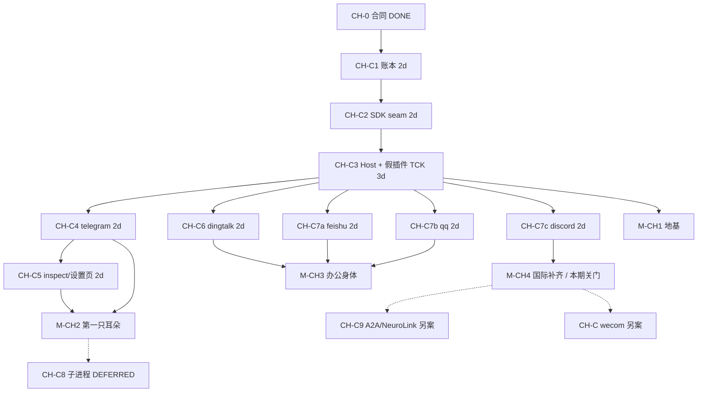
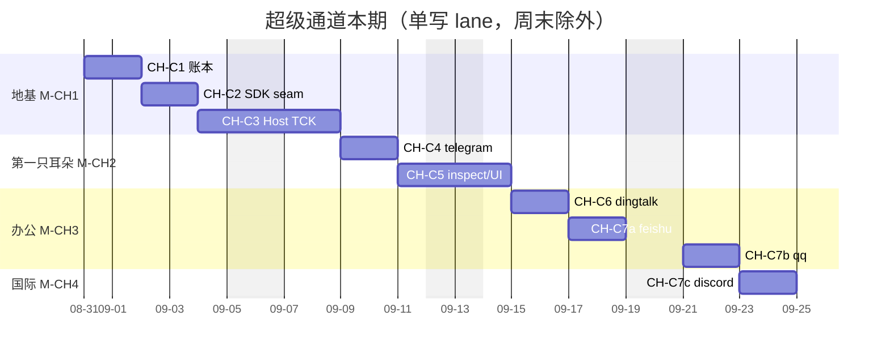

# AGENT-VIVY V0 — Project TODO Board

> Status: living board. V0–Studio tracks are **closed**; remaining work is §0.1.
> Archive of closed tracks: `docs/logs/2026-08-25-todo-board-archive/`.
> Milestones map to PRD §11 (M0–M4). Acceptance anchors cite PRD FR/AS/D ids.
> Architecture reference: `IMPLEMENTATION-PLAN.md`.
> Updated: 2026-08-30
> Development environment: `docs/architecture/VIVY-STUDIO.md`. Studio is the first-party daily IDE; other authorized tools work directly in this repository with their own capabilities.

---

## 0. Start posture (read first)

Per `GO-NOGO-PREFLIGHT.md` §8(b), V0 starts with the soft requirements below
accepted as **RISK ACCEPTED** with monitors, rather than closed first:

| Item | Posture | Monitor |
|---|---|---|
| SR-1 ADR baseline missing (D-035) | CLOSED | `docs/AGENT-VIVY-ARCHITECTURE-V0.md` authored 2026-08-08 |
| SR-2 Eino §6 claims unverified (D-034) | CLOSED | Verified by task **A1** — see `eino-capability-verify.md` (2026-08-07) |
| P0-3 PRD v0.5 final confirmation | RISK ACCEPTED | User sign-off tracked here; treat v0.5 as final until told otherwise |
| P0-4 SR acceptance posture | RESOLVED | This table is the acceptance record |

Gate rule: **A1 must pass before any C6 approval/interrupt work.** If A1 shows
Eino interrupt/resume cannot meet the Vivy Run state machine, C6 switches to
the outer-loop fallback (RK-3 stop-loss) and this board is re-planned.

> **GATE CLEARED (2026-08-07):** A1 verdict is **GO** — checkpoint-bridge
> approach verified against online Eino v0.9.13 (`docs/eino-capability-verify.md`,
> commit `fe81075`). C6 may proceed once its remaining predecessors (B4, C3)
> land; no outer-loop fallback needed.

## 0.1 Open remaining (2026-08-25)

Everything in §1–§8, §9.1–§9.9, §11–§13, and HITL-01..07 P0 is **done**.
Do not pick work from those tables. Closed-track filing:
`docs/logs/2026-08-25-todo-board-archive/summary.md`.

| ID | Item | Status | Notes |
|---|---|---|---|
| CMP-1 | Context compaction：reduction Clear 转存 Backend / offload（文件级恢复） | OPEN | 2026-08-30 上下文压缩真实化后留白：`reduction.Backend=nil` 只做内存占位不转存；有 `read_file` 后可接 filesystem Backend |
| CMP-2 | Context compaction：独立摘要模型 `summary_model` | OPEN | 2026-08-30 压缩沿用主模型；独立 `summary_model` 覆盖留待配置提案 |
| CMP-3 | Context compaction：会话级摘要检索入口 | OPEN | 2026-08-30 摘要进入 feed（`session_compactions`），无 UI/检索面；属 G2 检索候选 |
| TEST-1 | Mock-provider execute/commandline scenario for offline e2e | OPEN | Found 2026-08-26 (execute-timeout work): mock scenarios only drive write_note/ask_user/write_file, so no offline browser path can exercise an execute call; related `internal/provider/mockref.go` |
| CH-0 | Adopt `VIVY-CHANNEL-PACK.md` (C0 contract) | DONE | 2026-08-30 超级通道合同已采纳。演进树 `docs/architecture/VIVY-CHANNEL-EVOLUTION.md`。PLAN 包 `docs/plans/channel-epic/`。日历 §0.2 |
| FACE-0 | Adopt `VIVY-FACE-PACK.md` (F0 contract) | OPEN | 2026-08-29 提案已写：`face: web \| tui \| headless` 一等装配；用户 `seam: face`；安卓是下游产品用内核。未采纳前不改 sdk/plugin |
| FACE-TUI-1 | Packed `faces/tui` organ (F3) | OPEN | 2026-08-29 探路客户端 `vivy tui`（`internal/tui`）已能连驻留网关对话/审批；不是配方器官；默认双击仍是 web |
| FACE-TUI-2 | Crush-style fullscreen TUI on real Client | DONE | 2026-08-29 `vivy tui --live`：`surface.Driver` + `tui.Live` 接驻留网关；`--demo` 仍 mock。见 `docs/logs/2026-08-29-tui-live-client/`。剩余：真滚动 viewport、审批 diff 高亮、`/` 命令条 |
| CH-A | ChannelHost + telegram + dingtalk（粗粒度） | SUPERSEDED | 2026-08-30 拆成 CH-C1..C6，见 §0.2。勿再按本行领取 |
| CH-B | feishu / qq / discord（粗粒度） | SUPERSEDED | 2026-08-30 拆成 CH-C7a/b/c，见 §0.2。勿再按本行领取 |
| CH-C1 | 账本：`channel.inbound` + Message 出处 | DONE | 2026-08-30 Message 增 Source/Channel/ChatID/ChannelMessageID（空 Source=ui）+ `EventChannelInbound` + `channel.inbound` schema；sqlite migration016；postgres 升版 15 含 v14 原地升级；conformance CN-17。无适配器、无 Host。Filing: `docs/logs/2026-08-30-channel-c1/` |
| CH-C2 | SDK `seam: channel` + 空注册表 + 信封配置 | DONE | 2026-08-30 `SeamChannel` + 5 Grant + `Channel`/`ChannelEnv` + 类型化信封 + 9 预留能力槽（`sdk/plugin/channel.go`）；verify 按 seam 分流 + `net.Listen` AST 封禁 + 3 拒绝夹具 + fake-channel；pack 双 overlay 支持独立 go.mod 插件（真实树零写入）；`Adapt` 跳过 channel；config `channels:` 信封（settings opaque）。`zz_register.go` 仍 nil。Filing: `docs/logs/2026-08-30-channel-c2/` |
| CH-C3 | ChannelHost + 假插件 TCK | DONE | 2026-08-30 `internal/channelhost`（零 eino/runtime import）：StartAll/StopAll fail-closed、确定性会话映射 `sess_ch_<hash>`、dispatch 入账→Provenance Run→终态 Send；TCK 8 项；`RunOptions.Provenance`（nil=ui）；能力接口 v1 方法集 + Discover；app 装配 + 未知名启动失败。`channel.inbound` 以 `chanin_*` 伪 run 作用域入账（结案 CH-C1-N1）。Filing: `docs/logs/2026-08-30-channel-c3/` |
| CH-C4 | `plugins/telegram` 私聊文本 | DONE | 2026-08-30 独立 go.mod 真包（telego v1.10 long-poll，私聊纯文本 in/out，无 webhook/群/媒体）；`ChannelEnv.Settings()` ABI 新增（settings 传插件，内核仍零协议类型）；Secret 钉死信封 token_env；pack 改 `-modfile` 合并独立模块 require+go.sum 闭包（真实 go.mod/go.sum 字节不变，候选 EXE 链接 telego）。默认 EXE 无 telego。Filing: `docs/logs/2026-08-30-channel-c4/` |
| CH-C5 | inspect + 设置页接后端 | DONE | 2026-08-30 领取 UI-CHANNELS-BE：`channel/inspect\|get\|update` RPC；settings overlay 增 channels（指针字段、保留 config opaque settings、幽灵名不挡启动）；UI 列表=compiled-in 全集、空态「这一代没有耳朵」、email/neuro-link 移除、allow_from 文案 fail-closed（zh/en）、token 只显 env 名；localStorage 退役。浏览器真实路径冒烟（3015：默认空态 + pack telegram 候选全链）通过。Filing: `docs/logs/2026-08-30-channel-c5/` |
| CH-C6 | `plugins/dingtalk` Stream 单聊文本 | OPEN | Plan: `docs/plans/channel-epic/CH-C6.md`。可与 C4 分 worktree |
| CH-C7a | `plugins/feishu` 单聊文本 WS | OPEN | Plan: `docs/plans/channel-epic/CH-C7a.md`。建议 C4 先合 |
| CH-C7b | `plugins/qq` 官方 Bot 文本 | OPEN | Plan: `docs/plans/channel-epic/CH-C7b.md`。非个人号/OneBot |
| CH-C7c | `plugins/discord` 文本（无 voice） | OPEN | Plan: `docs/plans/channel-epic/CH-C7c.md`。禁止 voice/pion |
| CH-C8 | 同二进制 `vivy channel --name` 子进程 | DEFERRED | 备忘 Plan: `docs/plans/channel-epic/CH-C8.md`。不是开工令 |
| CH-C9 | A2A / NeuroLink 能力提案 | DEFERRED | 备忘 Plan: `docs/plans/channel-epic/CH-C9.md`。不是开工令 |
| CH-C | wecom after a non-TTY bind surface | OPEN | QR bind 是挡板；不进 2026-08-30 本批、不进 §0.2 本期日历 |
| CH-C1-N1 | `channel.inbound` 信封张力：RunEvent envelope 必填 `run_id`，而入账发生在 run 存在前 | RESOLVED | 2026-08-30 CH-C3 结案：每条入站消息以独立伪 run 作用域 `chanin_<hex>` 入账（journal 零改动、D-008 不受影响、合同零改动），payload `run_id` 按可选省略。保留策略见 CH-C3-N1。Filing: `docs/logs/2026-08-30-channel-c3/summary.md` |
| CH-C1-N2 | 合同 §12 Journal 草图与 CH-C1 §4 payload 定形不一致 | OPEN | Found 2026-08-30 (CH-C1)：合同写 `{channel, peer, message_id, content_digest, bytes}`，PLAN 定形 `{channel, chat_id, sender, message_id, session_id, run_id?}`（无 digest/bytes）。已按 PLAN 实现；请架构师确认是否回写合同 §12 |
| CH-C1-N3 | Message 出处未上 RPC/UI：`messageResult` 只投影 ID/RunID/Role/Content/CreatedAt | OPEN | Found 2026-08-30 (CH-C1)：出处已入库但 JSON-RPC 不可见。归 CH-C5 inspect/设置页切片 |
| CH-C1-N4 | `Source` 无词表校验：`EffectiveSource` 透传任意非空值 | OPEN | Found 2026-08-30 (CH-C1)：与「无类型词表」决定一致；CH-C2 SDK seam 落地时随合同定 `ui\|channel` 词表与校验 |
| CH-C1-N5 | postgres v14→15 升级测试与 pg 侧 CN-17 未在真实 Postgres 执行 | OPEN | Found 2026-08-30 (CH-C1)：本机无 Docker/5432，`VIVY_POSTGRES_TEST_DSN` 门控用例仅验证编译/vet/干净 SKIP；下一次有 Postgres 的环境跑一轮 |
| CH-C2-N1 | verify 四个分支缺夹具：非 channel seam 领 channel 族 grant / channel 重复 grant / transport=webhook / 负 max_message_runes | OPEN | Found 2026-08-30 (CH-C2)；2026-08-30 (CH-C3) TCK 未硬化此面（scope 在 Host）。C4 适配器样板时补齐 |
| CH-C2-N2 | §8 槽位收尾：`InboundMessage`/`OutboundMessage` 的 run_id/task_id（Host 写入） | RESOLVED-DEFERRED | 2026-08-30 (CH-C3)：Delete/Reaction/HealthChecker/ListenHandler 接口已补（v1 方法集）；run_id/task_id 槽有意缓建（伪 run 设计下无消费者），SDK 注释改为 deferral 表述。C4/C8 真实需要时再加，不改已有名字 |
| CH-C3-N1 | 出站投递耐久性 + `chanin_*` 保留 + Send/Stop 竞态 | OPEN | Found 2026-08-30 (CH-C3)：终态投递为内存跟踪（进程在 run.completed 与 Send 之间退出丢回复）；`chanin_*` 事件无 GC；StopAll 不等在途 Send。2026-08-30 (CH-C4)：适配器侧竞态面已收口（telegram 插件 `bot/cancel/done` Start 后不可变 + Stop 后 Send 不 panic 测试）；Host 侧持久化出站队列 / `chanin_*` 保留策略仍开，归后继 Host 切片 |
| CH-C3-N2 | `Secret(envKey)` 未钉死到信封 `token_env` 名单；EnsureSession 建会话竞态重读路径无并发测试 | RESOLVED | 2026-08-30 (CH-C4) 结案：`hostEnv.Secret` 钉死该通道信封声明的 `token_env`（空声明全拒、异名全拒、值不进错误），测试覆盖；settings 经新增 `ChannelEnv.Settings()` 传给插件（ABI 唯一新增）。EnsureSession 并发派发测试移 CH-C4-N2 跟踪。Filing: `docs/logs/2026-08-30-channel-c4/summary.md` |
| CH-C4-N1 | 出站 `max_message_runes` 无人执行：清单声明 4096，Host/插件都不切分 | OPEN | Found 2026-08-30 (CH-C4)：助手回复 >4096 rune 时 Telegram `sendMessage` 报错、该次投递丢失（Host 日志可见）。C5（inspect/设置页）或下一适配器切片决定执行点（Host 通用切分 vs 插件内切分） |
| CH-C4-N2 | `EnsureSession` 并发派发竞态重读路径无并发测试 | OPEN | Found 2026-08-30 (CH-C3)，CH-C4 未补（scope 只许通用信封）。同 chat 并发入站下 EnsureSession 的重读路径需要 `-race` 并发测试 |
| CH-C5-N1 | 旧 `vivy.ui.channels` localStorage 键不清理不迁移（忽略优于错迁密钥） | OPEN | Found 2026-08-30 (CH-C5)：老用户浏览器里的残留数据无人清理；如需清理做一次只删不迁的 UI 清扫 |
| CH-C5-N2 | `pendingRestart` 探不到纯 allow_from 编辑（allow_from 不在 inspect 面）；inspect 失败时空态可能误读 | OPEN | Found 2026-08-30 (CH-C5)：后继可在 inspect 加 allow_from 摘要字段；inspect 错误态与空态视觉区分 |
| ACP-1 | ACP / remote control **implementation** | DEFERRED | H11 proposal exists; needs explicit approval |
| HITL-P1-1 | Specialized proposal editing | OPEN | Intentionally out of 2026-08-12 P0 |
| HITL-P1-2 | Scoped remember / allow policies | OPEN | |
| HITL-P1-3 | Structured MCP elicitation | OPEN | |
| HITL-P1-4 | Reviewer assignment | OPEN | |
| HITL-P1-5 | Review history / search | OPEN | |
| HITL-P1-6 | External notifications | OPEN | |
| HITL-P1-7 | Generic edit + bulk approval | DEFERRED | Explicitly not P0 |
| MEM-1 | Memory / BML / Laputa / AutoDream / Evolution / RAG | DEFERRED | Direction non-goal until a capability proposal |
| P2-1 | Full Diva capability inventory (Keep/Adapt/Defer/Drop) | OPEN | `AGENT-VIVY-ASSEMBLY-OPTIONS.md` is only a V0 stand-in |
| P2-3 | QwenPaw filesystem-journal probe | DEFERRED | Out of V0; needs SR-4 first |
| SR-4 | QwenPaw vendor vs external | OPEN | Before any fsjournal probe |
| P2-4 | Long-term 板块 map for V3 | DEFERRED | |
| P3-1 | claude-code upstream LICENSE | OPEN | Ambient; before any reuse |
| P3-2 | Human review of `rig` LICENSE | OPEN | Ambient; before any reuse |
| UI-TREE | Child-run tree visualization | DEFERRED | Harness GOAL-4/5 API exists; no tree UI |
| UI-TOKEN | 中控台 Token 统计接真实用量账本 | DONE | 2026-08-29 `stats/tokens` RPC + `TokenUsageStore` 聚合 Journal `model.usage` 事件；面板改用真实数据，移除 DemoBanner。见 `docs/logs/2026-08-29-dashboard-token-stats-live/` |
| SBX-OS | OS 级进程沙箱（bwrap / Seatbelt / Windows ACL） | DEFERRED | EINO 当前只做工作区路径 + 命令白名单 + HTTP 策略，不是 DSH 进程沙箱 |
| SBX-GLOB | 沙箱 deny glob / 可编辑 auto_approve_tools | DEFERRED | 设置页只暴露预设与网络策略；超时仍在通用设置 |
| SBX-LIVE | 进行中的 run 热切权限预设 | DEFERRED | 当前回合钉死会话策略，下一 `turn/start` 才生效 |
| UI-MCP | MCP 面板接真实后端管理 | DONE | 2026-08-30 `settings/mcp*` RPC + settings.yaml overlay + `EinoMCPBackend.ReplaceServers`；`/mcp` 去掉 DemoBanner/`vivy.demo.mcp`。见 `docs/logs/2026-08-30-mcp-live/` |
| UI-TITLE | `ui/index.html` 标题仍是旧演示名 | OPEN | `<title>Agent Diva 前端演示</title>`；产品现为 Vivy，改名需产品命名确认，未随皮肤迭代顺手改 |
| UI-EVO | 进化页接真实 Evolution/AutoDream 后端 | OPEN | 2026-08-25 页面已按 agent-diva 结构落地为 `vivy.demo.*` 演示数据页（`/evolution`，三 Tab 治理闭环 + 跨页跳转，见 `docs/logs/2026-08-25-evolution-page/`）；内核 AutoDream/Evolution 能力本身见 MEM-1（DEFERRED），有能力提案后需把 `demo-api.ts` 换成 `api.ts` 真实 RPC 并登记方法 |
| UI-CHAT-ACT | 消息编辑 / 回退 / 分叉启用 + 截断式重新生成 | OPEN | 2026-08-26 功能栏已移植（复制启用 + 重新生成=重发上一条用户输入开新回合，见 `docs/logs/2026-08-26-chat-message-actions/`）；编辑/回退/分叉为禁用占位。真正的就地覆盖需内核 Journal 提供消息截断/分支 RPC（现为追加式事实源），属内核能力提案 |
| UI-CHAT-TOOLBAR | 聊天框上方功能栏后端接线 + 状态持久化 | OPEN | 2026-08-29 权限三段（谨慎/智能/信任）已接 `session/set_permission`（见 `docs/logs/2026-08-29-sandbox-permission-presets/`）。执行模式/思考仍为纯 UI；附件/AutoDream/桌面伙伴/语音仍为 stub。 |
| UI-MODEL-KEY-SCOPE | 同运行束下不同网关（base_url）无法各自独立密钥 | DONE | 2026-08-30 `ModelResolver` + `ModelSpec`：openai Ref 按次接收 APIKey/BaseURL，不再 `os.Getenv(bundle.EnvKey)`；注册表 `ActiveKey(bundle, base_url)` 成为产品路径。见 `docs/logs/2026-08-30-compile-model-resolver/` |
| UI-E2E-STALE | `just ui-e2e` 两条既有规格断言已过期文案（非本次改动引入） | OPEN | `runtime.spec.ts:84` 断言「密钥只由运行环境管理」、`welcome-wizard.spec.ts:33` 断言「API 密钥通过运行环境变量注入，不在界面中填写或保存。」——两串文案在 `ui/src` 均已不存在，密钥提示曾被 i18n 改写（现文案见 `ui/src/i18n/zh.ts` 的 `catalogKeyHint`/`secretNote` 等键）。2026-08-27 e2e 复跑确认：新增的 `language-setting.spec.ts` 通过，这两条为过期规格失败，与语言分区改动无关；需按现文案同步断言后恢复全绿，本次范围外未改 |
| UI-TRAJ | 中控台轨迹面板接真实运行轨迹 | OPEN | 2026-08-25 轨迹面板（`ui/src/components/trajectory/`）为纯演示静态数据（复刻 DSH `ui-trajectory` 设计：工具栏/三泳道时间轴/账本/详情），未接后端；接真实轨迹需内核提供会话日志/回放事件 RPC（当前 Journal 事件流在 Go 侧，UI 无轨迹类端点），见 `docs/logs/2026-08-25-trajectory-panel/` |
| UI-CI-BOOTSTRAP | 全新 checkout 直接 `just ci` 在 `go vet ./...` 失败 | OPEN | `ui/embed.go` 的 `go:embed all:dist` 需要 `ui/dist` 存在；`.gitignore` 允许 `ui/dist/.keep` 常驻但该文件从未入库。正常开发树依赖历史 `pnpm build` 残留。2026-08-25 在空 worktree 复现：先 `pnpm build` 再 `just ci` 即全绿。修复选项：入库 `ui/dist/.keep` 或让 `ui-ci` 先于 Go 侧 vet 执行。2026-08-30 `feat/mcp-live` 空 worktree 再次命中 |
| ST-SUB-1 | 合并 `feat/vivy-studio-submodule` 进主线 | OPEN | 2026-08-29 Studio 壳已独立仓 + submodule（见 `docs/logs/2026-08-29-vivy-studio-submodule/`）。分支待人工审阅后 merge/push；根树其他 lane 勿直接叠 |
| ST-SUB-2 | vivy-source 插件安装改出 submodule 工作树 | OPEN | 现仍写入 `studio/<slug>/`（弄脏 `vivy-studio` WT）。可选迁到 `data/studio-home/source-plugins/` 并改 hub + launch 合并逻辑 |
| ST-SUB-3 | 社区插件再拆嵌套 submodule（可选） | DEFERRED | 初版整树在 `vivy-studio`；体积/更新策略稳定后再拆 |
| UI-E2E-DRAW | `runtime.spec.ts` 仍断言聊天「画图」按钮 | OPEN | 2026-08-30 MCP e2e 顺带跑该规格：`getByRole('button', { name: '画图' })` 已不存在于 `ChatInput`。与 MCP 无关，未在本迭代改这条旧断言 |
| UI-NETWORK-HTTP | `http_request`（网页抓取）尚无独立 UI 配置面 | OPEN | 2026-08-27 设置→网络工具已升级为真实分区（`NetworkToolsCard`，network_search 首选 provider + 可用性 roster，见 `docs/logs/2026-08-27-network-tools/`）；`http_request` 的启停与域名白名单仍由 `config.yaml` `runtime.http_allowed_hosts` / `tools.enabled` 控制，未进设置文档/RPC。打基础阶段刻意不做端到端；后续可把 http 启用/超时/白名单做成设置文档字段并加 RPC 段 |
| UI-PROV-REGISTRY | 注册表 localStorage 存量数据无迁移路径 | OPEN | 2026-08-28 provider 写逻辑改为后端注册表后，旧 `vivy.ui.customProviders` localStorage 条目不再被读取（见 `docs/logs/2026-08-28-provider-direct-write/`）。本地用户需在设置页重新登记；如需自动迁移需 UI 一次性读旧 key 并逐条 `upsertProvider`（含是否回填 apiKey 的产品决策） |
| UI-CHANNELS-BE | 通道配置为纯前端形态，后端通道读写与就绪报告未接入 | OPEN | **领取 CH-C5 PLAN，不要另开 lane。** `docs/plans/channel-epic/CH-C5.md` |
| UI-TODO-MUTATE | 待办清单只读，人不能在 UI 里增删改 | OPEN | 2026-08-29 聊天区已接真实 `session/todos`（见 `docs/logs/2026-08-29-chat-plan-todo-display/`）；变更只来自 `task_*` 工具。人闸编辑会变成伪操作，需明确产品决策后再做 |
| UI-GOAL | 无 DSH 式 goal 内核 / GoalBar 动词 | OPEN | 进度条用当前 `in_progress` 的 `active_form`/`subject` 当概览，不是独立 goal 对象。移植 `create_goal` 需内核提案 |
Weixin iLink, OneBot (external NapCat), Discord voice, and public webhooks
are **not** on this board; they need their own capability proposal.

## 0.2 Channel program — 排期、分解、活动图（2026-08-30 拍板）

权威依赖仍是 `VIVY-CHANNEL-PACK.md` §20。演进树：`docs/architecture/VIVY-CHANNEL-EVOLUTION.md`。
切片 PLAN（子 AGENT 按十节领取）：`docs/plans/channel-epic/`，索引见 §0.2.8。
Filing: `docs/logs/2026-08-30-channel-program-plan/`、`docs/logs/2026-08-30-channel-epic-plans/`。

假设（不满足则重排，不暗改合同）：

- **一条写 lane。** 根树同时只允许一个实现车道；要并行必须 `git worktree`（`AGENTS.md` parallel-worktree-isolation）。
- 工期是 **1 名交付人的工作日**，不含真实 Bot 账号等待。
- 默认 `vivy.exe` / `just ci` **始终不链** telego / discordgo / lark / 钉钉 / botgo。点名 pack 才进候选身体。
- 每个通道插件 **一次 pack 评测**。禁止一个 PR 链进五个 SDK。
- 开工日按 **2026-08-31（周一）**。周末不算。

### 0.2.1 里程碑

| 里程碑 | 内容 | 计划完成 | 含 20% 缓冲 | 退出 |
|---|---|---|---|---|
| M-CH0 | 合同 + Eino A2A 澄清 | 2026-08-30 | — | **DONE**（CH-0） |
| M-CH1 地基 | CH-C1 + C2 + C3 | 2026-09-08 | 2026-09-10 | Host TCK 绿；默认 EXE 仍无耳朵 |
| M-CH2 第一只耳朵 | CH-C4 + C5 | 2026-09-14 | 2026-09-16 | 候选身体 telegram 私聊文本；设置页只列 compiled-in；3015 实走 |
| M-CH3 办公身体 | CH-C6 + C7a + C7b | 2026-09-22 | 2026-09-25 | 配方可点 dingtalk+feishu+qq；各一次 pack |
| M-CH4 国际补齐 | CH-C7c | 2026-09-24 | **2026-09-30 本期关门** | discord 文本、无 voice |
| M-CH5 后切 | CH-C8 / C9 / CH-C | 不排期 | — | 另案提案 |

本期关门 = M-CH4。C8 子进程、C9 A2A/NeuroLink、企业微信 **不进这扇门**。

### 0.2.2 WBS（领取这张表，不要领已 SUPERSEDED 的 CH-A/B）

| ID | 切片 | 人日 | 依赖 | 并行？ | 成功 |
|---|---|---|---|---|---|
| CH-0 | 合同 | — | — | — | DONE |
| CH-C1 | 账本 `channel.inbound` + Message 出处 + sqlite/pg 迁移 + conformance | 2 | CH-0 | 否（关键路径） | DONE 2026-08-30（`just ci` 绿；无适配器。Filing: `docs/logs/2026-08-30-channel-c1/`） |
| CH-C2 | `SeamChannel`、grants、`ChannelEnv`、verify 禁 Listen/禁 tools、pack overlay 独立 module | 2 | CH-C1 | 否 | DONE 2026-08-30（verify/pack/Adapt/config 全绿。Filing: `docs/logs/2026-08-30-channel-c2/`） |
| CH-C3 | ChannelHost + 假 channel 插件 TCK | 3 | CH-C2 | 否 | DONE 2026-08-30（TCK 8 项绿；fail-closed；无真实协议。Filing: `docs/logs/2026-08-30-channel-c3/`） |
| CH-C4 | `plugins/telegram` 私聊文本 long-poll | 2 | CH-C3 | 与 C6/C7 可分 worktree | DONE 2026-08-30（pack 候选链接 telego；默认 EXE 无 telego。Filing: `docs/logs/2026-08-30-channel-c4/`） |
| CH-C5 | inspect RPC + 设置页接后端（= UI-CHANNELS-BE） | 2 | CH-C4 | 单 lane 接在 C4 后（要有真实 compiled-in 名） | DONE 2026-08-30（3015 真实路径冒烟过；只开关身体里的名字。Filing: `docs/logs/2026-08-30-channel-c5/`） |
| CH-C6 | `plugins/dingtalk` Stream | 2 | CH-C3 | 可与 C4 并行（第二 worktree） | 国内单聊文本 |
| CH-C7a | `plugins/feishu` WS | 2 | CH-C3 | 建议 C4 先合 | 64-bit；无公网 webhook |
| CH-C7b | `plugins/qq` 官方 Bot | 2 | CH-C3 | 同 C7a | 非个人号、非 OneBot |
| CH-C7c | `plugins/discord` 文本 | 2 | CH-C3 | 同 C7a | 无 voice/pion |
| CH-C8 | `vivy channel --name` | — | M-CH2 之后 | — | DEFERRED |
| CH-C9 | A2A / NeuroLink 提案 | — | 独立提案 | — | DEFERRED |
| CH-C | wecom | — | 非 TTY 绑定面 | — | 不进本期 |

合计本期：2+2+3+2+2+2+2+2+2 = **19 人日**（约 4 个工作周）。缓冲后关门 **2026-09-30**。

### 0.2.3 关键路径

单 lane（承诺日历）：

```text
CH-0 → C1 → C2 → C3 → C4 → C5 → C6 → C7a → C7b → C7c
         2d   2d   3d   2d   2d   2d    2d    2d    2d
地基 M-CH1 = C1+C2+C3 = 7d → 2026-09-08
第一只耳朵 M-CH2 = +C4+C5 = 11d → 2026-09-14
```

压缩杠杆只有两处：C3 之后用 **第二条 worktree** 把 C4∥C6 重叠（省 2d）；C7 三个包分树（最多把 6d 压成 2d，但 Host/pack 配方仍要串行合入）。**禁止在脏根树上叠第二个实现。**

### 0.2.4 活动图（依赖）



C3 是扇出点。C4 是 ABI 样板：第二条 lane 可以立刻写 dingtalk，第三条不要在 C4 合入前开第三个 SDK。

### 0.2.5 甘特（单 lane 承诺）



双 lane 加速（C3 之后）：C4∥C6，C5 仍接 C4；C7 三个包最多再开一棵树。日历最多提前到 **2026-09-18** 左右关门，前提是第二棵 worktree 真有人写。

### 0.2.6 明确不做（本期）

- C8 崩溃域子进程、C9 A2A/NeuroLink 实现、CH-C 企业微信
- 公网 webhook、Discord voice、QQ 个人号、OneBot、email、媒体/群/流式占位
- 把五个 SDK 写进默认 `go.mod`；`RegisterServerHandlers(adk.Agent)` 当 A2A 网关
- 用 channel 替代 Face；channel 用户当 HITL 审批人

### 0.2.7 下一刀

**CH-C6**（`plugins/telegram` 之后第二只真耳朵：`plugins/dingtalk` Stream 单聊文本）。读 `docs/plans/channel-epic/00-standing-orders.md` 与 `CH-C6.md`。C1–C5 已 DONE（分支链 `feat/channel-c1`→…→`c5`）。从 `feat/channel-c5`（或其合入结果）切新 worktree + 新分支 `feat/channel-c6`。**抄 `plugins/telegram` 的包形状**（C4 是 ABI 样板），独立 go.mod，钉钉 SDK 不进物种 go.mod；补 verify 夹具欠账（§0.1 CH-C2-N1）；注意 pack 对插件内第三方 replace 不合并（C4 review note）。成功 = 国内单聊文本候选能收发；默认 EXE 无钉钉 SDK。

### 0.2.8 PLAN 索引（子 AGENT 领取面）

站立命令：`docs/plans/channel-epic/00-standing-orders.md`
演进树：`docs/architecture/VIVY-CHANNEL-EVOLUTION.md`
目录：`docs/plans/channel-epic/README.md`

| ID | Plan | 架构阶段 |
|---|---|---|
| CH-C1 | `docs/plans/channel-epic/CH-C1.md` | A 遗传物质 |
| CH-C2 | `docs/plans/channel-epic/CH-C2.md` | B 物种窗口 |
| CH-C3 | `docs/plans/channel-epic/CH-C3.md` | C 世界入口 |
| CH-C4 | `docs/plans/channel-epic/CH-C4.md` | D ABI 样板 |
| CH-C5 | `docs/plans/channel-epic/CH-C5.md` | E 可见性 |
| CH-C6 | `docs/plans/channel-epic/CH-C6.md` | F 国内 |
| CH-C7a | `docs/plans/channel-epic/CH-C7a.md` | F 国内 |
| CH-C7b | `docs/plans/channel-epic/CH-C7b.md` | F 国内 |
| CH-C7c | `docs/plans/channel-epic/CH-C7c.md` | G 国际 / 本期关门 |
| CH-C8 | `docs/plans/channel-epic/CH-C8.md` | H 后切备忘 |
| CH-C9 | `docs/plans/channel-epic/CH-C9.md` | H 后切备忘 |

## 1. Milestone map (archived — V0 closed 2026-08-07)

| Milestone | PRD §11 | Tasks | Exit criteria |
|---|---|---|---|
| M0 Spike | M0 | A1, B0, B1, C1, C3 (spike), C4 (spike) | Eino stream + tool wrap cleanly; one HTTP endpoint streams |
| M1 Vertical slice | M1 | A2, A3, B2, B3, B4, B5, C2, C5, D1, D3(min) | AS-1 + AS-8 (mock path) pass |
| M2 Tools & approval | M2 | C6, D2, D3(approval UI) | AS-3, AS-4 pass |
| M3 Recovery & cancel | M3 | E1, E2, E3 | AS-5, AS-6, AS-9 pass |
| M4 Polish & smoke | M4 | D4, E4, real-provider smoke | All AS-1..AS-9 pass on real provider — **DONE 2026-08-07** |

## 2. Lane A — Documents & contracts (archived)

| ID | Task | Depends | Closes / Anchor |
|---|---|---|---|
| A1 | Author `eino-capability-verify.md`: verify against online Eino v0.9.13 that (a) `CheckPointStore{Get,Set}` exists, (b) default payload serializer, (c) interrupt/resume at Runner level with a public hook for Vivy journal commit | B1 | D-034, SR-2; gates C6 |
| A2 | Provider bundle spec + two YAML bundles (`openai.yaml`, `anthropic.yaml`) with `provenance` field, D-024 field list | B1 | P1-2, OQ-8, D-018/D-022..D-025 |
| A3 | Vivy-owned JSON Schema for the ten `RunEvent` types; single contract for Eino-side and UI-side streams | B3 | P1-3, FR-5 |

## 3. Lane B — Foundation (archived)

| ID | Task | Depends | Closes / Anchor |
|---|---|---|---|
| B0 | Persist `GOPROXY=https://goproxy.cn,direct`; pre-warm module cache | — | SR-7, P1-1 (DONE at init) |
| B1 | `go mod init agent-vivy` + online deps (eino v0.9.13, eino-ext openai v0.1.13, modernc.org/sqlite v1.56.0); build passes | B0 | DONE at init; D-006 |
| B2 | `internal/config` load/validate + `internal/app` composition + `cmd/vivy` health endpoint + graceful shutdown | B1 | FR-10, NFR bounded shutdown |
| B3 | `internal/domain` nine contract types + Run state machine + event vocabulary | B1 | FR-4, FR-5, D-007 |
| B4 | `internal/storage` four contracts + SQLite backend + versioned migrations | B3 | D-026..D-027, FR-8 |
| B5 | Backend conformance suite (≥16 cases, D-032); red at M0, green by M2/M3 | B4 | D-032, RK-7 |

## 4. Lane C — Runtime (the Eino door) (archived)

| ID | Task | Depends | Closes / Anchor |
|---|---|---|---|
| C1 | Mock provider (deterministic, reproducible runs) behind `domain.ChatModel` | B3 | FR-3, NFR deterministic mode |
| C2 | `ProviderRef` boundary + openai bundle wiring via eino-ext openai component; enforce non-`provider` packages can't import provider-specific code | A2, B3 | P1-4, FR-3, D-007 |
| C3 | Wire `ChatModelAgent` + `adk.NewRunner` behind `internal/runtime` | B1, C1 | M0 spike, FR-4 |
| C4 | Map Eino `AgentEvent` → `domain.RunEvent`, persist to Journal before fan-out | A3, B3, C3 | FR-5, D-007 |
| C5 | Read-only auto-execute tool (`tool.started`/`tool.finished` without approval) | B3 | FR-6, AS-2 |
| C6 | Effectful approval-gated tool via interrupt/resume + two-layer checkpoint bridge | **A1**, B4, C3 | D-028..D-030, FR-6, AS-3/AS-4 |

## 5. Lane D — API & UI (archived)

| ID | Task | Depends | Closes / Anchor |
|---|---|---|---|
| D1 | HTTP command/query endpoints + SSE `after_seq` replay-then-live stream | B2, B4, C4 | FR-1, FR-5, AS-7 |
| D2 | Approval endpoints with server-side enforcement (binding + expiration) | C6, D1 | FR-7, D-009, RK-6 |
| D3 | Vite UI shell: sessions, streaming chat, approval prompt, run-detail/event-log, error display, refresh-safe | D1 | FR-9, D-013, AS-7 |
| D4 | Playwright smoke against the real Go process; add Eino/`agent-diva` import-lint gate to CI | D3 | FR-9, D-007, RK-1, RK-5 |

## 6. Lane E — Correctness (archived)

| ID | Task | Depends | Closes / Anchor |
|---|---|---|---|
| E1 | Cancellation → exactly one `run.cancelled` terminal event (mid-stream, mid-tool, pre-start) | C4 | D-008, AS-5 |
| E2 | Restart recovery: enumerate non-terminal runs, resume or fail definitively, no duplicate terminal | B4, B5, C3 | FR-8, AS-6, RK-7 |
| E3 | Secret-redaction audit: no secret in SQLite, event payloads, or UI storage | B4, C2 | D-010, AS-9 |
| E4 | Windows bounded graceful shutdown (SIGINT/SIGTERM/console close), flush events, close SQLite | B2, D1 | NFR bounded shutdown, AS gate |

## 7. Dependency graph (tight predecessors)

```text
B0 -> B1
B1 -> {A1, A2, B2, B3, C3}          # fan-out after module init
B3 -> {A3, C1, C5}
A3 -> C4
B3 -> B4 -> B5
A2 -> C2
B3 -> C2
C1 -> C3 -> C4 -> D1
B4 -> D1
B2 -> D1
A1 -+
B4 -+-> C6 -> D2
C3 -+
D1 -> D3 -> D4
C4 -> E1
B4,B5,C3 -> E2
B4,C2 -> E3
B2,D1 -> E4
```

### 7.1 Critical path

```text
B0 -> B1 -> B3 -> C1 -> C3 -> C4 -> D1 -> D3 -> E2 -> M4 acceptance
```

This is the longest dependency chain; compressing it compresses V0. `B3`
(domain types) and `C1` (mock provider) are the highest-leverage early tasks.

### 7.2 Parallel lanes (independent once their predecessor set is met)

- After `B1`: `{A1, A2, B2}` run concurrently — none block each other.
- After `B3`: `{A3, C1, C5, B4}` fan out together.
- `B4/B5` (storage) run fully in parallel with Lane C (runtime).
- `C2` and `C5` run in parallel once their deps are met.
- `D3` UI skeleton can start against the `schemas/` contract as soon as `A3`
  lands, even before `D1` is complete (contract-first), then integrate.

### 7.3 Single points of serialization

- `B3` (domain types): everything downstream speaks domain; do it early, keep
  it stable.
- `A1` (Eino verification): hard gate for `C6`; schedule in the first batch.
- `B5` (conformance suite): must turn green before `E2` is trusted.

## 8. Definition of done per milestone

- **M0:** spike proves Eino stream + tool call wrap cleanly; `eino-capability-verify.md`
  written; GO/NO-GO on the checkpoint-bridge approach.
- **M1:** AS-1 + AS-8 pass on the mock path; vertical slice (session → message →
  stream → persisted run → visible events) real end to end.
- **M2:** AS-3, AS-4 pass; approval server-side enforced; conformance suite green
  for approval cases.
- **M3:** AS-5, AS-6, AS-9 pass; exactly-one-terminal invariant holds under kill.
- **M4:** AS-1..AS-9 all pass against the real provider on Windows; UI smoke
  green; structured errors visible.

## 9. Risk-accepted backlog (not in the critical path)

Living remainder is §0.1. Closed rows from this table:

| Ref | Item | Outcome |
|---|---|---|
| SR-1 / D-035 | Author `AGENT-VIVY-ARCHITECTURE-V0.md` | CLOSED 2026-08-08 |
| P1-6 | 16-case conformance harness | CLOSED as B5 2026-08-07 |
| RI-OQ-4 | `.workspace/` versioning | CLOSED 2026-08-25 — `/.workspace/` is gitignored |

Still open (copied into §0.1): SR-4 QwenPaw vendor; P3-1/P3-2 licenses; P2-1 inventory.

## 9.8 ADR-017 — vivy-sdk split (done 2026-08-15)

Recorded. `vivy-sdk` is a separate binary under repo-root `sdk/`.
`cmd/vivy` no longer dispatches `sdk`. The packer may later embed
sources or a toolchain and must not ride in the daily install.

## 9.9 Vivy Studio + development venue (2026-08-15)

Canonical: `docs/architecture/VIVY-STUDIO.md`. ADR-018.

Studio is an independent app and the first-party daily development IDE.
Species-side S7 card product meaning is void (NG-28). **Other authorized
developer tools may work directly in this repository with their own native
capabilities; no Studio handoff is required (NG-26).**

| ID | Status | Note |
|---|---|---|
| ST-0 | done (docs) | This correction |
| ST-1 | done (2026-08-16) | Independent `vivy-studio` profile + Fluorite identity UI |
| ST-2 | done (2026-08-16) | Workspace pinned to `agent-vivy`; production Journal forbidden |
| ST-3 | done (2026-08-16) | Launch PATH has Go / just / `vivy-sdk` |
| ST-4 | done (2026-08-16) | Skills `vivy-plugin-five` + `vivy-kernel-ci` |
| ST-6 | done (2026-08-16) | In-Studio `internal/buildinfo` comment + `just ci` green. Venue switch. |
| ST-5 | done (2026-08-16) | `cmd/vivy-studio` + `internal/studiocore`: Studio execs `vivy-sdk pack`, spawns candidate EXE itself, ledger `data/studio-home/studio.db`; zero live-species participation |
| ST-7 | done (2026-08-16) | Human-gated `release --actor human --yes`; `install` writes daily location, no hot-swap |
| ST-8 | done (2026-08-16) | `rollback` restores previous release from Studio snapshot; tenant Journal untouched |

## 9.7 S7 — studio card (superseded 2026-08-15)

Claimed 2026-08-15, then voided the same day. ADR-016 remains as
history; ADR-018 / NG-28 freeze the species-side card. Do not extend.

## 9.6 S6 — sdk pack (done 2026-08-15)

Done. ADR-015. `vivy-sdk pack` links named plugins into a new EXE via
overlay and writes generation.json. No UI, no fitness suite.

## 9.5 S5 — sdk verify (done 2026-08-15)

Done. ADR-014. `vivy-sdk verify` plus `plugins/hello-fs`. No pack,
no generated register, no live plugin load.

## 9.4 S4 — air-gapped eval (done 2026-08-15)

Done. ADR-013. `evals/start` launches a same-EXE candidate with an
isolated data dir and records `EvalRun`. No pack, no fitness suite, no UI.

## 9.3 S3 — species inspect (done 2026-08-15)

Done. ADR-012. `species/inspect` reports builtin-or-promoted generation,
policy hash, and tool names. No eval process, pack, or UI.

## 9.2 S2 — studio object plane (done 2026-08-14)

Done. ADR-011. Generation / EvalRun / Promotion stores, studio events,
JSON-RPC list/get/create/record/promote. No inspect, pack, eval process, or UI.

## 9.1 S1 — model-visible ≡ logged (done 2026-08-14)

Done. ADR-010. Tool turns project onto the message log, enter the next-run
feed, and each invocation records `model.request` digests. No Studio, no
SDK pack, no DSH.

## 10. Completion log

| Date | Item | Note |
|---|---|---|
| 2026-08-30 | CH-C5 inspect + 设置页接后端（UI-CHANNELS-BE） | `channel/inspect\|get\|update` RPC（未编译名拒绝、`*` 双闸、密钥零回流）；settings overlay 增 `channels`（指针字段区分未设置/设空，合并保留 config opaque settings，幽灵名 Warn 丢弃不挡启动；耳朵重启生效）；Host `Inspect()` 全集+能力+注释（`TokenEnvSet` 只报 bool）；UI 列表=compiled-in、空态「这一代没有耳朵」、email/neuro-link 移除、allow_from fail-closed 文案（zh/en）、token 只显 env 名、pendingRestart 徽章、localStorage 退役。`just ci` 绿（UI 21 文件/172 测试）+ 3015 浏览器真实路径冒烟（默认空态 + pack telegram 候选全链 + 窄视口）。Filing: `docs/logs/2026-08-30-channel-c5/`. |
| 2026-08-30 | CH-C4 `plugins/telegram` 私聊文本（ABI 样板） | 独立 go.mod 真包（telego v1.10 long-poll，仅私聊纯文本；bot echo 防环；`GetMe` 显式鉴权）；`ChannelEnv.Settings()` ABI 唯一新增（opaque settings 以 JSON 传插件，内核仍零协议类型）；`hostEnv.Secret` 钉死信封 `token_env`（结案 CH-C3-N2）；pack 升级 `-modfile` 合并独立模块 require/go.sum 闭包（真实 go.mod/go.sum/zz_register 字节不变，候选 EXE 链接 telego）。物种 `go list` 零 telego；默认 `just ci` 不编译 telegram。真 Bot 手工冒烟未做（无凭据，不挡 ci）。Filing: `docs/logs/2026-08-30-channel-c4/`. |
| 2026-08-30 | CH-C3 ChannelHost + 假插件 TCK | `internal/channelhost`（零 eino/runtime import）：`StartAll`/`StopAll` fail-closed（空 allow_from 拒 Start）、确定性会话映射 `sess_ch_<sha256>`、dispatch = allow_from 精确匹配 → `channel.inbound` 入账（`chanin_*` 伪 run 作用域，结案 CH-C1-N1）→ `RunOptions.Provenance`（nil=ui，C1 语义不变）→ 终态投递 `Send`（completed 取最后 assistant 行；脱离 runtime goroutine）。能力接口 v1 方法集 + `Discover`；app `partitionChannels` 未知名启动失败；Host 挂 `RunHook` 结构化兼容。TCK 8 项 + `just ci` 绿。Filing: `docs/logs/2026-08-30-channel-c3/`. |
| 2026-08-30 | CH-C2 SDK `seam: channel` + 空注册表 + 信封配置 | `sdk/plugin/channel.go`：`SeamChannel`、5 个 channel/secret Grant、`Channel`/`ChannelEnv` 接口、类型化 `InboundMessage`/`OutboundMessage`/`Part`、9 个保留能力槽。verify 按 seam 分流（channel 禁 tools/grants 本批限 poll+secret.read/必须 transport poll）+ `net.Listen` AST 封禁 + `bad-channel-{tools,listen,grant}` 夹具。pack 双 overlay 支持自带 go.mod 插件（fake-channel 端到端真实构建，live go.mod 与 zz_register 字节不变）。`pluginhost.Adapt` 跳过 channel。config `channels:` 信封（enabled/allow_from/token_env/settings opaque）。`just ci` 绿。Filing: `docs/logs/2026-08-30-channel-c2/`. |
| 2026-08-30 | CH-C1 账本：`channel.inbound` + Message 出处 | `domain.Message` 增 Source/Channel/ChatID/ChannelMessageID（空 Source=ui，`EffectiveSource`）；`EventChannelInbound` 入词表（35→36）+ `channel.inbound.json` schema + run-event 枚举；sqlite `migration016`（4×ALTER DEFAULT ''）；postgres 升版 15 并支持 v14 原地升级（`schemaV15Upgrade`）+ 升级测试；conformance CN-17 出处往返（16→17）；UI 路径用户行显式 `Source:"ui"`。无适配器、无 Host、无 sdk/plugin 变化。`just ci` 绿。Filing: `docs/logs/2026-08-30-channel-c1/`. |
| 2026-08-30 | 超级通道 EPIC PLAN 包 | 演进树 `VIVY-CHANNEL-EVOLUTION.md`；子 AGENT 十节 PLAN `docs/plans/channel-epic/CH-C1..C9.md`；TODO §0.2.8 索引。无运行时代码。Filing: `docs/logs/2026-08-30-channel-epic-plans/`. |
| 2026-08-30 | 超级通道节目排期 | `docs/TODO.md` §0.2：CH-A/B 拆成 CH-C1..C7c；单 lane 19 人日；M-CH4 计划 2026-09-24 / 缓冲关门 2026-09-30。下一刀 CH-C1。Filing: `docs/logs/2026-08-30-channel-program-plan/`. |
| 2026-08-30 | CH-0 超级通道合同采纳 | `VIVY-CHANNEL-PACK.md` 从出厂 `channels/` 提案改为已采纳的超级通道合同：Host 在内核；本批五个适配器全部 `plugins/` + `seam: channel`；信封/能力矩阵为 A2A、NeuroLink 预留；不新开 `RegisterChannels()`。无运行时代码。Filing: `docs/logs/2026-08-30-channel-super-contract/`. |
| 2026-08-30 | CH-0 补 clar：Eino 原生 A2A | 合同 §15.1：偷 `eino-ext/a2a` 的 models/transport，禁止 `RegisterServerHandlers(adk.Agent)` 当网关；循环仍是 `Service.Run`。本批五个插件不 import Eino。Filing: `docs/logs/2026-08-30-channel-a2a-eino-native/`. |
| 2026-08-30 | UI-PROV-RPC 供应商目录接真实后端（模型在线刷新） | 设置→模型 模型列表新增「刷新」：`GET {base_url}/models`（`internal/provider/discover.go`，15s 超时、Bearer 密钥、去重）+ `settings/providers/refresh` RPC（按 id 或按 bundle+base_url；目录厂商无注册表行时克隆为自定义条目持久化；并集保留手动新增；api_key 永不清除/不回传）+ UI 刷新按钮与同步计数反馈。仅 OpenAI 兼容端点；Anthropic 原生端点不显示按钮并拒绝刷新。Filing: `docs/logs/2026-08-30-model-list-sync/`. 目录静态快照 `provider-catalog.ts` 仍为展示层，未退化为运行时目录（范围外）。 |
| 2026-08-30 | 离线启动：把 runtime.mock 接回 ModelResolver / Catalog | 编译修复后 `just dev` 的 `config.dev.yaml` 不再解析出 ready 模型。`runtime.mock=true` 再次选 mock Ref，且不冻结 ENV。Filing: `docs/logs/2026-08-30-dev-mock-start/`. |
| 2026-08-30 | 编译修复：补回 ModelResolver / ResolvingChatModel / SQLite organism lease | 主线 `app.go` 已接线但实现未合入，`go build ./...` 失败。补回停放实现；`Ref.Model` 改为 `ModelSpec`。Filing: `docs/logs/2026-08-30-compile-model-resolver/`. |
| 2026-08-30 | UI-MCP MCP 面板接真实后端 | `/mcp` 从 `vivy.demo.mcp` 改为 `settings/mcp*` RPC；settings.yaml overlay 覆盖 `runtime.mcp_servers`；`EinoMCPBackend.ReplaceServers` 热替换 + SSE JSON-RPC 解析。stdio 本迭代不做。Filing: `docs/logs/2026-08-30-mcp-live/`. |
| 2026-08-27 | UI-SET-I18N 设置页 i18n 接线 | 设置→语言 从迁移预览升级为真实分区：挂载既有 `<LanguagePicker />`（点击即 `setLocale` 全局切换界面语言并持久化 `localStorage['vivy.language']`），删除 `DivaSettingsPreview` 的假 `LanguagePreview` 与 `language` 分支，`SettingsTab` 纳入 `'language'` 支持深链。`just ci` 全绿；新增 `ui/e2e/language-setting.spec.ts` 真实路径通过。Filing: `docs/logs/2026-08-27-settings-language/`. |
| 2026-08-26 | Tool polish（小件打磨 D） | read_file 内容带 1-based 行号（patch 锚点）；echo_info 移出默认启用（注册表保留）；network_search 描述/config.example 写清 env key 与无 key 降级；新增 `tools.network_search.provider` + settings.yaml + `settings/get|update` 可用性名录 + 设置→工具真实「网络搜索」卡（3015 实走）。分支 `feat/tool-polish`（与根树 list_dir lane 并行，worktree 隔离）。Filing: `docs/logs/2026-08-26-tool-polish/`. |
| 2026-08-26 | PROC-COMMIT | 根树三个已完成交付按主题拆分入库为独立提交：evolution 页 `a857976` / welcome wizard `9a11370` / chat message actions `1a3f0c7`，各自携带 `docs/logs/` 与 §0.1 登记（UI-EVO、UI-CHAT-ACT）；共享文件（`i18n/zh.ts`、`i18n/en.ts`、`runtime.spec.ts`、`TODO.md`）按主题 hunk 分块 stage，无混合提交。拆分前对整树复跑 `just ci` 全绿。Filing: `docs/logs/2026-08-26-proc-commit/`. |
| 2026-08-25 | 移除恋粉（love）主题 | 用户反馈不好看，整主题删除（注册表/CSS 令牌块/反闪烁脚本/测试）；残留 `vivy.theme=love` 存储值白名单回落默认。皮肤功能现为 4 套。`just ci` 绿 + 3015 实走。Filing: `docs/logs/2026-08-25-remove-love-theme/`. |
| 2026-08-25 | UI 皮肤（主题）功能 | 5 套主题（default/love/pink/dark/miku，后三套移植 Agent-Diva）统一为 shadcn 语义 Token 的 `[data-theme]` 块；设置→通用新增真实 ThemePicker，`vivy.theme` localStorage 持久化 + index.html 反闪烁引导；删除迁移预览假主题卡。`just ci` 绿 + 3015 实走。Filing: `docs/logs/2026-08-25-vivy-ui-themes/`.（love 后续移除，见上一行） |
| 2026-08-25 | Board archive | Closed V0/MA/ET/HITL-P0/H0–H10/S1–S6/ST-0..ST-8/SR-1/P1-6/RI-OQ-4. Remaining work listed in §0.1. Filing: `docs/logs/2026-08-25-todo-board-archive/`. Channel pack is a written proposal only (`VIVY-CHANNEL-PACK.md`); C0 not adopted. |
| 2026-08-16 | ST-5/ST-7/ST-8 | Studio lifecycle: `cmd/vivy-studio` + `internal/studiocore` (ledger `data/studio-home/studio.db`). Studio execs `vivy-sdk pack`, spawns candidate EXE itself, human-gated release, install to daily location, rollback from Studio snapshot. `just ci` green; `data/vivy.db` untouched. Skill `vivy-studio-lifecycle`. |
| 2026-08-16 | ST-6 | Venue switch. Studio authored `internal/buildinfo` identity comment; `just ci` green; `data/vivy.db` untouched. justfile `fmt-check` quote fix required for the recipe to run on Windows. |
| 2026-08-16 | ST-2..ST-4 | Workspace pin + air-gap AGENTS.md; launch toolchain; prefab skills. |
| 2026-08-16 | ST-1 | Independent `dsh --profile vivy-studio` + Fluorite identity UI (title, wordmark, slogan, welcome). Token checklist 89/89. Browser walk on :3090. |
| 2026-08-07 | B0, B1 (partial) | Repo initialized: `git init`, `go mod init agent-vivy`, GOPROXY persisted, online deps resolved, skeleton builds (`go build ./...` + `go vet ./...` clean) |
| 2026-08-07 | A1 | M0 Eino capability spike (`spike/einoverify`, all 4 scenarios pass) + `docs/eino-capability-verify.md`: `CheckPointStore{Get,Set}` injection, gob payload pass-through, interrupt → `ResumeWithParams`, cancel — all VERIFIED; checkpoint-bridge GO/NO-GO = **GO**. Closes D-034/SR-2, clears the C6 gate. Commit `fe81075` |
| 2026-08-07 | A2 | `schemas/providers.bundle.schema.json` + `fixtures/provider/{openai,anthropic}.yaml` (re-derived, provenance-tagged, no secrets) + `schemas/README.md`. Closes P1-2/OQ-8/D-018..D-025. Commit `d8351bd` |
| 2026-08-07 | B2 | `internal/config` strict YAML load/validate with secret-boundary enforcement (env_key only, unknown fields rejected) + `internal/app` composition root (bounded graceful shutdown, storage/runtime/httpapi mount points reserved) + `cmd/vivy` config fallback + health endpoint; unit tests + live smoke pass. Closes FR-10 config side. Commit `b4888f5` |
| 2026-08-07 | B3 | `internal/domain`: ID/entity types, six-state run machine with transition validation (terminal states locked, D-008 pillar), ten-type event vocabulary with terminal→status mapping, Vivy-owned `ChatModel`/`Stream` interfaces; zero external imports (D-007), full transition-matrix tests. Commit `fc8ec88` |
| 2026-08-07 | C1 | `internal/provider` deterministic mock implementing `domain.ChatModel`: pure-function reply, fixed-size deltas, no clock/randomness; byte-identical double-run test proves reproducibility (FR-3). Commit `36252b8` |
| 2026-08-07 | A3 | `schemas/events/run-event.schema.json` envelope (type enum locked to the ten B3 types) + `schemas/events/payloads/*.json` for all ten events (structured cause categories, approval binding/expiry fields); single Eino-side + UI-side contract (FR-5). Commit `8aa9579` |
| 2026-08-07 | C5 | `internal/tools`: Vivy-owned Tool contract + registry (unknown name = startup error, consumes `tools.enabled`) + read-only auto-execute `echo_info` with structured `*ArgError` validation; Eino wrapping deferred to C3/C6. Commit `26202c2` |
| 2026-08-07 | B4 | `internal/storage`: four contracts (Journal/SnapshotStore/BlobStore/LeaseStore) + SQLite backend on modernc.org/sqlite (pure Go): versioned migration 001, monotonic seq + exactly-one-terminal guard in Append (D-008), generation-based blob writes with atomic pointer flip (D-030), optimistic-concurrency snapshots, TTL leases; tests cover all guards. Conformance suite (D-032) stays with B5. Commit `0e4f50b` |
| 2026-08-07 | C3 | `internal/runtime`: Eino gate wired — `domain.ChatModel` → `model.ToolCallingChatModel` bridge (`schema.Pipe` pump), Vivy `tools.Tool` → `InvokableTool` adapter, `Engine` composition root over `adk.NewChatModelAgent` + `adk.NewRunner` (streaming on, checkpoint store deferred to C6); real Runner iteration tests with mock provider close the M0 spike. Commit `1ac793f` |
| 2026-08-07 | C4 | `internal/runtime`: AgentEvent → domain.RunEvent mapper (run.started/tool.requested synthesized by Vivy per A1, deltas clamped to `max_event_payload_bytes`) + payload structs aligned field-by-field with A3 schemas + `Service.Run` persist-before-fanout with journal-assigned seq, exactly one terminal (terminal persisted on a detached context so user cancellation cannot strand a run), channel closes after terminal; happy/cancel/fail paths + replay parity tested against SQLite. Commit `24d4f61` |
| 2026-08-07 | C2 | `internal/provider`: ProviderRef boundary (`Ref{Name, Model}`), bundle YAML load with strict decode + schema validation (patterns, backend enum, provenance completeness), openai Ref over `eino-ext/components/model/openai` reading the key from `env_key` at Model() time (D-010, structured `KeyMissingError`), `Catalog.For` with anthropic explicitly unwired and mock reachable via the Ref seam; offline construction + fixture tests. Commit `3512e0e` |
| 2026-08-07 | D1 | M1 vertical slice over HTTP + SSE: `SessionStore`/`MessageStore`/`RunStore` contracts + SQLite CRUD with transactional cascade delete and `ErrNotFound` (`d0a88a5`); `events.Bus` (terminal closes subscriptions, slow subscribers dropped to journal re-sync) + `ServeSSE` replay-then-live with `after_seq` dedupe and 15s heartbeat (`912b642`); runtime refit (`EventSink` seam, runs detached from the request context per AS-7, `Cancel`/`CancelAll`, assistant message mirrored after `model.completed`), Go 1.22 `/api/*` endpoints with the `{"error":{"code","message"}}` envelope (FR-11), cancel endpoint, app composition root wiring storage → bundles → engine → bus → httpapi with reverse-order shutdown (`46f5492`). Full-flow, reconnect, cancel and error-shape integration tests on mock provider; race-clean. Closes FR-1/FR-5, AS-7 |
| 2026-08-07 | C6 + D2 | Approval vertical slice end to end: two-layer checkpoint bridge (`VersionedCheckpointStore` envelope with engine-version + checksum fail-closed over generation blobs, `EinoCheckpointAdapter` implementing `adk.CheckPointStore`/`CheckPointDeleter`, `Engine.Resume`, runs anchored with `ckpt-<runID>`; `4923937`); effectful-tool gate (migration 002 `approvals.resume_target`, `ApprovalStore` with first-writer-wins `DecideApproval`, `write_note` builtin, tool adapter interrupting non-readonly tools and honoring resume decisions, mapper extracting interrupt details into a single `tool.approval_required` commit per D-029, service suspend/decide/resume/cancel orchestration with an exported scripted-model fixture; `50fac32`); D2 endpoints (`GET /api/approvals` pending listing, `POST /api/approvals/{id}/decision` with 404/409 server-side enforcement per D-009 and 202 resume acceptance, app wiring of the checkpoint bridge + approval deps; `60113ee`). Full-link integration tests over scripted model: approve → `run.completed`, deny path, duplicate/expired/unknown decision guards, cancelled pending runs; race-clean. Closes FR-6/FR-7, D-009, AS-3/AS-4, D-028..D-030; restart recovery of pending approvals stays with E2 |
| 2026-08-07 | D3 | Browser UI shell on Vite + native TypeScript (zero runtime deps): API client over the FR-11 error envelope, SSE subscription with `after_seq` reconnect cursor, session list (create/rename/delete/switch), streaming chat with optimistic bubble and server-mirrored reload, approval dialog (SSE-driven plus 5s poll fallback, 404/409 stale-dialog handling), run status + cancel, event-log panel rebuilt via `after_seq=0` replay (D-017), refresh-safe state rebuilt entirely from the API (`cf2b98e`, `64b46ce`); `go:embed all:dist` single-binary serving with SPA fallback, `.keep` placeholder so Go builds without a UI build, 503 "UI not built" guard, outer mux `/api/` + `/healthz` (stage `d3-ui`) + `/` (`335807f`); walkthrough fix publishing terminal events to the sink so live SSE streams re-sync from the journal and reach the close (`3beba21`). Full gate green (`-race -count=1`), browser walkthrough on mock provider passed (streaming, terminal status, refresh recovery, session CRUD, zero console errors); the approval dialog path stays covered by scripted-model integration tests since the mock provider never calls tools. Closes FR-9, D-013, AS-7, M2 approval UI; Playwright smoke + import-lint CI gate stay with D4 |
| 2026-08-07 | E2 | Restart recovery (FR-8, AS-6, RK-7): `Service.Recover` runs in `app.New` before the server listens and settles every non-terminal run — a run suspended on a still-valid approval with a readable versioned checkpoint rebuilds its in-memory pending state (mapper reseeded with the interrupted tool call, tool name recovered from the journal's `tool.approval_required` payload) so the ordinary decision path resumes it; every other run (no pending approval, expired approval, unreadable checkpoint) closes with a definitive `run.failed` carrying the restart-recovery wording, idempotent through the journal's exactly-one-terminal guard (D-008). Wired in app with startup abort on listing failure; `/healthz` stage now `e2-recovery`. Recovery tests over the scripted model: crash-simulated restart resumes a suspended run to `run.completed` after approve, expired approval and orphan active runs fail definitively, double recovery stays at exactly one terminal, live-state recovery appends nothing. Full gate green (`-race -count=1`); hard-kill/restart walkthrough kept sessions and messages intact. Commit `78a6cc3`. Closes FR-8, AS-6, RK-7; critical path now ends at M4 acceptance |
| 2026-08-07 | E1 | Cancellation semantics formalized across lifecycle phases (AS-5): mid-tool (blocking readonly tool witness), pre-start (cancel right after `Run` returns), and eight-way concurrent cancel idempotency tests, plus a journal-freeze assertion on the mid-stream path. Formalization surfaced a real gap — a journal append racing the cancel was misclassified as `run.failed` — fixed by routing `persistAndPublish` append failures through the classified terminal (cancel ⇒ `run.cancelled`). Commit `a0da02a`. Closes AS-5 |
| 2026-08-07 | E3 | Secret-redaction audit (AS-9, D-010) across three domains with regression guards: `docs/secret-redaction-audit.md` records the boundary and evidence; a canary test proves environment keys never reach the SQLite file or event payloads; source-level tests pin credential reads to `internal/provider` and ban hardcoded key literals in production code; UI storage confirmed empty (zero `localStorage/sessionStorage/indexedDB` references). Commit `9fa4d15`. Closes AS-9; M3 (AS-5/AS-6/AS-9) complete |
| 2026-08-07 | M4 real smoke | Real-provider smoke against an OpenAI-compatible gateway (`docs/real-provider-smoke.md`): `VIVY_API_BASE` override in the openai Ref (`c50a27f`); env-gated suite `internal/app/realsmoke_test.go` covering AS-1/AS-5/AS-7, PASSED with `-race -count=1` on the live gateway (`2ecf879`); walkthrough found and fixed a real defect — tool parameter schemas were not published, so the gateway model hallucinated argument names; `ToolSpec.Params` + `NewParamsOneOfByParams` conversion fixes it (`200357b`). Manual walkthrough on the live model passed AS-1..AS-7 (echo auto-execute, write_note deny/approve, mid-stream cancel, hard-kill restart settling to a definitive `run.failed`, UI streaming + refresh parity); AS-8/AS-9 stay covered by the mock suite and the E3 guards. Keys injected as process environment only; no secret value in any file, log, commit, or report |
| 2026-08-07 | E4 | Bounded graceful shutdown hardened (NFR bounded shutdown): `Service.wg` now tracks every drive/resume goroutine and `WaitIdle(ctx)` drains them; shutdown order is `CancelAll()` → `WaitIdle` (cancelled runs land their terminal while storage is still open) → `httpServer.Shutdown` → `backend.Close`, so storage never closes underneath a live run; `shutdownGrace` 10s → 5s to fit the Windows CTRL_CLOSE kill window. Drain/timeout branch tests in runtime plus a bounded app-level shutdown test. Commit `0562f61` |
| 2026-08-07 | B5 | Backend conformance suite (D-032): `internal/storage/sqlite/conformance_test.go` with the sixteen named cases `CN-01`..`CN-16` from IMPLEMENTATION-PLAN §5.5 — atomic append, monotonic seq, version conflict, idempotent replay, payload-mismatch refusal, exactly-one-terminal, approval first-writer-wins, reopen view repair, torn-write replay fidelity, malformed-payload tolerance, orphan checkpoint recovery, post-kill approval decidability, storage-level secret canary, dual-handle write serialization, concurrent monotone replay, `after_seq` tail replay. Commit `e6bc395`. Closes D-032, RK-7 |
| 2026-08-07 | D4 | Import-lint gate (D-007): AST-level guard keeps every `github.com/cloudwego/eino*` import inside `internal/runtime` + `internal/provider` and bans `agent-diva`/`.workspace` from ever entering the dependency graph (`0df06ac`). Playwright UI smoke against the real Go process: `ui/e2e` + `playwright.config.ts` boot `vivy.exe` in an isolated generated mock workdir on `127.0.0.1:8799`; the run covers shell render → new session → send → deterministic mock stream to `run completed` → reload with full history, PASSED (`2d4484e`). Closes FR-9, D-007, RK-1, RK-5; M4 complete, board clear, V0 closed |
| 2026-08-08 | SR-1/D-035 | V1 entry docs: `docs/v1-minimal-agent-proposal.md` (capability proposal: pi shape comparison, goldfish-brain anchor finding, MA-1..MA-4 goals, anti-clone statement) + `docs/AGENT-VIVY-ARCHITECTURE-V0.md` (ADR-001..008 recording the V0 shape, ADR-009 recording the MA-1 history-feed decision: only user/assistant text pairs cross turns, tool round-trips stay out of the fed context). Commit `5b73e82`. Closes RK-2, RK-4 precondition |
| 2026-08-08 | MA-1 | Session memory: `Engine.RunHistory` wraps `runner.Run(ctx, messages)`; `drive()` rebuilds the message list from `ListMessages` (user/assistant pairs in seq order, tool rows never fed) with a single-message fallback on error/empty history. Scripted-model capture tests assert the second turn receives full prior history and sessions stay isolated; replay/recovery/cancel suites unchanged. Commit `8738f0d` |
| 2026-08-08 | MA-2 | Prompt composition: `internal/runtime/prompt.go` assembles a per-run preamble (persona + current date + tool guidance generated from the resolved ToolSpecs, notes digest added in MA-3) injected as the leading system message; pure text package, no eino import, no secret access. Builder unit tests (date, tool lines, determinism) + service-level assertion that the first fed message is the preamble. Commit `3080b29` |
| 2026-08-08 | MA-3 | Notes trio persistence: migration 003 `notes(id, content, created_at)`, `storage.NoteStore` contract + SQLite implementation; `write_note` switched from in-memory to the store (still approval-gated); new readonly auto-executing `list_notes`/`read_note` tools with `*ArgError` branches; `tools.Builtin(notes)` injection wired at the app composition point; bounded notes digest (5 newest, 80-rune first lines) folded into the MA-2 preamble. Store CRUD + tool contract + approval-chain tests. Commit `7c88817` |
| 2026-08-08 | MA-4 | Loop guardrails: `runtime.max_tool_turns` (default 8) maps to `ChatModelAgentConfig.MaxIterations`; breach is classified in `terminalEvent` as `run.failed` + `internal_error` with a bounded user-facing message (engine sentinel never leaks). Scripted tool-loop tests cover breach (cap=2) and within-cap completion (cap=8). Commit `6ca129a` |
| 2026-08-08 | V1 close | Real-gateway walkthrough on the rebuilt `vivy.exe` (8790 demo): (1) MA-1 — codename saved in turn one and recalled in turn two of the same session; (2) MA-3 — "what notes do I have" auto-executed `list_notes` with no approval prompt; (3) MA-3 — `write_note` gated → approved → `note_... saved (1 total)`, and the note survived a process restart (visible via `list_notes` after reboot); (4) session history complete via `GET messages`. Full regression green (Go gate + `npm run e2e`). Commits `5b73e82`..`6ca129a` |
| 2026-08-14 | S1 / ADR-010 | Model-visible ≡ logged: tool-call/result rows on the message projection, included in the Eino feed, plus `model.request` journal digests. `go test ./...` green. |
| 2026-08-14 | S2 / ADR-011 | Studio object plane: Generation/EvalRun/Promotion tables, studio_events, RPC list/get/promote. Empty list, eval required, first-writer-wins. |
| 2026-08-15 | S3 / ADR-012 | Live species inspect: `species/inspect` reports builtin identity or the latest accepted next-launch promotion, policy hash, and tool names. No secrets or host paths. |
| 2026-08-15 | S4 / ADR-013 | Air-gapped eval: `evals/start` launches a same-EXE candidate with isolated sqlite/listen/env. Production sessions unchanged; missing binary is `failed_to_run`. |
| 2026-08-15 | S5 / ADR-014 | `vivy-sdk verify` plus `plugins/hello-fs`. Contract window is `sdk/plugin`. Negatives fail for internal/eino/seam/name/main. No pack, no exe. |
| 2026-08-15 | S6 / ADR-015 | `vivy-sdk pack --with hello-fs` overlays Register, writes exe + generation.json, leaves live register empty. eval uses `file:` artifacts. Production journal untouched. |
| 2026-08-15 | ADR-017 | `vivy-sdk` is its own binary under repo-root `sdk/`. Daily `vivy.exe` no longer has an `sdk` subcommand. |

## 11. Harness reinforcement — Codex benchmark

This track is harness-only. It does not add Memory, BML, Laputa, AutoDream,
Evolution, long-term memory injection, or retrieval. The official Codex CLI is
the primary benchmark; `.workspace/OpenHarness` is a secondary reference for
dry-run and hook readiness.

| Goal | Status | Evidence |
|---|---|---|
| Governance policy and hook chain | DONE | Commit `628a7f1`; full Go race/vet and UI build passed |
| Local bidirectional JSON-RPC | DONE | Commit `562fa93`; protocol/WebSocket/control tests and Playwright passed |
| Independent `vivy worker` supervisor | DONE | Commits `170150f`, `e9ea47e`; parent-owned journal/budget/policy/workspace authority |
| Durable child run tree | DONE | Commit `a3eedc7`; bounded async lifecycle, tree persistence, recovery loss resultization |
| Parent-brokered worker turn loop | DONE | Commit `5cdfb29`; model/tool/approval brokerage and bounded multi-turn worker loop |
| JSON-RPC-only external surface | DONE | Commit `3f323ef`; HTTP/SSE removed, UI and smoke paths migrated |

No legacy HTTP/SSE server remains. The internal worker protocol retains
`worker/run` only on the private parent/child stdio channel.

## 12. V1 entry — Minimal agent layer (first capability proposal)

> V0 closed with a deliberately narrow surface. The next step is the
> minimal agent layer, benchmarked against `.workspace/pi` (read-only;
> `packages/agent` is the reference shape: a ~750-line turn loop +
> AgentContext/AgentTool/AgentEvent protocol + a harness tier). Per
> RK-2/RK-4 and IMPLEMENTATION-PLAN §9, this re-enters scope only as an
> explicit capability proposal — architecture first (closes SR-1/D-035),
> and no code is cloned from the reference (D-001/D-005).

**Verified gap (anchor finding):** eino v0.9.13 `adk.Runner.Query` starts
a fresh execution carrying only the single new user message; the Runner
keeps no cross-Query memory. Vivy's `drive()` feeds exactly one `userText`
per run, so the journal holds full history the model never sees — every
turn is stateless today. MA-1 below closes this.

| ID | Task | Depends | Acceptance |
|---|---|---|---|
| MA-1 | Session memory: `drive()` rebuilds `schema.Message` history from the journal and enters the engine via `runner.Run(ctx, messages)` instead of `Query(text)` | — | Multi-turn anaphora test passes ("save it again" resolves "it"); replay/recovery paths unaffected; mock + scripted suites stay green — **CLOSED** (`8738f0d`; real-gateway anaphora verified) |
| MA-2 | Prompt composition layer: persona + current date + tool guidance + notes digest, assembled per run (no secrets, D-010) | MA-1 | Prompt builder unit tests; redaction guards still green — **CLOSED** (`3080b29`) |
| MA-3 | One real tool tier: notes trio (`list_notes`/`read_note`/`write_note`) + one read-only lookup tool, all through the existing approval policy (readonly auto-execute, effectful gated) | MA-2 | Tool contract tests; approval walkthrough on the real gateway — **CLOSED** (`7c88817`; walkthrough passed incl. post-restart persistence) |
| MA-4 | Loop guardrails: per-run max tool turns + event budget, terminal cause `internal_error` on breach (pi's `shouldStopAfterTurn` analogue) | MA-1 | Bound tests with a scripted tool-loop model — **CLOSED** (`6ca129a`) |

Precondition: SR-1/D-035 — `AGENT-VIVY-ARCHITECTURE-V0.md` (ADR-001..008)
records the current shape before MA-1 changes the D-007-side core
contract, and the MA-1 decision itself earns an ADR.

Out of scope for this entry (stay deferred per §10): context compaction,
memory/RAG, multi-agent, MCP/plugins, extra providers, fsjournal backend.
The Eino expansion backlog below is a separate follow-up capability proposal.

**Entry status: CLOSED** — all four MA tasks delivered, walkthrough
evidence logged in §10, regression green. The next capability proposal
starts from a vivy that remembers its sessions, composes its own prompt,
persists notes, and cannot loop forever.

## 13. Eino tool expansion — scope locked

> This is the follow-up capability backlog from the Hermes/Eino porting
> research. All reviewed Eino core and EinoExt tool families are in scope
> except Browser Use. Every effectful or external capability must pass through
> the existing Vivy ToolAdapter, policy, audit, output limits, and HUMAN IN THE
> LOOP gate.

| ID | Task | Depends | Acceptance |
|---|---|---|---|
| ET-01 | Complete the Vivy filesystem Backend over Eino: `read_file`, `search_files`, `write_file`, and `patch` | C6, B4 | Workspace containment, protected paths, bounded output, atomic writes, diffs, precondition hashes, mutation approval, and restart tests pass |
| ET-02 | Complete Skills support over Eino Skill Backend: list/view plus `skill_manage` staged revisions | ET-01, C6, B4 | Trusted root, provenance, untrusted-content warnings, human diff review, atomic apply, rollback, and restart recovery pass |
| ET-03 | Add Eino `plantask` as durable Vivy todo tools (`task_create`, `task_get`, `task_update`, `task_list`) | B4 | Session/journal-backed storage, bounded content, dependency validation, and todo invariant tests pass |
| ET-04 | Add Eino ToolSearch for progressive dynamic tool discovery | C5, ET-03 | Allowlisted tools only; Vivy selection/policy/audit remain authoritative; repeated selection and cache behavior are tested |
| ET-05 | Add enhanced ToolResult mapping for text/image/audio/video/file outputs | C4, D3 | Structured outputs survive runtime events, redaction, size limits, JSON-RPC, UI rendering, and replay |
| ET-06 | Build GraphTool conformance tests only | C6, B4, C3 | Nested workflow tool calls, interrupt propagation, checkpoint/resume, cancellation, and failure boundaries are tested; GraphTool is absent from the production catalog |
| ET-07 | Define provider-neutral basic network search and add API-backed adapters for Bing, Google, DuckDuckGo, SearXNG, and Wikipedia | C5, D1 | Bounded normalized results, provider/source attribution, timeout/rate-limit handling, untrusted-result marking, and no browser automation |
| ET-08 | Add EinoExt HTTP Request with host/credential/output policy | C6, D1 | Read-only allowlisted requests work; external writes and credential-bearing requests require HITL or are hard-denied; SSRF and size-limit tests pass |
| ET-09 | Add EinoExt MCP tool integration | ET-04, C6, D1 | Server/tool provenance, dynamic catalog integration, timeout, disconnect/reconnect, output bounds, and per-call approval are covered |
| ET-10 | Add EinoExt Sequential Thinking as a bounded local tool | C5 | State size, turn count, cancellation, redaction, and deterministic contract tests pass |
| ET-11 | Add Eino filesystem `execute` / EinoExt commandline | C6, ET-01 | Workspace-only process policy, command/environment allowlists, cancellation, bounded stdout/stderr, process cleanup, audit, and HITL tests pass |
| ET-12 | Add explicit guardrails excluding Browser Use | — | No `browseruse` dependency, tool, catalog entry, or browser automation path is present in build and import-lint checks |

Implementation status (2026-08-11): ET-01 through ET-12 are implemented in
the current worktree. The HTTP/MCP/command adapters are Vivy-owned wrappers
around bounded standard-library transports/process APIs, while their Eino
backend/tool shapes and existing ToolAdapter/HITL boundaries are preserved.
GraphTool remains test-only; Browser Use remains explicitly denied.

### ET sequencing

```text
C6/B4 -> ET-01 -> ET-02
C5    -> ET-03 -> ET-04
C4/D3 -> ET-05
C3/C6/B4 -> ET-06 (test-only)
C5/D1 -> ET-07 -> ET-08
ET-04/C6/D1 -> ET-09
C5 -> ET-10
C6/ET-01 -> ET-11
```

GraphTool is intentionally a compatibility test surface, not a product
surface. A future Vivy-native workflow engine may use ET-06 as its regression
baseline without inheriting GraphTool's public semantics.

## 14. Next stage — HITL Review Center and UI Foundations

> Decision baseline from `docs/research/hitl-ui-2026-08-11/`. The next stage
> is a product-contract and UI stage over the completed tool expansion. It
> keeps Browser Use excluded and GraphTool test-only.

| ID | Task | Depends | Acceptance |
|---|---|---|---|
| HITL-01 | Freeze the durable ReviewItem contract: proposal, question, source/actor, risk, expiry, stale state, and redacted view | ET-01..ET-12, C6 | Queue and inline surfaces consume one server-authoritative DTO |
| HITL-02 | Expose cross-session review queue APIs and complete approval/question payloads | HITL-01, D1/D2 | Pending work is discoverable without opening the originating session; late decisions are conflict-safe |
| HITL-03 | Add replayable decision, expiry, cancel, and stale lifecycle transitions | HITL-01, B4/B5 | Refresh, reconnect, restart, and timeout preserve one auditable outcome |
| HITL-04 | Design and implement Review Center + run inspector Review tab | HITL-01, HITL-02 | Queue → detail → decision → execution/result works on desktop and narrow viewport |
| HITL-05 | Add diff-first file/Skills review and structured command/HTTP/MCP/child renderers | HITL-01, ET-01/02/08/09/11 | Exact target, preview, risk, trust, and precondition are visible before approval |
| HITL-06 | Separate question/elicitation UI from approval UI | HITL-02 | Answer supplies data only; cancel/expiry cannot authorize an effect |
| HITL-07 | Verify HITL resilience and accessibility | HITL-03..06 | Playwright, race/restart/expiry tests, keyboard navigation, and secret-redaction checks pass |

Implementation status (2026-08-12): HITL-01 through HITL-07 P0 are delivered
and release-verified. The real-process evidence is recorded in
`docs/logs/2026-08-12-hitl-release-closure/`.
The Review Center and inline inspector consume the same redacted ReviewItem
projection; file/Skills diffs and command/HTTP/MCP/child proposals use the
shared structured preview fields. Specialized proposal editing, remember
policies, structured MCP elicitation, assignment, history/search, and external
notifications remain P1 follow-up work.

Recommended P1 follow-up is **still open** — tracked as HITL-P1-1..7 in §0.1.
Generic edit and bulk approval are not P0.
