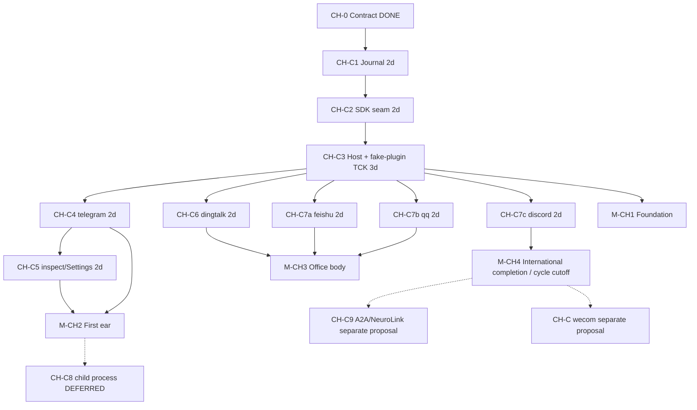
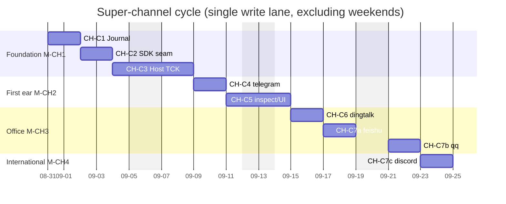

# AGENT-VIVY V0 — Project TODO Board

> Status: living board. V0–Studio tracks are **closed**; remaining work is §0.1.
> Archive of closed tracks: `docs/logs/2026-08-25-todo-board-archive/`.
> Milestones map to PRD §11 (M0–M4). Acceptance anchors cite PRD FR/AS/D ids.
> Architecture reference: `IMPLEMENTATION-PLAN.md`.
> Updated: 2026-09-11
> Development environment: `docs/architecture/VIVY-STUDIO.md`. Studio is the first-party daily IDE; other authorized tools work directly in this repository with their own capabilities.

---

## 0. Start posture (read first)

Per `GO-NOGO-PREFLIGHT.md` §8(b), V0 starts with the soft requirements below
accepted as **RISK ACCEPTED** with monitors, rather than closed first:

| Item | Posture | Monitor |
|---|---|---|
| SR-1 ADR baseline missing (D-035) | CLOSED | `docs/AGENT-VIVY-ARCHITECTURE-V0.md` authored 2026-08-08 |
| SR-2 Eino §6 claims unverified (D-034) | CLOSED | Verified by task **A1** — see `eino-capability-verify.md` (2026-08-07) |
| P0-3 PRD v0.5 final confirmation | RISK ACCEPTED | User sign-off tracked here; treat v0.5 as final until told otherwise |
| P0-4 SR acceptance posture | RESOLVED | This table is the acceptance record |

Gate rule: **A1 must pass before any C6 approval/interrupt work.** If A1 shows
Eino interrupt/resume cannot meet the Vivy Run state machine, C6 switches to
the outer-loop fallback (RK-3 stop-loss) and this board is re-planned.

> **GATE CLEARED (2026-08-07):** A1 verdict is **GO** — checkpoint-bridge
> approach verified against online Eino v0.9.13 (`docs/eino-capability-verify.md`,
> commit `fe81075`). C6 may proceed once its remaining predecessors (B4, C3)
> land; no outer-loop fallback needed.

## 0.1 Open remaining (updated 2026-09-09; completed rows archived verbatim to §10.1)

Everything in §1–§8, §9.1–§9.9, §11–§13, and HITL-01..07 P0 is **done**.
Do not pick work from those tables. Closed-track filing:
`docs/logs/2026-08-25-todo-board-archive/summary.md`.

> **PLG-1 normative ruling (updated 2026-09-11):** P0 is a documentation-only
> contract freeze. The human owner scheduled P1 and P2 together on 2026-09-09;
> both implementations are complete and verified in the same clean-break
> worktree and have landed. The human owner scheduled P4 and P5 on
> 2026-09-10; P4 and P5 are complete and integrated on 2026-09-11. P6
> capability implementation is also complete and integrated on 2026-09-11,
> while P3 and P7–P9 remain `UNSCHEDULED`; P9 release conformance remains a
> separate phase. Sources of truth are
> `docs/architecture/VIVY-MODULE-STANDARD.md`, `VIVY-PORT-CATALOG.md`,
> `VIVY-PLUGIN-SPEC.md`, `VIVY-ASSEMBLY.md`, and
> `docs/plans/plugin-platform/README.md`. The track is a clean break: no v0 API,
> migration, compatibility Adapter, or runtime discovery. Existing first-party
> functions stay in the default Generation; protected file/process/HITL/Skill
> Tools remain internal; UI Modules are fully open by default with no UI Grant.
> Provider/model/OAuth/orchestration/RAG/MCP adapter work uses a pinned
> Eino/EinoExt capability or becomes `DEFERRED-INDEFINITE`. SCX depends on
> PLG-1 Gate A (contract/compiler), Gate B (default governed assembly), and
> Gate C (conformance/Inspect/rollback); broader ecosystem and advanced UI work
> are not on the SCX core critical path.

| ID | Item | Status | Notes |
|---|---|---|---|
| EINO-BOUNDARY-AUDIT | Recheck the boundary between Vivy-built capabilities and native Eino/EinoExt capabilities | OPEN — 5.1/5.2/5.5/5.6 DONE 2026-09-06 | §5.1: `MCPBackend` uses Eino MCP `GetTools` for official tools/schema conversion, while typed Streamable HTTP in mcp-go v1.0.0 retains resources/prompts/lifecycle; `mcp_list_tools` remains a read-only control-plane catalog, while the former model-visible `mcp_call`/`PrepareMCPCall` path is retired and remote calls now traverse MCPHost → ToolWorld → ToolHost governance. Vivy continues to own `isError`, untrusted/bounds, and settings/app lifecycle. §5.2: dynamic active tools use pinned Eino v0.9.13 official middleware; Vivy continues to own the fixed core, allowlist, Skill mount, Policy/HITL/audit, and second checks, while the old search/visibility surface and Registry compatibility shell have been removed. §5.5: retain `observingChatModel` because Eino `OnEndWithStreamOutput` is a sibling Copy and cannot provide a Begin marker, bounded backpressure, persist fail-closed, or a tool barrier. §5.6: remove the misleading `Eino` prefix from Command/HTTP/MCP/SequentialThinking/WebFetch/Download. Eino currently does not cover MCP resources/prompts/lifecycle; stdio/OAuth/continuous listening are not implemented. Sequential Thinking and plantask compatibility remain OPEN, so the track stays open. Record: `docs/research/eino-boundary-audit-2026-09-05.md`, `docs/logs/2026-09-06-eino-native-mcp/`, `docs/logs/2026-09-06-eino-toolsearch/`, `docs/logs/2026-09-06-eino-boundary-stream-observer-naming/`. |
| MCP-TRANSPORT-1 | Integrate MCP stdio transport and OAuth through upstream Eino/mcp-go components; do not build a protocol stack in-house | OPEN — slice 1 DONE 2026-09-08; slice 2 OAuth OPEN | The stdio slice now runs through config/settings/app/runtime/RPC/browser import-export/i18n: lazy startup via `transport.NewStdioWithOptions` + `client.NewClient`; configuration is authorization (PATH name or absolute path, dangerous denylist, no new execute allowlist); `env_from` is a CHILD→HOST reference; cwd is confined to `runtime.workspace_root`; missing env produces an explicit error, the next operation detects a dead process, and stdio does not auto-restart; EinoExt `GetTools` and the existing governance path are unchanged. TUI/sidebar reuses the existing configured/initialized/error states and adds the additive `transport`/`env_missing` projection, with no separate UI/surface protocol. Remaining/separately tracked: raw-frame limit, Windows process-tree cleanup, OAuth TokenStore/needs-auth/RPC. Proposal and acceptance: `docs/plans/2026-09-07-mcp-stdio-upstream.md`, `docs/logs/2026-09-08-mcp-stdio/`; the stdio/OAuth entries in VC-4 are covered here. |
| MCP-STDIO-RAW-FRAME | Add a raw-frame byte limit to stdio JSON-RPC | OPEN | The mcp-go v1.0.0 stdio reader reads frames with `ReadString('\\n')`; it currently guarantees only decoded/projected bounds. An upstream PR or verifiable transport seam is required; a projected limit cannot be treated as a raw-frame limit. See limitation ⑤ in `docs/plans/2026-09-07-mcp-stdio-upstream.md`. |
| MCP-STDIO-PROCESS-TREE | Govern the Windows stdio child-process tree | OPEN | `CommandFunc` currently sets `WaitDelay` and mcp-go closes the current child, but there is no child-process-tree callback/Job Object semantics. First lock down the tree-reaping, cancellation, and timeout contract, then implement it and run a Windows smoke test. See limitation ⑩ in `docs/plans/2026-09-07-mcp-stdio-upstream.md`. |
| TUI-PROJECTION-ORDER | Store the Journal source seq explicitly in MessageStore for clock-independent stable ordering | OPEN | On 2026-09-04 the durable projector used event time and deterministic IDs containing seq to preserve same-millisecond order; final review noted that if the system clock moves backward within one run, the existing `ORDER BY created_at,id` can still diverge from Journal seq. Add source run/seq/order columns to derived messages or an independent projection mapping, then complete SQLite/Postgres migration and fork/rewind compatibility tests. The single-process mapper's event time is usually monotonic, so this does not block the N4/N6 data-integrity closure. |
| UI-STREAM-N1 | Complete the browser chat's completed-only final-text projection | OPEN | The 2026-09-04 TUI completion-semantics review also confirmed that the browser's realtime and replay projections in `ui/src/lib/store.ts` still accumulate only `model.delta` and do not consume `model.completed.content`; purely non-streaming/special adapters may therefore produce no visible answer in the browser. This is outside the current VIVY CODE TUI write lane; later work must establish a per-turn fence consistent with TUI and avoid delta+completed duplication. |
| TFLAKE-CRON-RECOVERY | `TestCronRecoveryPastDueRecurringJobFiresOnceOnWakeAndSkipsStorm` occasionally misses the asserted state in the 5s full-load window | OPEN | During the first `just ci` in the 2026-09-04 stream-driver lane, the job ran successfully and `LastStatus=ok`, but the 200ms recurring schedule continued advancing `NextRunAtMs` during the assertion window, so the test missed its brief wanted state. This is an unstable real-clock/polling integration canary window unrelated to this TUI code. Isolated rerun results are recorded in the current verification; later replace it with a deterministic recovery/skip-storm contract or a stable final predicate. Relevant path: `internal/runtime/cron_scheduler_test.go:370`. |
| TFLAKE-CRON-DELETE-RECURRENCE | `TestCronAtJobDeletesAfterSuccessfulRun` again occasionally times out in the 30s integration canary | OPEN | The second `just ci` in the 2026-09-04 stream-driver lane and repeated runs of the three-cron combination all observed the same state: the job was disabled, but run/settle had not advanced to deletion; a standalone `-count=1` on the same tree passed in 1.142s. The original `TFLAKE-CRON` deterministic settle contract remains green, but the integration canary is not truly stable under load; switch to deterministic scheduling or split fire/run/settle into observable waits. Relevant path: `internal/runtime/cron_scheduler_test.go:190`. |
| CLI-HELP-EXIT | Make `vivy --help` print usage and exit instead of starting the server | OPEN | Found during the 2026-09-11 PR19 integration smoke: `go run ./cmd/vivy --help` ignored the flag and launched the configured organism. This is outside the PR integration scope, but it is unsafe for diagnostic use because startup opens configured storage and logs. Add explicit CLI parsing/usage tests before changing startup behavior. Relevant path: `cmd/vivy/main.go`. |
| UI-FAVICON-404 | Stop the browser's automatic `/favicon.ico` request from producing a console 404 | OPEN | Found during the 2026-09-11 PR20 split-pair smoke. The selected full-UI surface, assets, WebSocket RPC, and typed action all passed; the only browser console error was the browser-generated request for the absent favicon. Add an intentional product icon or an explicit data-URL icon declaration in a separate UI asset change. Relevant path: `ui/index.html`. |
| TFLAKE-MCP-STDIO-REPLACE | MCP stdio replacement intermittently returns `context canceled` during the replacement handshake | OPEN | Found during the 2026-09-10 P1/P2 final checkpoint after an unrelated command-output race was fixed. `TestMCPBackendStdioReplaceRebuildsAndCloseIsIdempotent` failed once in five isolated sequential runs at the second `ListTools`; the other runs passed. Investigate the retired-client cleanup and replacement-client process contexts before changing lifecycle behavior. Relevant paths: `internal/runtime/mcp_backend.go`, `internal/runtime/mcp_backend_test.go:1005`. |
| TUI-USAGE-ACCOUNTING | Complete route/source attribution for provider calls and unify the cost-known contract | OPEN | On 2026-09-05, main/child/summary provider/model/source attribution, child cached tokens, summary override/failover routing, deterministic SQLite/Postgres projection, and CN-26 were completed, and sidebar/global stats were unified as all-priced; when cached tokens have a value but no dedicated reference price, fail closed and zero the unknown amount. `stats/tokens.scope=chat_runs` and the UI/TUI explicitly state that automatic titles and manual session compaction are outside the statistics scope. Remaining: if the product requires full provider billing, add a session-scoped usage recorder for auxiliary calls outside these two run types; fill `CachedInputPerMTokens` only after the provider catalog has a verified cached price—never guess. See `docs/logs/2026-09-05-vivy-code-usage-accounting/`. |
| TUI-MODEL-QUEUE-AFFINITY | Define model ownership for locally queued turns across clients | OPEN | The 2026-09-05 model-selection audit confirmed that each fullscreen client refuses a model change while its own queue is nonempty, and the server refuses one during an active/suspended/child run, but another client cannot observe a local queue that has not yet been submitted to the server. The current explicit semantics are that a queued turn uses the global active route at the moment of the actual `turn/start`; if the product wants the model locked at enqueue time, extend the typed turn contract with provider/model/base-url identity or introduce a server-side queue—do not guess in the UI. Relevant paths: `internal/tui/live.go`, `faces/tui/live.go`, `internal/rpc/control.go`. |
| STORAGE-ATTACH-PG-TEST | Complete Postgres parity tests for attachment/FileContext persistence | OPEN | The 2026-09-04 attachment security review confirmed SQLite/Postgres schema and transaction implementations are equivalent, but the existing Postgres tests do not cover attachment and FileContext round-trip, empty body, and fork/delete cases as the SQLite/control-plane tests do. This is storage test debt and does not affect the current resolver-only hardening; add it in a storage-conformance wave with a Postgres test service. |
| TUI-SIDEBAR-N1-OPEN | Extend the right rail with additional truth | OPEN | Wave 1 was DONE on 2026-09-08: the MCP right rail continues to come from the live backend and now includes handshake error, auth missing, and projected tool-count truth; the enabled Skills catalog shows origin without pretending it is mounted. See `docs/logs/2026-09-08-tui-sidebar-n1/`. Remaining scope: MCP event/notification status, actual skill→session mount provenance (origin ≠ mounted), and bounded LSP failed/exited history plus workspace diagnostic aggregates; see `docs/logs/2026-09-05-vivy-code-chat-viewport/` for the main-chat viewport/mouse scrolling. |
| TUI-CMD-I18N | Verify complete shared Web/TUI English and Chinese localization | IMPLEMENTED · VERIFICATION/CONFORMANCE OPEN | Tasks 1–7 implement locale catalogs, Generation/development defaults, global workspace persistence, and backend-authoritative hydration; Task 9 closes the runtime Han audit and Web gates (259 tests, typecheck/build/completeness). Per-face catalog parity does not prove the approved canonical cross-face catalog-shape requirement; retain it as an open conformance limitation. Plugin catalog validation and provenance now belong to scheduled PLG-P1, runtime Host resolution remains PLG-P6, and release conformance remains PLG-P9. See `docs/superpowers/specs/2026-09-09-i18n-design.md` and `docs/logs/2026-09-09-i18n-task-9/`. |
| VC-0A-N1 | Retention, cleanup, and named recovery for VIVY CODE private-instance directories | OPEN | Each startup currently creates a unique `code-instances/<instance>/`, avoiding shared-session and lease conflicts while retaining evidence for that run, but these directories accumulate over time. Clarify whether the product needs automatic expiry cleanup or explicit recovery of a private instance. Do not revert to sharing a Journal across processes. |
| PLG-1 | Complete PLUGINS v1 | P0 DOCS COMPLETE · P1/P2 IMPLEMENTATION COMPLETE · P4/P5/P6 COMPLETE · P3/P7–P9 UNSCHEDULED | See `docs/plans/plugin-platform/README.md` for the specification and phased plan; the research archive is `docs/research/advanced-plugin-alliance-2026-09-08.md`. P1/P2 and P4 have landed; P5 and P6 are reconciled into the single generated Assembly and server-authoritative Host paths. P6 UI/Action capability evidence is complete, while PLG-P9 release conformance and rollback remain separate and open. |
| VC-4 | Ecosystem and productization (as needed): MCP stdio transport + OAuth 2.1 + resources (`list_mcp_resources`/`read_mcp_resource`) + prompts (mapped into Vivy commands/skills) + MCPHost ToolWorld capabilities (no model-visible direct `mcp_call`/`mcp_{server}_{tool}` bypass) + sandbox upgrade alignment (SBX-OS/SBX-GLOB + editable bash deny glob/auto_approve) + builtin coding skills (git workflow/vivy-code usage/just-ci) + local model discovery (ollama and similar enrichers, filling only zero-value fields) + 401 re-authentication retry + self-diagnostic tool (crush_info-like) + evaluation of VCR-style LLM record/replay test infrastructure (aligned with scriptedmodel mocks) + `agentic_fetch`/`sourcegraph` (=WEB-1) | OPEN | Some items can run in parallel with VC-1..2. Differentiators (features Crush does not have): cron, policy hard-deny, manual CompactSession, server authentication, and multi-client remote access (potential). Explicitly out of scope: crushrc DSL, Catwalk remote catalog, PostHog telemetry, and copying the TUI theme system. |
| RB-L2-DEFER | Restore side: files/restore RPC + one-click session rollback UI (optionally include a Crush-style panel showing “which files this session changed”) | OPEN | Deferred by decision on 2026-09-01: the prototype MVP is not ready, so align with Crush first (the record side lands with the VC-3 tail); the restore side is a differentiation beyond Crush and can be revisited after MVP validation. The design is ready: rollback research §5.2/5.3/5.4, with O4 (archive scope) and O5 (restore governance) decisions to be made at kickoff |
| CH-A | ChannelHost + telegram + dingtalk (coarse-grained) | SUPERSEDED | Split into CH-C1..C6 on 2026-08-30; see §0.2. Do not claim this row again |
| CH-B | feishu / qq / discord (coarse-grained) | SUPERSEDED | Split into CH-C7a/b/c on 2026-08-30; see §0.2. Do not claim this row again |
| CH-C8 | `vivy channel --name` child process in the same binary | DEFERRED | Memo Plan: `docs/plans/channel-epic/CH-C8.md`. Not a start order |
| CH-C9 | A2A / NeuroLink capability proposal | DEFERRED | Memo Plan: `docs/plans/channel-epic/CH-C9.md`. Not a start order |
| CH-C | wecom after a non-TTY bind surface | OPEN | QR binding is the blocker; excluded from the 2026-08-30 batch and this cycle's §0.2 calendar |
| CH-C1-N2 | Contract §12 Journal sketch and CH-C1 §4 payload shape disagree | OPEN | Found 2026-08-30 (CH-C1): the contract says `{channel, peer, message_id, content_digest, bytes}`, while the PLAN defines `{channel, chat_id, sender, message_id, session_id, run_id?}` (no digest/bytes). Implemented according to the PLAN; the architect must confirm whether to back-port this to contract §12. Review conclusion (2026-08-30 Review L1): the review recommends rewriting contract §12 with the implemented identifiers-only payload; awaiting the architect's decision |
| CH-C1-N4 | `Source` has no vocabulary validation: `EffectiveSource` passes through any non-empty value | OPEN | Found 2026-08-30 (CH-C1): consistent with the “untyped vocabulary” decision; define and validate the `ui\|channel` vocabulary with the contract when the CH-C2 SDK seam lands |
| CH-C1-N5 | Postgres v14→15 upgrade tests and pg-side CN-17 have not run on real Postgres | OPEN | Found 2026-08-30 (CH-C1): no Docker/5432 locally; the `VIVY_POSTGRES_TEST_DSN`-gated case verifies only compile/vet/clean SKIP. Run it once in an environment with Postgres |
| CH-C2-N2 | §8 slot cleanup: `run_id`/`task_id` on `InboundMessage`/`OutboundMessage` (written by Host) | RESOLVED-DEFERRED | 2026-08-30 (CH-C3): Delete/Reaction/HealthChecker/ListenHandler interfaces are present (v1 method set); the run_id/task_id slots are intentionally deferred because the pseudo-run design has no consumer, and SDK comments now describe the deferral. Add them only when C4/C8 actually needs them; do not rename existing fields |
| CH-C3-N1 | Durable outbound delivery + `chanin_*` retention + Send/Stop races | OPEN | Found 2026-08-30 (CH-C3): terminal delivery is tracked in memory, so a process exit between run.completed and Send loses the reply; `chanin_*` events have no GC; StopAll does not wait for in-flight Send. On 2026-08-30 (CH-C4), the adapter-side race surface was closed (telegram plugin `bot/cancel/done` is immutable after Start + a no-panic Send-after-Stop test); the Host-side durable outbound queue / `chanin_*` retention policy remains open for a later Host slice |
| CH-C6-N3 | Dingtalk becomes deaf after a network-level silent disconnect (SDK Start returns immediately while conn is alive; only graceful disconnect frames trigger redial) | OPEN | Source verification of SDK v0.9.1 on 2026-09-01 (client.go): the SDK has ws ping/pong keepalive (keepAliveIdle 120s, pong timeout 5s), and the read side's death is detected internally—but with AutoReconnect=false, the processLoop exit defer only recovers and **neither closes nor clears cli.conn** (the same for read error/ping write failure/pong timeout), so Start() is permanently a no-op, the ear stays deaf, and external cleanup is impossible; evidence is emitted only through the SDK's global logger (interceptable with `SetLogger`). Adapter-side true staleness detection is infeasible: server ping data frames are consumed by the SDK's internal system handler, while chatbot callback timestamps create false positives during idle chat. Three options await a decision: (a) a one-line upstream patch (clear conn in processLoop defer so our supervise tick can redial automatically; preferred); (b) replace StreamClient with a thin client built into plugins/dingtalk (small protocol: endpoint+ticket+ws+loop, all owned by us); (c) a zero-dependency hack: intercept fatal lines via SetLogger → Close() → redial on the next tick (fragile against SDK strings). This involves message loss and upstream relations; do not code it speculatively |
| CH-R-1 | §8 “error classification (rate-limit/temporary)” slot has no SDK landing and was not previously tracked | OPEN | Review L1: contract §8 can routinely have HealthChecker but has no error-classification vocabulary; wait for C8+ or an error-handling proposal |
| CH-R-4 | verify has no “must implement Channel” type check (unreachable through AST) | OPEN | Review L4: startup-time partitionChannels is the fallback (non-Channel = startup failure); SDK-side type checking is infeasible, so retain as a memo |
| ACP-1 | ACP / remote control **implementation** | WONT-DO | 2026-08-31 User decision: ACP will not be implemented (research §8.7) |
| HITL-P1-1 | Specialized proposal editing | OPEN | Intentionally out of 2026-08-12 P0 |
| HITL-P1-2 | Scoped remember / allow policies | OPEN | |
| HITL-P1-3 | Structured MCP elicitation | OPEN | |
| HITL-P1-4 | Reviewer assignment | OPEN | |
| HITL-P1-5 | Review history / search | OPEN | |
| HITL-P1-6 | External notifications | OPEN | |
| HITL-P1-7 | Generic edit + bulk approval | DEFERRED | Explicitly not P0 |
| MEM-1 | Memory / BML / Laputa / AutoDream / Evolution / RAG | DEFERRED | Direction non-goal until a capability proposal |
| P2-3 | QwenPaw filesystem-journal probe | DEFERRED | Out of V0; SR-4 was decided on 2026-09-02: keep QwenPaw externally obtained and recheck it against `qwenpaw-vendor-ruling.md` when the probe is proposed |
| P2-4 | Long-term section map for V3 | DEFERRED | |
| UI-TREE | Child-run tree visualization | DEFERRED | Harness GOAL-4/5 API exists; no tree UI |
| SBX-OS | OS-level process sandbox (bwrap / Seatbelt / Windows ACL) | DEFERRED | EINO currently provides only workspace paths + command allowlist + HTTP policy, not a DSH process sandbox |
| SBX-GLOB | Sandbox deny glob / editable auto_approve_tools | DEFERRED | The settings page exposes only presets and network policy; timeout remains in general settings |
| SBX-LIVE | Hot-swappable permission preset for an in-progress run | DEFERRED | The current turn pins the session policy; it takes effect on the next `turn/start` |
| UI-EVO | Connect the evolution page to a real Evolution/AutoDream backend | OPEN | On 2026-08-25 the page was landed as an `agent-diva`-shaped `vivy.demo.*` demo-data page (`/evolution`, a three-tab governance loop plus cross-page navigation; see `docs/logs/2026-08-25-evolution-page/`); the kernel AutoDream/Evolution capability itself is MEM-1 (DEFERRED). After a capability proposal, replace `demo-api.ts` with real RPCs in `api.ts` and register the methods |
| ST-SUB-1 | Merge `feat/vivy-studio-submodule` into the main line | OPEN | On 2026-08-29 the Studio shell moved to a separate repo + submodule (see `docs/logs/2026-08-29-vivy-studio-submodule/`). The branch awaits human review before merge/push; do not stack other root-tree lanes directly on it |
| ST-SUB-2 | Move vivy-source plugin installation out of the submodule worktree | OPEN | It still writes to `studio/<slug>/` (dirtying the `vivy-studio` WT). It could move to `data/studio-home/source-plugins/`, with corresponding hub + launch merge logic |
| ST-SUB-3 | Further split community plugins into nested submodules (optional) | DEFERRED | The initial tree is all in `vivy-studio`; split it after size/update policy stabilizes |
| UI-PROV-REGISTRY | No migration path for existing registry localStorage data | OPEN | After the provider write logic moved to the backend registry on 2026-08-28, old `vivy.ui.customProviders` localStorage entries are no longer read (see `docs/logs/2026-08-28-provider-direct-write/`). Local users must register them again in Settings; automatic migration would require the UI to read the old key once and call `upsertProvider` for each entry, including a product decision on whether to backfill apiKey |
| UI-TODO-MUTATE | TODO list is read-only; people cannot add, delete, or edit items in the UI | OPEN | On 2026-08-29 the chat area connected to real `session/todos` (see `docs/logs/2026-08-29-chat-plan-todo-display/`); changes come only from `task_*` tools. Human-gated editing would be a pseudo-operation and needs an explicit product decision |
| UI-GOAL | No DSH-style goal kernel / GoalBar verbs | OPEN | The progress bar uses the current `in_progress` `active_form`/`subject` as its overview, not a standalone goal object. Porting `create_goal` requires a kernel proposal |
| TUI-DETAIL-F8 | Show token/cost at message level (proposal F8): add fields to the surface protocol | OPEN | The 2026-09-07 TUI detail-polish proposal explicitly excludes this (a display-only branch adds no protocol/RPC). If implemented, add a per-message usage projection to `surface.Meta` or the message payload, without violating the surface comment that it must “not infer server truth.” Relevant paths: `sdk/tui/surface/surface.go`, `sdk/tui/live/`. See §5 of `docs/plans/2026-09-06-tui-detail-polish.md` |
| TUI-DETAIL-CHROME-DUP | compact-mode chrome right segment duplicates title/host information already in the compact header | OPEN | After batch B of the 2026-09-07 spec implemented F12 chrome right-segment queued/host/title, the narrow (compact) header already had title·host and the chrome right segment displayed them again. This is a visual tradeoff: by width, compact mode could omit title/host candidates from the chrome segment. Relevant path: `sdk/tui/view/render.go` (`chromeMeta`/`renderCompact`). See `docs/logs/2026-09-07-tui-detail-polish/` |
Weixin iLink, OneBot (external NapCat), Discord voice, and public webhooks
are **not** on this board; they need their own capability proposal.

## 0.2 Channel program — schedule, breakdown, and activity diagram (decided 2026-08-30)

The authoritative dependency is still `VIVY-CHANNEL-PACK.md` §20. Evolution tree: `docs/architecture/VIVY-CHANNEL-EVOLUTION.md`.
Slice PLAN (sub-AGENTS claim ten sections at a time): `docs/plans/channel-epic/`; see the index in §0.2.8.
Filing: `docs/logs/2026-08-30-channel-program-plan/`, `docs/logs/2026-08-30-channel-epic-plans/`.

Assumptions (if unmet, reschedule; do not silently change the contract):

- **One write lane.** The root worktree permits only one implementation lane at a time; parallel work requires `git worktree` (`AGENTS.md` parallel-worktree-isolation).
- The schedule is **one delivery person's workdays**, excluding waits for real Bot accounts.
- The default `vivy.exe` / `just ci` **must never link** telego / discordgo / lark / dingtalk / botgo. Only a named pack enters the candidate body.
- Each channel plugin gets **one pack evaluation**. Do not link five SDKs into one PR.
- The start date is **2026-08-31 (Monday)**. Weekends do not count.

### 0.2.1 Milestones

| Milestone | Content | Planned completion | With 20% buffer | Exit |
|---|---|---|---|---|
| M-CH0 | Contract + Eino A2A clarification | 2026-08-30 | — | **DONE** (CH-0) |
| M-CH1 Foundation | CH-C1 + C2 + C3 | 2026-09-08 | 2026-09-10 | Host TCK green; default EXE still has no ears |
| M-CH2 First ear | CH-C4 + C5 | 2026-09-14 | 2026-09-16 | Candidate body supports telegram direct-message text; Settings lists compiled-in only; 3015 path exercised |
| M-CH3 Office body | CH-C6 + C7a + C7b | 2026-09-22 | 2026-09-25 | Recipe can select dingtalk+feishu+qq; one pack each |
| M-CH4 International completion | CH-C7c | 2026-09-24 | **2026-09-30 cycle cutoff** | Discord text, no voice |
| M-CH5 Follow-on | CH-C8 / C9 / CH-C | Unscheduled | — | Separate proposal |

The cycle cutoff is M-CH4. C8 child process, C9 A2A/NeuroLink, and WeCom **are outside this gate**.

### 0.2.2 WBS (claim from this table; do not claim superseded CH-A/B)

| ID | Slice | Person-days | Dependency | Parallel? | Success |
|---|---|---|---|---|---|
| CH-0 | Contract | — | — | — | DONE |
| CH-C1 | Journal `channel.inbound` + Message provenance + sqlite/pg migrations + conformance | 2 | CH-0 | No (critical path) | DONE 2026-08-30 (`just ci` green; no adapter. Filing: `docs/logs/2026-08-30-channel-c1/`) |
| CH-C2 | `SeamChannel`, grants, `ChannelEnv`, verify Listen/tools bans, standalone pack-overlay module | 2 | CH-C1 | No | DONE 2026-08-30 (verify/pack/Adapt/config all green. Filing: `docs/logs/2026-08-30-channel-c2/`) |
| CH-C3 | ChannelHost + fake channel-plugin TCK | 3 | CH-C2 | No | DONE 2026-08-30 (8 TCK cases green; fail-closed; no real protocol. Filing: `docs/logs/2026-08-30-channel-c3/`) |
| CH-C4 | `plugins/telegram` direct-message text long-poll | 2 | CH-C3 | Separate worktree with C6/C7 | DONE 2026-08-30 (pack candidate links telego; default EXE has no telego. Filing: `docs/logs/2026-08-30-channel-c4/`) |
| CH-C5 | Inspect RPC + Settings backend integration (= UI-CHANNELS-BE) | 2 | CH-C4 | Single lane after C4 (requires a real compiled-in name) | DONE 2026-08-30 (real 3015 path smoke-tested; only body names are toggled. Filing: `docs/logs/2026-08-30-channel-c5/`) |
| CH-C6 | `plugins/dingtalk` Stream | 2 | CH-C3 | Parallel with C4 (second worktree) | DONE 2026-08-30 (full candidate loop; default EXE has no dingtalk SDK. Filing: `docs/logs/2026-08-30-channel-c6/`) |
| CH-C7a | `plugins/feishu` WS | 2 | CH-C3 | C4 should land first | DONE 2026-08-30 (full candidate loop; 386 hard failure; no lark by default. Filing: `docs/logs/2026-08-30-channel-c7a/`) |
| CH-C7b | Official `plugins/qq` Bot | 2 | CH-C3 | Same as C7a | DONE 2026-08-30 (C2C text candidate loop; explicitly not personal accounts; no botgo by default. Filing: `docs/logs/2026-08-30-channel-c7b/`) |
| CH-C7c | `plugins/discord` text | 2 | CH-C3 | Same as C7a | DONE 2026-08-30 (**cycle cutoff M-CH4**: candidate has no pion; banned in verify. Filing: `docs/logs/2026-08-30-channel-c7c/`) |
| CH-C8 | `vivy channel --name` | — | After M-CH2 | — | DEFERRED |
| CH-C9 | A2A / NeuroLink proposal | — | Independent proposal | — | DEFERRED |
| CH-C | wecom | — | Non-TTY binding surface | — | Outside this cycle |

Total for this cycle: 2+2+3+2+2+2+2+2+2 = **19 person-days** (about 4 work weeks). With buffer, the cutoff is **2026-09-30**.

### 0.2.3 Critical path

Single lane (commitment calendar):

```text
CH-0 → C1 → C2 → C3 → C4 → C5 → C6 → C7a → C7b → C7c
         2d   2d   3d   2d   2d   2d    2d    2d    2d
Foundation M-CH1 = C1+C2+C3 = 7d → 2026-09-08
First ear M-CH2 = +C4+C5 = 11d → 2026-09-14
```

There are only two compression levers: after C3, use a **second worktree** to overlap C4∥C6 (save 2d); split the three C7 packages into separate trees (at most compress 6d to 2d, while Host/pack recipes still merge serially). **Do not stack a second implementation on a dirty root worktree.**

### 0.2.4 Activity diagram (dependencies)



C3 is the fan-out point. C4 is the ABI template: the second lane can start dingtalk immediately; do not open a third SDK before C4 lands.

### 0.2.5 Gantt (single-lane commitment)



Two-lane acceleration (after C3): C4∥C6, with C5 still following C4; at most one more tree for the three C7 packages. The calendar can close around **2026-09-18** at the earliest, provided someone actually writes in the second worktree.

### 0.2.6 Explicitly out of scope (this cycle)

- C8 crash-domain child process, C9 A2A/NeuroLink implementation, CH-C WeCom
- Public webhooks, Discord voice, QQ personal accounts, OneBot, email, media/group/streaming placeholders
- Adding five SDKs to the default `go.mod`; using `RegisterServerHandlers(adk.Agent)` as an A2A gateway
- Replacing Face with channel; treating channel users as HITL approvers

### 0.2.7 Next cut

**This cycle (C1–C7c) is fully DONE (2026-08-30, M-CH4 cutoff).** Branch chain: `feat/channel-c1`→`c2`→…→`c6`; C7a commit 12a2a70 landed directly on `feat/channel-c6` at the time (no separate `feat/channel-c7a` branch), followed by `feat/channel-c7b` and `feat/channel-c7c` in sequence. Logs: `docs/logs/2026-08-30-channel-c*/`.

There is no scheduled next cut. Stage H items are memos, not start orders:

- **CH-C8** (same-binary `vivy channel --name` child process): no technical predecessor gap, but it is a follow-on by contract and calendar; a user must name it to start.
- **CH-C9** (A2A / NeuroLink): contract §21 requires an **independent capability proposal + binding/auth surface**; “no proposal, no slice” — the proposal itself is product decision material, and adoption is a contract-level decision.
- Side items (not part of the channel EPIC): §0.1 CH-C7c-N1 (plugin-ci recipe), TEST-2 (runtime flake), CH-C1-N5 (run once against real Postgres).

### 0.2.8 PLAN index (sub-AGENT claim surface)

Standing orders: `docs/plans/channel-epic/00-standing-orders.md`
Evolution tree: `docs/architecture/VIVY-CHANNEL-EVOLUTION.md`
Directory: `docs/plans/channel-epic/README.md`

| ID | Plan | Architecture stage |
|---|---|---|
| CH-C1 | `docs/plans/channel-epic/CH-C1.md` | A genetic material |
| CH-C2 | `docs/plans/channel-epic/CH-C2.md` | B species window |
| CH-C3 | `docs/plans/channel-epic/CH-C3.md` | C world entrance |
| CH-C4 | `docs/plans/channel-epic/CH-C4.md` | D ABI template |
| CH-C5 | `docs/plans/channel-epic/CH-C5.md` | E visibility |
| CH-C6 | `docs/plans/channel-epic/CH-C6.md` | F domestic |
| CH-C7a | `docs/plans/channel-epic/CH-C7a.md` | F domestic |
| CH-C7b | `docs/plans/channel-epic/CH-C7b.md` | F domestic |
| CH-C7c | `docs/plans/channel-epic/CH-C7c.md` | G international / cycle cutoff |
| CH-C8 | `docs/plans/channel-epic/CH-C8.md` | H follow-on memo |
| CH-C9 | `docs/plans/channel-epic/CH-C9.md` | H follow-on memo |

## 1. Milestone map (archived — V0 closed 2026-08-07)

| Milestone | PRD §11 | Tasks | Exit criteria |
|---|---|---|---|
| M0 Spike | M0 | A1, B0, B1, C1, C3 (spike), C4 (spike) | Eino stream + tool wrap cleanly; one HTTP endpoint streams |
| M1 Vertical slice | M1 | A2, A3, B2, B3, B4, B5, C2, C5, D1, D3(min) | AS-1 + AS-8 (mock path) pass |
| M2 Tools & approval | M2 | C6, D2, D3(approval UI) | AS-3, AS-4 pass |
| M3 Recovery & cancel | M3 | E1, E2, E3 | AS-5, AS-6, AS-9 pass |
| M4 Polish & smoke | M4 | D4, E4, real-provider smoke | All AS-1..AS-9 pass on real provider — **DONE 2026-08-07** |

## 2. Lane A — Documents & contracts (archived)

| ID | Task | Depends | Closes / Anchor |
|---|---|---|---|
| A1 | Author `eino-capability-verify.md`: verify against online Eino v0.9.13 that (a) `CheckPointStore{Get,Set}` exists, (b) default payload serializer, (c) interrupt/resume at Runner level with a public hook for Vivy journal commit | B1 | D-034, SR-2; gates C6 |
| A2 | Provider bundle spec + two YAML bundles (`openai.yaml`, `anthropic.yaml`) with `provenance` field, D-024 field list | B1 | P1-2, OQ-8, D-018/D-022..D-025 |
| A3 | Vivy-owned JSON Schema for the ten `RunEvent` types; single contract for Eino-side and UI-side streams | B3 | P1-3, FR-5 |

## 3. Lane B — Foundation (archived)

| ID | Task | Depends | Closes / Anchor |
|---|---|---|---|
| B0 | Persist `GOPROXY=https://goproxy.cn,direct`; pre-warm module cache | — | SR-7, P1-1 (DONE at init) |
| B1 | `go mod init agent-vivy` + online deps (eino v0.9.13, eino-ext openai v0.1.13, modernc.org/sqlite v1.56.0); build passes | B0 | DONE at init; D-006 |
| B2 | `internal/config` load/validate + `internal/app` composition + `cmd/vivy` health endpoint + graceful shutdown | B1 | FR-10, NFR bounded shutdown |
| B3 | `internal/domain` nine contract types + Run state machine + event vocabulary | B1 | FR-4, FR-5, D-007 |
| B4 | `internal/storage` four contracts + SQLite backend + versioned migrations | B3 | D-026..D-027, FR-8 |
| B5 | Backend conformance suite (≥16 cases, D-032); red at M0, green by M2/M3 | B4 | D-032, RK-7 |

## 4. Lane C — Runtime (the Eino door) (archived)

| ID | Task | Depends | Closes / Anchor |
|---|---|---|---|
| C1 | Mock provider (deterministic, reproducible runs) behind `domain.ChatModel` | B3 | FR-3, NFR deterministic mode |
| C2 | `ProviderRef` boundary + openai bundle wiring via eino-ext openai component; enforce non-`provider` packages can't import provider-specific code | A2, B3 | P1-4, FR-3, D-007 |
| C3 | Wire `ChatModelAgent` + `adk.NewRunner` behind `internal/runtime` | B1, C1 | M0 spike, FR-4 |
| C4 | Map Eino `AgentEvent` → `domain.RunEvent`, persist to Journal before fan-out | A3, B3, C3 | FR-5, D-007 |
| C5 | Read-only auto-execute tool (`tool.started`/`tool.finished` without approval) | B3 | FR-6, AS-2 |
| C6 | Effectful approval-gated tool via interrupt/resume + two-layer checkpoint bridge | **A1**, B4, C3 | D-028..D-030, FR-6, AS-3/AS-4 |

## 5. Lane D — API & UI (archived)

| ID | Task | Depends | Closes / Anchor |
|---|---|---|---|
| D1 | HTTP command/query endpoints + SSE `after_seq` replay-then-live stream | B2, B4, C4 | FR-1, FR-5, AS-7 |
| D2 | Approval endpoints with server-side enforcement (binding + expiration) | C6, D1 | FR-7, D-009, RK-6 |
| D3 | Vite UI shell: sessions, streaming chat, approval prompt, run-detail/event-log, error display, refresh-safe | D1 | FR-9, D-013, AS-7 |
| D4 | Playwright smoke against the real Go process; add Eino/`agent-diva` import-lint gate to CI | D3 | FR-9, D-007, RK-1, RK-5 |

## 6. Lane E — Correctness (archived)

| ID | Task | Depends | Closes / Anchor |
|---|---|---|---|
| E1 | Cancellation → exactly one `run.cancelled` terminal event (mid-stream, mid-tool, pre-start) | C4 | D-008, AS-5 |
| E2 | Restart recovery: enumerate non-terminal runs, resume or fail definitively, no duplicate terminal | B4, B5, C3 | FR-8, AS-6, RK-7 |
| E3 | Secret-redaction audit: no secret in SQLite, event payloads, or UI storage | B4, C2 | D-010, AS-9 |
| E4 | Windows bounded graceful shutdown (SIGINT/SIGTERM/console close), flush events, close SQLite | B2, D1 | NFR bounded shutdown, AS gate |

## 7. Dependency graph (tight predecessors)

```text
B0 -> B1
B1 -> {A1, A2, B2, B3, C3}          # fan-out after module init
B3 -> {A3, C1, C5}
A3 -> C4
B3 -> B4 -> B5
A2 -> C2
B3 -> C2
C1 -> C3 -> C4 -> D1
B4 -> D1
B2 -> D1
A1 -+
B4 -+-> C6 -> D2
C3 -+
D1 -> D3 -> D4
C4 -> E1
B4,B5,C3 -> E2
B4,C2 -> E3
B2,D1 -> E4
```

### 7.1 Critical path

```text
B0 -> B1 -> B3 -> C1 -> C3 -> C4 -> D1 -> D3 -> E2 -> M4 acceptance
```

This is the longest dependency chain; compressing it compresses V0. `B3`
(domain types) and `C1` (mock provider) are the highest-leverage early tasks.

### 7.2 Parallel lanes (independent once their predecessor set is met)

- After `B1`: `{A1, A2, B2}` run concurrently — none block each other.
- After `B3`: `{A3, C1, C5, B4}` fan out together.
- `B4/B5` (storage) run fully in parallel with Lane C (runtime).
- `C2` and `C5` run in parallel once their deps are met.
- `D3` UI skeleton can start against the `schemas/` contract as soon as `A3`
  lands, even before `D1` is complete (contract-first), then integrate.

### 7.3 Single points of serialization

- `B3` (domain types): everything downstream speaks domain; do it early, keep
  it stable.
- `A1` (Eino verification): hard gate for `C6`; schedule in the first batch.
- `B5` (conformance suite): must turn green before `E2` is trusted.

## 8. Definition of done per milestone

- **M0:** spike proves Eino stream + tool call wrap cleanly; `eino-capability-verify.md`
  written; GO/NO-GO on the checkpoint-bridge approach.
- **M1:** AS-1 + AS-8 pass on the mock path; vertical slice (session → message →
  stream → persisted run → visible events) real end to end.
- **M2:** AS-3, AS-4 pass; approval server-side enforced; conformance suite green
  for approval cases.
- **M3:** AS-5, AS-6, AS-9 pass; exactly-one-terminal invariant holds under kill.
- **M4:** AS-1..AS-9 all pass against the real provider on Windows; UI smoke
  green; structured errors visible.

## 9. Risk-accepted backlog (not in the critical path)

Living remainder is §0.1. Closed rows from this table:

| Ref | Item | Outcome |
|---|---|---|
| SR-1 / D-035 | Author `AGENT-VIVY-ARCHITECTURE-V0.md` | CLOSED 2026-08-08 |
| P1-6 | 16-case conformance harness | CLOSED as B5 2026-08-07 |
| RI-OQ-4 | `.workspace/` versioning | CLOSED 2026-08-25 — `/.workspace/` is gitignored |

Still open (copied into §0.1): SR-4 QwenPaw vendor; P3-1/P3-2 licenses; P2-1 inventory.

## 9.8 ADR-017 — vivy-sdk split (done 2026-08-15)

Recorded. `vivy-sdk` is a separate binary under repo-root `sdk/`.
`cmd/vivy` no longer dispatches `sdk`. The packer may later embed
sources or a toolchain and must not ride in the daily install.

## 9.9 Vivy Studio + development venue (2026-08-15)

Canonical: `docs/architecture/VIVY-STUDIO.md`. ADR-018.

Studio is an independent app and the first-party daily development IDE.
Species-side S7 card product meaning is void (NG-28). **Other authorized
developer tools may work directly in this repository with their own native
capabilities; no Studio handoff is required (NG-26).**

| ID | Status | Note |
|---|---|---|
| ST-0 | done (docs) | This correction |
| ST-1 | done (2026-08-16) | Independent `vivy-studio` profile + Fluorite identity UI |
| ST-2 | done (2026-08-16) | Workspace pinned to `agent-vivy`; production Journal forbidden |
| ST-3 | done (2026-08-16) | Launch PATH has Go / just / `vivy-sdk` |
| ST-4 | done (2026-08-16) | Skills `vivy-plugin-five` + `vivy-kernel-ci` |
| ST-6 | done (2026-08-16) | In-Studio `internal/buildinfo` comment + `just ci` green. Venue switch. |
| ST-5 | done (2026-08-16) | `cmd/vivy-studio` + `internal/studiocore`: Studio execs `vivy-sdk pack`, spawns candidate EXE itself, ledger `data/studio-home/studio.db`; zero live-species participation |
| ST-7 | done (2026-08-16) | Human-gated `release --actor human --yes`; `install` writes daily location, no hot-swap |
| ST-8 | done (2026-08-16) | `rollback` restores previous release from Studio snapshot; tenant Journal untouched |

## 9.7 S7 — studio card (superseded 2026-08-15)

Claimed 2026-08-15, then voided the same day. ADR-016 remains as
history; ADR-018 / NG-28 freeze the species-side card. Do not extend.

## 9.6 S6 — sdk pack (done 2026-08-15)

Done. ADR-015. `vivy-sdk pack` links named plugins into a new EXE via
overlay and writes generation.json. No UI, no fitness suite.

## 9.5 S5 — sdk verify (done 2026-08-15)

Done. ADR-014. `vivy-sdk verify` plus `plugins/hello-fs`. No pack,
no generated register, no live plugin load.

## 9.4 S4 — air-gapped eval (done 2026-08-15)

Done. ADR-013. `evals/start` launches a same-EXE candidate with an
isolated data dir and records `EvalRun`. No pack, no fitness suite, no UI.

## 9.3 S3 — species inspect (done 2026-08-15)

Done. ADR-012. `species/inspect` reports builtin-or-promoted generation,
policy hash, and tool names. No eval process, pack, or UI.

## 9.2 S2 — studio object plane (done 2026-08-14)

Done. ADR-011. Generation / EvalRun / Promotion stores, studio events,
JSON-RPC list/get/create/record/promote. No inspect, pack, eval process, or UI.

## 9.1 S1 — model-visible ≡ logged (done 2026-08-14)

Done. ADR-010. Tool turns project onto the message log, enter the next-run
feed, and each invocation records `model.request` digests. No Studio, no
SDK pack, no DSH.

## 10. Completion log

| Date | Item | Note |
|---|---|---|
| 2026-09-11 | TFLAKE-CRON-MANUAL-SETTLE condition-based closure | Root cause: `settleCronRun` intentionally persists the terminal job row before removing the active in-memory entry, while the test treated those asynchronous observations as atomic. The test now waits explicitly and boundedly for active-run cleanup after durable settlement; the focused case passed 50 consecutive runs and the final `just ci` passed. Filing: `docs/logs/2026-09-11-pr19-integration/`. |
| 2026-09-11 | PLG-P4 Task6 review hardening | Preserved the pending MCP state/secret-boundary fixes: deferred and disabled instances fail closed before RPC Probe and legacy backend ListTools/resources/prompts/GetPrompt/acquire paths; disabled precedence projects `inactive`; config/settings/upsert reject MCP endpoint userinfo and credential-shaped query params before persistence, while public endpoint projection omits invalid legacy values. Focused Go regular/race/vet/gofmt/diff checks and UI tests/typecheck/build pass; split-browser smoke remains blocked by missing Chromium and `just ci` by missing `just`. Filing: `docs/logs/2026-09-10-plugin-v1-p4/` |
| 2026-09-10 | MAIN-CI-RED-I18N `just ci` red on main after the 2026-09-09 i18n / plugin-v1-preflight merge | Found 2026-09-09 on `bcc7468` (Windows, go1.26.4 — the same matrix as the new `.github/workflows/ci.yml`); all three findings came from the i18n lane whose `TUI-CMD-I18N` entry recorded that Go/just were unavailable when it shipped. Fixed same iteration: (1) `fmt-check` — `gofmt -w` on `internal/app/settings/settings_test.go`, `internal/rpc/control.go`, `internal/rpc/control_test.go`, `sdk/tui/live/controller.go`, `sdk/tui/view/render.go`; (2) `internal/codeface` `TestCodeLaunchSettingsLocaleUsesSharedPath` now pins `runtime.SetEngineVersionOverride("v0.9.13")` (go.mod pin) with `t.Cleanup`, matching every `internal/app` suite, so the checkpoint bridge no longer fail-closes in `go test` binaries; (3) `sdk/tui/view` sessions footer renders through a new `wrapWords` helper with the dialog's real text budget (`w - Dialog.GetHorizontalPadding()`), so at width 60 the en help line folds `delete` whole onto its own line instead of hard-wrapping mid-word. Full `just ci` green after the fixes (fmt-check, ui-ci + i18n completeness/cross-face checks, vet, test, headless-compile, plugin-ci). Known residual: the rename/delete dialog footers share the latent hard-wrap hazard below the tested minimum width and remain short/uncovered. Filing: `docs/logs/2026-09-10-main-ci-red-fixes/`. |
| 2026-09-07 | TUI-VIEWPORT-N1-OPEN open-state viewport closure (anchoring + render cache + loading state) | The paused viewport moved from a numeric offset to a `(segment,line)` message anchor plus an assembly fingerprint: `clampChatScroll` remaps the anchor to the current offset only when the fingerprint changes (content changes), so expanding a tool result above the anchor no longer shifts the viewport, and clamping identical content does not overwrite an explicit offset; `chatSegments` reuses segmented assembly with a full-field maphash fingerprint (separator rows are built in), while `renderChat` slices and joins only the visible window instead of re-rendering every frame and flattening the entire history (`mdCache` handles single-message rendering on rebuild paths); Live sets `surface.Meta.Loading` during the delete→switch→load window, and an empty-session view renders “Loading conversation history…” instead of pretending to be an empty-conversation hero. The assembly pointer is allocated once by `New()` and updated in place; value copies share it. Filing: `docs/logs/2026-09-07-tui-viewport-n1/`. |
| 2026-09-07 | TUI-CMD-N5 dynamic-command P2 parity and resource cleanup | Expansion RPC now truly cancels: the surface adds `DynamicCommandCanceller`; `Live` registers cancellation with a view-private request id (idempotent, unregistered when the RPC ends), and the view cancels the RPC before discarding late results on Esc or active-session changes (the editor no longer waits for the full 15s timeout; the cancel message uses the existing discard path to restore the draft and diagnostics). The parameter form records `dynamicArgumentSession` and closes the old session form when the session changes; existing key-routing priority proves palette↔form mutual exclusion, so nothing new is needed; the success path of `applyDynamicCommandsMsg` clears the legacy `dynamic commands:` prefix error; after `<loaded_skill>` envelope evaluation, it remains equivalent plain text (intentionally equivalent, with no behavioral benefit). The plain-REPL directory gap disappeared with the single fullscreen-face refactor (the palette refreshes every time it opens). Filing: `docs/logs/2026-09-07-tui-cmd-n5/`. |
| 2026-09-07 | TUI-MD-TOOL-RESULTS route tool-card bodies through Markdown/chroma/diff | Ported Crush tool-result routing: `toolResultContent` has four classifications (JSON is reformatted with byte-preserving `json.Indent`; `isUnifiedDiffContent` detects diff by line prefixes = ported Crush diffdetect plus Vivy hunk-alone compatibility, fixing the substring bug that misclassified Markdown lists as diffs; Markdown sniffing retains Crush's pattern table; the rest is plain). `renderToolBodyLines` wraps JSON/Markdown in fenced code blocks and renders them through existing `renderMarkdown` (`quiet=false`, with chroma configuration only in normal style); chroma highlighting reuses the shared renderer rather than a new SyntaxHighlight; diffs use existing `renderDiffBody` coloring; plain text keeps `wrapText`. Compact 8-line truncation and `ctrl+o` expansion are unchanged. Filing: `docs/logs/2026-09-07-tui-md-tool-results/`. |
| 2026-09-07 | TUI-MD-STREAM-CACHE incremental rendering of stable-prefix streaming Markdown | Ported Crush's `streamingMarkdown` blank-line boundary cache into the shared renderer: added `sdk/tui/view/streaming_markdown.go` with (id,quiet) keys, an 8-entry cap, reset on width changes/non-prefix rewrites, and rejection of fence parity/HTML/link-reference/loose-list continuation/setext/table-pipe hazards; any doubt falls back to full rendering while retaining the cache. `renderMessageBody` uses the incremental path for `Streaming` bubbles, while completed states retain the original full render + mdCache; `renderMarkdown` is split into `renderMarkdownLocked`, and the streaming sequence holds `mdRenderMu` throughout to prevent interleaving shared goldmark state. Tests cover boundary promotion, unbounded flush, open-fence no-cut, width-change and rewrite reset, the hazard table, and cached rendering for Streaming bubbles. Filing: `docs/logs/2026-09-07-tui-md-stream-cache/`. |
| 2026-09-07 | TUI-CMD-N4 close out the remaining asynchronous dynamic-command state | Added `dynamicCommandEpoch`: `bootCmd` captures the epoch before fetching the directory, and `applyBoot` applies commands/CommandErr only when the epoch matches, so a late boot cannot overwrite a completed refresh directory or revive an old error; when expansion succeeds but `Driver.Send` returns nil, the original slash draft is restored with a notice; pending expansion locks the editor and secondary surface (Esc restores the draft and cancels, Ctrl+C exits), and mouse routing was checked for bypasses. Covered boot-vs-refresh (directory + error cases), send-nil, and pending editor/overlay tests. Filing: `docs/logs/2026-09-07-tui-cmd-n4/`. |
| 2026-09-07 | TUI-STREAM-N5 tighten the defensive durable-stream contract | `stream.Decode` now requires `subscription_id`/`run_id`; `streamRun` immediately releases subscriptions whose after_seq already covers the terminal state or whose run does not exist (based on the commit-order invariant that emitTerminal persists the terminal event before flipping state); removed `Inbox.Take()`'s hidden replay fence. The streamLost epoch and shared-Inbox migration were absorbed by the Live refactor; the `Live.Close` ownership boundary retains the original design. Filing: `docs/logs/2026-09-07-tui-stream-n5/`. |
| 2026-09-07 | TUI-WORKSPACE-OWNERSHIP workspace RPC ownership validation | Before touching the filesystem, `workspace/list` and `workspace/read` prove through `Runs.GetRun` that the run belongs to this Journal (under loopback trusted transport, Journal existence is the ownership fact); unknown runs fail closed with 404. `WorkspaceFiles` switches from `Ensure` to `Existing` (never creates directories) and adds `ErrWorkspaceNotFound`→404 mapping; `Read` is hardened against races with open-handle Stat plus bounded reads; tests cover control characters/`..`/separator run IDs and final-component symlinks. Filing: `docs/logs/2026-09-07-workspace-ownership/`. |
| 2026-09-07 | §0.1 board cleanup: archive completed rows in §10.1 | The open board now retains only OPEN/DEFERRED/WONT-DO/SUPERSEDED/RESOLVED-DEFERRED rows; DONE and RESOLVED rows moved verbatim into the §10.1 archive (not deleted or rewritten, honoring the “never silently delete” rule). docs-only. |
| 2026-09-07 | Lane C chat body F5/F9/F13 | Three presentation upgrades in shared view (`sdk/tui/view`): F5 expands tool cards within the session with `ctrl+o` (default 8-line truncation remains, the marker becomes `… N more lines · ctrl+o expand`, and `tui.debug` semantics are unchanged); F9 folds reasoning with `ctrl+r` into a one-line summary (`mdCache` adds a collapsed dimension to prevent stale rendering); F13 adds an empty-session hero (wordmark, a journey to find your true heart, CWD, and key hints). Both keys are inert when a gate exists; the shortcut panel gains two rows. Shared by built-in/packed/live paths. Filing: `docs/logs/2026-09-07-tui-chat-body-polish/`. |
| 2026-09-06 | EINO-BOUNDARY-AUDIT §5.1/§5.5/§5.6 | Eino MCP `GetTools` now owns tools/schema conversion, while the mcp-go typed client retains resources/prompts/lifecycle and Vivy's `isError` semantics; the ChatModel stream observer remains because Eino callbacks are a sibling Copy and cannot satisfy the Begin marker, bounded backpressure, persist fail-closed, or tool barrier. Six items including `MCPBackend` lost the misleading `Eino` prefix. The parent remains OPEN (tool_search, Sequential Thinking, plantask). Filing: `docs/logs/2026-09-06-eino-native-mcp/`, `docs/logs/2026-09-06-eino-boundary-stream-observer-naming/`. |
| 2026-09-06 | Automatic startup-directory AGENTS.md / SKILL scan | Eino native injection remains; Vivy adds a cwd/git-root discovery adapter. The sandbox world can also inject the host AGENTS.md without mounting the host as the file-tool world. Project skills use a read-only overlay, and the catalog marks origin. Filing: `docs/logs/2026-09-06-project-instruction-scan/`. |
| 2026-09-06 | TUI-MODE-CHROME Shift+Tab modes and colored chrome | Smart/plan/read-only cycle through the existing RunMode+permission; thinking maps to (high)/(auto); context percentages are colored; TrueColor is the default. Filing: `docs/logs/2026-09-06-tui-mode-chrome/`. |
| 2026-09-05 | TUI-INPUT-CHROME symmetric chrome below the input box | Empty input plus `shift+h` opens help (the former command/mode panel); removed `TUI`/`live` from the bottom bar; gateway moves to the right rail; permission/model/provider are below the input on the left, with shortcut hints on the right. Filing: `docs/logs/2026-09-05-tui-input-chrome/`. |
| 2026-09-05 | TUI-CMD-N3 dynamic skills / MCP prompt commands | User-invocable skill frontmatter and MCP prompts enter the typed dynamic command directory; the server revalidates before expansion, and MCP parameters are validated as `NAME=value`; fullscreen refreshes on every panel open, while REPL loads at startup; built-in/packed both support usage, async fences, and failed-draft recovery. Filing: `docs/logs/2026-09-05-vivy-code-dynamic-commands/`. |
| 2026-09-04 | TUI-FILE-COMPLETE fullscreen `@file` completion | Server-side query-first metadata catalog, 8 KiB probe/access budget, and safe-path filtering; shared popup debounce, stale/session fence, keyboard navigation, and quoted-path round-trip; built-in/packed RPC parity. Filing: `docs/logs/2026-09-04-vivy-code-file-completion/`. |
| 2026-09-04 | TUI-STREAM-N3 / TUI-TOOL-N1 completion semantics and tool identity | `model.completed.content` became the authoritative full text for a model turn; completed-only, deduplication, empty completion, and cross-turn fencing all close correctly; the mapper flushes same-frame assistant text before a tool call and clears pending; `tool_call_id` is retained through the tool card/gate/history chain, so concurrent same-name calls settle precisely. Filing: `docs/logs/2026-09-04-vivy-code-completed-tool-identity/`. |
| 2026-09-05 | TUI-STREAM-N4 / N6 durable assistant projection | `model.delta` is the v2 body truth, while `model.completed` submits only hash/byte length; Journal replay repairs MessageStore idempotently, retaining tool-prefixed assistant text and v1 compatibility, with the built-in/packed TUI, headless, and trajectory paths upgraded end to end. Filing: `docs/logs/2026-09-05-durable-assistant-projection/`. |
| 2026-09-04 | TUI-STREAM-N1/N2 durable stream-driver lifecycle closure | Built-in fullscreen, packed fullscreen, and plain REPL share durable cursor/gap-replay/stream_error semantics; subscription ID, epoch, stale-stream filtering, session switching, and Close cleanup are closed; the shared inbox has entry and UTF-8-byte bounds and drains a bounded amount per tick, recovering overflow through Journal replay. Filing: `docs/logs/2026-09-04-vivy-code-stream-driver-lifecycle/`. |
| 2026-09-04 | UI-COMPOSER / UI-CHAT-TOOLBAR pseudo-operation cleanup and closure | Closed the pseudo-operations in the ChatInput.tsx toolbar: removed the persistent AutoDream icon entirely (per the architecture rule that controls without an authoritative capability stay hidden instead of being replaced by demo controls, until the MEM-1 memory system can expose a capability switch); hid the nonfunctional “Ask mode” from the execution-mode dropdown (keeping only the genuinely supported agent and plan modes); followed Crush semantics for persistence (thinking and execution mode are selected per turn, not persisted per session); removed dead i18n keys (zh/en in sync); pinned AutoDream hiding and dropdown convergence in `thinking-gate.spec.ts`; fixed path handling with `EvalSymlinks` in `internal/codeface/launch_test.go` to eliminate short-path comparison false positives. Full `just ci` + `ui-e2e` green. Filing: `docs/logs/2026-09-04-chat-toolbar-cleanup/`. |
| 2026-09-04 | VIVY CODE thinking levels | Shared TUI adds `/thinking [auto\|on\|off]` and Ctrl+T, showing the shortcut only when `session/context.thinking_supported` is true; built-in, packed face, and REPL all pass the choice through `turn/start.thinking`, snapshot the level in queued messages, and downgrade to auto when switching to an unsupported session or when REPL capabilities drift. Filing: `docs/logs/2026-09-04-vivy-code-thinking-mode/`. |
| 2026-09-02 | FACE-TUI-1 F2: seam-face contract + kernel RunFace + shipped faces/headless organ + pack `--face` | SDK: `SeamFace` + face-family grants (tty/argv/rpc.client) + `sdk/plugin/face.go` (Face/FaceEnv/FaceOptions/FaceResult/FaceConstructor—the organ is a control-plane client, never a model tool); verify dispatches by seam: face envelope (kind ∈ web\|tui\|headless, listen must be false, zero tools, grants limited to the face family) + `hasNewFace` constructor rule (`func New(plugin.FaceOptions) plugin.Face`). Kernel: `RunFace` (gateway-less composition + DialControl net.Pipe + faceEnv adapter, with the organ seeing only FaceEnv) + default nil registry in `internal/generated/face` (committed body `vivy run` behavior unchanged) + `domain.AssemblyRecipe.Face`. Shipped `faces/headless` organ (standalone module `example.com/vivy/faces/headless`, zero third-party dependencies; control-plane JSON-RPC only: initialize→resolve session/--continue→turn/start→run/subscribe replay→render events; §14④ approval/question → loud notification + durable run/cancel endpoint). pack `--face`: at most one (§14③ one mouth per generation), resolveFaceDir, build-time overlay face registry, record Artifact.face + recipe.face, merge the standalone module through the existing -modfile path (no live go.mod/go.sum writes). cmd/vivy run branches by registry (same exit-code mapping on both paths). Tests: 7 faces/headless `-race` cases (fake FaceEnv follows real control-plane semantics: run/cancel then emits run.cancelled); app-level TestRunFaceWithoutOrganFails + TestRunFaceServesGatewaylessControlPlane (stub organ drives the real control plane); sdk/internal all green. Smoke (%TEMP% isolated): packed EXE `--continue` on an empty log → `headless:` prefix (branch proof) + full run.failed stream → exit 1. `just ci` CI-EXIT:0 (fmt-check/plugin-ci extended to faces/). Filing: `docs/logs/2026-09-02-face-tui-1-f2/`. |
| 2026-09-03 | FACE-TUI-1 F3: shipped interactive TUI organ in `faces/tui` (track closed) | Standalone module `example.com/vivy/faces/tui` (§14①: TUI deps never enter the gateway's mandatory import path, and the committed-body registry remains nil) — `surface/` + `view/` shell (literal copy with localized dependencies: demo→noDriver fallback, localized domain constants), events interpreter (wire vocabulary as local constants), Live driver (boot/streaming/approval·question overlay/cancel/session switching + InitialPrompt/ContinueNewest first-turn semantics, with applyBoot's out-of-lock Send fixing self-deadlock), `client` (FaceEnv adapter, turn/start with `face:"tui"`), face.go (fail-loud on non-TTY stdout; on exit, dangling run → run/cancel + run/get polling to terminal). 11 plain+`-race` cases green; verify→pack `--face tui`=gen_d6fccc14e3958687 (recipe.face=tui, grants tty/argv/rpc.client); real non-TTY EXE smoke fails loudly with `tui:` prefix EXIT:1 (rejected before dialing); `just ci` CI-EXIT:0 (plugin-ci covers both faces module roots). VIVY-FACE-PACK F0–F5 now ships two faces (headless/tui); the F3 interaction-path success criterion remains for human acceptance (`acceptance.md`). Filing: `docs/logs/2026-09-03-face-tui-1-f3/`. |
| 2026-09-02 | FACE-PACK §14 four decisions (F2/F3 prerequisites cleared) | Final user review accepted every recommended value: ① faces/ has an **independent go.mod** (TUI deps are invisible to the gateway generation at compile time); ② the default species body **always uses face: web** (the coding generation is another recipe); ③ web and TUI **do not cohabit in the first cut** (one mouth per generation; cohabitation is a later cut and first-writer-wins approval must be pinned first); ④ headless **exits on approval** (does not wait suspended, does not yolo; run-level durable suspension + cancellation are pinned by F1 tests). `VIVY-FACE-PACK.md` §14 was rewritten in place as the decision record and the FACE-TUI-1 note was updated. docs-only. Filing: `docs/logs/2026-09-02-face-pack-14-rulings/`. |
| 2026-09-02 | FACE-TUI-1 F1: gateway-less composition | `WithoutGateway()` AppOption: origin policy / `/rpc` mux / embed UI / `http.Server` are built only by the default composition; `App.Run`/shutdown are nil-safe when `httpServer == nil`, and `vivy_headless` (`RunHeadless`) consequently listens on nothing (aligned with VIVY-FACE-PACK §7 — HTTP listening is a faces/web effect, not a kernel obligation). `App.DialControl(ctx, notifications)` starts an in-process JSON-RPC pair via `net.Pipe` + the existing JSONLTransport/Peer (host side = the same `controlHandler`, no protocol-layer changes). Two app-level tests use a scripted Anthropic SSE server + frozen ENV session: `TestLoopbackControlCompletesApprovedConversation` runs initialize→session/create→turn/start→approval/list→approval/respond→completed without embed/listener, with zero journal tool.finished errors and the final text persisted; `TestGatewaylessRunWithoutFaceCancelsDurably` proves an approval suspended without a face response does not self-heal, run/cancel receives cancelled through the in-process control plane, and `App.Run` returns cleanly. Pin: the readonly-tool approval gate always auto-allows (`runtime/policy.go`) → the approval turn selects write_note; manual config bypassing defaults requires explicit WorkspaceRoot/approval expiry. Also fixed a real regression hazard (`appOptions.gateway` zero value must be explicitly true, caught by existing route tests). `just ci` CI-EXIT:0 (including headless-compile). Filing: `docs/logs/2026-09-02-face-tui-1-f1/`. |
| 2026-09-02 | UI-CHAT-ACT R2: session/fork + edit/rollback/fork wiring (track closed) | `session/fork` RPC (`Service.ForkSession`: resolve the cutoff in the effective view, copy `effective[:cutoffIdx+1]` with new msg_ IDs, mark the parent fork anchor and child forked-from anchor, and emit the `session.forked` audit event through a tr_ synthetic run) + full UI wiring (edit = rewind + a fresh turn/start, rollback/fork AlertDialog confirmation, bubble `data-message-id` message anchors, en/zh copy, navigate to the new session after fork, hide actions while running). Three offline e2e replays exposed and fixed three kernel folding-design defects, each pinned by regression tests: closed tail-anchor interval `[cutoff, tail]` (turns appended after rewind remain visible, with migration020 changed in place before release); fork/rewind cutoffs resolve in the effective view (folded rows return ErrInvalidCutoff, fork does not revive discarded history, one `sessionViewCutoff`); union folding (latest-wins could let a later rewind revive an earlier discarded region → `ListViewTruncations` + `ApplySessionTruncations` bool-mask, discarded regions accumulate; CN-21 expanded for fork anchors not masking view markers, non-contiguous unions, cutoff==tail; `TestSuccessiveRewindsAccumulate`, `TestRewindAndForkRespectEffectiveView`). Two spec fixes: e2e settle wait (initialize auto-selection race, with the paper cut tracked separately as UI-INIT-RACE) + bubble `data-message-id` values use the `msg_` prefix (an optimistic local-<runId> ID clicked quickly must return ErrInvalidCutoff); files-panel e2e shared-library isolation (create a session first). `just ci` CI-EXIT:0 + `just ui-e2e` 20 passed/1 skipped (chat-act green in 3.9s). Filing: `docs/logs/2026-09-02-chat-act-r2/`. |
| 2026-09-02 | UI-CHAT-ACT R1: kernel session/rewind (logical truncation markers) | `session_truncations` marker table (sqlite migration020 + postgres schema, cascading session cleanup) + `storage.TruncationStore` contract + `ApplySessionTruncation` (cutoff exclusion: retain everything before the cutoff, do not filter fork markers, fail-open for an invalid cutoff) + CN-21 conformance case (guard 20→21). Runtime `Service.RewindSession` (busy gate `ErrSessionBusy` for non-terminal runs, cutoff must be in the original list or return `ErrInvalidCutoff`, `session.truncated` audit event through a `tr_`-prefixed synthetic run) + the single filter point `effectiveSessionMessages` connected to the runMessages/trajectory/listMessages views (run/log replay intentionally bypasses filtering as the audit axis). RPC `session/rewind` (InvalidParams/MethodNotFound/NotFound/Conflict mapping follows compactContext convention) + `session.rewind` capability. Tests: four runtime cases (`-race` green), CN-21 on both backends, and positive/negative RPC routing. UI wiring and fork are in R2. Filing: `docs/logs/2026-09-02-chat-act-r1/`. |
| 2026-09-02 | P2-1 complete Diva capability inventory | Live inventory of `morediva/agent-diva` (README/AGENTS-ARCH/crates/GUI command grep): 68 rows across 10 domains, Keep 29 (28 delivered + 1 proposal pending: UI-CHAT-ACT truncation/fork) · Adapt 15 · Defer 18 · Drop 6; evidence path and Vivy-state comparison for every row; replaces the V0 placeholder in ASSEMBLY-OPTIONS §5; re-entry rule restated (tag ≠ implementation authorization). docs-only, `just ci` green. Filing: `docs/research/diva-capability-inventory.md`. |
| 2026-09-02 | SR-4 QwenPaw vendor ruling: keep external | Do not vendor into `.workspace/`: no verified scenario (P2-3 DEFERRED), Apache-2.0 is available when needed, and disk hygiene is preserved; RI-OQ-5 RESOLVED; P2-3 note added without changing status. docs-only, `just ci` green. Filing: `docs/research/qwenpaw-vendor-ruling.md`. |
| 2026-09-02 | P3-1/P3-2 reference-project license review | claude-code upstream is **proprietary** (Anthropic PBC all-rights-reserved + Commercial ToS; GitHub license=None)—source/asset reuse is forbidden and the Defer position is now explicitly evidenced; rig upstream is **standard MIT** (the copyright line had previously been misread as a custom license, resolving the doubt; intent remains Drop, with SystemV as a license-safe candidate). Both local copies were cleaned up, REFERENCE-INDEX §3.3/§3.15 was rewritten in sync, and RI-OQ-1/2/5 were closed. docs-only, `just ci` green. Filing: `docs/research/license-review-2026-09-02.md`. |
| 2026-09-02 | UI-COMPOSER / UI-CHAT-TOOLBAR viable part: thinking-mode D9 gate end to end | Domain `ThinkingMode` (auto/on/off) is carried in run-level context with `ModelInfo.SupportsThinking` (Anthropic catalog generation markers for 3.7+/4+); `resolvingChatModel` reads runCtx per call and injects `einoclaude.WithThinking` when on+supported (budget 4096 < max_tokens 8192), while unknown/non-Anthropic models never receive it (same shape as the SupportsImages gate). `turn/start` adds `thinking` (invalid values return InvalidParams before persistence), and `session/context` adds `thinking_supported`; the UI selector is D9-gated (no dead control), with the preference wired through direct send and queue paths ChatInput→ChatView→store→api. Tests: four provider cases asserting the outbound thinking key against a local Anthropic server, runtime normalization/context propagation/invalid rejection, RPC routing, and store queue propagation; e2e `thinking-gate.spec.ts` (selector hidden without a provider, attachments remain). OpenAI reasoning_effort and forced off are not wired (see summary); AutoDream/Ask mode remain stubs. Filing: `docs/logs/2026-09-02-thinking-mode-d9/`. |
| 2026-09-02 | FACE-TUI-1 prerequisite review + F0 paperwork backfill | `VIVY-FACE-PACK.md` status moved from proposal to adopted direction (D2 decided, paperwork had not been executed): ASSEMBLY header note, FaceHost added to the SELF-EVOLVING-GATEWAY kernel list, and formal `seam: face` routing declaration in PLUGIN-SPEC; corrected the FACE-TUI-1 note (F1 gateway-less control plane + FaceHost/SDK Face contract + faces/tui organ + pack `face:` key = 2–3 slices, not one slice). docs-only, `just ci` green. Filing: `docs/logs/2026-09-02-face-pack-f0-paperwork/`. |
| 2026-09-02 | UI-TRAJ / UI-TRAJECTORY-DEMO trajectory panel connected to real data | Kernel `trajectory/session` RPC: `Service.SessionTrajectory` projects the session's most recent N runs' run_events+messages into turn-level trajectories (one run per turn, model call as Step; usage/retry/tool/compression/failure rows; 8 KiB text bound, limit default 20/max 50; payload uses only hash + byte length per D-010); RPC handler + unit tests and three projection tests (manual two-run/limit clamp/real Echo run). UI: api.ts wire types + `fetchSessionTrajectory`; presentation types extracted to `trajectory-types.ts`, wire→camelCase mapping in `trajectory-session.ts`; `TrajectoryPanel` session selector (first session by default) + refresh + skeleton/empty/error states, with folding/search/selection/detail interactions all operating on real data; `trajectory-demo-data.ts` downgraded to a utils test fixture; i18n en/zh synchronized. `just ci` CI-EXIT:0 + 3015 smoke. Filing: `docs/logs/2026-09-02-traj-session-rpc/`. |
| 2026-09-02 | SKILL-MKT-1 marketplace skill version comparison and in-place upgrade | Installation writes the source manifest `.vivy-skill.json` (invisible to the loader); install adds `mode` (create/upgrade) and `outcome` (created/upgraded/up_to_date, byte-identical content is not written); upgrades mirror the hosted snapshot set (in-memory backup/rollback, atomicWrite, root loose files retained); new RPC `skills/marketplace/check` (four states); UI “Check for updates” → “Upgrade” / “Up to date.” Filing: `docs/logs/2026-09-02-skillmkt1-upgrade/`. |
| 2026-09-02 | SKILL-MKT-2 persistent frontmatter `always` injection | Kernel proposal + implementation: SKILL.md adds `always: true` (when enabled), injecting skill body text into every model call via a custom BeforeModelRewriteState middleware (agentsmd posture: transient user message, idempotent extra key, not journaled, no compaction exemption); DIVA budget semantics of 4k/item (skip the whole item when over limit) + 2k total (slug order); seam `AlwaysSkillsSource` with a tested zero-injection negative case for backends without the capability. Filing: `docs/logs/2026-09-02-skillmkt2-always/`. |
| 2026-09-02 | TEST-2 approval-flow flake characterization closeout | `go test -run TestServiceApprovalApproveFlow -count=50 ./internal/runtime` was 50/50 green (46.7s); the single flake under 2026-08-30 full load did not recur. Per the plan, “fix or characterize” is closed by characterization and the row moves to DONE; keep observing, and capture the scene with `-race -count=N` if it recurs. docs-only. |
| 2026-09-02 | UI-NETWORK-HTTP http_request settings surface | Three layers landed for allowlist/timeout (config default → settings.yaml `http` overlay → RPC/settings card): config `http_timeout_seconds` (default 10, clamp 1–120), pointer-semantic settings overlay (empty list = deny all), `settings/get\|update` http block, live `EinoHTTPBackend.SetConfig` (dual startup/change `applyLiveHTTPSettings` paths), and the `NetworkToolsCard` tool-surface block (real-path e2e covers save/echo, boundary rejection, and reset default). Enable/disable continues to use tools_enabled. |
| 2026-09-02 | CMP-3 session-compaction summary retrieval entry point | `CompactionStore.ListSessionCompactions` (sqlite/postgres newest-first + limit semantics) + conformance CN-20 (guard 19→20); RPC `session/compactions` (InvalidParams/CodeNotFound/limit clamped at 200/nil store MethodNotFound, wired through `ControlDeps.Compactions`) + fully asserted RPC tests; UI api.ts `listSessionCompactions` + a CompactionSettingsCard “Compaction history” block (guidance/empty state/item rendering, linked to compaction success and refresh buttons) + en/zh i18n + e2e panel spec. `just ci` CI-EXIT:0 + `just ui-e2e` green. Filing: `docs/logs/2026-09-02-cmp3-compaction-history/`. |
| 2026-09-02 | UI-TITLE name the browser title VIVY | Static `<title>Agent Diva frontend demo</title>` in `ui/index.html` → `VIVY`; i18n `app.documentTitle` en/zh `Vivy` → `VIVY` consistently (`__root.tsx` dynamically overwrites document.title after mount, with the same value in both places; the loading splash wordmark was already VIVY). Added `ui/e2e/app-title.spec.ts` to assert the real 3015 tab title is VIVY as a permanent regression. UI metadata only; no route/component logic changed. `just ci` CI-EXIT:0 + `just ui-e2e` 14 passed/1 skipped (app-title ✓). Filing: `docs/logs/2026-09-02-ui-title-vivy/`. |
| 2026-09-02 | WEB-1 wont-do closeout | Decided not to implement (agentic_fetch and sourcegraph archived): research classifies VC-4 as optional (Crush comparison research §5), and existing web_fetch/download covers web retrieval; row moves to DONE (wont-do), so §0.1 no longer carries it. docs-only. |
| 2026-09-02 | TT-1 session-level pin (old table, no new table) | Cross-run mount recovery is closed, and the TT track (TT-1/1a/2/3/4) is fully DONE: `RunStore.ListRunsBySession` (queries the existing runs table, `ORDER BY created_at, id`; sqlite/postgres share the `listRunsWhere` predicate helper + conformance CN-19 guard 18→19); `Service.sessionMounts` replays prior same-session run journals' `tool.mounted` events at the drive assembly point in creation order (reuses TT-1a `recoveredMounts` parsing) and accumulates a seed injected into the new run's `MountedTools` (skip the current run, no resume-path change); best-effort: list/replay failures warn and produce fewer mounts, never fail the run; admission gate/approval paths unchanged. Regression: run2 directly calls a mounted tool successfully in the same session (without another skill_view); cross-session negative case stops with run failed; discriminating check passes (remove the seed and run2 cannot complete); full `-race` suite green twice. Also fixed the VC-1 walkthrough test timeout under race (shared 5s wait → test-local 60s). Filing: `docs/logs/2026-09-02-tt1-session-pin/`. |
| 2026-09-02 | VC-0/VC-1/VC-2 VIVY-CODE track closure to DONE | The VC lane (`feat/vc1a-bash-tool`, 71 commits) merged into main (3c25562; conflicts across 15 files resolved with “main deletion intent first + retain lane additions + union TODO/i18n”; `feat/rb1-rollback-research` was already fully contained by vc0, confirmed Already up to date, with both sides of `main..` empty). The closeout walkthrough followed the decision using scripted replay: `TestVC1Walkthrough` completed the full “write/read/grep → multiedit fix → bash verification → final text” path once, asserting zero approval interruptions, five `tool.finished` events with zero errors, a `diff` in the multiedit payload, a `file_versions` chain (empty baseline + PASS terminal), and exactly one completed run. It also found and fixed two real defects: ① multiedit `edits` lacked `Type: "array"`, so the engine path rejected arrays under the legacy string contract (`internal/tools/multiedit.go`); ② nil pre-content for a new file became NULL in file_versions, triggering a NOT NULL rollback of the whole version record (both sqlite/postgres `insertFileVersion` now map nil→[]byte{}). VC-0 (all D1..D11 + FACE-0), VC-1 (full tool surface + closeout walkthrough), and VC-2 (loop guard/headless/hooks/cost D9/agent subagent D5/auto-title/claude backend) all moved to DONE the same day. `just ci` CI-EXIT:0 + `just ui-e2e` 13 passed. Filing: `docs/logs/2026-09-02-vc-closure/`. |
| 2026-09-02 | UI-CI-BOOTSTRAP fresh checkout `just ci` bootstrap failure | Closeout for menu-order option b: `fmt-check ui-ci vet test headless-compile plugin-ci`—the Vite build (creating `ui/dist`) precedes every Go compile step, so `go:embed all:dist` in `ui/embed.go` resolves on a fresh checkout; fmt-check remains first and scans files without compiling. Option a (commit `.keep`) was rejected because `emptyOutDir: true` deletes it on every build, creating permanent `D` noise; the inaccurate `.gitignore` comment was corrected. Discriminator: on an empty worktree (5b2e4ba unchanged), `just vet` reproduced `pattern all:dist: no matching files found`; after applying the fix, the same worktree ran all of `just ci` green (ui-ci install/typecheck/test/build → vet → all Go package tests → headless → plugin-ci). Remaining boundary: direct `just vet`/`just test` on a fresh tree still requires a build first (the documented gate is `just ci`). Filing: `docs/logs/2026-09-02-ui-ci-bootstrap/`. |
| 2026-09-02 | TT-1a restart-recovery replay of skill mounts | Closed the TT-2 tail item (cross-restart mount recovery): `Service.recoveredMounts` replays `tool.mounted` events from the run journal (the TT-3 persistence layer already exists, so no new storage), rebuilding the mount registry in order—mounts only grow within a run, so replay exactly reconstructs the set at suspension; both `rebuildPending`/`rebuildPendingQuestion` pendingRun assembly points are connected, and `resumeRun` reuses the TT-2 rebinding path unchanged. Corrupt payloads degrade to warn + empty mounts (recovery does not fail); an unmounted run remains nil (same as the old shape). Regression `TestServiceRecoverRestoresSkillMountedTools`: skill_view mounts echo_info → ask_user suspends → restart (the new engine still declares echo_info hidden, so only a mount allows it) → Recover → answer → run completes + echo_info executes successfully; the discriminating check confirms that removing mount recovery prevents completion. `go test ./internal/runtime/` stayed green for 68s. TT-1 remaining = cross-run session-level pin (storage/audit semantics awaiting a decision). Filing: `docs/logs/2026-09-02-tt1a-restart-mounts/`. |
| 2026-09-02 | LOG-3 handler-level log redaction (defense in depth) | Closed the final deferred item in LOGGING.md §7: `internal/logging/redact.go` adds the single `logging.Redact` vocabulary (`secretPattern`/`emailPattern` with the existing `RedactSensitive` boundary and marker) plus a `redactingHandler` slog.Handler wrapper on both `Setup` and `SetupWorker` sinks (always on, no configuration switch—defense in depth cannot be disabled). Record messages and string attrs are pattern-redacted; attr keys containing token/secret/password/passwd/api_key/apikey/authorization/credential (case-insensitive substrings, including group prefixes/naming conventions) collapse to `[REDACTED]`; groups recurse and `WithAttrs` preformatting follows the same rule. Non-string values are unchanged (structured payloads belong to the tool boundary; the handler does not re-render typed values). `tools.RedactSensitive` now delegates to `logging.Redact` (no tools→logging cycle; logging remains a leaf package, with one source of truth for the vocabulary). Tests: `TestRedactVocabulary` (including a `task-…` near-miss without a \b boundary), `TestRedactingHandlerMessageAndAttrs` (message/api_key/WithAttrs password/group bot_token/untouched fields), `TestRedactingHandlerAuthorizationKeyCaseInsensitive`, `TestSetupSinkRedacts` (real Setup init path writes and asserts the marker), and existing tools redaction tests pass through the delegate unchanged. LOGGING.md §5 adds the defense-in-depth rule and §7 is cleared. `go build/vet/test` + `just ci` green. Filing: `docs/logs/2026-09-02-log3-handler-redaction/`. |
| 2026-09-02 | CH-R-5 list plugins in generation.json by seam | `Artifact` adds `plugins[]` (name/version/seam/grants/transport/source_ref/tree_hash, per-plugin flattened + seam fields satisfy contract §10 “list by seam”; telegram prints as channel, not tool); `tree_hash` is a deterministic sha256 of the plugin source tree (`hashPluginTree`: WalkDir takes only regular files, sorted, with slash-relative path + length prefix + content); channel entries carry transport (poll for this batch), while legacy `recipe`/`tools` fields stay unchanged and `InspectArtifact` validation is not loosened (Studio-authored generation.json remains readable). Tests: exact `assertPluginEntry` for fake-channel (channel+poll+grants item by item) and hello-fs (tool-world with no transport), ordered dual entries in TestPackTwoStandaloneModules, and deterministic/single-byte-sensitive/nested `TestHashPluginTree`; `gofmt` (first run caught struct alignment) + `go build/vet` + real pack build green in 27.8s + `just ci` green. Filing: `docs/logs/2026-09-02-chr5-generation-seam/`. |
| 2026-09-02 | LOG-1 `vivy worker` child-process file logging | The single-writer design closes the LOGGING.md §7 gap: `logging.SetupWorker` creates append-only `<dir>/vivy.log.worker-<pid>` for each worker child (no rotation/cleanup, never stdout—JSONL owns it; if dir env is unset, sink-free behavior is unchanged). Supervisor `Authority.Log` (`WorkerLog`) passes the **effective** parent level/format through `VIVY_WORKER_LOG_*` environment (new `logging.ResolveEffective` and `Setup` share one-priority `resolveLevel`/`resolveFormat` implementation without losing env overrides); the app composition layer parses and injects it into `newWorkerManager`, and each child Authority receives it. Worker files share the `vivy.log` prefix, so parent-start retention cleanup reclaims dead worker files automatically. Worker lifecycle rows land in main.go (server_test.go calls Run four times in-process; the worker package adds no slog). LOGGING.md §1 now gives each process type one init path, §2 marks `VIVY_WORKER_LOG_*` as a supervisor-internal envelope rather than an operator override, §3 adds destinations, and §7 removes this deferred item. Tests: `TestResolveEffective` (including the ordering lesson that negatives must precede env overrides), `TestSetupWorkerDisabledWithoutDir/FileSink/StrictAndFallback`, `TestWorkerLogEnv`; real smoke = real vivy.exe `worker` subcommand once with and once without env (two JSON lifecycle lines in the file / zero-file exit 0). `go test` logging+worker+app + `just ci` green. Filing: `docs/logs/2026-09-02-log1-worker-file-logging/`. |
| 2026-09-02 | TT-2 resume of an interrupted run restores the skill mount set | `pendingRun` adds `mounted`; the approval and question suspension handlers capture `MountedTools` from ctx; `resumeRun` accepts it and rebinds it into the resume ctx (nil falls back to an empty registry, and `skill_view` can still mount again in the restart-recovery segment). Regression `TestServiceResumeRestoresSkillMountedTools`: skill_view mounts hidden `echo_info` → ask_user suspends → answer resumes → the journal asserts echo_info succeeds after user.question_answered; the discriminating check confirms the run cannot complete when rebinding is disabled. Cross-restart recovery still depended on TT-1. Filing: `docs/logs/2026-09-02-tt2-resume-mounts/`. |
| 2026-09-02 | TT-3 mount-audit Journal event `tool.mounted` | New domain event `tool.mounted` (payload `{tool_name, tools}`, with tools containing only mount names added by this call): the tool adapter diffs the `MountedTools` registry before and after `a.run`, recording only successful additions through the governance sink (counted against the event budget); generic design, not tied to skill_view. `payloadToolMounted` follows A3 schema v1 in `schemas/events/payloads/tool.mounted.json`, and `run-event.schema.json` gains the enum entry. Regression asserts skill_view → exactly one `tool.mounted` with `tools=[echo_info]`; generic UI event-stream rendering needs no change. Filing: `docs/logs/2026-09-02-tt3-mount-journal-event/`. |
| 2026-09-02 | UI-AUDIT-LIFECYCLE-HOME make the species lifecycle page read-only | LifecycleView removes all create/reject/startEval/record/promote write forms and buttons, retaining the Species inspect card and three read-only lists; adds the authoritative note lifecycle.readonlyNote in the header (en/zh: succession authority is Vivy Studio) and read-only subtitle wording; removes 30 lifecycle i18n keys used only by forms; api/store write actions remain frozen as “retain code until the Studio ledger can replace them” per VIVY-STUDIO.md §258. Filing: `docs/logs/2026-09-02-ui-audit-lifecycle-home/`. |
| 2026-09-02 | UI-AUDIT-REVIEW-INSPECTOR Run Inspector Review tab (shared ReviewCard) | Extracted detail rendering into shared `components/approvals/ReviewCard.tsx` (audit dl + prompt/diff preview/risk/redacted parameters + pending inline decision); ApprovalsView and RunInspector reuse the same card, satisfying the `hitl-review-center.md` “same renderReviewCard renderer” constraint. RunInspector Tabs are controlled and gain an “Approvals {{count}}” tab, filtered by current run_id, refreshing via `loadReviews()` on tab switch, with actions through respondReview (the same reviewBusyIds busy lock); en/zh adds runInspector.review/noReviews; added provider-independent e2e `run-inspector-review.spec.ts` (entry point + empty state). The real inline-decision path needs a provider and remains not done. Filing: `docs/logs/2026-09-02-ui-audit-review-inspector/`. |
| 2026-09-01 | UI-AUDIT-REVIEW-NAV /approvals main-navigation entry | Added a ShieldCheck “Review Center” item to ConversationSidebar NAV_ITEMS (between Dashboard and Cron) + nav.approvals en/zh; added provider-independent e2e `approvals-nav.spec.ts` (main-nav click → /approvals title assertion + 390px drawer reachability + no demo localStorage). Filing: `docs/logs/2026-09-01-ui-audit-review-nav/`. |
| 2026-09-01 | VC-3 file_versions record side (including plugin write hook) → VC-3 DONE | Both backends for file_versions/file_reads (20 versions/file, 1MB/version, explicit cascade without FK) + FileVersionStore contract + CN-18 + runtime FileVersionRecorder seam + WriteFile/ReadFile hooks + stale-read guard (fail-open) + pluginhost OpenWrite capture wrapper (does not truncate on open, records destructively only on Close, skips the chain when over limit) covering lsp_rename; also fixed the Postgres FK bug where DeleteSession missed session_compactions; restore side remains RB-L2-DEFER. Filing: `docs/logs/2026-09-01-vc3-file-versions/`. |
| 2026-09-01 | UI-AUDIT-REVIEW-BUSY-SCOPE item-granular Review busy lock | Store `reviewBusyId(string)` → `reviewBusyIds(string[])`; respondReview runs one flight per ID and different IDs can run concurrently; ApprovalsView disables rows individually, detail actions use the selected ID, and refresh is gated only by phase; the Review sheet close guard changes to length>0 (an in-flight response cannot close it, semantics unchanged). Filing: `docs/logs/2026-09-01-ui-audit-review-busy-scope/`. |
| 2026-09-01 | UI-AUDIT-REVIEW-FIELDS complete audit fields in approval details | After trust, the ApprovalsView detail dl adds actor, created/expires/decided times (dateTimeLocale), precondition_hash (code+break-all), stale_reason, decision_reason, and error (red) when present; en/zh approvals adds 8 keys after the trust anchor. Expiry, invalidation, and rejection reasons are now auditable. `just ci` + `just ui-e2e` green. Filing: `docs/logs/2026-09-01-ui-audit-review-fields/`. |
| 2026-09-01 | UI-AUDIT-RUN-DETAIL expandable run-event payload details | RunInspector event rows become keyboard-reachable expand buttons (aria-expanded), payload is pretty-printed into a height-limited pre, and the hover-only HTML title is removed; expansion state is independent per row (`openSeq`), with no new i18n keys. `just ci` + `just ui-e2e` green. Filing: `docs/logs/2026-09-01-ui-audit-run-detail/`. |
| 2026-09-01 | UI-AUDIT-COMPACTION-BUSY preflight busy state for immediate compaction | The card subscribes to `currentRun`+`backgroundRuns` (reusing exported `runActive`); any non-terminal run disables “Compact now” and shows the busyHint (en/zh), while “Refresh occupancy” calls `loadBackgroundRuns()`. Backend busy is engine-global (s.active/s.pending), with 409 retained as a race/cross-client foreground blind-spot fallback. `just ci` + `just ui-e2e` green. Filing: `docs/logs/2026-09-01-ui-audit-compaction-busy/`. |
| 2026-09-01 | UI-AUDIT-DASHBOARD-LIVE connect Dashboard overview to real RPCs and delete demo snapshot | Overview's three counters now use `session/list` + `background/list` (non-terminal count) + `review/list` (pending); the recent-activity card was deleted wholesale (no endpoint); removed `getDemoDashboard`/`DEFAULT_DASHBOARD`/`DemoDashboardSnapshot`/`vivy.demo.dashboard` and activity i18n; canonical component name is `DashboardView` (`components/dashboard/`). The trajectory-tab demo became UI-TRAJECTORY-DEMO. `just ci` + `just ui-e2e` (10 passed/1 skipped, real control plane) green. Filing: `docs/logs/2026-09-01-ui-audit-dashboard-live/`. |
| 2026-09-01 | UI-AUDIT-SKILLS-LIVE review: /skills already fully uses real RPC, delete dead useSkills hook | Review overturned the row's premise: `SkillsView` directly calls `api.listSkills` / `getSkill` / `setSkillEnabled` (hash CAS, 409 rereads the catalog) / `listSkillRevisions`; marketplace is capability-gated and error/empty/warning states are complete. The only demo remnant was the zero-reference dead hook `hooks/useSkills.ts` (pointing to `vivy.demo.skills`)—deleted; demo-api skill functions still serve UI-EVO (Evolution page) and remain. `just ci` green. Filing: `docs/logs/2026-09-01-ui-audit-skills-live/`. |
| 2026-09-01 | CH-C7a-N1 feishu first-connect Stop race delivers firstErr | Mirrored qq's single `report` closure + `stopOutcome`: all three silent early returns (loop top / READY wait ctx.Done / post-READY shouldContinue) now report, and the success path is also centralized; when Stop lands during first-connect READY wait, Start now returns an error within 2s instead of leaving the old code stuck forever. `TestStopDuringFirstConnectReturns` (mutedReadyWS cuts onReady) pins the regression. `-race -count=3` + all feishu modules + `just ci` green. Filing: `docs/logs/2026-09-01-ch-c7a-n1-feishu-firsterr/`. |
| 2026-09-01 | CH-C5-N1 sweep the legacy vivy.ui.channels localStorage key by deleting, not migrating | `refreshChannels()` also calls `removeItem` (idempotent, with no once flag—the flag would make test order-dependent); an old copy could contain token residue, so deletion is the privacy sweep; tests assert the key disappears and `setItem` is never called; no window/storage silently skips. 12/12 + `just ci` green. Filing: `docs/logs/2026-09-01-ch-c5-n1-legacy-key-sweep/`. |
| 2026-09-01 | CH-C5-N2 add allow_from to inspect and distinguish inspect errors from empty state | `ChannelStatus` adds an `AllowFrom` summary (startup-effective envelope process truth; IDs are not secrets per D-010), and wire `allow_from` is always an array (nil→`[]`); UI `channelPendingRestart` compares item by item—an allow_from-only edit (including reorder-only) now shows a “pending restart” badge and clears after restart. Inspect failure renders a separate error panel in the main area (AlertTriangle + raw error + refresh) instead of being misread as the “no ears in this generation” empty state; en/zh `channels.inspectError`. Also fixed the existing DATA RACE in the accesslog websocket test in the same session (it blocked the -race gate, separate commit 9c86023). `-race` + 12 store tests + `just ci` green. Filing: `docs/logs/2026-09-01-ch-c5-n2-allowfrom-inspect/`. |
| 2026-09-01 | CH-C6-N1 supervised-redial visibility (ChannelEnv logging surface) | SDK/plugin adds optional `ChannelLogger` face (ABI additive, silent as before without the face, no log channel in wire); hostEnv returns a Host logger pre-attached with `channel=<name>`. The dingtalk supervisor logs each failed redial at warn + reconnection at info (`streamRedialDelay` const→var for shorter tests); qq adds warn logs for four stages, reconnection info, and an error line for the cannot-identify terminal give-up (previously completely silent “started but deaf”). Five new tests cover face optionality, give-up line, and logBuffer protection against an in-test concurrent-buffer race. `-race -count=3` + six plugin-ci modules + `just ci` green. Filing: `docs/logs/2026-09-01-ch-c6-n1-redial-visibility/`. |
| 2026-09-01 | CH-C6-N2 validate settings `*_env` declaration-name pattern | One env-name pattern source: `config.envKeyPattern` (`^[A-Z][A-Z0-9_]*$`) exports `config.ValidEnvKey`, shared by config-parse validation and the hostEnv settings walk (zero drift). An invalid top-level settings string `*_env` name cannot declare a secret: `Secret()` fails closed during resolve (tests set the malformed variable in the real environment, observe rejection, and keep the value out of the error); startup `auditSettingsEnvNames` warns per entry (channel/settings_key/declared_name, D-010 records the name only); valid sibling declarations are unaffected and the opaque settings contract is unchanged. `-race` + `just ci` green. Filing: `docs/logs/2026-09-01-ch-c6-n2-env-name-validation/`. |
| 2026-09-01 | CH-C1-N3 message provenance over RPC/UI | `messageResult.Provenance *messageProvenanceResult` (omitempty) + `messageProvenance()` projects by domain: channel turns emit `{source,channel,chat_id,channel_message_id}`, while UI turns (including empty-Source history rows/in-process additions) omit the entire field (domain nil Provenance/empty Source reads as ui); both `session/get` and `session/messages` projection points are wired. UI adds the `MessageProvenance` type and a `<channel> · <chat_id>` provenance marker to channel user messages in MessageBubble (data-only text, no i18n key); UI turns have no visual change. RPC contract tests cover two RPCs × two shapes + green `just ci` + `just ui-e2e` (10/1 skip). Vocabulary validation (N4) and contract rewrite (N2) remain open. Filing: `docs/logs/2026-09-01-ch-c1-n3-provenance-rpc-ui/`. |
| 2026-09-01 | CMP-1 compaction Clear offload Backend (file-level recovery) | Completed the offload half for reduction clear-only: `EngineConfig.OffloadBackend` (`*EinoFilesystemBackend`, app directly reuses the run-workspace backend, same source as AgentsMDBackend; typed-nil is structurally excluded so Eino cannot misclassify offload mode) feeds `buildCompactionHandlers` → Eino reduction `Backend` + `ReadFileToolName: tools.ReadFileName`. Custom `GenClearOffloadPath` produces the workspace-relative slash path `compaction/clear/<call-id>` (cross-platform placeholder text can be opened directly by read_file; provider call IDs are allowlisted to [a-zA-Z0-9_-]≤128, with out-of-range/empty falling back to uuid—Eino's default directly joins the call ID into the path, so a malicious provider ID could escape the workspace; allowlisting fails closed here). Both startup/reload assembly paths are wired. Contract tests: engine-level scripted run asserts the placeholder contains `compaction/clear/` and that the offload file lands in the run workspace with the original tool output intact (`-race -count=4` green); table-driven `safeOffloadCallID` has 9 cases. Full `-race` ran three times, two passing: the first had one failure whose test name was not captured (isolated rerun of the new case passed four times), and the rerun was green—the existing flake surface is tracked by TEST-2. `just ci` green. Filing: `docs/logs/2026-09-01-cmp1-clear-offload/`. |
| 2026-09-01 | CH-C4-N1 enforce outbound max_message_runes | The Host-wide split point was decided: sdk/plugin adds optional `RunesLimiter` (type-assert, following the existing optional-capability pattern) → Host resolves the limit into outboundTarget → deliverCompleted sends ordered fragments (on mid-stream failure, warn with delivered count and stop); `splitRunes` prefers the last newline in the window, hard-breaks as fallback, emits no empty fragment, and reassembly is identity. telegram `MaxMessageRunes()=4096` (aligned with vivy-plugin.json). fake retains the no-capability contract, with tests using a local `runesLimited` wrapper. UTF-16 semantic difference and manifest↔method drift are recorded for verify cross-check hardening. `-race -count=3` + telegram module + `just ci` green. Filing: `docs/logs/2026-09-01-ch-c4-n1-runes-limit/`. |
| 2026-09-01 | CH-C4-N2 EnsureSession concurrent-dispatch race tests | Test-only slice (zero production changes) closed: a barrier releases 32 goroutines hitting EnsureSession for the same chat through read→create→re-read (same deterministic ID, zero errors, exactly one session row) + eight concurrent PublishInbound full-pipeline end-to-end (eight runs in one session with provenance, run-ID dedupe, eight Journal commits, eight user messages, one session row). sqlite `SetMaxOpenConns(1)` (D-027) serializes statements and avoids lock-contention flakes; the sole insert loser takes the re-read path through a real window race. `-race -count=5` + `just ci` green. Filing: `docs/logs/2026-09-01-ch-c4-n2-ensure-session-race/`. |
| 2026-09-01 | LOG-2 gateway HTTP access-log middleware | New `AccessLogMiddleware` in `internal/rpc/accesslog.go` wraps the gateway mux (wired through app.go `http.Server.Handler`): one slog line per request with `method`/`path`/`status`/`duration_ms`; info normally, `>=500`→warn, `/healthz`→debug (container health-check noise stays out of the info stream); no request/response payloads (D-010). The response-writer wrapper passes through `http.Hijacker`+`http.Flusher`—gorilla `Upgrade` hijacks without WriteHeader, and hijacked→101 records upgrade status. LOGGING.md §5 adds `method`/`path` keys, §6 absorbs the access-line family, and §7 removes this deferred item. Four unit tests (201/500/healthz/WS 101); the first WS case used bare `http.Get` and hung on a connection for 130s, then the suite completed in 2.3s after changing to `Client{Timeout:2s}`. `just ci` + `just ui-e2e` (runtime.spec connects a real WS through the middleware) green. Filing: `docs/logs/2026-09-01-access-log/`. |
| 2026-09-01 | CMP-2 independent compaction summary model `summary_model` | `runtime.compaction.summary_model` (inexpensive model from the same provider, empty = main model) + provider `NewOverrideModel` (D9 single source of truth, reusing TitleCandidates) + opaque runtime `SummaryModel` seam (D-007: app does not import Eino) + native Eino summarization Failover (on failure → exactly one retry with the main model, no backoff, rebuilt default input does not copy system; unconfigured = old behavior unchanged). Wired into startup and settings-save reload. Two contract cases (healthy/failover) + four config parse/validate assertions; `-race` + `just ci` + `just ui-e2e` (10/1 skip) all green. Settings overlay/UI are not included (separate slice). Filing: `docs/logs/2026-09-01-compaction-summary-model/`. |
| 2026-09-01 | CH-C7c-N1 plugin-ci: `just ci` covers standalone plugins/* modules | New `plugin-ci` recipe in justfile (discover `plugins/*/go.mod`, vet+test each module, no artifact build by default) is wired into `ci`; fmt-check glob extends to plugins (main-module hello-fs enters the gofmt gate). First run caught plugins/qq go.mod drift (4293223 web_fetch raised the main-module dependency graph without tidy, so indirect versions in the replace graph needed to follow and vet refused to build) → `go mod tidy` fixed it without code changes. All six modules (dingtalk/discord/feishu/lsp/qq/telegram) green + `just ci` green. Filing: `docs/logs/2026-09-01-plugin-ci/`. |
| 2026-09-01 | UI-DIVA-PREVIEW-I18N fully connect DivaSettingsPreview + SettingsView to i18n | `DivaSettingsPreview` uses `useTranslation()` throughout: GeneralPreview (preview notices/chat display/cache and runtime state/about Vivy/compaction graduation-migration note) and SelfEvolutionPreview (frequency options/confirmation-policy toast/five action rows, dynamic `divaPreview.actions.<id>` + `confirmUpdated` interpolation) all go through `t()`; `diva-preview-data.ts` keeps only action IDs (copy moves into i18n). The same-file debt in `SettingsView.tsx` was also cleared: delete `DIVA_TAB_LABELS`, convert all tab triggers/execution-timeout card/app info/tools/lifecycle/RunInspector/read-only and error notices/save button to `t()`, reuse existing keys where possible, add `settings.executeTimeout*`+`saveGeneral` and the top-level `divaPreview` section (about 50 keys + nested actions, zh/en parity, Chinese text unchanged with zero-Chinese regression); `tabs.network` “Network” → “Network tools” matches visible copy. `just ci` green (tsc + 195 vitest including i18n parity gate + build) + `just ui-e2e` 10 passed/1 skipped (cron-tasks pre-existing skip requires a real provider; network-tools/language-setting and other text-sensitive specs green). Filing: `docs/logs/2026-09-01-diva-preview-i18n/`. |
| 2026-09-01 | TFLAKE-CRON deterministic contract test for cron delete-after-run | `TestCronAtJobDeletesAfterSuccessfulRun` occasionally timed out under load (wall-clock budget problem in the async fire→run→settle pipeline, mitigated on 2026-08-31 with 30s+dump). The root fix moved to the contract layer: synchronous tests were added for the AT+DeleteAfterRun branch of `settleCronRun`—`TestCronSettleDeletesSuccessfulAtJob` (ok→delete + active cleanup) and its failed twin `TestCronSettleKeepsFailedAtJobDisabled` (failed must not delete; retain disabled + last_status=error). No production code changed; the end-to-end test remains an integration canary with the 30s budget unchanged. `go test ./internal/runtime -race -run TestCron` + `just ci` green. Filing: `docs/logs/2026-09-01-tflake-cron-settle/`. |
| 2026-09-01 | SET-RMW atomic `settings.Update` read-modify-write (last-writer-wins closure) | `internal/app/settings` extracts lock-free load/write internals and adds `Update(path, fn)` (one fileMu hold for load→fn→validate→write) + `ValidationError`/`IsValidationError`; all eight `internal/rpc` Load→modify→Save handlers move to `updateSettingsOrError` (domain errors returned through `settingsFnError`, validation failures→InvalidParams, document I/O→internal); `refreshProviderModels` uses two phases without holding the lock over the network, with reparse inside Update to prevent concurrent double clones. Concurrency regression: eight goroutines each upsert one distinct provider entry, and after Update all 8/8 persist (the old Load/Save schedule lost entries); `-race` + `just ci` + `just ui-e2e` 10 passed/1 skipped (pre-existing cron-tasks skip) green. Filing: `docs/logs/2026-09-01-settings-update-rmw/`. |
| 2026-09-01 | UI-I18N-COMPACTION fix raw i18n key in the general-page compaction card | Root cause = the `compaction` key block was under the `diva` section while the component reads `settings.compaction.*` (dead block + key mismatch). Moved the block under `settings` (zh/en parity) + added 11 keys to absorb all hard-coded Chinese in the card (zh wording unchanged) + changed 10 `CompactionSettingsCard` sites to `t()` + added the bilingual `compaction-setting.spec.ts` regression. `just ui-e2e` 10 passed/1 skipped; `just ci` green. Preview-area hard-coded debt is tracked separately as UI-DIVA-PREVIEW-I18N. Filing: `docs/logs/2026-09-01-compaction-i18n/`. |
| 2026-09-01 | UI-E2E-STALE sync stale e2e assertions and fix three real defects | Four specs (runtime/welcome-wizard/language-setting/model-refresh) narrowed stale assertions to current-UI locators; fixed concurrent corruption from fixed tmp + unlocked `settings.Save` with `os.CreateTemp` + `fileMu` (separate commit); serialized the UI `confirmAddModel` registry write and apply with await; added missing `welcome.provider/providerPlaceholder`, removed five dead keys, and changed copy to “API Key is injected by the runtime environment”; model-refresh adds a real UI-path recovery step to eliminate cross-spec pollution. `just ui-e2e` 9 passed/1 skipped; `just ci` green. Filing: `docs/logs/2026-09-01-ui-e2e-stale/`. |
| 2026-09-01 | SET-FILERACE fix concurrent `settings.Save` document corruption (Windows rename access denied) | `internal/app/settings` used a fixed `path+".tmp"` temp file with no synchronization, so concurrent Save calls interleaved through one tmp and could publish a corrupt document; on Windows, rename-overwrite could report Access is denied when a concurrent read handle was open → the next Load failed → RPC internal error (detail intentionally discarded). Fix = package-level `fileMu` serializes the Load read window and Save write+rename window + `os.CreateTemp` gives every call an exclusive tmp + failure-path cleanup. New concurrency test (8 writers × 25 rounds) with `-race -count=3` green; `just ci` green; `just ui-e2e` model-refresh no longer gets internal error. Cross-handler read-modify-write last-writer-wins is tracked separately in §0.1 SET-RMW. Filing: `docs/logs/2026-09-01-settings-save-race/`. |
| 2026-09-01 | WEB-2 fix restricted-mode false rejection when `EinoFilesystemBackend.WriteFile` validates the sandbox before `MkdirAll` | `ValidatePathWithMode`'s `EvalSymlinks` requires the parent directory to exist, so workspace-write `write_file` to a new nested directory returned “resolve parent symlinks” (danger short-circuited, so tests never exposed it). Fix follows download.go's “resolve→MkdirAll→Validate” order: validate after MkdirAll and before atomicWrite; resolve() Lstats each component first, confines to workspace, and rejects symlink components, so creating directories cannot escape through a detour; same-content no-op writes return before validation (zero-change is not a security property). Regression: workspace-write nested creation succeeds while read-only still rejects (ErrSandboxDenied); full runtime+tools `-race` + `just ci` green. Filing: `docs/logs/2026-09-01-web2-writefile-sandbox-order/`. |
| 2026-09-01 | SBX-DEADCOND fix the impossible recursive-force-delete condition in `isDangerousCommand` | Original `internal/runtime/sandbox_manager.go` `(arg == "-rf" || ...) && (arg == "/" || ...)` required the same argv item to be both flag and target, so the condition was impossible and `rm -rf /` detection was ineffective in danger-full-access mode. Fix = collect flags and root-like targets in separate passes and cross-check them (`--no-preserve-root` is blocked directly; `del`/`rd`/`rmdir` `/s` works the same) + add `isRootLikeDeleteTarget` (filesystem root/root glob/`.`/`..`/`~`/drive root, with quotes stripped and backslashes normalized; concrete subdirectories and workspace targets allowed). All 23 dangerous combinations rejected (each asserted through `ConfineCommandWithMode(danger)`), all 11 normal combinations allowed; full `-race` + `just ci` green. Filing: `docs/logs/2026-09-01-sbx-deadcond/`. |
| 2026-08-31 | Remove runtime mock provider and normalize provider failures | Deleted the production mock provider/config overlay and removed the Mock entry from the model settings catalog. Resolver now uses saved real-provider settings or returns `ErrModelNotConfigured`; provider failures emit `Unable to connect! Check the provider configuration!`. Deterministic test doubles live under `internal/testsupport`; model-dependent browser checks require a real provider. Filing: `docs/logs/2026-08-31-remove-runtime-mock/`. |
| 2026-08-30 | CH-C7c `plugins/discord` text (no voice) — cycle cutoff | Standalone module (upstream discordgo v0.29, not a picoclaw fork); DM/text channels are plain text; isolated session interface + supervised redial (reconnect() ignores Close, Open synchronizes to READY, verified from source) + synthetic DISCONNECT `sync.OnceFunc` death signal + ear/API separation (dedicated REST session replies do not depend on the ear being online); **ban the full pion prefix in verify (all seams)** + `bad-pion-import` fixture; pin LogLevel explicitly (LogDebug would print Identify packets containing the token); no dedupe fence (gateway does not redeliver, verified from source). Pack candidate has 0 pion. `just ci` green. Filing: `docs/logs/2026-08-30-channel-c7c/`. |
| 2026-08-30 | CH-C7b official Bot text in `plugins/qq` | Standalone module (botgo v0.2.1); self-driven `websocket.ClientImpl` supervised resume (ChanManager's infinite self-reconnect/token self-start goroutine 11 panics on failure, all rejected after source verification); C2C text only (groups out of scope: dto cannot decode group_openid); msg_id dedupe fence (TTL/capacity window); passive-reply v2 API (real botgo client loopback assertion) + first-connect report fence (Start returns bounded during Stop); silent logger (D-010, asserted). `just ci` green (the first run encountered one runtime approval-flow flake, rerun green, recorded as TEST-2). Filing: `docs/logs/2026-08-30-channel-c7b/`. |
| 2026-08-30 | CH-C7a `plugins/feishu` one-to-one text WS | Standalone module (oapi-sdk-go/v3 v3.11.0—v3.9.4 WS Start's `select{}` never returns and pingLoop leaks, divergence verified from source and recorded); p2p plain-text in/out (bot self-loop protection, open_id-first fallback order); supervised redial (new client each time, first-connect fail-closed) + late-event fence; `*_env` dual secrets + `encrypt_key` plugin settings + `is_lark`; Send uses im.v1.messages (chat_id/text). 386 hard-failure verification; real SDK WS loopback test + `-race`. `just ci` green. Filing: `docs/logs/2026-08-30-channel-c7a/`. |
| 2026-08-30 | CH-C6 `plugins/dingtalk` Stream one-to-one text | Standalone module (dingtalk-stream-sdk-go v0.9.1); Stream redial supervision (SDK auto-reconnect disabled, plugin-side 3s ctx awareness) + late-callback fence; one-to-one plain-text classification (including bot self-loop protection, better than the picoclaw comparison); plugin-side sessionWebhook memory + error-chain redaction (including NewRequest parse path, D-010); `hostEnv.Secret` extends top-level settings `*_env` declarations (dual secrets); four verify fixtures close CH-C2-N1; a hand-written RFC6455 gateway runs a real SDK loopback test, `-race` clean. `just ci` green. Filing: `docs/logs/2026-08-30-channel-c6/`. |
| 2026-08-30 | CH-C5 inspect + Settings backend integration (UI-CHANNELS-BE) | `channel/inspect\|get\|update` RPC (reject non-compiled names, two `*` gates, no secret round-trip); settings overlay adds `channels` (pointer fields distinguish unset/empty, merge retains opaque config settings, ghost names warn and are dropped without blocking startup; effective after ear restart); Host `Inspect()` reports the full set + capabilities + notes (`TokenEnvSet` reports only a bool); UI list = compiled-in, empty state “no ears in this generation,” email/neuro-link removed, allow_from fail-closed copy (zh/en), only env name shown for token, pendingRestart badge, localStorage retired. `just ci` green (21 UI files/172 tests) + real 3015 browser-path smoke (default empty state + full packed telegram candidate + narrow viewport). Filing: `docs/logs/2026-08-30-channel-c5/`. |
| 2026-08-30 | CH-C4 `plugins/telegram` direct-message text (ABI template) | Standalone go.mod real package (telego v1.10 long-poll, direct-message plain text only; bot echo loop protection; explicit auth with `GetMe`); `ChannelEnv.Settings()` is the only ABI addition (opaque settings pass to the plugin as JSON, with no protocol types in the kernel); `hostEnv.Secret` pins the `token_env` envelope (closes CH-C3-N2); pack upgrade merges independent-module require/go.sum closure through `-modfile` (real go.mod/go.sum/zz_register bytes unchanged, candidate EXE links telego). Species `go list` has zero telego; default `just ci` does not compile telegram. No manual real-Bot smoke (no credentials, does not block ci). Filing: `docs/logs/2026-08-30-channel-c4/`. |
| 2026-08-30 | CH-C3 ChannelHost + fake-plugin TCK | `internal/channelhost` (zero eino/runtime imports): `StartAll`/`StopAll` fail-closed (empty allow_from rejects Start), deterministic session mapping `sess_ch_<sha256>`, dispatch = exact allow_from match → record `channel.inbound` (`chanin_*` pseudo-run scope, closes CH-C1-N1) → `RunOptions.Provenance` (nil=ui, C1 semantics unchanged) → terminal delivery through `Send` (completed takes the last assistant row; outside the runtime goroutine). v1 capability interface set + `Discover`; app `partitionChannels` fails startup on unknown names; Host attaches a structured-compatible `RunHook`. 8 TCK cases + `just ci` green. Filing: `docs/logs/2026-08-30-channel-c3/`. |
| 2026-08-30 | CH-C2 SDK `seam: channel` + empty registry + envelope config | `sdk/plugin/channel.go`: `SeamChannel`, five channel/secret Grants, `Channel`/`ChannelEnv` interfaces, typed `InboundMessage`/`OutboundMessage`/`Part`, and nine reserved capability slots. Verify routes by seam (channel bans tools/grants and this batch allows only poll+secret.read / requires poll transport) + AST bans `net.Listen` + `bad-channel-{tools,listen,grant}` fixtures. Pack's dual overlay supports plugins with their own go.mod (fake-channel real end-to-end build, live go.mod and zz_register bytes unchanged). `pluginhost.Adapt` skips channel. Config `channels:` envelope (enabled/allow_from/token_env/settings opaque). `just ci` green. Filing: `docs/logs/2026-08-30-channel-c2/`. |
| 2026-08-30 | CH-C1 Journal: `channel.inbound` + Message provenance | `domain.Message` adds Source/Channel/ChatID/ChannelMessageID (empty Source=ui, `EffectiveSource`); `EventChannelInbound` enters the vocabulary (35→36) + `channel.inbound.json` schema + run-event enum; sqlite `migration016` (4×ALTER DEFAULT ''); Postgres upgrades to 15 and supports in-place v14 upgrade (`schemaV15Upgrade`) + upgrade tests; conformance CN-17 provenance round-trip (16→17); UI-path user rows explicitly use `Source:"ui"`. No adapter, Host, or sdk/plugin changes. `just ci` green. Filing: `docs/logs/2026-08-30-channel-c1/`. |
| 2026-08-30 | PLAN add picoclaw comparison note | When formally building the five channels, use picoclaw as the most complete Go sample; read-only rewrite, no import. Filing: `docs/logs/2026-08-30-channel-plans-picoclaw-note/`. |
| 2026-08-30 | Super-channel EPIC PLAN package | Evolution tree `VIVY-CHANNEL-EVOLUTION.md`; ten sub-AGENT PLANs `docs/plans/channel-epic/CH-C1..C9.md`; TODO §0.2.8 index. No runtime code. Filing: `docs/logs/2026-08-30-channel-epic-plans/`. |
| 2026-08-30 | Super-channel program schedule | `docs/TODO.md` §0.2: CH-A/B split into CH-C1..C7c; single lane 19 person-days; M-CH4 planned for 2026-09-24 / buffered cutoff 2026-09-30. Next cut CH-C1. Filing: `docs/logs/2026-08-30-channel-program-plan/`. |
| 2026-08-30 | CH-0 adopt the super-channel contract | `VIVY-CHANNEL-PACK.md` changed from a shipped `channels/` proposal to the adopted super-channel contract: Host in the kernel; all five adapters in this batch use `plugins/` + `seam: channel`; envelope/capability matrix reserves A2A and NeuroLink; do not open a new `RegisterChannels()`. No runtime code. Filing: `docs/logs/2026-08-30-channel-super-contract/`. |
| 2026-08-30 | CH-0 clarification: native Eino A2A | Contract §15.1: borrow models/transport from `eino-ext/a2a`, do not use `RegisterServerHandlers(adk.Agent)` as a gateway; the loop remains `Service.Run`. The five plugins in this batch do not import Eino. Filing: `docs/logs/2026-08-30-channel-a2a-eino-native/`. |
| 2026-08-30 | UI-PROV-RPC connect the provider catalog to a real backend (online model refresh) | Settings → Models adds “Refresh”: `GET {base_url}/models` (`internal/provider/discover.go`, 15s timeout, Bearer key, dedupe) + `settings/providers/refresh` RPC (by id or bundle+base_url; clone a catalog provider into a persisted custom entry when no registry row exists; union retains manual additions; api_key is never cleared or returned) + UI refresh button and synchronized count feedback. OpenAI-compatible endpoints only; native Anthropic endpoints hide and reject the button. Filing: `docs/logs/2026-08-30-model-list-sync/`. Static snapshot `provider-catalog.ts` remains presentation-only and is not degraded into the runtime catalog (out of scope). |
| 2026-08-30 | Offline startup: reconnect runtime.mock to ModelResolver / Catalog | Historical record: used for offline startup at the time; superseded by the 2026-08-31 runtime-mock removal delivery. Original record: `docs/logs/2026-08-30-dev-mock-start/`. |
| 2026-08-30 | Compile fix: restore ModelResolver / ResolvingChatModel / SQLite organism lease | Mainline `app.go` was wired but the implementation had not landed, so `go build ./...` failed. Restored the parked implementation; `Ref.Model` became `ModelSpec`. Filing: `docs/logs/2026-08-30-compile-model-resolver/`. |
| 2026-08-30 | UI-MCP connect the MCP panel to the real backend | `/mcp` changed from `vivy.demo.mcp` to `settings/mcp*` RPC; settings.yaml overlay covers `runtime.mcp_servers`; `MCPBackend.ReplaceServers` hot-replacement + SSE JSON-RPC parsing. Stdio is not in this iteration. Filing: `docs/logs/2026-08-30-mcp-live/`. |
| 2026-08-30 | UI-CRON connect the CRON panel to the real scheduler backend | `/cron-tasks` changed from `vivy.demo.cron-jobs` to `cron/*` RPC + the `internal/runtime` armed-timer scheduler (pure Go cron parser + time/tzdata; one session per task, terminal write-back, navigate to session). `runtime.cron.enabled` switch, Postgres parity `schemaV15`. Filing: `docs/logs/2026-08-30-cron-closed-loop/`. |
| 2026-08-27 | UI-SET-I18N wire i18n into Settings | Settings → Language moved from migration preview to a real section: mount the existing `<LanguagePicker />` (clicking calls `setLocale` to switch the global UI language and persists `localStorage['vivy.language']`), remove the fake `LanguagePreview` and `language` branch from `DivaSettingsPreview`, and add `'language'` to `SettingsTab` for deep links. `just ci` all green; new `ui/e2e/language-setting.spec.ts` passes the real path. Filing: `docs/logs/2026-08-27-settings-language/`. |
| 2026-08-26 | Tool polish (small polish D) | `read_file` output includes 1-based line numbers (patch anchors); `echo_info` is removed from the default-enabled set (retained in the registry); `network_search` description/config.example now document the env key and no-key fallback; added `tools.network_search.provider` + settings.yaml + `settings/get|update` availability catalog + the real Settings → Tools “Web search” card (exercised through 3015). Branch `feat/tool-polish` (parallel with the root-tree `list_dir` lane, isolated worktree). Filing: `docs/logs/2026-08-26-tool-polish/`. |
| 2026-08-26 | PROC-COMMIT | Three completed root-tree deliveries were split into independent topic commits: evolution page `a857976` / welcome wizard `9a11370` / chat message actions `1a3f0c7`, each carrying `docs/logs/` and a §0.1 entry (UI-EVO, UI-CHAT-ACT); shared files (`i18n/zh.ts`, `i18n/en.ts`, `runtime.spec.ts`, `TODO.md`) were staged by topic hunk with no mixed commit. The full tree reran `just ci` green before the split. Filing: `docs/logs/2026-08-26-proc-commit/`. |
| 2026-08-25 | Remove the love theme | User feedback found it unattractive, so the entire theme was removed (registry/CSS token block/anti-flash script/tests); the residual `vivy.theme=love` storage value falls back through the allowlist to the default. The skin feature now has four sets. `just ci` green + 3015 exercised. Filing: `docs/logs/2026-08-25-remove-love-theme/`. |
| 2026-08-25 | UI skin (theme) feature | Five themes (default/love/pink/dark/miku, with the latter three ported from Agent-Diva) were unified as shadcn semantic Token `[data-theme]` blocks; Settings → General gained a real ThemePicker, with `vivy.theme` localStorage persistence + index.html anti-flash bootstrap; removed the migration-preview fake theme cards. `just ci` green + 3015 exercised. Filing: `docs/logs/2026-08-25-vivy-ui-themes/`. (love was removed later; see the preceding row.) |
| 2026-08-25 | Board archive | Closed V0/MA/ET/HITL-P0/H0–H10/S1–S6/ST-0..ST-8/SR-1/P1-6/RI-OQ-4. Remaining work listed in §0.1. Filing: `docs/logs/2026-08-25-todo-board-archive/`. Channel pack is a written proposal only (`VIVY-CHANNEL-PACK.md`); C0 not adopted. |
| 2026-08-16 | ST-5/ST-7/ST-8 | Studio lifecycle: `cmd/vivy-studio` + `internal/studiocore` (ledger `data/studio-home/studio.db`). Studio execs `vivy-sdk pack`, spawns candidate EXE itself, human-gated release, install to daily location, rollback from Studio snapshot. `just ci` green; `data/vivy.db` untouched. Skill `vivy-studio-lifecycle`. |
| 2026-08-16 | ST-6 | Venue switch. Studio authored `internal/buildinfo` identity comment; `just ci` green; `data/vivy.db` untouched. justfile `fmt-check` quote fix required for the recipe to run on Windows. |
| 2026-08-16 | ST-2..ST-4 | Workspace pin + air-gap AGENTS.md; launch toolchain; prefab skills. |
| 2026-08-16 | ST-1 | Independent `dsh --profile vivy-studio` + Fluorite identity UI (title, wordmark, slogan, welcome). Token checklist 89/89. Browser walk on :3090. |
| 2026-08-07 | B0, B1 (partial) | Repo initialized: `git init`, `go mod init agent-vivy`, GOPROXY persisted, online deps resolved, skeleton builds (`go build ./...` + `go vet ./...` clean) |
| 2026-08-07 | A1 | M0 Eino capability spike (`spike/einoverify`, all 4 scenarios pass) + `docs/eino-capability-verify.md`: `CheckPointStore{Get,Set}` injection, gob payload pass-through, interrupt → `ResumeWithParams`, cancel — all VERIFIED; checkpoint-bridge GO/NO-GO = **GO**. Closes D-034/SR-2, clears the C6 gate. Commit `fe81075` |
| 2026-08-07 | A2 | `schemas/providers.bundle.schema.json` + `fixtures/provider/{openai,anthropic}.yaml` (re-derived, provenance-tagged, no secrets) + `schemas/README.md`. Closes P1-2/OQ-8/D-018..D-025. Commit `d8351bd` |
| 2026-08-07 | B2 | `internal/config` strict YAML load/validate with secret-boundary enforcement (env_key only, unknown fields rejected) + `internal/app` composition root (bounded graceful shutdown, storage/runtime/httpapi mount points reserved) + `cmd/vivy` config fallback + health endpoint; unit tests + live smoke pass. Closes FR-10 config side. Commit `b4888f5` |
| 2026-08-07 | B3 | `internal/domain`: ID/entity types, six-state run machine with transition validation (terminal states locked, D-008 pillar), ten-type event vocabulary with terminal→status mapping, Vivy-owned `ChatModel`/`Stream` interfaces; zero external imports (D-007), full transition-matrix tests. Commit `fc8ec88` |
| 2026-08-07 | C1 | `internal/provider` deterministic mock implementing `domain.ChatModel`: pure-function reply, fixed-size deltas, no clock/randomness; byte-identical double-run test proves reproducibility (FR-3). Commit `36252b8` |
| 2026-08-07 | A3 | `schemas/events/run-event.schema.json` envelope (type enum locked to the ten B3 types) + `schemas/events/payloads/*.json` for all ten events (structured cause categories, approval binding/expiry fields); single Eino-side + UI-side contract (FR-5). Commit `8aa9579` |
| 2026-08-07 | C5 | `internal/tools`: Vivy-owned Tool contract + registry (unknown name = startup error, consumes `tools.enabled`) + read-only auto-execute `echo_info` with structured `*ArgError` validation; Eino wrapping deferred to C3/C6. Commit `26202c2` |
| 2026-08-07 | B4 | `internal/storage`: four contracts (Journal/SnapshotStore/BlobStore/LeaseStore) + SQLite backend on modernc.org/sqlite (pure Go): versioned migration 001, monotonic seq + exactly-one-terminal guard in Append (D-008), generation-based blob writes with atomic pointer flip (D-030), optimistic-concurrency snapshots, TTL leases; tests cover all guards. Conformance suite (D-032) stays with B5. Commit `0e4f50b` |
| 2026-08-07 | C3 | `internal/runtime`: Eino gate wired — `domain.ChatModel` → `model.ToolCallingChatModel` bridge (`schema.Pipe` pump), Vivy `tools.Tool` → `InvokableTool` adapter, `Engine` composition root over `adk.NewChatModelAgent` + `adk.NewRunner` (streaming on, checkpoint store deferred to C6); real Runner iteration tests with mock provider close the M0 spike. Commit `1ac793f` |
| 2026-08-07 | C4 | `internal/runtime`: AgentEvent → domain.RunEvent mapper (run.started/tool.requested synthesized by Vivy per A1, deltas clamped to `max_event_payload_bytes`) + payload structs aligned field-by-field with A3 schemas + `Service.Run` persist-before-fanout with journal-assigned seq, exactly one terminal (terminal persisted on a detached context so user cancellation cannot strand a run), channel closes after terminal; happy/cancel/fail paths + replay parity tested against SQLite. Commit `24d4f61` |
| 2026-08-07 | C2 | `internal/provider`: ProviderRef boundary (`Ref{Name, Model}`), bundle YAML load with strict decode + schema validation (patterns, backend enum, provenance completeness), openai Ref over `eino-ext/components/model/openai` reading the key from `env_key` at Model() time (D-010, structured `KeyMissingError`), `Catalog.For` with anthropic explicitly unwired and mock reachable via the Ref seam; offline construction + fixture tests. Commit `3512e0e` |
| 2026-08-07 | D1 | M1 vertical slice over HTTP + SSE: `SessionStore`/`MessageStore`/`RunStore` contracts + SQLite CRUD with transactional cascade delete and `ErrNotFound` (`d0a88a5`); `events.Bus` (terminal closes subscriptions, slow subscribers dropped to journal re-sync) + `ServeSSE` replay-then-live with `after_seq` dedupe and 15s heartbeat (`912b642`); runtime refit (`EventSink` seam, runs detached from the request context per AS-7, `Cancel`/`CancelAll`, assistant message mirrored after `model.completed`), Go 1.22 `/api/*` endpoints with the `{"error":{"code","message"}}` envelope (FR-11), cancel endpoint, app composition root wiring storage → bundles → engine → bus → httpapi with reverse-order shutdown (`46f5492`). Full-flow, reconnect, cancel and error-shape integration tests on mock provider; race-clean. Closes FR-1/FR-5, AS-7 |
| 2026-08-07 | C6 + D2 | Approval vertical slice end to end: two-layer checkpoint bridge (`VersionedCheckpointStore` envelope with engine-version + checksum fail-closed over generation blobs, `EinoCheckpointAdapter` implementing `adk.CheckPointStore`/`CheckPointDeleter`, `Engine.Resume`, runs anchored with `ckpt-<runID>`; `4923937`); effectful-tool gate (migration 002 `approvals.resume_target`, `ApprovalStore` with first-writer-wins `DecideApproval`, `write_note` builtin, tool adapter interrupting non-readonly tools and honoring resume decisions, mapper extracting interrupt details into a single `tool.approval_required` commit per D-029, service suspend/decide/resume/cancel orchestration with an exported scripted-model fixture; `50fac32`); D2 endpoints (`GET /api/approvals` pending listing, `POST /api/approvals/{id}/decision` with 404/409 server-side enforcement per D-009 and 202 resume acceptance, app wiring of the checkpoint bridge + approval deps; `60113ee`). Full-link integration tests over scripted model: approve → `run.completed`, deny path, duplicate/expired/unknown decision guards, cancelled pending runs; race-clean. Closes FR-6/FR-7, D-009, AS-3/AS-4, D-028..D-030; restart recovery of pending approvals stays with E2 |
| 2026-08-07 | D3 | Browser UI shell on Vite + native TypeScript (zero runtime deps): API client over the FR-11 error envelope, SSE subscription with `after_seq` reconnect cursor, session list (create/rename/delete/switch), streaming chat with optimistic bubble and server-mirrored reload, approval dialog (SSE-driven plus 5s poll fallback, 404/409 stale-dialog handling), run status + cancel, event-log panel rebuilt via `after_seq=0` replay (D-017), refresh-safe state rebuilt entirely from the API (`cf2b98e`, `64b46ce`); `go:embed all:dist` single-binary serving with SPA fallback, `.keep` placeholder so Go builds without a UI build, 503 "UI not built" guard, outer mux `/api/` + `/healthz` (stage `d3-ui`) + `/` (`335807f`); walkthrough fix publishing terminal events to the sink so live SSE streams re-sync from the journal and reach the close (`3beba21`). Full gate green (`-race -count=1`), browser walkthrough on mock provider passed (streaming, terminal status, refresh recovery, session CRUD, zero console errors); the approval dialog path stays covered by scripted-model integration tests since the mock provider never calls tools. Closes FR-9, D-013, AS-7, M2 approval UI; Playwright smoke + import-lint CI gate stay with D4 |
| 2026-08-07 | E2 | Restart recovery (FR-8, AS-6, RK-7): `Service.Recover` runs in `app.New` before the server listens and settles every non-terminal run — a run suspended on a still-valid approval with a readable versioned checkpoint rebuilds its in-memory pending state (mapper reseeded with the interrupted tool call, tool name recovered from the journal's `tool.approval_required` payload) so the ordinary decision path resumes it; every other run (no pending approval, expired approval, unreadable checkpoint) closes with a definitive `run.failed` carrying the restart-recovery wording, idempotent through the journal's exactly-one-terminal guard (D-008). Wired in app with startup abort on listing failure; `/healthz` stage now `e2-recovery`. Recovery tests over the scripted model: crash-simulated restart resumes a suspended run to `run.completed` after approve, expired approval and orphan active runs fail definitively, double recovery stays at exactly one terminal, live-state recovery appends nothing. Full gate green (`-race -count=1`); hard-kill/restart walkthrough kept sessions and messages intact. Commit `78a6cc3`. Closes FR-8, AS-6, RK-7; critical path now ends at M4 acceptance |
| 2026-08-07 | E1 | Cancellation semantics formalized across lifecycle phases (AS-5): mid-tool (blocking readonly tool witness), pre-start (cancel right after `Run` returns), and eight-way concurrent cancel idempotency tests, plus a journal-freeze assertion on the mid-stream path. Formalization surfaced a real gap — a journal append racing the cancel was misclassified as `run.failed` — fixed by routing `persistAndPublish` append failures through the classified terminal (cancel ⇒ `run.cancelled`). Commit `a0da02a`. Closes AS-5 |
| 2026-08-07 | E3 | Secret-redaction audit (AS-9, D-010) across three domains with regression guards: `docs/secret-redaction-audit.md` records the boundary and evidence; a canary test proves environment keys never reach the SQLite file or event payloads; source-level tests pin credential reads to `internal/provider` and ban hardcoded key literals in production code; UI storage confirmed empty (zero `localStorage/sessionStorage/indexedDB` references). Commit `9fa4d15`. Closes AS-9; M3 (AS-5/AS-6/AS-9) complete |
| 2026-08-07 | M4 real smoke | Real-provider smoke against an OpenAI-compatible gateway (`docs/real-provider-smoke.md`): `VIVY_API_BASE` override in the openai Ref (`c50a27f`); env-gated suite `internal/app/realsmoke_test.go` covering AS-1/AS-5/AS-7, PASSED with `-race -count=1` on the live gateway (`2ecf879`); walkthrough found and fixed a real defect — tool parameter schemas were not published, so the gateway model hallucinated argument names; `ToolSpec.Params` + `NewParamsOneOfByParams` conversion fixes it (`200357b`). Manual walkthrough on the live model passed AS-1..AS-7 (echo auto-execute, write_note deny/approve, mid-stream cancel, hard-kill restart settling to a definitive `run.failed`, UI streaming + refresh parity); AS-8/AS-9 stay covered by the mock suite and the E3 guards. Keys injected as process environment only; no secret value in any file, log, commit, or report |
| 2026-08-07 | E4 | Bounded graceful shutdown hardened (NFR bounded shutdown): `Service.wg` now tracks every drive/resume goroutine and `WaitIdle(ctx)` drains them; shutdown order is `CancelAll()` → `WaitIdle` (cancelled runs land their terminal while storage is still open) → `httpServer.Shutdown` → `backend.Close`, so storage never closes underneath a live run; `shutdownGrace` 10s → 5s to fit the Windows CTRL_CLOSE kill window. Drain/timeout branch tests in runtime plus a bounded app-level shutdown test. Commit `0562f61` |
| 2026-08-07 | B5 | Backend conformance suite (D-032): `internal/storage/sqlite/conformance_test.go` with the sixteen named cases `CN-01`..`CN-16` from IMPLEMENTATION-PLAN §5.5 — atomic append, monotonic seq, version conflict, idempotent replay, payload-mismatch refusal, exactly-one-terminal, approval first-writer-wins, reopen view repair, torn-write replay fidelity, malformed-payload tolerance, orphan checkpoint recovery, post-kill approval decidability, storage-level secret canary, dual-handle write serialization, concurrent monotone replay, `after_seq` tail replay. Commit `e6bc395`. Closes D-032, RK-7 |
| 2026-08-07 | D4 | Import-lint gate (D-007): AST-level guard keeps every `github.com/cloudwego/eino*` import inside `internal/runtime` + `internal/provider` and bans `agent-diva`/`.workspace` from ever entering the dependency graph (`0df06ac`). Playwright UI smoke against the real Go process: `ui/e2e` + `playwright.config.ts` boot `vivy.exe` in an isolated generated mock workdir on `127.0.0.1:8799`; the run covers shell render → new session → send → deterministic mock stream to `run completed` → reload with full history, PASSED (`2d4484e`). Closes FR-9, D-007, RK-1, RK-5; M4 complete, board clear, V0 closed |
| 2026-08-08 | SR-1/D-035 | V1 entry docs: `docs/v1-minimal-agent-proposal.md` (capability proposal: pi shape comparison, goldfish-brain anchor finding, MA-1..MA-4 goals, anti-clone statement) + `docs/AGENT-VIVY-ARCHITECTURE-V0.md` (ADR-001..008 recording the V0 shape, ADR-009 recording the MA-1 history-feed decision: only user/assistant text pairs cross turns, tool round-trips stay out of the fed context). Commit `5b73e82`. Closes RK-2, RK-4 precondition |
| 2026-08-08 | MA-1 | Session memory: `Engine.RunHistory` wraps `runner.Run(ctx, messages)`; `drive()` rebuilds the message list from `ListMessages` (user/assistant pairs in seq order, tool rows never fed) with a single-message fallback on error/empty history. Scripted-model capture tests assert the second turn receives full prior history and sessions stay isolated; replay/recovery/cancel suites unchanged. Commit `8738f0d` |
| 2026-08-08 | MA-2 | Prompt composition: `internal/runtime/prompt.go` assembles a per-run preamble (persona + current date + tool guidance generated from the resolved ToolSpecs, notes digest added in MA-3) injected as the leading system message; pure text package, no eino import, no secret access. Builder unit tests (date, tool lines, determinism) + service-level assertion that the first fed message is the preamble. Commit `3080b29` |
| 2026-08-08 | MA-3 | Notes trio persistence: migration 003 `notes(id, content, created_at)`, `storage.NoteStore` contract + SQLite implementation; `write_note` switched from in-memory to the store (still approval-gated); new readonly auto-executing `list_notes`/`read_note` tools with `*ArgError` branches; `tools.Builtin(notes)` injection wired at the app composition point; bounded notes digest (5 newest, 80-rune first lines) folded into the MA-2 preamble. Store CRUD + tool contract + approval-chain tests. Commit `7c88817` |
| 2026-08-08 | MA-4 | Loop guardrails: `runtime.max_tool_turns` (default 8) maps to `ChatModelAgentConfig.MaxIterations`; breach is classified in `terminalEvent` as `run.failed` + `internal_error` with a bounded user-facing message (engine sentinel never leaks). Scripted tool-loop tests cover breach (cap=2) and within-cap completion (cap=8). Commit `6ca129a` |
| 2026-08-08 | V1 close | Real-gateway walkthrough on the rebuilt `vivy.exe` (8790 demo): (1) MA-1 — codename saved in turn one and recalled in turn two of the same session; (2) MA-3 — "what notes do I have" auto-executed `list_notes` with no approval prompt; (3) MA-3 — `write_note` gated → approved → `note_... saved (1 total)`, and the note survived a process restart (visible via `list_notes` after reboot); (4) session history complete via `GET messages`. Full regression green (Go gate + `npm run e2e`). Commits `5b73e82`..`6ca129a` |
| 2026-08-14 | S1 / ADR-010 | Model-visible ≡ logged: tool-call/result rows on the message projection, included in the Eino feed, plus `model.request` journal digests. `go test ./...` green. |
| 2026-08-14 | S2 / ADR-011 | Studio object plane: Generation/EvalRun/Promotion tables, studio_events, RPC list/get/promote. Empty list, eval required, first-writer-wins. |
| 2026-08-15 | S3 / ADR-012 | Live species inspect: `species/inspect` reports builtin identity or the latest accepted next-launch promotion, policy hash, and tool names. No secrets or host paths. |
| 2026-08-15 | S4 / ADR-013 | Air-gapped eval: `evals/start` launches a same-EXE candidate with isolated sqlite/listen/env. Production sessions unchanged; missing binary is `failed_to_run`. |
| 2026-08-15 | S5 / ADR-014 | `vivy-sdk verify` plus `plugins/hello-fs`. Contract window is `sdk/plugin`. Negatives fail for internal/eino/seam/name/main. No pack, no exe. |
| 2026-08-15 | S6 / ADR-015 | `vivy-sdk pack --with hello-fs` overlays Register, writes exe + generation.json, leaves live register empty. eval uses `file:` artifacts. Production journal untouched. |
| 2026-08-15 | ADR-017 | `vivy-sdk` is its own binary under repo-root `sdk/`. Daily `vivy.exe` no longer has an `sdk` subcommand. |


### 10.1 §0.1 Archive of completed rows (cleaned up on 2026-09-07; retained verbatim)

| ID | Item | Status | Notes |
|---|---|---|---|
| PROJ-INSTR-SCAN | Automatically scan AGENTS.md and project SKILL files in the startup directory | DONE 2026-09-06 | Eino only injects (agentsmd / skill middleware); it does not scan cwd. The kernel discovery layer walks up to the git root to collect AGENTS.md, then overlays `.agents/skills` / `.vivy/skills` (read-only). `vivy.exe` / `vivy-code` / `vivy tui` / `vivy run` use the same path. The web host does not enable `@file`. Filing: `docs/logs/2026-09-06-project-instruction-scan/`. |
| TUI-STREAM-P0 | Fix real streaming backpressure and text fidelity across provider→Journal→RPC→TUI | DONE 2026-09-04 | The runtime mapper persists/publishes each chunk immediately instead of bursting at EOF; durable `run/event` uses context-aware bounded backpressure instead of silently dropping subscriptions when the 64-frame queue fills; oversized deltas are split without cutting characters; the shared renderer uses safe ANSI cleaning and grapheme/cell word-wrap, so Chinese, emoji, and existing whitespace are not reconstructed. See `docs/logs/2026-09-04-vivy-code-live-stream-backpressure/`. |
| TUI-STREAM-N1 | Converge durable stream semantics between the plain REPL and fullscreen TUI | DONE 2026-09-04 | The plain REPL now has a shared cursor, run/subscription epoch, sequence-gap detection, Journal replay, cross-run/stale-subscription filtering, `run/stream_error` recovery, and terminal cleanup; the notification path does not block, and overload switches to durable replay; repeated recovery failures cancel the current run and return the prompt. See `docs/logs/2026-09-04-vivy-code-stream-driver-lifecycle/`. |
| TUI-STREAM-N2 | TUI resubscription resources and inbox memory bounds | DONE 2026-09-04 | Built-in/packed fullscreen preserves the real `subscription_id`; switching subscriptions, Close, and session changes all clean up with an epoch fence; the inbox is bounded by both entries and UTF-8 bytes, clears an incomplete suffix on overflow, and recovers through durable replay, while the UI consumes a bounded amount each tick. See `docs/logs/2026-09-04-vivy-code-stream-driver-lifecycle/`. |
| TUI-STREAM-N3 | Complete the non-streaming final-text projection for `model.completed` | DONE 2026-09-04 | The shared notice has an explicit field for completion; fullscreen treats `content` as the authoritative full text for that model turn (including empty content), while the plain REPL only appends the missing suffix to a normal delta prefix and does not duplicate it; `model.request`, reasoning, tool, gate, and done all close the previous turn. The mapper also fixes pending text leaking into the next turn when assistant text and a tool call share a frame. Built-in/packed wire tests cover completed-only and same-name tool calls. See `docs/logs/2026-09-04-vivy-code-completed-tool-identity/`. |
| TUI-STREAM-N4 | Reconcile the contract conflict between `model.completed.content` and the per-event payload limit | DONE 2026-09-05 | New events use v2: the complete body is losslessly split into bounded `model.delta` events, while the sole `model.completed` submits only the SHA-256 and UTF-8 byte length; the authoritative `content` in old v1 Journal entries remains permanently compatible. Built-in/packed TUI, headless, trajectory, and MessageStore projectors consume explicit versions and fail loudly on unknown versions. See `docs/logs/2026-09-05-durable-assistant-projection/`. |
| TUI-STREAM-N6 | Bring tool-call prefix assistant text into durable Message history | DONE 2026-09-05 | The Journal replay projector commits the prefix assistant row at the `tool.requested` boundary and projects the call/result/final assistant; deterministic IDs, strict conflict checks, and claiming old random rows make replay idempotent. The boundary event is projected before publication, so Journal can repair the crash window before the next-turn context and `session/messages` reads. See `docs/logs/2026-09-05-durable-assistant-projection/`. |
| TUI-TOOL-N1 | Pair TUI tool cards by `tool_call_id`, not by tool name | DONE 2026-09-04 | `tool_call_id` now flows through the shared notice, gate, surface card, and history mapping; non-empty IDs pair strictly, while only empty IDs from old Journal entries retain the tool-name compatibility fallback. Built-in/packed wire tests use two concurrent same-name calls to verify that only the target card is settled. See `docs/logs/2026-09-04-vivy-code-completed-tool-identity/`. |
| TUI-TOOL-DIFF-ENVELOPE | Structured diff extraction from the real untrusted-output envelope of `tool.finished` | DONE 2026-09-05 | `DisplayToolResult` strips only the runtime's exact fixed untrusted envelope before decoding typed mutation JSON; it never guesses at other text. The mapper also trims multimodal Parts to the full encoded-payload budget and writes an explicit marker when parts are omitted. See `docs/logs/2026-09-05-vivy-code-split-diff/`. |
| TFLAKE-CRON-AT-DISABLE | `TestCronAtJobDisablesAfterRun` times out at 5s under full-suite load | DONE 2026-09-05 | The test originally scheduled the one-shot only 80ms after startup; under parallel load, recovery correctly classified it as missed and disabled it per the product contract, leaving no run to await. Both at-wiring fixtures now have a 500ms startup margin and a bounded 15s settle; the target test passes with `-count=10`. |
| TUI-PARITY-2 | VIVY CODE secondary Crush presentation controls: split-diff toggle, image-attachment entry, model tiers, and token/cost status display | DONE 2026-09-05 | Thinking tiers, image attachments, global model selection, and approval diffs are closed end to end; the token/cost right rail now shows Crush-style context usage and pressure warnings, plus session input/output/reasoning/cached/request/reference cost. Estimated tokens are explicitly marked with `~`; unknown model windows do not expose the internal 128k fallback, and unknown/partial pricing is never presented as `$0`; built-in/packed share the projection/view. See `docs/logs/2026-09-05-vivy-code-token-cost/`. |
| TUI-ATTACH-HARDEN | Complete attachment path resolution with Windows ADS, sensitive-path denylisting, and post-read identity verification | DONE 2026-09-04 | `internal/rpc/attachments.go` now rejects every colon/ADS path, reuses the project-context sensitive-path policy, and uses `os.Root.Lstat` to reject symlinks/junctions component by component (without resolving external UNC targets); before opening, during reading, and after reading it compares rooted file identity, size, and mtime. Replacements, escapes, and changes all fail closed, without leaking paths in errors. See `docs/logs/2026-09-04-tui-attachment-hardening/`. |
| TUI-SIDEBAR-N1 | Close the loop on Crush right-rail truth for the current session/workspace | DONE 2026-09-05 | `session/sidebar` aggregates a single snapshot from persistent `updated_at`, `ControlDeps.ProjectRoot`, the runtime's current model/provider/reasoning, session usage/cost (unknown pricing explicitly distinguished), and bounded `file_versions`; SQLite/Postgres, conformance, built-in/packed live, the shared view, and independent keyboard scrolling all align. See `docs/logs/2026-09-05-vivy-code-sidebar-truth/`. |
| TUI-MD-TYPOGRAPHY | Crush-aligned TUI Markdown typography | DONE 2026-09-05 | Assistant/user bubbles render through `github.com/charmbracelet/glamour` v1 (not Charm v2); title pills, `•` lists, `│` quotes, inline code chips, fenced chroma, link hierarchy, and QuietMarkdown thinking blocks are included, with completed messages cached by session/width. See `docs/logs/2026-09-05-tui-markdown-typography/`. |
| TUI-CMD-N1 | Expose advanced TUI commands `/compact`, `/fork`, `/rewind`, `/todos`, `/stats`, `/skills`, and `/mcp` | DONE 2026-09-04 | The shared fullscreen/REPL command surface now uses real RPCs and adds `/files` and `/tools`; argument validation, change confirmation, duplicate-call barriers, and post-change session convergence are implemented. Stats are explicitly aggregate values, skills/MCP explicitly report catalog/configured/probe state, and compaction clearly reports `skipped` when no execution is needed. See `docs/logs/2026-09-04-vivy-code-advanced-commands/`. |
| TUI-CMD-PALETTE | Filterable fullscreen command palette | DONE 2026-09-04 | Shared `sdk/tui/view` uses `DefaultRegistry().Specs()` as the sole source of truth; bare `/`/Ctrl+P opens it, name/alias/usage/description are fuzzy-filtered, keyboard navigation cycles, and the selection fills the canonical command before reusing the original parser/validator/confirm/dispatch; `//` literal and gate/session/result priority are preserved. The built-in/packed wrappers have the same coverage. See `docs/logs/2026-09-04-vivy-code-command-palette/`. |
| TUI-CMD-PALETTE-ZH | Crush-style slash-panel typography, match highlighting, and Chinese prompts | DONE 2026-09-05 | A short `/name` and Chinese title share one line; the selected row gets a full-line background and expands its description/full usage; matched subsequences are highlighted; system/skill/MCP sections are separated; the bottom bar and command-related dialogs are temporarily hard-coded in Chinese. Command identifiers remain English. See `docs/logs/2026-09-05-tui-command-palette-zh/`. |
| TUI-INPUT-CHROME | Symmetric chrome below the input box: shift+h help | DONE 2026-09-05 | Empty input plus `shift+h` opens help (the former command/mode panel); `TUI`/`live` were removed from the bottom bar; the gateway moved to the right rail as `host ·`; permission/model/provider are below the input on the left, with shortcut hints on the right. See `docs/logs/2026-09-05-tui-input-chrome/`. |
| TUI-MODE-CHROME | Shift+Tab mode cycling and colored chrome | DONE 2026-09-06 | Smart/Plan/Read-only; model `(high)`/`(auto)`; color-coded context percentages beside the provider; TrueColor by default; comparison of the user slot with the right-rail host. See `docs/logs/2026-09-06-tui-mode-chrome/`. |
| TUI-COMPOSER-HINTS | Left-aligned bottom bar, mode-switch copy, colored rounded corners | DONE 2026-09-06 | Shortcuts are left-aligned and `shift+tab switch modes`; Smart/Plan/Read-only use teal/green, gold, and blue borders respectively. See `docs/logs/2026-09-06-tui-composer-hints/`. |
| TUI-CMD-N3 | Dynamic user-invocable skills and MCP prompts in the command palette | DONE 2026-09-05 | The typed `commands/list`/`commands/expand` contract aggregates enabled+user-invocable skills and MCP `prompts/list/get`; fullscreen/REPL and built-in/packed share the dynamic slash catalog, real usage, refresh-on-open, and request/session/id fences. Static conflicts, stale skills/prompts, invalid arguments, non-text MCP content, and untrusted display text all fail closed. See `docs/logs/2026-09-05-vivy-code-dynamic-commands/`. |
| TUI-MCP-RESOURCES | Provide a real read-only MCP resources/list and resources/read view for `/mcp` | DONE 2026-09-04 | Shared command/view, built-in and packed TUI, and legacy REPL all route through `settings/mcp/resources` and `settings/mcp/read`; the backend supports JSON/SSE, response/content limits, and the `untrusted` marker. Resources return only through the control plane: they are not mounted, written to tenant data, or automatically sent to the model. See `docs/logs/2026-09-04-vivy-code-mcp-resources/`. |
| TUI-CMD-N2 | Provide a governed local-command protocol for `!` shell and `@` workspace references | DONE 2026-09-04 | `@file` has safe parsing, durable FileContext, and all three TUI paths (`docs/logs/2026-09-04-vivy-code-shell-file/`). `!` has server-owned `shell/start` and model-free `RunShell`: strict two-field RPC/capability, ValidateArgs/Safety, policy/hooks/classifier, durable approval/restart/cancel/expire/single-terminal-state handling, sanitized Journal/message history, bounded redacted output, and foreground-only timeout (it does not adopt background jobs); network/background/host paths/parent traversal/dangerous redirects are hard-rejected, and the TUI has no local exec or model fallback. See `docs/logs/2026-09-04-vivy-code-governed-shell/`. |
| TUI-FILE-COMPLETE | Fullscreen `@file` project-completion panel | DONE 2026-09-04 | The shared view calls `project-context/list query` with a 120ms debounce; the server filters first, then caps results at 200 items; request number, query, and active-session triple fences discard stale responses, candidates contain only safe metadata, and the list stage has an 8 KiB text probe plus a 4,000-item access budget. Enter/Tab fills a parser-safe reference, and paths containing Unicode whitespace, quotes, and Windows separators round-trip; built-in/packed share the view and each passes through a real RPC seam. See `docs/logs/2026-09-04-vivy-code-file-completion/`. |
| VC-0A | Revise the VIVY CODE process shape: first-party independent `vivy-code.exe`, shared Vivy configuration but per-instance Journal/session/run-record isolation, concurrent with multiple TUIs and the web UI | DONE 2026-09-04 | A new user decision explicitly supersedes the old VC-0/D1 conclusion of a non-independent binary with a shared Journal; it still reuses the same kernel/app/runtime/provider/tool/FaceHost, creates no second kernel, carries no channel, and does not modify Studio. Implementation and acceptance: `docs/logs/2026-09-04-vivy-code-independent-binary/` |
| WEB-1 | CRUSH parity remainder: `agentic_fetch` (AI sub-agent fetching) and `sourcegraph` | DONE 2026-09-02 | Do not close out (wont-do ruling): the research document found VC-4 optional (§5 of `docs/research/crush-parity-code-agent-research-2026-08-31.md`), and the 2026-09-02 decision was not to implement it—archive agentic_fetch and sourcegraph instead of keeping them on the board; existing web_fetch/download already cover web-fetch capability. |
| WEB-2 | Validate the `EinoFilesystemBackend.WriteFile` sandbox before `MkdirAll`: restricted mode wrongly rejects writes to new nested directories | DONE 2026-09-01 | Found 2026-08-31 (web-fetch lane): `ValidatePathWithMode`’s `EvalSymlinks` requires the parent directory to exist, so `write_file` to a new nested directory in workspace-write mode returned "resolve parent symlinks"; danger mode short-circuited, so tests did not expose it. `download.go` had already fixed the “resolve→MkdirAll→Validate” order (`internal/runtime/download.go`), while `WriteFile` still needed the same fix. Fixed (validation moved after `MkdirAll` and before `atomicWrite`; `resolve()` now Lstats each component first to confine it and reject symlinks; regression: workspace-write nested creation succeeds while read-only still rejects; see §10 and `docs/logs/2026-09-01-web2-writefile-sandbox-order/`). |
| SBX-DEADCOND | The recursive force-delete condition in `isDangerousCommand` (`internal/runtime/sandbox_manager.go`) is always false | DONE 2026-09-01 | Found 2026-08-31 (VC-1a lane): `(arg == "-rf" \|\| arg == "/f" \|\| ...) && (arg == "/" \|\| arg == "*" \|\| arg == ".")` required one argument to be both a flag and a path, so the condition could never hold and `rm -rf /` detection was ineffective. The bash tool’s deny table (`internal/tools/bashclass.go`) already covered recursive deletion of the system root on the bash path, but this function remained an independent defense for execute/commandline paths. Fix: collect flags and target paths in separate passes, then cross-check them; add tests that hit `rm -rf /`. Fixed (two passes + `isRootLikeDeleteTarget`; 23 dangerous and 11 allowed cases pinned; see §10 and `docs/logs/2026-09-01-sbx-deadcond/`). |
| VC-0 | VIVY-CODE track decisions and skeleton: approved product shape = vivy.exe "code" face (reuses the same runtime/Journal/approval/skills, not a separate binary, with no channel); entry point = FACE-0 face assembly, with UI Masks upgraded from badges to real run modes (tool surface + prompt injection switch with the face); three-layer capability ownership = mainline kernel / code face / plugin | DONE | 2026-08-31 Crush-parity research recommended opening the track (docs/research/crush-parity-code-agent-research-2026-08-31.md §5): VC-1→VC-2 is the "can it do coding work?" gate, while VC-3 is the "does it do it well?" differentiator. Constraints: Crush is FSL-1.1-MIT; its source may be consulted for learning but not copied, and every port means behavioral/protocol alignment recorded in the task acceptance criteria. Existing TODOs were consolidated into FACE-0, FACE-TUI-1, SBX-OS, SBX-GLOB, HITL-P1-*, and CMP-1..3; the remaining approval-diff highlighting belongs to VC-1. Decision point: the boundary between the bash tool and governance philosophy (research §6 risk 1). 2026-08-31 user approval: basic tools belong to the mainline kernel, LSP is optional/plugin, there is no Crush-style coordinator or named-agent system, vivy is a single-persona supervisor with masks, and subagents have clean contexts without kernels. D1..D11 were approved: adopt FACE-0, tier bash, make LSP a standalone vivy-sdk plugin, keep channels out of the code face, follow FACE-0 for headless, and start RB-1. All VC work must use an isolated feat/<slug> worktree, never main; align the feature surface with Crush without adding Crush-absent features; use native/upstream components listed in docs/research/eino-reuse-inventory-2026-08-31.md §3. 2026-09-02 closeout: D1..D11, FACE-0, and VC-1/VC-2/VC-3 landed and were merged into main with feat/vc1a-bash-tool (3c25562), and the row moved to DONE |

| VC-1 | Tool-surface alignment (mainline kernel capability, shared by all mainline faces; also the foundation of the minimal viable coding agent): `bash` tool (embedded POSIX shell, evaluating mvdan.cc/sh/v3, usable on Windows without WSL; read-only allowlist→auto_approve, everything else→ask, dangerous combinations such as sudo and curl piped into shell blocked by a deny table in the policy engine) + background job (`job_output`/`job_kill`, automatically moved to background on timeout) + `grep`/`glob` tools (rg first, pure-Go fallback, gitignore-aware—D7 decided to use .gitignore, not introduce .vivyignore) + `multiedit` + `patch` whitespace-tolerant fallback + stale-read protection (filetracker, combined with file version history into one storage design) + context-file injection (read-only AGENTS.md → run preamble—D6 decided; `vivy init` generates AGENTS.md) + UI diff rendering (D10 decided: align with Crush presentation behavior, unified/split modes + add/delete statistics, self-implemented under FSL; MessageBubble/Review Center, also closing the remaining FACE-TUI-2 approval diff-highlighting gaps) + message queuing and two-phase cancellation (UI interaction safety net) + image-attachment path (pasting/uploading into the message path, model-metadata gating + provider workaround for tool results carrying images) | DONE | Research §5 VC-1 + §8.4 additions. code face system prompt modeled on the Crush coder template rules (never commit without authorization, `file:line` references, LSP-first editing—zero-code behavior parity). Acceptance: offline mock provider e2e completes "read code→grep→multiedit→run tests with bash→inspect diff". 2026-08-31 decision: this row capability belongs in mainline kernel and syncs with mainline (research §8.6), not code-face-specific; execute D3 per the research, see D6/D7/D10 §8.7. RB-1 conclusion attached + 2026-09-01 decision (MVP aligns with Crush first, see rollback research §6.1): archive-before-edit version chain (record side) and filetracker combined into one storage design (new `file_versions` table, see rollback research §5.4), to land with the VC-3 remainder; single-file restore RPC deferred with the restore side (RB-L2-DEFER). Native Eino v0.9.13 mapping (rollback research §7.3): `middlewares/filesystem` natively registers seven tools: ls/read_file/write_file/edit_file/glob/grep/execute (Backend already aligned; wiring the middleware registration layer can avoid rewriting one layer of definitions); `Shell`/`RunInBackendGround` have native background flags, but no job-management tools; `middlewares/agentsmd` = D6 free pass (transient injection naturally avoids compaction). 2026-08-31 progress: VC-1g-1 message queuing + two-phase cancellation landed (`docs/logs/2026-08-31-vc1g1-queue-cancel/`, pure UI/store with no backend changes); VC-1g-2 image-attachment path landed (`docs/logs/2026-08-31-vc1g2-image-attachments/`: UI image selection/pasting + turn/start attachments validation + message_attachments dual-end migration + eino UserInputMultiContent multimodal projection + compaction plain-text placeholder; SupportsImages model gating lands with VC-2 model metadata, browser manual smoke deferred to the next round because a real provider key is required, exception recorded). **Remaining closeout items**: the track-level acceptance walkthrough "read code→grep→multiedit→run tests with bash→inspect diff" was not separately evidenced (each slice has in-slice tests and e2e regression); and the original acceptance criterion "offline mock provider e2e" conflicts with TEST-1 (mock provider removal), so the closeout path (ScriptedModel replay or a real key) is pending decision. 2026-09-02 closeout (decision: replay): `internal/runtime/vc1_walkthrough_test.go` ScriptedModel replay of write_file→read_file→grep→multiedit→bash(verification), the full chain, with the session pinned to `ApprovalPolicyAuto` + `EngineConfig.AutoApproveTools` to allow the effect surface (following the bash e2e pinning pattern, with no approval interruption), journal asserts five `tool.finished` steps with zero errors, multiedit carries `diff`, bash output includes the repair marker, exactly one `run.completed`, and the `file_versions` chain empty→FIAL→PASS; also fixed (1) multiedit spec `edits` missing `Type:"array"` (the engine array path was rejected by the legacy string contract, so the agent could not call multiedit) (2) empty baseline insertion during file_versions initialization failed on NULL, causing the write_file version-record transaction to roll back (sqlite/postgres `insertFileVersion` both fixed) |
| VC-2 | Agent loop and agentization: the model-visible agent subagent tool maps to the existing child-run RPC; subagents can wear masks, have no kernel, and use a clean context, rather than a Crush-style coordinator/named-agent system. Its surface is narrowed to a read-only subset with no MCP; child-session costs roll up to the parent run; approvals merge into the parent session; mask permissions follow Diva's editable model (D5). Also included: loop detection (deduplicate recent call+result signatures and stop after more than five repeats in a ten-step window); cost accounting (model metadata for context windows, input/output pricing, and reasoning, monetized token statistics, synchronized with web provider/model management without a second data source—D9; the UI token panel adds cost and cache-hit columns; SupportsImages gating deferred from VC-1g-2 lands here); a headless face, vivy run "prompt" (stdin piping, --continue, and exit-code semantics, adopted in FACE-0—D11); user-configurable hooks (runtime.hooks.pre_tool_use[], aligned with the Claude Code protocol: stdin JSON, exit 2 blocks, stdout envelope, updated_input shallow merge; uses the existing ToolHookChain and journals decisions; hook configuration changes are also journaled, and first script registration requires ask—D8); Anthropic wiring through eino-ext/claude (decision §8.5, with a six-item closeout: claudeRef/schema enum, stale-record correction, D-010 hardening, MaxTokens, and supply-chain audit); and automatic session titles (small→large fallback chain) | DONE | Depends on VC-1. The personality model follows VC-0/research §8.6: no coordinator, a primary-persona supervisor plus masks; D5/D8/D9 decisions are in §8.7. The session machine interface adds cost, skills, and message-parts equivalents of --json, aligned with the Crush stats field set. 2026-09-01 progress: loop detection landed (ten-step window, stop after more than five identical signatures, loop_detected cause in the wire schema, no UI changes); the headless face landed (FACE-0 reuses the gateway composition with app.New, WithoutEars, and WithEventSink; stdout carries assistant text only, while tools/approvals/failures go to stderr; exit codes 0/1/2 mean completed/failed/cancelled; signal or approval/question blocks cancel; non-TTY approval fails loudly rather than silently allowing; the domain face enum and run.started wire schema were synchronized; the live smoke test uses a recorded empty-home-provider failure path because a provider key is required); hooks landed (Claude Code-aligned stdin JSON/exit-2/stdout-envelope/updated_input flow, existing ToolHookChain and governance events; first registration with approved:false is registered but not executed with a loud startup warning, approved:true is explicit human approval; configuration changes outside a run are audited in structured logs); cost accounting and model metadata landed (reference metadata in internal/provider, Catalog.ResolveModelInfo, model.usage cached_tokens, stats/tokens total_cached/total_cost_usd/cost_known and model/session cost fields; unknown prices are excluded rather than shown as $0; SupportsImages gating rejects only known unsupported models and keeps unknown custom gateway models allowed; the UI adds cost, model/session cost, and cache-hit metrics; TestTokenStatsRPCSmoke covers the live WS path); the agent tool landed (task+mask, read-only, 64 KiB task/2 KiB mask bounds, BuiltinWithAgent registration, delayed worker binding, child-run mapping, no nested agent, mask system-message propagation, parent cost aggregation, inherited approvals, and guard-path tests); automatic titles landed (empty title marker, maybeAutoTitle after run.completed, skip explicit/user/channel/headless/cron titles, best-effort failure, race recheck, optional runtime.small_model → main model → first-user-message fallback, 20s/40-token/80-rune bounds, and config/UI updates); and the Anthropic backend moved to eino-ext/claude (claudeRef/catalog wiring, removal of the old backend, environment-fallback hardening, required MaxTokens, dependency/license audit, cache-control behavior, and known-model metadata). 2026-09-02 closeout: all sub-slices were delivered and the row moved to DONE |
| VC-3 | LSP coding intelligence (D4: vivy-sdk standalone-module plugin with a tool_world seam; optional in mainline, with no LSP in the default EXE): an LSP manager (lazy start, file-type/root-marker matching, automatic discovery of gopls/typescript-language-server/pyright, and unavailable caching) + post-edit diagnostic backfill (write/patch/multiedit results include LSP diagnostics so the model sees lint/type errors—the key Crush coding-quality mechanism) + staged lsp_* tools (diagnostics → definition/references/symbols → rename/replace_symbol through write approval) + file-version history (archive before edit, view/restore) + UI file preview, syntax highlighting, and read_file image support | DONE 2026-09-01 | Depends on VC-2; estimated 3–4 weeks. D4 was approved on 2026-08-31 (research §8.7): standalone vivy-sdk plugin with a tool_world seam; plugin diagnostics feed back into kernel write/patch results. With a clean license, charmbracelet/x/powernap (MIT) was evaluated, then replaced by a minimal handwritten jsonrpc2 client (about 1–2k lines). RB-1 is attached: this row's file-version history carries L2 (session-level bulk rewind plus restore RPC/UI), while the L1 archive landed with VC-1; the Crush version chain has no restore consumer and is display-only. Delivery slices: slice 1 added kernel proc.spawn, the standalone plugins/lsp module, and lsp_diagnostics; slice 2 added read-only lsp_definition/lsp_references/lsp_symbols; slice 3 added lsp_rename through the existing write-approval path with UTF-16 offsets, proxy-pair handling, bounds checks, in-memory sorted writes, and whole-rename rejection for out-of-range URIs, while replace_symbol was explicitly omitted because multiedit/patch already cover symbol replacement and Crush has no such LSP operation; slice 4 added optional DiagnosticObserver, tools.WriteDiagnosticsSource, FileMutationResult.diagnostics, EinoFilesystemBackend forwarding, pluginhost.DiagnosticBridge, and bounded ObserveWrite behavior (bash and native Eino middleware writes have no result channel and therefore do not backfill); slice 5 added read_file images through FileReadResult ImageMIME/ImageData and a text+image parts envelope, with per-text-part 32 KiB budgeting and a 1 MiB default media read limit; slice 6 negotiated UTF-16/UTF-8/UTF-32 position encoding and fixed the diagnostic-wait race; slice 7 added the read-only WorkspaceFiles service, workspace/list and workspace/read RPCs, a Files side panel with highlight.js preview, binary/truncated/empty states, provider-free shell e2e, and a real WebSocket smoke path. The e2e workspace-root default was pinned explicitly after smoke testing. Remaining file-version work was reduced to Crush-parity record keeping: file_versions in SQLite/Postgres, one-MB per version and 20-version retention, write/patch/multiedit/lsp_rename hooks with best-effort recording, and filetracker stale-read protection; restore RPC/session rewind UI moved to RB-L2-DEFER. Record-side slice 1 added both storage backends, the FileVersionStore contract, CN-18, recorder wiring, WriteFile/ReadFile hooks, stale-read protection, and coverage through patch/multiedit/native Eino writes; it also fixed the Postgres session_compactions cascade omission. Record-side slice 2 closed the plugin-write path with pluginhost.Adapt and a kernel capture wrapper that snapshots old content, bounds the write buffer at 1 MiB, records the destructive Close, skips un-snapshotable/oversize cases without truncated snapshots, remains idempotent, and passes through without a session/recorder; no SDK/plugin source changes were needed. The record side is now complete for kernel and plugin writes; bash/download out-of-band changes remain outside the chain by the known O6 boundary, and restore remains deferred to RB-L2-DEFER |
| RB-1 | Rollback research: how rollback works and whether code rollback is supported | DONE | Research completed 2026-08-31 (docs/research/rollback-capability-research-2026-08-31.md): Vivy correctly supports no code rollback in its current form (file tools write only to scratch; checkpoints are runtime-only). The commitment is a file-level version chain, not Git-semantic rollback. Crush reference: the version chain records history, but the full codebase has no restore/undo consumer and only displays it in the TUI. 2026-09-01 decision: align with Crush first and defer add-ons—record-side parity is implemented through file_versions, write-tool hooks, and filetracker stale-read protection under the VC-3 remainder; restore-side work (restore RPC plus session-level rewind UI, L2) moved to the separate RB-L2-DEFER row. O1=record side only; O2=N=20/1 MiB per version; O3=new table A; O4/O5 suspended with the restore side; O6=bash is not captured as a known boundary. The Eino v0.9.13 review is unchanged: no native restore component exists, it must be built separately, and the seam is the implemented filesystem.Backend |
| LOG-1 | File logging for the vivy worker subcommand | DONE | 2026-09-02 single-writer design landed: logging.SetupWorker creates <dir>/vivy.log.worker-<pid> with no rotation, cleanup, or stdout; the supervisor passes the parent's effective level/format through VIVY_WORKER_LOG_*; logging.ResolveEffective and Setup share the parser; the app assembly is wired; the worker file shares the vivy.log prefix so parent startup cleanup reclaims it. LOGGING.md §1/§2/§3 were incorporated and §7 removed. Filing: docs/logs/2026-09-02-log1-worker-file-logging/ |
| LOG-2 | Gateway HTTP access-log middleware | DONE | 2026-09-01 internal/rpc.AccessLogMiddleware wraps the gateway mux; slog records method/path/status/duration_ms (info normally, warn for 5xx, debug for /healthz to avoid health-check noise). The wrapper forwards Hijack/Flush, and gorilla's missing WriteHeader capture is recorded as 101. app.go wiring, four unit tests, and LOGGING.md §5/§6 landed; §7 was removed. Filing: docs/logs/2026-09-01-access-log/ |
| LOG-3 | Handler-level log redaction (defense in depth) | DONE | 2026-09-02 internal/logging/redact.go added logging.Redact as the single vocabulary (secretPattern/emailPattern and boundary RedactSensitive use the same shape/marker) plus a redactingHandler wired into both Setup and SetupWorker sinks, always on with no configuration switch. Message and string attributes are redacted; keys containing token/secret/password/apikey/api_key/authorization/credential, case-insensitive and including group prefixes, collapse to [REDACTED]; groups recurse and WithAttrs follows the same guard. Non-string values remain unchanged because structured payloads are handled at their boundary. tools.RedactSensitive delegates to logging.Redact without an import cycle. LOGGING.md §5 gained the defense-in-depth rule and the §7 deferred list was cleared. Filing: docs/logs/2026-09-02-log3-handler-redaction/ |
| CMP-1 | Context compaction: reduction Clear offload to the Backend (file-level recovery) | DONE | 2026-09-01 EngineConfig.OffloadBackend (*EinoFilesystemBackend, reusing the run-workspace backend with typed-nil excluded) was wired into buildCompactionHandlers and the Eino reduction Backend with ReadFileToolName=tools.ReadFileName. GenClearOffloadPath creates workspace-relative forward-slash compaction/clear/<call-id> paths; provider call IDs are allowlisted to [a-zA-Z0-9_-]≤128, with empty/out-of-range values falling back to a UUID to prevent escapes. Startup and reload assembly paths both wire it. Contract tests assert the placeholder names compaction/clear/, the offload file lands in the run workspace, and the original tool output is preserved; safeOffloadCallID has nine table cases. New -race -count=4 tests and just ci passed; the full three-run race suite had one existing uncaptured-name failure on the first run and passed on replay. Filing: docs/logs/2026-09-01-cmp1-clear-offload/ |
| CMP-2 | Context compaction: independent summary model summary_model | DONE | 2026-09-01 runtime.compaction.summary_model selects a cheaper model ID from the active provider, with TrimSpace/newline/NUL validation and empty meaning the primary model. provider exports NewOverrideModel (D9 pins the ID and reuses TitleCandidates); runtime.EngineConfig.SummaryModel provides an opaque D-007 seam, and Eino summarization uses native Failover: an override failure falls back exactly once to the primary model with a rebuilt default input shape and no duplicated system message; unset behavior remains byte-for-byte compatible. Startup and reload paths are both wired. Contract tests cover the healthy one-summary-call path and fallback without duplicate system input or lost feed; -race, just ci, and just ui-e2e (10 passed/1 skipped) passed. Settings overlay/UI is a separate slice. Filing: docs/logs/2026-09-01-compaction-summary-model/ |
| CMP-3 | Context compaction: session-level summary retrieval entry point | DONE | 2026-09-02 storage added CompactionStore.ListSessionCompactions (newest first by created_at DESC and run_id DESC; limit<=0 returns zero rows; SQLite/Postgres parity) plus consistency suite CN-20. RPC session/compactions validates required session_id, returns CodeNotFound for unknown sessions, defaults limit to 50 and caps it at 200, and returns MethodNotFound with a nil store; ControlDeps.Compactions and app wiring are connected; summary content is displayed as untrusted generated text. control_test covers empty [], newest-first, limit=1, NotFound, InvalidParams, and unconnected MethodNotFound. The UI registers the RPC, SessionCompactionRecord, and listSessionCompactions; CompactionSettingsCard adds a compaction-history block with no-session guidance, empty state, run/time/collapse-count entries, a line-clamped summary, automatic refresh after immediate compaction, and a refresh button; six en/zh i18n keys and a bilingual e2e spec were added. Filing: docs/logs/2026-09-02-cmp3-compaction-history/ |
| UI-COMPOSER | Remaining chatbox placeholder controls wired to the backend: attachments / AutoDream / "+ more" / thinking mode / ask mode | DONE 2026-09-04 | 2026-09-02 thinking-mode D9 gating and attachments were connected. On 2026-09-04 the cleanup closed the loop: the always-on AutoDream icon was removed because no authoritative backend capability exists; the dropdown removed the kernel-less ask mode and keeps only the end-to-end agent mode and plan mode; thinking and execution mode follow per-turn selection with Crush semantics and no session persistence; dead i18n keys and e2e regression specs were removed/synchronized (thinking-gate.spec.ts). Filing: docs/logs/2026-09-04-chat-toolbar-cleanup/ |
| E2E-STALE | Existing main e2e failures: ui/e2e/runtime.spec.ts settings-model assertion (keys are managed only by the runtime environment) and welcome-wizard.spec.ts model-configuration step | DONE | 2026-08-30 chatbox-buttons lane found the same failures on a clean HEAD (runtime settings-model assertion and wizard "configure model"), likely stale relative to model-list-sync and unrelated to chatbox changes. On 2026-09-01 they were fixed together with UI-E2E-STALE (four assertion updates plus three real defects). See docs/logs/2026-09-01-ui-e2e-stale/ |
| TFLAKE-CRON | TestCronAtJobDeletesAfterSuccessfulRun (internal/runtime) intermittent timeout | DONE | Observed 2026-08-31 in the full-channel-body lane: a full -count=1 run failed once at 6.15s and two isolated reruns passed; fixed-sleep/real-clock waiting is load-sensitive. The candidate fix was a fake clock or polling channel instead of a fixed wait. Mitigation raised the test budget to 30s and dumps the settled row on failure. The 2026-09-01 root fix made settleCronRun deterministic (ok deletes; failed keeps the disabled job); the end-to-end test remains a 30s wiring canary. Filing: docs/logs/2026-09-01-tflake-cron-settle/ |
| TEST-1 | Mock-provider execute/commandline scenario for offline e2e | DONE | 2026-08-31 runtime mock provider and mock reply path removed; deterministic test doubles remain outside the provider catalog, and model-dependent browser scenarios use a real-provider gate |
| CH-0 | Adopt VIVY-CHANNEL-PACK.md (C0 contract) | DONE | 2026-08-30 superchannel contract adopted. Evolution tree: docs/architecture/VIVY-CHANNEL-EVOLUTION.md. Plan bundle: docs/plans/channel-epic/. Calendar: §0.2 |
| FACE-0 | Adopt VIVY-FACE-PACK.md (F0 contract) | DONE | 2026-08-31 user approved adoption (VC decision D2, research §8.7): face: web | tui | headless is a first-class assembly with user seam: face; Android is a downstream product using the kernel. VC-0 assembles the code face accordingly |
| FACE-TUI-1 | Packed faces/tui organ (F3) | DONE | 2026-08-29 exploratory vivy tui client (internal/tui) could already connect to a resident gateway for conversation/approval; it was not the pack organ and the default double-click remained web. 2026-09-02 F1 delivered WithoutGateway(), in-process JSON-RPC through App.DialControl (net.Pipe, no protocol changes), and app tests for embedded conversation/approval plus persistent run/cancel when no UI approval is available. The four §14 questions were decided on 2026-09-02 at the recommended values (docs/logs/2026-09-02-face-pack-14-rulings/). F2 delivered the SDK seam-face contract, tty/argv/rpc.client grants, face.go types, seam-based verify dispatch, kernel RunFace, the nil default face registry, the independent faces/headless organ, and pack --face overlay accounting. F3 delivered the independent interactive faces/tui organ with full-screen session/chat projection, approval/question overlays, streaming/cancel/session switching, faceEnv RPC adaptation, fail-loud non-TTY behavior, terminal cancellation polling, 11 plain+race tests, real EXE smoke, and just ci success. The success path (one terminal approval round replayable by the web generation through the same Journal) remains for human acceptance. Filing: docs/logs/2026-09-03-face-tui-1-f3/ |
| FACE-TUI-2 | Crush-style fullscreen TUI on real Client | DONE | 2026-08-29 vivy tui --live connected to the resident gateway (docs/logs/2026-08-29-tui-live-client/); the / command bar landed on 2026-09-04 and the real scrolling viewport on 2026-09-05. After the 2026-09-05 TUI slimming, built-in, local VIVY CODE, and packed faces all reuse sdk/tui; offline demo and plain REPL entry points are retired. Remaining approval-diff split presentation belongs to TUI-PARITY-2 |
| CH-C1 | Ledger: channel.inbound + Message provenance | DONE | 2026-08-30 Message gained Source/Channel/ChatID/ChannelMessageID (empty Source=ui), EventChannelInbound, and the channel.inbound schema; SQLite migration016, Postgres v15 upgrade including in-place v14 upgrade, and conformance CN-17 landed. No adapter or Host yet. Filing: docs/logs/2026-08-30-channel-c1/ |
| CH-C2 | SDK seam: channel + empty registry + envelope configuration | DONE | 2026-08-30 SeamChannel, five grants, Channel/ChannelEnv, typed envelopes, and nine reserved capability slots landed in sdk/plugin/channel.go. Verify routes by seam, bans net.Listen through AST checks, includes three rejection fixtures and a fake channel, and pack supports an independent go.mod plugin through a dual overlay without writing the real tree. Adapt skips channels; the channels envelope keeps settings opaque; zz_register.go remains nil. Filing: docs/logs/2026-08-30-channel-c2/ |
| CH-C3 | ChannelHost + fake-plugin TCK | DONE | 2026-08-30 internal/channelhost has no eino/runtime import; StartAll/StopAll fail closed, session mapping is deterministic (sess_ch_<hash>), dispatch records inbound→provenance run→terminal Send, and the TCK has eight cases. RunOptions.Provenance nil means ui; v1 capability interfaces and Discover are present; app assembly fails on unknown names. channel.inbound is recorded under chanin_* pseudo-run scope (CH-C1-N1 closed). Filing: docs/logs/2026-08-30-channel-c3/ |
| CH-C4 | plugins/telegram private-chat text | DONE | 2026-08-30 independent go.mod package using telego v1.10 long-poll for private text in/out only, with no webhook/group/media. ChannelEnv.Settings() was added to the ABI; the kernel still has no protocol types. Secret is pinned to the envelope token_env; pack merges the independent module require+go.sum closure with -modfile while the real go.mod/go.sum remain byte-identical. The default EXE has no telego. Filing: docs/logs/2026-08-30-channel-c4/ |
| CH-C5 | Inspect + settings-page backend wiring | DONE | 2026-08-30 UI-CHANNELS-BE delivered channel/inspect|get|update RPCs and the settings overlay channels with pointer fields, retained opaque config settings, and ghost-name handling that does not block startup. The UI list is the compiled-in set, empty state is "this generation has no ears", email/neuro-link were removed, allow_from is fail-closed in en/zh, tokens show only env names, and localStorage is retired. Real browser path smoke at 3015 passed for the empty state and packed telegram candidate. Filing: docs/logs/2026-08-30-channel-c5/ |
| CH-C6 | plugins/dingtalk Stream private-chat text | DONE | 2026-08-30 independent module using dingtalk-stream-sdk-go v0.9.1 (gorilla remains indirect); plugin-side 3s redial supervision, late-callback fencing, and in-memory sessionWebhook with sanitized error chains. hostEnv.Secret accepts top-level settings *_env declarations for client_id/client_secret. Real SDK loopback test uses a handwritten RFC6455 gateway; CH-C2-N1 has four fixtures. Real DingTalk smoke was not run because credentials were unavailable. Filing: docs/logs/2026-08-30-channel-c6/ |
| CH-C7a | plugins/feishu private-chat text over WS | DONE | 2026-08-30 independent module using oapi-sdk-go/v3 v3.11.0; the old v3.9.4 WS Start hang and pingLoop leak were verified from source and avoided. It supports p2p text in/out, supervised redial with a single client, late-event fencing, *_env dual secrets, plugin settings for encrypt_key (Host does not decode), and the is_lark domain switch. The 386 hard failure was verified; real Feishu smoke was not run without credentials. Filing: docs/logs/2026-08-30-channel-c7a/ |
| CH-C7b | plugins/qq official Bot text | DONE | 2026-08-30 independent module using botgo v0.2.1 (picoclaw pin); its own websocket.ClientImpl and Gateway resume replace defective ChanManager/token auto-start goroutines verified from source. Scope is C2C text only because botgo cannot decode group_openid; duplicate fencing uses the official repeated msg_id; passive reply v2 API, first-connect report fencing, and a silent logger are included. Real QQ smoke was not run without credentials. Filing: docs/logs/2026-08-30-channel-c7b/ |
| CH-C7c | plugins/discord text (no voice) | DONE | 2026-08-30 closeout slice. Independent module with upstream discordgo v0.29, not the picoclaw fork; plain text for DMs/text channels; isolated session interface and supervised redial; REST replies are separated from the ear/API and do not require the ear online. All pion prefixes are banned in verify across every seam; fixtures and explicit LogLevel pinning are included. Real Discord smoke was not run without credentials and the required Intent. Filing: docs/logs/2026-08-30-channel-c7c/ |
| CH-C1-N1 | channel.inbound envelope tension: RunEvent envelope requires run_id, but recording occurs before a run exists | RESOLVED | 2026-08-30 CH-C3 closeout: each inbound message is recorded under its own chanin_<hex> pseudo-run scope; the Journal is unchanged, D-008 is unaffected, and the contract is unchanged, with payload run_id omitted when not applicable. Retention policy is in CH-C3-N1. Filing: docs/logs/2026-08-30-channel-c3/summary.md |
| CH-C1-N3 | Message provenance missing from RPC/UI: messageResult projected only ID/RunID/Role/Content/CreatedAt | DONE | 2026-09-01 messageResult.Provenance and messageProvenance() now project {source,channel,chat_id,channel_message_id} for channel turns; UI turns omit the field, with nil Provenance/empty Source read as ui. session/get and session/messages both project it. Message.provenance renders a muted <channel> · <chat_id> marker above channel user bubbles; UI turns do not change. RPC contract tests, just ci, and just ui-e2e passed; real browser badge validation needs a real channel turn and remains a manual acceptance step. Filing: docs/logs/2026-09-01-ch-c1-n3-provenance-rpc-ui/ |
| CH-C2-N1 | Verify fixtures missing four branches: non-channel seam taking channel grants / duplicate channel grants / transport=webhook / negative max_message_runes | RESOLVED | 2026-08-30 CH-C6 closeout added bad-channel-transport, bad-channel-dup-grant, bad-tool-channel-grant, and bad-channel-runes fixtures plus verify_test assertions for each rule. Filing: docs/logs/2026-08-30-channel-c6/summary.md |
| CH-C3-N2 | Secret(envKey) was not pinned to the envelope token_env allowlist; EnsureSession re-read race lacked concurrency tests | RESOLVED | 2026-08-30 CH-C4 closeout pins hostEnv.Secret to the channel envelope token_env declaration (empty or mismatched declarations are rejected and values never enter errors); tests cover it. Settings are passed to plugins through the new ChannelEnv.Settings() ABI addition. Concurrent EnsureSession dispatch moved to CH-C4-N2. Filing: docs/logs/2026-08-30-channel-c4/summary.md |
| CH-C4-N1 | Outbound max_message_runes was not enforced: the manifest declared 4096 but Host/plugins did not split | DONE | 2026-09-01 Host-side generic splitting was chosen: one implementation serves all adapters. sdk/plugin adds optional RunesLimiter; Host resolves the limit into outboundTarget and deliverCompleted sends ordered fragments, stopping on mid-stream failure after recording the delivered count. splitRunes prefers newline boundaries and otherwise hard-splits, with exact reassembly. Telegram reports MaxMessageRunes()=4096. UTF-16 rune/platform differences and manifest/method drift are accepted follow-up hardening. Nine splitRunes cases, end-to-end fragment e2e, -race -count=3, the Telegram module, and just ci passed. Filing: docs/logs/2026-09-01-ch-c4-n1-runes-limit/ |
| CH-C4-N2 | EnsureSession concurrent dispatch race lacked a concurrency test | DONE | 2026-09-01 two tests closed the gap without production changes: TestEnsureSessionConcurrentSameChat (32 goroutines, same-chat barrier, read→create→re-read, one ID, zero errors, exactly one session) and TestConcurrentInboundSameChatDispatch (eight concurrent PublishInbound full pipelines, eight runs, eight Journal commits, eight user messages, one session row). -race -count=5 and just ci passed. Filing: docs/logs/2026-09-01-ch-c4-n2-ensure-session-race/ |
| CH-C5-N1 | Legacy vivy.ui.channels localStorage key was not cleaned or migrated (ignore is safer than incorrectly migrating secrets) | DONE | 2026-09-01 delete-without-migration closeout: refreshChannels() also removes vivy.ui.channels, idempotently and cheaply, without a once-per-load flag. Old frontend copies may contain token remnants, so deletion is a privacy sweep with no migration or write-back; tests assert zero setItem calls. No-window/storage-disabled cases silently skip. 12/12 store tests and just ci passed. Filing: docs/logs/2026-09-01-ch-c5-n1-legacy-key-sweep/ |
| CH-C5-N2 | pendingRestart could not detect a pure allow_from edit, and inspect failure could be misread as an empty state | DONE | 2026-09-01 both sides closed: inspect now includes an AllowFrom summary (ChannelStatus is the startup-effective envelope truth; the ID is not a secret), wire allow_from is always an array (nil→[]), and UI channelPendingRestart compares allow_from item-by-item, with order-sensitive edits marked pending and cleared after restart. Inspect failure renders a dedicated error panel with icon/raw error/refresh instead of the "this generation has no ears" empty state; the sidebar renders only when statuses.length>0. en/zh channels.inspectError was added. The same session fixed an existing accesslog WebSocket test data race; -race, 12 store tests, and just ci passed. Filing: docs/logs/2026-09-01-ch-c5-n2-allowfrom-inspect/ |
| CH-C6-N1 | Silent redial for a dead ear: revoked credentials or unreachable gateway caused the 3s supervisor to retry silently (SDK logger was quiet and ChannelEnv had no logging surface) | DONE | 2026-09-01 optional logging surface closed the gap: sdk/plugin adds optional ChannelLogger (Logger() *slog.Logger) while faceless env remains silent and the wire protocol gains no log channel; hostEnv returns a logger pre-tagged channel=<name>. dingtalk warns on each redial failure and logs reconnect info; qq logs warn/info for session, gateway dial, authentication, and handshake phases and adds an error on the cannot-identify terminal give-up. Logs contain only gateway errors and counts (D-010). Five new tests cover optionality and give-up; -race -count=3, six modules, and just ci passed. Filing: docs/logs/2026-09-01-ch-c6-n1-redial-visibility/ |
| CH-C6-N2 | settings *_env declarations lacked env-name pattern validation (any string was treated as a declaration; nested/non-string values were ignored) | DONE | 2026-09-01 one pattern source closed the gap: config.envKeyPattern (^[A-Z][A-Z0-9_]*$) is exported as config.ValidEnvKey and shared by the hostEnv settings walk. Malformed names cannot declare secrets and Secret() fails closed even if a same-named variable exists. Start audits each malformed declaration with one warning containing channel/settings_key/declared_name, while settings remains opaque and the channel is not rejected wholesale. Tests cover malformed/effective siblings and exactly one StartAll warning; -race and just ci passed. Filing: docs/logs/2026-09-01-ch-c6-n2-env-name-validation/ |
| CH-C7a-N1 | feishu supervise first-connect/Stop overlap had three early-return paths that did not guarantee firstErr delivery | DONE | 2026-09-01 closeout follows the qq pattern: a report closure sends exactly once, with all exit paths routed through it; stopOutcome prefers ctx.Err() and falls back to "channel stopped while connecting". Silent paths through shouldContinue, READY wait ctx.Done, and READY post-check now report; success firstErr<-nil also uses report. TestStopDuringFirstConnectReturns blocks on mutedReadyWS, calls Stop, and requires Start to return an error within 2s; the previous code timed out. -race -count=3, the feishu module, and just ci passed. Filing: docs/logs/2026-09-01-ch-c7a-n1-feishu-firsterr/ |
| TEST-2 | internal/runtime TestServiceApprovalApproveFlow once flaked under full load (isolated/package/full-ci reruns passed) | DONE | Found 2026-08-30 during CH-C7b: runtime had no C3 changes and the issue appeared timing-sensitive, possibly an approval-expiry window. On 2026-09-02, go test -run TestServiceApprovalApproveFlow -count=50 ./internal/runtime passed 50/50; the only evidence remains the single 2026-08-30 full-load failure, so it is observed rather than patched. A second similar one-off, TestServiceGrepToolEndToEnd, was captured during R2 and added to the same observation row. |
| CH-C7c-N1 | just ci did not cover plugins/* (fmt-check glob covered only cmd/internal/sdk/ui and go test ./... stops at independent module boundaries) | DONE | 2026-09-01 plugin-ci discovers independent plugins/*/go.mod modules and runs vet+test for each; gofmt is part of fmt-check, whose glob now includes plugins, while artifacts are not built by default. The first run caught plugins/qq go.mod drift after web_fetch raised the main module dependency graph; go mod tidy fixed the replace-graph oauth2/gjson/pretty versions. Six modules and just ci passed. Filing: docs/logs/2026-09-01-plugin-ci/ |
| CH-R-5 | generation.json did not list entries by seam (name/version/seam/grants/transport/tree_hash) | DONE | 2026-09-02 Artifact gained plugins[] with name/version/seam/grants/transport/source_ref/tree_hash, flattened per plugin with a seam field; tree_hash is a deterministic SHA-256 of the plugin source tree. Channel entries include transport and no tools; tests cover fake-channel, hello-fs, Telegram/Discord entries, and hash determinism/sensitivity. Filing: docs/logs/2026-09-02-chr5-generation-seam/ |
| P2-1 | Full Diva capability inventory (Keep/Adapt/Defer/Drop) | DONE | 2026-09-02 full inventory delivered: 68 rows across ten domains (sessions/provider/tools/sandbox/channels/memory/skill files/GUI/CLI), Keep 29 (28 delivered plus one proposal for message edit/rewind/fork), Adapt 15, Defer 18, Drop 6. Each row includes agent-diva evidence and a Vivy-state comparison; it replaces the V0 placeholder in AGENT-VIVY-ASSEMBLY-OPTIONS.md §5. Re-entry rule restated: tag does not authorize implementation. Filing: docs/research/diva-capability-inventory.md |
| SR-4 | QwenPaw vendor vs external | DONE | 2026-09-02 ruling: keep QwenPaw external-by-URL, do not vendor it. There is no verified use case (P2-3 is DEFERRED); Apache-2.0 remains available; avoiding a second stale source of truth is preferable. §3.17 verification was preserved, and re-verification is preferred over trusting an old copy. Reconsider only if an fsjournal probe or capability proposal explicitly requires implementation-level reference. Filing: docs/research/qwenpaw-vendor-ruling.md (RI-OQ-5 also RESOLVED) |
| P3-1 | claude-code upstream LICENSE | DONE | 2026-09-02 full verification of the upstream anthropics/claude-code LICENSE.md: proprietary ("© Anthropic PBC. All rights reserved. Use is subject to Anthropic's Commercial Terms of Service."; GitHub detects license=None). No source or asset reuse is allowed; the Defer position is upgraded from inference by absence to an explicit upstream statement. The local copy was removed. Filing: docs/research/license-review-2026-09-02.md §1 |
| P3-2 | Human review of the rig LICENSE | DONE | 2026-09-02 upstream 0xPlaygrounds/rig LICENSE fully verified as standard MIT; a 2026-08-06 reading of the standard copyright line as a custom license was corrected. Vivy's intent remains Drop (Rust, with the same seam already covered by Eino); rig is a license-safe candidate for a future SystemV probe. Local copy removed. Filing: docs/research/license-review-2026-09-02.md §2 |
| UI-TOKEN | Wire the console Token statistics to the real usage ledger | DONE | 2026-08-29 stats/tokens RPC and TokenUsageStore aggregate Journal model.usage events; the panel uses real data and DemoBanner was removed. See docs/logs/2026-08-29-dashboard-token-stats-live/ |
| UI-MCP | Wire the MCP panel to real backend management | DONE | 2026-08-30 settings/mcp* RPCs, settings.yaml overlay, and MCPBackend.ReplaceServers landed; /mcp no longer uses DemoBanner/vivy.demo.mcp. See docs/logs/2026-08-30-mcp-live/ |
| UI-CRON | Wire the CRON panel to the real scheduler backend | DONE | 2026-08-30 cron/list|create|update|delete|trigger|stop RPCs, SQLite migration016, Postgres schemaV15, and an internal/runtime armed-timer scheduler landed with Diva semantics: at/every/cron, no catch-up, one run per task, and at disable/delete. Triggers run an agent turn in a task-specific session, write back terminal state, poll for five seconds, and link to the session; /cron-tasks no longer uses DemoBanner/vivy.demo.cron-jobs. See docs/logs/2026-08-30-cron-closed-loop/ |
| UI-CRON-P2 | Cron outbound channel / catch-up / at-form entry points | DONE 2026-09-04 | After the 2026-08-30 cron loop, payload.deliver/channel/to was stored but inactive because Vivy had no outbound channel until CH-0; missed schedules did not catch up, and cron runs used the session's default approval policy. The at-form item closed on 2026-09-02. On 2026-09-04 the outbound channel path landed through ChannelHost.Deliver, runtime.ChannelDeliverer isolation, terminal settleCronRun delivery of success summaries or errors, and buildCronJob validation; recoverCron now fires an overdue periodic task exactly once on wake and skips storms; the UI dynamically loads compiled channels through channel/inspect with outbound toggle, target, required validation, and detail display. Offline Playwright e2e passed. Filing: docs/logs/2026-09-04-uicronp2-channel-delivery-catchup/ |
| UI-TITLE | ui/index.html still used the old demo title | DONE | 2026-09-02 VIVY was chosen: static ui/index.html title and en/zh i18n app.documentTitle changed from Vivy to VIVY, __root.tsx keeps the dynamic title synchronized, the loading wordmark was already VIVY, and ui/e2e/app-title.spec.ts permanently checks the real 3015 tab title. See docs/logs/2026-09-02-ui-title-vivy/ |
| UI-CHAT-ACT | Enable message edit / rewind / fork plus truncating regeneration | DONE | 2026-08-26 the toolbar was ported (copy enabled; regenerate resends the previous user input in a new turn). On 2026-09-02 JOURNAL-REWIND-AND-FORK.md and R1 session/rewind landed, followed by R2 session/fork with effective-view cutoff resolution, copied effective history, parent/child fork anchors, session.forked audit, full UI edit/rewind/fork wiring, bilingual copy, message anchors, and navigation to the new session. Three offline e2e rounds fixed tail-anchor visibility, effective-view cutoff validation, and union semantics for all rewind/edit truncation masks (CN-21 and TestSuccessiveRewindsAccumulate). Filing: docs/logs/2026-09-02-chat-act-r2/ |
| UI-INIT-RACE | A new session clicked during initialize() was overwritten by the trailing auto-selection and the send was silently dropped | DONE | 2026-09-04 closeout: initialize() now preserves a valid user-created/selected session, merges user changes with the fetched snapshot without losing new items, and raises errors.sessionMismatch instead of silently returning. ChatInput retains the draft and attachments and renders RecoverableError. Focused tests, just ci, and just ui-e2e passed. Filing: docs/logs/2026-09-04-ui-init-race/ |
| UI-CHAT-TOOLBAR | Backend wiring and persistence for the toolbar above the chat box | DONE | 2026-09-04 all three permission levels use session/set_permission; attachments use the VC-1g-2 path; execution and thinking modes are per-turn selections with Crush semantics; the permanent AutoDream icon and disconnected ask mode were removed. The toolbar has no fake or dead controls. Filing: docs/logs/2026-09-04-chat-toolbar-cleanup/ |
| UI-AUDIT-CHAT-MODE | Chat Plan mode was not passed to preflight/run or turn/start | DONE | The 2026-08-31 review was superseded by VC-0c. On 2026-09-01 the full chain was wired: ChatInput maps execMode to RunMode, ChatView submits preflight and startRun, the store calls api.startTurn(mode), and turn/start plus preflight/run validate domain.RunMode. |
| UI-AUDIT-SKILLS-LIVE | Skills list/detail did not use existing skills/list and skills/get | DONE | The 2026-09-01 review confirmed SkillsView.tsx already uses real skills/list, skills/get, skills/set-enabled with hash CAS, skills/revisions/list, and capability-gated marketplace access; the route renders it directly. Error/empty/warning states are complete. The unused hooks/useSkills.ts localStorage hook was deleted; demo-api skill functions remain for the Evolution page and are outside this row. |
| UI-AUDIT-DASHBOARD-LIVE | Dashboard overview used fixed demo state | DONE | 2026-09-01 Overview switched to session/list, background/list, and pending review/list RPCs; the fake recent-activity card and demo dashboard DTO/localStorage were removed. DashboardView was renamed and routed accordingly; the real Token tab was unchanged. The remaining demo trajectory concern became UI-TRAJECTORY-DEMO. |
| UI-TRAJECTORY-DEMO | Dashboard trajectory tab still used demo data | DONE | 2026-09-01 the panel was identified as a static DeepSeek Harness-style demo requiring a structured trajectory source. On 2026-09-02 it switched to trajectory/session with a session selector, refresh, loading/empty/error states, trajectory types, wire-to-camelCase mapping, and demo data retained only as a test fixture; en/zh i18n is synchronized. |
| UI-AUDIT-LIFECYCLE-HOME | Daily Vivy exposed write entry points for the Lifecycle surface | DONE | 2026-09-02 LifecycleView became read-only as required by VIVY-STUDIO.md §258: create/reject/evaluate/promote forms and buttons were removed, while Species inspection and Generations/Evals/Promotions lists remain. lifecycle.readonlyNote and read-only subtitles were added in en/zh; API/store write code remains frozen for preservation. |
| UI-AUDIT-REVIEW-INSPECTOR | Run Inspector lacked an inline Review tab | DONE | 2026-09-02 ReviewCard became shared by ApprovalsView and RunInspector, including approval details, prompt/diff/risk/redacted parameters, and pending inline decisions. RunInspector gained a fourth Review tab filtered by run_id with the same respondReview and busy-lock path; provider-independent e2e covers the entry and empty state. |
| UI-AUDIT-RUN-DETAIL | Run event payload was only an HTML title and lacked readable details | DONE | 2026-09-01 RunInspector event rows became keyboard-accessible expandable buttons with openSeq/aria-expanded; structured payloads render as bounded JSON in a scrollable pre, and hover-only HTML title was removed. No new i18n keys were needed. |
| UI-AUDIT-REVIEW-FIELDS | Review details omitted expiry/stale/actor/precondition/terminal reason | DONE | 2026-09-01 ApprovalsView added actor, created/expires/decided times, precondition_hash, stale_reason, decision_reason, and error when present, with locale-aware dates and red error styling; the en/zh approvals dictionaries gained eight keys while list rows stayed compact. |
| UI-AUDIT-COMPACTION-BUSY | Immediate compaction did not preflight active/background runs | DONE | 2026-09-01 the card subscribes to runActive(currentRun) and non-terminal backgroundRuns, disables immediate compaction, and shows settings.compaction.busyHint in en/zh; refresh occupancy reloads background runs. Backend ErrCompactionBusy/409 remains the race and cross-client fallback. |
| UI-AUDIT-REVIEW-BUSY-SCOPE | One Review response locked the entire queue | DONE | 2026-09-01 the store changed reviewBusyId to reviewBusyIds; different reviews can run concurrently, row/detail actions use the selected ID, refresh is phase-gated, and the layout close guard checks length > 0. |
| UI-AUDIT-REVIEW-NAV | The complete /approvals route had no main-navigation entry | DONE | 2026-09-01 ConversationSidebar added the /approvals ShieldCheck item and nav.approvals en/zh keys; provider-independent e2e covers direct navigation and mobile reachability. See docs/logs/2026-09-01-ui-audit-review-nav/ |
| UI-MODEL-KEY-SCOPE | Different gateways under one bundle could not have independent keys | DONE | 2026-08-30 ModelResolver and ModelSpec accept APIKey/BaseURL per request instead of os.Getenv(bundle.EnvKey); ActiveKey(bundle, base_url) is now the product path. See docs/logs/2026-08-30-compile-model-resolver/ |
| UI-SKILL | Skills page connected to the real backend and marketplace | DONE | 2026-08-30 /skills dropped DemoBanner/vivy.demo.skills and uses skills/list, skills/get, skills/set-enabled, skills/revisions/list, plus skills/marketplace/search|featured|install with skills.sh, built-in featured snapshots, and runtime.skills_marketplace_url. Frontmatter enabled controls activation through CAS. See docs/logs/2026-08-30-skill-marketplace/ |
| SKILL-MKT-1 | Marketplace skill update/upgrade path | DONE | 2026-09-02 install writes .vivy-skill.json source metadata; marketplace/install gained create/upgrade modes, outcome values, hosted-snapshot replacement/deletion with rollback and atomicWrite, and marketplace/check states. The UI now shows Check for updates, Upgrade, or Up to date. Filing: docs/logs/2026-09-02-skillmkt1-upgrade/ |
| SKILL-MKT-2 | DIVA always injection was not ported | DONE | 2026-09-02 SKILL.md frontmatter gained always: true; a custom adk.ChatModelAgentMiddleware injects enabled skill text before the first real user message with idempotence, no Journal persistence, and bounded 4k-per-skill/2k-total budgets. AlwaysSkillsSource gives unsupported backends zero injection and has negative coverage. See docs/logs/2026-09-02-skillmkt2-always/ |
| UI-E2E-STALE | Existing just ui-e2e assertions were stale (later expanded to four specs and two product defects) | DONE | 2026-09-01 four stale assertions were synchronized with the current UI (attachment aria-label, wizard copy, language role=group, and model span role/exact). Three real defects were also fixed: settings.Save fixed-temp/no-lock corruption, confirmAddModel double-write races, and missing welcome.provider/providerPlaceholder keys plus five dead keys; copy now says the API key comes from the runtime and is not collected by the wizard. just ui-e2e passed 9/1 and just ci passed. See docs/logs/2026-09-01-ui-e2e-stale/; cross-handler settings RMW is tracked separately. |
| SET-RMW | Settings cross-handler Load→modify→Save remained last-writer-wins | DONE | 2026-09-01 settings.Update holds fileMu across load→fn→validate→write; function errors pass through and invalid candidates are typed ValidationError. All eight internal/rpc read-modify-write handlers use updateSettingsOrError; refreshProviderModels uses a two-phase network snapshot plus locked re-resolution. Eight concurrent writers preserve independent entries; -race passed. Filing: docs/logs/2026-09-01-settings-update-rmw/ |
| UI-TRAJ | Console trajectory panel connected to real run trajectories | DONE | The 2026-08-25 panel was initially static demo data; on 2026-09-02 the kernel added trajectory/session, projecting run_events and messages into turn-level steps with usage/retry/tool/compaction/failure rows, bounded text, limit 20/50, and hash+byte-length payloads. RPC and projection tests passed. Filing: docs/logs/2026-09-02-traj-session-rpc/ |
| UI-CI-BOOTSTRAP | A fresh checkout's direct just ci failed at go vet ./... | DONE | The ci recipe was reordered to fmt-check, ui-ci, vet, test, headless-compile, plugin-ci; the Vite build now creates ui/dist before Go compilation. The .keep alternative was rejected because emptyOutDir deletes it. A fresh worktree reproduced the old failure and the reordered full just ci passed; direct just vet/test still require the build first. Filing: docs/logs/2026-09-02-ui-ci-bootstrap/ |
| UI-E2E-DRAW | runtime.spec.ts still asserted a chat "draw" button | DONE | 2026-08-30 MCP e2e found getByRole('button', { name: 'draw' }) absent from ChatInput; the assertion was synchronized/removed in the UI-E2E-STALE closeout and just ui-e2e passed. |
| UI-NETWORK-HTTP | http_request had no independent UI configuration surface | DONE | 2026-09-02 HTTP allowlist/timeout reached the settings docs, RPC, and card: runtime.http_timeout_seconds defaults to 10 and clamps to 1–120; settings.yaml overlay distinguishes unset/empty; settings/get|update exposes the section; EinoHTTPBackend.SetConfig applies live settings; NetworkToolsCard edits domains and timeout with an override badge. tools_enabled remains the enable switch. Filing: docs/logs/2026-09-02-uinetwork-http/ |
| UI-CHANNELS-BE | Channel configuration was frontend-only; backend reads/writes and readiness reporting were missing | DONE | CH-C5 was claimed and delivered. See docs/logs/2026-08-30-channel-c5/ |
| TT-1 | Session-level pin for mounted SKILL tools | DONE 2026-09-02 | 2026-08-31 two-tier tools scoped mounts to one run; 2026-09-02 restart recovery replays journal tool.mounted events, and cross-run session pinning seeds mounts from prior runs through RunStore.ListRunsBySession and Service.sessionMounts. Failures degrade to fewer mounts with a warning; governance and approval gates do not change. Regression tests cover same-session restoration and cross-session isolation; -race passed twice. See docs/logs/2026-09-02-tt1-session-pin/ |
| TT-2 | Resume of an interrupted run did not restore its mounted set | DONE 2026-09-02 | resumeRun now rebinds pendingRun.mounted on both approval and question paths; restart mounts are recovered through TT-1a, and skill_view can be mounted again in the recovery segment. Mount history is audited by TT-3. See docs/logs/2026-09-02-tt2-resume-mounts/ |
| TT-3 | model.request.selected_tools omitted in-run mount increments | DONE 2026-09-02 | Journal event tool.mounted records only newly added mounts; the adapter diffs MountedTools before/after the call and sends the delta through the governance sink. The schema, run-event enum, and generic UI event rendering are covered. See docs/logs/2026-09-02-tt3-mount-journal-event/ |
| TT-4 | The 512-event budget was too tight for normal tool runs | DONE | 2026-08-31 reserveMappedBudget exempts streaming chunks model.delta/model.reasoning_delta; model_calls/tool_calls budgets retain runaway protection. The host config.yaml legacy tools.enabled override was removed. See docs/logs/2026-08-31-run-events-budget/ |
| UI-I18N-COMPACTION | Generic-page compaction card displayed raw i18n keys | DONE | 2026-09-01 the compaction block moved from the unused diva section to settings, all hard-coded card copy was moved into 11 en/zh keys, and compaction-setting.spec.ts added bilingual regression coverage. just ui-e2e passed 10/1 and just ci passed. See docs/logs/2026-09-01-compaction-i18n/ |
| UI-DIVA-PREVIEW-I18N | DivaSettingsPreview and the General tab trigger were hard-coded in Chinese | DONE | 2026-09-01 DivaSettingsPreview and SettingsView switched to useTranslation(), reusing existing keys and adding settings.executeTimeout*, saveGeneral, and the divaPreview section in en/zh. Tab labels, timeout cards, app information, tools, lifecycle, RunInspector, read-only/error messages, and the network label were normalized; just ci and bilingual vitest/ui-e2e passed. See docs/logs/2026-09-01-diva-preview-i18n/ |

## 11. Harness reinforcement — Codex benchmark

This track is harness-only. It does not add Memory, BML, Laputa, AutoDream,
Evolution, long-term memory injection, or retrieval. The official Codex CLI is
the primary benchmark; `.workspace/OpenHarness` is a secondary reference for
dry-run and hook readiness.

| Goal | Status | Evidence |
|---|---|---|
| Governance policy and hook chain | DONE | Commit `628a7f1`; full Go race/vet and UI build passed |
| Local bidirectional JSON-RPC | DONE | Commit `562fa93`; protocol/WebSocket/control tests and Playwright passed |
| Independent `vivy worker` supervisor | DONE | Commits `170150f`, `e9ea47e`; parent-owned journal/budget/policy/workspace authority |
| Durable child run tree | DONE | Commit `a3eedc7`; bounded async lifecycle, tree persistence, recovery loss resultization |
| Parent-brokered worker turn loop | DONE | Commit `5cdfb29`; model/tool/approval brokerage and bounded multi-turn worker loop |
| JSON-RPC-only external surface | DONE | Commit `3f323ef`; HTTP/SSE removed, UI and smoke paths migrated |

No legacy HTTP/SSE server remains. The internal worker protocol retains
`worker/run` only on the private parent/child stdio channel.

## 12. V1 entry — Minimal agent layer (first capability proposal)

> V0 closed with a deliberately narrow surface. The next step is the
> minimal agent layer, benchmarked against `.workspace/pi` (read-only;
> `packages/agent` is the reference shape: a ~750-line turn loop +
> AgentContext/AgentTool/AgentEvent protocol + a harness tier). Per
> RK-2/RK-4 and IMPLEMENTATION-PLAN §9, this re-enters scope only as an
> explicit capability proposal — architecture first (closes SR-1/D-035),
> and no code is cloned from the reference (D-001/D-005).

**Verified gap (anchor finding):** eino v0.9.13 `adk.Runner.Query` starts
a fresh execution carrying only the single new user message; the Runner
keeps no cross-Query memory. Vivy's `drive()` feeds exactly one `userText`
per run, so the journal holds full history the model never sees — every
turn is stateless today. MA-1 below closes this.

| ID | Task | Depends | Acceptance |
|---|---|---|---|
| MA-1 | Session memory: `drive()` rebuilds `schema.Message` history from the journal and enters the engine via `runner.Run(ctx, messages)` instead of `Query(text)` | — | Multi-turn anaphora test passes ("save it again" resolves "it"); replay/recovery paths unaffected; mock + scripted suites stay green — **CLOSED** (`8738f0d`; real-gateway anaphora verified) |
| MA-2 | Prompt composition layer: persona + current date + tool guidance + notes digest, assembled per run (no secrets, D-010) | MA-1 | Prompt builder unit tests; redaction guards still green — **CLOSED** (`3080b29`) |
| MA-3 | One real tool tier: notes trio (`list_notes`/`read_note`/`write_note`) + one read-only lookup tool, all through the existing approval policy (readonly auto-execute, effectful gated) | MA-2 | Tool contract tests; approval walkthrough on the real gateway — **CLOSED** (`7c88817`; walkthrough passed incl. post-restart persistence) |
| MA-4 | Loop guardrails: per-run max tool turns + event budget, terminal cause `internal_error` on breach (pi's `shouldStopAfterTurn` analogue) | MA-1 | Bound tests with a scripted tool-loop model — **CLOSED** (`6ca129a`) |

Precondition: SR-1/D-035 — `AGENT-VIVY-ARCHITECTURE-V0.md` (ADR-001..008)
records the current shape before MA-1 changes the D-007-side core
contract, and the MA-1 decision itself earns an ADR.

Out of scope for this entry (stay deferred per §10): context compaction,
memory/RAG, multi-agent, MCP/plugins, extra providers, fsjournal backend.
The Eino expansion backlog below is a separate follow-up capability proposal.

**Entry status: CLOSED** — all four MA tasks delivered, walkthrough
evidence logged in §10, regression green. The next capability proposal
starts from a vivy that remembers its sessions, composes its own prompt,
persists notes, and cannot loop forever.

## 13. Eino tool expansion — scope locked

> This is the follow-up capability backlog from the Hermes/Eino porting
> research. All reviewed Eino core and EinoExt tool families are in scope
> except Browser Use. Every effectful or external capability must pass through
> the existing Vivy ToolAdapter, policy, audit, output limits, and HUMAN IN THE
> LOOP gate.

| ID | Task | Depends | Acceptance |
|---|---|---|---|
| ET-01 | Complete the Vivy filesystem Backend over Eino: `read_file`, `search_files`, `write_file`, and `patch` | C6, B4 | Workspace containment, protected paths, bounded output, atomic writes, diffs, precondition hashes, mutation approval, and restart tests pass |
| ET-02 | Complete Skills support over Eino Skill Backend: list/view plus `skill_manage` staged revisions | ET-01, C6, B4 | Trusted root, provenance, untrusted-content warnings, human diff review, atomic apply, rollback, and restart recovery pass |
| ET-03 | Add Eino `plantask` as durable Vivy todo tools (`task_create`, `task_get`, `task_update`, `task_list`) | B4 | Session/journal-backed storage, bounded content, dependency validation, and todo invariant tests pass |
| ET-04 | Add Eino ToolSearch for progressive dynamic tool discovery | C5, ET-03 | DONE 2026-09-06 — pinned core `adk/middlewares/dynamictool/toolsearch` receives only allowlisted deferred active tools; fixed-visible core stays static, HiddenTools stay governed and mount-projected, no dynamic surface duplicates; real Runner, mount rehydration, reserved-name, empty/no-dynamic, config/settings migration tests pass. See `docs/logs/2026-09-06-eino-toolsearch/`. |
| ET-05 | Add enhanced ToolResult mapping for text/image/audio/video/file outputs | C4, D3 | Structured outputs survive runtime events, redaction, size limits, JSON-RPC, UI rendering, and replay |
| ET-06 | Build GraphTool conformance tests only | C6, B4, C3 | Nested workflow tool calls, interrupt propagation, checkpoint/resume, cancellation, and failure boundaries are tested; GraphTool is absent from the production catalog |
| ET-07 | Define provider-neutral basic network search and add API-backed adapters for Bing, Google, DuckDuckGo, SearXNG, and Wikipedia | C5, D1 | Bounded normalized results, provider/source attribution, timeout/rate-limit handling, untrusted-result marking, and no browser automation |
| ET-08 | Add EinoExt HTTP Request with host/credential/output policy | C6, D1 | Read-only allowlisted requests work; external writes and credential-bearing requests require HITL or are hard-denied; SSRF and size-limit tests pass |
| ET-09 | Add EinoExt MCP tool integration | ET-04, C6, D1 | Server/tool provenance, dynamic catalog integration, timeout, disconnect/reconnect, output bounds, and per-call approval are covered |
| ET-10 | Add EinoExt Sequential Thinking as a bounded local tool | C5 | State size, turn count, cancellation, redaction, and deterministic contract tests pass |
| ET-11 | Add Eino filesystem `execute` / EinoExt commandline | C6, ET-01 | Workspace-only process policy, command/environment allowlists, cancellation, bounded stdout/stderr, process cleanup, audit, and HITL tests pass |
| ET-12 | Add explicit guardrails excluding Browser Use | — | No `browseruse` dependency, tool, catalog entry, or browser automation path is present in build and import-lint checks |

Implementation status (2026-08-11): ET-01 through ET-12 are implemented in
the current worktree. The HTTP/MCP/command adapters are Vivy-owned wrappers
around bounded standard-library transports/process APIs, while their Eino
backend/tool shapes and existing ToolAdapter/HITL boundaries are preserved.
GraphTool remains test-only; Browser Use remains explicitly denied.

### ET sequencing

```text
C6/B4 -> ET-01 -> ET-02
C5    -> ET-03 -> ET-04
C4/D3 -> ET-05
C3/C6/B4 -> ET-06 (test-only)
C5/D1 -> ET-07 -> ET-08
ET-04/C6/D1 -> ET-09
C5 -> ET-10
C6/ET-01 -> ET-11
```

GraphTool is intentionally a compatibility test surface, not a product
surface. A future Vivy-native workflow engine may use ET-06 as its regression
baseline without inheriting GraphTool's public semantics.

## 14. Next stage — HITL Review Center and UI Foundations

> Decision baseline from `docs/research/hitl-ui-2026-08-11/`. The next stage
> is a product-contract and UI stage over the completed tool expansion. It
> keeps Browser Use excluded and GraphTool test-only.

| ID | Task | Depends | Acceptance |
|---|---|---|---|
| HITL-01 | Freeze the durable ReviewItem contract: proposal, question, source/actor, risk, expiry, stale state, and redacted view | ET-01..ET-12, C6 | Queue and inline surfaces consume one server-authoritative DTO |
| HITL-02 | Expose cross-session review queue APIs and complete approval/question payloads | HITL-01, D1/D2 | Pending work is discoverable without opening the originating session; late decisions are conflict-safe |
| HITL-03 | Add replayable decision, expiry, cancel, and stale lifecycle transitions | HITL-01, B4/B5 | Refresh, reconnect, restart, and timeout preserve one auditable outcome |
| HITL-04 | Design and implement Review Center + run inspector Review tab | HITL-01, HITL-02 | Queue → detail → decision → execution/result works on desktop and narrow viewport |
| HITL-05 | Add diff-first file/Skills review and structured command/HTTP/MCP/child renderers | HITL-01, ET-01/02/08/09/11 | Exact target, preview, risk, trust, and precondition are visible before approval |
| HITL-06 | Separate question/elicitation UI from approval UI | HITL-02 | Answer supplies data only; cancel/expiry cannot authorize an effect |
| HITL-07 | Verify HITL resilience and accessibility | HITL-03..06 | Playwright, race/restart/expiry tests, keyboard navigation, and secret-redaction checks pass |

Implementation status (2026-08-12): HITL-01 through HITL-07 P0 are delivered
and release-verified. The real-process evidence is recorded in
`docs/logs/2026-08-12-hitl-release-closure/`.
The Review Center and inline inspector consume the same redacted ReviewItem
projection; file/Skills diffs and command/HTTP/MCP/child proposals use the
shared structured preview fields. Specialized proposal editing, remember
policies, structured MCP elicitation, assignment, history/search, and external
notifications remain P1 follow-up work.

Recommended P1 follow-up is **still open** — tracked as HITL-P1-1..7 in §0.1.
Generic edit and bulk approval are not P0.
