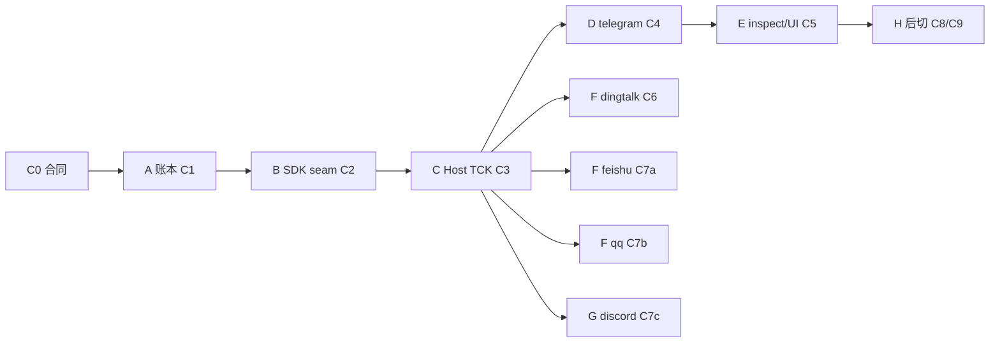

```mermaid
flowchart TB
  subgraph L3["L3 插件器官"]
    TG[telegram]
    DT[dingtalk]
    FS[feishu]
    QQ[qq]
    DC[discord]
    A2A["a2a 后切"]
    NL["neurolink 后切"]
  end

  subgraph L2["L2 sdk/plugin ABI"]
    CHIF[Channel / ChannelEnv / 信封]
  end

  subgraph L0["L0 内核"]
    HOST[internal/channelhost]
    PH[pluginhost Seam 分流]
    SVC[runtime.Service]
    ENG[Engine adk.Runner]
    JRN[Journal / Message]
    POL[Policy / Approval / Sandbox]
  end

  TG --> CHIF
  DT --> CHIF
  FS --> CHIF
  QQ --> CHIF
  DC --> CHIF
  A2A --> CHIF
  NL --> CHIF
  CHIF --> HOST
  PH --> HOST
  HOST --> JRN
  HOST --> SVC
  SVC --> ENG
  ENG --> JRN
  SVC --> POL
  HOST --> CHIF
```

# Vivy Channel — 演进架构

> **Plugin v1 note (2026-09-09):** 本文保留 Channel 产品演进记录；其中
> `seam:*`、v0 Manifest/Recipe、旧注册表和 ABI 描述均被
> `VIVY-MODULE-STANDARD.md`、`VIVY-PORT-CATALOG.md`、
> `VIVY-PLUGIN-SPEC.md` 与 `VIVY-ASSEMBLY.md` 取代，不得形成兼容实现。
>
> 状态：伴随已采纳合同的**实现演进正本**（2026-08-30）。
> 不替代 `VIVY-CHANNEL-PACK.md`。冲突时合同优先。
> 子 AGENT 领取面：`docs/plans/channel-epic/`。日历：`docs/TODO.md` §0.2。
>
> 读者：接手超级通道 EPIC 的实现 AGENT。先读合同，再读本文，再领切片 PLAN。

相关：`VIVY-CHANNEL-PACK.md`、`VIVY-PLUGIN-SPEC.md`、`VIVY-ASSEMBLY.md`、`SELF-EVOLVING-GATEWAY.md`、D-007 / ADR-015。

---

## 0. 一句话

> 超级通道是内核里的世界入口。五个聊天适配器是叶子。
> Eino ADK Runner 是唯一循环。演进是给物种长器官，不是另起一套 bot 运行时。

---

## 1. 物种分层树（永远如此）

切片只填叶子和已标明的新包。不许新开一层。

```text
vivy.exe 一代身体
├── L0 内核（永不插件化，永远编进默认身体）
│   ├── Journal / Session / Run / Message
│   ├── Policy / Approval / Sandbox / Secrets
│   ├── FaceHost（web / tui / headless，另案）
│   ├── ACP 控制面（另案，转向已有 Run）
│   ├── pluginhost          Seam 分流：tool vs channel
│   ├── ChannelHost         本 EPIC 新器官 → 包名 internal/channelhost
│   │     准入 · 会话映射 · 入账 · 派发 · 出站 · 能力发现 · 后切 Listen/监督
│   └── runtime.Service / Engine
│         ChatModelAgent + adk.Runner（pin github.com/cloudwego/eino v0.9.13）
│
├── L1 规范信封（第一刀定形，行为后切）
│   channel, chat_id, sender, message_id, reply_to, topic_id,
│   parts[], run_id/task_id, 活面槽, delivery
│
├── L2 ABI（sdk/plugin，作者唯一窗口）
│   SeamChannel · Channel · ChannelEnv · grants
│   可选：Typing / Edit / Delete / Reaction / Placeholder / Stream /
│         MediaSender / WebhookHandler / ListenHandler /
│         HealthChecker / TaskLifecycle / PipeServer
│
└── L3 插件器官（配方点名才进这一代；默认 Register() = nil）
    ├── hello-fs     seam: tool-world   已有
    ├── telegram     seam: channel      独立 go.mod
    ├── dingtalk     seam: channel      独立 go.mod
    ├── feishu       seam: channel      独立 go.mod
    ├── qq           seam: channel      独立 go.mod
    ├── discord      seam: channel      独立 go.mod
    ├── a2a          seam: channel      后切；codec 偷 eino-ext/a2a
    └── neurolink    seam: channel      后切；Listen 仍是 Host
```



---

## 2. 目标包树

```text
sdk/plugin/plugin.go
    SeamChannel, GrantChannelPoll/Webhook/Listen/A2A, GrantSecretRead
    Channel, ChannelEnv, InboundMessage, OutboundMessage, Part
    可选能力接口（类型在 sdk/plugin，Host 断言）

internal/domain/
    Message.Source / Channel / ChatID / ChannelMessageID
    EventChannelInbound
    不放平台 SDK 类型

schemas/events/payloads/channel.inbound.json

internal/storage/{sqlite,postgres,conformance}
    messages 出处列；事件词汇

internal/config/
    channels: 信封；只解码 inspect 已列出的 compiled-in 名字
    未知名字 → 启动失败，不是忽略

internal/pluginhost/
    Adapt 只吃 seam tool / tool-world / provider
    SeamChannel 跳过，交给 ChannelHost

internal/channelhost/          # 新包。禁止 import eino*
    host.go           StartAll / StopAll / fail-closed
    session.go        (channel, chat_id[, topic_id]) → Session
    dispatch.go       inbound → 入账 → Service.Run；终态 → Send
    capabilities.go   可选接口声明与发现
    fake/             仅测试；不是产品插件

internal/runtime/service.go
    被 Host 调用；不 import channelhost（避免环）
    装配发生在 internal/app

internal/generated/plugins/zz_register.go
    提交永远 return nil

plugins/<name>/
    独立 go.mod；只依赖 sdk/plugin + 该平台 SDK
```

**Host 包名拍板：`internal/channelhost`。** 不放进 `internal/runtime`：Host 必须留在 Eino 检疫墙外；作者也不该觉得自己在改引擎。`Service.Run` 仍是唯一循环入口。装配：`internal/app` 调 `Register()`，按 `Seam()` 分流。

---

## 3. 控制流（五个聊天 + 以后 A2A 同一条）

```text
平台 wire / A2A JSON-RPC
        │  插件只做编解码
        ▼
Channel.Start  ──出站 poll/WS──► 平台
        │
        │ Env.PublishInbound(InboundMessage)
        │ 禁止插件调 Service / Engine / Journal / adk.Runner
        ▼
ChannelHost
    1. allow_from 空 → 拒绝 Start（fail-closed；禁止 "*"）
    2. (channel, chat_id[, topic_id]) → 已有或新建 Session
       本机 UI Session 与 channel Session 默认不合流
    3. Journal.Append channel.inbound
    4. Messages.Append role=user + Source=channel
    5. Service.Run(sessionID, text)
        ▼
runtime.Engine
    domain.Message → schema.Message     # modeladapter，D-007
    adk.Runner.Query / RunHistory
    AgentEvent → Journal (model.* / tool.* / run.*)
        ▼
ChannelHost 读终态（活面 typing 不进 Journal）
        ▼
Channel.Send(OutboundMessage)
```

Eino 纪律：

- 只有 `internal/runtime` 与 `internal/provider` 可 import `github.com/cloudwego/eino*`（D-007，`importlint_test.go`）。
- `internal/channelhost`、`sdk/plugin`、五个适配器 **零 Eino import**。
- 后切 A2A：独立 `plugins/a2a` 的 go.mod 可依赖 `eino-ext/a2a` 的 **models + transport**。禁止 `extension/eino.RegisterServerHandlers(adk.Agent)`。
- 进程内 `AgentAsTool` / DeepAgent 不是 A2A 协议，本 EPIC 不碰。

插件化纪律：

- 真卸 = 配方删行再 pack。`enabled: false` 只是停用。
- `pluginhost.Adapt` 不得把 channel 变成 `tools.Tool`。
- 默认 `just ci` 的 import 图到不了 telego / discordgo / lark / 钉钉 / botgo。
- 不新开 `channels/` 目录，不新开 `RegisterChannels()`。

---

## 4. 演进阶段树

原则：先合同槽，后行为；先 Host，后叶子；先假插件 TCK，后真 SDK；每个真插件一次 pack。叶子不得倒逼 Host 认识 `parse_mode`。

```text
NOW (C0 合同)
└── pluginhost 把一切当 tool；Message 无出处；无 ChannelHost

阶段 A  遗传物质     CH-C1
└── Journal 认识世界入口。Eino 循环未动。

阶段 B  物种窗口     CH-C2
└── sdk/plugin 长出 channel 缝。默认 Register() 仍空。还不能跑。

阶段 C  世界入口     CH-C3
└── ChannelHost 落地。假插件走通闭环。默认 EXE 仍无真实协议。
    可选能力接口必须在这一刀全部声明。

阶段 D  ABI 样板     CH-C4
└── plugins/telegram 独立 go.mod。肥 SDK 不进默认身体。
    正式写适配器：以 picoclaw 为最完整 Go 对照，只读改写、禁止 import。

阶段 E  可见性       CH-C5
└── inspect + 设置页只展示 compiled-in。

阶段 F  国内过夜     CH-C6, C7a, C7b
└── 只填 L3 叶子。禁止回头改信封主合同。

阶段 G  国际补齐     CH-C7c
└── discord 文本。本期关门。

阶段 H  后切         CH-C8, C9, CH-C
└── 子进程崩溃域；A2A/NeuroLink 提案；wecom 绑定面。
    槽已在 L1/L2；本阶段才长行为。
```



---

## 5. 能力矩阵（C3 就必须进 Host）

否则这不是超级通道，只是五个 bot。

```text
必选     Channel.Start Stop Send + Env.PublishInbound
交互     Typing  MessageEditor  Deleter  Reactor  Placeholder  Streamer
介质     MediaSender
入站面   WebhookHandler / ListenHandler     ← 套接字仍是 Host
可靠     HealthChecker + 错误分类
重量级   TaskLifecycle（A2A）  PipeServer（NeuroLink）
```

C3 用类型断言，缺了就降级。五个包第一刀只实现必选 + 该平台已稳的文本能力。Stream / 媒体 / 群 / 审批卡片后切，但接口名不得等 C9 才发明。

---

## 6. 三扇门（不要合成）

| 门 | 包/提案 | 本 EPIC |
|---|---|---|
| 耳朵 ChannelHost | `internal/channelhost` | **做** |
| 嘴 FaceHost | `VIVY-FACE-PACK.md` | 不做；channel 不得替代 UI |
| 遥控 ACP | `ACP-REMOTE-CONTROL-PROPOSAL.md` | 不做；ACP 转向已有 Run |

A2A 从耳朵进，不是第四扇门，也不是第二套循环。`taskId` = Vivy `run_id`。

---

## 7. 权威顺序

1. `VIVY-CHANNEL-PACK.md`（合同）
2. 本文（演进树）
3. `docs/plans/channel-epic/<ID>.md`（本切片 PLAN）
4. `docs/TODO.md` §0.2（日历）

日历不改合同。PLAN 不发明第二套循环。发现合同漏洞：记 §0.1，不要擅自扩缝。
