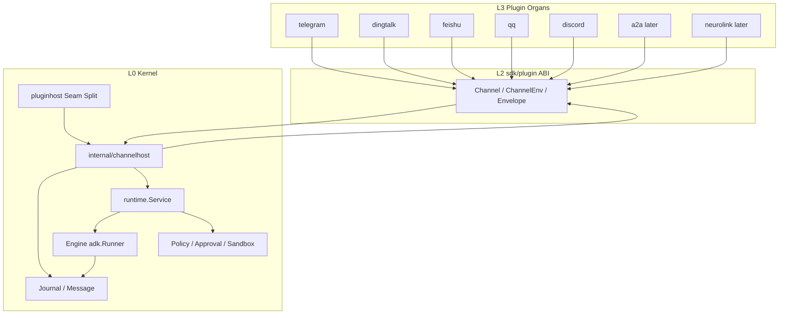
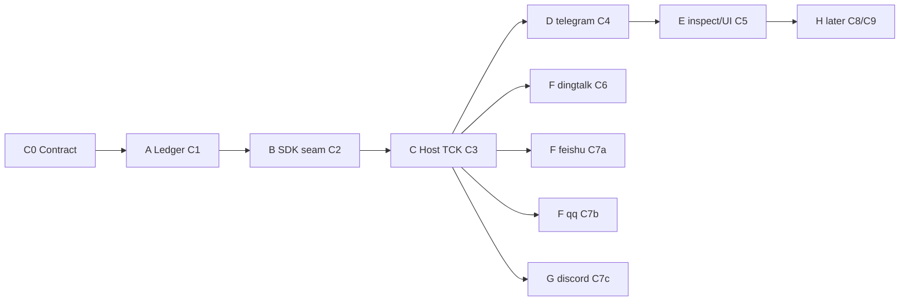

# Vivy Channel — Evolution Architecture

> **Plugin v1 note (2026-09-09):** This document retains the Channel product-evolution record; the
> `seam:*`, v0 Manifest/Recipe, old registry, and ABI descriptions are superseded by
> `VIVY-MODULE-STANDARD.md`, `VIVY-PORT-CATALOG.md`,
> `VIVY-PLUGIN-SPEC.md`, and `VIVY-ASSEMBLY.md` and must not form a compatibility implementation.
>
> Status: **canonical source for implementation evolution** accompanying the adopted contract (2026-08-30).
> It does not replace `VIVY-CHANNEL-PACK.md`. The contract wins in case of conflict.
> Child-AGENT assignment surface: `docs/plans/channel-epic/`. Calendar: `docs/TODO.md` §0.2.
>
> Readers: implementation AGENTS taking over the super-channel EPIC. Read the contract first, then this document, then claim a slice PLAN.

Related: `VIVY-CHANNEL-PACK.md`, `VIVY-PLUGIN-SPEC.md`, `VIVY-ASSEMBLY.md`, `SELF-EVOLVING-GATEWAY.md`, D-007 / ADR-015.

---

## 0. One Sentence

> The super-channel is the world ingress in the kernel. The five chat adapters are leaves.
> Eino ADK Runner is the only loop. Evolution grows organs for the species; it does not start another bot runtime.

---

## 1. Species Layering Tree (Always This Way)

Slices fill only leaves and explicitly named new packages. Do not add a new layer.

```text
vivy.exe one-generation body
├── L0 Kernel (never pluginized, always compiled into the default body)
│   ├── Journal / Session / Run / Message
│   ├── Policy / Approval / Sandbox / Secrets
│   ├── FaceHost (web / tui / headless, separate proposal)
│   ├── ACP control plane (separate proposal, redirects to existing Run)
│   ├── pluginhost          Seam split: tool vs channel
│   ├── ChannelHost         New organ in this EPIC → package internal/channelhost
│   │     admission · session mapping · accounting · dispatch · outbound · capability discovery · later Listen/supervision
│   └── runtime.Service / Engine
│         ChatModelAgent + adk.Runner（pin github.com/cloudwego/eino v0.9.13）
│
├── L1 Standard envelope (shape fixed in the first cut, behavior later)
│   channel, chat_id, sender, message_id, reply_to, topic_id,
│   parts[], run_id/task_id, live-surface slots, delivery
│
├── L2 ABI (sdk/plugin, author's only window)
│   SeamChannel · Channel · ChannelEnv · grants
│   Optional: Typing / Edit / Delete / Reaction / Placeholder / Stream /
│         MediaSender / WebhookHandler / ListenHandler /
│         HealthChecker / TaskLifecycle / PipeServer
│
└── L3 Plugin organs (enter this generation only when named by the recipe; default Register() = nil)
    ├── hello-fs     seam: tool-world   existing
    ├── telegram     seam: channel      independent go.mod
    ├── dingtalk     seam: channel      independent go.mod
    ├── feishu       seam: channel      independent go.mod
    ├── qq           seam: channel      independent go.mod
    ├── discord      seam: channel      independent go.mod
    ├── a2a          seam: channel      later; codec borrows eino-ext/a2a
    └── neurolink    seam: channel      later; Listen remains Host
```



---

## 2. Target Package Tree

```text
sdk/plugin/plugin.go
    SeamChannel, GrantChannelPoll/Webhook/Listen/A2A, GrantSecretRead
    Channel, ChannelEnv, InboundMessage, OutboundMessage, Part
    optional capability interfaces (types in sdk/plugin, asserted by Host)

internal/domain/
    Message.Source / Channel / ChatID / ChannelMessageID
    EventChannelInbound
    do not place platform SDK types here

schemas/events/payloads/channel.inbound.json

internal/storage/{sqlite,postgres,conformance}
    messages source column; event vocabulary

internal/config/
    channels: envelope; decode only compiled-in names already listed by inspect
    unknown name → startup failure, not ignored

internal/pluginhost/
    Adapt consumes only seam tool / tool-world / provider
    SeamChannel is skipped and handed to ChannelHost

internal/channelhost/          # new package; must not import eino*
    host.go           StartAll / StopAll / fail-closed
    session.go        (channel, chat_id[, topic_id]) → Session
    dispatch.go       inbound → accounting → Service.Run; terminal state → Send
    capabilities.go   optional interface declarations and discovery
    fake/             tests only; not a product plugin

internal/runtime/service.go
    called by Host; do not import channelhost (avoid a cycle)
    assembly happens in internal/app

internal/generated/plugins/zz_register.go
    committed version always returns nil

plugins/<name>/
    independent go.mod; depends only on sdk/plugin + the platform SDK
```

**Host package name is settled: `internal/channelhost`.** It does not belong in `internal/runtime`: Host must remain outside the Eino quarantine wall, and authors should not feel they are modifying the engine. `Service.Run` remains the only loop entry. Assembly: `internal/app` calls `Register()` and routes by `Seam()`.

---

## 3. Control Flow (Five Chats + Future A2A on the Same Path)

```text
platform wire / A2A JSON-RPC
        │  plugin handles encoding/decoding only
        ▼
Channel.Start  ──outbound poll/WS──► platform
        │
        │ Env.PublishInbound(InboundMessage)
        │ plugins must not call Service / Engine / Journal / adk.Runner
        ▼
ChannelHost
    1. empty allow_from → reject Start (fail-closed; "*" forbidden)
    2. (channel, chat_id[, topic_id]) → existing or new Session
       local UI Session and channel Session do not merge by default
    3. Journal.Append channel.inbound
    4. Messages.Append role=user + Source=channel
    5. Service.Run(sessionID, text)
        ▼
runtime.Engine
    domain.Message → schema.Message     # modeladapter，D-007
    adk.Runner.Query / RunHistory
    AgentEvent → Journal (model.* / tool.* / run.*)
        ▼
ChannelHost reads terminal state (live-surface typing does not enter the Journal)
        ▼
Channel.Send(OutboundMessage)
```

Eino discipline:

- Only `internal/runtime` and `internal/provider` may import `github.com/cloudwego/eino*` (D-007, `importlint_test.go`).
- `internal/channelhost`, `sdk/plugin`, and the five adapters have **zero Eino imports**.
- Later A2A: the independent `plugins/a2a` go.mod may depend on `eino-ext/a2a` **models + transport**. `extension/eino.RegisterServerHandlers(adk.Agent)` is forbidden.
- In-process `AgentAsTool` / DeepAgent is not the A2A protocol; this EPIC does not touch it.

Pluginization discipline:

- True removal = delete the recipe line and pack again. `enabled: false` is only deactivation.
- `pluginhost.Adapt` must not turn a channel into `tools.Tool`.
- The default `just ci` import graph must not reach telego / discordgo / lark / DingTalk / botgo.
- Do not create a new `channels/` directory or a new `RegisterChannels()`.

---

## 4. Evolution Stage Tree

Principle: contract slots first, behavior later; Host first, leaves later; fake-plugin TCK first, real SDK later; one pack per real plugin. Leaves must not force Host to understand `parse_mode`.

```text
NOW (C0 Contract)
└── pluginhost treats everything as a tool; Message has no source; no ChannelHost

Stage A  Genetic Material     CH-C1
└── Journal recognizes world ingress. The Eino loop is untouched.

Stage B  Species Window     CH-C2
└── sdk/plugin grows a channel seam. Default Register() remains empty. It still cannot run.

Stage C  World Ingress     CH-C3
└── ChannelHost lands. The fake plugin completes the loop. The default EXE still has no real protocol.
    All optional capability interfaces must be declared in this cut.

Stage D  ABI Template     CH-C4
└── plugins/telegram has an independent go.mod. The large SDK does not enter the default body.
    Write the formal adapter: use picoclaw as the most complete Go reference, rewrite read-only, and forbid imports.

Stage E  Visibility       CH-C5
└── inspect + settings page show only compiled-in items.

Stage F  Domestic Overnight     CH-C6, C7a, C7b
└── Fill only L3 leaves. Do not go back and change the envelope's main contract.

Stage G  International Completion     CH-C7c
└── Discord text. Close this phase.

Stage H  Later     CH-C8, C9, CH-C
└── Child-process crash domain; A2A/NeuroLink proposal; WeCom binding surface.
    The slots are already in L1/L2; behavior grows only in this phase.
```



---

## 5. Capability Matrix (Must Enter Host in C3)

Otherwise this is not a super-channel, only five bots.

```text
Required     Channel.Start Stop Send + Env.PublishInbound
Interaction  Typing  MessageEditor  Deleter  Reactor  Placeholder  Streamer
Media        MediaSender
Ingress      WebhookHandler / ListenHandler     ← sockets remain Host-owned
Reliability  HealthChecker + error classification
Heavyweight  TaskLifecycle (A2A)  PipeServer (NeuroLink)
```

C3 uses type assertions and degrades when an interface is missing. The first cut for the five packages implements only the required capabilities plus text capabilities already stable on that platform. Stream / media / groups / approval cards come later, but the interface names must not be invented only in C9.

---

## 6. Three Doors (Do Not Merge)

| Door | Package/Proposal | This EPIC |
|---|---|---|
| Ear ChannelHost | `internal/channelhost` | **Do** |
| Mouth FaceHost | `VIVY-FACE-PACK.md` | Do not do; channel must not replace the UI |
| Remote control ACP | `ACP-REMOTE-CONTROL-PROPOSAL.md` | Do not do; ACP redirects to existing Run |

A2A enters through the ear; it is not a fourth door or a second loop. `taskId` = Vivy `run_id`.

---

## 7. Authority Order

1. `VIVY-CHANNEL-PACK.md` (contract)
2. This document (evolution tree)
3. `docs/plans/channel-epic/<ID>.md` (this slice's PLAN)
4. `docs/TODO.md` §0.2 (calendar)

The calendar does not change the contract. A PLAN does not invent a second loop. If you find a contract gap, record it in §0.1; do not expand the seam unilaterally.
