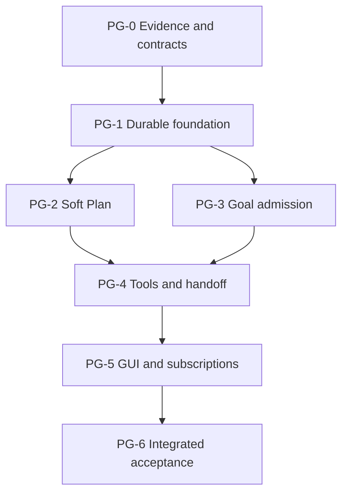

# Plan / Goal Pre-design Delivery Index

Revision PG-D2-execution, 2026-09-22. **Implementation is authorized; downstream Stories remain gated by predecessor evidence.**
User authorization: detailed pre-design was previously published; implementation on this branch is explicitly authorized by the maintainer on 2026-09-22.

Read [shared engineering design](../../architecture/PLAN-GOAL-PREDESIGN.md), then the selected Story.
Product decisions remain in [Issue #47](https://github.com/ProjectViVy/agent-vivy/issues/47#issuecomment-5754532762).
The issue is not duplicated here; this is the engineering refinement. Review shared blockers before assigning work.

## Epics and immediate dependencies

| Story | Epic / requirements | Independently verifiable outcome | Immediate predecessors / required output | Plan | Status | Evidence or blocker |
| --- | --- | --- | --- | --- | --- | --- |
| PG-0 | Foundation; R1, R2, R6, R7, R9 | Resolve the adapter, history, and human-admission contracts with source-backed, executable decisions. | None; inspected baseline | [PG-0](PG-0.md) | In progress | Eino/history probes and corrected plugin pressure tests pass. `just ci` exits 1: six `internal/modules/masks` normalization tests also fail on `origin/main` f6fb11b; the in-flight conformance check used the pre-refresh digest, and its post-refresh focused check passes. Live PostgreSQL is unverified; supervisor acceptance remains pending. |
| PG-1 | Foundation; R3, R6, R9 | Durably replay work state and atomically account ordinary Goal runs on both backends. | PG-0 accepted output | [PG-1](PG-1.md) | Blocked | Unaccepted predecessor evidence; PG-D1 blockers apply |
| PG-2 | Plan collaboration; R1, R2, R5, R7, R9 | Plan uses guidance with independent permissions and exact human-reviewed transitions. | PG-1 accepted output | [PG-2](PG-2.md) | Blocked | Unaccepted predecessor evidence; PG-D1 blockers apply |
| PG-3 | Goal continuation; R3, R4, R5, R6, R9 | At most one authorized continuation is admitted while human requests, cancellation and existing budgets remain authoritative. | PG-1 accepted output | [PG-3](PG-3.md) | Blocked | Unaccepted predecessor evidence; PG-D1 blockers apply |
| PG-4 | Composition; R2, R5, R7 | Models can request planning/Goal work and report results without acquiring human authority. | PG-2 accepted output; PG-3 accepted output | [PG-4](PG-4.md) | Blocked | Unaccepted predecessor evidence; PG-D1 blockers apply |
| PG-5 | Composition; R8, R2, R5 | Users can inspect and control Plan/Goal, reconnect and see later automatic runs. | PG-4 accepted output | [PG-5](PG-5.md) | Blocked | Unaccepted predecessor evidence; PG-D1 blockers apply |
| PG-6 | Acceptance; R1, R2, R3, R4, R5, R6, R7, R8, R9 | Demonstrate the complete product contract including restart, migration, governance and live coding. | PG-5 accepted output | [PG-6](PG-6.md) | Blocked | Unaccepted predecessor evidence; PG-D1 blockers apply |

The table owns all statuses and dependency edges. A predecessor's document existing does not mean its implementation is accepted.

## DAG and waves

Computed topological waves: {PG-0} -> {PG-1} -> {PG-2, PG-3} -> {PG-4} -> {PG-5} -> {PG-6}.
All IDs unique, edges known, no self-edge/cycle or redundant transitive dependency.
No time estimate or critical-path duration is claimed.

## Shared-file conflicts

PG-2 and PG-3 are logically parallel after PG-1 but both affect runtime state/Service and potentially shell startup. Default to one sequential implementation lane unless an explicit file ownership split is agreed. PG-2 owns collaboration and legacy policy interpretation; PG-3 owns admission and cancellation. Neither changes the other's interfaces.
PG-4 owns application/RPC wiring of their completed contracts. PG-5 owns UI and session subscriptions. PG-6 adds acceptance evidence, not late feature work.

## Readiness blockers and release rule

1. Live PostgreSQL conformance, browser integration and a real coding walkthrough have not run.
2. Implementation is authorized, but downstream Story release still requires supervisor acceptance of PG-0 evidence and the required product gates.

PG-0 now has executable evidence for pinned Eino guidance, exact Plan review suspension/resume, same-batch fencing, WorkSeq history ordering, and synchronous human-admission waiter semantics. No production Story may be released until the required product gates pass.

## Coverage

- R1: PG-0, PG-2, PG-6
- R2: PG-0, PG-2, PG-4, PG-5, PG-6
- R3: PG-1, PG-3, PG-6
- R4: PG-3, PG-6
- R5: PG-2, PG-3, PG-4, PG-5, PG-6
- R6: PG-0, PG-1, PG-3, PG-6
- R7: PG-0, PG-2, PG-4, PG-6
- R8: PG-5, PG-6
- R9: PG-0, PG-1, PG-2, PG-3, PG-6

## Handoff packet

Give a worker: AGENTS.md (+ ui/AGENTS.md when applicable), PG-D1/accepted replacement, this index, their Story, and accepted predecessor evidence with exact revisions.
Do not give only a task title or depend on chat memory.
Worker must return command evidence, changed files, unresolved issues and deviations; only supervisor changes status.
Use existing Superpowers execution skill after plan review and explicit execution choice.

## Change control

A shared signature, history interpretation, permission rule or review contract change invalidates dependent plan readiness. Update all downstream plans; preserve prior evidence as historical.
New public Ports, scope expansion, changed acceptance or substantial new infrastructure require a user decision. No forced delegation or background monitoring is established.

## Current verification

Pre-design checks are recorded in [2026-09-21 verification](../../logs/2026-09-21-plan-goal-predesign/verification.md). Current runtime and history evidence is in [2026-09-23 verification](../../logs/2026-09-23-plan-goal-foundation/verification.md).
Scenario blocks in Story plans remain behavioral pseudocode; the PG-0 probes are executable Go tests.
