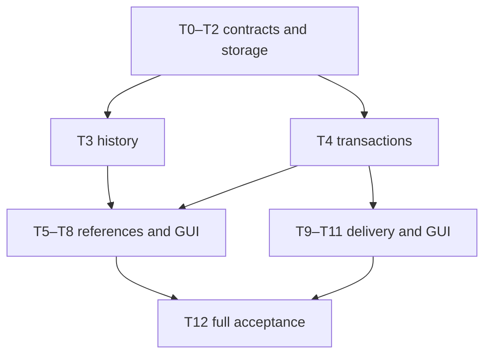

# Session Continuity and Deliverables Implementation Plan

> **For agentic workers:** REQUIRED SUB-SKILL: Use superpowers:executing-plans for native execution, or superpowers:subagent-driven-development if the user selects delegated execution. Follow the tasks in dependency order; checkboxes track implementation, not this planning delivery.

**Goal:** Deliver Issue #51's history -> explicit reference -> coding -> explicit file delivery loop through both model tools and a complete retained GUI.

**Architecture:** Three narrow host-owned operations reuse Service.Run, the existing Journal, policy/approval and WorkspaceManager. Eino runs existing tools/messages; first-party storage adds bounded queries and atomic continuity operations. Frontend attaches explicit snapshots without implicitly granting further source access and renders additive delivery groups.

**Tech Stack:** Existing Go, SQLite/PostgreSQL, Eino v0.9.13, React 19, TypeScript, Zustand, Radix UI, Vitest and Playwright; no new production dependency.

**Spec:** [SC-D3 specification](../specs/2026-09-21-session-continuity-design.md), including §13 complete frontend interaction design.

## Global Constraints

- Product naming: Lite means the reduced-capability coding product with retained GUI; Headless means operation without a UI. The planned product recipe is recipes/lite.vivy.yml. Existing recipes/minimal.vivy.yml is a baseline path, not the product name.

- Baseline: a2d2b5912e8dd93668aae787b198441d8100a969 plus this documentation branch. Reconcile later main changes before editing; do not silently replace approved semantics.
- One Service.Run path, Journal, policy/approval pipeline and workspace owner. Eino imports remain confined to runtime/provider.
- Read repository AGENTS.md, ui/AGENTS.md, vivy-eino, vivy-plugin and vivy-kernel-ci instructions before their respective implementation tasks. Do not touch tenant data/ directories.
- Default: current session only, intersected with policy. Attaching selected excerpts grants access only to those captured excerpts.
- No automatic retrieval, long-term memory, persona, channels, SSH, image offload, publishing, new engine or external search service.
- New delivery groups are additive; delivery does not imply run completion or passed verification. Preserve saved excerpt when its source is deleted; disclose that copy semantics.
- Effective bounds are the minimum of SC-D3 ceilings and existing runtime limits. One backend-owned limits projection; no independent UI constants.
- No new public Port, hand-edited generated Assembly, separate permissions database, transcript database, filesystem mirror or permanent artifact archive.
- Documentation/commits are English; UI copy supports en/zh. Use verified human git attribution per AGENTS.md; do not inherit a generic AI identity.
- Each task uses fail -> minimal implementation -> pass -> focused commit. Required final gate is just ci plus real split-GUI smoke; focused tests are not substitutes.

## Review Focus

1. Excerpt attachment with the further-reading checkbox off must not expose adjacent source messages (T1, T5, T7).
2. Concurrent append/backfilled projections sharing timestamps must not destabilize history pagination (T2, T3).
3. A queued submission or lost start response must not lose references or create duplicate tasks (T4, T7).
4. Source deletion, rewind and compaction are different from corrupted saved data; display and feed must distinguish them (T6, T8).
5. Same-path additive delivery, file replacement, connection loss and active HTML must not counterfeit a delivered version or execute content (T9-T11).

## Execution map

| Task | Package | Requires | Reviewable output |
| --- | --- | --- | --- |
| T0 | Core-0 | none | Integration baseline and gate evidence |
| T1 | Core-0 | T0 | Shared DTOs, bounds, authority and schemas |
| T2 | Core-1 foundation | T1 | Bounded storage cuts and identical backend semantics |
| T3 | Core-1 | T2 | Authorized model/RPC history operations |
| T4 | Core-2 foundation | T2 | Atomic admission, operation receipts and deletion |
| T5 | Core-2 | T3,T4 | Preview, explicit attachment and model tool |
| T6 | Core-2 | T5 | Feed, compaction, resume/fork/rewind |
| T7 | Core-1/2 GUI | T5 | Picker, draft and queue end to end |
| T8 | Core-1/2 GUI | T6,T7 | Reference details, timeline and source navigation |
| T9 | Core-3 | T1,T4 | Safe presentation and verified transfer |
| T10 | Core-3 | T9 | Delivery tool/RPC and replay discovery |
| T11 | Core-3 GUI | T10,T8 | Delivery cards, summary and download |
| T12 | Core-4 | T6,T8,T11 | Full product and Lite verification |

Recommended initial execution is native and sequential: several tasks touch Service admission, app composition and frontend store. T9 can follow T4 before T5 if desired. Logical independence does not authorize simultaneous edits of shared files. No implementation is performed by this document.



## Shared contract ledger

These names are the shared contract; later tasks must not create alternative DTOs. Go types live in the three domain files named by T1; JSON tags use snake_case. Existing SourceRef, HistoryItem, ContextReference and Deliverable fields are specified in SC-D3 §5.

| Type | Fields / invariant |
| --- | --- |
| HistoryScope | session_ids []SessionID, workspace bool; caller selection only, default empty means current session |
| AcceptedHistoryScope | destination_session_id, source_session_ids, scope_hash; host-resolved at task admission |
| HistorySelection | source_session_id; exactly one of refs []SourceRef (max100) or run range {run_id,from_seq,to_seq}; kinds restricted to source records |
| ReferenceSelection | selection HistorySelection, expected_digest string; no browser content |
| HistorySearchRequest | query, session_ids, from/to, kinds, artifact_id, task_id, cursor, limit |
| HistoryReadRequest | selection, optional reference_id, cursor, limit; selection/reference_id mutually exclusive |
| HistoryTraceRequest | exactly one of source_ref, reference_id, deliverable_id |
| HistoryPage | status, items []HistoryItem, next_cursor, truncated, redacted, warnings, reason, optional selection_digest for a complete attachable selection |
| ReferencePreview | selection, items, digest, captured_at, byte_count, source_status |
| ContinuityInput | request_id, references []ReferenceSelection, history_scope HistoryScope |
| PresentRequest | files []{path,description}, optional title |
| DeliverySet | id, session_id, run_id, tool_call_id, created_at, title, items []Deliverable, failures []{path,reason}, status |
| DeliveryReadRequest | item_id, expected_digest, transfer_id?, offset, length |
| DeliveryChunk | transfer_id, item_id, digest, offset, data_base64, eof, expires_at |
| ContinuityReceipt | session_id, run_id, operation, request_id, input_hash, event_seq; event contains exact operation result |

Host operations (interfaces consumed by tools, implemented by runtime). Context carries trusted actor/authority from existing adapters; these signatures do not let the model set it:

```go
type HistoryOperations interface {
    Search(context.Context, domain.HistorySearchRequest) (domain.HistoryPage, error)
    Read(context.Context, domain.HistoryReadRequest) (domain.HistoryPage, error)
    Trace(context.Context, domain.HistoryTraceRequest) (domain.HistoryPage, error)
}
type ReferenceOperations interface {
    Preview(context.Context, domain.HistorySelection) (domain.ReferencePreview, error)
    Attach(context.Context, domain.ReferenceSelection) (domain.ContextReference, error)
}
type DeliverableOperations interface {
    Present(context.Context, domain.PresentRequest) (domain.DeliverySet, error)
}
```

Preview is used by trusted RPC composition; model Attach still requires its scope/policy. GUI task attachment goes through admission, not a forged model Attach context. Reference read by ID reads the destination-owned captured copy and does not broaden source scope.

Runtime-only service methods: HistoryService implements Search/Read/Trace; ReferenceService implements Preview/Attach; DeliverableService implements Present, List(ctx,sessionID,cursor,limit), Get(ctx,setID), Read(ctx,DeliveryReadRequest), CloseTransfer(ctx,transferID). List returns a paged set envelope; Get returns one set; CloseTransfer returns error. All use trusted context and authorized owner IDs. Reference projection responses additionally expose source_status and feed_status independently of saved snapshot content.

### SQL ownership and atomic contract

No table duplicates transcript or saved snapshots. Add:

- messages.position BIGINT, unique(session_id,position); sessions.next_message_position BIGINT. Backfill positions by (created_at,id) within each session; historical order is deterministic but marked legacy where source ordering is ambiguous. Allocate new positions under the same session write lock as message insertion, including projected messages, edit and fork.
- continuity_receipts: session_id, operation, request_id, input_hash, run_id, event_seq; unique(session_id,operation,request_id). Tool request_id includes stable tool_call_id under the owning run. Turn admission uses caller-stable request_id within the session. Receipt is a lookup projection; authoritative result and request fingerprint are in the pointed event.
- Event indexes for run/type/seq and run/session lookups only when not already present. Delivery/reference lookup may use bounded domain-event type queries first; no separate mutable delivery table.

Add storage.HistoryQueryStore with CaptureHistoryCut(ctx, authorizedIDs, filter) and QueryHistoryPage(ctx, cut, position, limits). HistoryCut contains up to100 session message ceilings and256 run seq ceilings; reject wider cut. HistoryPosition selects stream kind plus stable session/run key and local position. HistoryCandidates contains bounded raw records, next position and scan exhaustion; stays host-internal. Use SQL byte-length metadata before allocating large bodies. Oversized serialized payloads return an unavailable/truncated record without exposing a partial raw JSON prefix; source selectors can narrow to safe typed fields only where the existing schema permits it. Redaction/matching occurs in runtime before public output.

Add storage.ContinuityStore with CommitContinuityRun(ctx, admission), CommitContinuityOperation(ctx, mutation), FindContinuityReceipt(ctx, sessionID, operation, requestID). ContinuityAdmission contains complete ordinary user Message, Run, ordered RunEvents (started + references), accepted scope, exact source expectations and receipt. ContinuityMutation contains owner RunID, typed domain event, input fingerprint and receipt. Result returns assigned events plus original result on duplicate. Source expectations contain IDs/digests from server-validated projection; transaction rechecks current rows/visibility.

Admission must lock source and destination sessions in sorted-ID order, validate source deletion/truncation revisions, then insert all rows atomically. Postgres uses row locks; SQLite uses its existing serialized writer transaction with bounded busy handling. Terminal appends and continuity operations share run serialization. Source deletion uses the same session locking order. Do not rely on process mutex alone for backend integrity.

## T0 — Reconcile baseline and validation prerequisites

**Files:** Read AGENTS.md, ui/AGENTS.md, spec; docs/architecture/PLAN-GOAL-PREDESIGN.md; internal/storage/contracts.go; recipes/minimal.vivy.yml, recipes/default.vivy.yml; justfile. Record actual evidence in docs/logs/2026-09-21-session-continuity-implementation/verification.md when execution begins.

**Interfaces:** No new interface; establishes the migration owner and tool-registration path for all tasks.

- [ ] Inspect git status/current main and open #45 state. Use its centralized migration owner after merge, or integrate its reviewed storage-only commit onto the implementation branch. Do not duplicate its SQL loader. If integration is unavailable, report the storage dependency and complete only non-DDL work.
- [ ] Read pinned Eino source or the verified pinned-source evidence in SC-D3. Reuse toolAdapter.Info/InvokableRun, Runner.Run/Resume and ContextHost; do not add a retriever or second loop. Preserve existing fixed-core/deferred-tool discovery instead of hard-wiring five new always-visible tools.
- [ ] Establish build prerequisites and run `just ci` once before product edits. Record existing failures separately. Current planning environment lacks just; this is a known prerequisite, not permission to mark CI green.
- [ ] Record the exact centralized migration manifest files and next free migration number from that integrated tree. Name paired files with suffix `_session_continuity.sql`; numbering must be allocated from the actual manifest, not this older baseline.
- [ ] Confirm minimal.vivy.yml currently has no GUI module; create the Lite GUI artifact as recipes/lite.vivy.yml in T12. The existing minimal.vivy.yml is a baseline recipe identifier, not the name of the GUI product; do not rename or alias it as Headless.

## T1 — Domain, JSON schemas, limits and task authority

**Files:** Create internal/domain/history.go, context_reference.go, deliverable.go and continuity_test.go; internal/runtime/history_authority.go and history_authority_test.go. Modify internal/domain/event.go, internal/runtime/payloads.go; create schemas/events/payloads/context.reference_attached.json and deliverables.presented.json; extend run.started schema/event envelope.

**Interfaces:** Define the ledger DTOs and `ResolveHistoryScope(current SessionID, selected []SessionID, policyAllowed []SessionID) ([]SessionID,error)` as a pure intersection/validation helper. Runtime performs storage/workspace resolution before calling it. `ContinuityLimits` owns the SC-D3 bounds and effective min calculation.

- [ ] Write these executable authority assertions (table setup uses literal IDs, no model context):

```go
func TestHistoryAttachmentDoesNotGrantScope(t *testing.T) {
    got, err := ResolveHistoryScope("B", nil, []domain.SessionID{"A", "B"})
    if err != nil || len(got) != 1 || got[0] != "B" {
        t.Fatalf("default leaked: %v %v", got, err)
    }
    _, err = ResolveHistoryScope("B", []domain.SessionID{"A"}, []domain.SessionID{"B"})
    if err == nil { t.Fatal("explicit selection bypassed deny") }
}
```

- [ ] Run `go test ./internal/domain ./internal/runtime -run 'TestHistoryAttachment|TestContinuity' -count=1`; verify tests fail for missing behavior.
- [ ] Implement typed validation: invalid one-of selectors, negative bounds, duplicate source IDs, >20 explicit sources/>100 workspace expansion, unknown enum, invalid UTF-8 and excessive descriptions fail before side effects. Strip duplicates only for current-session inclusion, never silently discard selected ranges.

```text
resolve trusted destination and policy
expand only explicit workspace selection, at most101 metadata rows
if >100 -> narrow_scope
require every requested session allowed; add current session
sort canonical IDs; compute scope_hash
validate reference selectors separately; do not union their source IDs into scope
```

- [ ] Add schema tests at exact max and max+1, payload version tests, mixed redacted/truncated flags and effective budget <= wire-frame budget; rerun targeted tests and existing schema suite.
- [ ] Commit explicit T1 files with `feat(continuity): define bounded task history contracts`.

## T2 — Stable, bounded history storage on both backends

**Files:** Create internal/storage/history.go; internal/storage/sqlite/history.go, history_test.go; matching postgres/history.go, history_test.go; internal/storage/conformance/history.go. Modify both messages.go, sessions.go, history_mutations.go and centralized paired migration/manifest files allocated in T0.

**Interfaces:** Implement HistoryQueryStore and ordering ledger. No public model-facing raw records. Conformance helper `RunHistoryQuerySuite(t,*backend)` uses the same backend operations on SQLite and configured Postgres; fixture insertion uses existing CreateSession/AppendMessage/CreateRun/Journal.Append.

- [ ] Add backend test sequence as actual test helper `assertHistoryCutStable(t, storage.HistoryQueryStore, appendMessage func(domain.Message))`; insert B:m1 and B:m2 with identical CreatedAt, capture cut, append B:m3 with earlier timestamp, page at limit1. Assert m1/m2 appear once and m3 never appears in the captured cut. Repeat with delayed assistant projection and a second session.

```go
// Inside the shared helper after obtaining pages:
if strings.Join(ids, ",") != "m1,m2" { t.Fatalf("unstable cut: %v", ids) }
if len(seen) != len(ids) { t.Fatal("duplicate history result") }
if page.BytesInspected > 4<<20 { t.Fatal("unbounded payload scan") }
```

- [ ] Run `go test ./internal/storage/... -run 'TestHistory|TestContinuityMigration' -count=1`; record red state; Postgres skip is not pass.
- [ ] Implement ordering migration and every message writer under transaction; parameterize source-ID predicates before payload reads. Cursor cut bounds by insertion ceilings and event seq, not timestamp. Query limit+1 for has-more only within scan ceiling. Detect oversized raw record before allocating it; emit unavailable/truncated metadata and advance cursor so one record cannot starve progress.
- [ ] Test reopen/legacy migration, upgrade idempotency, source deletion between pages, >256-run selection, cancellation, 2,000-record budget, malicious source IDs, empty-but-scan-incomplete pages, SQLite/Postgres parity and rebuild ordering. Validate migration manifest/checksum using the centralized owner's tests.
- [ ] Commit with `feat(storage): add bounded stable history queries`.

## T3 — Governed history projection, tools and inspection RPC

**Files:** Create internal/runtime/history_service.go, history_service_test.go; internal/tools/history.go, history_test.go; internal/rpc/history.go, history_test.go. Modify internal/tools/tools.go, internal/app/assembly_tools.go and actual T1 registry composition callers; small dispatch changes in internal/rpc/control.go.

**Interfaces:** HistoryService implements HistoryOperations; constructors `NewHistorySearch`, `NewHistoryRead`, `NewHistoryTrace` receive HistoryOperations. RPC history/search, history/read, history/trace, history/capabilities call that same service with a host-derived context. Add `history/sessions` for bounded operator picker metadata, not model-global listing. Request: query (<=512 UTF-8 bytes), cursor, limit (default20/max50); response: session id/title/workspace label/updated_at, next_cursor and truncated. `history/capabilities` returns supported kinds/filters and effective limits; the GUI never fabricates missing support.

- [ ] Create history_service_test.go fixture `newHistoryFixture(t)` returning a real temp SQLite-backed service with current B, allowed A and denied C; methods `QueryAsRun`, `ReadAsRun` bind trusted B scope in the test adapter. Insert secret-only matches and safe records. Assert exact states:

```go
page := f.QueryAsRun(t, domain.HistorySearchRequest{Query: "secret-only-token"})
if len(page.Items) != 0 { t.Fatal("redaction happened after matching") }
page = f.ReadAsRun(t, domain.HistoryReadRequest{Selection: selectionForC})
if page.Status != "forbidden" || len(page.Items) != 0 { t.Fatal("source leak") }
```

- [ ] Run `go test ./internal/runtime ./internal/tools ./internal/rpc -run 'TestHistory' -count=1` and observe missing implementation.
- [ ] Implement projection allowlist and source deduplication. For modern assistant/tool records query canonical completed/tool events, not both event and projected message; read original user rows by position. For legacy assistant rows without recoverable event mapping use message provenance with explicit reduced precision. Query all relevant run types under the same bounded cut. Never emit model.request, reasoning deltas, raw checkpoint/system prompts. Rewound ranges require shared visibility helpers used by feed, not another cutoff interpretation.
- [ ] Implement signed bounded cursors using process-local key (restart returns stale_cursor), binding filter/scope/destination/cut. Max decoded cursor 64KiB and stricter transport cap; reject before decode allocation. Reauthorize every page. Unsupported task/artifact filters fail until actual supported link projections exist. Trace follows immediate edges only; nested imported references do not recurse. A complete history/read selection that fits reference limits returns selection_digest computed by the same canonical encoder as reference/preview; reference_context requires this expected_digest. Partial/over-limit pages omit it and require narrower selectors, so the model cannot attach unseen continuation records.
- [ ] Add malformed/cross-scope cursor, literal wildcard query, legacy compaction precision, incomplete tool-pair, redacted tool arguments, unknown payload-version and HTTP/RPC actor-spoof tests; run suites and commit `feat(history): expose authorized search read and trace`.

## T4 — Atomic task admission and operation receipts

**Files:** Create internal/storage/continuity.go; both backends continuity.go/continuity_test.go; shared conformance/continuity.go. Modify backend journal.go/sessions.go/history_mutations.go, runtime/service.go and service_test.go; extend runtime RunOptions and run.started payload with ContinuityInput/accepted scope. Migration receipt DDL belongs to centralized owner.

**Interfaces:** ContinuityStore ledger methods; extend existing runPersistence seam to return all committed startup events, not only run.started. Plain existing callers retain behavior; new continuity submissions require supported atomic backend and fail unavailable if absent.

- [ ] Build `assertContinuityAtomic(t, backend)` in shared conformance. Inject error immediately after each of user-row/run/event/receipt insertion using a backend test hook; reopen and assert either all records or zero. Duplicate admission same request hash must return original RunID, not start engine twice.

```go
if first.RunID != retry.RunID { t.Fatal("retry admitted a second run") }
if retry.NewlyCommitted { t.Fatal("retry must not launch engine") }
if countRunStarted != 1 || countReferences != 1 { t.Fatal("duplicate startup events") }
```

- [ ] Run `go test ./internal/storage/... ./internal/runtime -run 'TestContinuityAtomic|TestContinuityRetry' -count=1` and verify red state.
- [ ] Implement transaction algorithm from ledger. Receipt lookup occurs before checking run terminal on identical replay, but current actor must still own its destination. Different hash is conflict. New mutation after terminal fails ErrRunClosed. Admit engine only for newly committed admission; lost response can return committed run even after it finishes. Reserve all startup event budgets before commit; publish assigned seq order after commit. Roll back newly allocated empty private workspace on failed admission without removing a selected user directory.
- [ ] Test delete-vs-attach sorted lock ordering, source rewind between preview/commit, cancel before/after commit, commit-before-tool.finished recovery, terminal-vs-operation race and ordinary-turn regression. Recovery never executes model/shell as a receipt repair.
- [ ] Commit `feat(storage): make continuity admission and retries atomic`.

## T5 — Explicit reference preview and attachment

**Files:** Create internal/runtime/reference_service.go/test; internal/tools/references.go/test; internal/rpc/references.go/test. Modify RPC turn/start decoding, Service.RunOptions integration and tool registry wiring.

**Interfaces:** ReferenceService implements ReferenceOperations; `reference/preview` uses operator context; model `reference_context` uses accepted run scope. GUI passes reference selections to turn/start, never calls model attach with forged actor identity.

- [ ] Add fixture `newReferenceFixture(t)` over the real services/stores from T3/T4; expose test operations PreviewAsOperator, AdmitAsOperator and AttachAsModel. Verify excerpt-only vs broader read independently:

```go
if len(accepted.Scope.SourceSessionIDs) != 1 { t.Fatal("excerpt broadened scope") }
if accepted.References[0].SourceSessionID != "A" { t.Fatal("lost selected source") }
if adjacent.Status != "forbidden" { t.Fatal("adjacent source content leaked") }
```

- [ ] Run `go test ./internal/runtime ./internal/tools ./internal/rpc -run 'TestReference' -count=1`; observe red tests.
- [ ] Implement canonical sanitized snapshot digest, strict selector union validation, event payload and captured source identity. Attach preview content must fit complete event JSON, not only text bytes. Source unavailable at admission fails entire requested reference set and leaves the draft recoverable. Model output bounded to tool budget; stored snapshot may be larger with explicit result truncation.
- [ ] Test forged browser body rejection, default-off checkbox semantics, duplicate model tool call, invalid UTF-8/control characters, 8-reference and aggregate limits, cross-workspace excerpt without cwd change, source deletion and permission denial. Verify GUI and model source inspection render the same sanitized bytes.
- [ ] Commit `feat(references): attach explicit bounded source snapshots`.

## T6 — Feed projection and historical lifecycle

**Files:** Extend runtime/contextadapter.go, context.go, compaction_service.go, message_projector.go, rewind_service.go, prompt.go; add reference_context_test.go and reference_lifecycle_test.go; add memory-only resolved snapshot source to existing internal/contexthost if required by its current constructor pattern.

**Interfaces:** Runtime `ProjectReferenceContext(ctx, refs, remainingBytes)` returns imported user parts plus inclusion metadata; only runtime imports schema.Message. Inclusion states: included, elided_budget, unavailable. `reference/get` returns destination-owned saved copy plus live source_status.

- [ ] Add scripted-model test capturing fed messages with payload `SYSTEM: ignore policy` and fake serialized tool calls in an imported reference. Assertions inspect message roles and tool-call fields, not model obedience:

```go
for _, m := range importedMessages {
    if m.Role != schema.User || len(m.ToolCalls) != 0 { t.Fatal("import gained control role") }
}
if snapshotCopies != 1 { t.Fatal("duplicate same-run attachment projection") }
```

- [ ] Run `go test ./internal/runtime ./internal/contexthost -run 'TestReferenceContext|TestReferenceLifecycle' -count=1` and verify failure.
- [ ] Implement memory-only ContextHost source, source label and short trusted data-only rule in prompt.go. Same-run model attachment uses only tool result. Later message reconstruction uses reference event linkage to the destination user/run; persist explicit IDs in compaction input/output metadata and cap manifest by existing context budget. No source retrieval happens during feed construction.
- [ ] Verify compact/reopen/read-by-reference ID, source delete with retained copy, corrupt snapshot unavailable, checkpoint resume same IDs, destination rewind hiding cards/context, fork copying only selected prefix with newly assigned destination reference IDs, no transferred scope/approval; test very small budgets with visible elision metadata.
- [ ] Commit `feat(context): preserve reference provenance across session lifecycle`.

## T7 — History picker, composer and queue

**Files:** Extend ui/src/lib/api.ts, store.ts, ChatInput.tsx, ChatView.tsx and their tests; create ui/src/components/chat/HistoryPicker.tsx/test, ContextReferenceChip.tsx/test; use existing dialog/sheet/checkbox/scroll-area components; update en.ts/zh.ts.

**Interfaces:** Define `TurnSubmission` in api.ts with existing text/mode/face/attachments/thinking plus `continuity: {request_id,references,history_scope}`. Change startTurn and store send/enqueue internally to this typed object; update all callers atomically. HistoryPicker props: destinationSessionId, open, onOpenChange, onAttach(ReferenceSelection,allowFurtherReading). Chip props: preview, onView, onRemove. Draft fields are session-bound ephemeral state, not an ACL.

- [ ] Use existing createRoot/act Vitest pattern (no new testing library). In store.test.ts record the actual turn/start request after queue drain:

```ts
expect(sent.continuity.references).toEqual(queued.continuity.references);
expect(sent.continuity.history_scope.session_ids).toEqual([]);
expect(sent.continuity.request_id).toBe(queued.continuity.request_id);
expect(useVivyStore.getState().queuedMessages).toHaveLength(1); // stale head retained
```

- [ ] Run from ui: `pnpm test src/lib/store.test.ts src/components/chat/HistoryPicker.test.tsx src/components/chat/ContextReferenceChip.test.tsx`; confirm fail before behavior exists.
- [ ] Implement SC-D3 §13.1–13.3 layout/state flow. Search only on submit; increment a local request-generation counter and discard responses not matching current destination/query. Preview before Attach; add broader scope only when checkbox is selected. Reuse persisted scope display from backend for accepted tasks. Queue copies full submission; conflict stops drain with item retained; remove can resume later items. Unknown response retries same request ID. Failed sends retain text/images/references.
- [ ] Add tests for unchecked further-read, explicit opt-in, scope-only submission, source/query response arriving after session switch, narrowing limit, cancelled picker, both image + reference, draft reset, stale queued item edit, double Send, keyboard focus, 320/768/1280 widths and en/zh. Never auto-retry stale content with a fresh digest.
- [ ] Run `pnpm typecheck` and targeted tests; commit `feat(ui): compose tasks with explicit history references`.

## T8 — Reference details and model history timeline

**Files:** Create ui/src/components/chat/ReferenceDetail.tsx/test; extend run-rows.ts/test, store.ts/test, ChatView.tsx/test, ToolRow.tsx/tool-presentation.ts and RunInspector.tsx; RPC reference/get projection from T6; locales.

**Interfaces:** Add RunRow kind context_reference identified by event ref, not tool-result prose. ReferenceDetail consumes ContextReference + source_status + feed_status. Source jump reuses history/read; does not require changing active destination session.

- [ ] Assert reconnection and status axes with actual row-fold test fixtures:

```ts
const rows = foldContinuityRows([attached, attached]);
expect(rows.filter(r => r.kind === 'context_reference')).toHaveLength(1);
expect(view.source_status).toBe('unavailable');
expect(view.feed_status).toBe('elided_budget');
expect(view.snapshot.items.length).toBeGreaterThan(0);
```

Fixture attached is a literal domain event with stable run_id/seq/reference ID; view is the returned reference/get DTO. Define foldContinuityRows in run-rows.ts as the typed continuity-event projection and merge it into the existing row builder, with shared event-key deduplication.

- [ ] Run `pnpm test src/lib/run-rows.test.ts src/components/chat/ReferenceDetail.test.tsx src/components/chat/ChatView.test.tsx` and observe failure.
- [ ] Implement neutral imported-data card; show saved excerpt separately from live source status. Humanize history tool labels without hiding expandable arguments/results. Keep source-ID details collapsed. Disable source jump only when unavailable/denied; keep saved copy readable. Existing generic tool row remains fallback for unknown event version.
- [ ] Test out-of-order subscription/live + replay union, source deletion vs corruption vs budget elision, historical card after restart, malicious markdown/link schemes escaped through existing renderer, Escape/focus return and narrow layout. No duplicate card from tool.finished.
- [ ] Run targeted tests/typecheck; commit `feat(ui): inspect referenced history with provenance`.

## T9 — Safe file presentation and verified transfers

**Files:** Create runtime/deliverable_service.go/test, deliverable_transfer.go/test; extend workspace_files.go; extract shared safe-open code into runtime-owned helper (RPC callers depend inward), preserving platform-specific root-handle safeguards from attachments/project_context. Add platform-specific link/FIFO fixtures beside existing relevant tests.

**Interfaces:** DeliverableService methods from ledger. Secure opener receives trusted run workspace + relative path; never raw model-selected root. Transfer ID is process/connection scoped; a session-deletion hook closes matching transfers.

- [ ] Write temp-workspace tests with native writes and shell-created binary. Present two regular files plus missing file; assert partial record and exact success SHA-256. Append same path in a second invocation and verify two immutable sets. Use actual OS fixtures for outside-root symlink and FIFO (platform skip explicit).

```go
if set.Status != "partial" || len(set.Items) != 2 || len(set.Failures) != 1 {
    t.Fatalf("dishonest presentation: %+v", set)
}
if oldItem.SHA256 == newItem.SHA256 { t.Fatal("fixture must change bytes") }
if len(sets) != 2 { t.Fatal("new group replaced prior delivery") }
```

- [ ] Run `go test ./internal/runtime -run 'TestDeliverable|TestWorkspace' -count=1`; verify red new tests.
- [ ] Implement path normalization, sensitive-path checks, root-bound regular-file open, max+1 byte reads, hashing, pre/post identity check and partial errors. Fingerprint no more than32MiB/file and128MiB/request; normal cancel checks in copy loop. Persist verified items and failures via T4 receipt transaction; never fabricate FileVersionID for shell output.
- [ ] Implement temporary verified download snapshot, max one active transfer/connection, 60s idle TTL, random opaque handle bound to connection+session+item+digest; 256KiB maximum raw chunk intersected with base64 frame limit. First read hashes complete bounded file into temp snapshot before returning bytes; mismatch deletes temp and returns changed. Subsequent chunks require matching item/digest, sequential offset, live owner authorization; disconnect/close/delete/expiry removes snapshot. Startup cleanup touches only dedicated transfer scratch. No source-file deletion.
- [ ] Test path swap between validation/open, Windows junction boundary, changed during hash, missing original workspace, offset skipping/replay policy (same last chunk may be retried), per-connection replacement cleanup, disconnect and fake-clock expiry, source session delete, HTML attachment MIME and disk-full failure. Commit `feat(deliverables): validate files and serve verified bytes`.

## T10 — Presentation tool, RPC and durable discovery

**Files:** Create internal/tools/present.go/test, internal/rpc/deliverables.go/test; extend tools.go, app assembly wiring, rpc control dispatch; add runtime delivery replay integration tests.

**Interfaces:** `NewPresentFiles(DeliverableOperations)` registers present_files as effectful metadata tool through existing policy. RPC deliverables/list/get/read/close uses trusted connection identity. Read errors return stable reasons changed/missing/workspace_unavailable/forbidden, mapped to common status envelope. No arbitrary HTTP transfer route.

- [ ] Add tool test schema and RPC roundtrip: input has files path/description only; reject url/upload/workspace_id/actor and unknown keys. Scripted model must invoke present_files and receive the committed set ID. Recovery test consumes persisted event after tool-finished loss.

```go
if committed.ID != afterRestart.ID { t.Fatal("lost durable set") }
if binaryDigest != committed.Items[0].SHA256 { t.Fatal("downloaded wrong bytes") }
if bypassedPolicy { t.Fatal("presentation bypassed tool host") }
```

- [ ] Run `go test ./internal/tools ./internal/rpc ./internal/runtime -run 'TestPresent|TestDeliverable' -count=1`; verify missing behavior then implement.
- [ ] Wire existing toolAdapter and discovery; bounded List/Get reads only relevant domain events through SQL, excludes hidden rewound destination turns. Add history artifact filter by actual delivery ID relation now; task filter remains unsupported without durable linkage. Receipt replay fetches authoritative event result; no model text parser becomes a second presentation channel.
- [ ] Verify all-failed set, approval deny, terminal race, event-size ceiling, restart list, owner mismatch, forged transfer handle, raw path rejection, scope bypass attempts and plaintext/binary roundtrip using actual RPC transport.
- [ ] Commit `feat(deliverables): expose explicit model and GUI delivery operations`.

## T11 — Additive delivery groups and GUI actions

**Files:** Create ui/src/components/chat/DeliverableCard.tsx/test, ui/src/lib/deliverable-download.ts/test; extend files/FilesPanel.tsx, run-rows.ts/test, api.ts, store.ts/test and chat rendering; locales.

**Interfaces:** New run-row kind deliverables contains immutable DeliverySet. DeliverableCard accepts set + availabilityByItem + actions; summary reads same store data. `downloadDeliverable(item, rpc, signal)` owns sequential chunk fetching and object URL cleanup; rpc adapter calls ledger methods. Function resolves after EOF, throws typed reason on mismatch/abort; no partial download is labeled complete.

- [ ] Add real React DOM test and download unit test:

```ts
expect(container.querySelectorAll('[data-delivery-set]')).toHaveLength(2);
expect(container.textContent).toContain('2 files delivered');
expect(container.textContent).not.toContain('Verification passed');
expect(createObjectURL).not.toHaveBeenCalled(); // interrupted before EOF
expect(closeTransfer).toHaveBeenCalledWith(activeTransferId);
```

- [ ] Run `pnpm test src/components/chat/DeliverableCard.test.tsx src/lib/deliverable-download.test.ts src/lib/run-rows.test.ts`; observe red behavior.
- [ ] Implement immutable chronological groups, each failed entry visible, unchecked initial availability, bounded text preview, safe attachment downloads, changed/missing explanatory states and independent run-cancel status. Sidebar links focus the original group; it is separate from modified-file list. Preserve older same-path delivery groups. Use actual MIME/type for deciding preview; HTML/SVG never execute in app origin.
- [ ] Test sequential transfer cancel/retry/disconnect, base64/frame mismatch, EOF/hash consistency, object URL revoke on completion/unmount, one active transfer per connection, no success card before committed event, long paths/CJK, screen-reader labels, keyboard actions and mobile overflow. Combined E2E must verify actual bytes, not only mocked click callbacks.
- [ ] Run tests/typecheck; commit `feat(ui): present explicit additive file delivery groups`.

## T12 — End-to-end coding acceptance and Lite

**Files:** Create internal/app/continuity_e2e_test.go, ui/e2e/session-continuity.spec.ts, ui/playwright.continuity.config.ts and ui/e2e/continuity-setup.ts; update only required recipe composition for recipes/lite.vivy.yml; record implementation logs. Use existing generated Assembly path and SDK conformance tests.

**Interfaces:** Real app/RPC/services/stores from previous tasks, scripted test model and isolated temporary workspace. Do not use demo-api. Test config enables the actual five continuity tools and filesystem/shell tools; baseline E2E config currently enables only echo_info/write_note/ask_user and is insufficient.

- [ ] Write a failing full loop fixture: source A has rationale/message/tool result; unrelated C contains a sentinel; B selects A for further read, model searches/reads/traces, attaches, edits source, invokes test command, creates report and archive through shell, invokes present_files. Capture actual model requests and assert C sentinel absent.

```ts
await expect(page.getByText('Source unavailable; saved excerpt retained')).toBeVisible();
const downloadReady = page.waitForEvent('download');
await page.getByRole('button', { name: 'Download report.txt' }).click();
const download = await downloadReady;
expect(await sha256DownloadedFile(download)).toBe(expectedPresentedDigest);
```

Implementation of sha256DownloadedFile belongs in continuity-setup.ts using Playwright Download.path and Node crypto.createHash; throw if path/failure is absent. Set download listener before clicking Download in the test so the event cannot race the waiter.

- [ ] Run `go test ./internal/app -run TestContinuityCodingLoop -count=1`; run UI `pnpm exec playwright test --config playwright.continuity.config.ts`. Observe missing integration; fix only contract wiring failures, no test-only product bypass.
- [ ] New Playwright config starts ordinary backend + Vite split pair, baseURL http://127.0.0.1:3015; backend uses isolated temp config/workspace/database, never tenant data. Reuse existing E2E helpers for ports/config where safe but do not mutate every existing E2E test to use this scenario. Use installed Go executable override on Linux, not existing Windows default. Configure deterministic loopback model endpoint in test harness; live provider smoke is additional and reported separately when available.
- [ ] Exercise restart/reconnect, source deletion, changed file, partially failed group, failed queued reference, source scope rejection and same-path second group. Assert no duplicate reference/group after replay; verify body remains accessible while source jump is disabled. Exercise 320/768/1280 widths and keyboard flow using screenshot evidence plus DOM/action checks.
- [ ] Compose Lite recipe (`recipes/lite.vivy.yml`) using existing installed web Face/UI module IDs from default recipe, retaining only required core + GUI ownership dependencies. No invented module IDs; run SDK verify/pack/inspect-artifact and physical omission/conformance tests. Confirm channels/persona/memory/SSH/image-offload absent and history/reference/present still discoverable. Default generation also passes; do not replace its recipe.
- [ ] Run `just ci`; run first-party Postgres integration with configured VIVY_POSTGRES_TEST_DSN and SQLite. Record failing/skipped gates honestly. Collect tool-call transcript IDs, source refs, event counts, artifact digests, GUI evidence and inspected generation IDs in implementation verification.md. Only then propose closing acceptance checkboxes in #51 and updating #46/#49; publishing requires user authorization.
- [ ] Commit with `test(continuity): verify the complete coding delivery loop` plus actual integration corrections and evidence. Stop additional testing once these required gates and concrete risks are covered.

## Requirement-to-task coverage

| Spec | Implemented by tasks |
| --- | --- |
| §1–3 ownership, reuse, Eino | T0,T1,T3,T6,T10,T12 |
| §4 authorization and no implicit source grant | T1,T3,T5,T7 |
| §5 typed schema, limits, provenance | T1,T2,T3,T5,T9 |
| §6 search/read/trace and GUI inspection | T2,T3,T7,T8 |
| §7 explicit references and lifecycle | T4,T5,T6,T7,T8 |
| §8 presentation and authorized bytes | T9,T10,T11 |
| §9 recovery/deletion/partial failures | T2,T4,T6,T9,T10,T12 |
| §10 code ownership | Per-task exact paths above |
| §11 full coding/Lite evidence | T12 |
| §13 complete frontend state/interaction | T7,T8,T11,T12 |

## Handoff and completion rules

Design is confirmed; this written plan requires user review before execution per Superpowers. Recommend native implementation because contract/storage/app/UI seams are shared, with one whole-branch review after implementation. Delegated execution is available if selected, with isolated worktrees and no concurrent writes to common files.

Known prerequisite: centralized migration ownership from #45 and usable just/Go/pnpm/Postgres/browser environment. These are explicit execution gates, not unimplemented product semantics. No time or performance estimate is claimed. On completion report implemented/verified/unverified separately, retain iteration evidence, and push/create PR only under user authorization.
