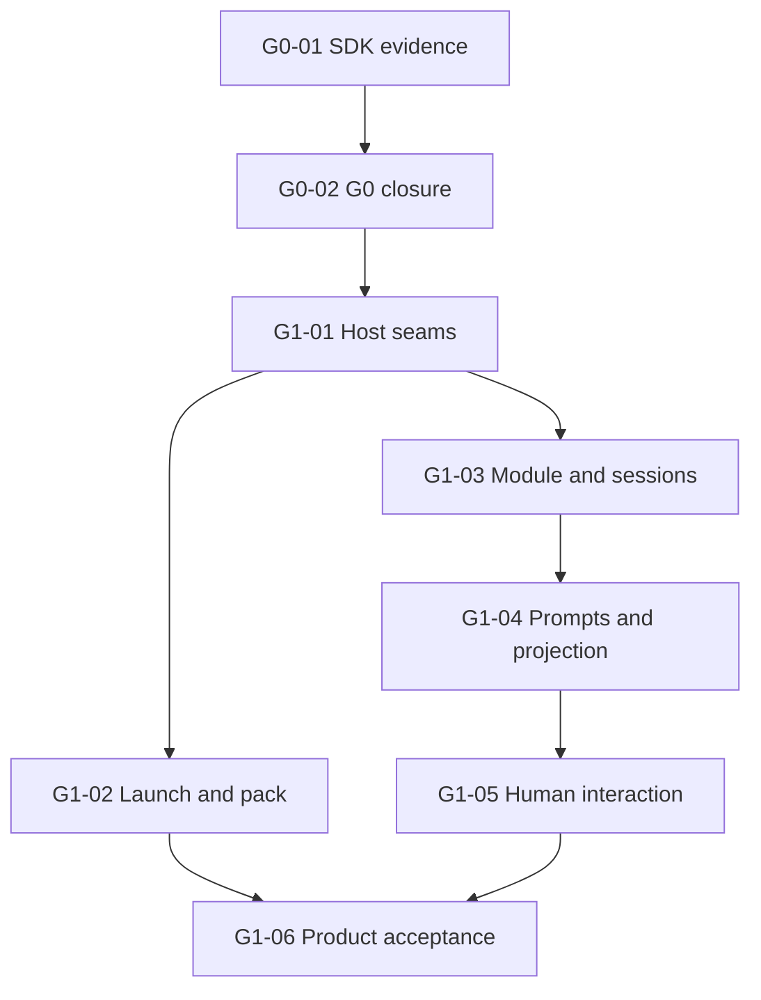

# Restricted ACP v1 Pilot Implementation Plan

> **For agentic workers:** REQUIRED SUB-SKILL: Use superpowers:subagent-driven-development (recommended when delegation is authorized) or superpowers:executing-plans to implement this plan task-by-task. Steps use checkbox (`- [ ]`) syntax for tracking.

**Goal:** Deliver a local ACP stdio Face through Vivy's existing governed runtime, after proving the dependency and host boundaries.
**Architecture:** Reuse FaceHost, Control RPC, Service.Run, Journal and HITL. An exclusive T2 Provider translates the restricted protocol; a generic face entrypoint isolates its artifact. A new runtime, codec or MCP manager would add authority and maintenance costs without satisfying a missing requirement.
**Tech Stack:** Go 1.26.4; ACP wire 1 / schema-v1.21.0; candidate eino-contrib/acp v0.0.4; existing Eino v0.9.13 and EinoExt adapters remain behind the repository firewall.
**Spec:** [Detailed design](../../specs/2026-10-07-acp-stdio-face-design.md), originally published at b5881143c04c31068a71018ea4e3168d8172f6a9; this delivery adds its conditional planning link.
**Baseline:** ACP branch b5881143c04c31068a71018ea4e3168d8172f6a9; executable source remains dd78fcf142f384d47ce5cfefb43738fdb9a7346d.
**Authorization:** The owner requested this planning package. Publication does not authorize implementation, accept the SDK, close G0, or schedule G1.

## Global Constraints

- Module projectvivy/acp; T2; std/face@v1; Host vivy/face-host; grant rpc.client; 0..1 Face per Generation; runtime metadata face=code.
- Require mcpServers=[]; reject nonempty values before side effects. No full ACP v1 compliance claim. No session restore, remote transport, client filesystem/terminal, images/audio, additional roots or client MCP installation.
- Public plugin imports no agent-vivy/internal package or cloudwego/eino package. Reuse ACP root types, conn and transport/stdio; no SDK internal imports, schema copy, custom codec or new agent loop.
- Design sections 10 and 12 own the exact limits and lifecycle. Values are proposed release defaults, not measurements; G0 must accept them with evidence or revise the design explicitly.
- No product output on stdout except ACP frames during protocol mode. Host text sanitization and an allowlisted projection are both required.
- Keep one source of truth for status/dependencies in this index and one design. Story plans add implementation decisions, not competing contracts.
- Use isolated test state. Do not access data/vivy.db, data/demo or data/workspaces. Generated assembly and sealed evidence are produced through their existing tools.
- All commits remain human-attributed. No implementation or upstream publication is implied by this planning commit.

## Review Focus

These five less obvious input classes are included in the owning Story's tests:

| Risk | Expected behavior | Owner |
|---|---|---|
| RF-1: percent-encoded separators, Windows drive/UNC/device paths, and a symlink root | Reject unsafe references before a run; authoritative core containment remains required | G1-01, G1-03 |
| RF-2: simultaneous session creation at the cap; duplicate initialize; idle cancel followed by a later prompt | Count reservations; retain ownership; do not attach cancellation to future work | G1-03, G1-04 |
| RF-3: early subscribe replay, terminal versus cancel, and final line without newline | Bind the subscription before display; exactly one final outcome; verify original digest before tail flush | G1-04 |
| RF-4: late/unknown permission or form replies after expiry and ambiguous decision RPC | Never grant or answer stale state; reconcile durable state and cancel if still uncertain | G1-05 |
| RF-5: a blocked OS stdout pipe, SDK panic, or shutdown with Control already cancelled | Close the pipe, keep cleanup context alive, emit no unsafe/replacement response, bound process exit | G0-01, G1-02, G1-06 |

## Epics and requirement coverage

| Epic | Outcome | Requirements |
|---|---|---|
| E0: compatibility and contract | A measured dependency verdict and reviewed G0 closure | R1 protocol; R3 privacy; R5 lifecycle |
| E1: governed adapter | Correct session, stream, interaction and cancellation behavior | R1 protocol; R2 authority/workspace; R3 projection/privacy; R4 HITL; R5 lifecycle |
| E2: product proof | Isolated artifact, conformance evidence and real-client acceptance | R6 assembly/omission; integrated R1-R5 |

## Story index — authoritative state and dependency data

An arrow means an accepted predecessor output is required. A completed plan is not an implemented Story.

| Story | Epic / requirements | Deliverable | Immediate predecessors and supplied contract | Plan | Status | Evidence / blocker |
|---|---|---|---|---|---|---|
| G0-01 | E0 / R1,R3,R5 | Executable SDK compatibility verdict | None | [G0-01](G0-01.md) | Planned | Concrete probe plan; execution not yet requested; v0.0.4 not accepted |
| G0-02 | E0 / R1-R6 | Reviewed dependency, contract and G0 decision | G0-01: source pin, fixture results and gap verdict | [G0-02](G0-02.md) | Blocked | SDK evidence and owner review of remaining design decisions |
| G1-01 | E1 / R2,R3 | Host input, text presentation and session context seams | G0-02: approved facet, path policy and release contract | [G1-01](G1-01.md) | Blocked | G0 closure and implementation authorization |
| G1-02 | E2 / R5,R6 | Generic face launch and compiler entrypoint | G1-01: Options.In and host lifecycle/presentation seams | [G1-02](G1-02.md) | Blocked | Accepted G1-01 evidence |
| G1-03 | E1 / R1,R2,R5 | ACP module, bounded transport and session admission | G1-01: host facet and typed error accessor; accepted dependency inherited through G0-02 | [G1-03](G1-03.md) | Blocked | Accepted G1-01 evidence |
| G1-04 | E1 / R3,R4,R5 | Prompt lifecycle and ordered safe projection | G1-03: owned sessions, typed Control client and SDK connection | [G1-04](G1-04.md) | Blocked | Accepted G1-03 evidence |
| G1-05 | E1 / R4 | Permission and question round trips | G1-04: prompt scope, ordered tool IDs and nonblocking interaction handoff | [G1-05](G1-05.md) | Blocked | Accepted G1-04 evidence |
| G1-06 | E2 / R1-R6 | Packed pilot and end-to-end release evidence | G1-02: isolated launcher/pack; G1-05: complete adapter | [G1-06](G1-06.md) | Blocked | Both predecessors; configured test provider and real ACP client |

### Dependency graph and execution waves

Waves: {G0-01} → {G0-02} → {G1-01} → {G1-02, G1-03} → {G1-04} → {G1-05} → {G1-06}. These are dependency waves, not date or duration estimates. The dependency decision is the first bottleneck.

G1-02 owns launcher/compiler files; G1-03 owns plugins/acp. They can run independently only after G1-01 is accepted. Shared go.mod/go.sum, source pins, this index and canonical docs are integrated serially by the lead. Parallel workers require separate worktrees; a parallel wave does not mandate delegation.

## File and interface ownership

All additions below are proposed. Existing paths were checked in the baseline tree.

| Owner | Existing seam / proposed additions | Contract handed onward |
|---|---|---|
| G0-01 | New sdk/internal/testdata/acp-compat; new docs/research/acp-sdk-compatibility.md | Exact version, public API inventory, reproducible transport verdict |
| G0-02 | Existing spec and ACP/FACE/ASSEMBLY/PORT docs, docs/TODO.md; new canonical ACP doc by moving the spec | Approved semantics and exact SDK pin; no production implementation |
| G1-01 | sdk/port/face/face.go; internal/app/facehost.go; internal/rpc/protocol.go and control.go | Options.In; TextSanitizer facet; RPCErrorCode; session-root context resolution |
| G1-02 | internal/codeface/launch.go; cmd/vivy/main.go; sdk/internal compiler/manifest/packer; new internal/faceprocess and cmd/vivy-face | Selected-Face launch with private state; sealed entrypoint=face |
| G1-03 | New plugins/acp module, agent/control/transport code | Typed handlers, owned sessions, bounded connection, safe errors |
| G1-04 | New plugins/acp prompt/projection code | Prompt generation ownership, ordered model/tool updates, cancellation |
| G1-05 | New plugins/acp interactions code | Scoped asynchronous permission/elicitation decisions |
| G1-06 | New recipes/acp.vivy.yml; existing conformance reproduction/evidence; new product tests and README | Hash-bound artifact and acceptance evidence |

## Commands and execution prerequisites

The baseline justfile selects powershell.exe and requires Go 1.26.4, Node, pnpm and just. Run the product gate on that supported environment; a Linux shell without PowerShell is not evidence that the gate passes. The race detector additionally needs a supported Go/CGO toolchain. Bootstrap sibling Laputa sources through the existing just ensure-laputa command. Build UI assets through just ui-build before ordinary root tests on a fresh checkout; later just ci includes the complete UI gate.

Root go test ./... does not cover nested plugin modules. Commands explicitly entering plugins/acp or the compatibility module must run there. Network dependency download happens before deterministic tests; no unit test calls a live model. Only the final real-client smoke uses a configured provider, without committing secrets.

Source changes may invalidate existing attestations before G1-06. In the owning Story, recompute changed source identities with go run ./sdk/internal/cmd/source-hash DIRECTORY CURRENT_DECLARED_SHA256, update only their declared hash references/expected evidence, regenerate with go generate ./internal/generated/assembly when required, and run TestCheckedInProviderConformanceMatchesExecutedSuites. Its independently executed checks must match the refreshed bundle; hashes and passing flags are never guessed. Include these consequential metadata paths explicitly in that Story's commit. G1-06 adds ACP-specific release attestation.

For each Story, use its focused test cycle; run the required just ci gate for changes to kernel, public contracts or product behavior. Append evidence to docs/logs/<actual-delivery-date>-acp-<story-id>/{summary,verification,acceptance}.md and update this index from evidence. Commit explicit paths with the Story's stated message; no empty checkpoints. The publication date is not a fabricated future delivery date.

## Acceptance coverage

| Design scenario | Implementing / proving Stories |
|---|---|
| ACP-01 real client | G1-03, G1-04; final G1-06 |
| ACP-02 rejected inputs | G1-03 |
| ACP-03 session root differs from launch root | G1-01, G1-02; final G1-06 |
| ACP-04 event ordering/replay | G1-04 |
| ACP-05 chunked redaction and digest | G1-01, G1-04 |
| ACP-06 isolated cancellation before run ID | G1-04 |
| ACP-07 SDK admission ordering | G0-01, G1-04 |
| ACP-08 permission | G1-05 |
| ACP-09 form questions | G1-05 |
| ACP-10 broken/blocked transport and flood | G0-01, G1-02, G1-03; final G1-06 |
| ACP-11 error and log leakage | G0-01, G1-01, G1-03; final G1-06 |
| ACP-12 default/ACP physical omission | G1-02, G1-06 |

## Handoff and change control

The next candidate for execution is G0-01, after the owner requests execution. Native sequential execution is recommended for this package: most work shares lifecycle contracts, and SDK evidence can invalidate downstream details. The G1-02/G1-03 split is the only useful initial parallel lane.

G0-01 may complete with a rejection verdict; that does not close G0. If upstream API, dependency, public facet, path policy or limit changes, revise the single design and every affected downstream plan before marking a Story Ready. No fallback SDK, fork or weakening of acceptance is pre-approved.

Planning self-review covers requirement coverage, unique Story IDs, DAG acyclicity, minimal edges, file ownership, signatures, commands and all 12 acceptance scenarios. Executable checks remain unrun at planning publication.
