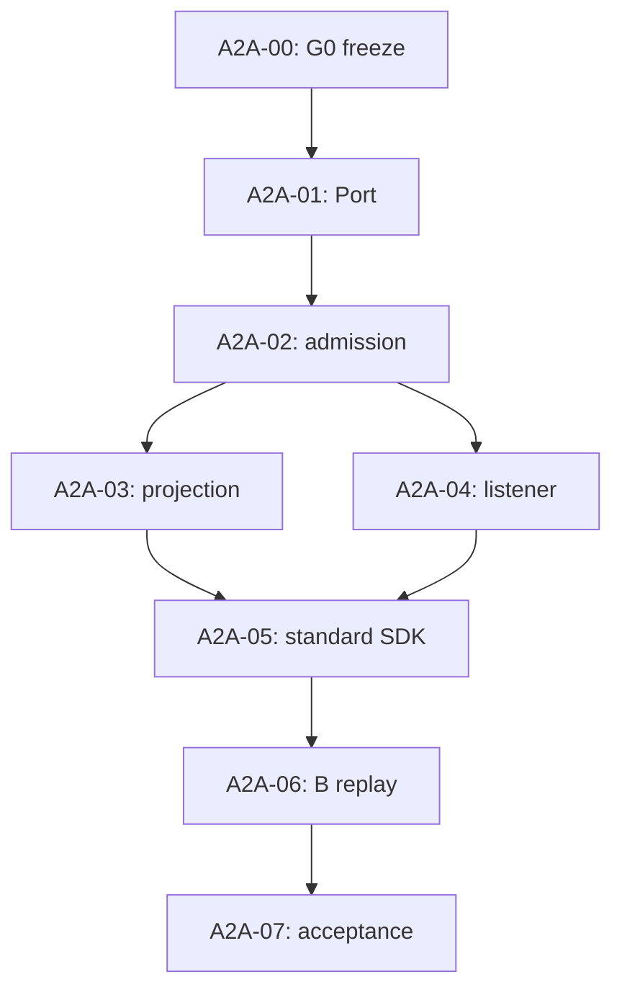

# Issue #2 — A2A Server G0/G1/G2 Plan Package

Revision P1, 2026-09-29. **Planning only.** Source baseline: `ProjectViVy/agent-vivy` main `3c4ed66826f5a40fd27dba0d9e208c55240a5955`; current Issue #2 is `UNSCHEDULED`/`DEFER`. None of the implementation Stories is released for execution. The owner has asked for a detailed plan around the **proposed** B enhancement, not yet amended the Issue's deferral of custom extensions or scheduled implementation.

## Authority and outcome

- [Issue #2](https://github.com/ProjectViVy/agent-vivy/issues/2) owns backlog status, approved direction and G0/G1/G2 gates. The [G0 design review](../../specs/2026-09-29-a2a-server-design.md) is a candidate for owner review. Reconcile accepted decisions into the canonical Channel Pack instead of keeping a competing product contract.
- The desired outcome is a cold-pluggable A2A 1.0 JSON-RPC/SSE northbound Channel whose tasks are real Vivy Runs and Sessions, plus **one optional** committed-event replay extension for enhanced clients. Official clients retain standard A2A interoperability but are not promised exact replay.
- Chosen economy: use official `a2aproject/a2a-go/v2` protocol, JSON-RPC handler and standard SSE as-is; implement a small independent `RequestHandler` and an opt-in replay stream. Reuse Service, Journal, existing projectors, and existing primary-run admission mechanics. Add only the missing cross-session message receipt index and the Host-side task/listener seam. No second executor/TaskStore, SDK fork, plugin DB or client SDK shipped as a separate product.
- B changes a material Issue #2 constraint: the general ban on custom extensions needs an explicit **one-extension exception** and separate standard/enhanced acceptance wording. The owner must review that contract and explicitly change `UNSCHEDULED` before product implementation. Draft plans below do not imply that either has happened.

## Requirements and coverage

| ID | Observable acceptance | Story owner |
| --- | --- | --- |
| R1 | Standard client discovers card, starts/gets/lists/cancels/subscribes to a real task; `taskId=run_id`, `contextId=session_id`. | A2A-00, A2A-01, A2A-02, A2A-03, A2A-05, A2A-07 |
| R2 | Single Run/Session/Journal/Policy authority; same message ID cannot create a second Run across retry/restart. | A2A-02, A2A-03, A2A-07 |
| R3 | A permitted enhanced client recovers every retained public committed event, even after terminal; standard clients get state convergence. | A2A-03, A2A-06, A2A-07 |
| R4 | Authenticated principal and context own task access; no remote approval; local Face handles ordinary question/approval. | A2A-02, A2A-03, A2A-04, A2A-05, A2A-06, A2A-07 |
| R5 | Omitted Generation contains no plugin/SDK/route/settings card; a disabled provider binds no socket. | A2A-01, A2A-04, A2A-05, A2A-07 |
| R6 | SQLite and PostgreSQL migration/upgrade parity, bounded query/stream resource use, reversible omission and recorded evidence. | A2A-02, A2A-03, A2A-04, A2A-07 |

## Story ledger and DAG

| Story / plan | Gate | Direct predecessor and accepted output needed | Deliverable | State / blocker |
| --- | --- | --- | --- | --- |
| [A2A-00](A2A-00.md) | G0 | None; require PLG-P9 release-conformance evidence and owner review | Reconciled contract, security and SDK compile/interop probe | **Planned**: author review/Issue amendment pending; no code authorized |
| [A2A-01](A2A-01.md) | G1 | A2A-00: frozen Port/signatures, Grant and SDK choice | Nonempty optional task Port and grant-safe exposure | **Blocked**: G0 acceptance and scheduling |
| [A2A-02](A2A-02.md) | G1 | A2A-01: task types + gated Host facade | Atomic external admission, owner index and bounded listing on both backends | **Blocked**: upstream and scheduling |
| [A2A-03](A2A-03.md) | G1 | A2A-02: durable owner/receipt and real Run IDs | Sanitized Journal snapshots, ordered replay/tail, status/cancel | **Blocked**: upstream and scheduling |
| [A2A-04](A2A-04.md) | G1 | A2A-01: optional mount and grant contract; A2A-02: authenticated ownership lookup | Host-owned listener, credential boundary and lifecycle | **Blocked**: upstream and scheduling |
| [A2A-05](A2A-05.md) | G2 | A2A-03: real TaskHost; A2A-04: live Host HTTP mount | Official SDK standard A2A module/Recipe/Card | **Blocked**: G1 acceptance and scheduling |
| [A2A-06](A2A-06.md) | G2 | A2A-05: enabled A2A module/Card; A2A-03: public event cursor | Opt-in replay-and-tail extension on same Host listener | **Blocked**: owner extension amendment + upstream + scheduling |
| [A2A-07](A2A-07.md) | G2 | A2A-06: standard and enhanced flows mounted | End-to-end evidence, packed omission, iteration log and handoff | **Blocked**: upstream + G2 scheduling |

Waves: `{00}` → `{01}` → `{02}` → `{03,04}` → `{05}` → `{06}` → `{07}`. Story `04` also consumes `01` directly for mount signatures, even though `02` makes that dependency transitive; no extra edge is needed. `03` and `04` can be worked independently once `02` is accepted but both will touch `internal/channelhost` and app wiring; schedule them sequentially unless isolated worktrees and one integration owner are available. The DAG has unique IDs, no self edges, no cycles, and every node is reachable. These are dependency waves, not dates or implementation permission.

## Shared decisions to freeze in A2A-00

| Boundary | Proposed contract; G0 must prove and freeze it |
| --- | --- |
| Port | Optional `channel.TaskHost` with `SubmitTask`, `GetTask`, `ListTasks`, `CancelTask`, `SubscribeTask`, `ReplayTaskEvents`; no new methods on base `channel.Host`; protocol-neutral Port fields. `TaskLifecycle interface{}` removed. `grantedChannelHost` cannot gain TaskHost methods unconditionally: construct a grant-aware wrapper variant only when `channel.a2a` is effective. |
| Admission | Core-owned `channel_task_admissions(channel_id,principal_id,message_id,input_digest,session_id,run_id,created_at)`, unique external key and unique run ID; stored in **the same commit** as user message, real Run and `run.started`, not in a `BeforeStart` callback or later reconciliation. Reuse the existing `ContinuityStore`/primary-run admission code when possible; its current receipt `(session,operation,request)` alone cannot deduplicate a first request with no context. Pair additive SQLite/PG migrations under `internal/storage/migrations`; choose the next actual shared number at execution, never edit prior migrations. |
| Identity | A missing context yields a new private Session; duplicate message returns original `(run,session)` even after terminal. Supplied context must belong to the same channel/principal by an earlier committed admission. Verify owner before querying task, listing, cancelling or replaying. Local Service remains sole Run and policy authority. |
| Output | Initial standard subscription snapshot has a captured Journal high-water mark, then tail from that mark. Only public committed Journal projections leave the Host; reuse assistant-text digest validation. Pending ordinary question is visible but answered by a local authorized Face; dangerous approval token and response never leave it. A message addressed to an existing task is explicitly unsupported in the first cut. |
| Replay B | Standard SDK SSE IDs are random; use official standard binding unchanged. Separate optional `POST /a2a/extensions/task-event-replay/v1` SSE stream uses stable `(run,seq,ordinal)` public-event IDs, exclusive cursor, same-connection catch-up/tail. Terminal tasks drain and close. Existing Journal history is available while its Session exists; deletion gives explicit unavailable/not-found, no new retention setting. A compatible enhanced client must durably store its cursor with its event log. |
| Listener | Dedicated ChannelHost-owned loopback listener, bearer token even on loopback, optional HTTPS reverse-proxy public URL, exact two POST paths + well-known GET, no `:8787`/`/rpc`, plugin-owned bind or global mux. Host validates/authenticates before injecting principal into TaskHost; all task methods checked again by Host. Startup is all-or-nothing per A2A channel; disabled/omitted means no bind. |
| Extension URI | Proposed canonical spec URI: `https://github.com/ProjectViVy/agent-vivy/blob/main/docs/architecture/A2A-TASK-EVENT-REPLAY.md#v1`; publish the short extension specification as part of G0 before advertising it. `AgentCard` declares it optional (`required: false`), and `GetTask` remains the state-convergence fallback. Verify this URI and the exact HTTP method/error envelope against pinned SDK/spec in G0. |

**Clarification needed before implementation:** Issue #2 still explicitly defers custom extensions and marks all product work unscheduled. A2A-00 prepares an exact Issue diff for owner review. Owner adoption of B makes the one-extension exception part of the acceptance contract; it does not silently schedule G1/G2. If owner retains the ban, keep A2A-06/07 blocked and do not claim exact-event reconnect.

Proposed minimal Issue #2 amendment for owner review (text, not applied):

1. Replace the blanket custom-extension deferral with: “General custom extensions remain deferred. One optional `task-event-replay/v1` extension is allowed solely to recover retained committed public events across disconnect, including terminal tasks; it is not required for standard A2A clients.”
2. Replace reconnect acceptance with two checks: “A standard client reconnects to a live task using the current Task snapshot and subsequent updates; a terminal task remains readable through GetTask.” “An enhanced client resumes the optional replay stream from its durable cursor and receives each retained public committed event in order without applying duplicates, across disconnect, terminal transition and process restart; deleted task/history returns explicit replay-unavailable.”
3. Add to G0: “Freeze the extension URI, versioned wire shape, Host-mounted endpoint, cursor and deletion semantics, plus the opt-in client fixture.” Keep `UNSCHEDULED`, all other explicit deferments and human-only scheduling unchanged.

One additional G0 policy reconciliation: `AGENTS.md` says first-party features belong in the default Generation, while Issue #2 explicitly requires a cold-pluggable module omitted by default. Treat this as a material project-rule conflict for owner review; do not edit `AGENTS.md` or silently place A2A in default/lite to evade it.

## Execution rules and review focus

- Before modifying Module/Port/Recipe/Inspect paths, follow `.agents/skills/vivy-plugin` and `.agents/skills/vivy-kernel-ci`. Eino pinned `v0.9.13` was checked at the repo manifest; G0 verifies actual EinoExt A2A availability/fit without importing Eino outside `internal/runtime/` and `internal/provider/`. Transport code belongs in the optional module and must not enter the default artifact.
- All specs/plans/docs/logs in English. Core migration files paired and immutable. Keep normal channel `/approve` semantics isolated from A2A. Do not add proxy, client daemon, public registry or configuration switches without an acceptance requirement.
- Review focus: same message ID with different body → conflict; first request without context retried after commit → original session/run; cursor at same Journal entry with multiple public events → no skipped ordinal; disconnect during catch-up/tail and terminal during gap → no missing public event; Session deletion/revoked token → explicit failure and no other principal's disclosure.
- Planned checks are not passing evidence. Each Story lists focused tests; A2A-07 adds `just ci`, two SQL backends, official SDK client, enhanced client, and packed artifacts. Do not label PostgreSQL PASS without an actual DSN-backed run.
- The documentation branch contains no product code, Issue edit, release or PR. This plan is reviewable but all implementation Stories remain Blocked under the Issue's human scheduling gate.
