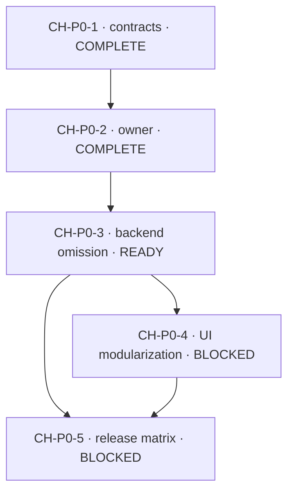

# Channel Modularization Epic Execution Index

> **For agentic workers:** This file is the single execution index for issue
> [#42](https://github.com/ProjectViVy/agent-vivy/issues/42). Implement exactly
> one Ready Story at a time. Use `superpowers:executing-plans` or
> `superpowers:subagent-driven-development`, `superpowers:test-driven-development`,
> and `superpowers:verification-before-completion`. Do not infer permission to
> start a blocked successor.

**Epic:** Channel subsystem modularization

**Aggregate branch:** `feat/channel-modularization`

**Planning baseline:** `1be71c4d0892967fd8f4192abb1c2414dad9f498`

**Architecture authority:** `docs/architecture/CHANNEL-MODULARIZATION.md`

**Issue authority:** [ProjectViVy/agent-vivy#42](https://github.com/ProjectViVy/agent-vivy/issues/42)

**Execution policy:** implementation is delegated to other agents; this package
contains plans only.

## Outcome

Channel becomes a removable, build-owned subsystem. A Recipe may include the
backend with any supported Provider subset, include the backend without its
dedicated UI, or omit the whole subsystem. Absence is proven by generated
imports, Go dependency closure, sealed Manifest/Inspect output, final UI
assets, live RPC/browser behavior, and whole-Generation rollback.

The Epic preserves one `Service.RunWithOptions` path, one Journal, one policy
authority, one settings document, one generated Assembly mechanism, and the
public `std/channel@v1` ABI. It does not introduce runtime discovery, build
tags, a second feature registry, a second dispatcher, or dynamic code loading.

## Requirement map

| ID | Requirement | Owning Story | Closure evidence |
|---|---|---|---|
| CH-R1 | Canonical `vivy/channel-host` is optional and physically removable with all Providers and platform SDKs. | CH-P0-3 | generated source, `go list -deps` closure, packaged no-channel artifact |
| CH-R2 | Host/Provider selection and diagnostics are conditional, deterministic, and Recipe-owned. | CH-P0-1, CH-P0-3 | compiler cases, reduced and Telegram-only Recipes |
| CH-R3 | Manifest, capability state, startup validation, management-method absence, and Inspect report actual backend selection/process truth. | CH-P0-3 | Inspect assertions and live RPC smoke |
| CH-R4 | `vivy/channel-ui` is selected by the same compiled plan and contributes a typed settings section through PresentationHost. | CH-P0-4 | generated UI Assembly, SDK/host conformance tests |
| CH-R5 | Disabled or omitted Channel UI never mounts, subscribes, calls `channel/*`, or contributes dedicated assets; stale links and generic history remain safe. | CH-P0-4 | component/network tests, browser smoke, dist scan |
| CH-R6 | Default, no-channel, backend-without-UI, and single-Provider Generations are packaged, inspected, exercised, and rollback-safe. | CH-P0-5 | release matrix, browser/network capture, rollback record |
| CH-R7 | Default behavior, dormant configuration, historical Journal data, and L0 authority boundaries remain intact throughout the Epic. | all Stories | regression suites and acceptance logs |

## Story ledger and dependency DAG

| Story | Plan | Status | Immediate predecessor | Acceptance authority |
|---|---|---|---|---|
| CH-P0-1 | [Contract and conformance foundation](../2026-09-19-channel-p0-1-contract-conformance.md) | COMPLETE | none | `docs/logs/2026-09-19-channel-p0-1/acceptance.md` |
| CH-P0-2 | [Actual backend owner](../2026-09-19-channel-p0-2-backend-owner.md) | COMPLETE | CH-P0-1 | `docs/logs/2026-09-19-channel-p0-2/acceptance.md` |
| CH-P0-3 | [Backend omission](ch-p0-3-backend-omission.md) | READY | CH-P0-2 | new CH-P0-3 acceptance log |
| CH-P0-4 | [UI modularization and configuration](ch-p0-4-ui-modularization.md) | BLOCKED | accepted CH-P0-3 | new CH-P0-4 acceptance log |
| CH-P0-5 | [Release matrix and closeout](ch-p0-5-release-matrix.md) | BLOCKED | accepted CH-P0-3 and CH-P0-4 outputs | new CH-P0-5 acceptance log |

The direct P0-3 -> P0-5 edge is intentional: P0-5 consumes P0-3's packaged
backend dependency-closure and live no-channel evidence independently of
P0-4's UI evidence.

## Ordered Recipe matrix

| Recipe | Backend Host | Providers | Channel UI | First owner |
|---|---:|---|---:|---|
| `recipes/default.vivy.yml` | yes | all five | yes after P0-4 | P0-4 updates UI selection; P0-5 proves parity |
| `recipes/web-no-channels.vivy.yml` | no | none | no | P0-3 creates; P0-5 releases |
| `recipes/web-channels-no-ui.vivy.yml` | yes | all five | no | P0-4 creates; P0-5 releases |
| `recipes/web-telegram-only.vivy.yml` | yes | Telegram only | yes after P0-4 | P0-3 creates backend subset; P0-4 adds UI selection; P0-5 releases |

P0-3 must not create a placeholder `web-channels-no-ui` Recipe before
`vivy/channel-ui` exists. P0-4 creates that meaningful contrast and updates
the two UI-bearing Recipes. P0-5 changes no product selection semantics.

## Shared-file ownership and merge order

These Stories are deliberately serial because they overlap compiler and
Recipe authority. Parallel implementation is not authorized.

| Shared surface | P0-3 responsibility | P0-4 responsibility | P0-5 responsibility |
|---|---|---|---|
| `internal/modules/defaults/catalog.go` | direct backend factory binding | add build-owned Channel UI binding | no semantic change |
| `sdk/internal/assembly/*` | backend conditional import/state truth | derive selected UI contribution from the same plan | conformance only |
| `sdk/internal/frontend_v1.go` | dependency-closure test seam and backend Inspect truth | UI input derivation/staging | package and inspect matrix only |
| `recipes/*.vivy.yml` | no-channel and Telegram-only backend selection | UI-bearing/default and backend-without-UI selection | consume unchanged |
| `.github/workflows/ci.yml` | none | focused tests only | add release/browser matrix lane |

## Invariants and hard stops

- `vivy/channel-host` remains the sole T1 provider of
  `core/channel-host@v1` (`0..1`). A selected `std/channel@v1` Provider without
  it fails compilation; Host with zero Providers remains legal.
- `WithoutEars()` means compiled but process-unavailable. It is never omission
  evidence.
- No-channel means no Channel factory/owner, Providers, grants, management
  contribution, listener, worker, delivery seam, or platform SDK in the Go
  dependency closure.
- Enabled configuration for an unavailable Provider fails startup clearly.
  Disabled entries remain inert and losslessly persisted.
- Runtime UI configuration never selects or imports code. Omitted
  `ui.extensions.vivy/channel-ui.enabled` defaults to true only when the
  extension is compiled.
- The browser mounts Channel UI only when the generated UI contains it, the
  backend projects it enabled, and all three `channel.inspect|get|update`
  capabilities are negotiated.
- Absence keeps historical messages generic and readable. Unknown Channel
  names/icons use a generic fallback.
- Generated files are regenerated by their owning generator, never edited by
  hand.
- Scope expansion into public ABI changes, runtime loaders, hot-loading,
  marketplace distribution, Channel protocol redesign, or a second UI
  registry requires a new architecture decision.

## Execution handoff protocol

1. Start an isolated worktree from the current aggregate-branch head, not from
   the planning baseline after later Stories have merged.
2. Read root and subtree `AGENTS.md`, `.agents/skills/vivy-plugin/SKILL.md`, and
   the Story plan in full. Compiler/Host work also follows
   `vivy-kernel-ci`. UI work must load `oil-frontend` when that skill is
   available in the executor; if unavailable, report the missing skill before
   editing and use `ui/AGENTS.md` only after supervisor approval.
3. Confirm every immediate predecessor is `COMPLETE` in this index and its
   acceptance log exists. A blocked Story may be reviewed, not implemented.
4. Execute every RED/GREEN/refactor step and focused commit in order. Do not
   silently fold successor work into the current Story.
5. Request independent code review, resolve findings, run the Story's complete
   gate, and write `summary.md`, `verification.md`, and `acceptance.md` under
   `docs/logs/YYYY-MM-DD-channel-p0-N/`.
6. Merge the accepted Story to `feat/channel-modularization`, then update only
   this ledger's status/evidence link. The next Story branches from that new
   aggregate head.

## Epic Definition of Done

- All five Story rows are `COMPLETE`, with no skipped immediate predecessor.
- The four-Recipe matrix is built twice with stable Generation identities and
  inspected from packaged artifacts.
- Dependency and asset evidence prove physical removal, not merely nil values,
  hidden tabs, or empty provider lists.
- Live no-channel RPC proves ordinary session/chat/tool paths work and
  `channel/*` returns standard `MethodNotFound` without advertised Channel
  capabilities.
- Default behavior remains complete; backend-without-UI operates without
  Channel browser traffic; disabled/omitted UI has no mount or request.
- A prior coherent Generation is restored through Studio rollback without
  mutating Channel settings or historical Journal data.
- `just ci` and the required Windows browser matrix are green, and the final
  acceptance log links the exact CI run and artifact evidence.
