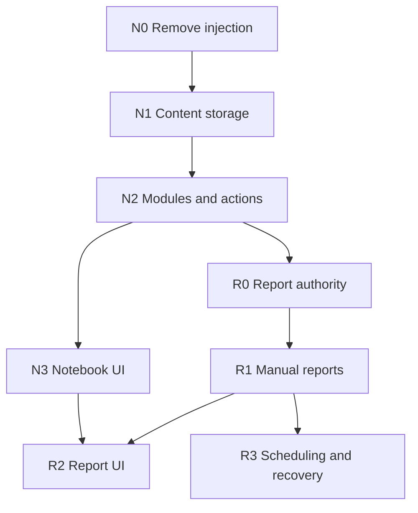

# Notebook and Reports Implementation Package

**Design:** [2026-10-09-notebook-reports-design.md](../../specs/2026-10-09-notebook-reports-design.md), including planning elaborations in section 16.
**Code baseline:** `017ec8cc37970b291e04c619990aed00d5403116`.
**Starting design commit:** `cd0c36298b3764ec78723bf9070d170623b99ee2` on `notebook`.
**Authorization:** the owner requested this package and previously authorized
uploading the work to `notebook`. Coding, merging, deployment and tracker updates
are not part of this planning turn.

This index owns Story status and immediate dependency data. Story files own their
implementation steps/contracts; the linked spec owns product requirements. This
is one package with eight Story plans, not a second architecture or a backlog
presented as an executable plan. All new symbols/test names are proposed until
their owning Story supplies verified code.

`Create` paths are proposed; `Modify` paths either exist at the pinned baseline
or are created by an earlier task/predecessor named in this package. Relative
filenames in a task inherit its explicitly named directory. Migration numbers
are allocated at execution to avoid collisions with intervening work.

## Epics and delivery outcomes

| Epic | Outcome | Release boundary |
| --- | --- | --- |
| NOTEBOOK | External, editable, durable and optional notebook | N0-N3: usable UI/headless notebook without report runtime |
| REPORTS | Constrained manual and scheduled reporting | R0-R3: source-backed reports, feedback, regeneration and recovery |

## Authoritative Story table

| Story | Epic | Requirements | Immediate predecessors | Status | Plan | Evidence / gate |
| --- | --- | --- | --- | --- | --- | --- |
| N0 | NOTEBOOK | NB-01, NB-07 | — | Planned | [N0.md](N0.md) | Concrete root plan; awaits package review/execution authorization |
| N1 | NOTEBOOK | NB-02, NB-03, NB-04, NB-06, NB-07 | N0 | Planned | [N1.md](N1.md) | Needs accepted no-injection behavior; produces content/store contracts |
| N2 | NOTEBOOK | NB-01, NB-02, NB-05, NB-06, NB-07, RP-04 | N1 | Planned | [N2.md](N2.md) | Needs durable scoped content/CAS; produces real actions and optional assembly |
| N3 | NOTEBOOK | NB-02, NB-03, NB-04, NB-05, NB-06 | N2 | Planned | [N3.md](N3.md) | Needs authenticated schemas/actions; completes notebook UI release |
| R0 | REPORTS | RP-01, RP-03, RP-04, NB-05 | N2 | Planned | [R0.md](R0.md) | Needs trusted scope/actor and notebook exclusion; produces root admission and report binding |
| R1 | REPORTS | RP-01, RP-02, RP-03, RP-04, NB-03, NB-04 | R0 | Planned | [R1.md](R1.md) | Needs restricted workflow identity; produces manual reports and output receipts |
| R2 | REPORTS | NB-03, NB-04, NB-05, RP-02, RP-03 | N3, R1 | Planned | [R2.md](R2.md) | Needs editor/conflict UX and real report contracts |
| R3 | REPORTS | RP-03, RP-04, RP-05, NB-05 | R1 | Planned | [R3.md](R3.md) | Needs shared report operation/settings; produces scheduled/recovery closure |

Every edge supplies the output described above. N0 -> N1 is deliberate sequencing:
do not introduce a richer content store while the old preamble continues to read
it. All other ancestor contracts are inherited transitively; no duplicate edges
are retained. No implementation evidence currently exists for this package.

Derived waves: `{N0}`, `{N1}`, `{N2}`, `{N3,R0}`, `{R1}`, `{R2,R3}`.
Recommended execution order is N0, N1, N2, N3, R0, R1, R2, R3 so a human can
accept the complete notebook before reporting work. Waves indicate dependency
eligibility, not authorization or automatic parallel execution.

## Shared-file ownership and sequencing

| Shared surface | Writers | Coordination |
| --- | --- | --- |
| Storage migrations, Engine interfaces | N1, N2, R0, R1, R3 | Allocate next paired migration IDs at Story start; never edit released IDs |
| App/ActionHost/Source Catalog/compiler | N2, R0 | R0 begins only after N2's accepted binding patterns |
| Run/message/observer provenance | N2, R0 | R0 extends N2 metadata; no parallel alternate provenance format |
| Notebook UI, locale catalog | N3, R2 | R2 consumes N3 editor/revision contracts |
| Report settings DTO and module action schemas | R1, R2, R3 | R1 seals manual settings DTO; R3 extends enabled schedule fields already declared there; R2 uses that contract |
| Report scheduler tests versus report UI tests | R2, R3 | May run independently only after R1; serialize shared fixtures/catalog hashes when committing |

Keep a single write lane by default. If the owner later chooses parallel agents,
use separate git worktrees and explicit shared-file ownership. Do not spawn
workers merely because this DAG has a fork.

## Global constraints inherited by every Story

- Built-in Storage is the sole authority; all new SQL is paired SQLite/PostgreSQL
  migration work. No Obsidian, synchronization or pluggable storage framework.
- Report edits are immutable revisions; CAS conflicts preserve local/saved data.
- Maximum new body: 256 KiB UTF-8; comment: 16 KiB; metadata page: 100 rows.
  Requests/results also obey the existing 1 MiB default action-wire ceiling.
- Ordinary chat never loads notebook content automatically. Explicit reads carry
  trusted provenance so automatic learning does not ingest notebook-derived text.
- One Service/Journal/policy path; no report-specific timer, queue or Agent loop.
- Eino v0.9.13 and the existing EinoExt adapters stay inside runtime/provider;
  INOFY is pinned at `71e2c9bbe47d`. No dependency upgrade is required.
- No fabricated author identity, direct edits to generated Assembly, plugin-v0
  compatibility layer, or changes to AGENTS/skill rules without authorization.
- Plans and durable records are English; user-facing UI uses module EN/ZH catalogs.

## Review focus and ownership

| Risk | Owning assertion |
| --- | --- |
| Save committed but acknowledgement lost | N1 `TestNotebookMutationRetryAfterCommit` returns the same revision/receipt |
| Agent/headless request claims human privileges | N2 `TestNotebookOriginCannotBeForged` refuses forged origin/scope before writing |
| Regeneration completes after edit/move/delete | R1 `TestReportPublicationRaces` preserves head/location or returns destination_deleted |
| Notebook text survives compaction and later gets learned | N2 `TestNotebookProvenanceSurvivesCompaction` excludes affected capture after reopen |
| Crash after publication before INOFY acknowledgement | R3 `TestReportRecoveryAfterPublication` reuses output without inference/publication replay |

## Environment and verification protocol

Run commands from repository root unless a Story says otherwise. On an execution
checkout, read AGENTS and relevant directory rules first, confirm a clean isolated
write lane, then use the checked-in `just setup`/`just ensure-laputa` bootstrap.
The root `justfile` uses PowerShell conventions; use its supported environment.
Do not rewrite recipes or weaken gates to fit an unavailable shell/dependency.

Planning-environment findings: `just ci` was attempted but `just` is not installed.
The plugin skill requires `oil-frontend` for UI implementation, but its referenced
skill is absent from the checked-out skills and current catalog. Neither finding
blocks authoring this package; resolve the required execution environment/skill
before claiming the affected implementation gates. No substitute pass is recorded.

Each Story specifies focused RED/GREEN checks. They diagnose behavior; they do
not replace `just ci` or required integration evidence. Failing package setup or
missing test discovery is not the intended RED assertion.

For any schema Story, run the same shared conformance suite for SQLite and
PostgreSQL. `VIVY_POSTGRES_TEST_DSN` must point to a disposable authorized database;
existing PostgreSQL tests skip without it. A skip is **not** a pass or parity
evidence. Never use the user's live data root for test fixtures.

For Module Stories, run actual conformance before updating hash-bound evidence,
then SDK verify/pack/Inspect. Pack output must be a fresh disposable path. Test
selected, omitted and backend-only Recipes; missing dependencies must fail compile.
Use the checked-in source-hash/generation tools, not hand-maintained digests.

For UI Stories, unit/type checks plus a real split backend/Vite `:3015` flow are
required. N3 introduces a dedicated split-UI Playwright config rather than using
the existing embedded-UI default. Existing mock data is not acceptance evidence.

Every delivered Story writes `docs/logs/<delivery-date>-notebook-<story>/` with
summary, verification, acceptance and rollback note where persistence changes.
Record actual fixture paths, commands, test counts, skips and gate outcomes;
do not copy a plan's expected result as a claim that it ran. Commit explicit
changed paths under the verified human author identity. Push only within the
owner's existing branch authorization; never merge without authorization.

## Readiness and handoff

`Planned` means a concrete plan exists; `Ready` additionally requires accepted
predecessor evidence, resolved environment gates and execution authorization.
After package approval, N0 is the first candidate. Later Stories are not Ready
just because earlier code compiles. Verify the combined NOTEBOOK and REPORTS
outcomes at N3 and R3 respectively; R3 also requires the R2 UI release evidence
for Epic closure, although backend implementation of R3 does not depend on R2.

The handoff for a Story is this index, its plan, linked spec, current code diff,
and predecessor acceptance logs. Preserve the declared interfaces; a local
correction updates all consumers and invalidates stale evidence. Scope expansion,
weaker acceptance or major architecture change returns to the owner.

The owner has not selected an execution method. Recommend native sequential
execution for this package because migration, authority and generated bindings
share state. Independent review is most useful at N2 and R0/R3. An owner may
instead select subagent-driven execution; that selection does not waive gates.

## Planning verification record

Package checks, source-path checks and dependency validation are recorded in
`docs/logs/2026-10-09-notebook-planning/verification.md`. Product tests have not
run and no implementation is marked Done. This index is not a background monitor.
