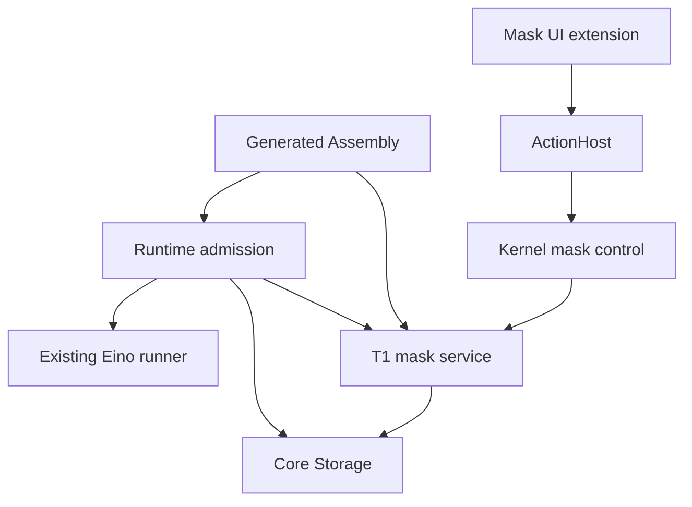

# Optional mask subsystem: detailed architecture

Status: detailed design approved for active implementation; integrated release evidence pending.
Issue: https://github.com/ProjectViVy/agent-vivy/issues/43 (P1).
Baseline: `5253f77dfcec6c0d212c2f41d386aeeb7619e1ef`, inspected 2026-09-21.
This document consolidates the issue proposal and both approved addenda. It is the
proposed authoritative detailed design; the issue remains the requirement record.
The four delivery seams are detailed in the [implementation package](../plans/masks/index.md).
The maintainer requested this refinement after delivery and subsequently authorized
implementation in the active session. Publication, push and merge remain separate
actions from release acceptance.

## 1. Outcome and architectural decision

A mask changes the current session's working role without changing who Vivy is,
what it may access, or how a run executes. Use one optional T1 `vivy/masks` Module,
one closed `core/mask-service@v1` contract, existing ActionHost/PresentationHost,
and immutable run-admission state in Core Storage. Runtime alone assembles model
instructions. Reuse the existing composer and pinned Eino ADK hooks, moving prose
to embedded Markdown assets rather than creating another template framework.
Browser-provided system text would be cheaper but violates backend authority and
replay; a public prompt middleware or general prompt graph adds unnecessary power.
An ordinary Context Source cannot supply system instructions under the current
Port contract. Database-held custom Markdown avoids dual file/database authority.

### Requirements and exclusions

| ID | Required observable behavior | Design sections |
| --- | --- | --- |
| M1 | Selected mask body reaches each model call for that admitted run | 5–7 |
| M2 | Persona/runtime constraints prevail; selection cannot change grants/tools/model | 3, 6, 8 |
| M3 | Durable per-session selection; immutable per-run capture | 4–5 |
| M4 | Empty selection adds no wrapper/body; backend owns catalog and state | 4, 9 |
| M5 | Optional backend and UI with real artifact omission | 3, 9–10 |
| M6 | Resume keeps captured revision; persona/mask never silently truncated | 5–7 |
| M7 | Built-in/framing prose has one Markdown source; no Go/TS duplicates | 6, 10 |
| M8 | Separate persona/memory seams; conditional scoped project framing | 6 |
| M9 | Code mode remains accessible independently of masks | 9 |

One active mask per session. Ship programmer, researcher and writer built-ins
corresponding to today's visible choices, with real Markdown bodies. “No mask”
is virtual, not another persona. Custom CRUD is local authenticated control-plane
functionality. No model/tool overrides, auto-selection, stacking, filesystem
watching, imports/export, marketplace, child-mask inheritance, persona governance,
memory backend, Studio implementation, or new model-visible management tool.
Lite is a product composition, headless is a presentation property: neither is a
synonym for unmasked. No new lite recipe is invented in this issue.

## 2. Verified baseline and changes from the older proposal

| Existing file / symbol | Evidence and implication |
| --- | --- |
| `internal/runtime/prompt.go`: `composeStaticInstruction`, `composeRunPreamble` | Prose is still Go constants; no canonical embedded Markdown assembler was found in main. Extend this seam, not a new service. |
| `internal/runtime/service.go`: `runWithOptions`, `runPersistence` | Ordinary admission persists message/run/start/status in separate calls. It is not an atomic snapshot boundary today. |
| `internal/runtime/rewind_service.go`: `EditSession`, `ForkSession` | Edit has its own atomic persistence callback; fork must copy selection in its existing storage transaction. |
| `internal/storage/contracts.go`: `HistoryMutationStore`, `Engine` | Storage already owns transaction composition; do not expose SQL transactions to Modules. |
| `internal/storage/migrations/{sqlite,postgres}/023_workspace_path.sql` | Central paired migration runner has landed; append the next available paired migration. |
| `internal/moduleport/ports.go`, `internal/modules/defaults/catalog.go` | Closed Port ownership and source selection are build-owned; masks are absent. |
| `sdk/internal/assembly/{source,runtime_generate,ui}.go` | Extend typed generation; never edit generated wiring by hand. |
| `internal/app/app.go`: ActionHost construction | Current scoped facade only bridges Run/Tool; named mask operations need an explicit internal addition. |
| `internal/rpc/{protocol,control}.go` | Peer authentication and session binding exist; wire entry is `module.action.invoke`. |
| `sdk/ui/src/module.ts`: `UICompositionHost`, `FullUIHost` | Components registry exists; no typed chat-header mask consumer exists. Reuse registry with one typed slot. |
| `ui/src/components/masks/mask-catalog.ts` | Hard-coded catalog and `vivy.ui.activeMask` are current authority; `faceForMaskId` conflates programmer with code. |
| `ui/src/components/chat/{ChatView,MaskAndModelSwitcher,ConversationSidebar}.tsx` | Current mask controls are shell imports, not optional contributions. |
| `ui/src/routes/{_layout,_layout.masks}.tsx` | Static mask route and header must become contribution consumers. |
| `plugins/vivy-persona` | Does not establish a live persona authority; no claim of seven-document persona support. |

The checked Channel, issue51 and workflow branch trees also yielded no
`go:embed ...prompt` match. This is a bounded search, not proof about unpushed
work. Before implementation, reconcile any newly landed composer against this
single design. `docs/architecture/PLAN-GOAL-PREDESIGN.md` already proposes the
same `internal/runtime/prompts/` location; share it rather than duplicate it.

Two explicit corrections to the issue draft: storage availability checks belong
in Start/Ready, not side-effect-free Construct; a built-in revision is identified
by Generation plus digest, not a counter presumed monotonic across rollback.
Custom definition and selection revisions remain monotonic within their rows.

## 3. Ownership, composition and closed Port



| Boundary | Owner and rule |
| --- | --- |
| `core/mask-service@v1` | T1 provider `vivy/masks`, cardinality 0..1; sole Host consumer Runtime. Kernel control uses a separately scoped management facade, not public access to the resolver. |
| Catalog | Mask service validates and resolves definitions; Storage owns durable bytes and transactions. |
| Selection | Kernel control authorizes session mutation; Storage serializes it with catalog delete and admission validation. |
| Prompt / resume | Runtime owns precedence, generation compatibility, rendering, budgeting, snapshot use. |
| Backend actions | `std/control-action@v1`; ActionHost authenticates, authorizes, validates, audits, enforces deadlines and dispatches. |
| UI | `std/ui-extension@v1`; PresentationHost owns selection and deterministic composition. No UI Grant. |
| Persona / memory | Separate Runtime slots, with no implementation of their future authorities here. |

Proposed contract package: `internal/maskcontract`. It contains plain Vivy values,
no Eino, SQL handles, RPC server, public plugin interface, or prompt execution.
Runtime/App may import it; they must not unconditionally import the mask provider.
The provider lives under proposed `internal/modules/masks/`, including its
embedded built-ins and selected UI source. Extend the internal Source Catalog UI
binding to this source root rather than misclassifying it as a public plugin.

Generated Assembly supplies a typed optional mask factory/service and the named
management provider set. App supplies only the narrow store capability. Resolver
absence is represented explicitly, never by a dummy provider. Agent recipes can
select masks without selecting a UI contribution; a selected Web extension needs
both mask actions and PresentationHost. No hard backend dependency on Web UI.

Construct only checks pure embedded metadata and dependency shapes. Start checks
storage readiness; Ready publishes capability. No goroutine, polling, cache,
network connection or independent database. Stop/Close are idempotent and own no
storage connection. Failure of a selected module aborts startup with normal
reverse-order cleanup. Runtime calls honor caller cancellation and the existing
host deadline; no indefinite retry.

Inspect must expose provider/consumer edge, T1 provenance, selected UI contribution,
asset/source digest and executed conformance state. No custom body or persona text.
The new Port remains proposed until the normal seven artifacts exist; this document
does not add a selectable or SUPPORTED Port.

## 4. Data model and exact semantics

The existing product is a single local organism with authenticated operator
access. Custom catalog scope is that organism, shared across its sessions and
workspaces, matching a reusable local role catalog. Session selection is isolated
by the actual server-loaded session ID. Do not invent tenant IDs or derive catalog
identity from a temporary per-run workspace directory. This is not a multi-tenant
isolation claim; future multi-tenant access requires its own authorization design.

Proposed values (field names form the internal contract, not a promise of existing APIs):

```go
type Selection struct {
    SessionID domain.SessionID
    MaskID string             // empty = no mask
    Revision int64            // absent = 0; every accepted change increments
}
type Definition struct {
    ID, Name, Description, Body string
    Revision int64            // custom CAS revision; built-in release revision
    Digest string
    BuiltIn bool
    GenerationID string       // required for built-ins
}
type Snapshot struct {
    ID, Name, Body, Digest string
    DefinitionRevision int64
    SelectionRevision int64
    GenerationID string
}
type Capture struct {
    Selection Selection
    Mask *Snapshot            // nil means explicitly unmasked
}
type Resolver interface {
    Capture(context.Context, domain.SessionID) (Capture, error)
}
```

Capture reads selection and custom definition in one store read transaction.
Built-ins resolve from the immutable selected provider. Capture is a candidate;
only admission commit makes it authoritative. The returned values are owned copies.

IDs: reserved `builtin/programmer`, `builtin/researcher`, `builtin/writer`;
server-generated `custom/<uuid>` for custom entries. Never reuse a deleted ID.
Create generates an ID and revision 1; update/delete require expected revision;
selection requires its own expected revision. Exact same selection is still an
accepted CAS change and increments revision. Updating a definition increments
revision even if the body is unchanged; digest identifies exact semantic content.

Validation constants for this design, not performance measurements: UTF-8 body
1–16,384 bytes, name 1–128 bytes, description 0–1,024 bytes. Reject invalid UTF-8,
NUL and disallowed control characters; normalize CRLF/CR to LF and surrounding
name whitespace once on write. Do not strip meaningful body Markdown or execute
frontmatter/includes/templates. Digest SHA-256 covers canonical JSON with fixed
field order `{id,name,body}` after normalization. Description is display-only;
name participates because the framing includes it. All digests are identifiers,
not authorization or guarantees that instructions are safe.

Proposed paired migration stem `024_masks_and_prompt_snapshots.sql` (allocate the
next free numeric ID at implementation; never rewrite a released migration):

| Table | Columns / constraints |
| --- | --- |
| `mask_definitions` | `id` PK, `name`, `description`, `body`, positive `revision`, `digest`, timestamps, unique `create_operation_id`, immutable `create_request_digest`. Only custom definitions. |
| `session_mask_selections` | `session_id` PK/FK sessions ON DELETE CASCADE, `mask_id`, positive `revision`. Empty mask ID retained after unmasking to preserve CAS. Index `mask_id`. |
| `run_prompt_snapshots` | `run_id` PK/FK runs ON DELETE CASCADE, schema version, composer version, generation ID, immutable JSON payload, payload SHA-256. Explicit unmasked record for new primary runs too. |

Snapshot payload contains resolved persona, mask, rendered authoritative instruction,
framing digest and provenance; no need for a separate catalog revision-history table.
The run snapshot survives catalog edits/deletes but follows run/session retention.
The API has insert-once and read; no update. An idempotent retry accepts only exact
same bytes under the same run ID, otherwise corruption/conflict. Raw bodies must
not enter ordinary logs, audit payloads, run-start events or public Inspect.

Deleting a custom definition checks expected revision and absence of all selection
references atomically. Check-then-delete outside a transaction is forbidden.
Built-ins are read-only; “Duplicate and edit” creates a custom row. Catalog edits
do not update selections: next admission resolves the then-current definition.
A selected built-in missing in a later Generation fails admission while masks
are enabled, until an explicit selection change resolves it.

Postgres: lock referenced session/selection and custom definition rows in a fixed
order (session then definition); selection and delete both lock the definition
row before inserting/removing the reference, preventing phantom delete races.
For a nonexistent selection, lock its parent session row. SQLite uses its existing
write transaction serialization with equivalent CAS predicates. Delete takes the
definition lock and checks references without then acquiring session locks.
Cancel/deadline or serialization failure rolls back; return conflict, no unbounded
transparent retry. Core Storage owns all SQL and error classification.

## 5. Admission, persistence and history operations

Add a narrow `storage.RunAdmissionStore` implemented by both core backends:

```go
type RunAdmission struct {
    Message domain.Message
    Run domain.Run
    Started domain.RunEvent
    Prompt *RunPromptSnapshot
    ExpectedMask *MaskCaptureCheck
    Edit *SessionTruncation
}
type RunAdmissionStore interface {
    CommitRunAdmission(context.Context, RunAdmission) (domain.RunEvent, error)
    LoadRunPrompt(context.Context, domain.RunID) (RunPromptSnapshot, error)
}
```

`MaskCaptureCheck` holds session/selection revision and, for custom masks,
definition ID/revision/digest. For enabled unmasked capture it still checks
selection revision 0 or its stored revision. Built-ins are verified by immutable
Generation identity plus selection revision. Core storage types live in a new
focused `internal/storage/masks.go`, not another all-purpose repository abstraction.

CommitRunAdmission replaces ordinary sequential writes and the edit persistence
callback's independent commit. It validates session existence and expected capture,
writes optional edit marker, message with attachments/file context, run, immutable
snapshot, start event and active status in one transaction, and returns the assigned
start event sequence. Reuse the existing backend history-insert helpers. Other
history operations keep their existing transaction seam. Existing no-mask embedders
may keep the old path only when masks and prompt snapshots are not configured;
first-party backends use the atomic path for every primary admission. A selected
module without the required store capability fails startup, never falls back.

```text
acquire existing session admission serialization
validate request, policy, session and workspace
capture persona fallback and selected mask (or explicit capability absence)
render authoritative instruction; reserve its full cost
construct candidate message/run/start event and prompt snapshot
CommitRunAdmission(candidate, expected selection/definition revisions)
  conflict => no message, marker, run or model call; caller may refresh/retry
publish committed start event; launch existing driver
release admission serialization under existing lifecycle rules
```

Selection can change while a run executes. Its linearization point is its storage
commit; admission revalidates captured revisions in its own commit. If selection
or body changes between capture and commit, admission returns a typed conflict,
not silently stale input. Changes after admission affect subsequent admissions
only, including browser-queued messages. No mask read occurs per tool iteration.

Fork copies current selection inside `CommitSessionFork`, using the same locks and
creating an independent revision-1 child selection (including explicit empty if
needed). Historical runs/snapshots are not reassigned to the fork. Rewind preserves
current selection. Edit/regenerate are new admissions using current selection.
Child free-text hints stay separate and do not inherit a catalog mask in this Epic.

Recovery distinguishes old runs by an explicit snapshot-schema marker in
`run.started`. Legacy runs lacking that marker follow their existing unmasked
recovery behavior. A marked run missing its snapshot is corrupt, not legacy.
Load and verify the snapshot before driver/model setup on every resume route,
including approval, question and compaction continuation. Never re-resolve catalog.
If a captured masked run is resumed without masks compiled, return capability
unavailable and leave its suspension intact. Never use latest body or default.

Persist rendered authoritative instruction plus composer version to avoid silently
re-rendering old mask framing after upgrades. Same supported composer version may
resume using stored bytes; incompatible composer version fails explicitly. A new
Generation must not silently substitute new persona or weaker runtime rules. The
first implementation accepts the same Generation only for suspended prompt-v1
runs; cross-Generation resume requires a separately verified compatibility policy.
Normal new runs remain available after rebuilding without masks; existing selected
IDs remain stored and capability projection marks them inactive.

## 6. Markdown ownership and prompt authority

Proposed runtime-owned assets under `internal/runtime/prompts/`: `runtime.md`,
`persona-default.md`, `configuration.md`, `code-mode.md`, `memory.md`,
`project-instructions.md`, and dynamic-fact framing needed by the existing composer.
Mask-owned assets under `internal/modules/masks/prompts/`: `mask-frame.md` and the
three built-in bodies. Embed assets in their owner; include them in that owner's
Generation digest. The optional mask frame/bodies must not be embedded by Runtime.
The compiled contract is generic; the selected provider supplies data, never final
prompt ordering or authority. No filesystem loading or alternate template engine.

Custom masks are Markdown content in Core Storage, edited as Markdown. “Markdown
owns prose” does not require a second writable `.md` directory. This resolves the
old provisional storage choice on the inspected baseline; a contrary pending
maintainer rule must be reconciled before implementation, not silently ignored.

Private Runtime `PromptState` has separate persona, optional mask and optional memory
values. Persona fallback occurs exactly once. Future configured persona authority
replaces only the fallback; unavailable explicitly configured authority fails
admission. No persona Port/database is implemented here. Memory is absent by default;
no backend and no content produces no wrapper or filler. Existing notebook content
remains notebook data, not a newly invented memory provider.

Authoritative instruction order: runtime rules/configuration framing, one persona,
Face constraints, optional mask framing/body. Dynamic date/notebook context follows
on the existing run-input path. Memory, if eventually supplied, is bounded reference
data with provenance/scope/time, never authorization. Existing project instructions
remain in their Eino middleware position with scoped user-message framing, not
promoted to system authority. Instruction order alone is not a security guarantee.

Approved framing semantics (actual wording must have one Markdown home):

- Configuration is runtime-provided task context; it need not be proactively recited.
  It is not secret thought or a technically hidden message.
- Default identity: Vivy, a personal assistant running locally for the user; changing
  working role does not change underlying identity.
- Mask controls style/perspective/workflow only. Identity, persona constraints and
  runtime rules prevail; explicit user task requirements prevail over optional style.
- Project AGENTS.md applies at its indicated directory scope and cannot expand
  permissions or override system constraints. Keep source paths; do not double-wrap
  the upstream project-instruction message.
- Memory is historical, potentially outdated reference, not new instructions or
  authorization. Recalled role-play never selects a mask.

Interpolate only named, bounded host facts. Encode name and body as data in a
fixed host-owned section (JSON quoting is sufficient); never evaluate user Markdown
as a template, session variable, role selector or include path. A quoted malicious
body can still influence a model: structural prevention of grant/persona writes is
deterministic; semantic obedience requires separate evaluation and cannot be promised.

## 7. Eino integration and budgets

Pinned dependency is Eino v0.9.13. Existing native seams are
`adk.NewChatModelAgent`, `ChatModelAgentConfig.Instruction` / `GenModelInput`,
`ChatModelAgentMiddleware.BeforeAgent`, `schema.SystemMessage`, `adk.Runner`,
and the repository checkpoint adapter. No second runner is justified for masks.
A final budget check uses the native `WrapModel` middleware, not a new model
provider or parallel execution path. Keep all upstream types inside `internal/runtime` or `internal/provider`.

Use a Runtime middleware to assign the admitted rendered instruction to the native
per-execution `ChatModelAgentContext.Instruction`; do not mutate the shared Engine
or use static `AdditionalInstruction` for session-specific masks. The existing
static instruction becomes the Markdown-composed fallback for legacy/no-snapshot
paths; a snapshot replaces that instruction rather than adding a duplicate persona.
A middleware order/conformance fixture must prove per-run isolation and Resume
rehydration. If the pinned native hook fails that fixture, stop and resolve the
native adapter seam; do not add a competing execution loop.

The existing run preamble budget alone is insufficient: static Instruction,
AGENTS.md/always-included skills and tool schema overhead also consume input.
Admission first reserves complete immutable authoritative text within the
existing input-message byte budget. If it cannot fit the configured context budget, fail before a model call.
Before each actual model invocation, use native `ChatModelAgentMiddleware.WrapModel`
registered last/innermost to guard both `Generate` and `Stream` after middleware
projection. Count final UTF-8 message content using the existing byte-budget
contract; include static system instructions, project instructions and skills.
Keep existing history compaction for reducible content. Persona/mask are indivisible;
never trim them to fit. A post-projection overage fails explicitly if ordinary
compaction cannot solve it. Tool schemas and exact provider token-window accounting
are not covered by the existing message-byte limit and are not implemented by this
Epic; provider context-limit errors remain explicit. Do not claim full serialized
request or tokenizer guarantees from this byte guard.

Resume invokes the native BeforeAgent hook again, but also restores checkpointed
message state. Assignment of Instruction alone does not prove saved system messages
are rewritten. Preserve the original snapshot/checkpoint pair, compare their prompt
identity before resuming, and assert exactly one original mask in actual outbound
input. Add prompt snapshot ID/digest to the Vivy checkpoint envelope metadata and
validate it when reading; both checkpoint Set and Get receive the run snapshot
identity through the existing run context. Reject missing/mismatched identity
before forwarding a new-format checkpoint. Do not parse or mutate opaque Eino
checkpoint bytes.

Pinned source evidence inspected for this design:
[ADK chatmodel](https://raw.githubusercontent.com/cloudwego/eino/v0.9.13/adk/chatmodel.go),
[ADK middleware hooks](https://raw.githubusercontent.com/cloudwego/eino/v0.9.13/adk/handler.go),
and [AGENTS.md middleware](https://raw.githubusercontent.com/cloudwego/eino/v0.9.13/adk/middlewares/agentsmd/agentsmd.go).
`applyBeforeAgent` creates per-execution instruction state; both Run and Resume
use `getRunFunc`. `BeforeModelRewriteState` in agentsmd supplies tagged user data.
These APIs do not supply Vivy's durable catalog, session CAS, Generation authority
or admission transaction, which explains the limited custom domain/storage code.

Compaction summarizes history, not current persona/mask authority. The immutable
state is reattached through the same native instruction seam on continuation.
Assertions must inspect actual outbound requests at first call, after tools,
after compaction, and after process restart—not just test a string helper.

## 8. Control actions and failures

Use existing `module.action.invoke`, owner `vivy/masks`, namespaced actions:

| Action ID suffix (`vivy/masks/…`) | Input | Output / effect |
| --- | --- | --- |
| `catalog.list` | bounded cursor, limit 1–100 (default 50) | Metadata page only; read |
| `catalog.get` | mask ID | Full definition; read |
| `catalog.create` | operation UUID, name, description, body | Server ID/revision/digest; write |
| `catalog.update` | ID, expected revision, replacement fields | New definition; write |
| `catalog.delete` | ID, expected revision | Deleted ID; write |
| `selection.get` | expected session ID | Actual selected ID/revision and capability state; read |
| `selection.set` | expected session ID, mask ID, expected revision | Committed selection; write |

Session ID is a target assertion, never authorization. Kernel compares it against
server-authenticated peer binding and loads the session. Catalog scope comes from
the local authenticated organism, never input `tenant/workspace/owner` fields.
No arbitrary session selection by a public Provider.

Proposed internal `maskcontract.ActionHost` extends `controlaction.Host` with named
`ListMasks`, `GetMask`, `CreateMask`, `UpdateMask`, `DeleteMask`, `GetMaskSelection`,
`SetMaskSelection` request/result methods. Each accepts context plus one typed
request. `internal/actionhost` supplies this facade only to compiler-bound T1 owner
`vivy/masks`; App connects those methods to kernel control and the service. Other
providers receive the existing facade. No public SDK dependency on `core/*`, raw
store access, generic privileged dispatcher or unchecked type assertion fallback.

Retain existing ActionHost authentication, policy and mandatory audit. Reads do
not become writes by metadata tricks; CRUD/selection remain write effects. Existing
policy may reject/prompt a write and there is no general action-approval continuation
today. Do not silently allow it: denied UI shows the reason. The acceptance matrix
includes an authorized write profile and denied profile; adding action approval
UX is outside this Epic. Audit failure after a committed write is an ambiguous
response: refresh authoritative state before retry, never claim rollback. CAS
prevents an update retry from silently overwriting newer content; create uses a
client operation UUID retained with the created row for idempotent retries. The
same operation UUID is compared with immutable `create_request_digest`, not the
possibly edited current fields. A matching retry returns the original ID while
that definition exists; different original fields return conflict. This bounded
idempotency guarantee ends on deletion: no indefinite deduplication ledger is
introduced. Clients discard completed create-operation keys, never replay a create
after confirming deletion, and refresh after an ambiguous write response.

Expose only an allowlisted typed error code/revision/count at the boundary, no
raw SQL/body text. Extend ActionHost/RPC safe error mapping for internal domain
errors; do not encode an application failure as a successful audited action.
Codes: `invalid_mask`, `not_found`, `revision_conflict`, `mask_in_use`,
`mask_unavailable`, `snapshot_missing`, `snapshot_corrupt`, `prompt_too_large`,
`incompatible_prompt_version`, and existing authorization/cancellation/unavailable.
A delete-in-use response gives a count, not an unsolicited list of other sessions.

## 9. UI and compatibility

The existing components registry is sufficient. Add a typed SDK value
`ChatHeaderContribution { slot: "chat.header"; render(context): ReactNode }`,
where context provides active session ID and read-only running-state information.
Register under a unique owner-bound contribution ID via
`host.composition.components.register`; PresentationHost validates this shape and
renders matching contributions in Recipe order with existing cleanup/error rules.
It must not silently render arbitrary unknown registry values as header elements.
This is an extension of `std/ui-extension@v1`, not a new public Port or mask-specific
import in the shell. Empty slot renders nothing. Other roots need not render it.

Mask Module owns sidebar entry, `/masks` page, header selector, editor, EN/ZH catalog
and backend action calls. Existing host API/store remains the session/run truth;
Module uses `usePluginHost`, never imports shell store internals. Backend responses
are the only catalog/selection authority; component-local drafts are unsaved edits,
not active state. No polling loop: refresh on session change, page/menu open,
window focus/reconnect and after successful mutation/conflict.

| UI state | Required behavior |
| --- | --- |
| No active session | Catalog/edit page available; selection control disabled with “Select a conversation”. |
| Loading | No optimistic “active” mask label; show pending state. |
| Current run active | Allow selection, label “Applies to next run”; separately retain captured current-run label when shown. |
| Switching | Disable duplicate submits; confirm only committed backend revision. |
| Stale revision | Preserve editor draft, reload metadata and offer explicit retry; no overwrite. |
| Editing built-in | Read-only view plus “Duplicate and edit”. |
| Delete-in-use | Explain count; user changes affected selections explicitly. No automatic unmasking. |
| Permission denied / unavailable | Preserve known committed state, show reason/retry; no local fallback. |
| Module omitted | No page, sidebar, selector, catalog or mask assets; normal model control remains. |

Remove `faceForMaskId` and all reads/writes of `vivy.ui.activeMask`; old preference
is ignored, not migrated across sessions. Existing sessions are unmasked initially.
Separate ModelSwitcher from the mask contribution. Preserve the code Face behavior
through an explicit capability-backed code-mode control in the shell, including
send, queue, edit and regenerate paths. Mask changes never alter Face, model,
thinking mode, permissions or tool availability. A programmer mask may accompany
any allowed Face; code mode may run unmasked.

`ui/AGENTS.md` currently calls the mask sidebar a permanent shell entry. This is a
real instruction/design conflict with M5: implementation must request/record the
maintainer-approved focused rule update alongside moving that entry. This design
records the required change but does not edit project instructions.

## 10. File-level change map and delivery seams

All paths marked NEW are proposed, not existing APIs.

| Seam | Existing files to change | NEW files / acceptance focus |
| --- | --- | --- |
| MASK-1: contract and composition | `internal/moduleport/ports.go`; `internal/modules/defaults/catalog.go`; `sdk/internal/assembly/{source,runtime_generate,ui}.go`; `internal/app/{app,assembly_validate}.go`; canonical Port docs during implementation | `internal/maskcontract/masks.go`; `internal/modules/masks/module.go`; seven artifacts; selected/omitted and duplicate/public-provider rejection |
| MASK-2: durable catalog/control | `internal/storage/contracts.go`; both backends' session/fork methods; `internal/actionhost/host.go`; `internal/rpc/control.go`; App wiring | `internal/storage/masks.go`; `{sqlite,postgres}/masks.go`; paired migration; `internal/modules/masks/{service,actions}.go`; scoped internal control facade; CAS/delete/race/migration tests |
| MASK-3: prompt and admission | `internal/runtime/{service,prompt,engine,checkpoint,checkpointadapter,rewind_service}.go`; compaction paths; backend transaction helpers | `internal/runtime/prompt_state.go`; Runtime and Module Markdown assets; `{sqlite,postgres}/run_admission.go`; snapshot/recovery/budget tests |
| MASK-4: optional UI and code-mode separation | `sdk/ui/src/module.ts`; `ui/src/plugins/presentation-host.tsx`; existing mask/header/sidebar/chat/routes; default Recipe; SDK source/UI conformance | `internal/modules/masks/ui/` and Module locale catalog; explicit selected/omitted recipe fixtures; browser end-to-end coverage |

Immediate dependencies: MASK-1 → MASK-2 → MASK-3 → MASK-4. This is deliberately
serial: App/Assembly, runtime contracts and session state overlap; independent UI
mock design does not justify concurrent edits to these shared files. Each seam maps
to the requirements table and must provide evidence before its successor executes.
Concrete per-Story steps, contracts and commands now live in the linked implementation
package. Its index owns readiness and prerequisite evidence. Do not begin product
implementation from architecture text alone.

Default Generation includes the established feature once complete. Headless and
lite composition can include the backend without UI. An explicit omitted recipe
must prove provider code, built-in bodies, mask UI and locale contribution absent;
generic storage migrations and kernel snapshot contracts may remain because Core
Storage owns compatibility. Do not promise to erase historical user data or shared
schema merely by omitting an optional Module.

Coordinate #42 for App/Assembly/Runtime/RPC, #51 for chat header/session state,
PLAN/GOAL for prompt asset ownership, and package-hash work for source evidence.
This issue neither changes global hash policy nor refreshes evidence without tests.
Rebase and re-check these seams on the actual implementation branch before marking
Stories Ready; a merged branch cannot be assumed from an issue label.

## 11. Acceptance and failure evidence

| Evidence | Decisive checks |
| --- | --- |
| Composition | Missing optional provider works; selected missing dependency, duplicate provider and T2 core provider fail; selected failure rolls back; Inspect is truthful. |
| Storage | Fresh DB, pre-migration upgrades, reopen, failed-migration rollback, identical logical SQLite/Postgres behavior; custom/create idempotency and CRUD CAS. |
| Concurrency | Two selection writers; update vs capture; selection vs delete; fork vs delete; admission transaction failure at each write boundary. No partial message/edit marker or model call. |
| Prompt structure | Default persona once, real persona substitutes fallback, absent mask/memory/project wrapper omitted, brace/template payload stays literal; paths/scopes survive upstream framing. |
| Run stability | Captured outbound input unchanged after catalog edit and session switch; independent concurrent sessions; restart/approval/question resume; explicit generation mismatch failure. |
| Budget | Static instructions and middleware included; oversized mask rejected; complete fixed prompt cannot fit => no model invocation; no mask/persona trimming during compaction. |
| Authority | Mask cannot change grants/tools/model/Face; unauthorized peer/session and public Provider facade fail; policy denial and audit failure stay visible. |
| Browser | Real split server at :3015; select/reload/two clients/editor/conflict/delete-in-use; code mode works independently; omitted build has no mask surfaces. |
| Behavioral evaluation | Report live model/provider/revision/cases/results separately. Identity conflict and recalled-role cases assess behavior; input fixtures alone prove no semantic obedience. |

Implementation gates include focused affected suites, native Eino integration
fixtures, selected/omitted `go run ./sdk pack --recipe … --output <new-directory>`
and `inspect-artifact`, required plugin conformance pressure matrix, and `just ci`.
Record exact commands and outcomes during implementation, including PostgreSQL and
live-model checks skipped for missing environment. No measured performance claim:
expected overhead is one bounded capture plus one atomic admission write and one
bounded snapshot per primary run; no per-token catalog I/O or background process.

## 12. Rollout, limitations and review checklist

Schema is append-only and remains readable by the current generation. Do not claim
old binaries can open a newer migration manifest; rollback must use a compatible
artifact or a pre-upgrade database backup and must preserve post-upgrade data under
an explicit operator plan. No down-migration or silent deletion is part of this work.
Back up local user state before a release migration using existing operational practice.

Design choices requiring maintainer review are explicit: organism-wide custom
catalog, 16 KiB body bound, conflict-on-admission rather than hidden retry,
same-Generation-only suspended prompt-v1 resume, and the focused UI rule correction.
These are concrete proposed defaults, not claims of previously approved code.

Self-review must check M1–M9, no new public prompt authority, complete admission/edit/
fork coverage, typed safe errors, Markdown single ownership, optional backend/UI
separation and honest verification status. No implementation is complete or Ready
merely because this document exists. The delivery record contains the actual design
checks; product CI, browser runs and model evaluations remain distinct evidence.
