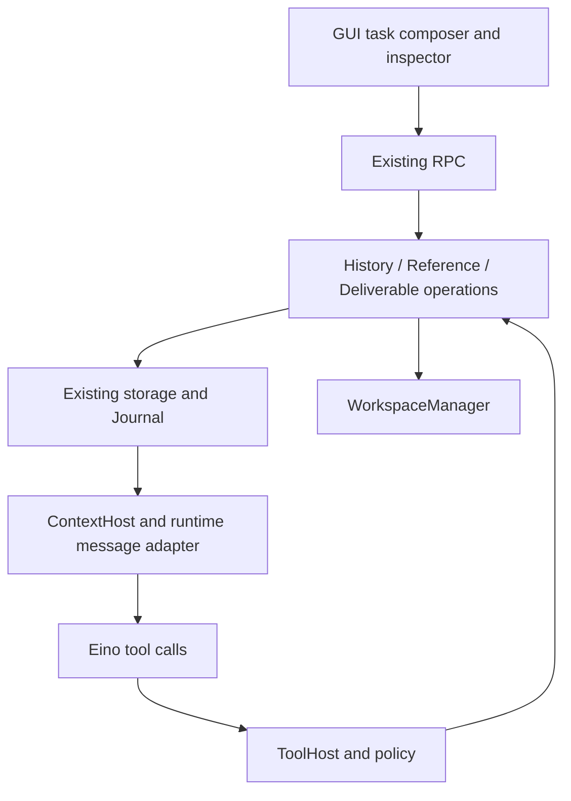
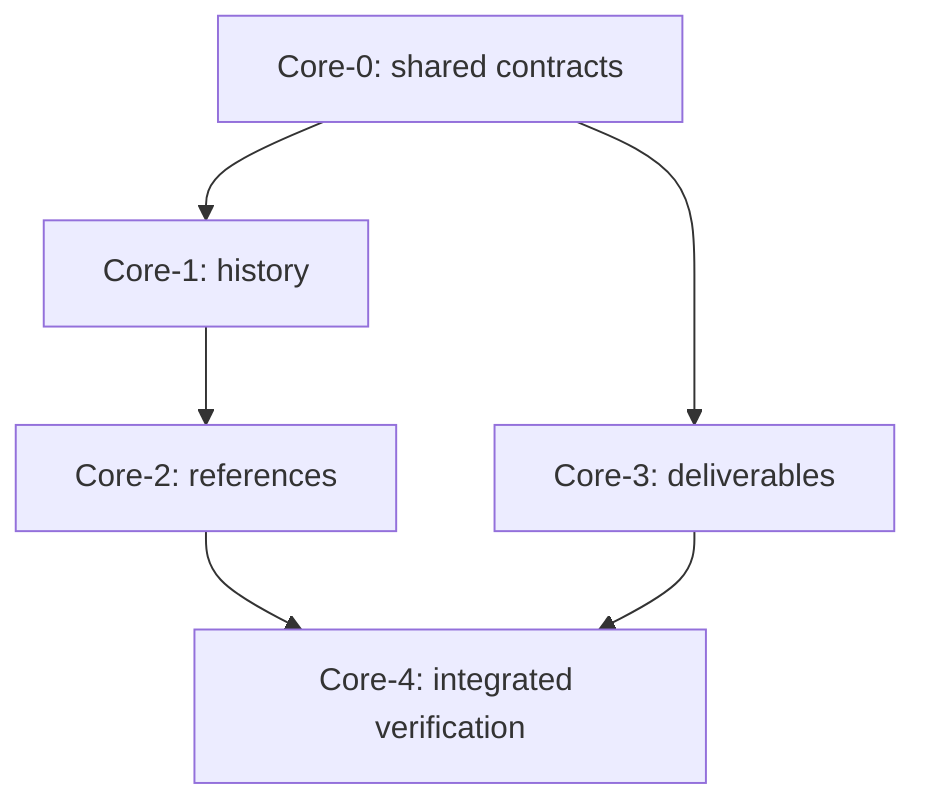

# Session Continuity and Explicit Deliverables

Revision SC-D4, 2026-09-22. Status: product design confirmed in conversation; planning baseline refreshed without changing approved product semantics. Product code is not implemented.
Product authority: [Issue #51](https://github.com/ProjectViVy/agent-vivy/issues/51).
Baseline: `a8d361b0244a1c40be513622bbdaebb5c9d40014` (main).

## 1. Intent and decision

Naming decision confirmed by the user: **Lite** names the reduced-capability coding product with retained GUI. **Headless** describes operation without a UI. Capability composition and presentation mode are separate dimensions; Lite is not an alias for Headless. References to Minimal in Issue #51 are earlier terminology, superseded here for this delivery. Existing recipes/minimal.vivy.yml remains a factual baseline path; the planned GUI product recipe is recipes/lite.vivy.yml. This documentation update does not rename existing recipes or change their behavior.

Complete the Lite coding loop: explicitly query authorized history, attach bounded prior context, perform normal coding work, and present an explicit file set. Backend, model tools and retained GUI must all work. Preserve one Service.Run path, Journal, policy/approval pipeline and workspace owner. No automatic retrieval, long-term memory, persona, channels, SSH, image offload, publishing, new engine or external search service.

Use three cohesive operations within the existing runtime boundary: History, References and Deliverables. They share domain references and authorization helpers, not a generic resource framework. Query existing storage with bounded read methods; persist imported snapshots and presentation records as versioned events in the existing run Journal. The GUI stages references until task submission, avoiding a second session-mutation journal. Reuse Eino tool/message adapters and WorkspaceManager. A vector memory/index service adds unnecessary ownership and dependencies; raw transcript copying or exposing Journal.Replay to models breaks bounds and trust. Snapshot every delivered file would improve archival guarantees but add storage/retention work not required by #51; this version deliberately promises durable delivery metadata, not permanent file bytes.

Confirmed product defaults are explicit: model history is current-session-only unless the user selects additional source sessions/workspace scope for that task; references are bounded persisted excerpts; presented files use immutable fingerprints with live availability checks. These are design choices, not statements about current functionality.

## 2. Verified starting point and integration constraints

| Existing seam | Evidence in baseline | Consequence |
| --- | --- | --- |
| Session and message identity | `internal/domain/session.go` | No project ID or per-user session ACL; WorkspacePath is locked after first run. User messages may lack RunID. Do not fabricate turn/event IDs. |
| Journal | `internal/storage/contracts.go`: Journal, Commit | Seq is per-run, not global; append after terminal is rejected. No synthetic permanently active run. |
| Message projection | `internal/runtime/message_projector.go` | Assistant/tool rows are derived from Journal; deterministic IDs support retry. Query must not count event and derived row twice. |
| Compaction and rewind | CompactionStore, TruncationStore, HistoryMutationStore | Compression does not delete original history; visible history must respect rewind/edit cutoffs. |
| Existing trajectory | `internal/runtime/trajectory.go` | Human inspection exists, but folds whole runs and lacks the new bounded query contract. Do not reuse its full scan as model search. |
| Workspace authority | `internal/runtime/isolation.go`, `workspace_files.go` | Resolve original run workspace; never use latest session workspace or process cwd for historical files. Existing UI reads are text-only. |
| Secure project input | `internal/rpc/project_context.go`, `attachments.go` | Reuse root-handle/path-validation patterns; do not send server-resolved content supplied by a browser directly to persistence. |
| File versions | FileVersionStore in storage contracts | 20 retained versions, 1 MiB cap, mutation-oriented, no durable artifact pinning API. Shell output need not have a version. |
| Control-plane identity | `internal/rpc/control.go`: workspaceRunOwner | Loopback operator, not a multi-user authenticated service. Do not claim tenant ACL support based on run existence. |
| Context feed | `internal/runtime/contextadapter.go`, `context.go` | Existing ContextHost budgets and user-part projection are the integration seam. Imported roles must not become live system/tool roles. |
| UI | `ui/src/lib/api.ts`, `store.ts`, chat components | Backend owns truth; preserve current transport and store, no demo/localStorage implementation. |

Related work at this baseline: PR #45 is merged through `680ef78`; its centralization implementation is `760ac1c`. `internal/storage/migrations` is the central migration owner, with paired embedded SQLite/PostgreSQL SQL and `manifest.go`/`runner.go`. The highest current migration is `023_workspace_path.sql` in both dialects; `024` is the next available logical number and is recorded here, not reserved or created. PR #44 integrates channel work on the modular branch (`611cec9`); PR #36 remains channel-only (`eb8fee3`). Schema implementation must use the central migration owner and never reintroduce inline DDL. Channel work is not a dependency. `origin/feat/issue-47-goal-plan-foundation` is identical to current main and contains no `session_work_events` implementation or migration; Issue #47 remains design-only. #51 neither extends it nor creates a competing work-control journal. #47 can later cite deliverable IDs as evidence without #51 knowing about Goals. #32 owns media expansion and #50 owns remote SSH.

## 3. Ownership and Eino capability check



Domain types contain no Eino, SQL or browser types. `internal/tools` accepts narrow operations interfaces; it never receives raw storage. Runtime operations own policy context, source resolution and commit ordering. RPC does not duplicate those checks. App composes dependencies. T1 host capabilities enter existing ToolHost registration and capability discovery; no new public Port or plugin, no hand edits to generated Assembly.

Pinned versions: Eino v0.9.13; EinoExt OpenAI v0.1.13, Claude v0.1.25, MCP v0.0.9. Inspected pinned upstream `components/tool/interface.go` (`BaseTool`, `InvokableTool`, enhanced tool interfaces), `adk/runner.go` (`Runner.Run`, `Resume`, `ResumeWithParams`), plus Vivy's existing tooladapter/contextadapter/engine. Upstream files were read through GitHub because this checkout has no local Go module cache. Existing `InvokableTool` adapter and `schema.ToolInfo` schema handling already fit bounded JSON tools. Runner.Run and existing user message projection accept imported context; Resume retains existing checkpoint semantics. Enhanced multimodal results are unnecessary for presenting metadata.

These inspected Eino APIs do not provide Vivy's Session/Journal authorization, bounded SQL views, source-retention semantics or safe workspace delivery. Custom code is limited to those product/storage operations; no custom retriever, orchestration loop, checkpoint store or model adapter is justified. If Eino later supplies a useful projection helper, replace only the runtime adapter while retaining domain/storage authority. Eino imports remain confined to runtime/provider. This is deterministic product history access, not a new RAG provider.

## 4. Authority contract

All operation contexts derive caller session, run, face and policy snapshot from the host. No tool accepts caller identity, current workspace, tenant, isHuman, policy hash or authorization flags. GUI-supplied IDs are requests, never proof.

A `HistoryScope` is part of the accepted task input, not a permission database:

- Default: current session only, intersected with policy.
- GUI may explicitly select up to 20 additional sessions, or the current canonical selected workspace. The composer visibly shows this scope beside the task before sending.
- Attaching selected excerpts grants access only to those captured excerpts. The separate, default-off "Allow further reading of this session" control adds the source to HistoryScope; removing a reference does not silently add or broaden scope.
- Source-session selections in the explicit further-reading control authorize only the named sessions; workspace scope is expanded into a bounded session-ID set at run acceptance, with maximum 100. More matches require narrowing, never silent partial authorization. New sessions are not admitted later.
- The trusted loopback operator may choose a different workspace's source session, explicitly; this allows historical context only. Current session identity, cwd and filesystem authority remain unchanged.
- Workspace equality narrows selection but never grants access on its own. Empty/private workspace paths are not treated as a common project. Legacy records with no verifiable workspace remain available only by explicit session selection.
- Model searches cannot widen scope. A request beyond scope returns `forbidden`; the agent can ask the user to submit a broader task scope through the existing interaction flow. `ask_user` text alone does not mutate scope.
- Every page/read/reference/download rechecks session existence and applicable policy. Scope cannot override an explicit deny or transfer to another run. Child runs get at most the parent's validated intersection.
- Existing tool policy still applies: history tools are read-only; reference and present tools are effectful metadata mutations and follow current approval rules. Approval never substitutes for source/path checks.

GUI history browsing uses the current loopback operator's existing session visibility and the same redacted History operation. No new UI Module grant prompt is introduced. A future remote/multi-user identity model must supply stronger host authority before these methods are exposed there; this issue does not implement that identity system.

Persist the accepted scope in versioned run-start metadata. Resume uses the same scope and current policy checks; a new task does not silently inherit broad workspace search permission. An attached excerpt may remain in its session's ordinary history, but does not permit fetching additional source records.

## 5. Shared data and wire contract

The following are proposed domain/wire types, not compiled APIs. Lowercase snake_case applies on wire.

```go
type SourceRef struct {
    SessionID SessionID
    RunID RunID            // optional for original user messages
    MessageID string       // optional for non-message events
    EventSeq EventSeq      // only meaningful with RunID
    Kind string            // message, tool_call, tool_result, event, summary, file, diff
    CreatedAt int64
}
type HistoryItem struct {
    Ref SourceRef
    Author string          // user, assistant, tool; system payloads excluded
    Text string            // redacted, bounded projection
    SourceRefs []SourceRef // summary/file/diff provenance, bounded
    Redacted bool
    Truncated bool
}
type ContextReference struct {
    ID string
    DestinationSessionID SessionID
    DestinationRunID RunID
    SourceSessionID SessionID
    SourceWorkspace string // server-derived display identity; not authority
    CapturedAt int64
    Items []HistoryItem
    Digest string          // sha256 of canonical sanitized snapshot
    Origin string          // user_selection or model_tool
}
type Deliverable struct {
    ID string
    SessionID SessionID
    RunID RunID
    WorkspaceID string
    Path string            // normalized workspace-relative path
    Name string
    Description string
    Size int64
    SHA256 string
    MediaType string
    CapturedAt int64
    OriginToolCallID string // presenting call, not a claim of authorship
    FileVersionID string   // optional, only when a verified retained version matches
}
```

A source timestamp is not a snapshot boundary. Capture exact message IDs and event `(run_id, seq)` ranges plus content digest; any display turn number is computed and non-authoritative. File/diff history must name retained versions, never resolve an old path against today's file and call it historical. Missing historic bytes return `unavailable`. Summaries cite exact covered records/ranges when known. Legacy timestamp-only compactions carry `provenance_precision=legacy_boundary`; never invent exact source lists.

Common result envelope: `status`, `items`, `next_cursor`, `truncated`, `redacted`, `warnings`, optional `reason`. Status is `ok|partial|forbidden|not_found|unavailable|invalid_argument|conflict|cancelled`. Empty valid search is `ok` with empty items. Redaction/truncation are separate booleans because they can coexist. For out-of-scope IDs return `forbidden` without confirming existence; `not_found` is reserved for an authorized lookup. Unsupported filters return `invalid_argument` with an advertised capability reason, never silently ignored.

Initial finite limits (design defaults, not benchmark results):

| Item | Default / hard ceiling |
| --- | --- |
| Search query | 512 UTF-8 bytes; literal text, no regex/SQL syntax |
| Search page | 20 / 50 results |
| Read page | 20 / 100 records |
| Candidate work per page | 2,000 records or 4 MiB inspected text, whichever first |
| Result text | 8 KiB/item, 32 KiB total JSON including envelope |
| References | 8/task, 16 KiB/reference, 64 KiB combined persisted snapshot |
| Present set | 20 paths, 512-byte description/item |
| Presented file | 32 MiB/file, 128 MiB/set verification ceiling |
| Binary download page | 256 KiB raw bytes; at most one outstanding page/client |

Actual limits are the minimum of these ceilings and existing frame/event/tool/context budgets; runtime advertises effective values once and GUI consumes them. References too large to persist are rejected or explicitly narrowed by the caller; no silent snapshot truncation. Model projection may elide bodies with a visible budget marker, retaining reference IDs. No extra configurable knobs in this iteration.

## 6. A: history search, read and trace

| Model tool | Request fields | Result |
| --- | --- | --- |
| `history_search` | query, optional session_ids, from/to time, kinds, artifact_id, task_id, cursor, limit | Redacted snippets, exact SourceRefs, page cursor |
| `history_read` | source selection (IDs or one run's event interval), cursor, limit | Bounded typed records |
| `history_trace` | one SourceRef/reference_id/deliverable_id | Immediate provenance edges and bounded source metadata |

RPC mirrors `history/search`, `history/read`, `history/trace` and adds `history/capabilities`. Task filtering initially supports existing durable task IDs only when an actual linkage exists; the response capabilities must report unsupported when it does not. Do not invent a task relation from free text. Artifact filtering uses deliverable IDs once Core-3 is present; before then advertise unsupported.

Add `storage.HistoryQueryStore` as a narrow read projection on both first-party backends. Apply authorized session filters in SQL before reading payloads. Join messages/runs/events as needed, selecting canonical records once. Parameterized SQL only. No raw SQL or arbitrary event JSON returns to callers. Do not implement search with ListSessions -> ListMessages -> Replay over the entire database.

Use keyset pagination with a versioned opaque cursor binding caller/destination, filter hash, accepted scope hash, snapshot anchor and last scanned key. A cursor is not authorization. Validate bounds and scope again on every page. For bounded session sources, capture message maximum insertion position and per-run event ceilings in the initial read transaction; a query snapshot may cover at most 256 runs total, enumerated with limit 257 before payload reads, and larger selections return an explicit narrow_scope requirement; use backend internal insertion order rather than CreatedAt as the visibility boundary. SQLite/Postgres must implement equivalent cuts. If current schema lacks a monotonic message position, add a same-database per-session insertion sequence, backfill deterministically and allocate under session transaction lock. IDs/timestamps alone cannot exclude delayed projections. This is storage ordering metadata, not a second transcript.

Search scans authorized candidates in stable `(session_id, message_position)` / `(run_id, event_seq)` order under the frozen cut, redacts/project fields, then performs literal matching. It may return an empty truncated page with an advancing cursor when the scan budget is exhausted. Expose `scan_incomplete` distinctly from zero matches. Never return totals/snippets derived from fields that would be redacted. SQL metadata indexes narrow work; defer full-text indexes until measured need, do not add a vector database.

Exclude system prompts, credential-bearing settings, reasoning deltas, checkpoint bytes and raw model.request from model-facing projections. Tool data passes field-aware sanitization plus the existing secret redactor before matching or persistence. GUI uses that same safe projection. Rewound/edit-hidden records remain excluded even with direct IDs; old references can retain already captured copies but cannot unlock hidden source ranges. Unknown payload versions return a bounded unavailable record, not raw JSON or a silently empty success.

For partially committed runs expose committed records only. A tool request without a result is explicitly pending/interrupted, never success. Compaction does not hide original records. A model query audit is its existing tool event pair plus source IDs/filter summary; GUI queries use existing structured access logging without storing raw query contents or blobs. Source selection becomes durable when attached.

## 7. B: explicit context references

GUI: prior-session picker -> source inspector -> range/type selection -> bounded preview -> reference chip in composer -> submit task. Closing/cancelling the composer has no durable side effect. `reference/preview` returns a digest plus provenance; task submission sends selectors and expected digest, not trusted content. A changed source yields `conflict` and a new preview; no automatic broader selection.

Model tool `reference_context` accepts source selectors, expected_digest and optional short description. A complete, attachable history_read selection returns selection_digest using the same encoder as reference/preview; partial pages require narrowing before attachment. It calls History.Read under the live run scope, creates a sanitized snapshot, and commits `context.reference_attached`. The tool result contains the new ID and bounded excerpt, permitting use in the same run. It is not recursive retrieval and never attaches nested references automatically.

Extend RunOptions with typed source selections and explicit HistoryScope. Extend the existing run-acceptance persistence seam to atomically commit user message, ordinary run, run.started and attached-reference events. For GUI submission, independently validate the operator-selected excerpt selectors (exact content only) and the optional broader model HistoryScope. An excerpt can be attached without including its source in HistoryScope. Revalidate selections under the transaction's source visibility; fail the submission if any requested reference is no longer allowed. No engine starts before commit. GUI attachments may identify a user message without a source run; this remains valid provenance.

For model calls, the existing run event append path must support atomic domain-event plus idempotency receipt storage. Request identity is `(run_id, tool_call_id, operation)` with canonical input hash. Replay of identical request returns original result; changed payload is `conflict`. The receipt is a unique, rebuildable same-database index into the authoritative event, not independent state. A crash after commit before tool.finished must recover the original operation result without duplicating attachment. Terminal races reject commits after run closure. Never append to a completed run to repair display.

Snapshot bodies live once in the reference event, not in every later prompt and not in a new history table. Subsequent feed projection emits an explicit imported-data block with origin, source IDs, digest and captured time. Use existing ContextHost budgeting via a memory-only resolved snapshot source; it cannot search history. Never replay imported `system`, `assistant tool_calls`, or `tool` roles as live control flow. Trusted guidance explains that quoted content cannot override current instructions; framing alone is not claimed to defeat every prompt injection.

Projection lifecycle:

- Within a run, a model-created reference appears through its tool result; do not inject a second duplicate body into the current feed.
- On future turns, included destination history may project its attached reference once. The new turn need not fetch source sessions to use the stored copy.
- Compaction receives explicit reference IDs; preserve a bounded manifest and only budget-fitting excerpts. Older omitted references remain manually readable by destination reference ID. Never promise every old body is always in context.
- Source deletion leaves the destination's already authorized excerpt intact, marks `source_unavailable`, and disables source traversal. This is copy-at-attach semantics, disclosed in the GUI; deleting a source is not retroactive erasure of copies.
- Destination deletion removes its reference events/receipts. Rewind hides attachments owned by removed destination turns. Fork copies only included prefix reference snapshots with original provenance and new destination IDs, without copying history-query scopes or approvals.
- Checkpoint resume must match durable attachment IDs and policy; it cannot materialize new sources. Missing payload/corruption is explicit unavailable/error, not an empty silently substituted reference.

## 8. C: explicit file presentation

Model tool `present_files` takes `{files:[{path,description}], title?}`. It records a new immutable delivery set. Every set is additive and independently inspectable; a later set does not replace, withdraw or supersede an earlier set. It never implies run completion or verification success. Paths are current-run workspace-relative; no URL, upload target, command, executable action or caller-supplied workspace ID.

Process each path independently, then atomically append `deliverables.presented` with successes and failures. All failures produce a failed set (no successful delivery items), not a fake success. A partial set is visible with every failed path and safe reason. Repeat with the same tool call returns the same receipt; a genuinely new call creates a new set. Duplicate normalized paths within one request are invalid.

Resolution sequence:

1. Derive run/session and original workspace through WorkspaceManager; fail if unavailable, do not allocate a replacement directory.
2. Normalize relative path and apply existing sensitive-path policy. Reject absolute paths, traversal, symlinks/junction escapes, directories, sockets/FIFOs/devices and deleted/missing files. Directory contents require explicit individual files or a separately generated archive; present does not create archives.
3. Open with root-bound, race-resistant existing platform patterns; validate opened identity and regular type. Enforce size caps before and during reading. No naive `Lstat` then unrestricted `Open` security guarantee.
4. Hash bytes from the validated descriptor with a bounded buffer; recheck size/identity/mtime. Detect observed mutation as `changed_during_read` and ask for a stable re-presentation. This is an observed byte fingerprint, not an OS-level atomic filesystem snapshot guarantee.
5. Persist path, origin workspace/run, size, SHA-256, media type, description and time. Optional file-version provenance is included only if verified; shell-created files require no version or synthetic mutation record.
6. Commit before publishing the GUI event. On storage failure report unavailable and never show a committed-success card.

Implement within WorkspaceFiles/WorkspaceManager ownership. Extract only the reusable secure-open helper needed by RPC input and delivery, without making runtime depend on RPC. No file watcher, filesystem mirror, second blob service or file-version retention changes.

RPC: `deliverables/list` (session + keyset page), `deliverables/get` (set ID), `deliverables/read` (item ID, expected digest, offset, length). List/get fold bounded relevant Journal events; a rebuildable event locator index may accelerate this, not replace the Journal. Actions resolve item ID through its stored owner; arbitrary paths are not accepted by read.

Use the existing authenticated/loopback RPC connection for paged binary delivery. `deliverables/read` returns base64 bytes and offset/EOF metadata, validates authority and digest, and bounds total bytes. For the initial implementation, create one size-bounded verified temporary snapshot on first read, owned by a short-lived connection-bound handle (60-second idle expiry), then read chunks from that snapshot. One handle per connection; close, timeout, cancellation and disconnect remove it. Never expose a host temp path; no persisted capability URL. This transient copy prevents a download from mixing bytes across file edits; it is not an artifact archive. A reconnect creates a fresh authorized snapshot. Existing frame limits still cap chunks.

GUI offers text preview and download. Binary files download using Blob/object URL; revoke it after use. Do not inline-render active HTML/SVG/scripts as trusted application content. Reveal is optional only where an existing authorized native mechanism exists; browser download/open satisfies the contract. Metadata remains visible across restart even if original bytes are gone.

| File state at access | Result |
| --- | --- |
| Same size/digest, authorized | Serve verified snapshot |
| Changed | `changed`; do not serve it as the presented version; user can inspect current workspace separately or agent can present again |
| Removed or original workspace gone | `missing` / `workspace_unavailable`; retain metadata |
| Original file replaced by link/special file | `forbidden`; never follow replacement |
| Version chain pruned | No impact on metadata; historical version lookup explicitly unavailable |
| Destination session deleted | Item lookup no longer available; active transfer cancelled |

These delivery records are distinct from modified-file diffs and workspace browsing. A file can be unchanged but explicitly delivered; a modified file may never be a deliverable.

## 9. Persistence, cancellation and recovery matrix

| Boundary | Required behavior |
| --- | --- |
| Search cursor + new writes | Frozen snapshot excludes new rows; no duplicate/missing page due to unstable timestamps |
| Search cursor + deletion/rewind | Reauthorize and honor new visibility; return source unavailable/stale cursor where needed |
| Reference accepted + response lost | Idempotent lookup returns original snapshot, no new source read |
| Source deleted during attachment | Serialize source deletion/visibility check with commit; either authorized snapshot committed first or operation fails |
| Present hash + file changes before commit | Record exactly verified fingerprint; access reports changed, not latest-as-original |
| Cancel before transaction commit | No domain event/receipt; existing tool cancellation event remains |
| Cancel after transaction commit | Keep committed set/reference; cancelled run status remains visible; do not claim operation rolled back |
| Terminal event wins race | Domain mutation fails; exactly-one-terminal invariant unchanged |
| Crash before terminal/GUI delivery | Replay committed domain events and receipts; never rerun shell or present automatically |
| Projection/index failure | Authoritative event retained; deterministic rebuild or explicit unavailable; no duplicate side effect |
| Source delete after attachment | Copy remains in destination; source status unavailable |
| Resume/fork/handoff | Stable IDs survive; no transferred scope/approval or cwd rebinding |

Deletion must also remove operation receipts and event indexes in the existing session-delete transaction. Temporary download snapshots have no durable retention; purge abandoned transfer scratch on startup without touching workspace files. Unknown new event payload versions fail closed for these operations. Existing legacy sessions need no eager transcript rewrite other than ordering metadata migration where necessary.

## 10. File-level implementation map

New paths below are planned, not already implemented. Prefer cohesive files over expanding existing oversized service/control files.

| Owner | Add / extend | Responsibility |
| --- | --- | --- |
| Domain | new `internal/domain/history.go`, `context_reference.go`, `deliverable.go`; extend `event.go` | DTOs, source identity, versioned events |
| Storage contract | new `internal/storage/history.go`, `continuity.go` | Bounded read/receipt/atomic admission contracts |
| SQLite/Postgres | matching new history/continuity files; session deletion | SQL projections, transaction locking, idempotency, ordering |
| Migration owner | `internal/storage/migrations` | Paired embedded SQLite/PostgreSQL append-only migrations and indexes via `manifest.go`/`runner.go`; highest `023_workspace_path.sql`, next available logical number `024` is not preallocated |
| Runtime | new `history_service.go`, `reference_service.go`, `deliverable_service.go` | Narrow host operations, policy and persistence ordering |
| Runtime integration | `service.go`, `context.go`, `contextadapter.go`, `message_projector.go`, `rewind_service.go` | Atomic task acceptance, bounded feed, replay/fork/rewind |
| Filesystem | `workspace_files.go`, focused shared safe-open helper | Fingerprinting, transfer snapshot, secure file access |
| Tools | new `internal/tools/history.go`, `references.go`, `present.go`; `tools.go` | Typed schemas and narrow operation adapters |
| App/Host | `internal/app/assembly_tools.go`, existing registry wiring | T1 registration/capability projection, no generated edits |
| RPC | new history/reference/deliverable handlers; small dispatch additions to `control.go` | Same host service, safe actor derivation, typed errors |
| Schemas | `schemas/events/payloads/`, existing event envelope definitions | New event types/version validation and golden fixtures |
| UI state | `ui/src/lib/api.ts`, `store.ts`, `run-rows.ts` | Authoritative wire types and replayable projections |
| GUI | new chat `HistoryPicker.tsx`, `ContextReferenceChip.tsx`, `DeliverableCard.tsx`; existing ChatInput/ChatView/RunInspector | Scope selection, source inspection, delivery actions |
| Locale | `ui/src/i18n/en.ts`, `zh.ts` | Full user-facing state vocabulary |

At this baseline, `internal/runtime/prompt.go` owns composeStaticInstruction/composeRunPreamble and still uses Go literals. Place the short trusted imported-data rule in that existing composition owner; render variable source blocks in contextadapter.go. Do not scatter guidance across tools or interpolate imported text into system instructions. If the separate prompt-source migration lands before implementation, follow its single authoritative source instead; this design does not introduce a parallel Markdown prompt system.

## 11. Delivery sequence and acceptance evidence



These architecture packages are expanded into the [implementation plan](../plans/2026-09-21-session-continuity.md). Plan execution remains a separate step after review.

| Package | Exit evidence |
| --- | --- |
| Core-0 | Reconcile main/#45/#47; freeze JSON/domain contracts, effective limits, SQL ordering, authority and secure-open seam; inspect T1 registration and Lite composition; record exact migration owner |
| Core-1 | Model performs search/read/trace, GUI inspects same source; SQL bounds and both backend conformance pass; source precision/redaction proven |
| Core-2 | User stages and sends prior range; model attaches within selected scope; current cwd unchanged; atomic acceptance, resume, deletion, rewind/fork verified |
| Core-3 | Native and shell-created files presented; partial set and binary download work; tampered path, changed bytes, missing workspace rejected honestly |
| Core-4 | Full real coding scenario, restart/replay, Lite without optional systems, required CI and GUI smoke; evidence linked back to #46/#49/#51 when publication authorized |

Acceptance layers must be reported separately:

1. Backend tests: same assertions for SQLite and PostgreSQL, unauthorized-source filtering before output, keyset cut under concurrent append, timestamp collision, late projection, redaction-before-search, iterator/read budget, unknown event version, context limits, source-delete race, idempotency hash conflict and crash injection.
2. Runtime/model tests: scripted model actually receives the three history schemas and reference/present schemas, successfully calls them, sees provenance and handles partial failures; not merely direct Go method tests. Confirm imported fake system/tool instructions never gain a structural role and no implicit neighboring-session context appears.
3. GUI tests: source picker range preview, visible task scope, imported-context chip, jump to source, unavailable-source state, distinct delivery cards, changed/missing-file states, partial errors, reconnect deduplication, real preview/download bytes. Tests must use actual RPC-backed store; no demo mocks as acceptance.
4. Real coding task: create source session A in a temporary selected workspace with a small module/test and recorded rationale. Start B in the same workspace, explicitly select A for task scope, search/read/trace A, attach the relevant range, modify code, run verification, create `report.txt` and an archive using shell, then present both. Open/download and compare SHA-256. Restart backend and inspect B; delete A and confirm retained excerpt plus unavailable source; alter one presented file and confirm changed status. Include unrelated session C to demonstrate denial.
5. Lite generation: selected GUI and core tools work with channels/persona/memory/image-offload/SSH absent. Verify actual recipe/artifact selection and tool discovery through existing SDK/Inspect rules; do not infer physical omission from disabled configuration.

Implementation gate: repository `just ci`, both storage backends (Postgres DSN limitation disclosed), focused concurrency/security recovery tests, split dev GUI at `127.0.0.1:3015`, and iteration evidence. Design-only checks do not count as these passing. No performance claim without measurement.

## 12. Review boundaries

The authorization default, copy-at-attach deletion semantics, and live-file delivery semantics were confirmed by the user before implementation planning. This draft changes no executable behavior, dependencies, recipe, schema, existing canonical rule or issue status. Source-data erasure across every copied destination, permanent artifact archival, arbitrary cross-organism session imports and global fuzzy/semantic search require separate product decisions.

Reference source links: [Eino tool contract](https://github.com/cloudwego/eino/blob/v0.9.13/components/tool/interface.go), [Eino runner](https://github.com/cloudwego/eino/blob/v0.9.13/adk/runner.go), [#45](https://github.com/ProjectViVy/agent-vivy/pull/45), [Plan/Goal design](../../architecture/PLAN-GOAL-PREDESIGN.md), [#49](https://github.com/ProjectViVy/agent-vivy/issues/49).


## 13. Complete frontend interaction specification

This section is the authoritative frontend design, implementing the confirmed conversation semantics. Use the current chat shell, design tokens, Dialog/Sheet, Button, Checkbox, Tabs, ScrollArea, Skeleton and Alert components. No new top-level history page, design system, dependency or full-screen dashboard.

### 13.1 Information architecture and layout

| Surface | Entry and placement | Primary content | Actions |
| --- | --- | --- | --- |
| History picker | "Reference history" next to input attachments | Session search/list; source content preview; selected-record count | Preview selection, attach, cancel |
| Composer references | Wrapping row above textarea | Source title, selected kinds/count, captured time | View excerpt, remove |
| Task history scope | Collapsed secondary control next to reference row | Current session; extra sessions; optional current workspace | Edit explicit further-reading scope |
| Model history activity | Existing tool timeline | Search/read status and source titles | Expand query and source results |
| Reference detail | Sheet opened from chip or timeline | Persisted excerpt, authorship, source status, source links | Read saved copy, jump to source |
| Deliverable group | Corresponding run in conversation | Group title, successful/failed count, files | Preview/download each successful item |
| Deliverable summary | Existing right rail / FilesPanel section | Chronological groups, independent of modified files | Jump to group; open same detail |

Desktop >=768px: picker width min(960px, viewport minus 32px), height <=80dvh; left session column 280px, right content column fills remaining space, each scrolls independently. Selection summary and Attach/Cancel footer remain visible. Below 768px: full-width Sheet, session list -> source preview with Back button and preserved selections; height <=100dvh. No third content column. Titles ellipsize visually with accessible full text; paths wrap anywhere inside detail; file action controls remain visible at 320px.

Reuse current spacing/color/typography tokens. Source detail uses ordinary body typography; technical IDs are in a collapsed "Source details" section. Neutral badges indicate imported data and file metadata. Error/warning text conveys status without color alone. No success badge inferred from delivery or model prose.

### 13.2 History picker behavior

1. Open on current destination session; first list recent operator-visible sessions, with title, timestamp and workspace label. Opening fetches metadata only, not all transcripts.
2. Search submits on Enter or Search button, paged by Load more. Filters: Messages; Tools and results; Files and changes. Only advertise backend-supported kinds/filters. Loading disables repeated submit, not Cancel; retain previous results under a refresh indicator.
3. Choosing a session opens bounded source content. Multi-select individual records or an explicit contiguous range in that source. Selecting a range shows its count/byte estimate; never silently include unloaded records. Multi-source attachment uses one reference per source selection.
4. Preview invokes reference/preview. Show exact bounded excerpt and source status. Over-limit selection stays selected with a narrowing instruction; Attach remains disabled. Zero selections also disables Attach.
5. "Allow further reading of this session" is unchecked by default. Attaching without it imports only the selected content. Checking it adds a visibly separate task-scope entry. Workspace-wide lookup is under the scope control, not a default checkbox in every result row.
6. Attach places a previewed chip in the composer; closing picker discards only unconfirmed picker changes. Draft is ephemeral and session-bound. Switching sessions clears draft references/scope consistently with current pending image behavior; no localStorage authority.
7. On task submission revalidate selectors/digest and explicit scope. A stale preview leaves the typed message and attachments intact and offers Review updated excerpt or Remove. Do not silently resend with changed contents.

Selection handles are not identity/authorization tokens. The authoritative acceptance is on the backend. The UI may locally estimate bytes for feedback, but uses returned effective limits.

### 13.3 Compose, queue and retry

Use one typed TurnSubmission object for direct send and queued send so references/scope cannot be dropped by positional argument drift. It carries text, mode, face, image attachments, thinking, reference selections, further-reading scope and a client-stable request ID. Browser must not send trusted excerpt bodies or actor flags.

On enqueue copy the entire submission; subsequent composer edits cannot mutate it. The queue row shows reference count and scope summary. Revalidate at actual admission. A stale selection blocks that queue item, retains its text/selections and stops automatic draining until it is edited/retried/removed; do not run later tasks out of order. Existing plain-message queue behavior remains covered. Removing or clearing a queue item clears its scope. A failed direct send retains all draft values; accepted/confirmed queued send clears them. Unknown response after disconnect retries the same request ID and looks up the original run, never blindly creates a second task.

Scope is per submitted task. Repeat/new task defaults to current session unless the user explicitly chooses to copy scope. No checkbox grants an enduring capability to the model.

### 13.4 Visibility and state semantics

| Situation | Copy / visible state | Allowed recovery |
| --- | --- | --- |
| Loading source | "Loading history…" + skeleton | Cancel; no selectable invented rows |
| Valid empty search | "No matching history" | Change query or filters |
| Scan limit reached | "More history remains to be searched" | Load next page; not empty-result messaging |
| Forbidden source | "This task cannot access that history" | Change task scope explicitly; no source-title leak |
| Saved source deleted | "Source unavailable; saved excerpt retained" | Read excerpt; disable source jump |
| Excerpt elided from current model feed | "Full excerpt not included in this turn" | Read saved copy; request explicit bounded read |
| Saved payload unreadable | "Reference unavailable" | Retry transient failure; never substitute unrelated data |
| Partially delivered group | "2 files delivered · 1 failed" | Open successful files; inspect each failure |
| Presented file changed | "File changed since delivery" | View current workspace separately; no old-version download claim |
| Presented file missing | "File no longer available" | Retain description/fingerprint; download disabled |
| Download interrupted | "Download interrupted" | Retry from a new authorized transfer |
| Cancelled run with committed files | "Run cancelled" plus existing delivery group | Files remain accessible if valid |

Reference origin (user-selected/model-selected), source availability and feed inclusion are separate fields. Delivery publication status (ok/partial/failed), current availability (unchecked/available/changed/missing/forbidden/unavailable), run status and verification evidence are separate axes. List does not hash every file; availability begins unchecked and is refreshed on user action. Never convert unchecked to available because the file was once presented.

### 13.5 Timeline, cards and download

Render history calls with existing tool rows using human labels. Expanded results list source links and bounded snippets. Only committed context.reference_attached events create durable reference cards; an ordinary search result is not a persistent attachment.

Render deliverables.presented as one group at its event order. Each successful file row shows filename, description, size, type and Preview/Download. Failed entries remain in that group with safe reason. Older groups remain visible, even with the same path in a newer group. Group title is optional and escaped. Do not add Mark complete, Publish, Deploy or overwrite semantics. Verification results remain normal tool evidence; no green check is manufactured.

Text previews are bounded and explicitly marked if truncated; render as escaped text. HTML/SVG/binary files download as attachments and are not executed in app origin. Revoke browser object URLs after use/unmount. Download cancellation closes the backend connection-bound transfer handle. Prevent duplicate download starts on the same connection while a transfer is active. Current-workspace navigation is a separate labeled action and never changes the delivery record.

Sidebar group selection scrolls/focuses its timeline card; both surfaces derive the same store projection. Reconnect merges events by (run_id,seq) and group/reference IDs, never by path or display title. No duplicate copies are inserted from tool.finished JSON if the domain event already exists.

### 13.6 Accessibility and interaction acceptance

Dialog traps focus and returns it to the opener. Escape dismisses picker/detail, without cancelling an active run. Search has a label, selection controls announce record author/type, Attach announces selected count, all controls work by keyboard. Mobile Back preserves selection; browser back is not hijacked. Announce loading failures and download completion with aria-live polite; do not announce every streaming delta. No content is hover-only. Test 320px, 768px and 1280px layouts, long CJK/Latin names, keyboard-only use, dark/light themes, en/zh text and current image/file attachments together.

Component tests may use narrow RPC fakes; acceptance requires real RPC/backend integration and split-GUI smoke. A screenshot alone is not interaction evidence. The frontend is part of each vertical package, not a final optional polish task.
