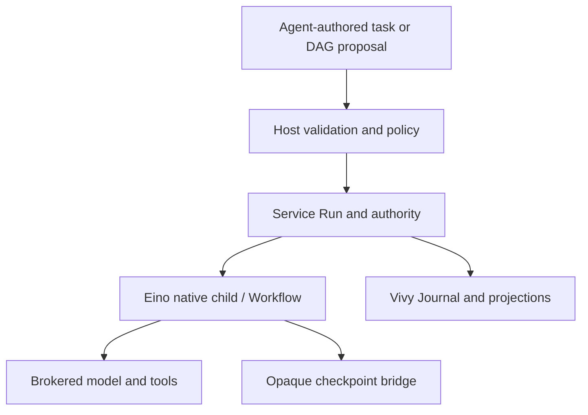

# Issue 39: Eino-native child and bounded workflow design

> Status: approved contract freeze, implementation remains gated. ORCH-01 is the only execution-ready Story; its G0 proof is not yet passed. Baseline for this freeze: agent-vivy `a836c4088953dd6f8997cfe0fba4c479bc4908fb`, Eino v0.9.13 `c5e6aef927cca02bea934541f8dff2ea711b2ca7`. Decision record: [Issue #39](https://github.com/ProjectViVy/agent-vivy/issues/39#issuecomment-5798636327). Execution package and sole Story-state DAG: [index](../plans/issue39-eino-orchestration/index.md).

## Outcome and boundaries

An agent can delegate a bounded task to a governed child, inspect and interrupt it, continue its task-scoped conversation when authorized, and compose children into a validated acyclic dependency workflow. Vivy's existing Service remains the sole Run and model admission path; Journal is the product evidence; policy, Host and budget broker all model and tool effects. Eino compiles and executes the workflow and owns its opaque execution checkpoint. The design introduces no alternate agent engine, model loop, graph scheduler, external CLI delegation, or independent personality store.

**Durable direct parent-child messaging is required.** Route messages to the stable ChildSession, never an ephemeral activation Run. Persist each admitted message with a stable message ID, sender-scoped idempotency key, recipient mailbox sequence, payload digest and lifecycle state before acknowledging admission. Identical retries return the same message ID; a reused key with different content conflicts. Acknowledgement means durable admission, not recipient completion or reply. Messages are consumed in mailbox order at a verified Service/Eino safe point, with durable pending/consumed/rejected/expired resolution and cursor/receipt; retry and restart may redeliver, so semantics are at-least-once. Consumers and tools must be safe against duplicate delivery, and no exactly-once model/tool effect is claimed. Replies are separate addressed messages. Follow-up starts a new activation Run and is distinct from delivery to an active child. Peer and swarm messages remain unauthorized and deferred.

This contract freeze is not a green light to ship. Every implementation still requires its stated gates, including G0/G1. Context sharing/fork, named-mask inheritance, swarm collaboration and peer traffic, external delegation, and optional workflow product #40 remain outside scope. The approved child context is clean: explicit task, admitted direct messages, and explicitly approved dependency outputs only. No transcript, hidden history, personality or implicit context is copied.

## Verified baseline and comparator

| Area | Current source / observation | Architectural consequence |
| --- | --- | --- |
| Child execution | `internal/app/worker.go` starts a child Run in the parent's Session, supervises `internal/worker`'s handwritten model/tool loop; live handles enable `WaitChild`; existing depth 4, concurrent children per parent 4, turns 8. | Preserve admission limits, migrate execution through Service and Eino; a stable child conversation requires a new durable session boundary and migration strategy. |
| Existing surfaces | `internal/rpc/control.go` implements `child/start,get,list,wait,cancel`; `ui/src/components/chat/RunInspector.tsx` presents these controls. | Extend the contracts compatibly; do not create a separate child API/UI state source. |
| Vivy evidence | `internal/runtime/service.go`, `internal/storage/contracts.go`, Journal, SnapshotStore, BlobStore and LeaseStore; `internal/runtime/checkpoint.go` verifies version, checksum and prompt binding. | Reuse stores, Run transitions, existing approval and deletion fences; fail closed on checkpoint mismatch. |
| Eino 0.9.13 | Pinned local source: `compose.Workflow.Compile(ctx, ...GraphCompileOption)`, `Workflow.End()`, `WorkflowNode.AddInput`, `WorkflowNode.AddDependency`; Workflow uses `AllPredecessor` and forbids cycles. `AddEnd` is deprecated. `WithMaxRunSteps` is a Graph compile option but is unsupported for DAG/Workflow mode. Current production engine uses ADK agent runner; `internal/runtime/graph_conformance_test.go` is not proof of child/approval/graph integration. | Host validates finite node count, depth, width and output limits. Workflow dependencies govern execution; selected outputs must flow through explicit mappings to a consumed node or Workflow.End. G0 remains required. |
| Reference products | DeepSeek Harness demonstrates bounded direct parent-child control and conversation distinction; ZCode illustrates workflow product affordances; Codex interaction design and OpenFang origin provide comparisons. | DSH is the primary **behavioral** comparator; none supplies Vivy's authority or persistence implementation. |

Pinned comparison clones (read-only research): deepseek-harness `46a7f68`, ZCode `328c1a0`, minimax-code `a914a30`, codex `cb1eea3`, OpenHarness `9b2efd7`, oh-my-pi `73a11421fe34fbab8ad058ab9c1a2e4f447852ea`, openfang `acf2587e46be174c10200489c9a2d23a39a98aeb`, agent-diva `0fd005a105d8987df02ae7b796a3c591e04b9ca3`. These are snapshot identifiers, not equivalent capability claims.

For mailbox compatibility, the [pinned DeepSeek Harness control reference](https://github.com/deepseek-ai/deepseek-harness/blob/ddefc45fbc7f8e46dd73185e68295696d1297887/packages/subagent/tool-subagent-control/README.md) is a useful behavior comparator: `send_message` targets the direct parent/child relationship, accepts into a FIFO inbox and returns a stable message ID; a resident target sees mail at a step boundary and an inactive continuable target can resume. Its `interrupt_agent` stops the current turn while leaving inbox and descendants intact. This does not imply sibling messaging, general peer messaging, or a Vivy implementation contract; Vivy's Host must own authorization and persistence.

## Ownership and execution topology



| Fact | Authoritative owner | Rule |
| --- | --- | --- |
| Authorization, budgets, tool selection, workspace | Original parent Run's immutable authority ceiling, current authorizer Run, policy and Service | Origin lineage is immutable. A new active Run in the same original parent Session may reauthorize continuation after the origin parent Run terminates. Effective authority is current authorization intersected with the original ceiling, on every activation/resume. Deleting the parent Session fences continuation. Child tool selection may narrow, never widen, the immutable ceiling. A mask cannot grant tools or alter policy. |
| Run state, approval outcome, graph/node status, UI evidence | Vivy Run/Journal; durable projection derived from Journal | All public transitions and results have stable IDs and journal sequence. A terminal Run receives no later append. UI only reads the host. |
| Execution continuation | Eino-native runner/Workflow checkpoint bytes through `VersionedCheckpointStore` and `BlobStore` | Separate checkpoint keys per graph Run/child activation; verify engine, prompt identity and checksum. The checkpoint is not a competing product event log. |
| Task-scoped conversation | Durable ChildSession and its Messages; multiple activation Runs | No independent identity or evolution and no implicit parent/shared transcript. Immutable origin parent Run and Session lineage; current authorizer Run is recorded separately. |
| Workflow revision and input mapping | Immutable host-validated workflow descriptor and digest; Run/Journal maps descriptor nodes to execution IDs | Compile same descriptor on recovery; no dynamic mutation of a running revision. Result handoff is explicit, bounded and recorded. |
| Direct mailbox | Host-owned inbox addressed by stable ChildSessionID; durable admitted envelope and cursor/receipt | Only direct parent-child messages are authorized. Stable message ID and sender operation key make admission idempotent; mailbox order survives restart. Delivery/consumption is at-least-once, never exactly-once effects. Eino input is never mutated behind a running invocation; consume only at a proven safe point. |

### Proposed domain and host seams (not yet existing APIs)

The first implementation gate must confirm the narrowest existing Service extension. Signatures below specify contracts, not an instruction to add every type before it is used.

```go
// Internal host-owned records; no Eino type escapes internal/runtime.
type ChildSessionBinding struct {
    SessionID domain.SessionID       // durable task conversation
    OriginParentRunID domain.RunID    // immutable lineage
    LastRunID domain.RunID            // latest activation, not identity
    AuthorityDigest string           // versioned parent-derived envelope
}
type WorkflowRevision struct {
    ID string; Digest string; ParentRunID domain.RunID
    Nodes []TaskNode; Edges []Dependency
}
type TaskNode struct { Key string; Task string; MaskHint string }
type Dependency struct { From string; To string; OutputKey string }
// Contract sketch only; final wire names follow existing domain conventions.
type ChildMessageEnvelope struct {
    ID string; TargetSessionID domain.SessionID
    SenderPrincipal string; OperationID string; Sequence uint64
    Body string
}
```

The child control interface keeps existing `child/start,get,list,wait,cancel` behavior for existing callers, adding explicit `child/followup` and `child/interrupt` only after the new admission path is proven. `followup(child_session_id, operation_id, text)` creates a fresh activation Run in the same ChildSession and never revives a terminal Run. It is a later activation, not in-flight mailbox delivery. `interrupt(run_id)` interrupts the active activation while preserving its ChildSession; terminal Run interruption is idempotent. Existing `child/cancel` stays compatible and is not an alias for interrupt or Session close. `wait` reads terminal durable status after restart and honors caller cancellation. Admission operation ID is mandatory for retry-safe creation; preserve old requests through server compatibility until consumers migrate. This API does not replace the required durable direct parent-child mailbox; ORCH-04 implements the message path under D8.

Host derives sender identity from the live authorizer and verifies direct parent-child relationship; caller-supplied identity is untrusted. A recipient mailbox sequence defines stable order. Persist admission, receipt and cursor through Journal/host storage, not only process memory. Retry after interruption or restart may redeliver a message until durable consumption is recorded. This is at-least-once delivery, not exactly-once execution or effect. At the verified Service/Eino safe point, consume only admitted messages and record the durable receipt/cursor. Never mutate an active invocation's input or history behind the runner.

Successful send acknowledges durable admission with a stable ID and does not wait for or return a reply. A reply is a separate addressed message. Interrupt stops the activation but preserves ChildSession and admitted pending messages. A later message can activate a continuable idle child only after current authority is revalidated. Caller cancellation after durable admission does not retract the message; retry with the same key returns its ID.

ORCH-04 implements and tests sender/recipient authorization, ordering under concurrent senders, lifecycle states, retry/duplicate outcomes, expiry/retention/redaction, backpressure, interruption and Session deletion/closure, and host-derived UI projection. This does not imply peer-to-peer child messaging or shared state.

### Child lifecycle and management controls

ChildSession lifecycle and activation Run lifecycle are separate. **Interrupt** stops the activation at a supported boundary and leaves the task Session eligible for a later Run. **Cancel** terminates the named active Run and does not silently close the ChildSession. A terminal origin parent Run does not itself prevent later continuation by a new authorizer Run in the same parent Session. **Close**, if offered, prevents later messages/follow-ups and defines pending-mail and descendant outcomes. Parent Session deletion is a privacy/resource fence, not normal interruption; it fences continuation.

Delegation uses clean context only: explicit task, admitted direct messages, and approved dependency outputs. No parent transcript or completed-turn context fork, hidden history, personality, or implicit context is copied. This is the complete context contract; no context-fork capability is in scope.

The child uses the parent's model; there is no child model picker or model override. Tool selection may only narrow the original immutable parent tool ceiling and cannot widen it. Workspace authority remains governed by the parent snapshot and Host policy; a child request cannot widen or override it. Read-only child tools remain the first safe surface. Write-capable children require a separate decision and evidence for workspace ownership/isolation, concurrent edits, conflict detection, integration/merge review, and partial completion; writable permissions must not be inferred from a mask or mailbox sender. Budget admission must account for the full descendant tree, not just each visible child; surface limits, actual token/tool usage, and partial results/errors without double counting. Existing in-memory concurrency counters require a restart/lease test before being treated as durable admission authority.

Follow-up and message admission require a new active authorizer Run in the same original parent Session. This remains valid after the origin parent Run terminates. Preserve immutable origin parent Run/Session lineage, record each current authorizer Run, and calculate effective authority as current authority intersected with the original parent's immutable ceiling. Parent Session deletion fences continuation and messages; historical access remains scoped to the authorized parent Session. A ChildSession never appears as an unrelated ordinary sidebar Session. Both SQL backends require conformance before schema acceptance.

One-shot and continuable modes coexist. Legacy synchronous agent and DAG nodes default to one-shot and are non-addressable. Only an explicitly continuable child receives a stable ChildSession and supports follow-up/mail. A one-shot task returns bounded result/error and cannot become addressable after completion.

The mask hint is a literal task-scoped instruction processed through existing prompt assembly and immutable Run snapshot, subject to authority. Named catalog inheritance is out of scope. A child has no independent personality/evolution record. Its context contains only explicit task, admitted direct messages and approved dependency outputs. Redact and bound outputs under existing policy.

## Child activation lifecycle

1. Parent tool or UI asks Host to create a child/follow-up; Host checks the active current authorizer Run belongs to the original parent Session, scope, quotas, policy, selected tools and workspace. Persist idempotent admission and immutable origin lineage plus current authorizer Run before exposing an ID; reserve budget and child slot through the existing broker. Deletion fences continuation.
2. Service creates/activates the child Run, fixes the immutable prompt and parent authority, then runs the Eino-native agent path. Model calls and tool effects travel through existing Service/Host policy, approvals and ledger. In-memory handles are accelerators, not proof a child exists.
3. Tool approvals/questions suspend at the same Service interaction boundary. Persist the Eino checkpoint before publishing the interrupt; resume with the same Run/prompt identity and deduplicated side-effect key. Persist messages before acknowledging admission; consume at a proven safe point and record receipt. Delivery is at-least-once; do not claim exactly-once effects.
4. Cancellation propagates from parent, direct child control or session deletion through Service to Eino invocation; an approval pending cancellation remains cancelled. Record one terminal event and release slots once. A repeated request returns durable terminal state.
5. On restart, derive nonterminal work from durable Runs/Journal/leases, verify checkpoint compatibility and authority, restore mailbox cursor/pending delivery from durable state, and either resume once or mark a reasoned terminal failure; never silently rerun a tool. Recover terminal `wait` from durable state.

Suggested idempotency scope: `(origin parent Run, operation ID)` for child admission; `(workflow Run, revision digest, node key)` for graph node admission; `(Run, tool call ID, execution attempt)` for tool effect resolution, using existing effect IDs where possible. Repeated delivery with identical payload returns the same ID; mismatched payload is a conflict. This needs a concrete DB transaction/unique key design in Story 02; a speculative in-memory map cannot satisfy the contract.

## Bounded native DAG

The parent agent proposes a declarative graph with stable node keys/tasks and dependency edges. Host validates finite node count, unique keys, referential integrity, no cycles, depth/width, authority/tool bounds, revision digest and output-size limits before creating a Run. These Host limits are authoritative: Eino v0.9.13 `WithMaxRunSteps` is unsupported in DAG/Workflow mode. Retries, loops, dynamic graph mutation, custom branching expressions and peer/swarm messaging are excluded.

Host atomically persists a validated immutable descriptor and opens a graph Run under the authorizer. In `internal/runtime`, compile `compose.Workflow` with brokered node lambdas. Use `WorkflowNode.AddDependency` for execution-only edges and `AddInput` only for approved output mappings. Use `Workflow.End()` and connect its inputs/dependencies so the declared workflow output consumes required final outputs. Every node must be reachable from the Workflow start and contribute through dependency/data flow to a consumed workflow output/end; reject unreachable or unconsumed nodes. Eino decides runnable order/parallelism. Node lambdas use idempotent durable admission and wait through Service. The graph Run owns events, checkpoint and terminal result; child Runs keep their Journal and Session. The projection derives from authoritative events and descriptor. Revision is immutable. Parent Session deletion fences unfinished work.

Graph-wide budget is inherited from the parent's ledger. Node execution uses existing parent concurrency cap rather than a second scheduler. Width validation alone cannot guarantee runtime admission if unrelated children occupy slots: define deterministic bounded backpressure or fail with a clear capacity outcome at the Service seam; do not spin or silently enlarge the limit. First prove parallel join, approval interrupt, cancellation, crash/restart and zero duplicate side effects together in Story 01. If v0.9.13 does not provide the needed recovery semantics, narrow scope to sequential native child controls and return to #39 for a revised decision. No handwritten DAG engine fallback is authorized.

## Failure semantics and user surface

| Failure | Persisted outcome / action |
| --- | --- |
| Invalid proposal or no authority | Reject before execution with structured validation error, no graph/child Run. |
| Model/tool refusal, approval denial | Reuse existing Service semantics; node reports bounded failure; dependent nodes do not start. |
| Node error / parent cancellation | Mark graph Run failed/cancelled and fence pending/running descendants; unaffected independent nodes may already have completed, whose results remain visible. No implicit retry. |
| Crash between checkpoint and Journal | Recovery reconciles stable operation IDs and committed events; emits missing projection once or fails closed, never redoes an unknown write. |
| Corrupt or different-version checkpoint/prompt | Fail closed with recoverable diagnostic and terminal/blocked state chosen by the existing Service state machine; never infer completion from Eino bytes. |
| Mail admitted but not consumed at interruption/restart | Keep the same message ID and pending receipt against ChildSessionID; report pending/failed/expired truthfully. Do not silently drop it or mark it consumed merely because a Run ended. |
| Child Session closed or parent authority revoked | Reject new mail/follow-up; resolve pending messages and descendant Runs under the recorded close policy, never deliver under stale authority. |
| Parent Session deletion | Fence all activations, cleanup session-owned child records/checkpoints under existing deletion rules; orphan repair conformance tests. |

Existing `child/*` RPC and RunInspector remain the initial interaction seam. Proposed graph `workflow/propose,start,get,list,cancel` is a **contract sketch**, gated by Story 01 and exact UI/host ownership review; no public method is advertised before it is functional. Show bounded node states and provenance from host projection, no fake local graph state. Expose child Session history through scoped retrieval; hide task mask hint and private authority details when projecting public events. Review `docs/architecture/VIVY-FACE-PACK.md` before changing Face contracts. Internationalize added UI copy in `ui/src/i18n/en.ts` and `zh.ts`.

## Verification and delivery gates

| Gate | Required evidence | Consequence if absent |
| --- | --- | --- |
| G0 technical feasibility | Eino v0.9.13 native graph plus Service authority, checkpoint, approval, restart, parallel join, cancellation; record trace and failure case, compare against existing graph fixture. | Pause graph implementation; revise #39. |
| G1 child parity | Parent/child authority, readonly tools, per-parent caps, same-origin budget accounting, parent cancellation, durable wait, clean isolated conversation, masked prompt snapshot. | Do not switch production worker path. |
| G2 graph safety | Cycle/limit rejection, idempotent node admission, no replayed write, bounded fanout and dependent-failure behavior across both SQL backends. | No public workflow start. |
| G3 product acceptance | Host/UI shared control operations, list/inspect/interrupt/follow-up, stable tree and graph projection, accessibility and two locales. | Keep gated/hidden surfaces. |
| G4 release | `just ci`, focused native integration tests, UI end-to-end at `http://127.0.0.1:3015`, `docs/logs/YYYY-MM-DD-slug/` summary/verification/acceptance, update `docs/TODO.md` §0.1. | Do not mark complete. |

## Decision register

| Key | State | Evidence needed / owner |
| --- | --- | --- |
| D1 child Session separation for task history | Design recommendation; requires G0/G1 and data lifecycle review | Service/storage owner: migration, read isolation, delete fence, historic same-Session child compatibility. |
| D2 child context fork/share | **OUT OF SCOPE · D10 clean context only** | No parent transcript, completed-turn fork, or implicit shared context. |
| D3 named catalog mask inheritance | **NOT APPROVED** | Separate product decision; free-text mask hint remains task-scoped. |
| D4 parent-terminal follow-up | **APPROVED** | A new active Run in the same original parent Session may reauthorize continuation after origin parent Run termination. Preserve origin Run lineage; effective authority is current authority intersected with original ceiling. Parent Session deletion fences continuation. |
| D5 swarm/peer messages | **DEFERRED** | Membership, task claiming, conflict resolution, authority and termination contract. |
| D6 external ACP/SDK/CLI delegation and optional #40 workflow/PTC | **DEFERRED** | Separate authority/hosting/product proposals. |
| D7 parallel join + approval/resume in native Eino | **UNVERIFIED** | Story 01 executable proof; hard gate. |
| D8 direct parent↔child mailbox delivery and acknowledgement contract | **APPROVED · REQUIRED** | Complete durable direct parent-child mailbox required. Stable ChildSession address, message ID/idempotency key, mailbox order, durable lifecycle/receipt, safe-point consumption, restart-safe pending state and at-least-once delivery. Admission ack is not completion; no exactly-once effects. D5 peer/swarm remains deferred. |
| D9 interrupt, cancel, close and descendant lifecycle | **PARTIAL · OPEN** | Compatibility floor: interrupt stops only the current activation and preserves Session, queued mail and descendants. Preserve legacy `child/cancel`; separately specify its relationship to Session close, pending mail and descendant teardown. Review against domain Run states. |
| D10 context | **APPROVED · clean context only** | Explicit task, admitted direct messages, approved dependency outputs only. No hidden transcript, personality or history; no context fork. |
| D11 write-capable children and workspace isolation | **DEFERRED** | Read-only remains baseline. Any write authority needs workspace ownership, concurrent-write/conflict and integration/rollback design. |
| D12 model/tools | **APPROVED · parent model only** | Child uses parent model. Tool selection may narrow but never widen the immutable parent ceiling. Mask/mail cannot grant capability. |
| D13 descendant resource/cost roll-up and admission recovery | **VERIFY** | Prove full-tree budget aggregation, actual token/tool usage projection, restart-safe child slots/backpressure and partial result accounting without double counting. |
| D14 child modes | **APPROVED** | One-shot and continuable modes coexist. Legacy synchronous agent and DAG nodes default one-shot/non-addressable. Only explicit continuable mode has stable ChildSession and follow-up/mail. |

## Reference pointers

- [#39 initial proposal and decision comments](https://github.com/ProjectViVy/agent-vivy/issues/39), [#40 optional workflow product](https://github.com/ProjectViVy/agent-vivy/issues/40).
- [#39 inventory follow-up](https://github.com/ProjectViVy/agent-vivy/issues/39#issuecomment-5754140743) identifies bounded parent-child messages as a gap candidate; it does not choose a mailbox implementation.
- The same historical inventory records interrupt vs cancel/close, optional context fork, descendant resource roll-up, writable workspace isolation, model/tool/context selection, GUI controls, and pending-mail recovery as review topics. For this contract freeze, any context fork and child model selection are superseded by approved D10 clean-context-only and D12 parent-model-only rules.
- The same inventory distinguishes continuable children from one-shot task runs; a mailbox-capable recipient needs the former's durable Session.
- `docs/eino-capability-verify.md` is historical Eino checkpoint evidence; it does not establish this composite workflow path.
- `docs/superpowers/specs/2026-09-21-mask-subsystem-design.md` defines run-stable mask snapshots and excludes child catalog inheritance.
- Source anchors: `internal/app/agenttool.go`, `internal/app/worker.go`, `internal/worker/`, `internal/runtime/{service,engine,checkpoint,checkpointadapter}.go`, `internal/rpc/control.go`, `internal/storage/contracts.go`, `ui/src/components/chat/RunInspector.tsx`.
