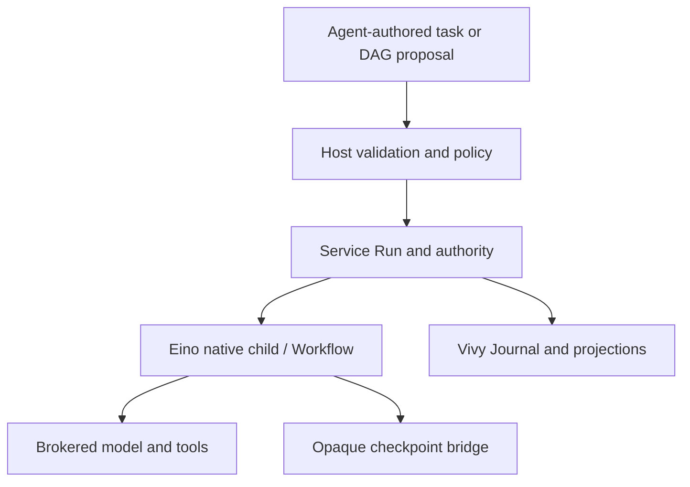

# Issue 39: Eino-native child and bounded workflow design

> Status: proposed implementation architecture, **not implementation approval**. 2026-09-23 baseline: agent-vivy `f6fb11bc71be2d06946ff33b0462aa56f9ff51ef`, Eino v0.9.13 `c5e6aef927cca02bea934541f8dff2ea711b2ca7`. Decision record: [Issue #39](https://github.com/ProjectViVy/agent-vivy/issues/39#issuecomment-5798636327). Execution package: [index](../plans/issue39-eino-orchestration/index.md).

## Outcome and boundaries

An agent can delegate a bounded task to a governed child, inspect and interrupt it, continue its task-scoped conversation when authorized, and compose several children into a validated acyclic dependency workflow. Vivy's existing Service remains the sole Run and model admission path; Journal is the product evidence; policy, host, and budget broker all model and tool effects. Eino compiles and executes the workflow and owns its opaque execution checkpoint. The design intentionally introduces no alternate agent engine, model loop, graph scheduler, external CLI delegation, or independent personality store.

The earlier [#39 inventory comment](https://github.com/ProjectViVy/agent-vivy/issues/39#issuecomment-5754140743) identifies bounded parent-child messaging as a gap candidate. **The architecture must remain mailbox-compatible**: route a message to the stable child Session, never to an ephemeral activation Run; record admitted messages as durable host facts with stable IDs and ordering so process restart cannot make them disappear. `child/followup` starts a new activation Run and remains distinct from delivering a message to a currently active child. The safe point for a running Eino agent to consume mail, acknowledgement/retry guarantees, expiry and close behavior remain to be decided and proven. Direct parent-child mailbox delivery is distinct from child-to-child peer messaging and swarm coordination.

Today's decisions establish the direction, not a green light to ship all interfaces below. **Proposed contracts** in this document need review against the implementation gates. Context sharing/fork semantics, named-mask inheritance, swarm collaboration and peer traffic, external delegation, and the optional workflow product of #40 remain open or deferred. An explicit task input and dependency output is enough for the bounded workflow without settling shared context.

## Verified baseline and comparator

| Area | Current source / observation | Architectural consequence |
| --- | --- | --- |
| Child execution | `internal/app/worker.go` starts a child Run in the parent's Session, supervises `internal/worker`'s handwritten model/tool loop; live handles enable `WaitChild`; existing depth 4, concurrent children per parent 4, turns 8. | Preserve admission limits, migrate execution through Service and Eino; a stable child conversation requires a new durable session boundary and migration strategy. |
| Existing surfaces | `internal/rpc/control.go` implements `child/start,get,list,wait,cancel`; `ui/src/components/chat/RunInspector.tsx` presents these controls. | Extend the contracts compatibly; do not create a separate child API/UI state source. |
| Vivy evidence | `internal/runtime/service.go`, `internal/storage/contracts.go`, Journal, SnapshotStore, BlobStore and LeaseStore; `internal/runtime/checkpoint.go` verifies version, checksum and prompt binding. | Reuse stores, Run transitions, existing approval and deletion fences; fail closed on checkpoint mismatch. |
| Eino 0.9.13 | `compose.NewWorkflow`, `WorkflowNode.AddInput/AddDependency`, `Compile`, `WithMaxRunSteps`, `WithCheckPointStore/WithCheckPointID`; Workflow uses `AllPredecessor`, forbids cycles. Current production engine uses ADK agent runner; `internal/runtime/graph_conformance_test.go` is a fixture, not proof of child/approval/graph integration. | Native DAG is plausible but nested approval, cancellation and durable recovery require a separately verified integration seam before broad implementation. |
| Reference products | DeepSeek Harness demonstrates bounded direct parent-child control and conversation distinction; ZCode illustrates workflow product affordances; Codex interaction design and OpenFang origin provide comparisons. | DSH is the primary **behavioral** comparator; none supplies Vivy's authority or persistence implementation. |

Pinned comparison clones (read-only research): deepseek-harness `46a7f68`, ZCode `328c1a0`, minimax-code `a914a30`, codex `cb1eea3`, OpenHarness `9b2efd7`, oh-my-pi `73a11421fe34fbab8ad058ab9c1a2e4f447852ea`, openfang `acf2587e46be174c10200489c9a2d23a39a98aeb`, agent-diva `0fd005a105d8987df02ae7b796a3c591e04b9ca3`. These are snapshot identifiers, not equivalent capability claims.

For mailbox compatibility, the [pinned DeepSeek Harness control reference](https://github.com/deepseek-ai/deepseek-harness/blob/ddefc45fbc7f8e46dd73185e68295696d1297887/packages/subagent/tool-subagent-control/README.md) is a useful behavior comparator: `send_message` targets the direct parent/child relationship, accepts into a FIFO inbox and returns a stable message ID; a resident target sees mail at a step boundary and an inactive continuable target can resume. Its `interrupt_agent` stops the current turn while leaving inbox and descendants intact. This does not imply sibling messaging, general peer messaging, or a Vivy implementation contract; Vivy's Host must own authorization and persistence.

## Ownership and execution topology



| Fact | Authoritative owner | Rule |
| --- | --- | --- |
| Authorization, budgets, tool selection, workspace | Parent-derived immutable Vivy authority snapshot, policy and Service | Revalidate on every activation/resume; a child may only narrow the parent's authority. A mask cannot grant tools or alter policy. |
| Run state, approval outcome, graph/node status, UI evidence | Vivy Run/Journal; durable projection derived from Journal | All public transitions and results have stable IDs and journal sequence. A terminal Run receives no later append. UI only reads the host. |
| Execution continuation | Eino-native runner/Workflow checkpoint bytes through `VersionedCheckpointStore` and `BlobStore` | Separate checkpoint keys per graph Run/child activation; verify engine, prompt identity and checksum. The checkpoint is not a competing product event log. |
| Task-scoped conversation | Durable child Session and its Messages; multiple activation Runs | No independent identity or evolution and no implicit parent/shared transcript. The original parent lineage is immutable. |
| Workflow revision and input mapping | Immutable host-validated workflow descriptor and digest; Run/Journal maps descriptor nodes to execution IDs | Compile same descriptor on recovery; no dynamic mutation of a running revision. Result handoff is explicit, bounded and recorded. |
| Mailbox compatibility | Host-owned inbox addressed by stable Agent Session ID; append-only admitted envelope and cursor/receipt associated with that mailbox | Message ID, idempotency key and host order survive activation Runs and process restart. Host resolves sender identity and authorizes the current relationship; initial policy may permit only direct parent/child. The envelope does not hard-code parent as the only possible future sender, so a later D5 peer permission can be added without enabling peers now. Eino input is never mutated behind a running invocation. |

### Proposed domain and host seams (not yet existing APIs)

The first implementation gate must confirm the narrowest existing Service extension. Signatures below specify contracts, not an instruction to add every type before it is used.

```go
// Internal host-owned records; no Eino type escapes internal/runtime.
type ChildSessionBinding struct {
    SessionID domain.SessionID       // durable task conversation
    OriginParentRunID domain.RunID    // immutable lineage
    LastRunID domain.RunID            // latest activation, not identity
    AuthorityDigest string           // versioned parent-derived envelope
}
type WorkflowRevision struct {
    ID string; Digest string; ParentRunID domain.RunID
    Nodes []TaskNode; Edges []Dependency
}
type TaskNode struct { Key string; Task string; MaskHint string }
type Dependency struct { From string; To string; OutputKey string }
// Compatibility envelope sketch only; wire shape and delivery states remain open.
type ChildMessageEnvelope struct {
    ID string; TargetSessionID domain.SessionID
    SenderPrincipal string; OperationID string; Sequence uint64
    Body string
}
```

The child control interface should keep existing `child/start,get,list,wait,cancel` behavior for existing callers, adding explicit `child/followup` and `child/interrupt` only after the new admission path is proven. `followup(child_session_id, operation_id, text)` creates a fresh Run in the same child Session, never revives a terminal Run. It is a later activation, not an in-flight mailbox delivery. `interrupt(run_id)` requests interruption of the active activation while preserving its ChildSession for a later Run; a terminal Run is idempotently returned. Existing `child/cancel` stays compatible. Do not assume it is an alias for interrupt or child-session close until D9 preserves the observed legacy behavior and defines each transition. `wait` must work after process restart by reading terminal durable status and waiting on the Run's host event when live; it must honor caller cancellation. An admission operation ID is mandatory for future retry-safe creation; preserve old requests with server-side compatibility until consumers migrate. Do not claim this API closes the parent-child messaging gap from the inventory comment.

Mailbox compatibility is an architectural requirement; the product delivery contract is still open. The stable target is an Agent Session ID (including ChildSessionID); host-assigned sequence gives each recipient a durable order, and a sender-scoped operation ID makes retries refer to the same envelope. Store mailbox admission/receipt through the host's durable event/storage boundary, never only in `workerManager` memory. Host derives sender principal from the live, authorized Agent context; callers cannot assert it in the payload. The initial policy may allow only parent↔direct-child traffic. Keep the envelope relation-based so separately authorized peer senders can be added later under D5 without changing message identity/routing, but do not authorize peer traffic in this scope. A future consumer advances an explicit cursor/receipt at a verified Service/Eino safe point. Restart must preserve pending mail and message identity; the implementation must state its actual delivery guarantee and must not claim exactly-once model/tool effects without a transactional proof. An active Eino invocation may only see new mail through a supported safe interruption/resume or receive/poll boundary, never by mutating its input/history behind the runner.

The compatibility floor follows the pinned DSH interaction: a successful send acknowledges admission with a stable message ID and does not wait for or return the recipient's answer; any reply is a separate addressed message. Interrupting a turn preserves the child Session, queued mail and descendants. A later delivery can resume a continuable idle child if the Service/Eino path proves that behavior. The exact after-acceptance caller-cancellation and message-receipt point still need tests.

Before ORCH-04 implements a send/receive API, review sender/recipient authorization, FIFO scope under concurrent senders, delivery/acknowledgement states, retry/duplicate outcomes, expiry/retention/redaction, backpressure, child interruption and Session closure, and UI projection. This does not imply peer-to-peer child messaging or shared state.

### Child lifecycle and management controls

ChildSession lifecycle and activation Run lifecycle must be represented separately. **Interrupt** stops the current activation at a supported boundary while leaving the task Session eligible for a later Run. **Cancel** terminates the named active Run; it must not silently mean “close this child forever.” **Close** (if offered) prevents later messages/follow-ups and defines what happens to pending mail and descendants. Parent cancellation, parent completion and parent Session deletion need explicit descendant policies; deletion is a privacy/resource fence, not a normal interruption. Names and wire statuses require review against the existing Run state machine before release.

Default delegation is clean context. An optional future context fork would copy an explicit snapshot of completed parent turns into the child task, with a recorded snapshot ID and size bound. It must exclude an in-flight parent turn and must never copy model/tool/workspace authority, secrets, hidden prompt/personality evolution, or mutable shared history. This fork capability is separate from mailbox messages and remains a product decision.

Tool, model, and workspace selection are task-scoped requests constrained by the parent snapshot and host policy. Read-only child tools remain the first safe surface. Write-capable children require a separate decision and evidence for workspace ownership/isolation, concurrent edits, conflict detection, integration/merge review, and partial completion; writable permissions must not be inferred from a mask or mailbox sender. Budget admission must account for the full descendant tree, not just each visible child; surface limits, actual token/tool usage, and partial results/errors without double counting. Existing in-memory concurrency counters require a restart/lease test before being treated as durable admission authority.

At first, follow-up requires the origin parent's valid live authorization and surviving Session; subsequent continuation after parent termination is an **open policy decision**, not implied by persistence. Parent cancellation/session deletion fences running children and workflow nodes; read-only historical child conversations remain queryable only while their authorized parent Session exists. A separate child Session must never appear as an unrelated ordinary sidebar conversation. Session ownership/deletion semantics need both SQLite/Postgres migrations and conformance tests, with Run parent/root lineage still preserved.

Mailbox addressing requires a **continuable child Session**. A one-shot child invocation has a task/result lifecycle and must not appear addressable after completion; a continuable child has a stable Session, inbox compatibility and multiple activation Runs. Decide whether both modes exist and which tools/UX choose each before ORCH-02 fixes its schema. Do not silently make every task-run a persistent mailbox recipient or silently drop continuity from a selected continuable child.

The mask hint is a literal task-scoped instruction processed via the existing Markdown prompt assembly and immutable run snapshot, subject to parent authority. Named catalog inheritance is out of scope. A child may adopt a mask, but no child reads/writes the parent's personality or creates its own evolution record. Only explicit task content and completed dependency outputs cross child Session boundaries; redact and bound output according to the same policy as other brokered inputs.

## Child activation lifecycle

1. Parent tool or UI asks Host to create a child/follow-up; Host checks active parent, scope, quotas, policy, selected tool names and workspace. Persist idempotent admission and lineage *before* exposing a child ID; reserve budget and child slot through the existing broker. Avoid committing an active Run that cannot be recovered.
2. Service creates/activates the child Run, fixes the immutable prompt and parent authority, then runs the Eino-native agent path. Model calls and tool effects travel through existing Service/Host policy, approvals and ledger. In-memory handles are accelerators, not proof a child exists.
3. Tool approvals/questions suspend at the same Service interaction boundary. Persist the Eino checkpoint before publishing the interrupt; resume with the same Run/prompt identity and deduplicated side-effect key. If mailbox support is selected for this slice, persist mail before exposing delivery, then make the active child consume it through a proven Eino safe point and record its receipt. If either contract cannot be proven, block the corresponding endpoint.
4. Cancellation propagates from parent, direct child control or session deletion through Service to Eino invocation; an approval pending cancellation remains cancelled. Record one terminal event and release slots once. A repeated request returns durable terminal state.
5. On restart, derive nonterminal work from durable Runs/Journal/leases, verify checkpoint compatibility and authority, restore mailbox cursor/pending delivery from durable state, and either resume once or mark a reasoned terminal failure; never silently rerun a tool. Recover terminal `wait` from durable state.

Suggested idempotency scope: `(origin parent Run, operation ID)` for child admission; `(workflow Run, revision digest, node key)` for graph node admission; `(Run, tool call ID, execution attempt)` for tool effect resolution, using existing effect IDs where possible. Repeated delivery with identical payload returns the same ID; mismatched payload is a conflict. This needs a concrete DB transaction/unique key design in Story 02; a speculative in-memory map cannot satisfy the contract.

## Bounded native DAG

The parent agent proposes a declarative graph with node keys/tasks and dependency edges. Host validates size, unique stable keys, referential integrity, no cycles, topological depth/width against current admission limits, authority/tool bounds, revision digest, and output-size limits **before** creating an orchestration Run. The default is a small finite DAG; retries, loops, dynamic graph mutation, custom branching expressions and peer-to-peer swarm messaging are excluded. No fixed preset workflow taxonomy.

Host atomically persists a validated immutable descriptor and opens an orchestration Run under the parent. A validation preview may return a canonical digest without storing a revision; start revalidates the inline descriptor and digest against the current parent authority. Within `internal/runtime`, compile `compose.Workflow` with one brokered child-invocation lambda per node, `AddDependency` for order-only edges or `AddInput` for approved explicit output mappings, `AddEnd` for final aggregation, bounded `WithMaxRunSteps`, and checkpoint bridge. Eino decides runnable node order/parallelism. Node lambdas must use durable idempotent child admission and wait through Service; re-invocation after checkpoint recovery looks up existing node Run, never launches a duplicate. The graph Run owns graph events, checkpoint and terminal result; child Runs retain their own Journal and Session. A projection keyed by graph Run/revision/node maps child Run IDs and results; it must be reconstructible from authoritative events/descriptor. Running graph revision is immutable; edits produce a new revision and Run. In the initial cut the origin parent must remain active while the graph runs; parent completion/cancellation fences unfinished graph work, with durable results still readable.

Graph-wide budget is inherited from the parent's ledger. Node execution uses existing parent concurrency cap rather than a second scheduler. Width validation alone cannot guarantee runtime admission if unrelated children occupy slots: define deterministic bounded backpressure or fail with a clear capacity outcome at the Service seam; do not spin or silently enlarge the limit. First prove parallel join, approval interrupt, cancellation, crash/restart and zero duplicate side effects together in Story 01. If v0.9.13 does not provide the needed recovery semantics, narrow scope to sequential native child controls and return to #39 for a revised decision. No handwritten DAG engine fallback is authorized.

## Failure semantics and user surface

| Failure | Persisted outcome / action |
| --- | --- |
| Invalid proposal or no authority | Reject before execution with structured validation error, no graph/child Run. |
| Model/tool refusal, approval denial | Reuse existing Service semantics; node reports bounded failure; dependent nodes do not start. |
| Node error / parent cancellation | Mark graph Run failed/cancelled and fence pending/running descendants; unaffected independent nodes may already have completed, whose results remain visible. No implicit retry. |
| Crash between checkpoint and Journal | Recovery reconciles stable operation IDs and committed events; emits missing projection once or fails closed, never redoes an unknown write. |
| Corrupt or different-version checkpoint/prompt | Fail closed with recoverable diagnostic and terminal/blocked state chosen by the existing Service state machine; never infer completion from Eino bytes. |
| Mail admitted but not consumed at interruption/restart | Keep the same message ID and pending receipt against ChildSessionID; report pending/failed/expired truthfully. Do not silently drop it or mark it consumed merely because a Run ended. |
| Child Session closed or parent authority revoked | Reject new mail/follow-up; resolve pending messages and descendant Runs under the recorded close policy, never deliver under stale authority. |
| Parent Session deletion | Fence all activations, cleanup session-owned child records/checkpoints under existing deletion rules; orphan repair conformance tests. |

Existing `child/*` RPC and RunInspector remain the initial interaction seam. Proposed graph `workflow/propose,start,get,list,cancel` is a **contract sketch**, gated by Story 01 and exact UI/host ownership review; no public method is advertised before it is functional. Show bounded node states and provenance from host projection, no fake local graph state. Expose child Session history through scoped retrieval; hide task mask hint and private authority details when projecting public events. Review `docs/architecture/VIVY-FACE-PACK.md` before changing Face contracts. Internationalize added UI copy in `ui/src/i18n/en.ts` and `zh.ts`.

## Verification and delivery gates

| Gate | Required evidence | Consequence if absent |
| --- | --- | --- |
| G0 technical feasibility | Eino v0.9.13 native graph plus Service authority, checkpoint, approval, restart, parallel join, cancellation; record trace and failure case, compare against existing graph fixture. | Pause graph implementation; revise #39. |
| G1 child parity | Parent/child authority, readonly tools, per-parent caps, same-origin budget accounting, parent cancellation, durable wait, clean isolated conversation, masked prompt snapshot. | Do not switch production worker path. |
| G2 graph safety | Cycle/limit rejection, idempotent node admission, no replayed write, bounded fanout and dependent-failure behavior across both SQL backends. | No public workflow start. |
| G3 product acceptance | Host/UI shared control operations, list/inspect/interrupt/follow-up, stable tree and graph projection, accessibility and two locales. | Keep gated/hidden surfaces. |
| G4 release | `just ci`, focused native integration tests, UI end-to-end at `http://127.0.0.1:3015`, `docs/logs/YYYY-MM-DD-slug/` summary/verification/acceptance, update `docs/TODO.md` §0.1. | Do not mark complete. |

## Decision register

| Key | State | Evidence needed / owner |
| --- | --- | --- |
| D1 child Session separation for task history | Design recommendation; requires G0/G1 and data lifecycle review | Service/storage owner: migration, read isolation, delete fence, historic same-Session child compatibility. |
| D2 child context fork/share | **OPEN** | Product decision on explicit scope, expiry, redaction and transcript permission; no prerequisite for bounded DAG. |
| D3 named catalog mask inheritance | **NOT APPROVED** | Separate product decision; free-text mask hint remains task-scoped. |
| D4 parent-terminal follow-up | **OPEN** | Policy/lifecycle decision; live-authorized parent only in proposed initial cut. |
| D5 swarm/peer messages | **DEFERRED** | Membership, task claiming, conflict resolution, authority and termination contract. |
| D6 external ACP/SDK/CLI delegation and optional #40 workflow/PTC | **DEFERRED** | Separate authority/hosting/product proposals. |
| D7 parallel join + approval/resume in native Eino | **UNVERIFIED** | Story 01 executable proof; hard gate. |
| D8 direct parent↔child mailbox delivery and acknowledgement contract | **OPEN · COMPATIBILITY REQUIRED** | Stable Agent Session target, sender attribution, durable message IDs/order, and relation-based authorization are architectural constraints. Product/Runtime owners still need to decide active-run safe point, ack/retry/delivery guarantee, expiry, backpressure and UI projection. D5 peer/swarm traffic remains unauthorized and deferred. |
| D9 interrupt, cancel, close and descendant lifecycle | **PARTIAL · OPEN** | Compatibility floor: interrupt stops only the current activation and preserves Session, queued mail and descendants. Preserve legacy `child/cancel`; separately specify its relationship to Session close, pending mail and descendant teardown. Review against domain Run states. |
| D10 context fork | **OPEN · clean spawn default** | Decide whether a child may receive a bounded snapshot of completed parent turns; no in-flight copy or inherited authority/personality. |
| D11 write-capable children and workspace isolation | **DEFERRED** | Read-only remains baseline. Any write authority needs workspace ownership, concurrent-write/conflict and integration/rollback design. |
| D12 task-scoped model/tool selection | **OPEN · parent-bounded** | Determine allowed model selection and tool surface; all choices remain inside parent authority and budget. Mask/mail cannot grant capability. |
| D13 descendant resource/cost roll-up and admission recovery | **VERIFY** | Prove full-tree budget aggregation, actual token/tool usage projection, restart-safe child slots/backpressure and partial result accounting without double counting. |
| D14 one-shot versus continuable child mode | **OPEN** | Decide whether both invocation lifecycles remain available, which native tool/UI/DAG path creates each, and how a stable Session is exposed. Mailbox compatibility applies only to the continuable mode. |

## Reference pointers

- [#39 initial proposal and decision comments](https://github.com/ProjectViVy/agent-vivy/issues/39), [#40 optional workflow product](https://github.com/ProjectViVy/agent-vivy/issues/40).
- [#39 inventory follow-up](https://github.com/ProjectViVy/agent-vivy/issues/39#issuecomment-5754140743) identifies bounded parent-child messages as a gap candidate; it does not choose a mailbox implementation.
- The same inventory records interrupt vs cancel/close, optional fork of completed parent context, descendant resource roll-up, writable workspace isolation, model/tool/context selection, GUI controls, and pending-mail recovery as explicit review areas.
- The same inventory distinguishes continuable children from one-shot task runs; a mailbox-capable recipient needs the former's durable Session.
- `docs/eino-capability-verify.md` is historical Eino checkpoint evidence; it does not establish this composite workflow path.
- `docs/superpowers/specs/2026-09-21-mask-subsystem-design.md` defines run-stable mask snapshots and excludes child catalog inheritance.
- Source anchors: `internal/app/agenttool.go`, `internal/app/worker.go`, `internal/worker/`, `internal/runtime/{service,engine,checkpoint,checkpointadapter}.go`, `internal/rpc/control.go`, `internal/storage/contracts.go`, `ui/src/components/chat/RunInspector.tsx`.
