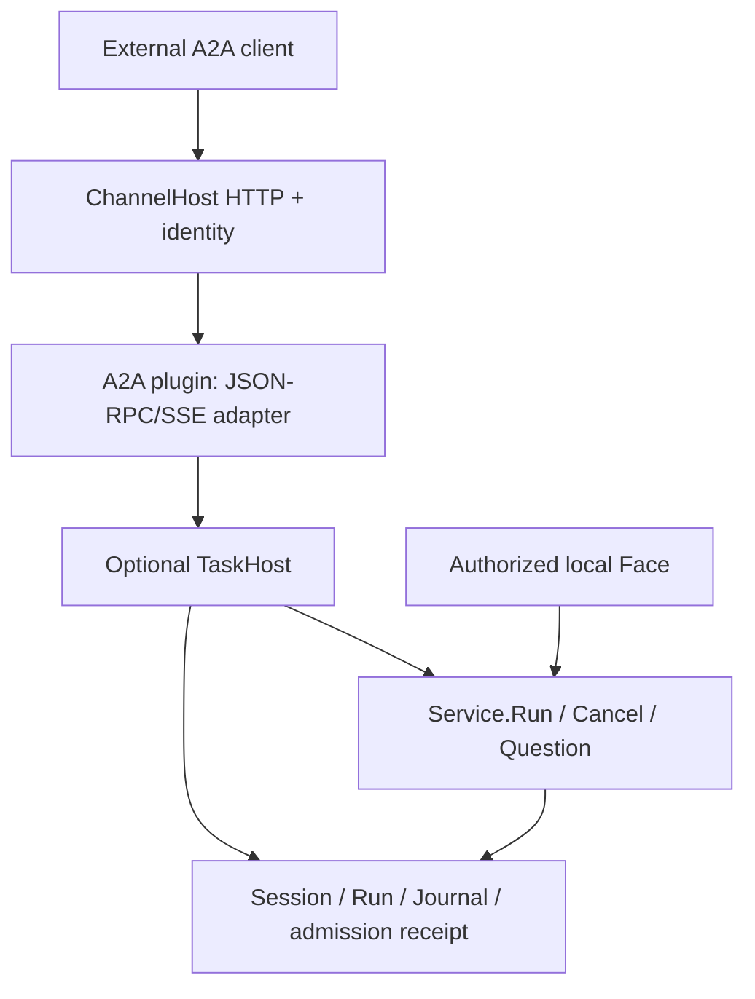

# VIVY Issue #2 — A2A Server G0 Architecture Review Draft

Status: **design for owner review; no implementation authorized**. Baseline: `ProjectViVy/agent-vivy` main `3c4ed66826f5a40fd27dba0d9e208c55240a5955` (2026-09-28). The [issue](https://github.com/ProjectViVy/agent-vivy/issues/2) remains `UNSCHEDULED`/`DEFER`. This draft is not a replacement for repository architecture contracts; after review, integrate decisions into the existing Channel Pack, CH-C9, and TODO board. Do not start G1 until G0 is reviewed and separately scheduled.

## Outcome and scope

| ID | Required outcome | Evidence |
| --- | --- | --- |
| R1 | Other agents discover Vivy and submit/inspect/cancel a real task through A2A 1.0 JSON-RPC and SSE. | Official client completes a real tool-bearing `Service.Run`; IDs match Run and Session. |
| R2 | Task state, output, authorization, replay, and cancellation use the existing Runtime and durable stores. | No SDK TaskStore/executor or plugin-owned database; cold-restart and concurrency tests. |
| R3 | Omitting the plugin from a Generation removes its code, SDK dependency, route, listener, and settings card. | Two packed artifacts and Inspect comparison. |
| R4 | A remote peer cannot approve a dangerous local operation or access another principal's tasks. | Negative access/approval tests covering every method and task continuation. |
| R5 | Existing Channel providers and the selected Face retain current behavior. | Focused Channel tests, Port conformance, `just ci`, packed smoke. |

First cut: northbound server only, one configured authenticated principal per endpoint; no outbound delegation, gRPC, REST, push/webhooks, multi-tenant administration, public registry, general-purpose A2A extensions, or raw file transfer. **Proposed exception for strict replay:** one optional task-event replay extension. This changes the issue's current custom-extension deferral and requires an explicit amendment to the issue/architecture contract before G1. `std/channel@v1` stays `0..n`; `projectvivy/a2a-server` is a T2 source selected by an explicit Recipe and carries effective `channel.a2a`. A2A is a Channel and can coexist with a Face. No user-facing Studio work is implied.

## Verified baseline and design implications

- [`sdk/port/channel/channel.go`](https://github.com/ProjectViVy/agent-vivy/blob/3c4ed66826f5a40fd27dba0d9e208c55240a5955/sdk/port/channel/channel.go) defines `TaskLifecycle interface{}` as a zero-method placeholder, a base `Host` with `PublishInbound(...) error`, and optional `ListenHandler` without an implemented listener.
- [`internal/channelhost/host.go`](https://github.com/ProjectViVy/agent-vivy/blob/3c4ed66826f5a40fd27dba0d9e208c55240a5955/internal/channelhost/host.go) starts configured channels and requires nonempty `allow_from`; [`channelenv.go`](https://github.com/ProjectViVy/agent-vivy/blob/3c4ed66826f5a40fd27dba0d9e208c55240a5955/internal/channelhost/channelenv.go) has outbound HTTP but no inbound listener. Existing chat delivery and approval commands are separate behavior; A2A must never inherit chat `/approve` handling.
- [`internal/app/channels.go`](https://github.com/ProjectViVy/agent-vivy/blob/3c4ed66826f5a40fd27dba0d9e208c55240a5955/internal/app/channels.go) wraps each provider Host in `grantedChannelHost`. Optional `TaskHost` must be re-exposed deliberately only with `channel.a2a`, or type assertion will fail or bypass the Grant.
- [`internal/runtime/service.go`](https://github.com/ProjectViVy/agent-vivy/blob/3c4ed66826f5a40fd27dba0d9e208c55240a5955/internal/runtime/service.go) has `RunWithOptions`, a per-Session admission gate, a detached run context, `Cancel(runID)`, `BeforeStart`, and continuity receipts scoped to a Session. The generic primary-run admission does not atomically record an external principal/message ID; `BeforeStart` alone cannot guarantee durable retry deduplication.
- The same Service has `AnswerQuestion` to resume `ask_user` on its original Run, but its stored answer actor is currently `local_user`. The first cut keeps question answering on an authorized local Face; enabling remote answers later would require an attributed Host path and a durable continuation receipt. `DecideApprovalAsActor` remains inaccessible to the A2A Host.
- [`internal/storage/contracts.go`](https://github.com/ProjectViVy/agent-vivy/blob/3c4ed66826f5a40fd27dba0d9e208c55240a5955/internal/storage/contracts.go) exposes Journal replay at `seq > after`, plus Session/Run stores; current `ListRunsBySession` is unbounded. A2A List needs a bounded storage query and index, not in-memory full-session enumeration. [`internal/runtime/message_projector.go`](https://github.com/ProjectViVy/agent-vivy/blob/3c4ed66826f5a40fd27dba0d9e208c55240a5955/internal/runtime/message_projector.go) already reconstructs assistant text from Journal deltas and verifies the `model.completed` content digest; it is the source to reuse for output projection. The MessageStore projection is recoverable but can lag a committed event.
- A2A 1.0 requires `SubscribeToTask` to begin with the current Task snapshot; the request has no portable resume cursor and rejects a terminal task. See the [1.0 specification](https://a2a-protocol.org/v1.0.0/specification/). In official Go SDK `v2.5.0`, [`a2asrv.RequestHandler`](https://github.com/a2aproject/a2a-go/blob/v2.5.0/a2asrv/handler.go) is implementable independently and [`NewJSONRPCHandler`](https://github.com/a2aproject/a2a-go/blob/v2.5.0/a2asrv/jsonrpc.go) accepts it. `NewHandler` creates its own execution manager, queue, and TaskStore, so do not invoke it. Correction to the earlier review: the SDK's [SSE writer](https://github.com/a2aproject/a2a-go/blob/v2.5.0/internal/sse/sse.go) **does** emit `id`, but generates a random UUID for every event; its [client parser](https://github.com/a2aproject/a2a-go/blob/v2.5.0/a2aclient/jsonrpc.go) discards `id` and yields only `data`.

## Chosen structure and alternatives

Use a thin A2A `RequestHandler` implemented in `plugins/a2a-server`, the official SDK's types and JSON-RPC binding, and a protocol-neutral optional `TaskHost` provided only by ChannelHost. ChannelHost owns the HTTP socket, request identity, admission and lifetime, while the core Runtime and stores own the task. This adds one task seam and one receipt index. Using `PublishInbound` cannot return the actual Run or guarantee retry identity; using `a2asrv.NewHandler` creates a parallel task authority; writing an A2A schema/JSON-RPC handler from scratch increases maintained protocol code. The chosen structure preserves the single `Service.Run`/Journal/Policy path and limits the SDK dependency to the selected module.



### Port and trust contract

Proposed additions to `sdk/port/channel` (names are final design targets, not existing symbols):

```go
type TaskHost interface {
    SubmitTask(context.Context, TaskRequest) (TaskRef, error)
    GetTask(context.Context, TaskQuery) (TaskSnapshot, error)
    ListTasks(context.Context, TaskListQuery) (TaskPage, error)
    CancelTask(context.Context, TaskQuery) (TaskSnapshot, error)
    SubscribeTask(context.Context, TaskSubscription) (TaskStream, error)
    ReplayTaskEvents(context.Context, TaskReplayQuery) (TaskStream, error)
}
```

`TaskRequest` contains required caller-stable `MessageID`, text-only bounded Parts, optional `ContextID`, and a stable canonical request digest generated after validation. A supplied existing `taskId` is rejected as an unsupported continuation in this cut; it cannot create a new Run. The request does **not** accept a caller-supplied new Run ID, principal, approval ID, storage handle, or policy override. `TaskRef` contains actual `RunID` and `SessionID` plus `Replayed` for host diagnostics; `TaskQuery` includes Run ID and optional matching Session ID; `TaskListQuery` includes Session ID, bounded page size and opaque page token. `TaskSnapshot` contains the public state, bounded committed messages/artifacts, timestamp, and an internal Journal high-water sequence. Standard `TaskSubscription` begins with a current Task snapshot. `TaskReplayQuery` contains the task, an exclusive public-event cursor and a bounded replay budget; replay begins directly with missed events, with no initial snapshot. `TaskStream` yields ordered public events and has explicit `Close`. The Port uses typed errors for invalid input, conflict, inaccessible task, unavailable/expired cursor, unavailability, closed task, and not-cancelable; the adapter maps standard-operation errors to SDK A2A errors without returning internal causes. The principal is **only** a Host-injected request-context value from verified HTTP credentials, never a Port field supplied by plugin data. Base `channel.Host` stays source compatible; a missing optional capability fails provider startup with an explicit error.

`ChannelHost` does not import A2A or Eino. It injects narrow Run/Cancel and verified assistant-output projection callbacks from app composition, not `*runtime.Service`. The projection callback reuses the existing Journal-backed projector, filters to public assistant text, and does not rely on potentially lagging MessageStore rows. `grantedChannelHost` conditionally exposes the optional task interface under `channel.a2a`, with read/write calls checking the effective Grant and authenticated identity. `TaskLifecycle interface{}` is removed/replaced; capability discovery and Inspect report a nonempty task capability only when an actual provider and Host pair support it. Existing chat providers see no new required methods.

### Durable identity and admission

Use a **core-owned admission receipt**, not a task-state table. Proposed core migration, paired SQLite/PostgreSQL: `channel_task_admissions(channel_id, principal_id, message_id, input_digest, session_id, run_id, created_at)` with a unique key `(channel_id, principal_id, message_id)`, a unique `run_id`, and `(channel_id, principal_id, session_id, run_id)` listing index. Persist it in the **same transaction** as the user turn, Run and `run.started` event through the production primary-run admission path. That transaction is the only point at which a message can create a Run. A duplicate with the same digest returns the original IDs; changed input returns conflict; concurrent requests converge through the unique constraint. On an uncertain commit, lookup by receipt before any retry. Keep receipts or a tombstone across session deletion for the idempotency retention contract; do not silently recreate work with a reused message ID.

For an absent context, Host creates a real, initially private Session before admission. A failed admission may leave an unused Session; best-effort cleanup is safe only if it has no committed Run or receipt. Concurrent first attempts can create separate provisional Sessions, but exactly one admitted receipt selects the authoritative Session and the loser resolves to it. A retry with no `contextId` first looks up the receipt and returns its original Session. An explicit `contextId` must already belong to the same channel/principal by a committed receipt; an unrecognized or mismatched ID is rejected, never silently replaced. Get/List/Cancel/Subscribe verify the receipt ownership and Session/Run relation before any data read or cancellation. Knowing a Run ID never grants access. List scans the indexed receipts with a bounded, tamper-resistant continuation token and projects each matching Run; no unrestricted `ListRunsBySession` scan or global task listing.

### Operations, state and output

| A2A operation | Host behavior |
| --- | --- |
| Agent Card | Dedicated, host-mounted well-known route; compose from selected Generation, live enabled endpoint, and inspected capability truth. Advertise `JSONRPC` v1.0, SSE, actual public URL, only configured skills, and the optional replay extension URI only when mounted and verified. No guessed tools, policy or internal paths. |
| SendMessage | Validate parts, context/task rules, auth; atomically admit once; return the real task promptly while the detached Run continues. |
| SendStreamingMessage | Same admission path; emit initial Task, then committed public Journal projections through SSE; HTTP disconnect closes the subscription only. |
| GetTask | Verify owner and optional context; derive current state and bounded history/artifacts from committed Run/Journal/message projections. |
| ListTasks | Bounded, owner-indexed list with stable keyset pagination; honor A2A `pageSize` and optional filters. |
| CancelTask | Verify owner before `Cancel(runID)`; return the resulting projected Task; race with terminal maps to not-cancelable without canceling another Run. |
| SubscribeToTask | Verify owner, emit a consistent initial Task snapshot, then tail committed events after its high-water mark. Reject a terminal task as specified; GetTask remains available. |
| Task-event replay extension | Verify owner and cursor, replay retained public committed events after it, then tail live from the same Journal-backed stream; if terminal, drain and close. Never insert a current-state snapshot ahead of replayed events. |

State mapping: `accepted/queued -> SUBMITTED`, `active -> WORKING`, committed `run.completed/failed/cancelled -> COMPLETED/FAILED/CANCELED`. A pending `user.question_required` maps to `INPUT_REQUIRED` with a sanitized question. A pending tool approval remains `WORKING` with a generic “waiting for local review” status; **never** expose an approval token or map it to an action the remote peer could fulfill. The host distinguishes pending states using committed events and the existing durable question/approval lifecycle, not `RunStatus` alone. Terminal state requires a committed terminal event; on storage disagreement fail closed rather than advertise success. Project committed user input and Journal-verified assistant text to bounded public Messages/Artifacts, using the existing projector through a narrow callback; never serialize raw events, reasoning, tool arguments/results, policy explanations, credentials, or absolute paths. Use stable event/part IDs based on Run and Journal sequence so replay does not invent new artifact identities.

For a follow-up with only `contextId`, admit a new Run in that Session if normal Session admission permits it. For a message referring to an existing `taskId`, reject with an explicit unsupported-continuation error after checking access and matching context. `ask_user` questions are presented as `INPUT_REQUIRED` with a sanitized note that local operator input is needed; only an authorized local Face resumes the same Run. A new message against that Session while its Run is suspended retains the existing admission conflict. This deliberately provides standard task monitoring and context continuation without claiming remote task continuation. Review remote ordinary-question replies as a later capability with actor attribution and atomic answer idempotency; never route an A2A message to `DecideApprovalAsActor`.

### Network, configuration and lifecycle

Use one dedicated Host-owned HTTP listener, never the existing `:8787` `/rpc` mux. Add a narrow optional `HTTPMounts` provider interface returning `[]HTTPMount{Method, Path, Handler}`; Host validates and mounts exactly `POST /a2a`, `POST /a2a/extensions/task-event-replay/v1`, and `GET /.well-known/agent-card.json` on a private mux, applies authentication/admission middleware and owns the socket. The plugin never calls `net.Listen` or `http.ListenAndServe`; it cannot mount wildcards, overwrite another route, or serve paths beyond the declared mount. Proposed Host-owned settings in the `channels.a2a` envelope: `enabled`, required single `allow_from` principal, `token_env`, `listen_address`, and `public_url`; plugin settings contain protocol presentation only. Use the existing credential resolver and `channel.a2a` Grant. Require a bearer token even on loopback to avoid a different local process inheriting task authority. First cut accepts only a loopback `listen_address`; remote access uses an existing HTTPS reverse proxy and an explicitly configured HTTPS `public_url`. A direct non-loopback bind is rejected; support for it would require a later Host-owned TLS and authentication contract. Validate URL/route collisions and exact Origin/Host behavior before binding. The well-known Card may be public but carries no secret; all task methods require Host authentication. Limits include request bytes, part count/size, history and list bounds, concurrent streams, idle/write timeouts, and global/per-principal admission limits; reuse existing attachment limits only for types actually supported. No raw credentials in settings, logs, or Inspect.

Startup order: validate Grant/config/auth; construct and start the provider without a socket; inspect its handlers and validate mount paths; bind the Host socket; publish endpoint only after the whole Channel is ready. Any failure stops the provider, closes sockets and marks the channel unavailable without leaving a live route. Shutdown stops new admissions, closes SSE subscriptions at a bound, and then closes the listener and provider. A request disconnect never calls Run cancellation. Recipe omission removes the plugin and SDK from generated Assembly; disabling config leaves it inert and reports why in Inspect. Rollback is a new Generation omitting the module; additive core migration/receipt rows remain inert and preserve idempotency evidence.

### B enhancement: strict replay as an opt-in extension

Issue #2 requires reconnect without losing or duplicating committed updates but currently defers custom extensions. Standard A2A 1.0 `SubscribeToTask` sends a current snapshot before subsequent events, carries no portable resume cursor, and rejects terminal tasks. SDK `v2.5.0` **does** write SSE `id`, but the ID is a random UUID and its official client parser discards it. Therefore standard-only clients can recover current state, while **only clients opting into the extension receive exact per-event replay**. This is an explicit, narrow proposed amendment to the issue; it does not imply scheduling implementation.

Keep the official SDK's models, `RequestHandler`, JSON-RPC transport and standard SSE unchanged. Add one Host-mounted `POST /a2a/extensions/task-event-replay/v1` operation, described by a versioned URI in the Agent Card with `required: false`. It takes `taskId` and `after` cursor, responds with an SSE stream of committed, public A2A event records with deterministic `id`, and never creates a Run. `after` is exclusive; omitted `after` starts at the beginning of the retained public event history. An authorized terminal task replays through its committed terminal event and then closes. For an active task the **same connection** catches up to a captured committed head and then tails later commits; no replay-to-subscribe hand-off exists. A recoverable notification channel may wake the reader, but Journal replay after the last delivered cursor is authoritative; wakeups are not counted as events. The extension returns **no initial current-state snapshot**, so old deltas cannot be applied after a newer snapshot.

One public event receives a stable cursor derived from `(run_id, journal_seq, public_event_ordinal)`; the ordinal handles multiple public projections of one committed Journal entry. Private and suppressed Journal entries consume sequence positions without emitting public events. The Host owns projection, scoped cursor validation, and retention; the plugin only frames approved public event data. On every request, authenticate and verify the receipt's channel/principal/context ownership **before** replaying; reject foreign-task cursors, future positions, unknown versions and positions older than the retained replay floor. Use the existing Journal, no second event table or TaskStore. The wire cursor must survive a process restart, so it cannot depend on an in-memory token map or ephemeral signing key. Cursor bytes do not grant access by themselves.

The enhanced client calls standard `SendMessage` for the real `taskId`, then opens this extension stream from its saved cursor (initially empty). It persists the last applied cursor **with** its local event state before acknowledging progress; on a reconnect it passes that cursor explicitly. On repeated delivery it deduplicates by deterministic ID, and can call standard `GetTask` for a current-state check without inserting that snapshot into its ordered event log. The standard official client still works for send/get/live subscription, but it does not implement this replay extension or its guarantee. No SDK fork or replacement of standard `SubscribeToTask` is needed.

Bound replay by request size, authenticated concurrent streams, and delivery rate; use bounded batches while the cursor advances and never silently skip events at a batch limit. Existing Journal history remains replayable while its Session and Run exist; do not add a new retention setting solely for this extension. Session deletion currently removes its Runs and Journal entries, so a deleted task or cursor returns `replay unavailable`, never a claimed exact replay. The guarantee applies only to surviving public committed events and to a client that durably saves its cursor with its local log. G0 must freeze the deletion/error contract; a client receiving `replay unavailable` discards its partial log and takes a fresh `GetTask` snapshot only if the task still exists.

Acceptance: standard official client passes normal card/send/get/live-stream flows; enhanced client proves ordered replay from a saved cursor across stream disconnect, terminal-during-gap, process restart, multi-event projection, concurrent append/wakeup races, duplicate delivery, cursor expiry, and cross-principal/cross-task denial. The client must show a gap cannot be lost between catch-up and tail. If the extension amendment is not adopted, the issue's strict reconnect criterion remains blocked; state convergence alone does not satisfy it.

## Failure model and verification

Admission errors leave no Run or event; uncertain commit resolves by receipt. Wrong principal or context maps to an indistinguishable not-found error. Digest mismatch is conflict. Existing active Run in a Session preserves current conflict behavior. A disconnected SSE stream releases its iterator and request resources, not the Run. Storage outage and auth failure fail closed; cancellation of an already terminal task never affects another Run. Oversized/unsupported parts are rejected before admission. Agent Card failure/absent generated evidence fails endpoint startup rather than advertising guessed capabilities.

G0 acceptance evidence: SDK v2.5.0 `RequestHandler` and `NewJSONRPCHandler` compile probe with a stub TaskHost; verified official client card/send/get/stream; static proof that default `NewHandler` is unused; review of the optional replay extension URI, exact Host route and client cursor persistence; documented local-only question continuation; exact config/mount/identity review; SQLite and PostgreSQL transactional receipt design review. This document records an API inspection, **not** a compiled probe or client smoke. G1/G2 remain unverified.

## Review and delivery boundary

G0 is a design gate only. After owner review, reconcile this draft into `docs/architecture/VIVY-CHANNEL-PACK.md`, reduce `docs/plans/channel-epic/CH-C9.md` to the A2A issue link while retaining NeuroLink deferred, and update `docs/TODO.md`. A conditional G0/G1/G2 Story package has been drafted under `docs/superpowers/plans/a2a-server/`; it does not make implementation Stories Ready before the Issue amendment, G0 approval and human scheduling. Before any code, check the pinned Eino/EinoExt capabilities required by `AGENTS.md`; the current task concerns an external transport and leaves the existing Eino-backed runtime intact. Do not change issue scheduling or start G1 from this design draft.
