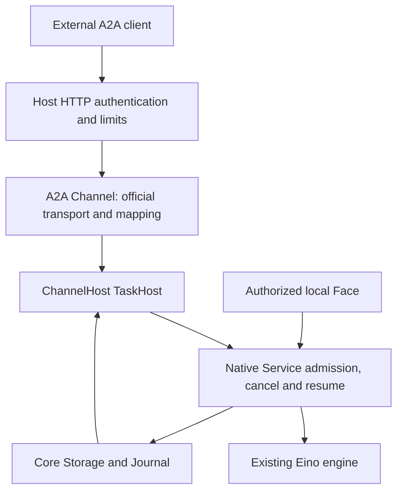

# A2A Server architecture and detailed design — issue #2

Status: **DETAILED DESIGN AND PLAN PACKAGE FOR G0 REVIEW — implementation unscheduled**

Date: 2026-10-07 (Asia/Shanghai)

Issue: [#2](https://github.com/ProjectViVy/agent-vivy/issues/2)

Research: [pre-design materials](https://github.com/ProjectViVy/agent-vivy/issues/2#issuecomment-6020157108)

Repository baseline: `dd78fcf142f384d47ce5cfefb43738fdb9a7346d`

SDK reference: `a2a-go/v2 v2.6.0`, `ebf17c56ef7e63c72883a45454a538bbc0df66b8`

Detailed revision: 2026-10-07, building on architecture commit `246d5aa`.
This is the single design authority for this proposal. Concrete types,
transactions, configuration and acceptance fixtures below are proposed
contracts, not already shipped APIs. Section 12 gives design slices.
The owner explicitly requested a [plan package](../plans/2026-10-07-a2a-server/index.md)
on 2026-10-07 before G0 closure. The package now contains the implementation
steps, dependencies and evidence requirements; preparing it does not approve
the reconnect change, pass G0 or schedule functional work. The earlier
plan-after-G0 ordering is superseded only for this planning delivery.

Consolidation revision: 2026-10-07. This design and its linked package on
`A2A` supersede the planning documents from `docs/issue2-a2a-server-plan`
at `99f9b7b2f3a7cab3a87b04c1989a7d5824dc9d10`. That branch used native
baseline `3c4ed668` and SDK v2.5.0; this revision retains the newer baseline
above. The owner authorized consolidating details before retiring the old
branch, not choosing a reconnect contract or starting implementation.
Section 1.1 records every material disposition; section 8.2 preserves the
old exact-replay proposal with a conditional executable plan. Historical
Story IDs must not be interpreted as the current IDs.

Review route: section 5 defines the SDK seam; section 6 defines persistence
and crash behavior; sections 7–11 define the protocol/HTTP boundary; section
12 maps the changes to evidence. Existing high-level decisions and their
concrete details are kept together instead of maintaining a second plan copy.

## 1. Decision and approval boundary

Use a T2 `projectvivy/a2a-server` Channel Module whose custom official-SDK `RequestHandler` translates A2A requests into an optional, protocol-neutral ChannelHost `TaskHost`. Mount the SDK JSON-RPC/SSE handler on a dedicated Host-owned HTTP listener. Native sessions, Runs, admission receipts, Journal, policy and Eino execution remain authoritative. The material alternative is the SDK default handler with a custom TaskStore; reject it because the default handler also owns execution management, queues and task mutation. Direct transport reuse needs a small adapter and explicit validation, but avoids reconciling two task lifecycles. This choice follows the inspected SDK constructor boundaries and VIVY's existing atomic admission and committed-event paths.

This draft proposes one change to issue #2's acceptance wording: standard A2A reconnection recovers a current task snapshot and subsequent ordered events, not an exact replay of every event missed while disconnected. Section 8 explains the evidence and alternatives. The issue's stronger wording remains unresolved until owner approval; this document does not silently waive it.

Design review may approve this architecture without scheduling implementation. Neither this draft nor the existing `SUPPORTED` status of `std/channel@v1` establishes that TaskHost, an A2A endpoint, or an interoperable plugin exists. No product source, public interface or default Recipe is changed by this delivery.

### 1.1 Consolidated scope and decisions still owned by G0

The two drafts agree on the native-authority architecture. Consolidation
retains one design and one package, with explicit alternatives where they
differ. No pending alternative is silently approved by branch retirement.

| Topic | Consolidated disposition | G0 decision or evidence |
|---|---|---|
| Standard recovery versus exact replay | Section 8 keeps option A (state convergence) and section 8.2 preserves option B (one optional exact-replay extension). | Select one acceptance contract and prepare the corresponding issue amendment. The existing stronger acceptance remains in force until changed. |
| Ordinary question answers | Sections 5–7 and A2A-03 retain the newer proposed same-Run remote-answer contract. The earlier local-Face-only mode remains a valid narrower alternative: reject existing-task messages, expose a safe local-input notice, and require local handling or native expiry/failure. | Explicitly include or defer remote answers. If deferred, revise TaskRequest validation, A2A-03, projection/smoke expectations and dependency edges before releasing work; do not claim remote continuation. |
| Identity and deployment | Section 10 retains the newer proposed multi-principal/Host-TLS envelope. The earlier minimum is one configured principal per endpoint, authenticated loopback binding, and HTTPS reverse proxy for remote access. | Select the needed deployment boundary; if narrowed, remove unused TLS/multi-principal configuration and tests before implementation. Consolidation adds no demand for them. |
| Approval state | Keep proposed AUTH_REQUIRED with out-of-band local review; the previous WORKING notice is superseded as a design candidate. Neither permits remote approval. | Verify both interrupted states and local review races with the pinned official client. |
| Admission | Keep current prompt capture, receipt-before-busy ordering, ownership/tombstones and shared SQL locking. The earlier receipt/tombstone requirement is preserved, not newly invented here. | Prove provisional workspace/persona cleanup. The previous eager private Session plus best-effort cleanup is not copied over the newer atomic Session requirement. |
| HTTP seam | Reuse ListenHandler, private Host routing and the same listener. The old HTTPMounts proposal is superseded; option B adds only its exact declared path. | Validate route isolation and fail-closed lifecycle for the selected option. |
| Default Generation | Issue #2 requires explicit opt-in and omission from default; repository/plugin guidance requires first-party inclusion in default. | Record an explicit issue-specific resolution before G1; do not edit AGENTS.md or silently choose a default. The consolidation request is not a repository-rule amendment. |

Sections 5–12 describe the base server; section 8.2 adds only the conditional
B seam, route and acceptance. Its separate replay operation does not change
standard SubscribeTask semantics. Other G0 scope choices must be propagated
through these sections before any implementation becomes Ready.

The old SDK/protocol observations remain research inputs, not passing probes
against v2.6.0. The base Story sequence remains proposed and blocked until G0
settles these choices. No standalone second plan or dependency on the old
branch is required to make those decisions.

## 2. Scope and PENS boundary

The first complete slice supports authenticated inbound text tasks, context reuse, durable message deduplication, get/list/cancel, JSON-RPC with SSE, local human approval, and ordinary remote answers to a pending input question **after the native continuation gate passes**. A2A wire version is `1.0`; the SDK's `/v2` module version is unrelated.

PENS remains an independent application environment. PEN installation, activation, application state, event selection and attention belong there. A PENS component may eventually call this server as an authenticated A2A client; it is not a prerequisite or part of the VIVY runtime. In particular, receiving a QQ group event in PENS does not automatically require creating a VIVY Run. PENS can choose to collect events and request a later batch observation. VIVY then governs the admitted task normally.

Inbound-only is this issue's scope, not a claim that A2A as a protocol is one-way. VIVY calling PENS tools/applications or delegating to another agent requires separately approved outbound integration. Do not add that integration to this server.

Excluded from option A: outbound A2A, NeuroLink, push callbacks/webhooks, gRPC/REST bindings, protocol extensions, signed cards, public registries, tenant administration, remote approval decisions, arbitrary remote files/URLs, and model/tool selection through protocol metadata. Text-only keeps the first contract independent of unfinished attachment delivery. Other part types are rejected, never silently dropped.

## 3. Current implementation and required changes

| Inspected baseline | Design consequence |
|---|---|
| `sdk/port/channel/channel.go` has an empty `TaskLifecycle`; capability discovery deliberately ignores it | Introduce a real optional Host interface; do not report the placeholder as implemented |
| `PublishInbound` parses `/approve`, `/deny`, `/pending`, silently rejects some senders and drops unsupported parts | Task requests need their own strict admission path; never feed A2A text to this chat parser |
| `RunWithOptions` uses native admission, detaches admitted work from HTTP/RPC cancellation and launches the existing engine | Reuse this ownership; a disconnected client must not cancel its task |
| `CommitContinuityRun` already commits a message, Run, startup events and receipt together | Extend/reuse native admission; do not build plugin deduplication or a parallel task database |
| Ordinary primary admission also captures immutable prompt state and enforces primary-run ownership; TODO already tracks `MASK-CONTINUITY-SNAPSHOT` because continuity admission omits that snapshot | Preserve these guarantees and resolve that dependency when adding the external admission scope; forwarding to the current continuity branch is insufficient |
| `persistAndPublish` commits before publishing; terminal Journal append precedes the separate Run-status update | Journal wins over lagging row state and process-local notifications |
| Native `AnswerQuestion` resumes the same Run, but labels the answer `local_user` and writes question state and Journal separately | A remote continuation cannot be a direct forwarding wrapper; add native actor-aware atomic acceptance and recovery |
| `grantedChannelHost` embeds the base `channel.Host` interface | Optional methods would disappear through this wrapper unless explicitly preserved with a grant-checked adapter |
| `ListenHandler` already returns an `http.Handler`; the inspected ChannelHost does not yet serve this surface | Reuse the declaration and implement Host lifecycle; do not let the Module call Listen/Serve |
| Provider IDs, legacy `vivy.<name>` stripping and Module IDs are not the same identity | Carry the resolved Module ID from Assembly; do not derive authority from a channel display name |

Primary source paths are collected in section 14. These are source findings, not results from running the proposed implementation.

## 4. Ownership and composition



| Component | Owns | Must not own |
|---|---|---|
| Assembly | Module/provider identity, effective grants, immutable inclusion and Inspect | Dynamic discovery/loading of server code |
| Host HTTP boundary | Bind address, TLS/authentication, route scope, principal context, quotas and shutdown | A2A task execution |
| A2A Module | Official wire types, method/error mapping, SDK transport, card serialization | Credentials, listener creation, native service/storage imports, task mutation or approval decisions |
| ChannelHost TaskHost | External context ownership, admission authorization, native operation delegation, safe task projection | Another agent loop or independently mutable task state |
| Native Service/Core Storage | Admission transaction, native cancellation, question continuation, recovery, committed history | Protocol-specific objects or SDK dependencies |

Module source is `plugins/a2a-server/`, with its own `go.mod` and `vivy-module.yaml`; it provides `std/channel@v1`, requires `core/channel-host@v1`, and requests `channel.a2a`. The channel instance key is `a2a`. Use provider ID `a2a` so the current binding derives that key without reserving a new `vivy.*` identity; retain `projectvivy/a2a-server` as the distinct Module ID. Assembly conformance must verify both identities and grant lookup.

The Recipe explicitly selects this Module. No `net.client` or `secret.read` grant is required for the text-only server: authentication and transport security are Host responsibilities. The Module's `Start` prepares handlers without opening a socket; `Stop` releases adapter resources. Existing `Instance.Send` is not a task-delivery mechanism and returns a typed unsupported error if called. No `ChannelDeliveryStore` intent is created for these tasks.

Remove the unused empty `TaskLifecycle` placeholder as part of the eventual public-SDK compatibility review. Do not add task methods to base `channel.Host`. A separate grant-checked Host wrapper implements TaskHost only when the native facility and `channel.a2a` grant are available. Other Channel wrappers must not accidentally advertise it. `CapabilitySource` continues to disclose the real provider/instance capability target, not wrapper method sets.

## 5. Proposed TaskHost contract

The following is a proposed API shape, not compiled SDK code. It lives in the existing public Channel package and contains no A2A, Eino, internal domain, raw Journal, storage or credential types.

```go
type TaskHost interface {
    SubmitTask(context.Context, TaskRequest) (TaskRef, error)
    GetTask(context.Context, TaskQuery) (TaskSnapshot, error)
    ListTasks(context.Context, TaskListQuery) (TaskPage, error)
    CancelTask(context.Context, TaskQuery) (TaskSnapshot, error)
    SubscribeTask(context.Context, TaskSubscription) (TaskStream, error)
}
```

Returning a snapshot from CancelTask, rather than only an error, lets the wire response report the committed state that actually exists. Cancellation acceptance is not proof that `run.cancelled` has committed.

| Type | Required meaning |
|---|---|
| `TaskRequest` | Caller message ID, optional context ID, optional existing task ID, bounded text parts. Existing task ID selects ordinary pending-input continuation, never a new Run or approval |
| `TaskRef` | Durable task ID, context ID and whether this was a deduplicated acceptance; returned only after commit |
| `TaskQuery` | Task ID, optional expected context ID, optional history limit |
| `TaskListQuery` | Optional context/state/update-time filters, page size/token, history limit and include-artifacts flag |
| `TaskSnapshot` | IDs, projected state and timestamp, safe status message, bounded task-local history/artifacts, opaque internal revision |
| `TaskSubscription` | Task ID and optional Host-issued cursor for internal catch-up; no remote ownership assertions |
| `TaskStream` | `Next(ctx) (TaskUpdate, error)` and idempotent `Close() error`; snapshot first without cursor, then ordered safe updates; EOF after a terminal or interrupted state is delivered |
| `TaskUpdate` | Snapshot/status/artifact variant, stable artifact/message IDs and an opaque Host cursor; no raw event payload |
| `TaskPage` | Tasks, total count under the authorized scope, applied page size, opaque next token |
| `TaskError` | Typed code, safe message, retryability and optional bounded retry delay; diagnostic cause remains local |

Authentication establishes a Host-private context value bound to Module, channel instance and principal. TaskHost rejects calls without that binding, even if the plugin manufactures message metadata or passes `context.Background()`. No public `WithPrincipal(string)` setter is introduced. This enforces the supported path; a compiled T2 Module remains trusted in-process code, not a security sandbox.

Use a separate small optional `TaskServiceInfoHost` reader to obtain the safe discovery view: public identity, endpoint, skills and enabled feature flags. This prevents card construction from importing Inspect internals or expanding TaskHost into a service locator. Its only consumer is the A2A adapter.

### 5.1 Concrete public value types

Place these declarations in `sdk/port/channel/task.go`; keep the five methods
above unchanged. Strings below are opaque product identifiers, not handles to
storage. Copy slices on ingress/egress. No public type carries an HTTP request,
an authorization token, an arbitrary metadata map or a storage callback.

```go
type TaskTextPart struct { Text string }
type TaskRequest struct {
    MessageID string
    ContextID string // empty: allocate, or infer from TaskID
    TaskID    string // empty: new task; nonempty: ordinary input reply
    Parts     []TaskTextPart
}
type TaskRef struct {
    TaskID, ContextID string
    Replayed         bool
}
type TaskQuery struct {
    TaskID, ContextID string // ContextID is an optional consistency assertion
    HistoryLimit     *int
}
type TaskState string
// Values: submitted, working, input_required, authorization_required,
// completed, failed, canceled. Only the last three are terminal.
type TaskMessage struct {
    ID, Role string // role: user or agent
    Parts    []TaskTextPart
}
type TaskStatus struct {
    State     TaskState
    UpdatedAt time.Time
    Message   *TaskMessage
}
type TaskArtifact struct {
    ID, Name string
    Parts    []TaskTextPart
}
type TaskSnapshot struct {
    Ref       TaskRef
    Status    TaskStatus
    History   []TaskMessage
    Artifacts []TaskArtifact
    Revision  string // Host-issued projection watermark; not a wire extension
}
type TaskListQuery struct {
    ContextID        string
    State            TaskState
    UpdatedAfter     *time.Time
    PageSize         int
    PageToken        string
    HistoryLimit     *int
    IncludeArtifacts bool
}
type TaskPage struct {
    Tasks                    []TaskSnapshot
    TotalSize, PageSize       int
    NextPageToken            string
}
type TaskSubscription struct {
    TaskID, After string // After is a Host cursor; the wire adapter leaves it empty
}
type TaskUpdate struct {
    Cursor   string
    Snapshot *TaskSnapshot
    Status   *TaskStatus
    Artifact *TaskArtifact // a full replacement; exactly one variant is nonnil
}
type TaskStream interface {
    Next(context.Context) (TaskUpdate, error)
    Close() error
}
type TaskErrorCode string
type TaskError struct {
    Code       TaskErrorCode
    Message    string
    Retryable  bool
    RetryAfter time.Duration // zero unless retry is appropriate
}
```

`TaskErrorCode` is a string vocabulary: `invalid`, `denied`, `not_found`,
`conflict`, `busy`, `unsupported`, `not_cancelable`, `limit`, `unavailable`,
`corrupt`, `cursor_invalid`. `TaskError.Error() string` returns the safe message.
Internal causes are logged separately with a request correlation ID.
Busy and transient unavailable errors may set Retryable; malformed input,
ownership denial, conflicting input and corruption do not. A successful
receipt replay is a success, not a retryable error.
`TaskSnapshot.Ref.Replayed` is false; it describes a send outcome only when
returned by SubmitTask. EOF means stream closure, not task success. After
Close, Next returns EOF; concurrent Next calls are unsupported, while Close
may interrupt a blocked Next. Cancellation of Next releases its own reader.

Define `TaskServiceInfoHost.TaskServiceInfo(context.Context) (TaskServiceInfo,
error)`. `TaskServiceInfo` contains `Name`, `Description`, `Version`,
`PublicEndpoint` strings, `Streaming`, `InputContinuation` booleans and
`Skills []TaskSkill`; `TaskSkill` contains `ID`, `Name`, `Description` strings
and `Tags`, `Examples []string`. It is a safe read projection, built from
enabled Generation capabilities. Do not copy effective limits into a second
mutable settings source: the Host's policy/Inspect view remains their home.

### 5.2 Validation and identity at the seam

- IDs are valid UTF-8, 1–256 bytes when present, with no control characters;
  do not trim or case-fold them. New Run/session IDs come from native identity
  rules. IDs are never interpreted as filesystem paths.
- Accept 1–16 text parts, at most 64 KiB UTF-8 text in total, also subject to
  stricter native admission limits. Reject an all-whitespace message. Preserve
  text and part order; pass parts to native user text joined with `"\n\n"`.
  For an ordinary answer, join first and apply the native TrimSpace rule;
  use that result as one canonical text part for hashing, evidence and commit.
  New-task parts retain their original boundaries and text for hashing.
  Validate the encoded accepted-event payload against native event-byte limits
  too; JSON escaping/metadata overhead may make an otherwise valid text body
  too large. Reject it before admission rather than emit a partial event.
- The adapter rejects non-user roles, file/raw/data/URL parts, nonempty
  `referenceTaskIds`, unsupported extensions/tenant values and unsupported
  requested output modes before SubmitTask. Optional application metadata is
  bounded by the body cap, ignored and not persisted; it cannot authorize work.
- `TaskQuery.ContextID`, when present, must match the owned task. Missing and
  foreign resources use the same error/result shape. A known context does not
  authorize browsing its non-A2A Runs.
- The private request binding holds resolved Module ID, stable instance key,
  principal ID and current authorization revision. Context wrapping preserves
  it; a plugin cannot reconstruct it through public SDK functions. Long-lived
  subscriptions recheck revocation before writes and at keepalive intervals.

### 5.3 Assembly and app wiring

Extend generated `RuntimeAssembly` with `ChannelModuleIDs map[string]string`,
derived from the resolved Module descriptors, keyed by provider ID. Update the
generator and regenerate; never hand-edit `zz_default.go`. The app validates
that every Channel has exactly one Module identity and effective-grant entry.
For this provider the three identities are Module `projectvivy/a2a-server`,
provider `a2a`, instance `a2a`; keep those meanings distinct.

`bindChannels` receives this ownership map internally. Preserve existing
public `BindChannels` test compatibility, adding a separately named
`BindChannelsWithModuleIDs` entry for new conformance fixtures. Do not infer
third-party Module IDs through `"vivy/" + name`.

The base grant wrapper remains unchanged for existing Channels. An additional
`taskGrantedChannelHost` embeds it and forwards TaskHost and
TaskServiceInfoHost only when the native dependency set is complete and the
effective `channel.a2a` grant exists. It rechecks the request binding on every
TaskHost call. TaskServiceInfo requires the bound Module grant and safe
discovery projection, but no remote principal: it serves the public card.
Provider-side ListenHandler discovery still uses CapabilitySource;
Host-side TaskHost support is a separate fact. Inspect records declared,
granted, wired and started states separately so a typed-nil capability probe
cannot be mistaken for a live service.

## 6. Identity, authorization and atomic admission

`taskId = run_id`; `contextId = session_id`. A context may contain successive native Runs. Only Runs admitted through this A2A instance are remotely visible; sharing a session with other native activity does not expose its complete transcript or child Runs.

Authentication initially uses Host-resolved bearer credential references mapped to stable principal IDs. `allow_from` contains these IDs, not payload sender strings or token bytes. Credential rotation preserves the principal identity. Each operation checks the principal, instance, owned context and task; list totals and page tokens obey the same filter. A foreign task is indistinguishable from a missing task. A supplied context must already be owned; an omitted context causes Host allocation. Neither an arbitrary client session ID nor knowledge of a local Face session grants access.

### New task acceptance

1. Host validates authentication, grants, body size and rate/concurrency bounds. Adapter validates protocol shape, user role, message ID, text parts and requested output modes.
2. Resolve a durable receipt keyed by `(channel instance, principal, message_id)`, before allocating a context. This also deduplicates retries that omitted `contextId`.
3. Match a canonical hash of execution-affecting input: explicit context selector, task selector, ordered normalized text and the fixed task profile. JSON-RPC ID, transport mode, wait mode and requested history length are not execution input. Same key/hash returns the original IDs; different input is a conflict. A retry should preserve the original execution selectors.
4. For a new request, native admission atomically commits context allocation/ownership when needed, message, primary Run, immutable prompt capture, startup Journal records and receipt. Preserve native session gates, workspace/policy defaults and one-primary-run enforcement. An external principal never obtains `HumanAdmission` merely by using A2A.
5. Launch the existing engine only for a newly committed admission. Return original identity for replays. After an ambiguous commit, look up the receipt; do not invent a second Run or delete possibly committed resources. Crash recovery follows native Run policy; it may fail an interrupted Run durably rather than re-execute effects.

Core-owned external ownership and receipt records may require paired SQLite/Postgres migrations. They are an authorization/idempotency index, not a second TaskStore: they do not own task status, outputs or execution. Reuse existing continuity receipt/admission machinery where its guarantees fit; extend the native admission transaction for absent contexts, principal scope and prompt capture. `BeforeStart` cannot substitute for an atomic commit because its separate write can survive a failed admission.

### 6.1 Core schema and native entry points

Use the native **primary-run admission** path as the implementation base. Do
not forward to today's `RunOptions.Continuity`: it checks active work before
its receipt lookup, and its commit does not persist Prompt/ExpectedMask.
Reuse receipt hashing/ambiguous-commit concepts from continuity without
inheriting those gaps. The existing `MASK-CONTINUITY-SNAPSHOT` issue remains a
separate native correction unless that path is also changed; A2A must prove
its own immutable prompt admission and cannot claim the global bug fixed.

Proposed Core Storage tables, with equivalent constraints in both dialects:

| Table | Columns and constraints | Purpose |
|---|---|---|
| `channel_task_scopes` | `instance_key`, `principal_id` composite PK; `created_at` | Stable principal-scope serialization row; no task status/counter |
| `channel_task_contexts` | `session_id` PK; `instance_key`, `principal_id`, `created_at`, nullable `deleted_at`; index on scope and session | Immutable context ownership and deletion tombstone |
| `channel_task_receipts` | PK `(instance_key, principal_id, message_id)`; `input_hash`, `operation` (`submit`/`answer`), `session_id`, `run_id`, optional `question_id`, `accepted_seq`, `created_at`, nullable `deleted_at` | Durable result identity and link to committed evidence |

Add a unique filtered index on `run_id` for `operation='submit'` and an index
on `(instance_key, principal_id, operation, run_id)`. Input hashes are 32-byte
SHA-256 values, timestamps are native Unix milliseconds and IDs use native
text limits. Tombstones deliberately survive deletion of Session/Run rows;
do not give these links cascade-delete foreign keys. They contain no task
outputs, credentials or mutable lifecycle state. A retained receipt with a
missing non-tombstoned Run is corruption, not permission to resubmit.

`instance_key` is the stable Module/provider/instance tuple within the core
database, not a Generation hash or token digest. Rebuilding a Generation or
rotating credentials must not change ownership. Renaming/removing a principal
does not transfer its contexts to another ID.

Add `internal/domain/channel_task.go` for internal `ChannelTaskScope`,
`ChannelTaskInput`, `ChannelTaskReceipt` and accepted-message evidence.
`ChannelTaskInput` carries scope plus the same execution fields as TaskRequest;
its scope is constructed by Host, never decoded from JSON. Add native:

```go
func (s *Service) SubmitChannelTask(ctx context.Context,
    in domain.ChannelTaskInput) (domain.ChannelTaskReceipt, error)
```

This method dispatches to new-task admission or ordinary-question acceptance.
The new-task branch calls the existing RunWithOptions startup/engine path with
an internal `RunOptions.ChannelTask *ChannelTaskAdmission` value. That value
carries the validated scope, request hash, original text parts, and optional
candidate new Session. It is incompatible with Continuity, GoalRound,
BeforeStart, arbitrary attachments and HumanAdmission in this slice.

Extend Core Storage with `ChannelTaskStore` in `internal/storage/channel_tasks.go`:
`FindChannelTaskReceipt(ctx, scope, messageID)`,
`CommitChannelTask(ctx, ChannelTaskCommit)`,
`CommitChannelTaskAnswer(ctx, ChannelTaskAnswerCommit)`,
`GetChannelTaskOwner(ctx, scope, runID)` and
`ListChannelTaskRuns(ctx, ChannelTaskRunQuery)`. The receipt lookup returns
`(domain.ChannelTaskReceipt, bool, error)`; both commit methods return
`(ChannelTaskCommitResult, error)`, with `Receipt`, `Events` and
`NewlyCommitted` fields. Ownership returns the owned SessionID; list returns
bounded primary-Run candidates plus a scan continuation. No method returns
an A2A object.

`ChannelTaskRunQuery` contains Scope, optional SessionID, a stable RunID scan
cursor and Limit; it selects only nondeleted `operation='submit'` receipts
joined to their owned native primary Runs. Status/time filtering belongs to
the Journal projection, not the receipt table. A list result reports whether
more candidates exist so the caller can distinguish exhausted scope from a
scan-limit error.

`ChannelTaskCommit` embeds `PrimaryRunCommit` and adds Scope, MessageID,
InputHash, optional NewSession and the accepted-message event. Reuse the
backend's primary-admission SQL helpers inside this transaction; do not call
CommitPrimaryRun inside another transaction. `ChannelTaskAnswerCommit`
carries scope, message/hash, expected pending question identity, RunID,
normalized answer, actor and answered-event payload. Runtime owns constructing
valid native events; backend owns locking, CAS and assigning event sequences.
App injects SubmitChannelTask and native Cancel as typed callbacks into
ChannelHost; ChannelHost still imports no runtime package.

### 6.2 New-context preparation and admission transaction

Today both Mask capture and workspace selection require an existing Session.
Creating it eagerly would defeat atomic missing-context acceptance. Add a
private native candidate-session preparation mode, usable only with
ChannelTaskAdmission.NewSession. It supplies the real default Session values
to sandbox/workspace preparation and creates an empty, revision-zero Mask
capture without asking ReadMaskCapture for a nonexistent row. At commit, assert
that this candidate session is still absent and has no selected mask. Existing
contexts continue to use the ordinary resolver and capture revision checks;
this mode must not hide a deleted or missing caller-supplied context.

The candidate uses the existing native Session ID generator and is not
returned before successful admission. Workspace allocation remains
provisional through EnsureForAdmission. Persona/FrozenCore preparation may
write in its own native store; core SQL atomicity does not include that store
or filesystem. Definite losers release only their own provisional resources;
ambiguous commits preserve them until receipt lookup. Failed candidates never
become remotely accessible. This release requires a native cleanup/recovery
fixture for orphan candidate persona/workspace state; no distributed
transaction or plugin cleanup daemon is introduced.

Canonical hash input is a fixed-field struct encoded with Go encoding/json,
containing contract tag `channel-task/v1`, operation, exact optional context
and task selectors and ordered normalized text parts. Absent selectors encode
as empty strings. The scope is in the receipt key. Effective model, policy,
Generation and credentials are excluded: they are captured native Run facts,
not changes to an identical retry. Unknown metadata and response preferences
are excluded. Do not use a map with ad-hoc field omission rules.

Transaction ordering:

1. Outside SQL, authenticate and look up the receipt **before** session busy
   checks, quotas, candidate allocation or prompt preparation. Recheck current
   context ownership/revocation before returning a replay. Different hash is
   conflict, deleted result is not-found.
2. Prepare native admission under its normal session gate. Within SQL, create
   the scope row if needed and lock it (SQLite obtains a write lock before
   reading; PostgreSQL locks the row). Recheck the receipt first. All sibling
   contexts for a principal share this scope lock for acceptance quotas.
3. Insert the candidate Session and ownership in this same transaction, or
   lock and validate an existing owned Session. Recheck prompt/mask capture,
   native active-primary exclusion and the principal's active-task limit.
4. Commit native user Message, active primary Run, immutable prompt snapshot,
   `run.started`, accepted-message Journal evidence and receipt together.
   Startup events count against native event budgets. No engine call occurs
   while the transaction is open.
5. After commit, publish the returned events and register/launch the native
   execution exactly once when NewlyCommitted is true. A concurrent loser
   returns the winning receipt and releases only its uncommitted resources.
   A failed intermediate native busy check must recheck the same receipt
   before reporting busy, covering a concurrent identical winner.

Lock order is native session admission gate, native projection gate, then SQL
scope row, Session row, native per-Run Journal lock and Question CAS, as
applicable. In PostgreSQL, reuse the existing
`pg_advisory_xact_lock(hashtextextended(runID, 0))` lock from Journal.Append;
a Run row lock alone does not serialize with that append path. SQLite obtains
its transaction write lock before the receipt/transition reads. Extract native
transaction-local append helpers that preserve sequence and terminal checks;
never call public Append inside another transaction. Local/remote answers,
expiry, cancellation and terminal writes must share this native Run discipline
when settling competing transitions. Paths taking only a suffix of this lock
order must not later acquire scope/Session locks in reverse order. No SQL
transaction waits for a model, network, human answer or SSE writer. A uniqueness
conflict rolls back and resolves the winner through receipt lookup; it does
not recursively submit a fresh request.

### 6.3 Journal evidence and exact crash outcomes

New task admission appends `channel.task_admitted` after `run.started`, in the
same transaction. Payload version 1 carries instance/principal identity,
external message ID, canonical input hash and bounded ordered text parts;
RunID comes from the event envelope and SessionID from the admitted Run.
This is the source for the task's initial user-history projection and receipt
rebuild. The native Message row is the atomically written transcript view of
the same accepted input, not an independently editable protocol history.

Extend `user.question_answered` with a versioned channel-message envelope for
remote answers: same scope/message/hash/parts plus question identity and actor.
Local answer events remain readable. The answered event itself supplies the
receipt sequence; do not append a second copy of the answer for A2A.

| Failure point | Required result |
|---|---|
| Before admission transaction commits | No accepted task or receipt; candidate core rows roll back |
| After SQL commit, before HTTP response | Retry resolves original IDs even if the Run is active or terminal |
| After commit, before engine launch | Native restart recovery settles the admitted Run; no automatic second execution |
| Commit outcome unknown | Preserve provisional resources; resolve receipt before cleanup or resubmission |
| Duplicate answer after it resumed/completed | Return original receipt before inspecting current pending question |
| Answer committed, process dies before native resume handoff | On recovery commit a classified native failure unless the existing native recovery path proves safe resumption; do not invent an automatic replay loop |

The first-cut safe recovery policy for a consumed remote answer without a
proven resumed execution is durable failure, preserving accepted input for
inspection. This satisfies honest recovery, not successful completion across
every crash. It avoids introducing a new executor lease or at-least-once tool
execution system. A user can submit a later task in the same context with a
new message ID after terminal settlement.

Retain receipts for the supported retained-task lifetime. Explicit task/context deletion revokes access and retains a minimal receipt tombstone so a retry cannot silently create fresh work. Garbage-collection and any finite deduplication window must be an explicit contract change, not opportunistic cleanup. The first implementation must demonstrate bounded receipt lookup and expose retention cost; it does not claim unlimited storage for free.

### Ordinary input continuation

An existing task ID is accepted only for an owned, nonterminal Run with exactly one pending ordinary question. Resolve an omitted context from the task; reject an explicit mismatch. Scope the message receipt before checking current state, so retrying an accepted answer after completion returns the original task.

Add an internal actor-aware native operation that atomically binds the message to the pending question, records the answer, appends the answer Journal event and commits its receipt. The actor is the authenticated external principal. It must never write ApprovalStore. Resume uses the same Run and Eino checkpoint via the existing Service; it does not call `Runner` from the plugin. Recovery must either resume the durably accepted answer under native execution ownership or commit an honest failure, never leave a consumed answer permanently parked or duplicate its effects.

This is a release gate, not an assertion about today's `AnswerQuestion`. Do not advertise remote continuation or emit a remotely answerable prompt until atomic acceptance, identity attribution, restart and duplicate-answer checks pass. A transport-only prototype can reject continuation, but cannot close the complete issue acceptance on that basis.

For a new answer, resolve the sole pending Question ID before commit, then
CAS that exact pending/unexpired Question under the native Run lock. Local
answer, expiry and cancellation participate in the same native transition
discipline: whichever commits first wins. A remote answer is normalized and
stored with actor `channel:a2a:<principal>`; no local-user actor is fabricated.
The transaction requires no terminal Journal event and appends the answered
event and receipt before native resume is scheduled. A losing answer to the
same question does not attach itself to a later question.

The native shared transition is concretized in plan A2A-03 as an optional
QuestionTransitionStore for local answer/cancel/expiry, with the external
receipt operation using the same transaction-local helper. This avoids
serializing only the remote path while local transitions retain a competing
write order. Existing local-only store interfaces stay compatible; A2A
capability activation requires the complete atomic implementation.

A2A has no frozen prompt-revision field in this profile. A newly arriving
message with a fresh ID answers the question pending when that request is
resolved; the server cannot infer which old prompt an unsent client draft
intended. Do not claim stale-draft detection beyond the captured-question CAS.

Completed/failed/canceled tasks are not reopened. A later turn uses a new message ID with the same owned context and no task ID. A new turn against a busy context receives a retryable native admission conflict; the adapter does not create a parallel queue.

## 7. Protocol operations and projection

Use the A2A 1.0 method names provided by the pinned SDK, not old `message/send` or `tasks/resubscribe` examples.

| Wire operation | Host operation and result |
|---|---|
| `SendMessage` | Submit, then get a Task. `returnImmediately=true` returns after durable admission. Otherwise wait for terminal/interrupted state within a bounded request deadline; loss/timeout of the waiter leaves the task running |
| `SendStreamingMessage` | Submit once, then snapshot-first subscription to the accepted task; SDK encodes events |
| `GetTask` | Authorized task-local snapshot reconstructed at a committed watermark |
| `ListTasks` | Authorized filters and bounded pagination; respect history and artifact options |
| `CancelTask` | Authorize, invoke native Run cancellation, return observed committed snapshot; never cancel a whole session or sibling Run |
| `SubscribeToTask` | Current Task, then updates while actively running; close after terminal or interrupted state. An already terminal task returns unsupported-operation; an already interrupted task returns its snapshot and closes |
| Four push-config methods | Required methods on SDK RequestHandler, all return push-not-supported |
| `GetExtendedAgentCard` | Return unsupported-operation because extended-card capability is false; extended-card-not-configured applies only to declared support without a configured card |

The custom RequestHandler must perform capability checks and protocol validation that SDK `NewHandler` normally performs. Enforce A2A version/service parameters, unsupported tenant/extension requests and content negotiation. Unknown metadata cannot choose a model, tool set, sandbox, approval policy, principal or source session. Reject requested unsupported behavior before admission. No task is created merely to represent a malformed or unauthorized request.

| Native committed condition | Protocol state | Rule |
|---|---|---|
| Accepted/queued native Run, when present | `SUBMITTED` | Do not fabricate a queued task before admission commits |
| `run.started`, active work or committed resumption | `WORKING` | Sparse progress messages may describe safe stages |
| Pending `user.question_required` | `INPUT_REQUIRED` | Expose a safe prompt only when the native continuation gate is enabled |
| Pending `tool.approval_required` | `AUTH_REQUIRED` | Human authorization is out of band through the local Face; no remote approval capability |
| `run.completed` | `COMPLETED` | Success follows native terminal truth |
| `run.failed` | `FAILED` | Sanitized reason; do not expose internal errors |
| `run.cancelled` | `CANCELED` | Only after durable cancellation |
| Pre-admission rejection | Protocol error, no Task | Native Run has no rejected state to invent |

The table uses readable state suffixes; the SDK emits the actual A2A 1.0 wire enums. Run rows alone cannot distinguish waiting for approval/input from working. Project from committed events with terminal precedence and settled-interaction precedence; a decided/answered interaction must not remain visibly pending. If row state lags a terminal Journal event, the latter wins.

Task history contains only the task's external user messages, safe agent text and approved interaction prompts. It is not session history. Raw tool arguments/results, reasoning, model request prompts, policy internals, paths, credential names and checkpoint data are excluded. Principal ownership alone is not permission to export every Journal field.

First-slice output uses committed assistant text segments, not token-level SSE. Reuse the native projection semantics for `model.delta` and `model.completed` digest/length validation; `model.completed` v2 contains a checksum, not text. Use deterministic artifact IDs derived from Run and committed segment identity. Full artifact replacement with `append=false` makes snapshot reconciliation unambiguous. Tool start/finish can emit sanitized progress statuses, but tool output is not automatically an artifact. An incomplete segment is not advertised as completed output.

### 7.1 Deterministic output reducer

Extract only the pure text-segment reducer/ID generation from
`internal/runtime/message_projector.go` into `internal/journalview/text.go` so
both native transcript projection and ChannelHost use the same semantics.
Keep tool-message projection and runtime side effects in their existing home.
The reducer resets at `model.request`, accumulates committed `model.delta`,
flushes pre-tool assistant text at the existing `tool.requested` boundary,
and validates remaining text against `model.completed` v2 byte length and
SHA-256. This preserves text emitted immediately before a tool call; waiting
only for model.completed would mishandle the native flush boundary.

Use existing deterministic `msgp_<run>_<seq>_<slot>` identities for derived
agent messages; artifact ID is `text_` plus that message ID. Text artifacts
are immutable completed segments, sent once with `append=false` and
`lastChunk=true`. Status message IDs use a separate deterministic prefix and
the committed source sequence. One Journal event may yield text then status;
that fixed ordinal is part of the internal cursor. Never include reasoning
events or raw tool arguments/results. The projection does not run an LLM to
summarize hidden events.

Timestamp comes from the committed source event, UTC; Get/List repeat it
unchanged. A snapshot and a replay of the same watermark must produce equal
IDs, text, order and state. The public revision contains projection version
and the applied watermark; it is never added to A2A metadata as an extension.

### 7.2 Wire examples and handler boundaries

These fixtures use A2A 1.0 SDK serialization. Round-trip them through the
pinned client in the compatibility probe rather than creating another codec.

```json
{"jsonrpc":"2.0","id":"rpc-1","method":"SendMessage","params":{"message":{"messageId":"client-message-1","role":"ROLE_USER","parts":[{"text":"Inspect the supplied task."}]},"configuration":{"returnImmediately":true,"acceptedOutputModes":["text/plain"],"historyLength":0}}}
```

An ordinary answer has a new messageId and the existing taskId; contextId may
be omitted or must match. An identical retry preserves its original selectors,
parts and messageId, but may change the JSON-RPC ID or returnImmediately.
The result is the original native task, not a fresh task with copied content.

```json
{"jsonrpc":"2.0","id":"rpc-2","method":"SendMessage","params":{"message":{"messageId":"client-message-2","taskId":"<native-run-id>","role":"ROLE_USER","parts":[{"text":"Use the second option."}]},"configuration":{"returnImmediately":true}}}
```

`plugins/a2a-server/handler.go` implements the pinned 11-method RequestHandler.
`mapping.go` owns SDK-to-Port types and errors; `card.go` constructs the public
AgentCard from TaskServiceInfo; `module_v1.go` provides New/NewProvider and
CapabilitySource; `settings.go` validates the small presentation schema.
Use `a2asrv.NewJSONRPCHandler(handler)` and its keepalive/panic options, not
NewHandler. Check request validity even when the SDK transport decodes it:
the default handler's validation/interceptors are not implicitly installed.

Snapshot/history/artifact bounds apply before serialization. An oversized projection produces a typed resource-limit error; do not silently truncate a successful artifact or change a successfully completed native Run to failed merely because transport projection failed. A client may reduce history or list with includeArtifacts=false. GetTask has no artifact-omission option in this profile, so an oversized artifact can keep that operation unavailable; this limitation must be exercised in the SDK probe. Detect digest/schema corruption as a projection failure and retain local diagnostics.

For every `historyLength` field on send/get/list, validate before admission or history loading: negative is invalid; zero omits history; omitted means no client-imposed cap and uses the Host's 64-message maximum; positive uses `min(requested, 64)`. Apply this also to blocking-send responses. Bounded retrieval/projection work is required, not merely trimming an already allocated full history.

## 8. Durable streaming and the reconnect decision

There are two separate contracts:

1. **Inside VIVY:** committed Journal sequence is the durable order. Host cursors may include projection version, Run identity, sequence and output ordinal, bound to the caller scope. A cursor is opaque outside Host and does not grant access.
2. **Across standard A2A:** recover a nonterminal task through `SubscribeToTask`, replacing local state with its first Task snapshot. A reconnect may yield only that snapshot, for example when interrupted. For an already terminal task, use `GetTask` after the subscription's unsupported-operation result. VIVY supplies subsequent ordered updates while an active subscription is attached; there is no claim of observing every transient status emitted while disconnected.

SDK v2.6.0 supports direct `NewJSONRPCHandler(RequestHandler)`, but its SSE writer creates a random UUID for each event and its client parser reads data without retaining SSE IDs. Its JSON-RPC transport has no `Last-Event-ID` recovery contract. The A2A subscription request supplies a task ID, not a durable replay offset. An SDK internal queue cursor does not change this wire contract.

**Recommended approval:** replace issue #2's wire-level “no duplicate or lost committed updates after disconnect” criterion with: “current retained task state and artifacts converge after reconnect; updates within an attached stream follow committed order without gaps caused by the Host's replay/live transition.” Preserve strict native replay guarantees internally. Clients reconcile stable artifact IDs and do not concatenate a fresh snapshot onto old output.

**Option B if exact replay is mandatory:** section 8.2 retains the earlier concrete extension proposal and its conditional plan. G0 must approve the one-extension exception, settle the remaining wire/error details and verify SDK interoperability. Merely setting `Last-Event-ID` cannot make the pinned SDK comply. The extension is not implemented or approved by this consolidation.

Host subscription algorithm: authorize, register a bounded live notification, capture a committed watermark, build a safe snapshot through it, then tail Journal after it. Notifications are wakeups, not history. Deduplicate by the internal sequence/ordinal and resubscribe before catch-up after a dropped notification queue. Re-read on a bounded periodic wakeup as well, covering commit-before-publish crashes. Terminal delivery must drain the committed tail because the existing bus closes rather than sends the terminal frame. Never hold a database transaction or Run admission gate while writing to a slow socket.

SSE write failure/timeout releases the subscriber, not the Run. A slow client can reconnect to a fresh snapshot. Subscribing after terminal validation races safely: if termination occurs after acceptance, emit the snapshot/remaining terminal update and close; if it was already terminal before acceptance, return the protocol error and let the client use GetTask. A new SendStreamingMessage that finishes immediately may return its terminal Task snapshot.

Both `INPUT_REQUIRED` and `AUTH_REQUIRED` end the current response stream after their snapshot/status update is delivered; they do not end the Run. The client answers an ordinary input question through SendMessage, or waits for local out-of-band authorization and queries/subscribes again. Do not copy SDK `taskupdate.IsFinal` blindly: v2.6.0 treats input-required as final there but handles auth-required separately for blocking sends. The custom iterator must explicitly cover both interrupted states, including local approval racing stream closure.

### 8.1 Bounded Journal reads and cursor meaning

Introduce optional core `JournalPageReader.ReadJournalPage(ctx,
JournalPageQuery) (JournalPage, error)` next to the existing Journal contract.
Query contains RunID, AfterSeq, ThroughSeq, MaxEvents and MaxBytes; zero
ThroughSeq captures the current committed maximum in the same database read
snapshot. The result contains Events, fixed ThroughSeq and HasMore. Later
pages use that fixed ceiling. Implement both storage backends; plugins never
see this interface. Use pages of at most 256 events and 1 MiB payload, and a
per-projection scan ceiling derived from the admitted native event budget
including its explicit terminal/review exemptions. Do not copy the old RPC
helper's unbounded whole-run slice allocation.

Subscription sequence: register wakeup, capture/read snapshot pages, emit
snapshot through H, then read pages with AfterSeq=H before waiting. Advance
the internal read cursor for filtered-out events too. On notification, queue
closure or a 1-second fallback tick, read committed pages again. Re-register
before catch-up after queue closure, and stop at the first delivered terminal
or interrupted condition. EOF and a bus close alone never prove success.
Bound total pending serialized output to the frame limit; use synchronous
Next/write backpressure rather than a second artifact queue.

An internal cursor is a base64url encoding of version, native RunID, sequence
and ordinal, at most 256 bytes. Validate its task/scope, nonnegative position,
known projection version and position no later than the committed tail.
Malformed, foreign, too-new or unavailable retained positions return
cursor_invalid; do not silently fall back and claim exact replay. Cursor
validation never substitutes for principal authorization. The A2A adapter
always omits After; SDK-generated SSE IDs have no relationship to this cursor.

### 8.2 Option B: retained exact-event replay proposal

**Conditional design, not an enabled endpoint.** This section absorbs the old
B enhancement and owns its contract. [A2A-R1](../plans/2026-10-07-a2a-server/A2A-R1.md)
owns implementation after the base server. Selecting A leaves this Story
unselected; selecting B makes its acceptance necessary to close G2. There is
no separate replay service, task store, event table, client product or SDK fork.

| Boundary | Candidate B contract retained for G0 |
|---|---|
| HTTP operation | `POST /a2a/extensions/task-event-replay/v1` on the same Host-owned listener; authenticated JSON body `{taskId, contextId?, after?}`. Explicit `after` is authoritative; Last-Event-ID never overrides it. |
| Discovery | A versioned extension URI with `required: false`, advertised only when the mounted implementation and Host capability are healthy. Proposed URI: `https://github.com/ProjectViVy/agent-vivy/blob/main/docs/architecture/A2A-TASK-EVENT-REPLAY.md#v1`. Publish that wire specification before advertising the URI; until then it is only a candidate, not an existing document. |
| Native seam | Conditionally add `ReplayTaskEvents(context.Context, TaskReplayQuery) (TaskStream, error)` to TaskHost and its grant wrapper. `TaskReplayQuery` has `TaskID`, `ContextID`, `After` strings; ContextID is an optional ownership-consistency assertion. Reuse TaskUpdate and TaskStream. Standard SubscribeTask behavior is unchanged. |
| Event framing | SSE `id` is the durable Host cursor; `data` is the corresponding public A2A status/artifact event record. The adapter reuses standard mappings but writes these extension frames itself. Never export raw Journal records or derive replay identity from SDK random IDs. |
| Cursor | Durable tuple `(projection version, run_id, journal_seq, public_event_ordinal)`, exclusive after-position. Reuse section 8.1 validation and bounds; no process-local signing key/token map. A version change cannot reinterpret existing cursors silently. Authorization is independent of cursor possession. |
| Start | Empty after starts at the beginning of retained public committed history. A nonempty after resumes strictly after that event. Emit no current-state snapshot before old events. |
| Stop and interruption | Terminal tasks are replayable: drain through their committed terminal event, then close. INPUT_REQUIRED/AUTH_REQUIRED are replayed as historical statuses and do not cut off later retained records; when caught up at a currently interrupted task, close after its waiting state. A later reconnect continues after the saved cursor. |
| Retention | Replay uses existing retained Journal history while the Session/Run survives. No new retention setting. Missing required history/cursor positions must fail explicitly; do not treat a retained suffix as complete history. |
| Client guarantee | Ordered replay of retained public committed events with possible redelivery; no exactly-once network claim. Apply each event and persist its cursor in one durable local client transaction; deduplicate by cursor. |

Replay authorizes before reading history or checking detailed cursor errors.
Use the current owner/tombstone checks; foreign and unknown tasks remain
indistinguishable. For an authenticated former owner of a deleted task,
return the frozen replay-unavailable result without revealing task contents.
Malformed, oversized, wrong-task, unknown-version, future or unavailable
positions do not silently fall back to a snapshot. G0 must freeze exact
pre-header HTTP status/error envelopes and post-header SSE error framing;
those details were not settled by the earlier draft and remain blocking.

Register a wakeup, capture the committed head and page retained public events
through it, then continue reading/tailing on that same connection. Reuse
A2A-04's reader, projection, fallback wakeup and resource limits; a batch bound
pages work rather than silently dropping events. Advance over private or
suppressed Journal entries. When one Journal entry emits multiple public
events, retain ordinal ordering so a resume inside that entry skips neither
its remaining events nor repeats applied ones. Per-write deadlines, revoked
credentials, disconnect and explicit iterator Close release subscriptions
without cancelling the native Run. No SQL transaction spans socket writes.

A compatible client sends work through standard A2A, then opens this stream
from its saved cursor. Standard clients keep snapshot-based recovery and
terminal GetTask. An enhanced client must not append a fresh snapshot to its
old event log. On replay-unavailable it can separately inspect GetTask if
accessible, but cannot claim its incomplete event log has been recovered.
A cursor older than the retained floor, or a changed unsupported projection
version, is unavailable even if current task state still exists.

Required B evidence: disconnect during catch-up; append at the catch-up/tail
boundary; terminal transition during the gap; server and durable test-client
restart; resume between multiple public events from one Journal entry;
filtered private entries; duplicate delivery/wakeups; altered or foreign
cursor/context/principal; unavailable history; Session deletion; revoked
credential; slow/oversized output; and unchanged official-client behavior.
The client fixture proves durable apply-once effect through deduplication,
not exactly-once transport. A skipped client-persistence check leaves B
unaccepted. Re-pack selected/omitted artifacts after adding the extension.

The smallest **proposed, unapplied** issue amendment for B is:

1. Keep general custom extensions deferred, with one optional
   `task-event-replay/v1` exception for retained public committed events.
2. Split recovery acceptance: standard clients converge through a snapshot
   and future updates; enhanced clients recover retained ordered events from
   a durable cursor, including terminal tasks, without double application.
3. Add the extension URI/wire/error/deletion/client-persistence contract to
   G0; preserve UNSCHEDULED and the remaining explicit exclusions.

If the owner chooses A instead, amend the reconnect criterion to the wording
in section 8 and leave B unselected. Until either decision is adopted, do not
claim the existing issue acceptance has been satisfied. The general extension
ban and exact replay cannot both be treated as resolved by the current draft.

## 9. Human approval and cancellation

An A2A credential authorizes task operations, not local administrative identity. `/approve`, `/deny` and `/pending` received as A2A content never dispatch chat commands. Neither a new message, metadata nor an ordinary input answer may approve tool execution. Do not reuse chat `DecideApprovalAsActor` injection in the TaskHost adapter.

Project pending native approval as `AUTH_REQUIRED` with a bounded explanation to use the authorized local Face; do not expose a writable approval endpoint or claim that an OAuth token approves the tool. New remote messages targeted at this waiting task receive unsupported-operation, with no acceptance receipt; previously accepted message retries still resolve their receipt first. This deliberately declines the protocol's recommended negotiation-message behavior rather than acknowledging and silently dropping messages. Existing native approval expiration/fail-closed behavior remains authoritative. A missing local review surface cannot leave a task waiting indefinitely; integration must prove native expiry/cancellation and terminal projection.

CancelTask requests cancellation of exactly the mapped Run. If it races with completion, committed terminal truth wins. Repeating cancellation of an already canceled task can return that snapshot; other terminal states return task-not-cancelable. HTTP disconnect, SSE close and disabling the ingress endpoint are not cancellation requests. Native app shutdown/recovery retains its established behavior; the plugin does not invent a new shutdown terminal reason.

## 10. HTTP lifecycle, discovery and resource limits

Use a dedicated listener, separate from the management gateway and its `/rpc` routes. Host mounts only `POST /a2a` and `GET /.well-known/agent-card.json`. The existing `ListenHandler` can return the adapter router for these two paths; Host controls its bind and outer middleware. Route collisions are startup errors. `:8787` is not reused.

Extend the typed Channel envelope with an optional Host-owned HTTP configuration for listener, public base URL, transport security, credential-to-principal references and limits. Keep A2A presentation settings in the Module's opaque settings. This is a proposed config change, not currently accepted YAML. Compiled-but-unconfigured and disabled instances perform no networking. An enabled instance with no allowlisted credential, endpoint, grant or TaskHost fails closed and reports unhealthy in Inspect.

Require authentication even on loopback. Default binding is loopback with an explicitly configured port. Nonloopback additionally requires Host TLS, or an explicitly configured trusted reverse proxy arrangement with a restricted backend; a supplied forwarding header is not authentication. Validate advertised HTTPS URL against the configured deployment. Never derive public URLs from untrusted Host/forwarded headers. Host resolves secrets and strips authentication headers before handing the request to the SDK; a private authenticated context survives the SDK's context wrapping.

The discovery card can be publicly readable on this dedicated endpoint, with only safe public information. Build it from the safe Generation/Inspect-derived discovery view plus validated endpoint configuration. Expose only reachable enabled interfaces, version `1.0`, actual text/streaming support and configured public skills. Public skill descriptions are explicit projections of enabled capabilities, not raw tool schemas or SKILL.md contents. No push/extended-card/extension claim. Host limits without standard card fields belong in operator configuration/documentation, not invented wire fields.

Host starts the listener only after adapter construction and dependency validation. On stop it rejects new admissions, drains/closes HTTP streams within a deadline, then stops the adapter before storage teardown. Disabling/removing a plugin stops ingress but preserves native history; pending work remains governed by native runtime policy. An omitted Module yields no route, listener, settings card or official SDK dependency in the artifact.

Initial proposed safety defaults, to validate in the compatibility probe rather than describe as measurements:

| Bound | Proposed value/behavior |
|---|---|
| JSON request | 256 KiB hard maximum; text length also bounded by native admission |
| Concurrent accepted work | Existing native global/session bounds plus 4 active tasks per principal; no adapter queue |
| Live subscriptions | 2 per task, 16 per principal; 64 pending notification slots per subscriber |
| History | Omitted: Host cap 64; zero: none; positive: smaller of request and 64; negative: invalid |
| List page | SDK protocol default 50, maximum 100; validate negatives and excessive sizes |
| Serialized response/frame | 1 MiB hard cap, enforced for snapshots, pages and updates before write |
| HTTP timing | 5 s header read, 15 s individual write, 60 s blocking-send wait, 15 s SSE keepalive, 10 s shutdown drain |

### 10.1 Proposed configuration and lifecycle states

The following is target configuration, not YAML accepted by today's binary:

```yaml
channels:
  a2a:
    enabled: true
    allow_from: [pens-local]
    http:
      listen: "127.0.0.1:8790"
      public_base_url: "http://127.0.0.1:8790"
      principals:
        - id: pens-local
          token_env: VIVY_A2A_PENS_TOKEN
    settings:
      public_name: "Vivy"
      public_description: "A governed task service."
      public_skill_ids: []
```

`8790` is an example, never a default bind. Module/provider/instance ownership
selects the credential namespace; the plugin gets no Secret grant. Reject
unknown typed `http` and plugin settings fields. `principals` is bounded to
32 entries, duplicate IDs or duplicate resolved tokens are invalid, and
allow_from must name configured principals. One principal may rotate its
referenced credential without changing its ID; first-cut configuration reload
restarts the listener and revokes old streams rather than hot-swapping auth.

Optional `http.tls` contains `certificate_file` and `private_key_env` resolved
only by Host. Direct nonloopback requires TLS. For TLS termination at a reverse
proxy, bind the backend to loopback and advertise the configured HTTPS base
URL; do not add a trusted-forwarded-principal mode. `public_base_url` has no
userinfo, query, fragment or path; the RPC path is always `/a2a`. Reject a
nonloopback cleartext listener rather than guessing that a proxy secures it.
Native credential resolution supports private key references; no secret value
is written into YAML or Inspect. Certificate paths are operator inputs and
are not exposed in the card or client errors.

The runtime policy is one typed Host value with defaults in section 10.
Add a token bucket of 10 authenticated RPC requests/second per principal,
burst 20. Public discovery uses the same settings in one aggregate bucket
per listener, without allocating unbounded per-source-address entries. These are
initial protective settings, not measured throughput targets. Keepalive and
subsequent events are not new requests. Identical accepted-message retries
bypass the active-task admission cap after authorized receipt resolution but
still obey request/body limits. Interrupted Runs count toward active tasks.

Lifecycle is `absent`, `inactive`, `starting`, `serving`, `draining`, `failed`,
`stopped`. Bind or auth/config failure records a safe Inspect diagnostic and
leaves no partial route. Host applies body/read limits and authenticates before
SDK dispatch; it strips Authorization and untrusted identity/forwarded headers
while preserving A2A-Version. The card is the sole unauthenticated route.
No wildcard CORS policy or management route is mounted.

Use per-write deadlines (including flush) rather than an http.Server-wide
15-second WriteTimeout that would kill healthy SSE. The 60-second blocking
SendMessage deadline returns a safe timeout error, not a successful working
Task contrary to blocking semantics; the caller can retry the original message
with returnImmediately=true. If frame size exceeds the cap, error before
writing a partial JSON frame. SDK wrappers must preserve http.Flusher and the
ResponseController capabilities needed by the Host's writer policy.

Limits are Host policy with effective values visible in Inspect; reuse existing stricter native caps. Ordinary HTTP body deadlines must not accidentally impose the blocking-send timeout on a live SSE stream. Rate rejection occurs before admission and returns a safe retry signal. A reply limit must never trigger an automatic retry of an already committed execution.

List queries operate on principal-filtered native Run/ownership indexes and Journal-derived task projections. Use deterministic descending committed status-time ordering with Run ID as tie-breaker; opaque tokens bind filters, principal, instance and the last returned sort tuple. Do not paginate an SDK in-memory store. Status changes between pages can alter membership; document this consistency limit rather than promising a global snapshot. State caches, if later measured necessary, must be rebuildable and versioned, never another authority. Bound scan work as well as returned page size; exceeding it returns a limit error, not an invented total.

For the first implementation, scan at most 1,000 owned submitted Run candidates
per list request, never a global task scan. Compute current filter membership
from bounded projections and return an exact TotalSize only when the complete
authorized candidate set fits the budget; otherwise return limit. This is an
explicit first-cut capacity limit, not an approximate count. The default
IncludeArtifacts=false avoids allocating output text when only status/history
is requested. Enforce an additional request-wide ceiling of 4,096 scanned
events and 8 MiB payload across all candidates; it must not reset per task.
Exceeding either budget returns limit even below 1,000 candidates. These are
initial protective bounds pending the probe, not performance claims.
Pagination tokens encode version, scope/filter digest, last
sort tuple and expiry; HMAC-sign with a Host process-local key, cap at 1 KiB,
expire after 5 minutes and reject after restart. These list tokens are not
durable replay cursors. Authorization is reapplied on every page.

## 11. Errors and failure behavior

| Condition | Public result | Native effect |
|---|---|---|
| Missing/invalid credential | HTTP authentication failure before dispatch | No admission |
| Valid credential without instance grant | Denied | No admission |
| Missing/foreign task or context | Safe not-found result | No cross-principal disclosure |
| Bad IDs, role, content shape or context/task mismatch | Invalid params / incompatible content | No admission |
| Same message ID with different execution input | Invalid params with safe conflict explanation | Original receipt remains authoritative |
| Native busy/quota | Retryable busy/resource error; HTTP 429 where rejected before dispatch | No hidden queue or duplicate Run |
| Unsupported push/extended card/version | SDK-defined error | No side effects |
| Store failure before commit | Unavailable/internal error with correlation ID | No success claim |
| Lost response or ambiguous commit | Retry/receipt lookup returns original IDs if committed | Never submit a replacement merely because response was lost |
| Corrupt/oversized projection | Safe internal/resource error | Do not rewrite native task status |
| Bus drop or lost publish | Journal catch-up | Committed events remain authoritative |
| Request disconnect | Release request/stream resources | Admitted Run continues |
| Approval/question expiry | Native terminal projected when committed | No remote approval fallback |

Use SDK error constants for standard errors. Protocol-neutral Host errors are mapped at the adapter; nonstandard busy/limit cases use a documented server-error classification and bounded retry detail, not an invented A2A standard error. After SSE headers are sent, use the SDK's stream error representation/close behavior, not a second HTTP status. Tokens, raw errors and native payloads must not be embedded in these errors or SDK logs.

Concrete mapping: invalid/conflict/cursor_invalid map to ErrInvalidParams;
not_found to ErrTaskNotFound; denied to ErrUnauthorized; unsupported to
ErrUnsupportedOperation; not_cancelable to ErrTaskNotCancelable; busy/limit
to ErrServerError with a safe stable reason; unavailable/corrupt to
ErrInternalError. Content/version/push/extended-card errors are selected by
the adapter before Host calls using the SDK constants discussed in section 7.
HTTP middleware uses 401 (invalid credential), 403 (instance not granted), 413
(body too large), 429 (rate/concurrency rejection before dispatch) and 503
(draining). Do not rewrite every JSON-RPC error into HTTP 500.

Record operation, scope identifier, task/context IDs when authorized, receipt
replay/conflict, native admission outcome, projection lag, subscriber close
reason and safe correlation ID through existing structured logging. Do not
log request text, bearer headers, prompt bytes or complete SDK CallContext.
Inspect adds effective endpoint state and capability/grant/dependency truth;
no new monitoring service or global task-status cache is required.

## 12. Gates and acceptance evidence

These gates identify required proof. The [plan package index](../plans/2026-10-07-a2a-server/index.md) owns execution dependencies, Story status and evidence; each linked Story contains task-by-task implementation steps. Functional work remains unscheduled.

| Gate | Exit evidence |
|---|---|
| G0: contract approval | Owner decisions in sections 1.1 and 8/8.2; freeze TaskHost/type semantics, identity, config, projection and normal-input boundary; reconcile historical CH-C9/Channel Pack statements |
| G0: SDK probe | A minimal real custom RequestHandler satisfies all 11 methods with v2.6.0; official client validates card/version/methods, snapshot-first SSE, errors and cancellation without NewHandler/TaskStore/AgentExecutor |
| G1: native authority | Both storage backends prove atomic missing-context admission, receipts, prompt capture, ownership filtering, cancellation and actor-aware question continuation/restart |
| G1: streaming | Snapshot/watermark races, notification drops, commit-before-publish, slow clients, terminal race and projection corruption behave as sections 7–8 specify |
| G2: artifact integration | Selected Recipe compiles/verifies/packs; Inspect is truthful; omitted Recipe has no A2A SDK/route/listener/settings surface; existing Channels and Faces regressions pass |
| G2: complete issue | Real official client drives a tool-using native Run and gets terminal artifacts; approved reconnect criterion and local approval behavior pass; if B is selected, A2A-R1 enhanced-client replay and refreshed artifact evidence also pass; required `just ci`, Module conformance and iteration logs are present |

Critical fixtures: two principals guessing each other's IDs/page tokens; simultaneous identical sends with no context; same ID/different body; crash after admission commit before reply; native busy session; `/approve` as plain input; ordinary answer duplicate and crash recovery; approval expiry without a Face; cancel-vs-complete; durable terminal with stale Run row; reconnect while artifacts change; oversized/corrupt Journal projection; endpoint omitted/disabled/nonloopback misconfigured. Use isolated temporary databases/workspaces, never production user data.

The official SDK client is the primary interoperability fixture. A2A CLI/ITK can supplement it after compatibility is checked; tool existence or a passing transport-only mock is not full acceptance.

### 12.1 Change map and dependency order

These slices are conditional on G0 review; no dates, coding authorization or
completed checkboxes are implied. Tests named below are **proposed fixtures**.

| Slice | Exact change locations and dependencies | Deliverable |
|---|---|---|
| D0 Protocol probe and decision | `docs/research/2026-10-07-a2a-sdk-probe.md`; isolated scratch module pinned to SDK v2.6.0 | Real official-client evidence; owner resolves standard recovery versus extension before release contract adoption |
| D1 SDK and ownership wiring | Create `sdk/port/channel/task.go`, `task_test.go`; modify `channel.go`, `internal/app/channels.go`, `channels_test.go`, `assembly_validate.go`, `sdk/internal/assembly/runtime_generate.go`, `channel_capability_test.go`; follows D0 | Nonempty optional interfaces, correct Module identity and grant-preserving wrappers; existing Channels compile |
| D2 Core atomic admission | Create `internal/domain/channel_task.go`, `internal/storage/channel_tasks.go`, both backend `channel_tasks.go`/`channel_tasks_test.go`, paired `036_channel_tasks.sql`; modify backend `runs.go`, native `service.go`, `isolation.go`; add `internal/runtime/channel_tasks.go`/`channel_tasks_test.go`; follows D1 | Durable no-context deduplication, native prompt/candidate preparation, receipts, ownership, one primary Run and crash outcomes |
| D3 Atomic ordinary answer | Modify native `service.go`, `payloads.go`, `recovery_test.go`, both backend `questions.go`/`journal.go`; add `internal/runtime/channel_task_answer_test.go`; version schemas and add event vocabulary/tests; follows D2 | Same-Run answer with external actor, shared native append locking, local/remote/expiry CAS and fail-closed recovery |
| D4 Projection and subscription | Create `internal/journalview/text.go`/`text_test.go`, `internal/channelhost/tasks.go`, `task_projection.go`, `task_stream.go` and matching tests; modify native `message_projector.go`, storage `contracts.go`, both backend `journal.go`, ChannelHost `deps.go`; waits for D3 acceptance, consuming D2 through it | One native text reducer, safe Journal-only views, paged reads and replay/live correctness |
| D5 Host HTTP boundary | Create `internal/channelhost/http.go`, `http_test.go`; modify `internal/config/config.go`, config tests, ChannelHost `host.go`, `capabilities.go`, `channelenv.go`, app `app.go`; follows D1/D4 | Authenticated dedicated listener, lifecycle/limits and truthful discovery view |
| D6 Module and artifact acceptance | Create `plugins/a2a-server/{go.mod,go.sum,vivy-module.yaml,module_v1.go,handler.go,mapping.go,card.go,settings.go}` and focused tests; create `recipes/a2a.vivy.yml`; extend SDK removal/assembly conformance; follows D3–D5 | Official-client vertical slice, selected/omitted artifact evidence and complete issue acceptance |

Migration 036 is the next number at the inspected baseline, not a reservation
against concurrent work. At execution, take the next unused paired number if
main has advanced; never renumber a released migration. Event schemas live
under `schemas/events/payloads/`: add `channel.task_admitted.json`, version
`user.question_answered.json` and update `internal/domain/event.go` and schema
conformance in the same slice. D2's transaction is not accepted without its
new event schema; D3's answer version must keep local fixtures readable.

D0 must also close the new-context preparation question: the inspected
`diva-cognitive.Prepare` can bootstrap FrozenCore in a separate native store,
while the current runtime DeleteSession path does not demonstrate cleanup of
that provisional cognitive state. Candidate-session support is therefore a
concrete native design requirement, not a verified existing capability. Before
D2 is scheduled, prove a reusable native provisional-resource lifecycle, or
review the smallest native lifecycle extension and its orphan-recovery test.
Do not silently pre-create permanent Sessions, discard persona authority, or
claim a cross-store transaction to avoid this gate.

### 12.2 Acceptance matrix for implementation

| Fixture | Assertions and owning slice |
|---|---|
| `TestA2ACustomHandlerOfficialClient` | D0/D6: all 11 methods compile; card and version accepted; successful text task; unsupported push/extended-card errors; no NewHandler/TaskStore/AgentExecutor construction |
| `TestChannelTaskHostGrantWrapper` | D1: only authorized/wired Host asserts TaskHost; actual Module ID survives; typed-nil provider probe never called; existing five Channels retain their old capability sets |
| `TestChannelTaskMissingContextConcurrentRetry` | D2: two backend handles send same scope/message/hash; exactly one Session, primary Run, input event and receipt; both get same IDs; one engine launch |
| `TestChannelTaskReplayBeforeBusyAndQuota` | D2: retry during active Run and after quota fills still returns receipt; same ID/different hash conflicts; another principal's same ID is independent |
| `TestChannelTaskAdmissionFaultMatrix` | D2: inject failure after session, ownership, message, Run, prompt, events and receipt writes; all core rows roll back; uncertain commit resolves receipt; restart never executes twice |
| `TestChannelTaskNewSessionPreparation` | D2: mask revision zero, sandbox defaults and provisional workspace agree with committed Session; no precommit visibility; invalid persona gates execution; orphan provisional resources handled safely |
| `TestChannelTaskOwnershipAndTombstone` | D2/D4: guessed task/context/page token reveals nothing; local/child Runs excluded; deletion retry cannot recreate work; credential rotation preserves owner |
| `TestChannelTaskAnswerAtomicRace` | D3: local answer, remote answer, expiry and cancellation race; one winner; answer/actor/event/receipt commit together; duplicate answer after completion returns original result |
| `TestChannelTaskAnswerCrashRecovery` | D3: kill between answer commit and resume handoff; same Run gets proven native recovery or durable failure, never indefinite waiting/duplicate effects |
| `TestTaskTextProjectionEquivalence` | D4: text before tool call retained; completed v2 hash and length checked; stable native IDs; reasoning/tool secrets excluded; snapshots equal replay at the same watermark |
| `TestTaskStreamSnapshotTailRaces` | D4: commit at every subscribe/snapshot/tail boundary; queue drop, terminal bus-close and missed publish cause ordered catch-up; both interrupted states close stream; remote disconnect never cancels Run |
| `TestTaskListBoundsAndTokens` | D4: history negative/zero/omitted/huge, page size 0/1/100/101, 1,001 candidates, expired/modified/foreign/restart token; exact authorized totals or explicit error; bounded reads/allocations |
| `TestA2AHTTPIsolationAndLifecycle` | D5: loopback still authenticated; nonloopback without TLS denied; forged forwarded identity ignored; /rpc absent; disabled/omitted no listener; revoked/slow client releases stream and quotas |
| `TestA2AApprovalIsLocalOnly` | D3/D6: `/approve`, `/deny`, metadata and auth-required messages never settle ApprovalStore; authorized local Face can settle it; no-Face expiry projects native terminal |
| `TestA2ASelectedAndOmittedArtifacts` | D6: selected module and source/grant truth in Inspect; omitted binary has no SDK dependency/route/settings card; real-client tool run completes; complete required CI recorded |

Focused commands after the implementation exists:

```bash
go test ./sdk/port/channel ./sdk/internal/assembly ./internal/app -run 'ChannelTask|TaskHost'
go test ./internal/storage/sqlite ./internal/storage/postgres ./internal/runtime -run 'ChannelTask'
go test ./internal/journalview ./internal/channelhost -run 'Task|A2A'
go -C plugins/a2a-server test ./...
go run ./sdk verify plugins/a2a-server
go run ./sdk pack --recipe recipes/a2a.vivy.yml --source plugins/a2a-server --output dist/a2a-acceptance
go run ./sdk inspect-artifact dist/a2a-acceptance
just ci
```

`dist/a2a-acceptance` must not exist before pack; use a fresh output directory
on reruns. Real PostgreSQL tests require an isolated `VIVY_POSTGRES_TEST_DSN`;
a skip is not parity evidence. Run the existing default Recipe/removal fixture
as the omitted comparison. No model, platform or production-data credentials
are required for fault tests; a deterministic model/tool fixture supplies
native behavior. The final real-client smoke must exercise the composed native
Service, not only a fake TaskHost. Source guard checks must cover direct
listener creation, NewHandler/AgentExecutor/TaskStore and forbidden imports,
without banning the legitimate official protocol/transport imports.

## 13. Contract adoption and rollback

After owner approval, reconcile `docs/plans/channel-epic/CH-C9.md`, `VIVY-CHANNEL-PACK.md` (including the old `eino-ext/a2a` assumption and chat approval exception), Port/Module conformance references, and issue #2. This draft links the historical note but does not turn its deferred implementation status into a schedule. Ordinary SDK optional-interface additions need compatibility tests for existing channel constructors and grant wrappers.

All database changes belong to Core Storage with paired immutable SQLite/Postgres migration IDs. The plugin runs no DDL and owns no database. Rollback disables the instance or deploys a Recipe omitting the Module; it does not delete sessions, Journal, admission receipts or ownership records. A binary rollback across new migrations requires a separately verified schema-compatibility window; “remove the plugin” is not a database down-migration plan.

Owner review must settle sections 1.1 and 8 before implementation. Option A requires acceptance of the revised standard recovery guarantee; option B requires adoption of section 8.2, its wire/error freeze and the conditional A2A-R1 plan. Ordinary remote continuation and the broader deployment envelope remain explicit proposed choices, with their narrower alternatives retained in section 1.1. The native continuation gate applies if that capability is selected; it is never delegated to the A2A SDK.

## 14. Evidence and verification limits

Repository evidence at the baseline above:

- [Channel SDK](../../../sdk/port/channel/channel.go), [capability discovery](../../../internal/channelhost/capabilities.go), [ingress parser](../../../internal/channelhost/dispatch.go), [Host environment](../../../internal/channelhost/channelenv.go), [assembly channel wrapper](../../../internal/app/channels.go).
- [Native Service](../../../internal/runtime/service.go), [Eino engine](../../../internal/runtime/engine.go), [message projection](../../../internal/runtime/message_projector.go), [Run states](../../../internal/domain/run.go), [event vocabulary](../../../internal/domain/event.go).
- [Continuity contract](../../../internal/storage/continuity.go), [SQLite admission](../../../internal/storage/sqlite/run_admission.go), [Postgres admission](../../../internal/storage/postgres/run_admission.go), [Journal contract](../../../internal/storage/contracts.go), [notification bus](../../../internal/events/bus.go), [existing control stream](../../../internal/rpc/control.go).
- [Primary admission](../../../internal/storage/postgres/runs.go), [native Journal append lock](../../../internal/storage/postgres/journal.go), [Mask capture](../../../internal/storage/sqlite/masks.go), [workspace preparation](../../../internal/runtime/isolation.go), [persona preparation](../../../internal/modules/diva-cognitive/factory.go).

External primary references inspected:

- [SDK RequestHandler and default constructor](https://github.com/a2aproject/a2a-go/blob/v2.6.0/a2asrv/handler.go), [JSON-RPC transport](https://github.com/a2aproject/a2a-go/blob/v2.6.0/a2asrv/jsonrpc.go), [SSE writer/parser](https://github.com/a2aproject/a2a-go/blob/v2.6.0/internal/sse/sse.go), [wire request types](https://github.com/a2aproject/a2a-go/blob/v2.6.0/a2a/core.go), [error constants](https://github.com/a2aproject/a2a-go/blob/v2.6.0/a2a/errors.go).
- [A2A 1.0.0 pinned specification](https://github.com/a2aproject/A2A/blob/173695755607e884aa9acf8ce4feed90e32727a1/docs/specification.md), with [published 1.0.1 subscription reference](https://a2a-protocol.org/v1.0.1/specification/#316-subscribe-to-task) checked for snapshot-first and terminal-task behavior. This does not certify every patch-level difference.
- [Eino v0.9.13 Runner source](https://github.com/cloudwego/eino/blob/v0.9.13/adk/runner.go), commit `c5e6aef927cca02bea934541f8dff2ea711b2ca7`: existing `NewRunner`, `Run` and `ResumeWithParams` cover execution and resumption. This proposal adds transport/admission projection, not a custom LLM orchestration substitute. It does not adopt the historical EinoExt example server.
- [PENS decisions](https://github.com/ProjectViVy/pens/blob/main/docs/DECISIONS.md) supply the application-environment boundary from the preceding research; A2A does not make PENS a VIVY subsystem.

This delivery performs source inspection and documentation review only. No SDK compile probe, server run, protocol conformance run, storage migration, performance measurement or native behavior test is claimed. Go and `just` are unavailable in this execution environment. Those gates remain explicit rather than being inferred from source compatibility.
