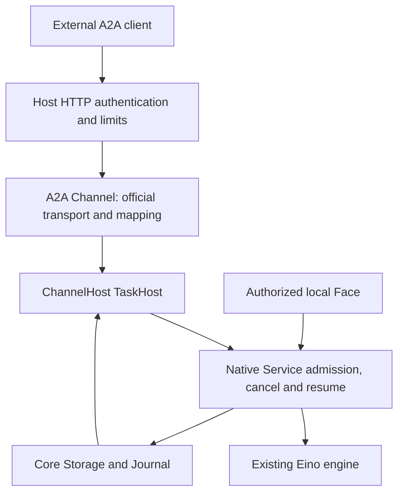

# A2A Server architecture — issue #2

Status: **DRAFT FOR OWNER REVIEW — architecture only; implementation unscheduled**

Date: 2026-10-07 (Asia/Shanghai)

Issue: [#2](https://github.com/ProjectViVy/agent-vivy/issues/2)

Research: [pre-design materials](https://github.com/ProjectViVy/agent-vivy/issues/2#issuecomment-6020157108)

Repository baseline: `dd78fcf142f384d47ce5cfefb43738fdb9a7346d`

SDK reference: `a2a-go/v2 v2.6.0`, `ebf17c56ef7e63c72883a45454a538bbc0df66b8`

## 1. Decision and approval boundary

Use a T2 `projectvivy/a2a-server` Channel Module whose custom official-SDK `RequestHandler` translates A2A requests into an optional, protocol-neutral ChannelHost `TaskHost`. Mount the SDK JSON-RPC/SSE handler on a dedicated Host-owned HTTP listener. Native sessions, Runs, admission receipts, Journal, policy and Eino execution remain authoritative. The material alternative is the SDK default handler with a custom TaskStore; reject it because the default handler also owns execution management, queues and task mutation. Direct transport reuse needs a small adapter and explicit validation, but avoids reconciling two task lifecycles. This choice follows the inspected SDK constructor boundaries and VIVY's existing atomic admission and committed-event paths.

This draft proposes one change to issue #2's acceptance wording: standard A2A reconnection recovers a current task snapshot and subsequent ordered events, not an exact replay of every event missed while disconnected. Section 8 explains the evidence and alternatives. The issue's stronger wording remains unresolved until owner approval; this document does not silently waive it.

Design review may approve this architecture without scheduling implementation. Neither this draft nor the existing `SUPPORTED` status of `std/channel@v1` establishes that TaskHost, an A2A endpoint, or an interoperable plugin exists. No product source, public interface or default Recipe is changed by this delivery.

## 2. Scope and PENS boundary

The first complete slice supports authenticated inbound text tasks, context reuse, durable message deduplication, get/list/cancel, JSON-RPC with SSE, local human approval, and ordinary remote answers to a pending input question **after the native continuation gate passes**. A2A wire version is `1.0`; the SDK's `/v2` module version is unrelated.

PENS remains an independent application environment. PEN installation, activation, application state, event selection and attention belong there. A PENS component may eventually call this server as an authenticated A2A client; it is not a prerequisite or part of the VIVY runtime. In particular, receiving a QQ group event in PENS does not automatically require creating a VIVY Run. PENS can choose to collect events and request a later batch observation. VIVY then governs the admitted task normally.

Inbound-only is this issue's scope, not a claim that A2A as a protocol is one-way. VIVY calling PENS tools/applications or delegating to another agent requires separately approved outbound integration. Do not add that integration to this server.

Excluded: outbound A2A, NeuroLink, push callbacks/webhooks, gRPC/REST bindings, protocol extensions, signed cards, public registries, tenant administration, remote approval decisions, arbitrary remote files/URLs, and model/tool selection through protocol metadata. Text-only keeps the first contract independent of unfinished attachment delivery. Other part types are rejected, never silently dropped.

## 3. Current implementation and required changes

| Inspected baseline | Design consequence |
|---|---|
| `sdk/port/channel/channel.go` has an empty `TaskLifecycle`; capability discovery deliberately ignores it | Introduce a real optional Host interface; do not report the placeholder as implemented |
| `PublishInbound` parses `/approve`, `/deny`, `/pending`, silently rejects some senders and drops unsupported parts | Task requests need their own strict admission path; never feed A2A text to this chat parser |
| `RunWithOptions` uses native admission, detaches admitted work from HTTP/RPC cancellation and launches the existing engine | Reuse this ownership; a disconnected client must not cancel its task |
| `CommitContinuityRun` already commits a message, Run, startup events and receipt together | Extend/reuse native admission; do not build plugin deduplication or a parallel task database |
| Ordinary primary admission also captures immutable prompt state and enforces primary-run ownership; TODO already tracks `MASK-CONTINUITY-SNAPSHOT` because continuity admission omits that snapshot | Preserve these guarantees and resolve that dependency when adding the external admission scope; forwarding to the current continuity branch is insufficient |
| `persistAndPublish` commits before publishing; terminal Journal append precedes the separate Run-status update | Journal wins over lagging row state and process-local notifications |
| Native `AnswerQuestion` resumes the same Run, but labels the answer `local_user` and writes question state and Journal separately | A remote continuation cannot be a direct forwarding wrapper; add native actor-aware atomic acceptance and recovery |
| `grantedChannelHost` embeds the base `channel.Host` interface | Optional methods would disappear through this wrapper unless explicitly preserved with a grant-checked adapter |
| `ListenHandler` already returns an `http.Handler`; the inspected ChannelHost does not yet serve this surface | Reuse the declaration and implement Host lifecycle; do not let the Module call Listen/Serve |
| Provider IDs, legacy `vivy.<name>` stripping and Module IDs are not the same identity | Carry the resolved Module ID from Assembly; do not derive authority from a channel display name |

Primary source paths are collected in section 14. These are source findings, not results from running the proposed implementation.

## 4. Ownership and composition



| Component | Owns | Must not own |
|---|---|---|
| Assembly | Module/provider identity, effective grants, immutable inclusion and Inspect | Dynamic discovery/loading of server code |
| Host HTTP boundary | Bind address, TLS/authentication, route scope, principal context, quotas and shutdown | A2A task execution |
| A2A Module | Official wire types, method/error mapping, SDK transport, card serialization | Credentials, listener creation, native service/storage imports, task mutation or approval decisions |
| ChannelHost TaskHost | External context ownership, admission authorization, native operation delegation, safe task projection | Another agent loop or independently mutable task state |
| Native Service/Core Storage | Admission transaction, native cancellation, question continuation, recovery, committed history | Protocol-specific objects or SDK dependencies |

Module source is `plugins/a2a-server/`, with its own `go.mod` and `vivy-module.yaml`; it provides `std/channel@v1`, requires `core/channel-host@v1`, and requests `channel.a2a`. The channel instance key is `a2a`. Use provider ID `a2a` so the current binding derives that key without reserving a new `vivy.*` identity; retain `projectvivy/a2a-server` as the distinct Module ID. Assembly conformance must verify both identities and grant lookup.

The Recipe explicitly selects this Module. No `net.client` or `secret.read` grant is required for the text-only server: authentication and transport security are Host responsibilities. The Module's `Start` prepares handlers without opening a socket; `Stop` releases adapter resources. Existing `Instance.Send` is not a task-delivery mechanism and returns a typed unsupported error if called. No `ChannelDeliveryStore` intent is created for these tasks.

Remove the unused empty `TaskLifecycle` placeholder as part of the eventual public-SDK compatibility review. Do not add task methods to base `channel.Host`. A separate grant-checked Host wrapper implements TaskHost only when the native facility and `channel.a2a` grant are available. Other Channel wrappers must not accidentally advertise it. `CapabilitySource` continues to disclose the real provider/instance capability target, not wrapper method sets.

## 5. Proposed TaskHost contract

The following is a proposed API shape, not compiled SDK code. It lives in the existing public Channel package and contains no A2A, Eino, internal domain, raw Journal, storage or credential types.

```go
type TaskHost interface {
    SubmitTask(context.Context, TaskRequest) (TaskRef, error)
    GetTask(context.Context, TaskQuery) (TaskSnapshot, error)
    ListTasks(context.Context, TaskListQuery) (TaskPage, error)
    CancelTask(context.Context, TaskQuery) (TaskSnapshot, error)
    SubscribeTask(context.Context, TaskSubscription) (TaskStream, error)
}
```

Returning a snapshot from CancelTask, rather than only an error, lets the wire response report the committed state that actually exists. Cancellation acceptance is not proof that `run.cancelled` has committed.

| Type | Required meaning |
|---|---|
| `TaskRequest` | Caller message ID, optional context ID, optional existing task ID, bounded text parts. Existing task ID selects ordinary pending-input continuation, never a new Run or approval |
| `TaskRef` | Durable task ID, context ID and whether this was a deduplicated acceptance; returned only after commit |
| `TaskQuery` | Task ID, optional expected context ID, optional history limit |
| `TaskListQuery` | Optional context/state/update-time filters, page size/token, history limit and include-artifacts flag |
| `TaskSnapshot` | IDs, projected state and timestamp, safe status message, bounded task-local history/artifacts, opaque internal revision |
| `TaskSubscription` | Task ID and optional Host-issued cursor for internal catch-up; no remote ownership assertions |
| `TaskStream` | `Next(ctx) (TaskUpdate, error)` and idempotent `Close() error`; snapshot first without cursor, then ordered safe updates; EOF after a terminal or interrupted state is delivered |
| `TaskUpdate` | Snapshot/status/artifact variant, stable artifact/message IDs and an opaque Host cursor; no raw event payload |
| `TaskPage` | Tasks, total count under the authorized scope, applied page size, opaque next token |
| `TaskError` | Typed code, safe message, retryability and optional bounded retry delay; diagnostic cause remains local |

Authentication establishes a Host-private context value bound to Module, channel instance and principal. TaskHost rejects calls without that binding, even if the plugin manufactures message metadata or passes `context.Background()`. No public `WithPrincipal(string)` setter is introduced. This enforces the supported path; a compiled T2 Module remains trusted in-process code, not a security sandbox.

Use a separate small optional `TaskServiceInfoHost` reader to obtain the safe discovery view: public endpoint, supported wire-independent operations/content modes, public skills and limits. This prevents card construction from importing Inspect internals or expanding TaskHost into a service locator. Its only consumer is the A2A adapter.

## 6. Identity, authorization and atomic admission

`taskId = run_id`; `contextId = session_id`. A context may contain successive native Runs. Only Runs admitted through this A2A instance are remotely visible; sharing a session with other native activity does not expose its complete transcript or child Runs.

Authentication initially uses Host-resolved bearer credential references mapped to stable principal IDs. `allow_from` contains these IDs, not payload sender strings or token bytes. Credential rotation preserves the principal identity. Each operation checks the principal, instance, owned context and task; list totals and page tokens obey the same filter. A foreign task is indistinguishable from a missing task. A supplied context must already be owned; an omitted context causes Host allocation. Neither an arbitrary client session ID nor knowledge of a local Face session grants access.

### New task acceptance

1. Host validates authentication, grants, body size and rate/concurrency bounds. Adapter validates protocol shape, user role, message ID, text parts and requested output modes.
2. Resolve a durable receipt keyed by `(channel instance, principal, message_id)`, before allocating a context. This also deduplicates retries that omitted `contextId`.
3. Match a canonical hash of execution-affecting input: explicit context selector, task selector, ordered normalized text and the fixed task profile. JSON-RPC ID, transport mode, wait mode and requested history length are not execution input. Same key/hash returns the original IDs; different input is a conflict. A retry should preserve the original execution selectors.
4. For a new request, native admission atomically commits context allocation/ownership when needed, message, primary Run, immutable prompt capture, startup Journal records and receipt. Preserve native session gates, workspace/policy defaults and one-primary-run enforcement. An external principal never obtains `HumanAdmission` merely by using A2A.
5. Launch the existing engine only for a newly committed admission. Return original identity for replays. After an ambiguous commit, look up the receipt; do not invent a second Run or delete possibly committed resources. Crash recovery follows native Run policy; it may fail an interrupted Run durably rather than re-execute effects.

Core-owned external ownership and receipt records may require paired SQLite/Postgres migrations. They are an authorization/idempotency index, not a second TaskStore: they do not own task status, outputs or execution. Reuse existing continuity receipt/admission machinery where its guarantees fit; extend the native admission transaction for absent contexts, principal scope and prompt capture. `BeforeStart` cannot substitute for an atomic commit because its separate write can survive a failed admission.

Retain receipts for the supported retained-task lifetime. Explicit task/context deletion revokes access and retains a minimal receipt tombstone so a retry cannot silently create fresh work. Garbage-collection and any finite deduplication window must be an explicit contract change, not opportunistic cleanup. The first implementation must demonstrate bounded receipt lookup and expose retention cost; it does not claim unlimited storage for free.

### Ordinary input continuation

An existing task ID is accepted only for an owned, nonterminal Run with exactly one pending ordinary question. Resolve an omitted context from the task; reject an explicit mismatch. Scope the message receipt before checking current state, so retrying an accepted answer after completion returns the original task.

Add an internal actor-aware native operation that atomically binds the message to the pending question, records the answer, appends the answer Journal event and commits its receipt. The actor is the authenticated external principal. It must never write ApprovalStore. Resume uses the same Run and Eino checkpoint via the existing Service; it does not call `Runner` from the plugin. Recovery must either resume the durably accepted answer under native execution ownership or commit an honest failure, never leave a consumed answer permanently parked or duplicate its effects.

This is a release gate, not an assertion about today's `AnswerQuestion`. Do not advertise remote continuation or emit a remotely answerable prompt until atomic acceptance, identity attribution, restart and duplicate-answer checks pass. A transport-only prototype can reject continuation, but cannot close the complete issue acceptance on that basis.

Completed/failed/canceled tasks are not reopened. A later turn uses a new message ID with the same owned context and no task ID. A new turn against a busy context receives a retryable native admission conflict; the adapter does not create a parallel queue.

## 7. Protocol operations and projection

Use the A2A 1.0 method names provided by the pinned SDK, not old `message/send` or `tasks/resubscribe` examples.

| Wire operation | Host operation and result |
|---|---|
| `SendMessage` | Submit, then get a Task. `returnImmediately=true` returns after durable admission. Otherwise wait for terminal/interrupted state within a bounded request deadline; loss/timeout of the waiter leaves the task running |
| `SendStreamingMessage` | Submit once, then snapshot-first subscription to the accepted task; SDK encodes events |
| `GetTask` | Authorized task-local snapshot reconstructed at a committed watermark |
| `ListTasks` | Authorized filters and bounded pagination; respect history and artifact options |
| `CancelTask` | Authorize, invoke native Run cancellation, return observed committed snapshot; never cancel a whole session or sibling Run |
| `SubscribeToTask` | Current Task, then updates while actively running; close after terminal or interrupted state. An already terminal task returns unsupported-operation; an already interrupted task returns its snapshot and closes |
| Four push-config methods | Required methods on SDK RequestHandler, all return push-not-supported |
| `GetExtendedAgentCard` | Return unsupported-operation because extended-card capability is false; extended-card-not-configured applies only to declared support without a configured card |

The custom RequestHandler must perform capability checks and protocol validation that SDK `NewHandler` normally performs. Enforce A2A version/service parameters, unsupported tenant/extension requests and content negotiation. Unknown metadata cannot choose a model, tool set, sandbox, approval policy, principal or source session. Reject requested unsupported behavior before admission. No task is created merely to represent a malformed or unauthorized request.

| Native committed condition | Protocol state | Rule |
|---|---|---|
| Accepted/queued native Run, when present | `SUBMITTED` | Do not fabricate a queued task before admission commits |
| `run.started`, active work or committed resumption | `WORKING` | Sparse progress messages may describe safe stages |
| Pending `user.question_required` | `INPUT_REQUIRED` | Expose a safe prompt only when the native continuation gate is enabled |
| Pending `tool.approval_required` | `AUTH_REQUIRED` | Human authorization is out of band through the local Face; no remote approval capability |
| `run.completed` | `COMPLETED` | Success follows native terminal truth |
| `run.failed` | `FAILED` | Sanitized reason; do not expose internal errors |
| `run.cancelled` | `CANCELED` | Only after durable cancellation |
| Pre-admission rejection | Protocol error, no Task | Native Run has no rejected state to invent |

The table uses readable state suffixes; the SDK emits the actual A2A 1.0 wire enums. Run rows alone cannot distinguish waiting for approval/input from working. Project from committed events with terminal precedence and settled-interaction precedence; a decided/answered interaction must not remain visibly pending. If row state lags a terminal Journal event, the latter wins.

Task history contains only the task's external user messages, safe agent text and approved interaction prompts. It is not session history. Raw tool arguments/results, reasoning, model request prompts, policy internals, paths, credential names and checkpoint data are excluded. Principal ownership alone is not permission to export every Journal field.

First-slice output uses committed assistant text segments, not token-level SSE. Reuse the native projection semantics for `model.delta` and `model.completed` digest/length validation; `model.completed` v2 contains a checksum, not text. Use deterministic artifact IDs derived from Run and committed segment identity. Full artifact replacement with `append=false` makes snapshot reconciliation unambiguous. Tool start/finish can emit sanitized progress statuses, but tool output is not automatically an artifact. An incomplete segment is not advertised as completed output.

Snapshot/history/artifact bounds apply before serialization. An oversized projection produces a typed resource-limit error; do not silently truncate a successful artifact or change a successfully completed native Run to failed merely because transport projection failed. The underlying task remains queryable with smaller supported history/artifact options. Detect digest/schema corruption as a projection failure and retain local diagnostics.

For every `historyLength` field on send/get/list, validate before admission or history loading: negative is invalid; zero omits history; omitted means no client-imposed cap and uses the Host's 64-message maximum; positive uses `min(requested, 64)`. Apply this also to blocking-send responses. Bounded retrieval/projection work is required, not merely trimming an already allocated full history.

## 8. Durable streaming and the reconnect decision

There are two separate contracts:

1. **Inside VIVY:** committed Journal sequence is the durable order. Host cursors may include projection version, Run identity, sequence and output ordinal, bound to the caller scope. A cursor is opaque outside Host and does not grant access.
2. **Across standard A2A:** recover a nonterminal task through `SubscribeToTask`, replacing local state with its first Task snapshot. A reconnect may yield only that snapshot, for example when interrupted. For an already terminal task, use `GetTask` after the subscription's unsupported-operation result. VIVY supplies subsequent ordered updates while an active subscription is attached; there is no claim of observing every transient status emitted while disconnected.

SDK v2.6.0 supports direct `NewJSONRPCHandler(RequestHandler)`, but its SSE writer creates a random UUID for each event and its client parser reads data without retaining SSE IDs. Its JSON-RPC transport has no `Last-Event-ID` recovery contract. The A2A subscription request supplies a task ID, not a durable replay offset. An SDK internal queue cursor does not change this wire contract.

**Recommended approval:** replace issue #2's wire-level “no duplicate or lost committed updates after disconnect” criterion with: “current retained task state and artifacts converge after reconnect; updates within an attached stream follow committed order without gaps caused by the Host's replay/live transition.” Preserve strict native replay guarantees internally. Clients reconcile stable artifact IDs and do not concatenate a fresh snapshot onto old output.

**Alternative if exact replay is mandatory:** keep the issue blocked until a separately approved extension specifies request cursor transport, event identity, retention, expired-cursor errors and replay ordering. This expands the currently deferred extension scope and likely needs a different SSE writer/client path; merely setting `Last-Event-ID` cannot make the pinned SDK comply. No extension is introduced by this draft.

Host subscription algorithm: authorize, register a bounded live notification, capture a committed watermark, build a safe snapshot through it, then tail Journal after it. Notifications are wakeups, not history. Deduplicate by the internal sequence/ordinal and resubscribe before catch-up after a dropped notification queue. Re-read on a bounded periodic wakeup as well, covering commit-before-publish crashes. Terminal delivery must drain the committed tail because the existing bus closes rather than sends the terminal frame. Never hold a database transaction or Run admission gate while writing to a slow socket.

SSE write failure/timeout releases the subscriber, not the Run. A slow client can reconnect to a fresh snapshot. Subscribing after terminal validation races safely: if termination occurs after acceptance, emit the snapshot/remaining terminal update and close; if it was already terminal before acceptance, return the protocol error and let the client use GetTask. A new SendStreamingMessage that finishes immediately may return its terminal Task snapshot.

Both `INPUT_REQUIRED` and `AUTH_REQUIRED` end the current response stream after their snapshot/status update is delivered; they do not end the Run. The client answers an ordinary input question through SendMessage, or waits for local out-of-band authorization and queries/subscribes again. Do not copy SDK `taskupdate.IsFinal` blindly: v2.6.0 treats input-required as final there but handles auth-required separately for blocking sends. The custom iterator must explicitly cover both interrupted states, including local approval racing stream closure.

## 9. Human approval and cancellation

An A2A credential authorizes task operations, not local administrative identity. `/approve`, `/deny` and `/pending` received as A2A content never dispatch chat commands. Neither a new message, metadata nor an ordinary input answer may approve tool execution. Do not reuse chat `DecideApprovalAsActor` injection in the TaskHost adapter.

Project pending native approval as `AUTH_REQUIRED` with a bounded explanation to use the authorized local Face; do not expose a writable approval endpoint or claim that an OAuth token approves the tool. New remote messages targeted at this waiting task receive unsupported-operation, with no acceptance receipt; previously accepted message retries still resolve their receipt first. This deliberately declines the protocol's recommended negotiation-message behavior rather than acknowledging and silently dropping messages. Existing native approval expiration/fail-closed behavior remains authoritative. A missing local review surface cannot leave a task waiting indefinitely; integration must prove native expiry/cancellation and terminal projection.

CancelTask requests cancellation of exactly the mapped Run. If it races with completion, committed terminal truth wins. Repeating cancellation of an already canceled task can return that snapshot; other terminal states return task-not-cancelable. HTTP disconnect, SSE close and disabling the ingress endpoint are not cancellation requests. Native app shutdown/recovery retains its established behavior; the plugin does not invent a new shutdown terminal reason.

## 10. HTTP lifecycle, discovery and resource limits

Use a dedicated listener, separate from the management gateway and its `/rpc` routes. Host mounts only `POST /a2a` and `GET /.well-known/agent-card.json`. The existing `ListenHandler` can return the adapter router for these two paths; Host controls its bind and outer middleware. Route collisions are startup errors. `:8787` is not reused.

Extend the typed Channel envelope with an optional Host-owned HTTP configuration for listener, public base URL, transport security, credential-to-principal references and limits. Keep A2A presentation settings in the Module's opaque settings. This is a proposed config change, not currently accepted YAML. Compiled-but-unconfigured and disabled instances perform no networking. An enabled instance with no allowlisted credential, endpoint, grant or TaskHost fails closed and reports unhealthy in Inspect.

Require authentication even on loopback. Default binding is loopback with an explicitly configured port. Nonloopback additionally requires Host TLS, or an explicitly configured trusted reverse proxy arrangement with a restricted backend; a supplied forwarding header is not authentication. Validate advertised HTTPS URL against the configured deployment. Never derive public URLs from untrusted Host/forwarded headers. Host resolves secrets and strips authentication headers before handing the request to the SDK; a private authenticated context survives the SDK's context wrapping.

The discovery card can be publicly readable on this dedicated endpoint, with only safe public information. Build it from the safe Generation/Inspect-derived discovery view plus validated endpoint configuration. Expose only reachable enabled interfaces, version `1.0`, actual text/streaming support and configured public skills. Public skill descriptions are explicit projections of enabled capabilities, not raw tool schemas or SKILL.md contents. No push/extended-card/extension claim. Host limits without standard card fields belong in operator configuration/documentation, not invented wire fields.

Host starts the listener only after adapter construction and dependency validation. On stop it rejects new admissions, drains/closes HTTP streams within a deadline, then stops the adapter before storage teardown. Disabling/removing a plugin stops ingress but preserves native history; pending work remains governed by native runtime policy. An omitted Module yields no route, listener, settings card or official SDK dependency in the artifact.

Initial proposed safety defaults, to validate in the compatibility probe rather than describe as measurements:

| Bound | Proposed value/behavior |
|---|---|
| JSON request | 256 KiB hard maximum; text length also bounded by native admission |
| Concurrent accepted work | Existing native global/session bounds plus 4 active tasks per principal; no adapter queue |
| Live subscriptions | 2 per task, 16 per principal; 64 pending notification slots per subscriber |
| History | Omitted: Host cap 64; zero: none; positive: smaller of request and 64; negative: invalid |
| List page | SDK protocol default 50, maximum 100; validate negatives and excessive sizes |
| Serialized response/frame | 1 MiB hard cap, enforced for snapshots, pages and updates before write |
| HTTP timing | 5 s header read, 15 s individual write, 60 s blocking-send wait, 15 s SSE keepalive, 10 s shutdown drain |

Limits are Host policy with effective values visible in Inspect; reuse existing stricter native caps. Ordinary HTTP body deadlines must not accidentally impose the blocking-send timeout on a live SSE stream. Rate rejection occurs before admission and returns a safe retry signal. A reply limit must never trigger an automatic retry of an already committed execution.

List queries operate on principal-filtered native Run/ownership indexes and Journal-derived task projections. Use deterministic descending committed status-time ordering with Run ID as tie-breaker; opaque tokens bind filters, principal, instance and a query watermark. Do not paginate an SDK in-memory store. Status changes between pages can alter membership; document this consistency limit rather than promising a global snapshot. State caches, if later measured necessary, must be rebuildable and versioned, never another authority. Bound scan work as well as returned page size; exceeding it returns a limit error, not an invented total.

## 11. Errors and failure behavior

| Condition | Public result | Native effect |
|---|---|---|
| Missing/invalid credential | HTTP authentication failure before dispatch | No admission |
| Valid credential without instance grant | Denied | No admission |
| Missing/foreign task or context | Safe not-found result | No cross-principal disclosure |
| Bad IDs, role, content shape or context/task mismatch | Invalid params / incompatible content | No admission |
| Same message ID with different execution input | Invalid params with safe conflict explanation | Original receipt remains authoritative |
| Native busy/quota | Retryable busy/resource error; HTTP 429 where rejected before dispatch | No hidden queue or duplicate Run |
| Unsupported push/extended card/version | SDK-defined error | No side effects |
| Store failure before commit | Unavailable/internal error with correlation ID | No success claim |
| Lost response or ambiguous commit | Retry/receipt lookup returns original IDs if committed | Never submit a replacement merely because response was lost |
| Corrupt/oversized projection | Safe internal/resource error | Do not rewrite native task status |
| Bus drop or lost publish | Journal catch-up | Committed events remain authoritative |
| Request disconnect | Release request/stream resources | Admitted Run continues |
| Approval/question expiry | Native terminal projected when committed | No remote approval fallback |

Use SDK error constants for standard errors. Protocol-neutral Host errors are mapped at the adapter; nonstandard busy/limit cases use a documented server-error classification and bounded retry detail, not an invented A2A standard error. After SSE headers are sent, use the SDK's stream error representation/close behavior, not a second HTTP status. Tokens, raw errors and native payloads must not be embedded in these errors or SDK logs.

## 12. Gates and acceptance evidence

These gates identify required proof; they are not an implementation schedule or task-by-task execution plan.

| Gate | Exit evidence |
|---|---|
| G0: contract approval | Owner decision on section 8; freeze TaskHost/type semantics, identity, config, projection and normal-input boundary; reconcile historical CH-C9/Channel Pack statements |
| G0: SDK probe | A minimal real custom RequestHandler satisfies all 11 methods with v2.6.0; official client validates card/version/methods, snapshot-first SSE, errors and cancellation without NewHandler/TaskStore/AgentExecutor |
| G1: native authority | Both storage backends prove atomic missing-context admission, receipts, prompt capture, ownership filtering, cancellation and actor-aware question continuation/restart |
| G1: streaming | Snapshot/watermark races, notification drops, commit-before-publish, slow clients, terminal race and projection corruption behave as sections 7–8 specify |
| G2: artifact integration | Selected Recipe compiles/verifies/packs; Inspect is truthful; omitted Recipe has no A2A SDK/route/listener/settings surface; existing Channels and Faces regressions pass |
| G2: complete issue | Real official client drives a tool-using native Run and gets terminal artifacts; approved reconnect criterion and local approval behavior pass; required `just ci`, Module conformance and iteration logs are present |

Critical fixtures: two principals guessing each other's IDs/page tokens; simultaneous identical sends with no context; same ID/different body; crash after admission commit before reply; native busy session; `/approve` as plain input; ordinary answer duplicate and crash recovery; approval expiry without a Face; cancel-vs-complete; durable terminal with stale Run row; reconnect while artifacts change; oversized/corrupt Journal projection; endpoint omitted/disabled/nonloopback misconfigured. Use isolated temporary databases/workspaces, never production user data.

The official SDK client is the primary interoperability fixture. A2A CLI/ITK can supplement it after compatibility is checked; tool existence or a passing transport-only mock is not full acceptance.

## 13. Contract adoption and rollback

After owner approval, reconcile `docs/plans/channel-epic/CH-C9.md`, `VIVY-CHANNEL-PACK.md` (including the old `eino-ext/a2a` assumption and chat approval exception), Port/Module conformance references, and issue #2. This draft links the historical note but does not turn its deferred implementation status into a schedule. Ordinary SDK optional-interface additions need compatibility tests for existing channel constructors and grant wrappers.

All database changes belong to Core Storage with paired immutable SQLite/Postgres migration IDs. The plugin runs no DDL and owns no database. Rollback disables the instance or deploys a Recipe omitting the Module; it does not delete sessions, Journal, admission receipts or ownership records. A binary rollback across new migrations requires a separately verified schema-compatibility window; “remove the plugin” is not a database down-migration plan.

Owner review should confirm the architecture and the recommended standard reconnect guarantee. If exact event replay remains required, keep G0 open and design the extension before scheduling implementation. Input continuation remains part of the complete target and is blocked on its concrete native gate, not delegated to the A2A SDK.

## 14. Evidence and verification limits

Repository evidence at the baseline above:

- [Channel SDK](../../../sdk/port/channel/channel.go), [capability discovery](../../../internal/channelhost/capabilities.go), [ingress parser](../../../internal/channelhost/dispatch.go), [Host environment](../../../internal/channelhost/channelenv.go), [assembly channel wrapper](../../../internal/app/channels.go).
- [Native Service](../../../internal/runtime/service.go), [Eino engine](../../../internal/runtime/engine.go), [message projection](../../../internal/runtime/message_projector.go), [Run states](../../../internal/domain/run.go), [event vocabulary](../../../internal/domain/event.go).
- [Continuity contract](../../../internal/storage/continuity.go), [SQLite admission](../../../internal/storage/sqlite/run_admission.go), [Postgres admission](../../../internal/storage/postgres/run_admission.go), [Journal contract](../../../internal/storage/contracts.go), [notification bus](../../../internal/events/bus.go), [existing control stream](../../../internal/rpc/control.go).

External primary references inspected:

- [SDK RequestHandler and default constructor](https://github.com/a2aproject/a2a-go/blob/v2.6.0/a2asrv/handler.go), [JSON-RPC transport](https://github.com/a2aproject/a2a-go/blob/v2.6.0/a2asrv/jsonrpc.go), [SSE writer/parser](https://github.com/a2aproject/a2a-go/blob/v2.6.0/internal/sse/sse.go), [wire request types](https://github.com/a2aproject/a2a-go/blob/v2.6.0/a2a/core.go), [error constants](https://github.com/a2aproject/a2a-go/blob/v2.6.0/a2a/errors.go).
- [A2A 1.0.0 pinned specification](https://github.com/a2aproject/A2A/blob/173695755607e884aa9acf8ce4feed90e32727a1/docs/specification.md), with [published 1.0.1 subscription reference](https://a2a-protocol.org/v1.0.1/specification/#316-subscribe-to-task) checked for snapshot-first and terminal-task behavior. This does not certify every patch-level difference.
- [Eino v0.9.13 Runner source](https://github.com/cloudwego/eino/blob/v0.9.13/adk/runner.go), commit `c5e6aef927cca02bea934541f8dff2ea711b2ca7`: existing `NewRunner`, `Run` and `ResumeWithParams` cover execution and resumption. This proposal adds transport/admission projection, not a custom LLM orchestration substitute. It does not adopt the historical EinoExt example server.
- [PENS decisions](https://github.com/ProjectViVy/pens/blob/main/docs/DECISIONS.md) supply the application-environment boundary from the preceding research; A2A does not make PENS a VIVY subsystem.

This delivery performs source inspection and documentation review only. No SDK compile probe, server run, protocol conformance run, storage migration, performance measurement or native behavior test is claimed. Go and `just` are unavailable in this execution environment. Those gates remain explicit rather than being inferred from source compatibility.
