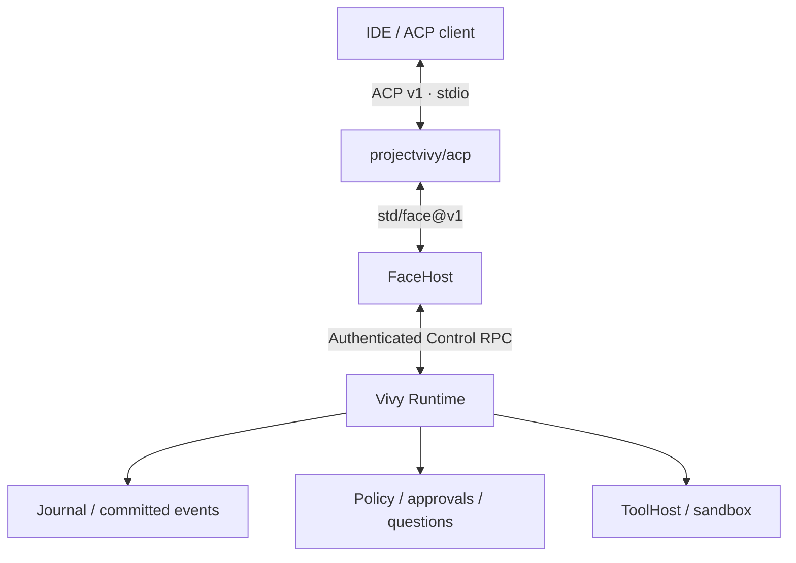
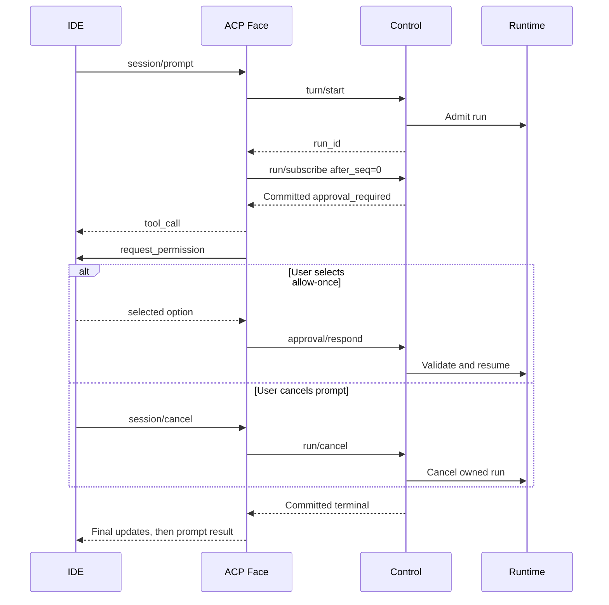

# ACP stdio Face — Detailed Pilot Design

Created: 2026-10-06; detailed revision: 2026-10-07 (Asia/Shanghai)\
Status: **Restricted pilot scope approved; detailed design for review; G0 open; G1 not scheduled**\
Owner: [agent-vivy Issue #1](https://github.com/ProjectViVy/agent-vivy/issues/1)\
Repository baseline: [dd78fcf142f384d47ce5cfefb43738fdb9a7346d](https://github.com/ProjectViVy/agent-vivy/tree/dd78fcf142f384d47ce5cfefb43738fdb9a7346d)\
Protocol baseline: ACP wire version 1, schema-v1.21.0\
Candidate SDK: github.com/eino-contrib/acp v0.0.4\
Review draft: docs/superpowers/specs/2026-10-07-acp-stdio-face-design.md
Canonical destination after G0 review: docs/architecture/ACP-STDIO-FACE.md
Conditional implementation package: [ACP pilot plan](../plans/2026-10-07-acp-pilot/README.md)

## 1. Decision and success condition

Build one exclusive T2 Face Provider, projectvivy/acp, translating local ACP requests into the existing authenticated FaceHost Control RPC. Keep all execution, workspaces, approvals, questions, cancellation and durability in Vivy. This is the smallest viable choice because FaceHost already supplies the required authority path. A new control transport Host would duplicate authority; a CLI wrapper would add a process boundary without improving the contract. The remaining cost is explicit protocol projection and several small host/launcher seams, identified below.

Success means an IDE can launch a generated ACP artifact, create a session for its chosen project, send a prompt, see ordered committed message/tool updates, answer approvals and questions, and cancel that session's run. The resident gateway's Journal and lease remain separate.

On 2026-10-07 the owner explicitly approved **restricted ACP v1 as the pilot** and requested detailed design. The pilot requires mcpServers=[] and makes no full-baseline conformance claim. This records the approved scope; SDK acceptance, the additional interface decisions below and G1 scheduling remain separate. This document replaces the earlier architecture draft rather than creating a parallel specification.

## 2. Module and authority boundaries

| Concern | Owner / contract |
|---|---|
| Module identity | projectvivy/acp, T2 trusted native code, source plugins/acp |
| Contribution | std/face@v1 Provider; core/face-host@v1 Consumer dependency |
| Grant | rpc.client only |
| Cardinality | 0..1 Face per Generation |
| Selection | Explicit pinned Recipe selects ACP and excludes Web/TUI Face implementation |
| Protocol types | Confined to plugins/acp; never exposed in sdk/port/face |
| Agent execution | Existing Service.Run and Eino engine |
| Durable state | Existing Session, Run, Journal, approval and question stores |
| Files and processes | Existing ToolHost, workspace manager, Sandbox and Policy |
| Transport ownership | Launcher supplies stdin/stdout/stderr; ACP owns protocol processing |
| Persistence in adapter | None; connection maps, sequence counters and bounded projection state only |



The adapter never imports agent-vivy/internal packages, instantiates an Eino runner, reads a Journal, obtains credentials, starts an MCP process, or bypasses a Host. Same-process T2 is a trust classification, not an OS sandbox.

Run metadata uses the existing **face=code** profile in the pilot. The actual transport identity remains projectvivy/acp in Generation/Inspect. The current closed runtime Face vocabulary rejects acp, and FaceCode supplies coding instructions without companion-persona onboarding. Adding another runtime Face enum would require a separate cross-schema decision; it is unnecessary for this integration.

## 3. Scope decision and remaining design decisions

### D1 — Restricted pilot scope (owner approved)

The pinned ACP schema explicitly requires agents to support client-supplied stdio MCP servers. Disabling mcpCapabilities.http and sse does not disable that baseline requirement. Issue #1 specifies filesystem/process governance but does not define session-scoped installation of client MCP configurations.

| Approach | Effect | Recommendation |
|---|---|---|
| Restricted pilot: require mcpServers=[] | Rejects nonempty configurations before creating a session; cannot claim full ACP v1 baseline compliance | **Selected by the owner, 2026-10-07** |
| Full baseline: admit session-scoped stdio MCP through existing MCPHost | Needs ephemeral configuration ownership, tool isolation, command/env admission, cleanup and secret handling in the core Host path | Deferred; reopen through a separate explicit scope decision |

Never silently ignore mcpServers, treat its command as permission to execute, write it into shared settings, or implement a second MCP manager inside the plugin. Existing MCPHost and the quarantined MCP adapter are the extension point if full baseline support is reopened. Its separate design is not a prerequisite for this restricted pilot.

### D2 — Paths and privacy

Interpret the issue's path rule as **no disclosure of internal host paths in agent-to-client payloads**. ACP necessarily receives an absolute cwd; file resource links may also contain absolute client-selected paths. Validate these as untrusted input through existing host authority.

The first cut omits optional ACP locations and diffs, rather than emitting relative paths in fields that require absolute paths. Output must not expose private instance paths, credential paths, or an unredacted selected workspace root. This clarification must replace the current blanket wording in Issue #1 and the canonical design when approved.

### D3 — Candidate dependency remains provisional

v0.0.4 exposes the required main connection methods and a method named UnstableCreateElicitation whose wire method is elicitation/create. Its name alone does not establish stable-schema incompatibility. Conversely, static field similarity is not proof of compatibility.

The dependency gate must also cover bounded dispatch, cancellation responsiveness, shutdown and logging. Do not approve the pin or replace it automatically from this draft.

## 4. Launcher and private runtime

Add a generic **vivy face** command that dispatches before normal gateway stdout logging. IDE configuration points the generated artifact at this command. It runs RuntimeAssembly.Face; there is no hard-coded ACP plugin import or runtime plugin discovery. An artifact without a selected Face fails with a stderr diagnostic.

The existing gateway, vivy run and vivy-code entry behavior remains unchanged. The new command rejects prompt/continue flags: stdin belongs to the selected protocol Face.

Recipe selection alone is not proof of physical omission: cmd/vivy references runTUI, and executable packing currently calls buildWebUI unconditionally. The selected design adds a generic recipe entrypoint=face and a thin cmd/vivy-face launch target, sharing a host launcher with the normal command. Section 12.1 defines packing and omission precisely. This is an executable entry-point choice, not a new Port or transport.

Keep the Face Provider/Instance lifecycle unchanged. Add stdin to Options; section 12.5 defines one optional host presentation facet required by ACP, because the inspected raw event interface does not itself enforce the outbound privacy contract:

```go
type Options struct {
    In io.Reader // optional for existing Faces; mandatory for ACP
    // Existing fields remain unchanged.
}
```

Refactor private-instance allocation out of internal/codeface/launch.go into a small host-side helper reusable by codeface and the generic launcher. Do not import codeface from the ACP launch path: it imports the TUI implementation and would defeat physical omission.

Reuse allocation of the private SQLite Journal, log directory and lease, plus shared operator settings. **Do not copy Prepare's local-world binding unchanged.** It currently fixes all file tools to the process launch directory, whereas ACP must honor each accepted session's cwd.

For ACP, compose the existing session-aware workspace manager over a private fallback workspace root. Bind session/create.workspace_path to the validated ACP cwd. Keep the existing session-aware AGENTS.md backend. The process launch directory may be used for bootstrap discovery, but never substitute it for an accepted session's tool root.

Before starting ACP I/O:

1. Initialize bootstrap diagnostics on stderr.
2. Resolve the compiled Face and allocate the private instance.
3. Use internal/logging.Setup with stdout disabled and the private log directory.
4. Build the app without ears or gateway and obtain the authenticated FaceHost.
5. Pass In/Out/Err to the constructed Face instance.

Resource-context resolution also needs a focused core correction: turn/start.context_paths currently resolves against a process-level ProjectRoot. For ACP sessions it must resolve against the server-stored session workspace, with the existing containment, sensitive-path, symlink and size checks. Keep a documented fallback for existing callers without explicit session workspace selection.

## 5. Connection, sessions and capabilities

Connection states: Created -> Initialized -> Serving -> Draining -> Closed. Register FaceHost.OnEvent before any run subscription. Reject session operations before initialization. Respond with protocolVersion=1, including when the client's latest version differs; the client must decide whether it can continue with that version. Reject duplicate initialize as invalid request without resetting established capabilities.

One stdio connection owns one adapter instance and one private runtime. It may create multiple real Vivy sessions. A session may have at most one active prompt; other sessions can run independently subject to an explicit connection-wide limit.

A session map stores the real session ID, canonical host-validated workspace, and active prompt state. Prompt state stores the ACP request context, run ID when available, cancellation latch, subscription ID, next Journal sequence, pending interaction IDs and final-response state. It is correlation state, not a second run store.

Initialization checks required Control capabilities: session, turn, run, run.subscribe, approval, question, review and code_mode_available. Missing required authority is an initialization failure, not a reduced adapter that hangs later.

Advertise:

- protocolVersion: 1; agentInfo derived from the build.
- loadSession: false.
- promptCapabilities: image=false, audio=false, embeddedContext=false.
- mcpCapabilities: http=false, sse=false; D1 still governs mandatory stdio MCP.
- No session lifecycle extensions, remote authentication methods, custom methods or additionalDirectories support.
- Do not call client filesystem or terminal methods even if advertised.
- Use elicitation.form only when the client explicitly supplies a non-null form object. Absence, null, or elicitation={} provides no form support.
- Permission requests are a base method; there is no invented permission-UI capability flag. A method error or unusable response must fail closed.

Supported inputs are text and resource_link. Resource links are not optional under the baseline. Convert an admitted local file URI into a project-relative context path, retaining a deterministic reference label in the prompt. The core resolves the file against the session's canonical workspace. Reject inaccessible/out-of-root/sensitive files, remote URI authorities and unsupported schemes explicitly; do not fetch URLs, read files or delegate filesystem access inside the adapter. A link-only prompt receives a deterministic user-content label so turn/start does not receive empty text.

## 6. RPC mapping and ownership

| ACP / trigger | Vivy call | Completion rule |
|---|---|---|
| initialize | initialize / capabilities | Return only capabilities this adapter and this runtime can serve |
| session/new | session/create {workspace_path: cwd} | Return the real session ID; do not forward the raw session result |
| session/prompt | turn/start {session_id, text, face: code, context_paths} | Keep ACP request open until terminal processing finishes |
| Prompt accepted | run/subscribe {run_id, after_seq: 0} | Replay covers events committed before subscription |
| Committed event | OnEvent(run/event) | Validate, order, project to ACP updates |
| session/cancel | run/cancel for the mapped active run | Cancel that prompt only |
| Approval choice | approval/respond | Runtime validates pending state and expiry |
| Elicitation accept | question/respond | Runtime validates answer and pending state |
| Elicitation decline/cancel | review/respond {review_id, action: cancel, reason} | Preserve question cancellation without inventing an answer |
| Prompt cleanup | run/unsubscribe | Release only its own subscription |

If cancel arrives while turn/start is in flight, latch it. Once the run ID arrives, immediately cancel that run. Never lose cancellation because the map has no run ID yet. Serialize prompt admission/finalization per session, and use a prompt generation token so a late response cannot mutate a newer prompt.

Do not retry an ambiguous turn/start as a new run. If admission success cannot be correlated, terminate that connection and let the private app shut down. There is no cross-launch resume promise.

## 7. Ordered committed output

The server emits committed events in sequence, but internal/rpc.Peer dispatches callbacks concurrently. Arrival order at the plugin callback is therefore not a sufficient guarantee.

Use one per-run ordered reducer:

1. Register a bounded ingress callback before subscribing.
2. Validate run ID, payload version and sequence; ignore another run.
3. Buffer out-of-order events and release only the next contiguous sequence.
4. Ignore already processed duplicates; advance sequence for deliberately unprojected event types too.
5. On a persistent gap, overflow, malformed required payload or run/stream_error, fail the prompt explicitly and cancel the affected run. Do not continue with a broken transcript.
6. Serialize outgoing updates through the SDK writer. Return the final prompt response only after all preceding update writes complete.

The callback must not wait on an approval/elicitation response. Dispatch reverse requests separately and feed their results back into the run state. This prevents a pending user dialog from blocking cancellation, expiry or terminal events.

| Committed event | ACP projection |
|---|---|
| model.delta | Accumulate a bounded incomplete line; emit completed, host-sanitized lines as agent_message_chunk |
| model.completed v2 | Verify original delta length/SHA-256, sanitize and flush any remaining line; emit no duplicate full response |
| tool.requested | tool_call with opaque stable ID, sanitized title, kind and pending status |
| tool.started | tool_call_update: in_progress |
| tool.finished | tool_call_update: completed or failed; bounded safe content only |
| tool.approval_required | Request permission after the tool call is visible |
| user.question_required | Form elicitation when supported |
| Approval/question terminal event | Resolve local pending state; reject stale replies |
| run.completed / run.cancelled / run.failed | Finalize the outstanding prompt exactly once |

Tool IDs are deterministic opaque hashes of connection nonce + session ID + run ID + tool_call_id, with length-prefixed inputs, so they remain unique across successive turns without a second ID store. Do not copy raw tool args, raw result JSON, model request payloads, provider metadata, Journal envelopes, reasoning traces or child runtime state into ACP.

Hash verification is over original committed model bytes, before output redaction. Unsupported completion versions fail explicitly. The current product emits v2; cross-launch legacy replay is out of scope.

## 8. Human interaction and cancellation

**Approvals.** Present only allow_once and reject_once. Map them to approved and denied in the existing approval API. Do not offer allow_always/reject_always until an existing policy operation implements exactly those semantics. Validate option IDs against the actual outstanding request. A cancelled dialog without a session cancellation conservatively denies that approval; when session cancellation is already in progress, let Runtime cancellation settle the interaction. Unsupported UI, invalid choice or reverse-RPC failure cannot grant permission.

**Questions.** Represent ask_user as a flat form containing one required nonempty string field, answer. Carry the real session and opaque tool-call scope. On accept, validate shape and length before question/respond. On decline/cancel, use review/respond cancellation. Do not manufacture an empty answer. If form is unavailable, cancel the question with a clear reason through the existing review path. URL elicitation and secret collection are not part of this cut.

For both, correlate connection generation + session + run + interaction ID. expires_at and Runtime state remain authoritative; local timers only stop waiting. On expiry/cancellation/terminal events, detach the local reverse request, discard any later reply, and never resurrect the interaction. A stale or conflicting host response is not permission to retry a decision.

**Prompt cancellation.** A valid session/cancel is a notification, so it gets no separate response. The outstanding prompt must ultimately return cancelled when cancellation wins before final response commitment, even if underlying work reports an exception. Drain updates already committed before the terminal boundary. If a prompt already completed and its final response was committed, a later cancellation is a no-op. An unknown session notification cannot affect any run.

Runtime failure remains a failure: never label provider/internal errors as successful end_turn.

## 9. Stop reasons and errors

| Outcome | ACP result |
|---|---|
| Durable run.completed, healthy projection | stopReason=end_turn |
| Client cancellation accepted for active prompt | stopReason=cancelled |
| Durable run.cancelled without client cancellation | Request-cancelled error (-32800), with a safe reason |
| run.failed | Safe error; do not invent an ACP success stop reason |
| Invalid shape/unsupported advertised-off input | Invalid params (-32602) |
| Unknown session or inaccessible resource | Resource not found (-32002), without private paths |
| Unsupported method | Method not found (-32601) |
| Session busy / admission limit | Server busy (-32001); no new run |
| Stream integrity failure / unexpected host failure | Internal error (-32603), safe correlation ID |
| EOF/broken pipe | No fabricated protocol response; connection teardown |

Do not infer max_tokens or max_turn_requests from generic failure strings, and do not translate one denied tool into refusal. ACP refusal carries conversation-history semantics the current mapping does not implement.

Translate typed RPC errors through an errors.As-compatible code interface; do not import internal/rpc in the plugin or parse human-readable error strings. The inspected internal/rpc.Error currently has exported fields and Error(), but no structural code accessor. Add a small RPCErrorCode() int method there, or an equivalent SDK-owned error projection in FaceHost, before the adapter relies on this contract. Code translation must be checked against the actual Vivy error constants and ACP SDK helpers during G0. Construct safe ACP errors with no raw error data: the candidate SDK's ErrInternalError helper can otherwise include originError text.

## 10. Bounds, shutdown and data protection

Proposed pilot defaults below are design values, not measured performance claims:

| Bound | Proposed behavior |
|---|---|
| Sessions per connection | 32; reject new sessions beyond the cap |
| Active prompts | 4 globally, 1 per session; reject immediately rather than queue |
| Inbound ACP frame | 1 MiB using the SDK's public stdio option |
| Prompt text | 256 KiB total; reject before turn admission |
| Project resources | Reuse core limits: 8 files, 1 MiB each, 4 MiB total |
| Question answer | 64 KiB maximum; no empty accepted answer |
| Ordered event buffer | 256 events and 8 MiB per active run, counting ingress and reorder storage together |
| Incomplete model line | 64 KiB per active model stream; suppress an oversized line with an explicit marker |
| Outbound ACP frame | 256 KiB encoded; split safe text content, never arbitrary JSON |
| Pending reverse requests | 16 per connection; exceed -> cancel the affected run, never auto-approve |
| SDK pending dispatch | Required target: 64 frames; needs public control in the selected dependency |
| Missing sequence | 5 seconds before failing the affected projection |
| Individual host control call | 10 seconds, excluding the long-lived prompt wait |
| Reverse user interaction | Runtime expires_at; no independent approval-extension timer |
| Shutdown | Bounded cancellation, flush and joins; target 10 seconds for the whole launcher |

Four active prompts leave capacity in the candidate SDK's eight-worker pool for control operations. This is not a proof against flooding: v0.0.4 also has a 4096-entry intake cap and its tuning options live in an internal package. At a 1 MiB frame limit, the conservative queue bound is still too large to accept without further proof or dependency changes. Its 30-second shutdown/write defaults also need reconciliation with the proposed launcher deadline. **These are G0 blockers, not claimed guarantees.** Do not reach into SDK internals, fork its codec, or claim adapter limits bound queues that are allocated before adapter handlers run.

The SDK defaults to full-frame Debug access logging. Set its public logger to LevelDisabled before opening the transport; use Vivy's existing logger for adapter-owned metadata-only diagnostics. Do not restore unsafe logging while any SDK worker remains alive.

All output uses an allowlisted projection and the concrete TextPresentationHost contract in section 12.5. Reuse the core credential/email rules and redact known private/workspace roots. The line buffer prevents a value split across model chunks from bypassing whole-value checks. This is protection for known roots and established sensitive patterns, not a claim to identify arbitrary encoded secrets. Approval previews must remain understandable after redaction; an unusable preview fails closed.

EOF, broken pipe, signal or fatal transport failure enters Draining: reject admissions, cancel active runs through Control while it is still available, settle pending interactions through Runtime, unsubscribe, stop adapter workers, close the ACP transport, then let FaceHost close its peer and app. The launcher owns final stream closure to unblock stdio; existing Face callers may leave In nil. Joining/closing behavior must be tested with real OS pipes, not only byte buffers.

Retain private launch state for existing diagnostic/retention behavior. Never delete the selected user project or resident Journal during cleanup.

## 11. Eino and SDK capability check

The existing engine owns adk.NewChatModelAgent, adk.NewRunner and checkpoint/resume behind internal/runtime; ACP calls Service.Run through Control and adds no LLM pipeline. The relevant native ACP candidate is github.com/eino-contrib/acp, using only its root types, conn and transport/stdio.

| Surface inspected | Finding | Evidence status |
|---|---|---|
| FaceHost / Control | Existing authenticated in-process path and required core methods | Source verified |
| ACP base methods | Candidate has agent handlers and reverse permission/update methods | Source verified |
| Elicitation | UnstableCreateElicitation uses the expected wire method; known form/action variants exist | Wire fixtures and runtime compatibility still required |
| stdio transport | Public reader/writer constructor, size option, serialized writes | Real-pipe behavior untested |
| SDK logging | Raw Debug frames enabled by default; public SetLogger can disable | Source verified; leakage test required |
| Dispatch / cancellation | Eight workers, 4096 pending queue, internal tuning API | Release suitability unresolved |
| Dependency surface | go.mod includes HTTP-related dependencies | Imported/link graph and artifact omission untested |
| Current local runtime prep | Pins local-world root to launch directory | Must reuse storage isolation separately from workspace selection |

No SDK replacement, upgrade, vendored schema, hidden raw transport import or dependency-default change is approved by this draft.

## 12. Detailed implementation contract

The interfaces and file ownership in this section are proposed implementation contracts, not claims that these APIs already exist. This is design decomposition. At the owner's request, the linked package now sequences G0 investigation and conditional G1 work before G0 closure; it does not make unresolved interfaces or dependency choices execution-ready.

### 12.1 Build, entrypoint and configuration

Add one optional Generation Recipe field, entrypoint, with default gateway and alternative face, for executable targets. Validate it in the compiler; include its value in canonical Recipe hashing and Inspect's launch projection. A face entrypoint requires exactly one selected std/face Provider and no Web UI root/contributions. Incompatible combinations fail at pack time. Non-executable targets retain their own launch contract.

For entrypoint=face, build ./cmd/vivy-face with the existing vivy_headless embedding exclusion, skip buildWebUI, and seal the existing empty-UI artifact representation. Keep the artifact executable's conventional name, so its invocation is still vivy face. Accept no arguments as an equivalent launch in this artifact; --help and --inspect-generation are separate CLI modes and do not start ACP. Help goes to stderr. Do not place an ACP dependency behind a runtime switch in the universal command.

cmd/vivy-face is a thin call into internal/faceprocess. The normal cmd/vivy command may dispatch face to that same helper before logger setup. Neither launcher imports plugins/acp; the generated assembly supplies its Provider. Existing default recipes keep entrypoint=gateway, and existing vivy-code remains on its local-project contract.

ACP Recipe requirements:

| Field | Required design value |
|---|---|
| entrypoint | face |
| Module source | Explicit plugins/acp source plus generated digest; no placeholder digest in a real build |
| Face provider ID / kind | projectvivy.acp / acp |
| Exclusive std/face@v1 module | projectvivy/acp |
| Required Host | vivy/face-host |
| Effective module grant | rpc.client |
| UI selections | None |
| Core execution modules | Existing coding runtime, model, ToolHost, storage, checkpoint, credential, sandbox and protected tools |
| Client MCP configuration | Not admitted or persisted |

Recipe contents are validated against the current module dependency graph; the table is not a copy-pastable recipe with guessed module pins. Core configured tools remain governed by the assembled Runtime. The adapter makes no settings mutations.

Omission proof must show absence of plugins/acp from an artifact that omits it, and absence of TUI renderer/controller/Face implementation and Web assets from the ACP artifact. Existing reusable command/i18n helpers under sdk/tui that Control already imports are not another active Face; do not turn their directory name into an unrelated relocation project.

The private-runtime helper allocates storage and logging only. The ACP caller selects session-aware workspace composition; the codeface caller explicitly selects its existing fixed local-world composition. This prevents an extraction from silently changing either product.

### 12.2 Package responsibilities and change surface

| Proposed location | Responsibility |
|---|---|
| plugins/acp/module.go, vivy-module.yaml, go.mod | Descriptor, Provider and pure construction |
| plugins/acp/agent.go | ACP handlers, initialization, session ownership and SDK connection |
| plugins/acp/prompt.go | Prompt admission, run/subscription state, cancellation and finalization |
| plugins/acp/projection.go | Committed-event reducer, tool/status mapping and bounded text emission |
| plugins/acp/interactions.go | Permission and elicitation correlation, reply validation and expiry |
| plugins/acp/control.go | Narrow private Control DTOs, RPC helpers and typed error translation |
| plugins/acp/transport.go | SDK stdio setup, logging disablement, connection close coordination |
| sdk/port/face | Optional In plus TextPresentationHost types; no ACP schema types |
| internal/app/facehost.go | Implement host text presentation; preserve authenticated Control ownership |
| internal/faceprocess; internal/codeface | Shared private-instance allocation and face launch lifecycle |
| internal/rpc | Error-code accessor and session-scoped project-context root selection |
| sdk/internal compiler/packer | entrypoint validation, isolated build target, UI omission, Inspect evidence |
| recipes/acp.vivy.yml | Explicit pilot generation and source pins |

These are responsibility boundaries, not a file-count target. Keep small cohesive pieces together when splitting adds no clarity. Test files accompany behavior; no new framework, registry, event bus or persistent adapter store.

Required Control call allowlist inside the adapter: initialize, session/create, turn/start, run/subscribe, run/unsubscribe, run/cancel, run/get, review/get, approval/respond, question/respond and review/respond. This allowlist is an implementation constraint, not a new security boundary for trusted T2 code.

### 12.3 Admission and state transitions

Connection state owns immutable negotiated capabilities, the session map, admission counters, and the SDK lifetime. Each session owns a mutex and at most one prompt slot. Each admitted prompt owns a generation number, run ID, subscription identity, reducer, interaction cancellation group and one final-result channel. Do not hold a session/global lock during any RPC, SDK write or wait for user input.

| Prompt state | Input | Action / next state |
|---|---|---|
| Idle | Valid prompt | Atomically reserve session slot and global capacity -> Starting |
| Starting | Cancel | Set cancelRequested; retain slot until start result is known |
| Starting | turn/start succeeds | Store run ID; create sanitizer; subscribe; apply cancellation latch -> Running or Cancelling |
| Starting | Definite admission rejection | Release slot -> Idle; safe ACP error |
| Starting | Ambiguous timeout / transport loss | Never resubmit; drain connection and private Runtime |
| Running | Approval / question event | Register bounded pending interaction; keep reducer responsive |
| Running | Cancel | Latch once; issue run/cancel -> Cancelling |
| Running or Cancelling | Committed terminal + healthy output | Drain/finish projection -> Finalizing |
| Finalizing | Response decision committed | Return one SDK result; unsubscribe; release slot -> Idle |
| Any admitted state | Integrity/overload/output failure | Cancel run; error if writable; otherwise drain connection |

A prompt slot is not released merely because run/cancel returned. Keep it until finalization, preventing a new run from inheriting late notifications. Cleanup is idempotent and exact-owner checked. Capture the prompt generation in every asynchronous completion; an old response cannot target the current slot.

Register the run route before run/subscribe. While its response is pending, buffer matching run events without displaying them; bind and verify subscription_id when the response arrives, then release contiguous events. This handles a fast replay callback winning the race against response processing. Count pending session/create reservations against the connection session cap, and release a reservation on a definite failure.

Final-result precedence is explicit: an unwritable transport produces no fabricated reply; an admitted client cancellation produces cancelled; otherwise projection failure produces an error; otherwise the committed Runtime terminal determines the result. A cancellation result never claims that partially displayed content was complete or that external effects were rolled back.

Define cancellation's linearization point at the adapter's serialized admission/finalization decision. There is an additional SDK requirement: a prompt received before its cancel notification must be registered as pending before that cancellation is admitted. A FIFO queue feeding concurrent workers does not by itself prove this. The G0 fixture must exercise immediate cancel while the prompt worker is deliberately delayed; if the candidate fails, require upstream ordered admission support. Do not retain an idle cancellation and apply it to an unrelated future prompt.

Initialization is connection-wide and serialized. Duplicate initialization never clears owned sessions. Cancellation of an unknown/idle session is a no-op with a metadata-only diagnostic; it never creates session state. Unknown sessions on requests return -32002 before any Control call.

### 12.4 Input and wire contract

The pilot's initialization response has protocolVersion=1, loadSession=false, image/audio/embeddedContext=false, http/sse=false, sessionCapabilities={}, and authMethods=[]. agentInfo uses the actual artifact identity/version and a human-readable pilot title. Do not invent a no-stdio-MCP capability; document the restriction in the artifact README and return a precise error when encountered.

For session/new, validate the entire request before creating a durable session:

1. Require an absolute, nonempty cwd without NUL/control characters.
2. Require mcpServers to be an array and empty; reject nonempty values with -32602 and reason CLIENT_MCP_UNSUPPORTED. Do not echo commands, environment or headers.
3. Reject nonempty additionalDirectories; there is one root per session.
4. Enforce session-count capacity, then call session/create with workspace_path.
5. Store the returned real ID and canonical root only after success. Return only sessionId to ACP.

ACP session IDs from another connection are unknown even if they resemble a valid Vivy ID. The adapter never offers session/load or reconstructs its map from the Journal.

For session/prompt, validate every block before turn/start; reject the whole prompt on an unsupported block. Concatenate text blocks in input order with deterministic separators. Convert resource links to a reference label at their original position and an ordered, deduplicated context_paths list. Names/descriptions are untrusted user content, never system instructions.

Admitted resources are local file: URIs with no credentials, query, fragment or remote authority. Support the target OS's native file URI form, including Windows drive letters, and reject UNC/device forms in the pilot. Decode once, reject encoded separators/traversal tricks, and compute a relative candidate against the stored canonical root. This is only preliminary validation: the core must resolve/open it against the durable session root, reject symlink escape and sensitive paths, and enforce its content limits.

Unknown URI schemes fail explicitly. image, audio and embedded resource content are not accepted. A link-only request becomes a deterministic reference prompt plus context_paths. Empty/whitespace-only text with no usable links is -32602. Oversized input is rejected without starting a run.

Private Control DTOs must contain only used fields and JSON tags, with schema/source references in their tests. ACP DTOs always come from the selected SDK; never duplicate its generated schema.

### 12.5 Concrete outbound text boundary

Add the following optional, ACP-independent facet in sdk/port/face:

```go
type TextSanitizer func(string) string

type TextPresentationHost interface {
    TextSanitizer(ctx context.Context, runID string) (TextSanitizer, error)
}
```

ACP's Provider requires this facet and fails construction if unavailable. Existing Face implementations and the base Host interface remain source compatible. The facet supplies no credential or path list to the plugin and cannot execute actions.

FaceHost validates the run through its authenticated Control path and captures the immutable run/session workspace plus its known private runtime/log roots. It returns a deterministic closure that reuses internal/logging.Redact and replaces workspace prefixes with a neutral workspace marker while suppressing private roots. Resolve this snapshot once per run, not once per token, and discard the closure with the prompt. No copied secret-pattern registry or new redaction configuration is introduced.

The plugin feeds this closure complete display units:

- Titles and question text: whole bounded strings.
- Approval preview: bounded structured fields formatted as human-readable text, then sanitized.
- Tool output: bounded text projection, never rawInput/rawOutput or copied Journal JSON.
- Model output: complete lines assembled from committed deltas, plus the last partial line only at model.completed.

A 64 KiB incomplete line switches to suppression until its next newline or model completion; emit one explicit content-omitted marker, continue the original-byte hash, and do not silently truncate. Delayed partial lines are released at model.completed, so output order is defined by the source event that releases each safe unit. There is no promise of one ACP notification per model token.

This is an intentional latency tradeoff: a long reply without newline may first become visible at model completion. Tool and interaction updates remain event-driven. Verify this presentation with the selected IDE during acceptance; token-immediate redaction requires a separately justified streaming sanitizer.

Hash original model bytes continuously. At model.completed v2, validate both byte_len and content_sha256 before flushing the tail. Already displayed complete lines cannot be retracted; on mismatch terminate the prompt with an integrity error and never report end_turn.

Representable-path tests cover native separators, slash variants and JSON-escaped path text. The Host must either sanitize a value within the documented policy or suppress that display unit. Do not pass raw internal errors, snapshot objects, stack traces or logs through this facet as a substitute for an allowlist.

### 12.6 Tool and interaction projection

Use kind=other unless an existing stable tool identity supplies a clear category. Do not infer authority, risk or approval needs from the tool's display name.

On the first committed event mentioning a tool, ensure a tool_call exists before any tool_call_update or permission request. Derive the same opaque ID every time. Each update's content field replaces the collection; include the intended current bounded content, not an append fragment that would erase earlier context incorrectly.

Approval display obtains review/get for the committed approval ID. Cross-check run ID and tool-call ownership. Present action, target, preview and available risk description as sanitized text. Do not serialize Arguments wholesale. If the action cannot be described adequately without unsafe output or truncating an essential command/target, deny with an unsupported-presentation reason; never ask the user to approve a context-free tool name.

Offer exactly two option IDs for this request: allow-once and reject-once, carrying ACP kinds allow_once and reject_once. Accept only one of those options in a selected outcome. Permission cancellation/invalid outcome follows section 8. Only committed approval_decided/expired/cancelled events advance the durable-looking tool display.

Form elicitation uses mode=form, the real sessionId, opaque toolCallId, and requestedSchema with type=object, one string property answer, required=[answer], and no arbitrary additional business fields. A response action=accept must contain precisely the allowed answer shape, non-whitespace content and at most 64 KiB encoded UTF-8. Decline and cancel are distinct diagnostic reasons but both invoke existing question cancellation. URL mode, nested objects, sensitive-data forms and unknown actions cannot be interpreted as acceptance.

Reverse RPC responses arriving after local cancellation or Runtime expiry are discarded. If a decision RPC times out ambiguously, do not repeat it with a different choice: inspect its committed event/review state; if uncertainty persists, cancel the run. A successful control response does not authorize inventing a missing Journal event.



### 12.7 Error translation and safe diagnostics

Implement RPCErrorCode() int on internal/rpc.Error. In the plugin, use errors.As against that structural interface. Preserve wrapped causes in core diagnostics while translating to fixed client messages.

| Core / adapter condition | ACP code / stable reason |
|---|---|
| -32602 / validated bad input | -32602 / INVALID_INPUT |
| -32004 missing owned resource | -32002 / RESOURCE_NOT_FOUND |
| Local session slot busy | -32001 / SESSION_BUSY |
| Local session/global admission cap | -32001 / CAPACITY_EXCEEDED |
| -32009 stale approval/question | Consume as stale interaction; no grant/retry |
| Other -32009 admission conflict | -32001 / RUN_CONFLICT |
| Missing core method required at startup | -32603 / REQUIRED_CAPABILITY_UNAVAILABLE |
| Unsupported ACP method | -32601 / METHOD_UNAVAILABLE |
| Event sequence/digest failure | -32603 / STREAM_INTEGRITY_FAILED |
| Unknown core error or malformed core result | -32603 / INTERNAL_FAILURE |

Reason strings live in error data, not custom ACP methods, and are documented adapter semantics. Do not reuse Vivy's -32004 for ACP ResourceNotFound. Core runtimeError does not currently classify every storage conflict; do not guess a more specific result when it returns generic -32603.

Log only stage, safe reason, session/run IDs, event sequence, method and durations/counts. SDK raw logging stays disabled regardless of VIVY_LOG_LEVEL. Human text, tool args, answers, source bytes and MCP environment values are not diagnostic fields. Absolute paths may exist in private host diagnostics under existing policy, but must not be forwarded to the ACP client or attributed to an adapter guarantee that all host logs are path-free.

### 12.8 SDK compatibility decision and bounded transport

Keep v0.0.4 as the evaluation baseline. **It is not release-approved as-is.** Preferred resolution is a minimal upstream/public API correction followed by an explicitly reviewed exact pin. Do not add an independent JSON-RPC dispatcher, private-package import, vendored generated schema, or remote transport.

Required SDK outcomes:

| Area | Observed source | Required acceptance |
|---|---|---|
| Main methods | Public agent connection and reverse update/permission calls exist | Compile and exercise real typed calls against the pinned schema |
| Elicitation | Stable wire method exposed with an Unstable name | Marshal/decode known form and actions; unknown actions cannot grant/answer |
| Intake cap | Default 4096; setter in internal/jsonrpc | Publicly set 64 pending frames; overflow terminates deterministically |
| Worker pool | Eight concurrent handlers | Four active prompt limit and proven responsive control/cancel admission |
| Admission ordering | Shared FIFO consumed by concurrent workers | Prompt-then-cancel race cannot lose cancellation before slot registration |
| Shutdown | Internal 30-second default | Public timeout control or proven owner-driven closure within launch budget |
| stdio write | Serialized writer; a timed-out OS write can finish later | Treat write timeout as fatal; close stream and never emit a replacement success |
| Wire errors | ErrInternalError may serialize originError; panic path includes stack text | Generic internal failures must carry no internal cause/stack on the wire |
| Logging | Full frames at default Debug | Public LevelDisabled applied before I/O; no frame leak under failure |
| Link closure | Module has HTTP-related requirements | Actual selected Go package/link graph excludes those transport surfaces |

Publishing aliases for existing connection options is preferable to reimplementing queue behavior. Error sanitization must cover the SDK's own decode/panic/response paths, not only errors returned by the plugin. If ordered admission or safe errors require upstream changes, those belong in the dependency compatibility decision and its isolated patch, not in an ACP-specific Vivy control server.

The proposed queue ceiling bounds encoded backlog to approximately 64 MiB at a 1 MiB frame limit, before decoded objects, active handlers and runtime allocations. This is a sizing bound, not an RSS/performance measurement. Verify actual memory and backpressure in the spike; adjust the constant before release if needed.

No remote connection, extra model call, daemon or process broker is introduced. The dependency check uses fake Control and a scripted ACP peer first; real-model/client smoke is the later product proof.

### 12.9 Teardown and observable completion

On healthy EOF while idle: close ACP processing, release the Face, close the private app, return process success. Per-prompt failure does not necessarily kill a healthy connection. Malformed transport, oversize frame, output timeout, overload or ambiguous admission is connection-fatal.

Use separate lifetime contexts for ACP transport and the still-live host teardown path. Cancelling the ACP connection must not cancel the only context available to run/cancel. A single monotonic shutdown deadline applies across all stages; nested calls receive the remaining budget.

Order: close admission -> mark active prompts cancelled locally -> issue bounded run cancellations and detach reverse waits -> drain committed terminal/final output if the pipe is healthy -> unsubscribe and join reducer workers -> close SDK streams -> close Control/app/storage. For a blocked/broken pipe, close it immediately and perform host cleanup without attempting further protocol output.

If the total 10-second target expires, return a shutdown failure and let the owning process exit; do not claim all goroutines or effects have completed. OS termination cannot promise that external commands rolled back. The launcher must retain evidence that cleanup timed out. Verify platform pipe closure and app shutdown before accepting this budget.

Recommended process exits: 0 clean EOF/shutdown, 1 startup/transport/integrity/cleanup failure, 2 invalid CLI invocation. A cancelled individual prompt returns cancelled within ACP and leaves the process available.

### 12.10 Acceptance matrix

| ID | Scenario | Required observable result |
|---|---|---|
| ACP-01 | Packed artifact initialize/new/prompt from real client | Valid NDJSON, real session, final end_turn |
| ACP-02 | Nonempty mcpServers; image/audio; extra root | Explicit error before session/run side effects |
| ACP-03 | Process starts in A, session cwd is B | File tools, resource context and project instructions use B |
| ACP-04 | seq=3 arrives before 2; duplicate 2; immediate terminal replay | One ordered projection; no duplicate display or hang |
| ACP-05 | Model token/root split across chunks; final partial line | Sanitized display, exact original hash verification |
| ACP-06 | Two sessions active; cancel one before run ID | Only the targeted prompt is cancelled |
| ACP-07 | Delayed prompt admission followed immediately by cancel | Cancellation is not lost or applied to a later prompt |
| ACP-08 | Allow/deny/invalid permission reply; late approval reply | Only valid live allow-once can resume an effect |
| ACP-09 | Form accept/decline/cancel/unavailable/expiry | Existing question state remains authoritative |
| ACP-10 | Broken pipe, blocked stdout, EOF, signal, queue flood | No replacement success; bounded termination evidence |
| ACP-11 | Source/frame/SDK panic errors seeded with paths/secrets | Safe wire errors and no SDK frame logging |
| ACP-12 | Default and ACP recipes packed separately | Default behavior preserved; real implementation/assets omitted correctly |

G0 produces a compatibility report with exact SDK ref, fixture results, gaps and dependency decision. G1 produces the implementation plus conformance/Inspect evidence and a real-client transcript. An experimental TCK run is useful additional evidence, not full conformance certification; tests outside the restricted scope must be reported as unsupported rather than quietly skipped into a green claim.


## 13. Verification contract and G0 closure

Required evidence is organized around product risks, not implementation-shaped tests:

- Schema fixtures against schema-v1.21.0: initialization, text/resource-link prompts, permission responses, form accept/decline/cancel, unknown variants and invalid input.
- Source/build graph: public import firewall, no Eino leakage, no ACP SDK HTTP/WS/proxy/Hertz/Gin transport surfaces in the selected package/link closure, no TUI/Web Face implementation dragged in through private-runtime reuse. Existing core/model/tool networking remains outside this SDK-import restriction.
- Stream races: callbacks delivered out of order, duplicate replay, fast terminal before subscribe returns, gap/overflow, v2 digest mismatch, final response after final update.
- Session races: cancel before run ID, two concurrent prompts in one session, independent runs in two sessions, late permission/question response, cancellation versus completion.
- Workspace: cwd different from process launch directory; tools, context reads and AGENTS.md all use the selected session workspace; cross-root resource rejection.
- Privacy: seeded recognized secrets absent from protocol output and adapter diagnostics; private/workspace roots absent from protocol output; chunk-split roots and malformed requests covered; SDK logging disabled. Existing private host diagnostic paths follow the distinction in section 12.7.
- Lifecycle: EOF, blocked stdout, broken pipe, signal, startup failure and bounded exit with no orphaned run or leaked worker.
- Product proof: packed artifact launched by a real ACP client, tool turn, approval allow/deny/unavailable UI, Ask User accept/cancel/expiry, session cancellation isolation.
- Repository gates: FaceHost/adapter tests, verify/pack/Inspect, source-hash-bound conformance, physical omission tests, just ci and iteration log.

G0 closes only after:

1. D1 scope is approved. Owner reviews the detailed design, especially D2 path wording, the optional text presentation facet, and the documented line-buffering tradeoff.
2. Candidate SDK compatibility and resource/shutdown controls have executable evidence; dependency choice is revised if necessary.
3. The outbound redaction contract is shown implementable without leaking secrets or raw events.
4. Canonical docs replace stale all-ACP-is-remote/WONT-DO statements: ACP-REMOTE-CONTROL-PROPOSAL.md, VIVY-FACE-PACK.md and docs/TODO.md.
5. The reviewed contract names supported operations, limits and real-client expectations. Reconcile the conditional implementation package with the accepted evidence and explicitly schedule G1 before releasing its implementation Stories.

This revision records approved pilot scope and a detailed proposed contract. The ACP branch publishes this review draft, its conditional implementation package and their iteration records. No G1 schedule, dependency acceptance, executable compatibility result or product test pass is claimed. The source baseline was rechecked before branch publication and main remained at the recorded commit. Canonical contract adoption and implementation remain subject to the G0 closure conditions above.

## 14. Source index

Repository links below use the inspected commit, avoiding drift from main.

- [Issue #1](https://github.com/ProjectViVy/agent-vivy/issues/1)
- [AGENTS.md](https://github.com/ProjectViVy/agent-vivy/blob/dd78fcf142f384d47ce5cfefb43738fdb9a7346d/AGENTS.md)
- [Face Port](https://github.com/ProjectViVy/agent-vivy/blob/dd78fcf142f384d47ce5cfefb43738fdb9a7346d/sdk/port/face/face.go)
- [FaceHost](https://github.com/ProjectViVy/agent-vivy/blob/dd78fcf142f384d47ce5cfefb43738fdb9a7346d/internal/app/facehost.go)
- [Control methods and stream replay](https://github.com/ProjectViVy/agent-vivy/blob/dd78fcf142f384d47ce5cfefb43738fdb9a7346d/internal/rpc/control.go)
- [Concurrent Control dispatch](https://github.com/ProjectViVy/agent-vivy/blob/dd78fcf142f384d47ce5cfefb43738fdb9a7346d/internal/rpc/protocol.go)
- [Private code-face launch](https://github.com/ProjectViVy/agent-vivy/blob/dd78fcf142f384d47ce5cfefb43738fdb9a7346d/internal/codeface/launch.go)
- [Sandbox composition and local/session distinction](https://github.com/ProjectViVy/agent-vivy/blob/dd78fcf142f384d47ce5cfefb43738fdb9a7346d/internal/modules/sandbox/module.go)
- [Session-aware project instructions](https://github.com/ProjectViVy/agent-vivy/blob/dd78fcf142f384d47ce5cfefb43738fdb9a7346d/internal/runtime/project_agentsmd.go)
- [Current project-context resolver](https://github.com/ProjectViVy/agent-vivy/blob/dd78fcf142f384d47ce5cfefb43738fdb9a7346d/internal/rpc/project_context.go)
- [Eino engine boundary](https://github.com/ProjectViVy/agent-vivy/blob/dd78fcf142f384d47ce5cfefb43738fdb9a7346d/internal/runtime/engine.go)
- [Existing MCPHost adapter](https://github.com/ProjectViVy/agent-vivy/blob/dd78fcf142f384d47ce5cfefb43738fdb9a7346d/internal/runtime/mcpadapter.go)
- [Pinned ACP schema](https://github.com/agentclientprotocol/agent-client-protocol/blob/schema-v1.21.0/schema/v1/schema.json)
- [ACP session setup](https://agentclientprotocol.com/protocol/v1/session-setup)
- [ACP prompt lifecycle](https://agentclientprotocol.com/protocol/v1/prompt-turn)
- [Candidate SDK connection](https://github.com/eino-contrib/acp/blob/v0.0.4/conn/agent.go)
- [Candidate SDK dispatch bounds](https://github.com/eino-contrib/acp/blob/v0.0.4/internal/jsonrpc/connection.go)
- [Candidate SDK public logging control](https://github.com/eino-contrib/acp/blob/v0.0.4/logger.go)
- [Candidate SDK default logger](https://github.com/eino-contrib/acp/blob/v0.0.4/internal/log/logger.go)
- [Candidate SDK stdio transport](https://github.com/eino-contrib/acp/blob/v0.0.4/transport/stdio/stdio.go)
- [Executable packer / UI construction](https://github.com/ProjectViVy/agent-vivy/blob/dd78fcf142f384d47ce5cfefb43738fdb9a7346d/sdk/internal/frontend_v1.go)
- [Existing host redaction rules](https://github.com/ProjectViVy/agent-vivy/blob/dd78fcf142f384d47ce5cfefb43738fdb9a7346d/internal/logging/redact.go)
- [Candidate SDK error helpers](https://github.com/eino-contrib/acp/blob/v0.0.4/errors.go)
